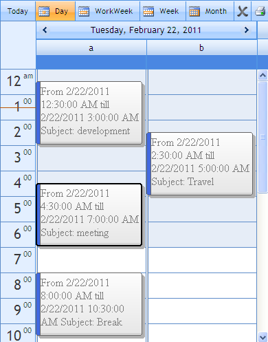

::: {style="DISPLAY: none"}
{#d2h_url_template}{#d2h_package_url style="WIDTH: 0px; DISPLAY: none; HEIGHT: 0px"}
:::

::::: {#nsbanner .d2h_main_nsbanner style="BORDER-BOTTOM: #999999 1px solid; POSITION: relative; PADDING-BOTTOM: 0px; BACKGROUND-COLOR: transparent; PADDING-LEFT: 0px; PADDING-RIGHT: 0px; DISPLAY: none; BORDER-TOP: #999999 1px solid; PADDING-TOP: 0px; LEFT: 0px"}
:::: {#TitleRow .d2h_main_titlerow style="PADDING-BOTTOM: 4px; BACKGROUND-COLOR: transparent; PADDING-LEFT: 22px; WIDTH: 100%; PADDING-RIGHT: 10px; DISPLAY: none; PADDING-TOP: 4px"}
::: {#ienav .d2h_main_ienav style="DISPLAY: none"}
{#D2HPrevious .D2HPreviousEnabled}  {#D2HNext .D2HNextEnabled}
:::
::::
:::::

:::: {#nstext .d2h_main_nstext style="PADDING-BOTTOM: 10px; BACKGROUND-COLOR: transparent; PADDING-LEFT: 22px; PADDING-RIGHT: 10px; HEIGHT: 100%; OVERFLOW: auto; PADDING-TOP: 5px" hasuserbackground="true" valign="bottom"}
::: {#d2h_breadcrumbs .d2h_breadcrumbs}
[Essential Studio User Guide Documentation](ms-xhelp:///?Id=12457748-09e3-4d74-a240-8e049cedf030){.d2h_breadcrumbsNormal}[ \> ]{.d2h_breadcrumbsLinkSeparator}[User Interface Edition](ms-xhelp:///?Id=c29296b7-531c-413b-a0ec-488ca1f7f669){.d2h_breadcrumbsNormal}[ \> ]{.d2h_breadcrumbsLinkSeparator}[Essential ASP.NET](ms-xhelp:///?Id=25c35330-c127-4dad-9a92-ed79dc7261a6){.d2h_breadcrumbsNormal}[ \> ]{.d2h_breadcrumbsLinkSeparator}[Essential Schedule]{.d2h_breadcrumbsContentsOnly}[ \> ]{.d2h_breadcrumbsLinkSeparator}[Concepts and Features](ms-xhelp:///?Id=64869483-f57f-4838-b322-b1a3d1ce8e40){.d2h_breadcrumbsNormal}[ \> ]{.d2h_breadcrumbsLinkSeparator}[Appointments](ms-xhelp:///?Id=8545e8cf-5b26-43a2-932f-f0087c9a1e0a){.d2h_breadcrumbsNormal}
:::

### Customizing Appointments Using Templates {#customizing-appointments-using-templates style="tab-stops: 0pt"}

 

Schedule control provides an option to customize the appointments. The appointments can be customized using Appointment Template. This feature is used to change the look and feel of the appointment and also include additional fields to make the application user friendly.

 

+---------------------------------------------------------------------------------------------------------------------------------------------------------+
| [ ]{style="FONT-FAMILY: 'Times New Roman','serif'"}**[\[ASPX\]]{style="FONT-FAMILY: 'Courier New'"}**[]{style="FONT-FAMILY: 'Times New Roman','serif'"} |
|                                                                                                                                                         |
| [\<appointmenttemplate\>]{style="FONT-FAMILY: 'Courier New'"}                                                                                           |
|                                                                                                                                                         |
| [            \<div\>]{style="FONT-FAMILY: 'Courier New'"}                                                                                               |
|                                                                                                                                                         |
| [                    From]{style="FONT-FAMILY: 'Courier New'"}                                                                                          |
|                                                                                                                                                         |
| [                    [\<%]{style="BACKGROUND: yellow"}\# Container.StartTime [%\>]{style="BACKGROUND: yellow"}]{style="FONT-FAMILY: 'Courier New'"}     |
|                                                                                                                                                         |
| [                    till]{style="FONT-FAMILY: 'Courier New'"}                                                                                          |
|                                                                                                                                                         |
| [                    [\<%]{style="BACKGROUND: yellow"}\# Container.EndTime [%\>]{style="BACKGROUND: yellow"}]{style="FONT-FAMILY: 'Courier New'"}       |
|                                                                                                                                                         |
| [                    Subject:]{style="FONT-FAMILY: 'Courier New'"}                                                                                      |
|                                                                                                                                                         |
| [                    [\<%]{style="BACKGROUND: yellow"}\# Container.Subject [%\>]{style="BACKGROUND: yellow"}]{style="FONT-FAMILY: 'Courier New'"}       |
|                                                                                                                                                         |
| [            \</div\>]{style="FONT-FAMILY: 'Courier New'"}                                                                                              |
|                                                                                                                                                         |
| [\</appointmenttemplate\>]{style="FONT-FAMILY: 'Courier New'"}                                                                                          |
+---------------------------------------------------------------------------------------------------------------------------------------------------------+

[]{style="FONT-FAMILY: 'Calibri','sans-serif'; FONT-SIZE: 11pt"} 

{border="0"}

Figure 81: Schedule with Customized Appointment

[]{style="LINE-HEIGHT: 115%; FONT-FAMILY: 'Calibri','sans-serif'; COLOR: #4f81bd; FONT-SIZE: 9pt"} 

More:

[ ]{#related-topics}

[{border="0" align="absMiddle"}List of Container Element](ms-xhelp:///?Id=9d925c20-8dbb-4829-9ec0-1a5a9e5cd485){style="TEXT-DECORATION: none"}
::::
