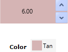
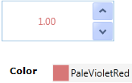
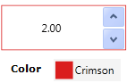
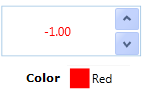
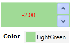
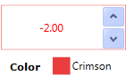
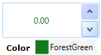

::: {style="DISPLAY: none"}
{#d2h_url_template}{#d2h_package_url style="WIDTH: 0px; DISPLAY: none; HEIGHT: 0px"}
:::

::: {.d2h_secondary_topic style="PADDING-BOTTOM: 10pt; MARGIN: 0pt; PADDING-LEFT: 0pt; PADDING-RIGHT: 0pt; PADDING-TOP: 0pt"}
#### Customizing by Using Properties {#customizing-by-using-properties style="tab-stops: 0pt"}

You can customize the appearance of the UpDown control by using the properties exposed by the UpDown control.

The appearance of the UpDown control can be changed when the UpDown control has focus by using the following properties:

[·      ]{style="FONT-FAMILY: Symbol"}FocusedBackground

[·      ]{style="FONT-FAMILY: Symbol"}FocusedBorderBrush

[·      ]{style="FONT-FAMILY: Symbol"}FocusedForeground

These properties will be enabled only if the EnableFocusedColors property is set to true.

{border="0"}

Figure 1160: FocusedBackground

 

{border="0"} 

Figure 1161: FocusedForeground

 

{border="0"}

Figure 1162: FocusedBorderBrush

 

The appearance of the UpDown control can be changed when the value in UpDown is negative by using the following properties:

[·      ]{style="FONT-FAMILY: Symbol"}NegativeBackground

[·      ]{style="FONT-FAMILY: Symbol"}NegativeBorderBrush

[·      ]{style="FONT-FAMILY: Symbol"}NegativeForeground

These properties will be enabled only if the EnableNegativeColors property is set to true.

[]{style="FONT-FAMILY: 'Trebuchet MS','sans-serif'; COLOR: #15428b; FONT-SIZE: 9pt"} 

 

{border="0"}

Figure 1163: NegativeForeground

 

{border="0"}

Figure 1164: NegativeBackground

 

{border="0"}

Figure 1165: NegativeBorderBrush

 

The color of the zero value can be changed by using the ZeroColor property. The ZeroColor property can be enabled by setting the ApplyZeroColor property to true.

 

{border="0"}

Figure 1166: ZeroColor

 

[]{#related-topics}
:::
