::: {style="DISPLAY: none"}
{#d2h_url_template}{#d2h_package_url style="WIDTH: 0px; DISPLAY: none; HEIGHT: 0px"}
:::

::::: {#nsbanner .d2h_main_nsbanner style="BORDER-BOTTOM: #999999 1px solid; POSITION: relative; PADDING-BOTTOM: 0px; BACKGROUND-COLOR: transparent; PADDING-LEFT: 0px; PADDING-RIGHT: 0px; DISPLAY: none; BORDER-TOP: #999999 1px solid; PADDING-TOP: 0px; LEFT: 0px"}
:::: {#TitleRow .d2h_main_titlerow style="PADDING-BOTTOM: 4px; BACKGROUND-COLOR: transparent; PADDING-LEFT: 22px; WIDTH: 100%; PADDING-RIGHT: 10px; DISPLAY: none; PADDING-TOP: 4px"}
::: {#ienav .d2h_main_ienav style="DISPLAY: none"}
{#D2HPrevious .D2HPreviousEnabled}  {#D2HNext .D2HNextEnabled}
:::
::::
:::::

:::::::: {#nstext .d2h_main_nstext style="PADDING-BOTTOM: 10px; BACKGROUND-COLOR: transparent; PADDING-LEFT: 22px; PADDING-RIGHT: 10px; HEIGHT: 100%; OVERFLOW: auto; PADDING-TOP: 5px" hasuserbackground="true" valign="bottom"}
::: {#d2h_breadcrumbs .d2h_breadcrumbs}
[Essential Studio User Guide Documentation](ms-xhelp:///?Id=12457748-09e3-4d74-a240-8e049cedf030){.d2h_breadcrumbsNormal}[ \> ]{.d2h_breadcrumbsLinkSeparator}[User Interface Edition](ms-xhelp:///?Id=c29296b7-531c-413b-a0ec-488ca1f7f669){.d2h_breadcrumbsNormal}[ \> ]{.d2h_breadcrumbsLinkSeparator}[Essential ASP.NET MVC](ms-xhelp:///?Id=4b14e7d1-65c4-4f67-b1aa-2c37709905a5){.d2h_breadcrumbsNormal}[ \> ]{.d2h_breadcrumbsLinkSeparator}[Essential Chart]{.d2h_breadcrumbsContentsOnly}[ \> ]{.d2h_breadcrumbsLinkSeparator}[Concepts and Features](ms-xhelp:///?Id=696f5666-8b81-4685-9bd9-12198f06f3ad){.d2h_breadcrumbsNormal}[ \> ]{.d2h_breadcrumbsLinkSeparator}[Chart Legend with Legend Items](ms-xhelp:///?Id=da36b9c7-3e53-42d5-b02c-dbead57fef4f){.d2h_breadcrumbsNormal}
:::

### Customizing ChartLegendItem {#customizing-chartlegenditem style="tab-stops: 0pt"}

There are several options to customize the image rendered in the legend. The following table lists the properties that allow you to customize the image rendered in the legend:

[]{style="FONT-FAMILY: 'Times New Roman','serif'; FONT-SIZE: 12pt"} 

::: {align="center"}
+-----------------------------------+-------------------------------------------------------------------------------------------------------------------------------------------------------------+
| ChartLegend Property              | Description                                                                                                                                                 |
+-----------------------------------+-------------------------------------------------------------------------------------------------------------------------------------------------------------+
| ShowSymbol                        | If true, the exact symbol rendered in the series data points will also be used to render the icon in the legend. This overrides most of the other settings. |
+-----------------------------------+-------------------------------------------------------------------------------------------------------------------------------------------------------------+
| RepresentationType                | Specifies how each legend item should be represented, as the name implies:                                                                                  |
|                                   |                                                                                                                                                             |
|                                   | [·      ]{style="FONT-FAMILY: Symbol"}None (default setting)                                                                                                |
|                                   |                                                                                                                                                             |
|                                   | [·      ]{style="FONT-FAMILY: Symbol"}SeriesType - An icon representing the series type.                                                                    |
|                                   |                                                                                                                                                             |
|                                   | [·      ]{style="FONT-FAMILY: Symbol"}SeriesImage - Will use the ImageList associated with the Series style.                                                |
|                                   |                                                                                                                                                             |
|                                   | [·      ]{style="FONT-FAMILY: Symbol"}Rectangle                                                                                                             |
|                                   |                                                                                                                                                             |
|                                   | [·      ]{style="FONT-FAMILY: Symbol"}Line                                                                                                                  |
|                                   |                                                                                                                                                             |
|                                   | [·      ]{style="FONT-FAMILY: Symbol"}StraightLine                                                                                                          |
|                                   |                                                                                                                                                             |
|                                   | [·      ]{style="FONT-FAMILY: Symbol"}Circle                                                                                                                |
|                                   |                                                                                                                                                             |
|                                   | [·      ]{style="FONT-FAMILY: Symbol"}Diamond                                                                                                               |
|                                   |                                                                                                                                                             |
|                                   | [·      ]{style="FONT-FAMILY: Symbol"}Hexagon                                                                                                               |
|                                   |                                                                                                                                                             |
|                                   | [·      ]{style="FONT-FAMILY: Symbol"}Pentagon                                                                                                              |
|                                   |                                                                                                                                                             |
|                                   | [·      ]{style="FONT-FAMILY: Symbol"}Triangle                                                                                                              |
|                                   |                                                                                                                                                             |
|                                   | [·      ]{style="FONT-FAMILY: Symbol"}InvertedTriangle                                                                                                      |
|                                   |                                                                                                                                                             |
|                                   | [·      ]{style="FONT-FAMILY: Symbol"}Cross                                                                                                                 |
+-----------------------------------+-------------------------------------------------------------------------------------------------------------------------------------------------------------+
:::

[]{style="FONT-FAMILY: 'Times New Roman','serif'; FONT-SIZE: 12pt"} 

The following table lists the ChartLegendItem properties, which can be accessed by using the Legend.Items list that typically override the above settings set in the legend:

 

::: {align="center"}
+-----------------------------------+---------------------------------------------------------------------------------------------------------------------------------------------------------------------------------------+
| ChartLegendItem Property          | Description                                                                                                                                                                           |
+-----------------------------------+---------------------------------------------------------------------------------------------------------------------------------------------------------------------------------------+
| DrawSeriesIcon                    | Specifies if an icon representing the series type should be rendered for this legend item.                                                                                            |
+-----------------------------------+---------------------------------------------------------------------------------------------------------------------------------------------------------------------------------------+
| ImageList                         | Contains a collection of images and will be referred to, by using the ImageList property.                                                                                             |
+-----------------------------------+---------------------------------------------------------------------------------------------------------------------------------------------------------------------------------------+
| ImageIndex                        | Specifies the index in the ImageList array, which contains the image for this item.                                                                                                   |
+-----------------------------------+---------------------------------------------------------------------------------------------------------------------------------------------------------------------------------------+
| Interior                          | Specifies the BrushInfo used to render the interior of a Chart Symbol.                                                                                                                |
+-----------------------------------+---------------------------------------------------------------------------------------------------------------------------------------------------------------------------------------+
| RepresentationSize                | Specifies the size of the rectangle inside which the associated image or symbol will get rendered.                                                                                    |
+-----------------------------------+---------------------------------------------------------------------------------------------------------------------------------------------------------------------------------------+
| ShowSymbol                        | If true, the exact symbol rendered in the corresponding series data points will also be used to render the icon in this legend. This overrides most of the other settings.            |
+-----------------------------------+---------------------------------------------------------------------------------------------------------------------------------------------------------------------------------------+
| Symbol                            | Symbols rendered in the legend item can be customized by using this property.                                                                                                         |
+-----------------------------------+---------------------------------------------------------------------------------------------------------------------------------------------------------------------------------------+
| Type                              | When ShowSymbol is set to false, you can customize the type of icon that gets rendered in the legend item. The default value will reflect the ChartLegend.RepresentationType setting. |
|                                   |                                                                                                                                                                                       |
|                                   | The possible values are the following:                                                                                                                                                |
|                                   |                                                                                                                                                                                       |
|                                   | [·      ]{style="FONT-FAMILY: Symbol"}Area                                                                                                                                            |
|                                   |                                                                                                                                                                                       |
|                                   | [·      ]{style="FONT-FAMILY: Symbol"}Circle                                                                                                                                          |
|                                   |                                                                                                                                                                                       |
|                                   | [·      ]{style="FONT-FAMILY: Symbol"}Cross                                                                                                                                           |
|                                   |                                                                                                                                                                                       |
|                                   | [·      ]{style="FONT-FAMILY: Symbol"}Diamond                                                                                                                                         |
|                                   |                                                                                                                                                                                       |
|                                   | [·      ]{style="FONT-FAMILY: Symbol"}Hexagon                                                                                                                                         |
|                                   |                                                                                                                                                                                       |
|                                   | [·      ]{style="FONT-FAMILY: Symbol"}Image                                                                                                                                           |
|                                   |                                                                                                                                                                                       |
|                                   | [·      ]{style="FONT-FAMILY: Symbol"}InvertedTriangle                                                                                                                                |
|                                   |                                                                                                                                                                                       |
|                                   | [·      ]{style="FONT-FAMILY: Symbol"}Line                                                                                                                                            |
|                                   |                                                                                                                                                                                       |
|                                   | [·      ]{style="FONT-FAMILY: Symbol"}None                                                                                                                                            |
|                                   |                                                                                                                                                                                       |
|                                   | [·      ]{style="FONT-FAMILY: Symbol"}Pentagon                                                                                                                                        |
|                                   |                                                                                                                                                                                       |
|                                   | [·      ]{style="FONT-FAMILY: Symbol"}PieSlice                                                                                                                                        |
|                                   |                                                                                                                                                                                       |
|                                   | [·      ]{style="FONT-FAMILY: Symbol"}Rectangle                                                                                                                                       |
|                                   |                                                                                                                                                                                       |
|                                   | [·      ]{style="FONT-FAMILY: Symbol"}Spline                                                                                                                                          |
|                                   |                                                                                                                                                                                       |
|                                   | [·      ]{style="FONT-FAMILY: Symbol"}SplineArea                                                                                                                                      |
|                                   |                                                                                                                                                                                       |
|                                   | [·      ]{style="FONT-FAMILY: Symbol"}StraightLine                                                                                                                                    |
|                                   |                                                                                                                                                                                       |
|                                   | [·      ]{style="FONT-FAMILY: Symbol"}Rectangle[]{style="FONT-FAMILY: 'Calibri','sans-serif'"}                                                                                        |
+-----------------------------------+---------------------------------------------------------------------------------------------------------------------------------------------------------------------------------------+
| ShowIcon                          | If set to false, no icons will be rendered. This overrides most of the other settings including ShowSymbol.                                                                           |
+-----------------------------------+---------------------------------------------------------------------------------------------------------------------------------------------------------------------------------------+
:::

[]{style="FONT-FAMILY: 'Times New Roman','serif'; FONT-SIZE: 12pt"} 

Series Type Icon

An icon representing the series type can be rendered in the legend.

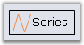{border="0"}

Figure 286: Legend item with the Series type icon

Series Symbol

You can also choose to show the exact same symbol that is shown in the data points in a series.

The code displayed below shows how all the legend items can be rendered with the same symbol.

::: {style="BORDER-BOTTOM: #c8c8c8 1pt solid; BORDER-LEFT: #c8c8c8 1pt solid; PADDING-BOTTOM: 1pt; MARGIN-TOP: 0pt; PADDING-LEFT: 4pt; PADDING-RIGHT: 4pt; MARGIN-BOTTOM: 0pt; BACKGROUND: #f0f0f0; BORDER-TOP: #c8c8c8 1pt solid; BORDER-RIGHT: #c8c8c8 1pt solid; PADDING-TOP: 1pt"}
\[C#\]

[//Set a symbol for first series]{style="FONT-FAMILY: 'Courier New'; COLOR: green"}[]{style="FONT-FAMILY: 'Times New Roman','serif'"}

[chartModel.Series\[0\].Style.Symbol.Shape = [ChartSymbolShape]{style="COLOR: teal"}.Diamond;]{style="FONT-FAMILY: 'Courier New'"}[]{style="FONT-FAMILY: 'Times New Roman','serif'"}

[chartModel.Series\[0\].Style.Symbol.Color = [Color]{style="COLOR: teal"}.Red ;]{style="FONT-FAMILY: 'Courier New'"}[]{style="FONT-FAMILY: 'Times New Roman','serif'"}

[chartModel.Series\[0\].Style.Symbol.Size = [new]{style="COLOR: blue"} [Size]{style="COLOR: teal"}(7, 7);]{style="FONT-FAMILY: 'Courier New'"}[]{style="FONT-FAMILY: 'Times New Roman','serif'"}

[]{style="FONT-FAMILY: 'Times New Roman','serif'"} 

[//This will cause the legend to render with the same symbol defined above.]{style="FONT-FAMILY: 'Courier New'; COLOR: green"}[]{style="FONT-FAMILY: 'Times New Roman','serif'"}

[chartModel.Legend.ShowSymbol = [true]{style="COLOR: blue"};]{style="FONT-FAMILY: 'Courier New'"}[]{style="FONT-FAMILY: 'Times New Roman','serif'"}

[]{style="FONT-FAMILY: 'Times New Roman','serif'"} 

[//Setting RepresentationType to None to hide other representations]{style="FONT-FAMILY: 'Courier New'; COLOR: green"}[]{style="FONT-FAMILY: 'Times New Roman','serif'"}

[chartModel.Legend.RepresentationType = [ChartLegendRepresentationType.]{style="COLOR: teal"}None;]{style="FONT-FAMILY: 'Courier New'"}[]{style="FONT-FAMILY: 'Times New Roman','serif'"}
:::

[]{style="FONT-FAMILY: 'Times New Roman','serif'; FONT-SIZE: 9.5pt"} 

[]{style="FONT-FAMILY: 'Times New Roman','serif'; FONT-SIZE: 12pt"} 

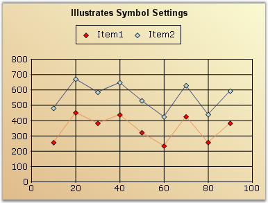{border="0"}

Figure 287: Legend items rendered with the same symbol

[]{style="FONT-FAMILY: 'Times New Roman','serif'; FONT-SIZE: 12pt"} 

Custom Representation Icon

You can also choose to use one of the built-in representation icons in the legend items.

The code displayed below shows how to  use one of the built-in representation icons for all the legend items.

[]{style="FONT-FAMILY: 'Times New Roman','serif'; FONT-SIZE: 12pt"} 

this.chartControl1.Legend.RepresentationType = ChartLegendRepresentationType.Diamond;

[]{style="FONT-FAMILY: 'Times New Roman','serif'; FONT-SIZE: 9.5pt"} 

::: {style="BORDER-BOTTOM: #c8c8c8 1pt solid; BORDER-LEFT: #c8c8c8 1pt solid; PADDING-BOTTOM: 1pt; MARGIN-TOP: 0pt; PADDING-LEFT: 4pt; PADDING-RIGHT: 4pt; MARGIN-BOTTOM: 0pt; BACKGROUND: #f0f0f0; BORDER-TOP: #c8c8c8 1pt solid; BORDER-RIGHT: #c8c8c8 1pt solid; PADDING-TOP: 1pt"}
[// To specify a custom color for the interior of the icon]{style="FONT-FAMILY: 'Courier New'; COLOR: green"}[]{style="FONT-FAMILY: 'Courier New'"}

[chartModel.Legend.Items\[0\].Interior = [new]{style="COLOR: blue"} [BrushInfo]{style="COLOR: teal"}([Color]{style="COLOR: teal"}.Violet);]{style="FONT-FAMILY: 'Courier New'"}
:::

[]{style="FONT-FAMILY: 'Times New Roman','serif'; FONT-SIZE: 12pt"} 

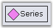{border="0"}

Figure 288: Legend item with a Custom Representation icon

 

To use one of the built-in representation icons only on specific legend items, use the ChartLegendItem.Type property.

 

More Symbol Shapes

ChartLegendItem has the Symbol property, by using which you can customize the symbols for particular legend items. This setting overrides the Series\[0\].Style.Symbol settings.

 

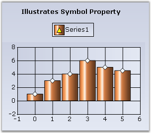{border="0"}

Figure 289: Legend item customized with \"Triangle\" symbol in \"Yellow\" color

 

Custom Images

You can also choose to show custom images in the legend items as follows:

 

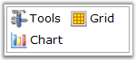{border="0"}

Figure 290: Chart legend items with custom images

 

The following screenshots illustrate the various representation types of a legend:

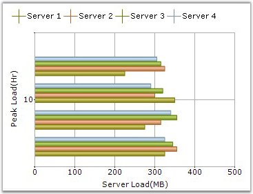{border="0"}

Figure 291: LegendPosition = \"Top\"; RepresentationType = \"Cross\"

[]{style="FONT-FAMILY: 'Times New Roman','serif'; FONT-SIZE: 12pt"} 

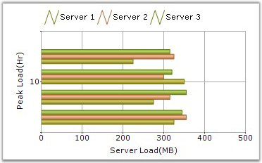{border="0"}

Figure 292: LegendPosition = \"Top\"; RepresentationType = \"Line\"

[]{style="FONT-FAMILY: 'Times New Roman','serif'; FONT-SIZE: 12pt"} 

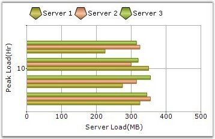{border="0"}

Figure 293: LegendPosition = \"Top\"; RepresentationType = \"Pentagon\"

[]{style="FONT-FAMILY: 'Times New Roman','serif'; FONT-SIZE: 12pt"} 

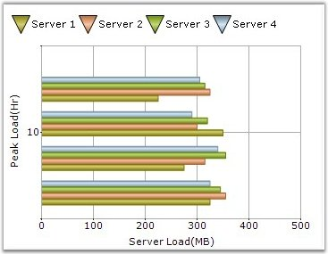{border="0"}

Figure 294: LegendPosition = \"Top\"; RepresentationType = \"InvertedTriangle\"

[]{style="FONT-FAMILY: 'Times New Roman','serif'; FONT-SIZE: 12pt"} 

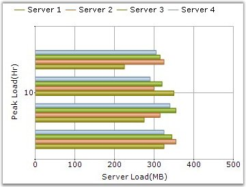{border="0"}

Figure 295: LegendPosition = \"Top\"; RepresentationType = \"StraightLine\"

[]{style="FONT-FAMILY: 'Times New Roman','serif'; FONT-SIZE: 12pt"} 

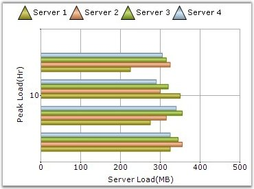{border="0"}

Figure 296: LegendPosition = \"Top\"; RepresentationType = \"Triangle\"

[]{#related-topics}
::::::::
