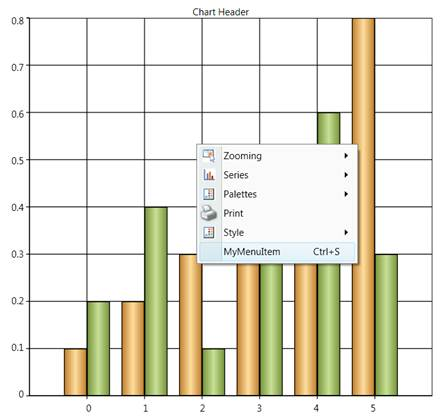
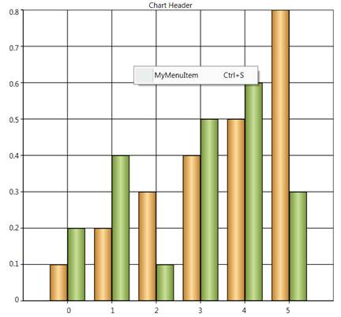

::: {style="DISPLAY: none"}
{#d2h_url_template}{#d2h_package_url style="WIDTH: 0px; DISPLAY: none; HEIGHT: 0px"}
:::

::: {.d2h_secondary_topic style="PADDING-BOTTOM: 10pt; MARGIN: 0pt; PADDING-LEFT: 0pt; PADDING-RIGHT: 0pt; PADDING-TOP: 0pt"}
##### Customizing Context Menu {#customizing-context-menu style="tab-stops: 0pt"}

Essential Chart for WPF enables users to add custom menu items to the default context menu.

###### 4.1.1.10.7.1        Adding a Menu Item to the Context Menu {#adding-a-menu-item-to-the-context-menu style="tab-stops: 0pt"}

Menu items can be added by using two methods: adding with the default menu, or adding as a new list.

###### 4.1.1.10.7.2        Adding with the Default Menu {#adding-with-the-default-menu style="tab-stops: 0pt"}

By setting **ContextMenuType** to **DefaultWithCustom**, the menu item will be added along with the default list.

 

The following code illustrates this.

 

+--------------------------------------------------------------------------------------------------------------------------------------------------------------------------------------------------------------------------------------------------------------------------------------------------------------------------------------------------------------------------------------------------------------------------------------------------------------------------------------------------------------------------------------------------------------------------------------------------------------------------------------------------------------------------------------------------------------------------------------------------------------------------------------------------------------------------------------------------------------------------------------------------------------------+
| **[\[XAML\]]{style="FONT-FAMILY: 'Courier New'; COLOR: black"}**                                                                                                                                                                                                                                                                                                                                                                                                                                                                                                                                                                                                                                                                                                                                                                                                                                                   |
|                                                                                                                                                                                                                                                                                                                                                                                                                                                                                                                                                                                                                                                                                                                                                                                                                                                                                                                    |
| **[]{style="FONT-FAMILY: 'Courier New'; COLOR: black"}**                                                                                                                                                                                                                                                                                                                                                                                                                                                                                                                                                                                                                                                                                                                                                                                                                                                           |
|                                                                                                                                                                                                                                                                                                                                                                                                                                                                                                                                                                                                                                                                                                                                                                                                                                                                                                                    |
| [\<]{style="FONT-FAMILY: 'Courier New'; COLOR: blue"}[syncfusion]{style="FONT-FAMILY: 'Courier New'; COLOR: #a31515"}[:]{style="FONT-FAMILY: 'Courier New'; COLOR: blue"}[ChartArea]{style="FONT-FAMILY: 'Courier New'; COLOR: #a31515"}[ IsContextMenuEnabled]{style="FONT-FAMILY: 'Courier New'; COLOR: red"}[=\"True\"]{style="FONT-FAMILY: 'Courier New'; COLOR: blue"}[ ContextMenuType]{style="FONT-FAMILY: 'Courier New'; COLOR: red"}[=\"DefaultWithCustom\"\>]{style="FONT-FAMILY: 'Courier New'; COLOR: blue"}[                ]{style="FONT-FAMILY: 'Courier New'; COLOR: #a31515"}[\<]{style="FONT-FAMILY: 'Courier New'; COLOR: blue"}[syncfusion]{style="FONT-FAMILY: 'Courier New'; COLOR: #a31515"}[:]{style="FONT-FAMILY: 'Courier New'; COLOR: blue"}[ChartArea.CustomContextMenuItems]{style="FONT-FAMILY: 'Courier New'; COLOR: #a31515"}[\>]{style="FONT-FAMILY: 'Courier New'; COLOR: blue"} |
|                                                                                                                                                                                                                                                                                                                                                                                                                                                                                                                                                                                                                                                                                                                                                                                                                                                                                                                    |
| [                    ]{style="FONT-FAMILY: 'Courier New'; COLOR: #a31515"}[\<]{style="FONT-FAMILY: 'Courier New'; COLOR: blue"}[MenuItem]{style="FONT-FAMILY: 'Courier New'; COLOR: #a31515"}[ Header]{style="FONT-FAMILY: 'Courier New'; COLOR: red"}[=\"MyMenuItem\"/\>]{style="FONT-FAMILY: 'Courier New'; COLOR: blue"}                                                                                                                                                                                                                                                                                                                                                                                                                                                                                                                                                                                        |
|                                                                                                                                                                                                                                                                                                                                                                                                                                                                                                                                                                                                                                                                                                                                                                                                                                                                                                                    |
| [                ]{style="FONT-FAMILY: 'Courier New'; COLOR: #a31515"}[\</]{style="FONT-FAMILY: 'Courier New'; COLOR: blue"}[syncfusion]{style="FONT-FAMILY: 'Courier New'; COLOR: #a31515"}[:]{style="FONT-FAMILY: 'Courier New'; COLOR: blue"}[ChartArea.CustomContextMenuItems]{style="FONT-FAMILY: 'Courier New'; COLOR: #a31515"}[\>]{style="FONT-FAMILY: 'Courier New'; COLOR: blue"}                                                                                                                                                                                                                                                                                                                                                                                                                                                                                                                        |
|                                                                                                                                                                                                                                                                                                                                                                                                                                                                                                                                                                                                                                                                                                                                                                                                                                                                                                                    |
| [    ]{style="FONT-FAMILY: 'Courier New'; COLOR: #a31515"}[\</]{style="FONT-FAMILY: 'Courier New'; COLOR: blue"}[syncfusion]{style="FONT-FAMILY: 'Courier New'; COLOR: #a31515"}[:]{style="FONT-FAMILY: 'Courier New'; COLOR: blue"}[ChartArea]{style="FONT-FAMILY: 'Courier New'; COLOR: #a31515"}[\>]{style="FONT-FAMILY: 'Courier New'; COLOR: blue"}                                                                                                                                                                                                                                                                                                                                                                                                                                                                                                                                                           |
|                                                                                                                                                                                                                                                                                                                                                                                                                                                                                                                                                                                                                                                                                                                                                                                                                                                                                                                    |
| []{style="FONT-FAMILY: 'Courier New'"}                                                                                                                                                                                                                                                                                                                                                                                                                                                                                                                                                                                                                                                                                                                                                                                                                                                                             |
+--------------------------------------------------------------------------------------------------------------------------------------------------------------------------------------------------------------------------------------------------------------------------------------------------------------------------------------------------------------------------------------------------------------------------------------------------------------------------------------------------------------------------------------------------------------------------------------------------------------------------------------------------------------------------------------------------------------------------------------------------------------------------------------------------------------------------------------------------------------------------------------------------------------------+

 

[]{#p157} 

{border="0"}

Figure 248: Menu Item Added with Default Context Menu

###### 4.1.1.10.7.3        Adding Menu Items as a New List {#adding-menu-items-as-a-new-list style="tab-stops: 0pt"}

By setting **ContextMenuType** to **Custom,** menu items will be added as a new list.

 

+---------------------------------------------------------------------------------------------------------------------------------------------------------------------------------------------------------------------------------------------------------------------------------------------------------------------------------------------------------------------------------------------------------------------------------------------------------------------------------------------------------------+
| [    ]{style="FONT-FAMILY: 'Courier New'; COLOR: #a31515; FONT-SIZE: 12pt"}                                                                                                                                                                                                                                                                                                                                                                                                                                   |
|                                                                                                                                                                                                                                                                                                                                                                                                                                                                                                               |
| [\<]{style="FONT-FAMILY: 'Courier New'; COLOR: blue"}[syncfusion]{style="FONT-FAMILY: 'Courier New'; COLOR: #a31515"}[:]{style="FONT-FAMILY: 'Courier New'; COLOR: blue"}[ChartArea]{style="FONT-FAMILY: 'Courier New'; COLOR: #a31515"}[ IsContextMenuEnabled]{style="FONT-FAMILY: 'Courier New'; COLOR: red"}[=\"True\"]{style="FONT-FAMILY: 'Courier New'; COLOR: blue"}[ ContextMenuType]{style="FONT-FAMILY: 'Courier New'; COLOR: red"}[=\"Custom\"\>]{style="FONT-FAMILY: 'Courier New'; COLOR: blue"} |
|                                                                                                                                                                                                                                                                                                                                                                                                                                                                                                               |
| [                ]{style="FONT-FAMILY: 'Courier New'; COLOR: #a31515"}[\<]{style="FONT-FAMILY: 'Courier New'; COLOR: blue"}[syncfusion]{style="FONT-FAMILY: 'Courier New'; COLOR: #a31515"}[:]{style="FONT-FAMILY: 'Courier New'; COLOR: blue"}[ChartArea.CustomContextMenuItems]{style="FONT-FAMILY: 'Courier New'; COLOR: #a31515"}[\>]{style="FONT-FAMILY: 'Courier New'; COLOR: blue"}                                                                                                                    |
|                                                                                                                                                                                                                                                                                                                                                                                                                                                                                                               |
| [                  ]{style="FONT-FAMILY: 'Courier New'; COLOR: #a31515"}[\<]{style="FONT-FAMILY: 'Courier New'; COLOR: blue"}[MenuItem]{style="FONT-FAMILY: 'Courier New'; COLOR: #a31515"}[Header]{style="FONT-FAMILY: 'Courier New'; COLOR: red"}[=\"MyMenuItem\"]{style="FONT-FAMILY: 'Courier New'; COLOR: blue"}[Command]{style="FONT-FAMILY: 'Courier New'; COLOR: red"}[=\"ApplicationCommands.Save\"/\>]{style="FONT-FAMILY: 'Courier New'; COLOR: blue"}                                             |
|                                                                                                                                                                                                                                                                                                                                                                                                                                                                                                               |
| [                ]{style="FONT-FAMILY: 'Courier New'; COLOR: #a31515"}[\</]{style="FONT-FAMILY: 'Courier New'; COLOR: blue"}[syncfusion]{style="FONT-FAMILY: 'Courier New'; COLOR: #a31515"}[:]{style="FONT-FAMILY: 'Courier New'; COLOR: blue"}[ChartArea.CustomContextMenuItems]{style="FONT-FAMILY: 'Courier New'; COLOR: #a31515"}[\>]{style="FONT-FAMILY: 'Courier New'; COLOR: blue"}                                                                                                                   |
|                                                                                                                                                                                                                                                                                                                                                                                                                                                                                                               |
| []{style="FONT-FAMILY: 'Courier New'; FONT-SIZE: 9pt"}                                                                                                                                                                                                                                                                                                                                                                                                                                                        |
+---------------------------------------------------------------------------------------------------------------------------------------------------------------------------------------------------------------------------------------------------------------------------------------------------------------------------------------------------------------------------------------------------------------------------------------------------------------------------------------------------------------+

[]{style="FONT-FAMILY: 'Trebuchet MS','sans-serif'; FONT-SIZE: 9pt"} 

{border="0"}

Figure 249: Added Menu Item as New List

**[]{style="FONT-SIZE: 11pt"}** 

Table 158: Property Table

+------------------------+-------------------------------------+------------------+----------------------------------+--------------------------------------------------------------------------------------------------------------------------------------------------------------------------------------------------------------------------------------------------------------------------------------------------------------------------------------------------------------------------------------------------------------------------------------------------------------------------------------------------------------------------------------------------------------------------------------------------------+--------------------------------------------+
| Name of Property       | Description                         | Type of Property | Value It Accepts                 | Property Syntax                                                                                                                                                                                                                                                                                                                                                                                                                                                                                                                                                                                        | Sub Properties                             |
|                        |                                     |                  |                                  |                                                                                                                                                                                                                                                                                                                                                                                                                                                                                                                                                                                                        |                                            |
|                        |                                     |                  |                                  |                                                                                                                                                                                                                                                                                                                                                                                                                                                                                                                                                                                                        |                                            |
+------------------------+-------------------------------------+------------------+----------------------------------+--------------------------------------------------------------------------------------------------------------------------------------------------------------------------------------------------------------------------------------------------------------------------------------------------------------------------------------------------------------------------------------------------------------------------------------------------------------------------------------------------------------------------------------------------------------------------------------------------------+--------------------------------------------+
| CustomContextMenuItems | Used to customize the context menu. | Normal           | ObservableCollection\<MenuItem\> | [\<]{style="FONT-FAMILY: 'Calibri','sans-serif'; COLOR: blue; FONT-SIZE: 12pt"}[syncfusion]{style="FONT-FAMILY: 'Calibri','sans-serif'; COLOR: #a31515; FONT-SIZE: 12pt"}[:]{style="FONT-FAMILY: 'Calibri','sans-serif'; COLOR: blue; FONT-SIZE: 12pt"}[ChartArea.CustomContextMenuItems]{style="FONT-FAMILY: 'Calibri','sans-serif'; COLOR: #a31515; FONT-SIZE: 12pt"}[\>]{style="FONT-FAMILY: 'Calibri','sans-serif'; COLOR: blue; FONT-SIZE: 12pt"}                                                                                                                                                 | Property Name : ContextMenuType            |
|                        |                                     |                  |                                  |                                                                                                                                                                                                                                                                                                                                                                                                                                                                                                                                                                                                        |                                            |
|                        |                                     |                  |                                  | [                    ]{style="FONT-FAMILY: 'Calibri','sans-serif'; COLOR: #a31515; FONT-SIZE: 12pt"}[\<]{style="FONT-FAMILY: 'Calibri','sans-serif'; COLOR: blue; FONT-SIZE: 12pt"}[MenuItem]{style="FONT-FAMILY: 'Calibri','sans-serif'; COLOR: #a31515; FONT-SIZE: 12pt"}[ Header]{style="FONT-FAMILY: 'Calibri','sans-serif'; COLOR: red; FONT-SIZE: 12pt"}[=\"MyMenuItem\"/\>]{style="FONT-FAMILY: 'Calibri','sans-serif'; COLOR: blue; FONT-SIZE: 12pt"}                                                                                                                                          | Type:DependacyProperty /ContextMenuTypes / |
|                        |                                     |                  |                                  |                                                                                                                                                                                                                                                                                                                                                                                                                                                                                                                                                                                                        |                                            |
|                        |                                     |                  |                                  | [                ]{style="FONT-FAMILY: 'Calibri','sans-serif'; COLOR: #a31515; FONT-SIZE: 12pt"}[\</]{style="FONT-FAMILY: 'Calibri','sans-serif'; COLOR: blue; FONT-SIZE: 12pt"}[syncfusion]{style="FONT-FAMILY: 'Calibri','sans-serif'; COLOR: #a31515; FONT-SIZE: 12pt"}[:]{style="FONT-FAMILY: 'Calibri','sans-serif'; COLOR: blue; FONT-SIZE: 12pt"}[ChartArea.CustomContextMenuItems]{style="FONT-FAMILY: 'Calibri','sans-serif'; COLOR: #a31515; FONT-SIZE: 12pt"}[\>]{style="FONT-FAMILY: 'Calibri','sans-serif'; COLOR: blue; FONT-SIZE: 12pt"}[]{style="FONT-FAMILY: 'Calibri','sans-serif'"} | Ex: ContextMenuTypes.Custom                |
|                        |                                     |                  |                                  |                                                                                                                                                                                                                                                                                                                                                                                                                                                                                                                                                                                                        |                                            |
|                        |                                     |                  |                                  |                                                                                                                                                                                                                                                                                                                                                                                                                                                                                                                                                                                                        |                                            |
+------------------------+-------------------------------------+------------------+----------------------------------+--------------------------------------------------------------------------------------------------------------------------------------------------------------------------------------------------------------------------------------------------------------------------------------------------------------------------------------------------------------------------------------------------------------------------------------------------------------------------------------------------------------------------------------------------------------------------------------------------------+--------------------------------------------+

[]{style="FONT-FAMILY: 'Calibri','sans-serif'"} 

Table 159: Events

  ----------------------------- ------------------------------------------------------------------------------------------- ----------------------------- ---------------------------
  Name of the Event             Description                                                                                 Method                        Event Args
  ChartContextMenuEventHadler   Used to handle adding items to the context menu and removing items from the context menu.   ChartContextMenuEventHadler   ChartContextMenuEventArgs
  ----------------------------- ------------------------------------------------------------------------------------------- ----------------------------- ---------------------------

 

 

[]{#related-topics}
:::
