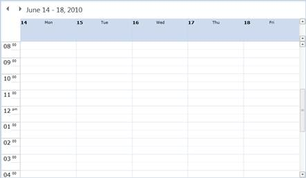
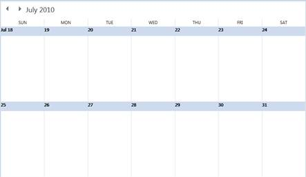

::: {style="DISPLAY: none"}
{#d2h_url_template}{#d2h_package_url style="WIDTH: 0px; DISPLAY: none; HEIGHT: 0px"}
:::

::::: {#nsbanner .d2h_main_nsbanner style="BORDER-BOTTOM: #999999 1px solid; POSITION: relative; PADDING-BOTTOM: 0px; BACKGROUND-COLOR: transparent; PADDING-LEFT: 0px; PADDING-RIGHT: 0px; DISPLAY: none; BORDER-TOP: #999999 1px solid; PADDING-TOP: 0px; LEFT: 0px"}
:::: {#TitleRow .d2h_main_titlerow style="PADDING-BOTTOM: 4px; BACKGROUND-COLOR: transparent; PADDING-LEFT: 22px; WIDTH: 100%; PADDING-RIGHT: 10px; DISPLAY: none; PADDING-TOP: 4px"}
::: {#ienav .d2h_main_ienav style="DISPLAY: none"}
{#D2HPrevious .D2HPreviousEnabled}  {#D2HNext .D2HNextEnabled}
:::
::::
:::::

:::: {#nstext .d2h_main_nstext style="PADDING-BOTTOM: 10px; BACKGROUND-COLOR: transparent; PADDING-LEFT: 22px; PADDING-RIGHT: 10px; HEIGHT: 100%; OVERFLOW: auto; PADDING-TOP: 5px" hasuserbackground="true" valign="bottom"}
::: {#d2h_breadcrumbs .d2h_breadcrumbs}
[Essential Studio User Guide Documentation](ms-xhelp:///?Id=12457748-09e3-4d74-a240-8e049cedf030){.d2h_breadcrumbsNormal}[ \> ]{.d2h_breadcrumbsLinkSeparator}[User Interface Edition](ms-xhelp:///?Id=c29296b7-531c-413b-a0ec-488ca1f7f669){.d2h_breadcrumbsNormal}[ \> ]{.d2h_breadcrumbsLinkSeparator}[Essential Silverlight](ms-xhelp:///?Id=66221bd1-ba2e-43c2-94a7-618f50e01d24){.d2h_breadcrumbsNormal}[ \> ]{.d2h_breadcrumbsLinkSeparator}[Essential Schedule]{.d2h_breadcrumbsContentsOnly}[ \> ]{.d2h_breadcrumbsLinkSeparator}[Schedule Control](ms-xhelp:///?Id=641660d5-c458-4c5d-9615-332d1a8eb458){.d2h_breadcrumbsNormal}[ \> ]{.d2h_breadcrumbsLinkSeparator}[Appearance](ms-xhelp:///?Id=436fb287-6cea-4a87-b33f-7177087dd205){.d2h_breadcrumbsNormal}
:::

### Customizing Day Header Text {#customizing-day-header-text style="LINE-HEIGHT: 150%; tab-stops: 0pt"}

[·      ]{style="FONT-FAMILY: Symbol"}You can customize the day header text using converter properties in schedule control.

[·      ]{style="FONT-FAMILY: Symbol"}For **DaysView,** header text customization uses the **DaysHeaderTextConverter** property and for **MonthView,** header text customization uses the **MonthViewDateTextConverter** property.

[·      ]{style="FONT-FAMILY: Symbol"}Both properties accept the **IValueConverter** object.

[·      ]{style="FONT-FAMILY: Symbol"}In that converter the **Value** comes as **string** in the convert method.

The following code illustrates customizing the header text for both days namely view header text and the month view header text.

 

+---------------------------------------------------------------------------------------------------------------------------------------------------------------------------------------------------------------------------------------------------------------------------------------------------------------------+
| **[\[XAML\]]{style="FONT-FAMILY: 'Courier New'"}**                                                                                                                                                                                                                                                                  |
|                                                                                                                                                                                                                                                                                                                     |
| [// Assign the IValueConverterClass Object into both days view header text Property and the monthview header text property. ]{style="FONT-FAMILY: 'Courier New'; COLOR: green"}[]{style="FONT-FAMILY: 'Courier New'"}                                                                                               |
|                                                                                                                                                                                                                                                                                                                     |
| [Schedule]{style="FONT-FAMILY: 'Courier New'; COLOR: #2b91af"}[ schedule = [new]{style="COLOR: blue"} [Schedule]{style="COLOR: #2b91af"}();          ]{style="FONT-FAMILY: 'Courier New'"}                                                                                                                          |
|                                                                                                                                                                                                                                                                                                                     |
| [DaysHeaderTextConverter]{style="FONT-FAMILY: 'Courier New'; COLOR: #2b91af"}[ daysHeaderTextConverter = [new]{style="COLOR: blue"} [DaysHeaderTextConverter]{style="COLOR: #2b91af"}(); schedule.DaysHeaderTextConverter = daysHeaderTextConverter;[]{style="COLOR: #2b91af"}]{style="FONT-FAMILY: 'Courier New'"} |
|                                                                                                                                                                                                                                                                                                                     |
| [MonthHeaderTextConverter]{style="FONT-FAMILY: 'Courier New'; COLOR: #2b91af"}[ monthHeaderTextConverter = [new]{style="COLOR: blue"} [MonthHeaderTextConverter]{style="COLOR: #2b91af"}();]{style="FONT-FAMILY: 'Courier New'"}                                                                                    |
|                                                                                                                                                                                                                                                                                                                     |
| [schedule.MonthViewDateTextConverter = monthHeaderTextConverter;]{style="FONT-FAMILY: 'Courier New'"}                                                                                                                                                                                                               |
|                                                                                                                                                                                                                                                                                                                     |
| []{style="FONT-FAMILY: 'Courier New'; COLOR: blue"}                                                                                                                                                                                                                                                                 |
|                                                                                                                                                                                                                                                                                                                     |
| [// IValueConverter Class for DaysHeaderTextConverter]{style="FONT-FAMILY: 'Courier New'; COLOR: green"}[]{style="FONT-FAMILY: 'Courier New'"}                                                                                                                                                                      |
|                                                                                                                                                                                                                                                                                                                     |
| [  [public]{style="COLOR: blue"} [class]{style="COLOR: blue"} [DaysHeaderTextConverter]{style="COLOR: #2b91af"} : [IValueConverter]{style="COLOR: #2b91af"}]{style="FONT-FAMILY: 'Courier New'"}                                                                                                                    |
|                                                                                                                                                                                                                                                                                                                     |
| [    {]{style="FONT-FAMILY: 'Courier New'"}                                                                                                                                                                                                                                                                         |
|                                                                                                                                                                                                                                                                                                                     |
| [        [public]{style="COLOR: blue"} [object]{style="COLOR: blue"} Convert([object]{style="COLOR: blue"} value, [Type]{style="COLOR: #2b91af"} targetType, [object]{style="COLOR: blue"} parameter, [CultureInfo]{style="COLOR: #2b91af"} culture)]{style="FONT-FAMILY: 'Courier New'"}                           |
|                                                                                                                                                                                                                                                                                                                     |
| [        {]{style="FONT-FAMILY: 'Courier New'"}                                                                                                                                                                                                                                                                     |
|                                                                                                                                                                                                                                                                                                                     |
| [            [object]{style="COLOR: blue"} result = [\"\"]{style="COLOR: #a31515"};]{style="FONT-FAMILY: 'Courier New'"}                                                                                                                                                                                            |
|                                                                                                                                                                                                                                                                                                                     |
| [            [if]{style="COLOR: blue"} (([string]{style="COLOR: blue"})value == [\"Monday\"]{style="COLOR: #a31515"})]{style="FONT-FAMILY: 'Courier New'"}                                                                                                                                                          |
|                                                                                                                                                                                                                                                                                                                     |
| [                result = [\"Mon\"]{style="COLOR: #a31515"};]{style="FONT-FAMILY: 'Courier New'"}                                                                                                                                                                                                                   |
|                                                                                                                                                                                                                                                                                                                     |
| [            [else]{style="COLOR: blue"} [if]{style="COLOR: blue"} (([string]{style="COLOR: blue"})value == [\"Tuesday\"]{style="COLOR: #a31515"})]{style="FONT-FAMILY: 'Courier New'"}                                                                                                                             |
|                                                                                                                                                                                                                                                                                                                     |
| [                result = [\"Tue\"]{style="COLOR: #a31515"};]{style="FONT-FAMILY: 'Courier New'"}                                                                                                                                                                                                                   |
|                                                                                                                                                                                                                                                                                                                     |
| [            [else]{style="COLOR: blue"} [if]{style="COLOR: blue"} (([string]{style="COLOR: blue"})value == [\"Wednesday\"]{style="COLOR: #a31515"})]{style="FONT-FAMILY: 'Courier New'"}                                                                                                                           |
|                                                                                                                                                                                                                                                                                                                     |
| [                result = [\"Wed\"]{style="COLOR: #a31515"};]{style="FONT-FAMILY: 'Courier New'"}                                                                                                                                                                                                                   |
|                                                                                                                                                                                                                                                                                                                     |
| [            [else]{style="COLOR: blue"} [if]{style="COLOR: blue"} (([string]{style="COLOR: blue"})value == [\"Thursday\"]{style="COLOR: #a31515"})]{style="FONT-FAMILY: 'Courier New'"}                                                                                                                            |
|                                                                                                                                                                                                                                                                                                                     |
| [                result = [\"Thu\"]{style="COLOR: #a31515"};]{style="FONT-FAMILY: 'Courier New'"}                                                                                                                                                                                                                   |
|                                                                                                                                                                                                                                                                                                                     |
| [            [else]{style="COLOR: blue"} [if]{style="COLOR: blue"} (([string]{style="COLOR: blue"})value == [\"Friday\"]{style="COLOR: #a31515"})]{style="FONT-FAMILY: 'Courier New'"}                                                                                                                              |
|                                                                                                                                                                                                                                                                                                                     |
| [                result = [\"Fri\"]{style="COLOR: #a31515"};]{style="FONT-FAMILY: 'Courier New'"}                                                                                                                                                                                                                   |
|                                                                                                                                                                                                                                                                                                                     |
| [            [else]{style="COLOR: blue"} [if]{style="COLOR: blue"} (([string]{style="COLOR: blue"})value == [\"Saturday\"]{style="COLOR: #a31515"})]{style="FONT-FAMILY: 'Courier New'"}                                                                                                                            |
|                                                                                                                                                                                                                                                                                                                     |
| [                result = [\"Sat\"]{style="COLOR: #a31515"};]{style="FONT-FAMILY: 'Courier New'"}                                                                                                                                                                                                                   |
|                                                                                                                                                                                                                                                                                                                     |
| [            [else]{style="COLOR: blue"} [if]{style="COLOR: blue"} (([string]{style="COLOR: blue"})value == [\"Sunday\"]{style="COLOR: #a31515"})]{style="FONT-FAMILY: 'Courier New'"}                                                                                                                              |
|                                                                                                                                                                                                                                                                                                                     |
| [                result = [\"Sun\"]{style="COLOR: #a31515"};            ]{style="FONT-FAMILY: 'Courier New'"}                                                                                                                                                                                                       |
|                                                                                                                                                                                                                                                                                                                     |
| [            [return]{style="COLOR: blue"} result;]{style="FONT-FAMILY: 'Courier New'"}                                                                                                                                                                                                                             |
|                                                                                                                                                                                                                                                                                                                     |
| [        }]{style="FONT-FAMILY: 'Courier New'"}                                                                                                                                                                                                                                                                     |
|                                                                                                                                                                                                                                                                                                                     |
| [        [public]{style="COLOR: blue"} [object]{style="COLOR: blue"} ConvertBack([object]{style="COLOR: blue"} value, [Type]{style="COLOR: #2b91af"} targetType, [object]{style="COLOR: blue"} parameter, [CultureInfo]{style="COLOR: #2b91af"} culture)]{style="FONT-FAMILY: 'Courier New'"}                       |
|                                                                                                                                                                                                                                                                                                                     |
| [        {]{style="FONT-FAMILY: 'Courier New'"}                                                                                                                                                                                                                                                                     |
|                                                                                                                                                                                                                                                                                                                     |
| [            [throw]{style="COLOR: blue"} [new]{style="COLOR: blue"} [NotImplementedException]{style="COLOR: #2b91af"}();]{style="FONT-FAMILY: 'Courier New'"}                                                                                                                                                      |
|                                                                                                                                                                                                                                                                                                                     |
| [        }]{style="FONT-FAMILY: 'Courier New'"}                                                                                                                                                                                                                                                                     |
|                                                                                                                                                                                                                                                                                                                     |
| [    }]{style="FONT-FAMILY: 'Courier New'"}                                                                                                                                                                                                                                                                         |
|                                                                                                                                                                                                                                                                                                                     |
| []{style="FONT-FAMILY: 'Courier New'"}                                                                                                                                                                                                                                                                              |
|                                                                                                                                                                                                                                                                                                                     |
| [   // IValueConverter Class for MonthHeaderTextConverter]{style="FONT-FAMILY: 'Courier New'; COLOR: green"}[]{style="FONT-FAMILY: 'Courier New'"}                                                                                                                                                                  |
|                                                                                                                                                                                                                                                                                                                     |
| [    [public]{style="COLOR: blue"} [class]{style="COLOR: blue"} [MonthHeaderTextConverter]{style="COLOR: #2b91af"} : [IValueConverter]{style="COLOR: #2b91af"}]{style="FONT-FAMILY: 'Courier New'"}                                                                                                                 |
|                                                                                                                                                                                                                                                                                                                     |
| [    {]{style="FONT-FAMILY: 'Courier New'"}                                                                                                                                                                                                                                                                         |
|                                                                                                                                                                                                                                                                                                                     |
| [        [public]{style="COLOR: blue"} [object]{style="COLOR: blue"} Convert([object]{style="COLOR: blue"} value, [Type]{style="COLOR: #2b91af"} targetType, [object]{style="COLOR: blue"} parameter, [CultureInfo]{style="COLOR: #2b91af"} culture)]{style="FONT-FAMILY: 'Courier New'"}                           |
|                                                                                                                                                                                                                                                                                                                     |
| [        {]{style="FONT-FAMILY: 'Courier New'"}                                                                                                                                                                                                                                                                     |
|                                                                                                                                                                                                                                                                                                                     |
| [            [object]{style="COLOR: blue"} result = [\"\"]{style="COLOR: #a31515"};]{style="FONT-FAMILY: 'Courier New'"}                                                                                                                                                                                            |
|                                                                                                                                                                                                                                                                                                                     |
| [            [if]{style="COLOR: blue"} (([string]{style="COLOR: blue"})value == [\"Monday\"]{style="COLOR: #a31515"})]{style="FONT-FAMILY: 'Courier New'"}                                                                                                                                                          |
|                                                                                                                                                                                                                                                                                                                     |
| [                result = [\"MON\"]{style="COLOR: #a31515"};]{style="FONT-FAMILY: 'Courier New'"}                                                                                                                                                                                                                   |
|                                                                                                                                                                                                                                                                                                                     |
| [            [else]{style="COLOR: blue"} [if]{style="COLOR: blue"} (([string]{style="COLOR: blue"})value == [\"Tuesday\"]{style="COLOR: #a31515"})]{style="FONT-FAMILY: 'Courier New'"}                                                                                                                             |
|                                                                                                                                                                                                                                                                                                                     |
| [                result = [\"TUE\"]{style="COLOR: #a31515"};]{style="FONT-FAMILY: 'Courier New'"}                                                                                                                                                                                                                   |
|                                                                                                                                                                                                                                                                                                                     |
| [            [else]{style="COLOR: blue"} [if]{style="COLOR: blue"} (([string]{style="COLOR: blue"})value == [\"Wednesday\"]{style="COLOR: #a31515"})]{style="FONT-FAMILY: 'Courier New'"}                                                                                                                           |
|                                                                                                                                                                                                                                                                                                                     |
| [                result = [\"WED\"]{style="COLOR: #a31515"};]{style="FONT-FAMILY: 'Courier New'"}                                                                                                                                                                                                                   |
|                                                                                                                                                                                                                                                                                                                     |
| [            [else]{style="COLOR: blue"} [if]{style="COLOR: blue"} (([string]{style="COLOR: blue"})value == [\"Thursday\"]{style="COLOR: #a31515"})]{style="FONT-FAMILY: 'Courier New'"}                                                                                                                            |
|                                                                                                                                                                                                                                                                                                                     |
| [                result = [\"THU\"]{style="COLOR: #a31515"};]{style="FONT-FAMILY: 'Courier New'"}                                                                                                                                                                                                                   |
|                                                                                                                                                                                                                                                                                                                     |
| [            [else]{style="COLOR: blue"} [if]{style="COLOR: blue"} (([string]{style="COLOR: blue"})value == [\"Friday\"]{style="COLOR: #a31515"})]{style="FONT-FAMILY: 'Courier New'"}                                                                                                                              |
|                                                                                                                                                                                                                                                                                                                     |
| [                result = [\"FRI\"]{style="COLOR: #a31515"};]{style="FONT-FAMILY: 'Courier New'"}                                                                                                                                                                                                                   |
|                                                                                                                                                                                                                                                                                                                     |
| [            [else]{style="COLOR: blue"} [if]{style="COLOR: blue"} (([string]{style="COLOR: blue"})value == [\"Saturday\"]{style="COLOR: #a31515"})]{style="FONT-FAMILY: 'Courier New'"}                                                                                                                            |
|                                                                                                                                                                                                                                                                                                                     |
| [                result = [\"SAT\"]{style="COLOR: #a31515"};]{style="FONT-FAMILY: 'Courier New'"}                                                                                                                                                                                                                   |
|                                                                                                                                                                                                                                                                                                                     |
| [            [else]{style="COLOR: blue"} [if]{style="COLOR: blue"} (([string]{style="COLOR: blue"})value == [\"Sunday\"]{style="COLOR: #a31515"})]{style="FONT-FAMILY: 'Courier New'"}                                                                                                                              |
|                                                                                                                                                                                                                                                                                                                     |
| [                result = [\"SUN\"]{style="COLOR: #a31515"};            ]{style="FONT-FAMILY: 'Courier New'"}                                                                                                                                                                                                       |
|                                                                                                                                                                                                                                                                                                                     |
| [            [return]{style="COLOR: blue"} result;]{style="FONT-FAMILY: 'Courier New'"}                                                                                                                                                                                                                             |
|                                                                                                                                                                                                                                                                                                                     |
| [        }]{style="FONT-FAMILY: 'Courier New'"}                                                                                                                                                                                                                                                                     |
|                                                                                                                                                                                                                                                                                                                     |
| [        [public]{style="COLOR: blue"} [object]{style="COLOR: blue"} ConvertBack([object]{style="COLOR: blue"} value, [Type]{style="COLOR: #2b91af"} targetType, [object]{style="COLOR: blue"} parameter, [CultureInfo]{style="COLOR: #2b91af"} culture)]{style="FONT-FAMILY: 'Courier New'"}                       |
|                                                                                                                                                                                                                                                                                                                     |
| [        {]{style="FONT-FAMILY: 'Courier New'"}                                                                                                                                                                                                                                                                     |
|                                                                                                                                                                                                                                                                                                                     |
| [            [throw]{style="COLOR: blue"} [new]{style="COLOR: blue"} [NotImplementedException]{style="COLOR: #2b91af"}();]{style="FONT-FAMILY: 'Courier New'"}                                                                                                                                                      |
|                                                                                                                                                                                                                                                                                                                     |
| [        }]{style="FONT-FAMILY: 'Courier New'"}                                                                                                                                                                                                                                                                     |
|                                                                                                                                                                                                                                                                                                                     |
| [    }[]{style="COLOR: blue"}]{style="FONT-FAMILY: 'Courier New'"}                                                                                                                                                                                                                                                  |
+---------------------------------------------------------------------------------------------------------------------------------------------------------------------------------------------------------------------------------------------------------------------------------------------------------------------+

[]{style="LINE-HEIGHT: 150%; FONT-FAMILY: 'Trebuchet MS','sans-serif'; COLOR: #15428b; FONT-SIZE: 9pt"} 

The above code results in the following,

{border="0"}

 

Figure 49:DaysHeaderTextConverter

*[]{style="LINE-HEIGHT: 150%; LETTER-SPACING: 0.75pt; FONT-FAMILY: 'Cambria','serif'; COLOR: #4f81bd; FONT-SIZE: 9pt"}* 

{border="0"}

 

Figure 50: MonthHeaderTextConverter

**[]{style="LINE-HEIGHT: 150%; LETTER-SPACING: 0.75pt; FONT-FAMILY: 'Cambria','serif'; COLOR: #4f81bd; FONT-SIZE: 9pt"}** 

[]{#related-topics}
::::
