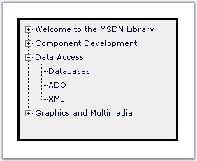
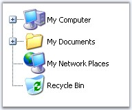
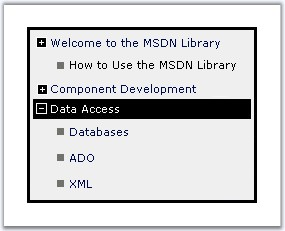

::: {style="DISPLAY: none"}
{#d2h_url_template}{#d2h_package_url style="WIDTH: 0px; DISPLAY: none; HEIGHT: 0px"}
:::

::::: {.d2h_secondary_topic style="PADDING-BOTTOM: 10pt; MARGIN: 0pt; PADDING-LEFT: 0pt; PADDING-RIGHT: 0pt; PADDING-TOP: 0pt"}
##### Customizing Expand / Collapse Images {#customizing-expand-collapse-images style="tab-stops: 0pt"}

[]{style="FONT-FAMILY: 'Trebuchet MS','sans-serif'; COLOR: #15428b; FONT-SIZE: 9pt"} 

Default Hierarchical Lines

[]{style="FONT-FAMILY: 'Trebuchet MS','sans-serif'; COLOR: #15428b; FONT-SIZE: 9pt"} 

By default the **ShowLines** property will be set to **True**. This will display the default +/- images.

[]{style="FONT-FAMILY: 'Trebuchet MS','sans-serif'; COLOR: #15428b; FONT-SIZE: 9pt"} 

{border="0"}

**[]{style="FONT-FAMILY: 'Trebuchet MS','sans-serif'; COLOR: #15428b; FONT-SIZE: 9pt"}** 

Figure 183: TreeView with default hierarchical line images

[]{style="FONT-FAMILY: 'Trebuchet MS','sans-serif'; COLOR: #15428b; FONT-SIZE: 9pt"} 

The following are the properties that contain the default line images which can be customized.

[]{style="FONT-FAMILY: 'Trebuchet MS','sans-serif'; COLOR: #15428b; FONT-SIZE: 9pt"} 

::: {align="center"}
+-----------------------------------+-------------------------------------------------------------------------------------------------------------+
|                                   |                                                                                                             |
|                                   |                                                                                                             |
|          Property                 | Description                                                                                                 |
+-----------------------------------+-------------------------------------------------------------------------------------------------------------+
| LineImageHeight                   | Specifies height of the line image.                                                                         |
+-----------------------------------+-------------------------------------------------------------------------------------------------------------+
| LineImageDash                     | Specifies the custom images to replace the default hierarchical line images.                                |
+-----------------------------------+                                                                                                             |
| LineImageDashMinus                |                                                                                                             |
+-----------------------------------+                                                                                                             |
| LineImageDashPlus                 |                                                                                                             |
+-----------------------------------+                                                                                                             |
| LineImageEmpty                    |                                                                                                             |
+-----------------------------------+                                                                                                             |
| LineImageImageI                   |                                                                                                             |
+-----------------------------------+                                                                                                             |
| LineImageImageL                   |                                                                                                             |
+-----------------------------------+                                                                                                             |
| LineImageLMinus                   |                                                                                                             |
+-----------------------------------+                                                                                                             |
| LineImageLPlus                    |                                                                                                             |
+-----------------------------------+                                                                                                             |
| LineImageR                        |                                                                                                             |
+-----------------------------------+                                                                                                             |
| LineImageRMinus                   |                                                                                                             |
+-----------------------------------+                                                                                                             |
| LineImageRPlus                    |                                                                                                             |
+-----------------------------------+                                                                                                             |
| LineImageT                        |                                                                                                             |
+-----------------------------------+                                                                                                             |
| LineImageTMinus                   |                                                                                                             |
+-----------------------------------+                                                                                                             |
| LineImageTPlus                    |                                                                                                             |
+-----------------------------------+                                                                                                             |
| LineImageWidth                    |                                                                                                             |
+-----------------------------------+-------------------------------------------------------------------------------------------------------------+
| UseCustomLineImages               | Gets/sets the boolean value, whether to render the custom hierarchical line images. Default value is False. |
+-----------------------------------+-------------------------------------------------------------------------------------------------------------+
:::

**[]{style="COLOR: black; FONT-SIZE: 8pt"}** 

Custom Hierarchical Line Images

[]{style="FONT-FAMILY: 'Trebuchet MS','sans-serif'; COLOR: #15428b; FONT-SIZE: 9pt"} 

The default hierarchical line images can be replaced with the custom or user-defined line images for which, set the **UseCustomImages** to **True** and assign the \'Lines\' folder, with the user-defined images placed in it, to **ImageBaseUrl**[ ]{style="COLOR: black; FONT-SIZE: 8pt"}property. Also, make sure that **ShowLines** property is set to **True**.

[]{style="FONT-FAMILY: 'Trebuchet MS','sans-serif'; COLOR: #15428b; FONT-SIZE: 9pt"} 

{border="0"}

**[]{style="FONT-FAMILY: 'Trebuchet MS','sans-serif'; COLOR: #15428b; FONT-SIZE: 9pt"}** 

Figure 184: Treeview with the large +/- images

[]{style="FONT-FAMILY: 'Trebuchet MS','sans-serif'; COLOR: #15428b; FONT-SIZE: 9pt"} 

To set the user-defined images, set the following listed properties with the corresponding images. These properties holds default image names. The custom images can either be named accordingly or it can be renamed in which case the images has to be set with the corresponding image names.

[]{style="FONT-FAMILY: 'Trebuchet MS','sans-serif'; COLOR: #15428b; FONT-SIZE: 9pt"} 

::: {align="center"}
  -------------------- --------------- --------------------------------------------
  Property             Image Name      Model Image
  LineImageDash        dash.gif        {border="0"}
  LineImageDashMinus   dashminus.gif   {border="0"}
  LineImageDashPlus    dashplus.gif    {border="0"}
  LineImageEmpty       empty.gif       {border="0"}
  LineImageI           i.gif           {border="0"}
  LineImageL           l.gif           {border="0"}
  LineImageLMinus      lminus.gif      {border="0"}
  LineImageLPlus       lplus.gif       {border="0"}
  LineImageR           r.gif           {border="0"}
  LineImageRMinus      rminus.gif      {border="0"}
  LineImageRPlus       rplus.gif       {border="0"}
  LineImageT           t.gif           {border="0"}
  LineImageTMinus      tminus.gif      {border="0"}
  LineImageTPlus       tplus.gif       {border="0"}
  -------------------- --------------- --------------------------------------------
:::

[]{style="FONT-FAMILY: 'Trebuchet MS','sans-serif'; COLOR: #15428b; FONT-SIZE: 9pt"} 

Custom Expand / Collapse images

[]{style="FONT-FAMILY: 'Trebuchet MS','sans-serif'; COLOR: #15428b; FONT-SIZE: 9pt"} 

To avoid displaying the hierarchical lines, set the **ShowLines** to **False** and add expand and collapse images using **ExpandImageUrl** and **CollapseImageUrl**.

[]{style="FONT-FAMILY: 'Trebuchet MS','sans-serif'; COLOR: #15428b; FONT-SIZE: 9pt"} 

{border="0"}

**[]{style="FONT-FAMILY: 'Trebuchet MS','sans-serif'; COLOR: #15428b; FONT-SIZE: 9pt"}** 

Figure 185: Treeview without Showline

[]{style="FONT-FAMILY: 'Trebuchet MS','sans-serif'; COLOR: #15428b; FONT-SIZE: 9pt"} 

+-----------------------------------------------------------------------------------------------------------------------------------------------------------------------------------------------------------------------------------------------------------------------------------------------------------------------------------------------------------------------------------------------------------------------------------------------------------------------------------------------------------------------------------------------------------------------------------------------------------------------------------------------------------------------------------------------------------------------------------------------------+
| [\<]{style="FONT-FAMILY: 'Courier New'; COLOR: blue; FONT-SIZE: 9pt"}[cc1]{style="FONT-FAMILY: 'Courier New'; COLOR: maroon; FONT-SIZE: 9pt"}[:]{style="FONT-FAMILY: 'Courier New'; COLOR: blue; FONT-SIZE: 9pt"}[treeview]{style="FONT-FAMILY: 'Courier New'; COLOR: maroon; FONT-SIZE: 9pt"}[ [id]{style="COLOR: red"}[=\"TreeView1\"]{style="COLOR: blue"} [runat]{style="COLOR: red"}[=\"server\"]{style="COLOR: blue"} [width]{style="COLOR: red"}[=\"230px\"]{style="COLOR: blue"} [height]{style="COLOR: red"}[=\"320px\"]{style="COLOR: blue"} [EditNode]{style="COLOR: red"}[=\"False\"]{style="COLOR: blue"} [ExpandSinglePath]{style="COLOR: red"}[=\"True\"]{style="COLOR: blue"} ]{style="FONT-FAMILY: 'Courier New'; FONT-SIZE: 9pt"} |
|                                                                                                                                                                                                                                                                                                                                                                                                                                                                                                                                                                                                                                                                                                                                                     |
| [CssClass]{style="FONT-FAMILY: 'Courier New'; COLOR: red; FONT-SIZE: 9pt"}[=\"TreeView \"]{style="FONT-FAMILY: 'Courier New'; COLOR: blue; FONT-SIZE: 9pt"}[ ]{style="FONT-FAMILY: 'Courier New'; FONT-SIZE: 9pt"}**[ShowLines]{style="FONT-FAMILY: 'Courier New'; COLOR: red"}[=\"False\"]{style="FONT-FAMILY: 'Courier New'; COLOR: blue"}[ [ExpandImageUrl]{style="COLOR: red"}[=\"exp.gif\" ]{style="COLOR: blue"}[CollapseImageUrl]{style="COLOR: red"}[=\"col.gif\"]{style="COLOR: blue"} [LeafNodeImageUrl]{style="COLOR: red"}[=\"noexp.gif\"]{style="COLOR: blue"}]{style="FONT-FAMILY: 'Courier New'"}**[ ]{style="FONT-FAMILY: 'Courier New'; FONT-SIZE: 9pt"}                                                                           |
|                                                                                                                                                                                                                                                                                                                                                                                                                                                                                                                                                                                                                                                                                                                                                     |
| [customcss]{style="FONT-FAMILY: 'Courier New'; COLOR: red; FONT-SIZE: 9pt"}[=\"css/TreeStyle.css\"\>]{style="FONT-FAMILY: 'Courier New'; COLOR: blue; FONT-SIZE: 9pt"}                                                                                                                                                                                                                                                                                                                                                                                                                                                                                                                                                                              |
+-----------------------------------------------------------------------------------------------------------------------------------------------------------------------------------------------------------------------------------------------------------------------------------------------------------------------------------------------------------------------------------------------------------------------------------------------------------------------------------------------------------------------------------------------------------------------------------------------------------------------------------------------------------------------------------------------------------------------------------------------------+

[]{style="FONT-FAMILY: 'Trebuchet MS','sans-serif'; COLOR: #15428b; FONT-SIZE: 9pt"} 

Additionally you can also set **LeafNodeImageUrl**. This image will get displayed on all the leaf nodes. This picture shows the usage of ExpandImageUrl, CollapseImageUrl and LeafNodeImageUrl.

[]{style="FONT-FAMILY: 'Trebuchet MS','sans-serif'; COLOR: #15428b; FONT-SIZE: 9pt"} 

{border="0"}

**[]{style="FONT-FAMILY: 'Trebuchet MS','sans-serif'; COLOR: #15428b; FONT-SIZE: 9pt"}** 

Figure 186: TreeView with leaf node images

[]{#related-topics}
:::::
