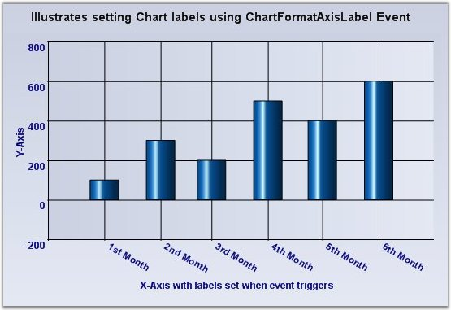
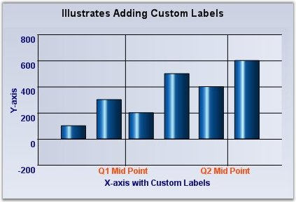
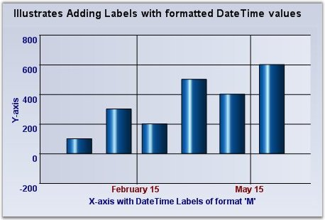

::: {style="DISPLAY: none"}
{#d2h_url_template}{#d2h_package_url style="WIDTH: 0px; DISPLAY: none; HEIGHT: 0px"}
:::

:::::: {.d2h_secondary_topic style="PADDING-BOTTOM: 10pt; MARGIN: 0pt; PADDING-LEFT: 0pt; PADDING-RIGHT: 0pt; PADDING-TOP: 0pt"}
#### Customizing Label Text {#customizing-label-text style="tab-stops: 0pt"}

The formatting options specified above will usually satisfy the label text requirements. However, there are many other scenarios where this might not be sufficient. The following table lists a way to customize the text rendered in the label:

Customizing the label text for the intervals, which is generated automatically.

 

::: {align="center"}
  ---------------------- ----------------------------------------------------------------------------------------------------------------------
  ChartAxis Event        Description
  ChartFormatAxisLabel   The event that gets raised for each label before getting rendered. This is a good place to customize the label text.
  ---------------------- ----------------------------------------------------------------------------------------------------------------------
:::

[]{style="FONT-FAMILY: 'Times New Roman','serif'; FONT-SIZE: 12pt"} 

The following ChartFormatAxisLabelEventArgs properties provide information specific to this event:

 

::: {align="center"}
  ------------------------------- ------------------------------------------------------------------------------------------------
  ChartFormatAxisLabelEventArgs   Description
  AxisOrientation                 Returns the orientation of the axis for which the label is being generated.
  Handled                         Indicates whether this event was handled and no further processing is required from the chart.
  IsAxisPrimary                   Indicates whether the axis for which the label is being generated is a primary axis.
  Label                           Gets or sets the label that is to be rendered.
  Value                           Returns the value associated with the position of the label.
  ValueAsDate                     Returns the value associated with the position of the label as DateTime.
  ------------------------------- ------------------------------------------------------------------------------------------------
:::

[]{style="FONT-FAMILY: 'Times New Roman','serif'; FONT-SIZE: 12pt"} 

+---------------------------------------------------------------------------------------------------------------------------------------+
| \[C#\]                                                                                                                                |
|                                                                                                                                       |
| [Refer the below code snippets for using the ChartformatAxislabel event.]{style="FONT-FAMILY: 'Courier New'"}                         |
|                                                                                                                                       |
| [private void chartControl1_ChartFormatAxisLabel(object sender, ChartFormatAxisLabelEventArgs e)]{style="FONT-FAMILY: 'Courier New'"} |
|                                                                                                                                       |
| [{]{style="FONT-FAMILY: 'Courier New'"}                                                                                               |
|                                                                                                                                       |
| [    if (e.AxisOrientation == ChartOrientation.Horizontal)]{style="FONT-FAMILY: 'Courier New'"}                                       |
|                                                                                                                                       |
| [    {]{style="FONT-FAMILY: 'Courier New'"}                                                                                           |
|                                                                                                                                       |
| [       if (e.ValueAsDate.Month == 1)]{style="FONT-FAMILY: 'Courier New'"}                                                            |
|                                                                                                                                       |
| [            e.Label = \"1st Month\";]{style="FONT-FAMILY: 'Courier New'"}                                                            |
|                                                                                                                                       |
| [        else if (e.ValueAsDate.Month == 2)]{style="FONT-FAMILY: 'Courier New'"}                                                      |
|                                                                                                                                       |
| [            e.Label = \"2nd Month\";]{style="FONT-FAMILY: 'Courier New'"}                                                            |
|                                                                                                                                       |
| [        else if (e.ValueAsDate.Month == 3)]{style="FONT-FAMILY: 'Courier New'"}                                                      |
|                                                                                                                                       |
| [            e.Label = \"3rd Month\";]{style="FONT-FAMILY: 'Courier New'"}                                                            |
|                                                                                                                                       |
| [        else if (e.ValueAsDate.Month == 4)]{style="FONT-FAMILY: 'Courier New'"}                                                      |
|                                                                                                                                       |
| [            e.Label = \"4th Month\";]{style="FONT-FAMILY: 'Courier New'"}                                                            |
|                                                                                                                                       |
| [        else if (e.ValueAsDate.Month == 5)]{style="FONT-FAMILY: 'Courier New'"}                                                      |
|                                                                                                                                       |
| [            e.Label = \"5th Month\";]{style="FONT-FAMILY: 'Courier New'"}                                                            |
|                                                                                                                                       |
| [        else if (e.ValueAsDate.Month == 6)]{style="FONT-FAMILY: 'Courier New'"}                                                      |
|                                                                                                                                       |
| [            e.Label = \"6th Month\";]{style="FONT-FAMILY: 'Courier New'"}                                                            |
|                                                                                                                                       |
| [        e.Handled = true;]{style="FONT-FAMILY: 'Courier New'"}                                                                       |
|                                                                                                                                       |
| [    }]{style="FONT-FAMILY: 'Courier New'"}                                                                                           |
|                                                                                                                                       |
| [}]{style="FONT-FAMILY: 'Courier New'"}[]{style="FONT-FAMILY: 'Times New Roman','serif'; FONT-SIZE: 12pt"}                            |
+---------------------------------------------------------------------------------------------------------------------------------------+

{border="0"}

Figure 272: Customized chart labels

Using Custom Text

Specify a set of custom labels thereby also dictating the intervals.

**[]{style="FONT-FAMILY: 'Times New Roman','serif'; FONT-SIZE: 12pt"}** 

::: {align="center"}
+-----------------------------------+------------------------------------------------------------------------------------------------------------------------------------------------------------------------+
| ChartAxis Property                | Description                                                                                                                                                            |
+-----------------------------------+------------------------------------------------------------------------------------------------------------------------------------------------------------------------+
| TickLabelsDrawingMode             | AutomaticMode - Labels will be determined by the engine.                                                                                                               |
|                                   |                                                                                                                                                                        |
|                                   | UserMode - Labels from the Labels collection will be used.                                                                                                             |
|                                   |                                                                                                                                                                        |
|                                   | BothUserAndAutomaticMode - Both labels from the Automatic mode and User mode will be rendered.                                                                         |
|                                   |                                                                                                                                                                        |
|                                   | None - Labels will not be rendered.                                                                                                                                    |
+-----------------------------------+------------------------------------------------------------------------------------------------------------------------------------------------------------------------+
| Labels                            | A custom collection that allows you to fully customize the labels that get generated. The TickLabelsDrawingMode should be set to UserMode or BothUserAndAutomaticMode. |
+-----------------------------------+------------------------------------------------------------------------------------------------------------------------------------------------------------------------+
:::

[]{style="FONT-FAMILY: 'Times New Roman','serif'; FONT-SIZE: 12pt"} 

{border="0"}

Figure 273: Chart with \'Q1 Mid Point\' and \'Q2 Mid Point\' custom labels

[]{style="FONT-FAMILY: 'Times New Roman','serif'; FONT-SIZE: 12pt"} 

Using Formatted Text

The diagram displayed below shows the custom date formatting.

{border="0"}

Figure 274: DateTime formatted labels at the specified intervals

[]{style="FONT-FAMILY: 'Calibri','sans-serif'"} 

[]{#related-topics}
::::::
