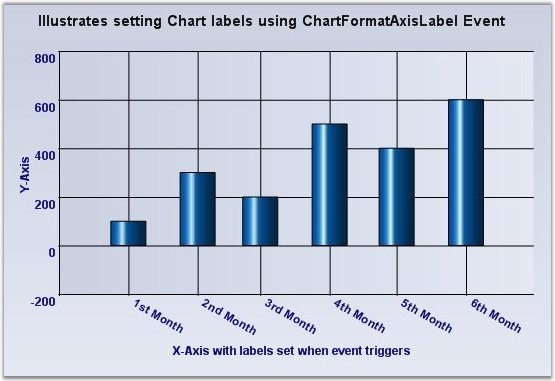
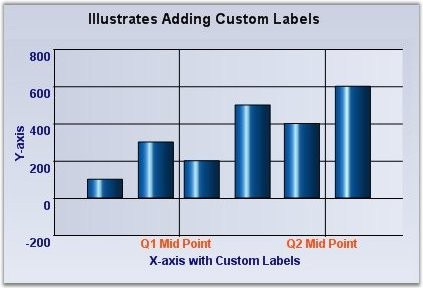
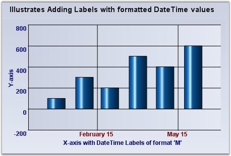

::: {style="DISPLAY: none"}
{#d2h_url_template}{#d2h_package_url style="WIDTH: 0px; DISPLAY: none; HEIGHT: 0px"}
:::

:::::: {.d2h_secondary_topic style="PADDING-BOTTOM: 10pt; MARGIN: 0pt; PADDING-LEFT: 0pt; PADDING-RIGHT: 0pt; PADDING-TOP: 0pt"}
#### Customizing Label Text {#customizing-label-text style="tab-stops: 0pt"}

 

The formatting options above will usually satisfy the label text requirements. However, there are many other scenarios where this might not be sufficient. Here are some ways to customize the text rendered in the label.

 

Customizing the label text for the automatically generated intervals

 

::: {align="center"}
  ---------------------- ----------------------------------------------------------------------------------------------------------------------
  ChartAxis Event        Description
  ChartFormatAxisLabel   The event that gets raised for each label before getting rendered. This is a good place to customize the label text.
  ---------------------- ----------------------------------------------------------------------------------------------------------------------
:::

 

The following ChartFormatAxisLabelEventArgs properties provide information specific to this event.

 

::: {align="center"}
  ------------------------------- ------------------------------------------------------------------------------------------------
  ChartFormatAxisLabel Property   Description
  AxisOrientation                 Returns the orientation of the axis for which the label is being generated.
  Handled                         Indicates whether this event was handled and no further processing is required from the chart.
  IsAxisPrimary                   Indicates whether the axis for which the label is being generated is a primary axis.
  Label                           Gets / sets the label that is to be rendered.
  Value                           Returns the value associated with the position of the label.
  ValueAsDate                     Returns the value associated with the position of the label as **DateTime**.
  Tooltip                         Specifies the content of the tooltip.
  ------------------------------- ------------------------------------------------------------------------------------------------
:::

 

+---------------------------------------------------------------------------------------------------------------------------------------------------------------------------------------------------------------------------------------------------------------+
| **[\[C#\]]{style="FONT-FAMILY: 'Courier New'; COLOR: black"}**                                                                                                                                                                                                |
|                                                                                                                                                                                                                                                               |
| []{style="FONT-FAMILY: 'Courier New'; COLOR: green"}                                                                                                                                                                                                          |
|                                                                                                                                                                                                                                                               |
| [private]{style="FONT-FAMILY: 'Courier New'; COLOR: blue"}[ [void]{style="COLOR: blue"} chartControl1_ChartFormatAxisLabel([object]{style="COLOR: blue"} sender, [ChartFormatAxisLabelEventArgs]{style="COLOR: teal"} e)]{style="FONT-FAMILY: 'Courier New'"} |
|                                                                                                                                                                                                                                                               |
| [{]{style="FONT-FAMILY: 'Courier New'"}                                                                                                                                                                                                                       |
|                                                                                                                                                                                                                                                               |
| [    [if]{style="COLOR: blue"} (e.AxisOrientation == [ChartOrientation]{style="COLOR: teal"}.Horizontal)]{style="FONT-FAMILY: 'Courier New'"}                                                                                                                 |
|                                                                                                                                                                                                                                                               |
| [    {]{style="FONT-FAMILY: 'Courier New'"}                                                                                                                                                                                                                   |
|                                                                                                                                                                                                                                                               |
| [       [if]{style="COLOR: blue"} (e.ValueAsDate.Month == 1)]{style="FONT-FAMILY: 'Courier New'"}                                                                                                                                                             |
|                                                                                                                                                                                                                                                               |
| [            e.Label = [\"1st Month\"]{style="COLOR: maroon"};]{style="FONT-FAMILY: 'Courier New'"}                                                                                                                                                           |
|                                                                                                                                                                                                                                                               |
| [        [else]{style="COLOR: blue"} [if]{style="COLOR: blue"} (e.ValueAsDate.Month == 2)]{style="FONT-FAMILY: 'Courier New'"}                                                                                                                                |
|                                                                                                                                                                                                                                                               |
| [            e.Label = [\"2nd Month\"]{style="COLOR: maroon"};]{style="FONT-FAMILY: 'Courier New'"}                                                                                                                                                           |
|                                                                                                                                                                                                                                                               |
| [        [else]{style="COLOR: blue"} [if]{style="COLOR: blue"} (e.ValueAsDate.Month == 3)]{style="FONT-FAMILY: 'Courier New'"}                                                                                                                                |
|                                                                                                                                                                                                                                                               |
| [            e.Label = [\"3rd Month\"]{style="COLOR: maroon"};]{style="FONT-FAMILY: 'Courier New'"}                                                                                                                                                           |
|                                                                                                                                                                                                                                                               |
| [        [else]{style="COLOR: blue"} [if]{style="COLOR: blue"} (e.ValueAsDate.Month == 4)]{style="FONT-FAMILY: 'Courier New'"}                                                                                                                                |
|                                                                                                                                                                                                                                                               |
| [            e.Label = [\"4th Month\"]{style="COLOR: maroon"};]{style="FONT-FAMILY: 'Courier New'"}                                                                                                                                                           |
|                                                                                                                                                                                                                                                               |
| [        [else]{style="COLOR: blue"} [if]{style="COLOR: blue"} (e.ValueAsDate.Month == 5)]{style="FONT-FAMILY: 'Courier New'"}                                                                                                                                |
|                                                                                                                                                                                                                                                               |
| [            e.Label = [\"5th Month\"]{style="COLOR: maroon"};]{style="FONT-FAMILY: 'Courier New'"}                                                                                                                                                           |
|                                                                                                                                                                                                                                                               |
| [        [else]{style="COLOR: blue"} [if]{style="COLOR: blue"} (e.ValueAsDate.Month == 6)]{style="FONT-FAMILY: 'Courier New'"}                                                                                                                                |
|                                                                                                                                                                                                                                                               |
| [            e.Label = [\"6th Month\"]{style="COLOR: maroon"};]{style="FONT-FAMILY: 'Courier New'"}                                                                                                                                                           |
|                                                                                                                                                                                                                                                               |
| [        e.Handled = [true]{style="COLOR: blue"};]{style="FONT-FAMILY: 'Courier New'"}                                                                                                                                                                        |
|                                                                                                                                                                                                                                                               |
| [    }]{style="FONT-FAMILY: 'Courier New'"}                                                                                                                                                                                                                   |
|                                                                                                                                                                                                                                                               |
| [}]{style="FONT-FAMILY: 'Courier New'"}                                                                                                                                                                                                                       |
+---------------------------------------------------------------------------------------------------------------------------------------------------------------------------------------------------------------------------------------------------------------+

 

+-----------------------------------------------------------------------------------------------------------------------------------------------------------------------------------------------------------------------------------------------------------------------------------------------------------------------------------------------------+
| **[\[VB\]]{style="FONT-FAMILY: 'Courier New'; COLOR: black"}**                                                                                                                                                                                                                                                                                      |
|                                                                                                                                                                                                                                                                                                                                                     |
| []{style="FONT-FAMILY: 'Courier New'; COLOR: green"}                                                                                                                                                                                                                                                                                                |
|                                                                                                                                                                                                                                                                                                                                                     |
| [Private]{style="FONT-FAMILY: 'Courier New'; COLOR: blue"}[ [Sub]{style="COLOR: blue"} chartControl1_ChartFormatAxisLabel([ByVal]{style="COLOR: blue"} sender [As]{style="COLOR: blue"} [Object]{style="COLOR: blue"}, [ByVal]{style="COLOR: blue"} e [As]{style="COLOR: blue"} ChartFormatAxisLabelEventArgs)]{style="FONT-FAMILY: 'Courier New'"} |
|                                                                                                                                                                                                                                                                                                                                                     |
| [    [If]{style="COLOR: blue"} e.AxisOrientation = ChartOrientation.Horizontal [Then]{style="COLOR: blue"}]{style="FONT-FAMILY: 'Courier New'"}                                                                                                                                                                                                     |
|                                                                                                                                                                                                                                                                                                                                                     |
| [         [If]{style="COLOR: blue"} e.ValueAsDate.Month = 1 [Then]{style="COLOR: blue"}]{style="FONT-FAMILY: 'Courier New'"}                                                                                                                                                                                                                        |
|                                                                                                                                                                                                                                                                                                                                                     |
| [              e.Label = [\"1st Month\"]{style="COLOR: maroon"}]{style="FONT-FAMILY: 'Courier New'"}                                                                                                                                                                                                                                                |
|                                                                                                                                                                                                                                                                                                                                                     |
| [          [ElseIf]{style="COLOR: blue"} e.ValueAsDate.Month = 2 [Then]{style="COLOR: blue"}]{style="FONT-FAMILY: 'Courier New'"}                                                                                                                                                                                                                   |
|                                                                                                                                                                                                                                                                                                                                                     |
| [              e.Label = [\"2nd Month\"]{style="COLOR: maroon"}]{style="FONT-FAMILY: 'Courier New'"}                                                                                                                                                                                                                                                |
|                                                                                                                                                                                                                                                                                                                                                     |
| [          [ElseIf]{style="COLOR: blue"} e.ValueAsDate.Month = 3 [Then]{style="COLOR: blue"}]{style="FONT-FAMILY: 'Courier New'"}                                                                                                                                                                                                                   |
|                                                                                                                                                                                                                                                                                                                                                     |
| [              e.Label = [\"3rd Month\"]{style="COLOR: maroon"}]{style="FONT-FAMILY: 'Courier New'"}                                                                                                                                                                                                                                                |
|                                                                                                                                                                                                                                                                                                                                                     |
| [          [ElseIf]{style="COLOR: blue"} e.ValueAsDate.Month = 4 [Then]{style="COLOR: blue"}]{style="FONT-FAMILY: 'Courier New'"}                                                                                                                                                                                                                   |
|                                                                                                                                                                                                                                                                                                                                                     |
| [              e.Label = [\"4th Month\"]{style="COLOR: maroon"}]{style="FONT-FAMILY: 'Courier New'"}                                                                                                                                                                                                                                                |
|                                                                                                                                                                                                                                                                                                                                                     |
| [          [ElseIf]{style="COLOR: blue"} e.ValueAsDate.Month = 5 [Then]{style="COLOR: blue"}]{style="FONT-FAMILY: 'Courier New'"}                                                                                                                                                                                                                   |
|                                                                                                                                                                                                                                                                                                                                                     |
| [              e.Label = [\"5th Month\"]{style="COLOR: maroon"}]{style="FONT-FAMILY: 'Courier New'"}                                                                                                                                                                                                                                                |
|                                                                                                                                                                                                                                                                                                                                                     |
| [          [ElseIf]{style="COLOR: blue"} e.ValueAsDate.Month = 6 [Then]{style="COLOR: blue"}]{style="FONT-FAMILY: 'Courier New'"}                                                                                                                                                                                                                   |
|                                                                                                                                                                                                                                                                                                                                                     |
| [              e.Label = [\"6th Month\"]{style="COLOR: maroon"}]{style="FONT-FAMILY: 'Courier New'"}                                                                                                                                                                                                                                                |
|                                                                                                                                                                                                                                                                                                                                                     |
| [          [End]{style="COLOR: blue"} [If]{style="COLOR: blue"}]{style="FONT-FAMILY: 'Courier New'"}                                                                                                                                                                                                                                                |
|                                                                                                                                                                                                                                                                                                                                                     |
| [           e.Handled = [True]{style="COLOR: blue"}]{style="FONT-FAMILY: 'Courier New'"}                                                                                                                                                                                                                                                            |
|                                                                                                                                                                                                                                                                                                                                                     |
| [     [End]{style="COLOR: blue"} [If]{style="COLOR: blue"}]{style="FONT-FAMILY: 'Courier New'"}                                                                                                                                                                                                                                                     |
|                                                                                                                                                                                                                                                                                                                                                     |
| [End]{style="FONT-FAMILY: 'Courier New'; COLOR: blue"}[ [Sub]{style="COLOR: blue"}]{style="FONT-FAMILY: 'Courier New'"}                                                                                                                                                                                                                             |
+-----------------------------------------------------------------------------------------------------------------------------------------------------------------------------------------------------------------------------------------------------------------------------------------------------------------------------------------------------+

[]{style="COLOR: red; FONT-SIZE: 8pt"} 

{border="0"}

[]{style="COLOR: red; FONT-SIZE: 8pt"} 

Figure 258: Customized Chart Labels

[]{style="COLOR: red; FONT-SIZE: 8pt"} 

**Specify a set of custom labels thereby dictating the intervals as well**

 

1\. **Using Custom Text**

 

::: {align="center"}
+-----------------------------------+----------------------------------------------------------------------------------------------------------------------------------------------------------------------------+
|                                   |                                                                                                                                                                            |
|                                   |                                                                                                                                                                            |
| **ChartAxis Property**            | **Description**                                                                                                                                                            |
+-----------------------------------+----------------------------------------------------------------------------------------------------------------------------------------------------------------------------+
|                                   |                                                                                                                                                                            |
|                                   |                                                                                                                                                                            |
| TickLabelsDrawingMode             | **AutomaticMode** - Labels will be determined by the engine.                                                                                                               |
|                                   |                                                                                                                                                                            |
|                                   | **UserMode** - Labels from the Labels collection will be used.                                                                                                             |
|                                   |                                                                                                                                                                            |
|                                   | **BothUserAndAutomaticMode** - Both labels from the automatic mode and user mode will be rendered.                                                                         |
|                                   |                                                                                                                                                                            |
|                                   | **None** - Labels will not be rendered.                                                                                                                                    |
+-----------------------------------+----------------------------------------------------------------------------------------------------------------------------------------------------------------------------+
|                                   |                                                                                                                                                                            |
|                                   |                                                                                                                                                                            |
| Labels                            | A custom collection that lets you fully customize the labels that gets generated. The TickLabelsDrawingMode should be set to **UserMode** or **BothUserAndAutomaticMode**. |
+-----------------------------------+----------------------------------------------------------------------------------------------------------------------------------------------------------------------------+
:::

[]{style="FONT-FAMILY: 'Courier New'; COLOR: green"} 

+--------------------------------------------------------------------------------------------------------------------------------------------------------------------------------------------------------------------------------------------------------------------------------------------------------------------------------------------------------------------------------------------------------------------------------------------------------------------------------------------------------------------------------------------------------------------------------------------------------------------------------------+
| **[\[C#\]]{style="FONT-FAMILY: 'Courier New'; COLOR: black"}**                                                                                                                                                                                                                                                                                                                                                                                                                                                                                                                                                                       |
|                                                                                                                                                                                                                                                                                                                                                                                                                                                                                                                                                                                                                                      |
| []{style="FONT-FAMILY: 'Courier New'; COLOR: green"}                                                                                                                                                                                                                                                                                                                                                                                                                                                                                                                                                                                 |
|                                                                                                                                                                                                                                                                                                                                                                                                                                                                                                                                                                                                                                      |
| [//Setting drawing mode]{style="FONT-FAMILY: 'Courier New'; COLOR: green"}                                                                                                                                                                                                                                                                                                                                                                                                                                                                                                                                                           |
|                                                                                                                                                                                                                                                                                                                                                                                                                                                                                                                                                                                                                                      |
| [this]{style="FONT-FAMILY: 'Courier New'; COLOR: blue"}[.chartControl1.PrimaryXAxis.TickLabelsDrawingMode = [ChartAxisTickLabelDrawingMode]{style="COLOR: teal"}.UserMode;]{style="FONT-FAMILY: 'Courier New'"}                                                                                                                                                                                                                                                                                                                                                                                                                      |
|                                                                                                                                                                                                                                                                                                                                                                                                                                                                                                                                                                                                                                      |
| []{style="FONT-FAMILY: 'Courier New'; COLOR: green"}                                                                                                                                                                                                                                                                                                                                                                                                                                                                                                                                                                                 |
|                                                                                                                                                                                                                                                                                                                                                                                                                                                                                                                                                                                                                                      |
| [//Adding new labels]{style="FONT-FAMILY: 'Courier New'; COLOR: green"}                                                                                                                                                                                                                                                                                                                                                                                                                                                                                                                                                              |
|                                                                                                                                                                                                                                                                                                                                                                                                                                                                                                                                                                                                                                      |
| [this]{style="FONT-FAMILY: 'Courier New'; COLOR: blue"}[.chartControl1.PrimaryXAxis.Labels.Add([new]{style="COLOR: blue"} [ChartAxisLabel]{style="COLOR: teal"}([\"Q1 Mid Point\"]{style="COLOR: maroon"}, [Color]{style="COLOR: teal"}.OrangeRed, [new]{style="COLOR: blue"} [Font]{style="COLOR: teal"}([\"Arial\"]{style="COLOR: maroon"}, 8F, System.Drawing.[FontStyle]{style="COLOR: teal"}.Bold), [new]{style="COLOR: blue"} [DateTime]{style="COLOR: teal"}(2007, 2, 15), [\"\"]{style="COLOR: maroon"}, [\"\", ]{style="COLOR: maroon"}[ChartValueType]{style="COLOR: teal"}.Custom));]{style="FONT-FAMILY: 'Courier New'"} |
|                                                                                                                                                                                                                                                                                                                                                                                                                                                                                                                                                                                                                                      |
| [this]{style="FONT-FAMILY: 'Courier New'; COLOR: blue"}[.chartControl1.PrimaryXAxis.Labels.Add([new]{style="COLOR: blue"} [ChartAxisLabel]{style="COLOR: teal"}([\"Q2 Mid Point\"]{style="COLOR: maroon"}, [Color]{style="COLOR: teal"}.OrangeRed, [new]{style="COLOR: blue"} [Font]{style="COLOR: teal"}([\"Arial\"]{style="COLOR: maroon"}, 8F, System.Drawing.[FontStyle]{style="COLOR: teal"}.Bold), [new]{style="COLOR: blue"} [DateTime]{style="COLOR: teal"}(2007, 5, 15), [\"\"]{style="COLOR: maroon"}, [\"\", ]{style="COLOR: maroon"}[ChartValueType]{style="COLOR: teal"}.Custom));]{style="FONT-FAMILY: 'Courier New'"} |
+--------------------------------------------------------------------------------------------------------------------------------------------------------------------------------------------------------------------------------------------------------------------------------------------------------------------------------------------------------------------------------------------------------------------------------------------------------------------------------------------------------------------------------------------------------------------------------------------------------------------------------------+

 

+-------------------------------------------------------------------------------------------------------------------------------------------------------------------------------------------------------------------------------------------------------------------------------------------------------------------------------------------------------------------------------------------------------------------------------------------------------------------------------------------------------------------------------------------------------------------------------------+
| **[\[VB\]]{style="FONT-FAMILY: 'Courier New'; COLOR: black"}**                                                                                                                                                                                                                                                                                                                                                                                                                                                                                                                      |
|                                                                                                                                                                                                                                                                                                                                                                                                                                                                                                                                                                                     |
| []{style="FONT-FAMILY: 'Courier New'; COLOR: green"}                                                                                                                                                                                                                                                                                                                                                                                                                                                                                                                                |
|                                                                                                                                                                                                                                                                                                                                                                                                                                                                                                                                                                                     |
| [\'Setting drawing mode]{style="FONT-FAMILY: 'Courier New'; COLOR: green"}                                                                                                                                                                                                                                                                                                                                                                                                                                                                                                          |
|                                                                                                                                                                                                                                                                                                                                                                                                                                                                                                                                                                                     |
| [Me]{style="FONT-FAMILY: 'Courier New'; COLOR: blue"}[.chartControl1.PrimaryXAxis.TickLabelsDrawingMode = [ChartAxisTickLabelDrawingMode]{style="COLOR: teal"}.UserMode]{style="FONT-FAMILY: 'Courier New'"}                                                                                                                                                                                                                                                                                                                                                                        |
|                                                                                                                                                                                                                                                                                                                                                                                                                                                                                                                                                                                     |
| []{style="FONT-FAMILY: 'Courier New'; COLOR: green"}                                                                                                                                                                                                                                                                                                                                                                                                                                                                                                                                |
|                                                                                                                                                                                                                                                                                                                                                                                                                                                                                                                                                                                     |
| [\'Adding new labels]{style="FONT-FAMILY: 'Courier New'; COLOR: green"}                                                                                                                                                                                                                                                                                                                                                                                                                                                                                                             |
|                                                                                                                                                                                                                                                                                                                                                                                                                                                                                                                                                                                     |
| [Me]{style="FONT-FAMILY: 'Courier New'; COLOR: blue"}[.chartControl1.PrimaryXAxis.Labels.Add([New]{style="COLOR: blue"} ChartAxisLabel([\"Q1 Mid Point\"]{style="COLOR: maroon"}, Color.OrangeRed, [New]{style="COLOR: blue"} [Font]{style="COLOR: teal"}([\"Arial\"]{style="COLOR: maroon"}, 8F, System.Drawing.[FontStyle]{style="COLOR: teal"}.Bold), [New]{style="COLOR: blue"} [DateTime]{style="COLOR: teal"}(2007, 2, 15), [\"\"]{style="COLOR: maroon"}, [\"\", ]{style="COLOR: maroon"}[ChartValueType]{style="COLOR: teal"}.Custom))]{style="FONT-FAMILY: 'Courier New'"} |
|                                                                                                                                                                                                                                                                                                                                                                                                                                                                                                                                                                                     |
| [Me]{style="FONT-FAMILY: 'Courier New'; COLOR: blue"}[.chartControl1.PrimaryXAxis.Labels.Add([New]{style="COLOR: blue"} ChartAxisLabel([\"Q2 Mid Point\"]{style="COLOR: maroon"}, Color.OrangeRed, [New]{style="COLOR: blue"} [Font]{style="COLOR: teal"}([\"Arial\"]{style="COLOR: maroon"}, 8F, System.Drawing.[FontStyle]{style="COLOR: teal"}.Bold), [New]{style="COLOR: blue"} [DateTime]{style="COLOR: teal"}(2007, 5, 15), [\"\"]{style="COLOR: maroon"}, [\"\", ]{style="COLOR: maroon"}[ChartValueType]{style="COLOR: teal"}.Custom))]{style="FONT-FAMILY: 'Courier New'"} |
+-------------------------------------------------------------------------------------------------------------------------------------------------------------------------------------------------------------------------------------------------------------------------------------------------------------------------------------------------------------------------------------------------------------------------------------------------------------------------------------------------------------------------------------------------------------------------------------+

[]{style="FONT-FAMILY: 'Courier New'; COLOR: red"} 

{border="0"}

 

Figure 259: Chart with \'Q1 Mid Point\' and \'Q2 Mid Point\' Custom Labels

 

2\. **Using Formatted Text**

[]{style="FONT-FAMILY: 'Courier New'; COLOR: red"} 

+---------------------------------------------------------------------------------------------------------------------------------------------------------------------------------------------------------------------------------------------------------------------------------------------------------------------------------------------------------------------------------------------------------------------------------------------------------------------------------------------------------------------------------------------------------------------------------------------------------------------------+
| **[\[C#\]]{style="FONT-FAMILY: 'Courier New'; COLOR: black"}**                                                                                                                                                                                                                                                                                                                                                                                                                                                                                                                                                            |
|                                                                                                                                                                                                                                                                                                                                                                                                                                                                                                                                                                                                                           |
| []{style="FONT-FAMILY: 'Courier New'; COLOR: green"}                                                                                                                                                                                                                                                                                                                                                                                                                                                                                                                                                                      |
|                                                                                                                                                                                                                                                                                                                                                                                                                                                                                                                                                                                                                           |
| [//Setting drawing mode]{style="FONT-FAMILY: 'Courier New'; COLOR: green"}                                                                                                                                                                                                                                                                                                                                                                                                                                                                                                                                                |
|                                                                                                                                                                                                                                                                                                                                                                                                                                                                                                                                                                                                                           |
| [this]{style="FONT-FAMILY: 'Courier New'; COLOR: blue"}[.chartControl1.PrimaryXAxis.TickLabelsDrawingMode = [ChartAxisTickLabelDrawingMode]{style="COLOR: teal"}.UserMode;]{style="FONT-FAMILY: 'Courier New'"}                                                                                                                                                                                                                                                                                                                                                                                                           |
|                                                                                                                                                                                                                                                                                                                                                                                                                                                                                                                                                                                                                           |
| []{style="FONT-FAMILY: 'Courier New'; COLOR: green"}                                                                                                                                                                                                                                                                                                                                                                                                                                                                                                                                                                      |
|                                                                                                                                                                                                                                                                                                                                                                                                                                                                                                                                                                                                                           |
| [\'Adding new labels]{style="FONT-FAMILY: 'Courier New'; COLOR: green"}                                                                                                                                                                                                                                                                                                                                                                                                                                                                                                                                                   |
|                                                                                                                                                                                                                                                                                                                                                                                                                                                                                                                                                                                                                           |
| [this]{style="FONT-FAMILY: 'Courier New'; COLOR: blue"}[.chartControl1.PrimaryXAxis.Labels.Add([new]{style="COLOR: blue"} [ChartAxisLabel]{style="COLOR: teal"}([\"\"]{style="COLOR: maroon"}, [Color]{style="COLOR: teal"}.Maroon, [new]{style="COLOR: blue"} [Font]{style="COLOR: teal"}([\"Arial\"]{style="COLOR: maroon"}, 9F, System.Drawing.[FontStyle]{style="COLOR: teal"}.Bold), [new]{style="COLOR: blue"} [DateTime]{style="COLOR: teal"}(2007, 2, 15), [\"\"]{style="COLOR: maroon"}, [\"M\", ]{style="COLOR: maroon"}[ChartValueType]{style="COLOR: teal"}.DateTime));]{style="FONT-FAMILY: 'Courier New'"}  |
|                                                                                                                                                                                                                                                                                                                                                                                                                                                                                                                                                                                                                           |
| [this]{style="FONT-FAMILY: 'Courier New'; COLOR: blue"}[.chartControl1.PrimaryXAxis.Labels.Add([new]{style="COLOR: blue"} [ChartAxisLabel]{style="COLOR: teal"}([\"\"]{style="COLOR: maroon"}, [Color]{style="COLOR: teal"}.Maroon, [new]{style="COLOR: blue"} [Font]{style="COLOR: teal"}([\"Arial\"]{style="COLOR: maroon"}, 9F, System.Drawing.[FontStyle]{style="COLOR: teal"}.Bold), [new]{style="COLOR: blue"} [DateTime]{style="COLOR: teal"}(2007, 05, 15), [\"\"]{style="COLOR: maroon"}, [\"M\", ]{style="COLOR: maroon"}[ChartValueType]{style="COLOR: teal"}.DateTime));]{style="FONT-FAMILY: 'Courier New'"} |
+---------------------------------------------------------------------------------------------------------------------------------------------------------------------------------------------------------------------------------------------------------------------------------------------------------------------------------------------------------------------------------------------------------------------------------------------------------------------------------------------------------------------------------------------------------------------------------------------------------------------------+

 

+--------------------------------------------------------------------------------------------------------------------------------------------------------------------------------------------------------------------------------------------------------------------------------------------------------------------------------------------------------------------------------------------------------------------------------------------------------------------------------------------------------------------------------------------------------------------------+
| **[\[VB\]]{style="FONT-FAMILY: 'Courier New'; COLOR: black"}**                                                                                                                                                                                                                                                                                                                                                                                                                                                                                                           |
|                                                                                                                                                                                                                                                                                                                                                                                                                                                                                                                                                                          |
| []{style="FONT-FAMILY: 'Courier New'; COLOR: green"}                                                                                                                                                                                                                                                                                                                                                                                                                                                                                                                     |
|                                                                                                                                                                                                                                                                                                                                                                                                                                                                                                                                                                          |
| [\'Setting drawing mode]{style="FONT-FAMILY: 'Courier New'; COLOR: green"}                                                                                                                                                                                                                                                                                                                                                                                                                                                                                               |
|                                                                                                                                                                                                                                                                                                                                                                                                                                                                                                                                                                          |
| [Me]{style="FONT-FAMILY: 'Courier New'; COLOR: blue"}[.chartControl1.PrimaryXAxis.TickLabelsDrawingMode = [ChartAxisTickLabelDrawingMode]{style="COLOR: teal"}.UserMode]{style="FONT-FAMILY: 'Courier New'"}                                                                                                                                                                                                                                                                                                                                                             |
|                                                                                                                                                                                                                                                                                                                                                                                                                                                                                                                                                                          |
| [\'Clearing all the default labels]{style="FONT-FAMILY: 'Courier New'; COLOR: green"}                                                                                                                                                                                                                                                                                                                                                                                                                                                                                    |
|                                                                                                                                                                                                                                                                                                                                                                                                                                                                                                                                                                          |
| [this]{style="FONT-FAMILY: 'Courier New'; COLOR: blue"}[.chartControl1.PrimaryXAxis.Labels.Clear()]{style="FONT-FAMILY: 'Courier New'"}                                                                                                                                                                                                                                                                                                                                                                                                                                  |
|                                                                                                                                                                                                                                                                                                                                                                                                                                                                                                                                                                          |
| [\'Adding new labels]{style="FONT-FAMILY: 'Courier New'; COLOR: green"}                                                                                                                                                                                                                                                                                                                                                                                                                                                                                                  |
|                                                                                                                                                                                                                                                                                                                                                                                                                                                                                                                                                                          |
| [Me]{style="FONT-FAMILY: 'Courier New'; COLOR: blue"}[.chartControl1.PrimaryXAxis.Labels.Add([New]{style="COLOR: blue"} ChartAxisLabel([\"\"]{style="COLOR: maroon"}, Color.Maroon, [New]{style="COLOR: blue"} [Font]{style="COLOR: teal"}([\"Arial\"]{style="COLOR: maroon"}, 9F, System.Drawing.[FontStyle]{style="COLOR: teal"}.Bold), [New]{style="COLOR: blue"} [DateTime]{style="COLOR: teal"}(2007, 2, 15), [\"\"]{style="COLOR: maroon"}, [\"M\", ]{style="COLOR: maroon"}[ChartValueType]{style="COLOR: teal"}.DateTime))]{style="FONT-FAMILY: 'Courier New'"}  |
|                                                                                                                                                                                                                                                                                                                                                                                                                                                                                                                                                                          |
| [Me]{style="FONT-FAMILY: 'Courier New'; COLOR: blue"}[.chartControl1.PrimaryXAxis.Labels.Add([New]{style="COLOR: blue"} ChartAxisLabel([\"\"]{style="COLOR: maroon"}, Color.Maroon, [New ]{style="COLOR: blue"}[Font]{style="COLOR: teal"}([\"Arial\"]{style="COLOR: maroon"}, 9F, System.Drawing.[FontStyle]{style="COLOR: teal"}.Bold), [New]{style="COLOR: blue"} [DateTime]{style="COLOR: teal"}(2007, 05, 15), [\"\"]{style="COLOR: maroon"}, [\"M\", ]{style="COLOR: maroon"}[ChartValueType]{style="COLOR: teal"}.DateTime))]{style="FONT-FAMILY: 'Courier New'"} |
+--------------------------------------------------------------------------------------------------------------------------------------------------------------------------------------------------------------------------------------------------------------------------------------------------------------------------------------------------------------------------------------------------------------------------------------------------------------------------------------------------------------------------------------------------------------------------+

 

{border="0"}

 

Figure 260: DateTime formatted labels at the specified Intervals

[]{#p183} 

[]{#related-topics}
::::::
