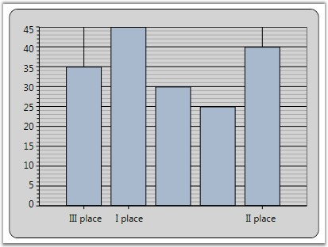
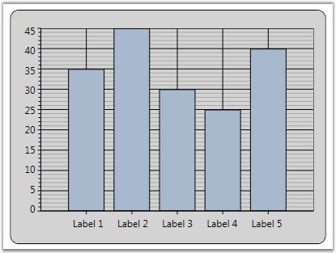

::: {style="DISPLAY: none"}
{#d2h_url_template}{#d2h_package_url style="WIDTH: 0px; DISPLAY: none; HEIGHT: 0px"}
:::

:::: {.d2h_secondary_topic style="PADDING-BOTTOM: 10pt; MARGIN: 0pt; PADDING-LEFT: 0pt; PADDING-RIGHT: 0pt; PADDING-TOP: 0pt"}
##### Customizing Label Text {#customizing-label-text style="tab-stops: 0pt"}

Apart from the default Labels displayed, you can also add Custom Labels to be displayed in the Chart. This section discusses the below topics.

 

Properties Used to Customize Label Text

The following properties are used to determine the data source for the text of the Labels.

 

Table 143: ChartAxis Property

::: {align="center"}
+-----------------------------------+----------------------------------------------------------------------------------------------------------------------------------+
| ChartAxis Property                | Description                                                                                                                      |
+-----------------------------------+----------------------------------------------------------------------------------------------------------------------------------+
| LabelsMode                        | *Auto*: content is determined automatically                                                                                      |
|                                   |                                                                                                                                  |
|                                   | *Custom*: custom values are used for labels content representation                                                               |
|                                   |                                                                                                                                  |
|                                   | *DataSource*: external datasource is used for labels content                                                                     |
|                                   |                                                                                                                                  |
|                                   | *Default*: content for labels is either determined automatically, taken from external dataSource or being set with custom values |
|                                   |                                                                                                                                  |
|                                   | *None*: labels values are taken from point\'s X-coordinate                                                                       |
+-----------------------------------+----------------------------------------------------------------------------------------------------------------------------------+
| LabelsSource                      | gets or sets the Labels Source                                                                                                   |
+-----------------------------------+----------------------------------------------------------------------------------------------------------------------------------+
| PositionPath                      | gets or sets the position path                                                                                                   |
+-----------------------------------+----------------------------------------------------------------------------------------------------------------------------------+
| ContentPath                       | gets or sets the content path                                                                                                    |
+-----------------------------------+----------------------------------------------------------------------------------------------------------------------------------+
:::

 

[By assigning the LabelsMode property to ChartAxis.CustomLabels, you can add Custom Labels to the ChartAxis.]{style="FONT-SIZE: 9pt"}

[]{style="FONT-SIZE: 9pt"} 

+----------------------------------------------------------------------------------------------------------------------------------------------------------------------------------------------------------------------------------------------------------------------------------------------------------------------------------------------------------------------------------------------------------------------------------------------------------------------------------------------------------------------------------------------------------------------------------------------------------+
| **[\[XAML\]]{style="FONT-FAMILY: 'Courier New'"}**                                                                                                                                                                                                                                                                                                                                                                                                                                                                                                                                                       |
|                                                                                                                                                                                                                                                                                                                                                                                                                                                                                                                                                                                                          |
| []{style="FONT-FAMILY: 'Courier New'"}                                                                                                                                                                                                                                                                                                                                                                                                                                                                                                                                                                   |
|                                                                                                                                                                                                                                                                                                                                                                                                                                                                                                                                                                                                          |
| [\<]{style="FONT-FAMILY: 'Courier New'; COLOR: blue"}[syncfusion]{style="FONT-FAMILY: 'Courier New'; COLOR: #a31515"}[:]{style="FONT-FAMILY: 'Courier New'; COLOR: blue"}[Chart]{style="FONT-FAMILY: 'Courier New'; COLOR: #a31515"}[ Name]{style="FONT-FAMILY: 'Courier New'; COLOR: red"}[=\"Chart1\" \>]{style="FONT-FAMILY: 'Courier New'; COLOR: blue"}                                                                                                                                                                                                                                             |
|                                                                                                                                                                                                                                                                                                                                                                                                                                                                                                                                                                                                          |
| [          ]{style="FONT-FAMILY: 'Courier New'; COLOR: #a31515"}[\<]{style="FONT-FAMILY: 'Courier New'; COLOR: blue"}[syncfusion]{style="FONT-FAMILY: 'Courier New'; COLOR: #a31515"}[:]{style="FONT-FAMILY: 'Courier New'; COLOR: blue"}[ChartArea]{style="FONT-FAMILY: 'Courier New'; COLOR: #a31515"}[ [Name]{style="COLOR: red"}[=\"area\" \>]{style="COLOR: blue"}]{style="FONT-FAMILY: 'Courier New'"}                                                                                                                                                                                             |
|                                                                                                                                                                                                                                                                                                                                                                                                                                                                                                                                                                                                          |
| [                    ]{style="FONT-FAMILY: 'Courier New'; COLOR: #a31515"}[\<]{style="FONT-FAMILY: 'Courier New'; COLOR: blue"}[syncfusion]{style="FONT-FAMILY: 'Courier New'; COLOR: #a31515"}[:]{style="FONT-FAMILY: 'Courier New'; COLOR: blue"}[ChartArea.PrimaryAxis]{style="FONT-FAMILY: 'Courier New'; COLOR: #a31515"}[\>]{style="FONT-FAMILY: 'Courier New'; COLOR: blue"}                                                                                                                                                                                                                      |
|                                                                                                                                                                                                                                                                                                                                                                                                                                                                                                                                                                                                          |
| [                        ]{style="FONT-FAMILY: 'Courier New'; COLOR: #a31515"}[\<]{style="FONT-FAMILY: 'Courier New'; COLOR: blue"}[syncfusion]{style="FONT-FAMILY: 'Courier New'; COLOR: #a31515"}[:]{style="FONT-FAMILY: 'Courier New'; COLOR: blue"}[ChartAxis]{style="FONT-FAMILY: 'Courier New'; COLOR: #a31515"}[ LabelsMode]{style="FONT-FAMILY: 'Courier New'; COLOR: red"}[=\"Custom\"]{style="FONT-FAMILY: 'Courier New'; COLOR: blue"}[ RangeCalculationMode]{style="FONT-FAMILY: 'Courier New'; COLOR: red"}[=\"AdjustAcrossChartTypes\"\>]{style="FONT-FAMILY: 'Courier New'; COLOR: blue"} |
|                                                                                                                                                                                                                                                                                                                                                                                                                                                                                                                                                                                                          |
| [                            ]{style="FONT-FAMILY: 'Courier New'; COLOR: #a31515"}[\<]{style="FONT-FAMILY: 'Courier New'; COLOR: blue"}[syncfusion]{style="FONT-FAMILY: 'Courier New'; COLOR: #a31515"}[:]{style="FONT-FAMILY: 'Courier New'; COLOR: blue"}[ChartAxis.CustomLabels]{style="FONT-FAMILY: 'Courier New'; COLOR: #a31515"}[\>]{style="FONT-FAMILY: 'Courier New'; COLOR: blue"}                                                                                                                                                                                                             |
|                                                                                                                                                                                                                                                                                                                                                                                                                                                                                                                                                                                                          |
| [                                ]{style="FONT-FAMILY: 'Courier New'; COLOR: #a31515"}[\<]{style="FONT-FAMILY: 'Courier New'; COLOR: blue"}[syncfusion]{style="FONT-FAMILY: 'Courier New'; COLOR: #a31515"}[:]{style="FONT-FAMILY: 'Courier New'; COLOR: blue"}[ChartAxisLabel]{style="FONT-FAMILY: 'Courier New'; COLOR: #a31515"}[ Content]{style="FONT-FAMILY: 'Courier New'; COLOR: red"}[=\"III place\"]{style="FONT-FAMILY: 'Courier New'; COLOR: blue"}[ Position]{style="FONT-FAMILY: 'Courier New'; COLOR: red"}[=\"0\" /\>]{style="FONT-FAMILY: 'Courier New'; COLOR: blue"}                   |
|                                                                                                                                                                                                                                                                                                                                                                                                                                                                                                                                                                                                          |
| [                                ]{style="FONT-FAMILY: 'Courier New'; COLOR: #a31515"}[\<]{style="FONT-FAMILY: 'Courier New'; COLOR: blue"}[syncfusion]{style="FONT-FAMILY: 'Courier New'; COLOR: #a31515"}[:]{style="FONT-FAMILY: 'Courier New'; COLOR: blue"}[ChartAxisLabel]{style="FONT-FAMILY: 'Courier New'; COLOR: #a31515"}[ Content]{style="FONT-FAMILY: 'Courier New'; COLOR: red"}[=\"I place\"]{style="FONT-FAMILY: 'Courier New'; COLOR: blue"}[ Position]{style="FONT-FAMILY: 'Courier New'; COLOR: red"}[=\"1\" /\>]{style="FONT-FAMILY: 'Courier New'; COLOR: blue"}                     |
|                                                                                                                                                                                                                                                                                                                                                                                                                                                                                                                                                                                                          |
| [                                ]{style="FONT-FAMILY: 'Courier New'; COLOR: #a31515"}[\<]{style="FONT-FAMILY: 'Courier New'; COLOR: blue"}[syncfusion]{style="FONT-FAMILY: 'Courier New'; COLOR: #a31515"}[:]{style="FONT-FAMILY: 'Courier New'; COLOR: blue"}[ChartAxisLabel]{style="FONT-FAMILY: 'Courier New'; COLOR: #a31515"}[ Content]{style="FONT-FAMILY: 'Courier New'; COLOR: red"}[=\"II place\"]{style="FONT-FAMILY: 'Courier New'; COLOR: blue"}[ Position]{style="FONT-FAMILY: 'Courier New'; COLOR: red"}[=\"4\" /\>]{style="FONT-FAMILY: 'Courier New'; COLOR: blue"}                    |
|                                                                                                                                                                                                                                                                                                                                                                                                                                                                                                                                                                                                          |
| [                            ]{style="FONT-FAMILY: 'Courier New'; COLOR: #a31515"}[\</]{style="FONT-FAMILY: 'Courier New'; COLOR: blue"}[syncfusion]{style="FONT-FAMILY: 'Courier New'; COLOR: #a31515"}[:]{style="FONT-FAMILY: 'Courier New'; COLOR: blue"}[ChartAxis.CustomLabels]{style="FONT-FAMILY: 'Courier New'; COLOR: #a31515"}[\>]{style="FONT-FAMILY: 'Courier New'; COLOR: blue"}                                                                                                                                                                                                            |
|                                                                                                                                                                                                                                                                                                                                                                                                                                                                                                                                                                                                          |
| [                        ]{style="FONT-FAMILY: 'Courier New'; COLOR: #a31515"}[\</]{style="FONT-FAMILY: 'Courier New'; COLOR: blue"}[syncfusion]{style="FONT-FAMILY: 'Courier New'; COLOR: #a31515"}[:]{style="FONT-FAMILY: 'Courier New'; COLOR: blue"}[ChartAxis]{style="FONT-FAMILY: 'Courier New'; COLOR: #a31515"}[\>]{style="FONT-FAMILY: 'Courier New'; COLOR: blue"}                                                                                                                                                                                                                             |
|                                                                                                                                                                                                                                                                                                                                                                                                                                                                                                                                                                                                          |
| [                    ]{style="FONT-FAMILY: 'Courier New'; COLOR: #a31515"}[\</]{style="FONT-FAMILY: 'Courier New'; COLOR: blue"}[syncfusion]{style="FONT-FAMILY: 'Courier New'; COLOR: #a31515"}[:]{style="FONT-FAMILY: 'Courier New'; COLOR: blue"}[ChartArea.PrimaryAxis]{style="FONT-FAMILY: 'Courier New'; COLOR: #a31515"}[\>]{style="FONT-FAMILY: 'Courier New'; COLOR: blue"}[                  ]{style="FONT-FAMILY: 'Courier New'; COLOR: #a31515"}                                                                                                                                             |
|                                                                                                                                                                                                                                                                                                                                                                                                                                                                                                                                                                                                          |
| [          ]{style="FONT-FAMILY: 'Courier New'; COLOR: #a31515"}[\</]{style="FONT-FAMILY: 'Courier New'; COLOR: blue"}[syncfusion]{style="FONT-FAMILY: 'Courier New'; COLOR: #a31515"}[:]{style="FONT-FAMILY: 'Courier New'; COLOR: blue"}[ChartArea]{style="FONT-FAMILY: 'Courier New'; COLOR: #a31515"}[\>]{style="FONT-FAMILY: 'Courier New'; COLOR: blue"}                                                                                                                                                                                                                                           |
|                                                                                                                                                                                                                                                                                                                                                                                                                                                                                                                                                                                                          |
| [\</]{style="FONT-FAMILY: 'Courier New'; COLOR: blue"}[syncfusion]{style="FONT-FAMILY: 'Courier New'; COLOR: #a31515"}[:]{style="FONT-FAMILY: 'Courier New'; COLOR: blue"}[Chart]{style="FONT-FAMILY: 'Courier New'; COLOR: #a31515"}[\>]{style="FONT-FAMILY: 'Courier New'; COLOR: blue"}[         ]{style="FONT-FAMILY: 'Courier New'"}                                                                                                                                                                                                                                                                |
+----------------------------------------------------------------------------------------------------------------------------------------------------------------------------------------------------------------------------------------------------------------------------------------------------------------------------------------------------------------------------------------------------------------------------------------------------------------------------------------------------------------------------------------------------------------------------------------------------------+

**[]{style="FONT-FAMILY: 'Trebuchet MS','sans-serif'; COLOR: #15428b"}** 

+--------------------------------------------------------------------------------------------------------------------------------------------------------------------------------------------------+
| **[\[C#\]]{style="FONT-FAMILY: 'Courier New'"}**                                                                                                                                                 |
|                                                                                                                                                                                                  |
| []{style="FONT-FAMILY: 'Courier New'"}                                                                                                                                                           |
|                                                                                                                                                                                                  |
| [// Indicates that the axis labels need to be taken from a custom source.]{style="FONT-FAMILY: 'Courier New'; COLOR: green"}                                                                     |
|                                                                                                                                                                                                  |
| [area.PrimaryAxis.LabelsMode = [ChartAxisLabelsMode]{style="COLOR: #2b91af"}.Custom;]{style="FONT-FAMILY: 'Courier New'"}                                                                        |
|                                                                                                                                                                                                  |
| []{style="FONT-FAMILY: 'Courier New'"}                                                                                                                                                           |
|                                                                                                                                                                                                  |
| [ChartAxisLabel]{style="FONT-FAMILY: 'Courier New'; COLOR: #2b91af"}[ customLabel1 = [new]{style="COLOR: blue"} [ChartAxisLabel]{style="COLOR: #2b91af"}();]{style="FONT-FAMILY: 'Courier New'"} |
|                                                                                                                                                                                                  |
| [customLabel1.Content = [\"III place\"]{style="COLOR: #a31515"};]{style="FONT-FAMILY: 'Courier New'"}                                                                                            |
|                                                                                                                                                                                                  |
| [customLabel1.Position = 0;]{style="FONT-FAMILY: 'Courier New'"}                                                                                                                                 |
|                                                                                                                                                                                                  |
| []{style="FONT-FAMILY: 'Courier New'"}                                                                                                                                                           |
|                                                                                                                                                                                                  |
| [ChartAxisLabel]{style="FONT-FAMILY: 'Courier New'; COLOR: #2b91af"}[ customLabel2 = [new]{style="COLOR: blue"} [ChartAxisLabel]{style="COLOR: #2b91af"}();]{style="FONT-FAMILY: 'Courier New'"} |
|                                                                                                                                                                                                  |
| [customLabel2.Content = [\"I place\"]{style="COLOR: #a31515"};]{style="FONT-FAMILY: 'Courier New'"}                                                                                              |
|                                                                                                                                                                                                  |
| [customLabel2.Position = 1;]{style="FONT-FAMILY: 'Courier New'"}                                                                                                                                 |
|                                                                                                                                                                                                  |
| []{style="FONT-FAMILY: 'Courier New'"}                                                                                                                                                           |
|                                                                                                                                                                                                  |
| [ChartAxisLabel]{style="FONT-FAMILY: 'Courier New'; COLOR: #2b91af"}[ customLabel3 = [new]{style="COLOR: blue"} [ChartAxisLabel]{style="COLOR: #2b91af"}();]{style="FONT-FAMILY: 'Courier New'"} |
|                                                                                                                                                                                                  |
| [customLabel3.Content = [\"II place\"]{style="COLOR: #a31515"};]{style="FONT-FAMILY: 'Courier New'"}                                                                                             |
|                                                                                                                                                                                                  |
| [customLabel3.Position = 4;]{style="FONT-FAMILY: 'Courier New'"}                                                                                                                                 |
|                                                                                                                                                                                                  |
| []{style="FONT-FAMILY: 'Courier New'"}                                                                                                                                                           |
|                                                                                                                                                                                                  |
| [// Adding custom label to labels collection.]{style="FONT-FAMILY: 'Courier New'; COLOR: green"}                                                                                                 |
|                                                                                                                                                                                                  |
| [area.PrimaryAxis.CustomLabels.Add(customLabel1);]{style="FONT-FAMILY: 'Courier New'"}                                                                                                           |
|                                                                                                                                                                                                  |
| [area.PrimaryAxis.CustomLabels.Add(customLabel2);]{style="FONT-FAMILY: 'Courier New'"}                                                                                                           |
|                                                                                                                                                                                                  |
| [area.PrimaryAxis.CustomLabels.Add(customLabel3);           ]{style="FONT-FAMILY: 'Courier New'"}                                                                                                |
+--------------------------------------------------------------------------------------------------------------------------------------------------------------------------------------------------+

[]{style="FONT-FAMILY: 'Trebuchet MS','sans-serif'; COLOR: #15428b; FONT-SIZE: 9pt"} 

The following screenshot illustrates Chart PrimaryAxis with Custom Labels.

[]{style="FONT-FAMILY: 'Trebuchet MS','sans-serif'; COLOR: #15428b; FONT-SIZE: 9pt"} 

{border="0"}

Figure 209: Chart PrimaryAxis with Custom Labels

[]{style="FONT-FAMILY: 'Trebuchet MS','sans-serif'; COLOR: #15428b; FONT-SIZE: 9pt"} 

Labels from Data Source

The following code snippet illustrates how Custom Labels can be used in the ChartAxis.

[]{style="FONT-FAMILY: 'Trebuchet MS','sans-serif'; COLOR: #15428b; FONT-SIZE: 9pt"} 

+------------------------------------------------------------------------------------------------------------------------------------------------------------------------------------------------------------------------------------------+
| **[\[C#\]]{style="FONT-FAMILY: 'Courier New'"}**                                                                                                                                                                                         |
|                                                                                                                                                                                                                                          |
| []{style="FONT-FAMILY: 'Courier New'"}                                                                                                                                                                                                   |
|                                                                                                                                                                                                                                          |
| [// Indicates that the axis labels need to be taken from a data source.]{style="FONT-FAMILY: 'Courier New'; COLOR: green"}                                                                                                               |
|                                                                                                                                                                                                                                          |
| [area.PrimaryAxis.LabelsMode = [ChartAxisLabelsMode]{style="COLOR: #2b91af"}.DataSource;   ]{style="FONT-FAMILY: 'Courier New'"}                                                                                                         |
|                                                                                                                                                                                                                                          |
| []{style="FONT-FAMILY: 'Courier New'"}                                                                                                                                                                                                   |
|                                                                                                                                                                                                                                          |
| [// Creates DataSource with desired labels.]{style="FONT-FAMILY: 'Courier New'; COLOR: green"}                                                                                                                                           |
|                                                                                                                                                                                                                                          |
| [List]{style="FONT-FAMILY: 'Courier New'; COLOR: #2b91af"}[\<[object]{style="COLOR: blue"}\> labels = [new]{style="COLOR: blue"} [List]{style="COLOR: #2b91af"}\<[object]{style="COLOR: blue"}\>();]{style="FONT-FAMILY: 'Courier New'"} |
|                                                                                                                                                                                                                                          |
| [for]{style="FONT-FAMILY: 'Courier New'; COLOR: blue"}[ ([double]{style="COLOR: blue"} i = 1; i \< 6; i++)]{style="FONT-FAMILY: 'Courier New'"}                                                                                          |
|                                                                                                                                                                                                                                          |
| [{]{style="FONT-FAMILY: 'Courier New'"}                                                                                                                                                                                                  |
|                                                                                                                                                                                                                                          |
| [labels.Add([new]{style="COLOR: blue"} { Position = i, Content = [\"Label \"]{style="COLOR: #a31515"} + i.ToString() });]{style="FONT-FAMILY: 'Courier New'"}                                                                            |
|                                                                                                                                                                                                                                          |
| [}]{style="FONT-FAMILY: 'Courier New'"}                                                                                                                                                                                                  |
|                                                                                                                                                                                                                                          |
| []{style="FONT-FAMILY: 'Courier New'"}                                                                                                                                                                                                   |
|                                                                                                                                                                                                                                          |
| [// Associates DataSource with the Chart Labels.]{style="FONT-FAMILY: 'Courier New'; COLOR: green"}                                                                                                                                      |
|                                                                                                                                                                                                                                          |
| [area.PrimaryAxis.LabelsSource = labels;       ]{style="FONT-FAMILY: 'Courier New'"}                                                                                                                                                     |
|                                                                                                                                                                                                                                          |
| [// Set the position path where the labels should be placed.]{style="FONT-FAMILY: 'Courier New'; COLOR: green"}                                                                                                                          |
|                                                                                                                                                                                                                                          |
| [area.PrimaryAxis.PositionPath = [\"Position\"]{style="COLOR: #a31515"};]{style="FONT-FAMILY: 'Courier New'"}                                                                                                                            |
|                                                                                                                                                                                                                                          |
| [// Set the content path from which labels are to be taken.]{style="FONT-FAMILY: 'Courier New'; COLOR: green"}                                                                                                                           |
|                                                                                                                                                                                                                                          |
| [area.PrimaryAxis.ContentPath = [\"Content\"]{style="COLOR: #a31515"};]{style="FONT-FAMILY: 'Courier New'"}                                                                                                                              |
+------------------------------------------------------------------------------------------------------------------------------------------------------------------------------------------------------------------------------------------+

**[]{style="FONT-FAMILY: 'Trebuchet MS','sans-serif'; COLOR: #15428b"}** 

The following screenshot illustrates Chart PrimaryAxis with Labels from Data Source.

[]{style="FONT-FAMILY: 'Trebuchet MS','sans-serif'; COLOR: #15428b; FONT-SIZE: 9pt"} 

{border="0"}

Figure 210: Chart PrimaryAxis with Labels from Data Source

***[]{style="FONT-FAMILY: 'Trebuchet MS','sans-serif'; COLOR: #15428b; FONT-SIZE: 9pt"}*** 

[]{#p141} 

 

[]{#related-topics}
::::
