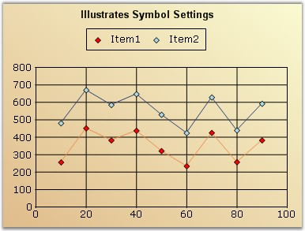
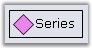
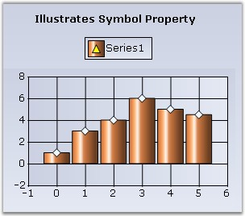
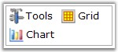

::: {style="DISPLAY: none"}
{#d2h_url_template}{#d2h_package_url style="WIDTH: 0px; DISPLAY: none; HEIGHT: 0px"}
:::

::::: {#nsbanner .d2h_main_nsbanner style="BORDER-BOTTOM: #999999 1px solid; POSITION: relative; PADDING-BOTTOM: 0px; BACKGROUND-COLOR: transparent; PADDING-LEFT: 0px; PADDING-RIGHT: 0px; DISPLAY: none; BORDER-TOP: #999999 1px solid; PADDING-TOP: 0px; LEFT: 0px"}
:::: {#TitleRow .d2h_main_titlerow style="PADDING-BOTTOM: 4px; BACKGROUND-COLOR: transparent; PADDING-LEFT: 22px; WIDTH: 100%; PADDING-RIGHT: 10px; DISPLAY: none; PADDING-TOP: 4px"}
::: {#ienav .d2h_main_ienav style="DISPLAY: none"}
{#D2HPrevious .D2HPreviousEnabled}  {#D2HNext .D2HNextEnabled}
:::
::::
:::::

:::::: {#nstext .d2h_main_nstext style="PADDING-BOTTOM: 10px; BACKGROUND-COLOR: transparent; PADDING-LEFT: 22px; PADDING-RIGHT: 10px; HEIGHT: 100%; OVERFLOW: auto; PADDING-TOP: 5px" hasuserbackground="true" valign="bottom"}
::: {#d2h_breadcrumbs .d2h_breadcrumbs}
[Essential Studio User Guide Documentation](ms-xhelp:///?Id=12457748-09e3-4d74-a240-8e049cedf030){.d2h_breadcrumbsNormal}[ \> ]{.d2h_breadcrumbsLinkSeparator}[User Interface Edition](ms-xhelp:///?Id=c29296b7-531c-413b-a0ec-488ca1f7f669){.d2h_breadcrumbsNormal}[ \> ]{.d2h_breadcrumbsLinkSeparator}[Essential ASP.NET](ms-xhelp:///?Id=25c35330-c127-4dad-9a92-ed79dc7261a6){.d2h_breadcrumbsNormal}[ \> ]{.d2h_breadcrumbsLinkSeparator}[Essential Chart]{.d2h_breadcrumbsContentsOnly}[ \> ]{.d2h_breadcrumbsLinkSeparator}[Concepts and Features](ms-xhelp:///?Id=100687ce-82f2-4424-9d16-0949ea76cf15){.d2h_breadcrumbsNormal}[ \> ]{.d2h_breadcrumbsLinkSeparator}[Chart Legend and Legend Items](ms-xhelp:///?Id=5063ada2-ebde-4a71-bfe0-9ae66155b1a7){.d2h_breadcrumbsNormal}
:::

### Customizing LegendItem Image {#customizing-legenditem-image style="tab-stops: 0pt"}

**[]{style="FONT-FAMILY: 'Trebuchet MS','sans-serif'; FONT-SIZE: 9pt"}** 

There are several options to customize the image rendered in the Legend. The following properties let you do so:

[]{style="FONT-FAMILY: 'Trebuchet MS','sans-serif'; FONT-SIZE: 9pt"} 

::: {align="center"}
+-----------------------------------+--------------------------------------------------------------------------------------------------------------------------------------------------------------------+
|                                   |                                                                                                                                                                    |
|                                   |                                                                                                                                                                    |
| Chart Legend Properties           | Description                                                                                                                                                        |
+===================================+====================================================================================================================================================================+
|                                   |                                                                                                                                                                    |
|                                   |                                                                                                                                                                    |
| ShowSymbol                        | If **true**, the exact symbol rendered in the series data points will be used to render the icon in the legend as well. This overrides most of the other settings. |
+-----------------------------------+--------------------------------------------------------------------------------------------------------------------------------------------------------------------+
|                                   |                                                                                                                                                                    |
|                                   |                                                                                                                                                                    |
| RepresentationType                | Specifies how each legend item should be represented, as the name implies:                                                                                         |
|                                   |                                                                                                                                                                    |
|                                   | None **(default setting)**                                                                                                                                         |
|                                   |                                                                                                                                                                    |
|                                   | [·      ]{style="FONT-FAMILY: Symbol"}SeriesType - An icon representing the series type.                                                                           |
|                                   |                                                                                                                                                                    |
|                                   | [·      ]{style="FONT-FAMILY: Symbol"}SeriesImage - Will use the ImageList associated with the                              Series style.                          |
|                                   |                                                                                                                                                                    |
|                                   | [·      ]{style="FONT-FAMILY: Symbol"}Rectangle                                                                                                                    |
|                                   |                                                                                                                                                                    |
|                                   | [·      ]{style="FONT-FAMILY: Symbol"}Line                                                                                                                         |
|                                   |                                                                                                                                                                    |
|                                   | [·      ]{style="FONT-FAMILY: Symbol"}StraightLine                                                                                                                 |
|                                   |                                                                                                                                                                    |
|                                   | [·      ]{style="FONT-FAMILY: Symbol"}Circle                                                                                                                       |
|                                   |                                                                                                                                                                    |
|                                   | [·      ]{style="FONT-FAMILY: Symbol"}Diamond                                                                                                                      |
|                                   |                                                                                                                                                                    |
|                                   | [·      ]{style="FONT-FAMILY: Symbol"}Hexagon                                                                                                                      |
|                                   |                                                                                                                                                                    |
|                                   | [·      ]{style="FONT-FAMILY: Symbol"}Pentagon                                                                                                                     |
|                                   |                                                                                                                                                                    |
|                                   | [·      ]{style="FONT-FAMILY: Symbol"}Triangle                                                                                                                     |
|                                   |                                                                                                                                                                    |
|                                   | [·      ]{style="FONT-FAMILY: Symbol"}InvertedTriangle                                                                                                             |
|                                   |                                                                                                                                                                    |
|                                   | [·      ]{style="FONT-FAMILY: Symbol"}Cross                                                                                                                        |
+-----------------------------------+--------------------------------------------------------------------------------------------------------------------------------------------------------------------+
:::

**[]{style="FONT-FAMILY: 'Trebuchet MS','sans-serif'; FONT-SIZE: 9pt"}** 

The following ChartLegendItem properties that can be accessed via the **Legend.Items** list typically override the above settings set in the Legend.

[]{style="FONT-FAMILY: 'Trebuchet MS','sans-serif'; FONT-SIZE: 9pt"} 

::: {align="center"}
+-----------------------------------+--------------------------------------------------------------------------------------------------------------------------------------------------------------------------------------+
|                                   |                                                                                                                                                                                      |
|                                   |                                                                                                                                                                                      |
| Chart Legend Item Properties      | Description                                                                                                                                                                          |
+-----------------------------------+--------------------------------------------------------------------------------------------------------------------------------------------------------------------------------------+
| ImageList                         | Contains a collection of images and will be referred to, by the ImageList property.                                                                                                  |
+-----------------------------------+--------------------------------------------------------------------------------------------------------------------------------------------------------------------------------------+
| ImageIndex                        | Specifies the index into the ImageList array which contains the image for this item.                                                                                                 |
+-----------------------------------+--------------------------------------------------------------------------------------------------------------------------------------------------------------------------------------+
| Interior                          | Specifies the BrushInfo used to render the interior of a Chart Symbol.                                                                                                               |
+-----------------------------------+--------------------------------------------------------------------------------------------------------------------------------------------------------------------------------------+
| RepresentationSize                | Specifies the size of the rectangle inside which the associated image or symbol will get rendered.                                                                                   |
+-----------------------------------+--------------------------------------------------------------------------------------------------------------------------------------------------------------------------------------+
| ShowSymbol                        | If **true**, the exact symbol rendered in the corresponding series data points will be used to render the icon in this legend as well. This overrides most of the other settings.    |
+-----------------------------------+--------------------------------------------------------------------------------------------------------------------------------------------------------------------------------------+
| Symbol                            | Symbols rendered in the Legend item can be customized using this property.                                                                                                           |
+-----------------------------------+--------------------------------------------------------------------------------------------------------------------------------------------------------------------------------------+
| Type                              | If ShowSymbol is **false**, you can customize the type of icon that gets rendered in the legend item. The default value will reflect the **ChartLegend.RepresentationType** setting. |
|                                   |                                                                                                                                                                                      |
|                                   | [·      ]{style="FONT-FAMILY: Symbol"}Possible Values:                                                                                                                               |
|                                   |                                                                                                                                                                                      |
|                                   | [·      ]{style="FONT-FAMILY: Symbol"}Area                                                                                                                                           |
|                                   |                                                                                                                                                                                      |
|                                   | [·      ]{style="FONT-FAMILY: Symbol"}Circle                                                                                                                                         |
|                                   |                                                                                                                                                                                      |
|                                   | [·      ]{style="FONT-FAMILY: Symbol"}Cross                                                                                                                                          |
|                                   |                                                                                                                                                                                      |
|                                   | [·      ]{style="FONT-FAMILY: Symbol"}Diamond                                                                                                                                        |
|                                   |                                                                                                                                                                                      |
|                                   | [·      ]{style="FONT-FAMILY: Symbol"}Hexagon                                                                                                                                        |
|                                   |                                                                                                                                                                                      |
|                                   | [·      ]{style="FONT-FAMILY: Symbol"}Image                                                                                                                                          |
|                                   |                                                                                                                                                                                      |
|                                   | [·      ]{style="FONT-FAMILY: Symbol"}InvertedTriangle                                                                                                                               |
|                                   |                                                                                                                                                                                      |
|                                   | [·      ]{style="FONT-FAMILY: Symbol"}Line                                                                                                                                           |
|                                   |                                                                                                                                                                                      |
|                                   | [·      ]{style="FONT-FAMILY: Symbol"}None                                                                                                                                           |
|                                   |                                                                                                                                                                                      |
|                                   | [·      ]{style="FONT-FAMILY: Symbol"}Pentagon                                                                                                                                       |
|                                   |                                                                                                                                                                                      |
|                                   | [·      ]{style="FONT-FAMILY: Symbol"}PieSlice                                                                                                                                       |
|                                   |                                                                                                                                                                                      |
|                                   | [·      ]{style="FONT-FAMILY: Symbol"}Rectangle                                                                                                                                      |
|                                   |                                                                                                                                                                                      |
|                                   | [·      ]{style="FONT-FAMILY: Symbol"}Spline                                                                                                                                         |
|                                   |                                                                                                                                                                                      |
|                                   | [·      ]{style="FONT-FAMILY: Symbol"}SplineArea                                                                                                                                     |
|                                   |                                                                                                                                                                                      |
|                                   | [·      ]{style="FONT-FAMILY: Symbol"}StraightLine                                                                                                                                   |
|                                   |                                                                                                                                                                                      |
|                                   | [·      ]{style="FONT-FAMILY: Symbol"}Rectangle                                                                                                                                      |
+-----------------------------------+--------------------------------------------------------------------------------------------------------------------------------------------------------------------------------------+
| ShowIcon                          | If set to **false**, no icons will be rendered. This overrides most of the other settings including **ShowSymbol**.                                                                  |
+-----------------------------------+--------------------------------------------------------------------------------------------------------------------------------------------------------------------------------------+
:::

[]{style="FONT-FAMILY: 'Trebuchet MS','sans-serif'; FONT-SIZE: 9pt"} 

Series Type Icon

**[]{style="FONT-FAMILY: 'Trebuchet MS','sans-serif'"}** 

An icon representing the series type can be rendered in the legend.

To do this for all the legend items:

[]{style="FONT-FAMILY: 'Trebuchet MS','sans-serif'; FONT-SIZE: 9pt"} 

+-------------------------------------------------------------------------------------------------------------------------------------------------------------------------------------------------------------------------------------+
| **[\[C#\]]{style="FONT-FAMILY: 'Courier New'; COLOR: black"}**                                                                                                                                                                      |
|                                                                                                                                                                                                                                     |
| []{style="FONT-FAMILY: 'Courier New'; COLOR: green"}                                                                                                                                                                                |
|                                                                                                                                                                                                                                     |
| [this]{style="FONT-FAMILY: 'Courier New'; COLOR: blue"}[.[ChartWebControl1]{style="COLOR: black"}.Legend.RepresentationType = [ChartLegendRepresentationType]{style="COLOR: teal"}.SeriesType;]{style="FONT-FAMILY: 'Courier New'"} |
+-------------------------------------------------------------------------------------------------------------------------------------------------------------------------------------------------------------------------------------+

[]{style="FONT-FAMILY: 'Trebuchet MS','sans-serif'; FONT-SIZE: 9pt"} 

+-----------------------------------------------------------------------------------------------------------------------------------------------------------------------------------------------------------------------------------+
| **[\[VB.NET\]]{style="FONT-FAMILY: 'Courier New'; COLOR: black"}**                                                                                                                                                                |
|                                                                                                                                                                                                                                   |
| []{style="FONT-FAMILY: 'Courier New'"}                                                                                                                                                                                            |
|                                                                                                                                                                                                                                   |
| [Me]{style="FONT-FAMILY: 'Courier New'; COLOR: blue"}[.[ChartWebControl1]{style="COLOR: black"}.Legend.RepresentationType = [ChartLegendRepresentationType]{style="COLOR: black"}.SeriesType]{style="FONT-FAMILY: 'Courier New'"} |
+-----------------------------------------------------------------------------------------------------------------------------------------------------------------------------------------------------------------------------------+

[]{style="COLOR: red; FONT-SIZE: 8pt"} 

{border="0"}

**[]{style="FONT-FAMILY: 'Trebuchet MS','sans-serif'; FONT-SIZE: 9pt"}** 

Figure 277: Legend Item with the Series Type Icon

[]{style="FONT-FAMILY: 'Trebuchet MS','sans-serif'; FONT-SIZE: 9pt"} 

Series Symbol

**[]{style="FONT-FAMILY: 'Trebuchet MS','sans-serif'"}** 

You can also choose to show the exact same symbol that is shown in the data points in a series.

[]{style="FONT-FAMILY: 'Trebuchet MS','sans-serif'; FONT-SIZE: 9pt"} 

To do this for all the legend items:

[]{style="FONT-FAMILY: 'Trebuchet MS','sans-serif'; FONT-SIZE: 9pt"} 

+--------------------------------------------------------------------------------------------------------------------------------------------------------------------------------------------------------------------------------------+
| **[\[C#\]]{style="FONT-FAMILY: 'Courier New'; COLOR: black"}**                                                                                                                                                                       |
|                                                                                                                                                                                                                                      |
| []{style="FONT-FAMILY: 'Courier New'; COLOR: green"}                                                                                                                                                                                 |
|                                                                                                                                                                                                                                      |
| [//Set symbol for first series]{style="FONT-FAMILY: 'Courier New'; COLOR: green"}                                                                                                                                                    |
|                                                                                                                                                                                                                                      |
| [this]{style="FONT-FAMILY: 'Courier New'; COLOR: blue"}[.[ChartWebControl1]{style="COLOR: black"}.Series\[0\].Style.Symbol.Shape = [ChartSymbolShape]{style="COLOR: teal"}.Diamond;]{style="FONT-FAMILY: 'Courier New'"}             |
|                                                                                                                                                                                                                                      |
| [this]{style="FONT-FAMILY: 'Courier New'; COLOR: blue"}[.[ChartWebControl1]{style="COLOR: black"}.Series\[0\].Style.Symbol.Color = [Color]{style="COLOR: teal"}.Red ;]{style="FONT-FAMILY: 'Courier New'"}                           |
|                                                                                                                                                                                                                                      |
| [this]{style="FONT-FAMILY: 'Courier New'; COLOR: blue"}[.[ChartWebControl1]{style="COLOR: black"}.Series\[0\].Style.Symbol.Size = [new]{style="COLOR: blue"} [Size]{style="COLOR: teal"}(7, 7);]{style="FONT-FAMILY: 'Courier New'"} |
|                                                                                                                                                                                                                                      |
| []{style="FONT-FAMILY: 'Courier New'; COLOR: green"}                                                                                                                                                                                 |
|                                                                                                                                                                                                                                      |
| [//This will cause the legend to render with the same symbol defined above.]{style="FONT-FAMILY: 'Courier New'; COLOR: green"}                                                                                                       |
|                                                                                                                                                                                                                                      |
| [this]{style="FONT-FAMILY: 'Courier New'; COLOR: blue"}[.[ChartWebControl1]{style="COLOR: black"}.Legend.ShowSymbol = [true]{style="COLOR: blue"};]{style="FONT-FAMILY: 'Courier New'"}                                              |
|                                                                                                                                                                                                                                      |
| []{style="FONT-FAMILY: 'Courier New'; COLOR: green"}                                                                                                                                                                                 |
|                                                                                                                                                                                                                                      |
| [//Setting RepresentationType to None to hide other representations]{style="FONT-FAMILY: 'Courier New'; COLOR: green"}                                                                                                               |
|                                                                                                                                                                                                                                      |
| [this]{style="FONT-FAMILY: 'Courier New'; COLOR: blue"}[.[ChartWebControl1]{style="COLOR: black"}.Legend.RepresentationType = [ChartLegendRepresentationType.]{style="COLOR: teal"}None;]{style="FONT-FAMILY: 'Courier New'"}        |
+--------------------------------------------------------------------------------------------------------------------------------------------------------------------------------------------------------------------------------------+

[]{style="FONT-FAMILY: 'Trebuchet MS','sans-serif'; FONT-SIZE: 9pt"} 

+----------------------------------------------------------------------------------------------------------------------------------------------------------------------------------------------------------------------------+
| **[\[VB.NET\]]{style="FONT-FAMILY: 'Courier New'; COLOR: black"}**                                                                                                                                                         |
|                                                                                                                                                                                                                            |
| []{style="FONT-FAMILY: 'Courier New'"}                                                                                                                                                                                     |
|                                                                                                                                                                                                                            |
| [\'Set symbol for first series]{style="FONT-FAMILY: 'Courier New'; COLOR: green"}                                                                                                                                          |
|                                                                                                                                                                                                                            |
| [Me]{style="FONT-FAMILY: 'Courier New'; COLOR: blue"}[.[ChartWebControl1]{style="COLOR: black"}.Series(0).Style.Symbol.Shape = [ChartSymbolShape]{style="COLOR: black"}.Diamond]{style="FONT-FAMILY: 'Courier New'"}       |
|                                                                                                                                                                                                                            |
| [Me]{style="FONT-FAMILY: 'Courier New'; COLOR: blue"}[.[ChartWebControl1]{style="COLOR: black"}.Series(0).Style.Symbol.Color = [Color]{style="COLOR: black"}.Red]{style="FONT-FAMILY: 'Courier New'"}                      |
|                                                                                                                                                                                                                            |
| [Me]{style="FONT-FAMILY: 'Courier New'; COLOR: blue"}[.[ChartWebControl1]{style="COLOR: black"}.Series(10).Style.Symbol.Size = [New]{style="COLOR: blue"} Size(7, 7)]{style="FONT-FAMILY: 'Courier New'"}                  |
|                                                                                                                                                                                                                            |
| []{style="FONT-FAMILY: 'Courier New'; COLOR: green"}                                                                                                                                                                       |
|                                                                                                                                                                                                                            |
| [\'This will cause the legend to render with the same symbol defined above.]{style="FONT-FAMILY: 'Courier New'; COLOR: green"}                                                                                             |
|                                                                                                                                                                                                                            |
| [Me]{style="FONT-FAMILY: 'Courier New'; COLOR: blue"}[.[ChartWebControl1]{style="COLOR: black"}.Legend.ShowSymbol = [True]{style="COLOR: blue"}]{style="FONT-FAMILY: 'Courier New'"}                                       |
|                                                                                                                                                                                                                            |
| []{style="FONT-FAMILY: 'Courier New'; COLOR: blue"}                                                                                                                                                                        |
|                                                                                                                                                                                                                            |
| [\'Setting RepresentationType to None to hide other representations]{style="FONT-FAMILY: 'Courier New'; COLOR: green"}                                                                                                     |
|                                                                                                                                                                                                                            |
| [Me]{style="FONT-FAMILY: 'Courier New'; COLOR: blue"}[.[ChartWebControl1]{style="COLOR: black"}.Legend.RepresentationType = [ChartLegendRepresentationType.]{style="COLOR: teal"}None]{style="FONT-FAMILY: 'Courier New'"} |
+----------------------------------------------------------------------------------------------------------------------------------------------------------------------------------------------------------------------------+

[]{style="COLOR: red; FONT-SIZE: 8pt"} 

{border="0"}

***[]{style="FONT-FAMILY: 'Trebuchet MS','sans-serif'; FONT-SIZE: 9pt"}*** 

Figure 278: Legend Items rendered with the Same Symbol

[]{style="FONT-FAMILY: 'Trebuchet MS','sans-serif'; FONT-SIZE: 9pt"} 

Custom Representation Icon

**[]{style="FONT-FAMILY: 'Trebuchet MS','sans-serif'"}** 

You can also choose to use one of the built-in representation icons in the legend items.

To do this for all the legend items:

[]{style="FONT-FAMILY: 'Trebuchet MS','sans-serif'; FONT-SIZE: 9pt"} 

+-----------------------------------------------------------------------------------------------------------------------------------------------------------------------------------------------------------------------------------------------------------------------+
| **[\[C#\]]{style="FONT-FAMILY: 'Courier New'; COLOR: black"}**                                                                                                                                                                                                        |
|                                                                                                                                                                                                                                                                       |
| []{style="FONT-FAMILY: 'Courier New'; COLOR: green"}                                                                                                                                                                                                                  |
|                                                                                                                                                                                                                                                                       |
| [this]{style="FONT-FAMILY: 'Courier New'; COLOR: blue"}[.[ChartWebControl1]{style="COLOR: black"}.Legend.RepresentationType = [ChartLegendRepresentationType]{style="COLOR: teal"}.Diamond;]{style="FONT-FAMILY: 'Courier New'"}                                      |
|                                                                                                                                                                                                                                                                       |
| []{style="FONT-FAMILY: 'Courier New'"}                                                                                                                                                                                                                                |
|                                                                                                                                                                                                                                                                       |
| [// To specify a custom color for the interior of the icon]{style="FONT-FAMILY: 'Courier New'; COLOR: green"}                                                                                                                                                         |
|                                                                                                                                                                                                                                                                       |
| [this]{style="FONT-FAMILY: 'Courier New'; COLOR: blue"}[.[ChartWebControl1]{style="COLOR: black"}.Legend.Items\[0\].Interior = [new]{style="COLOR: blue"} [BrushInfo]{style="COLOR: teal"}([Color]{style="COLOR: teal"}.Violet);]{style="FONT-FAMILY: 'Courier New'"} |
+-----------------------------------------------------------------------------------------------------------------------------------------------------------------------------------------------------------------------------------------------------------------------+

[]{style="FONT-FAMILY: 'Trebuchet MS','sans-serif'; FONT-SIZE: 9pt"} 

+--------------------------------------------------------------------------------------------------------------------------------------------------------------------------------------------------------------------------------------------+
| **[\[VB.NET\]]{style="FONT-FAMILY: 'Courier New'; COLOR: black"}**                                                                                                                                                                         |
|                                                                                                                                                                                                                                            |
| []{style="FONT-FAMILY: 'Courier New'"}                                                                                                                                                                                                     |
|                                                                                                                                                                                                                                            |
| [Me]{style="FONT-FAMILY: 'Courier New'; COLOR: blue"}[.[ChartWebControl1]{style="COLOR: black"}.Legend.RepresentationType = [ChartLegendRepresentationType]{style="COLOR: black"}.Diamond]{style="FONT-FAMILY: 'Courier New'"}             |
|                                                                                                                                                                                                                                            |
| []{style="FONT-FAMILY: 'Courier New'"}                                                                                                                                                                                                     |
|                                                                                                                                                                                                                                            |
| [\'To specify a custom color for the interior of the icon]{style="FONT-FAMILY: 'Courier New'; COLOR: green"}                                                                                                                               |
|                                                                                                                                                                                                                                            |
| [Me]{style="FONT-FAMILY: 'Courier New'; COLOR: blue"}[.[ChartWebControl1]{style="COLOR: black"}.Legend.Items(0).Interior = [New]{style="COLOR: blue"} [BrushInfo(Color]{style="COLOR: black"}.Violet)]{style="FONT-FAMILY: 'Courier New'"} |
+--------------------------------------------------------------------------------------------------------------------------------------------------------------------------------------------------------------------------------------------+

**[]{style="FONT-FAMILY: 'Trebuchet MS','sans-serif'"}** 

{border="0"}

**[]{style="FONT-FAMILY: 'Trebuchet MS','sans-serif'; FONT-SIZE: 9pt"}** 

Figure 279: Legend Item with a Custom Representation Icon

**[]{style="FONT-FAMILY: 'Trebuchet MS','sans-serif'; FONT-SIZE: 9pt"}** 

To do the above only on specific legend items, use the **ChartLegendItem.Type** property.

**[]{style="FONT-FAMILY: 'Trebuchet MS','sans-serif'"}** 

More Symbol Shapes

**[]{style="FONT-FAMILY: 'Trebuchet MS','sans-serif'"}** 

ChartLegendItem has the **Symbol** property, using which we can customize the symbols for particular legend items. This setting overrides the **Series\[0\].Style.Symbol** settings.

[]{style="FONT-FAMILY: 'Trebuchet MS','sans-serif'; FONT-SIZE: 9pt"} 

+-----------------------------------------------------------------------------------------------------------------------------------------------------------------------------------------------+
| **[\[C#\]]{style="FONT-FAMILY: 'Courier New'; COLOR: black"}**                                                                                                                                |
|                                                                                                                                                                                               |
| []{style="FONT-FAMILY: 'Courier New'; COLOR: green"}                                                                                                                                          |
|                                                                                                                                                                                               |
| [//Series symbol settings]{style="FONT-FAMILY: 'Courier New'; COLOR: green"}                                                                                                                  |
|                                                                                                                                                                                               |
| [ChartWebControl1]{style="FONT-FAMILY: 'Courier New'; COLOR: black"}[.Legend.ShowSymbol = [true]{style="COLOR: blue"};]{style="FONT-FAMILY: 'Courier New'"}                                   |
|                                                                                                                                                                                               |
| [ChartWebControl1]{style="FONT-FAMILY: 'Courier New'; COLOR: black"}[.Series\[0\].Style.Symbol.Shape = [ChartSymbolShape]{style="COLOR: teal"}.Diamond;]{style="FONT-FAMILY: 'Courier New'"}  |
|                                                                                                                                                                                               |
| [ChartWebControl1]{style="FONT-FAMILY: 'Courier New'; COLOR: black"}[.Series\[0\].Style.Symbol.Color = [Color]{style="COLOR: teal"}.AliceBlue;]{style="FONT-FAMILY: 'Courier New'"}           |
|                                                                                                                                                                                               |
| []{style="FONT-FAMILY: 'Courier New'; COLOR: green"}                                                                                                                                          |
|                                                                                                                                                                                               |
| [//the above symbol settings is overridden by the following settings]{style="FONT-FAMILY: 'Courier New'; COLOR: green"}                                                                       |
|                                                                                                                                                                                               |
| [ChartWebControl1]{style="FONT-FAMILY: 'Courier New'; COLOR: black"}[.Legend.Items\[0\].Symbol.Shape = [ChartSymbolShape]{style="COLOR: teal"}.Triangle;]{style="FONT-FAMILY: 'Courier New'"} |
|                                                                                                                                                                                               |
| [ChartWebControl1]{style="FONT-FAMILY: 'Courier New'; COLOR: black"}[.Legend.Items\[0\].Symbol.Color = [Color]{style="COLOR: teal"}.Yellow;]{style="FONT-FAMILY: 'Courier New'"}              |
+-----------------------------------------------------------------------------------------------------------------------------------------------------------------------------------------------+

[]{style="FONT-FAMILY: 'Trebuchet MS','sans-serif'; FONT-SIZE: 9pt"} 

+-----------------------------------------------------------------------------------------------------------------------------------------------------------------------------------------------+
| **[\[VB.NET\]]{style="FONT-FAMILY: 'Courier New'; COLOR: black"}**                                                                                                                            |
|                                                                                                                                                                                               |
| []{style="FONT-FAMILY: 'Courier New'"}                                                                                                                                                        |
|                                                                                                                                                                                               |
| [\'Series symbol settings]{style="FONT-FAMILY: 'Courier New'; COLOR: green"}                                                                                                                  |
|                                                                                                                                                                                               |
| [ChartWebControl1]{style="FONT-FAMILY: 'Courier New'; COLOR: black"}[.Legend.ShowSymbol = [True]{style="COLOR: blue"}]{style="FONT-FAMILY: 'Courier New'"}                                    |
|                                                                                                                                                                                               |
| [ChartWebControl1]{style="FONT-FAMILY: 'Courier New'; COLOR: black"}[.Series(0).Style.Symbol.Shape = [ChartSymbolShape]{style="COLOR: black"}.Diamond]{style="FONT-FAMILY: 'Courier New'"}    |
|                                                                                                                                                                                               |
| [ChartWebControl1]{style="FONT-FAMILY: 'Courier New'; COLOR: black"}[.Series(0).Style.Symbol.Color = [Color]{style="COLOR: teal"}.AliceBlue]{style="FONT-FAMILY: 'Courier New'"}              |
|                                                                                                                                                                                               |
| []{style="FONT-FAMILY: 'Courier New'"}                                                                                                                                                        |
|                                                                                                                                                                                               |
| [\'the above symbol settings is overridden by the following settings]{style="FONT-FAMILY: 'Courier New'; COLOR: green"}                                                                       |
|                                                                                                                                                                                               |
| [ChartWebControl1]{style="FONT-FAMILY: 'Courier New'; COLOR: black"}[.Legend.Items\[0\].Symbol.Shape = [ChartSymbolShape]{style="COLOR: black"}.Triangle]{style="FONT-FAMILY: 'Courier New'"} |
|                                                                                                                                                                                               |
| [ChartWebControl1]{style="FONT-FAMILY: 'Courier New'; COLOR: black"}[.Legend.Items\[0\].Symbol.Color = [Color]{style="COLOR: teal"}.Yellow]{style="FONT-FAMILY: 'Courier New'"}               |
+-----------------------------------------------------------------------------------------------------------------------------------------------------------------------------------------------+

**[]{style="FONT-FAMILY: 'Trebuchet MS','sans-serif'"}** 

{border="0"}

[]{style="FONT-FAMILY: 'Trebuchet MS','sans-serif'; FONT-SIZE: 9pt"} 

Figure 280: Legend Item Customized with \"Triangle\" Symbol in \"Yellow\" Color

**[]{style="FONT-FAMILY: 'Trebuchet MS','sans-serif'"}** 

Custom Images

[]{style="FONT-FAMILY: 'Trebuchet MS','sans-serif'; FONT-SIZE: 9pt"} 

You can also choose to show custom images in the legend items as follows:

[]{style="FONT-FAMILY: 'Trebuchet MS','sans-serif'; FONT-SIZE: 9pt"} 

+---------------------------------------------------------------------------------------------------------------------------------------------------------------------------------------------------------------------------------------------------------------------------------------------+
| **[\[C#\]]{style="FONT-FAMILY: 'Courier New'; COLOR: black"}**                                                                                                                                                                                                                              |
|                                                                                                                                                                                                                                                                                             |
| []{style="FONT-FAMILY: 'Courier New'; COLOR: green"}                                                                                                                                                                                                                                        |
|                                                                                                                                                                                                                                                                                             |
| [// Setting the representation type for the Legend items]{style="FONT-FAMILY: 'Courier New'; COLOR: green"}                                                                                                                                                                                 |
|                                                                                                                                                                                                                                                                                             |
| [this]{style="FONT-FAMILY: 'Courier New'; COLOR: blue"}[.[ChartWebControl1]{style="COLOR: black"}.Legend.RepresentationType = [ChartLegendRepresentationType]{style="COLOR: teal"}.SeriesImage;]{style="FONT-FAMILY: 'Courier New'"}                                                        |
|                                                                                                                                                                                                                                                                                             |
| [//Setting the image index]{style="FONT-FAMILY: 'Courier New'; COLOR: green"}                                                                                                                                                                                                               |
|                                                                                                                                                                                                                                                                                             |
| [this]{style="FONT-FAMILY: 'Courier New'; COLOR: blue"}[.[ChartWebControl1]{style="COLOR: black"}.Legend.Items\[0\].ImageIndex = 0;]{style="FONT-FAMILY: 'Courier New'"}                                                                                                                    |
|                                                                                                                                                                                                                                                                                             |
| [// The image will be picked up from this collection]{style="FONT-FAMILY: 'Courier New'; COLOR: green"}                                                                                                                                                                                     |
|                                                                                                                                                                                                                                                                                             |
| [series1.Style.Images = [new]{style="COLOR: blue"} [ChartImageCollection]{style="COLOR: teal"}([this]{style="COLOR: blue"}.imageList1.Images);]{style="FONT-FAMILY: 'Courier New'"}                                                                                                         |
|                                                                                                                                                                                                                                                                                             |
| []{style="FONT-FAMILY: 'Courier New'"}                                                                                                                                                                                                                                                      |
|                                                                                                                                                                                                                                                                                             |
| [// Or from this collection, if available]{style="FONT-FAMILY: 'Courier New'; COLOR: green"}                                                                                                                                                                                                |
|                                                                                                                                                                                                                                                                                             |
| [this]{style="FONT-FAMILY: 'Courier New'; COLOR: blue"}[.[ChartWebControl1]{style="COLOR: black"}.Legend.Items\[0\].ImageList = [new]{style="COLOR: blue"} [ChartImageCollection]{style="COLOR: teal"}([this]{style="COLOR: blue"}.imageList1.Images);]{style="FONT-FAMILY: 'Courier New'"} |
+---------------------------------------------------------------------------------------------------------------------------------------------------------------------------------------------------------------------------------------------------------------------------------------------+

[]{style="FONT-FAMILY: 'Trebuchet MS','sans-serif'; FONT-SIZE: 9pt"} 

+-----------------------------------------------------------------------------------------------------------------------------------------------------------------------------------------------------------------------------------------------------------------------------------------+
| **[\[VB.NET\]]{style="FONT-FAMILY: 'Courier New'; COLOR: black"}**                                                                                                                                                                                                                      |
|                                                                                                                                                                                                                                                                                         |
| []{style="FONT-FAMILY: 'Courier New'"}                                                                                                                                                                                                                                                  |
|                                                                                                                                                                                                                                                                                         |
| [\'Setting the representation type for the Legend items]{style="FONT-FAMILY: 'Courier New'; COLOR: green"}                                                                                                                                                                              |
|                                                                                                                                                                                                                                                                                         |
| [Me]{style="FONT-FAMILY: 'Courier New'; COLOR: blue"}[.[ChartWebControl1]{style="COLOR: black"}.Legend.RepresentationType = [ChartLegendRepresentationType]{style="COLOR: black"}.SeriesImage]{style="FONT-FAMILY: 'Courier New'"}                                                      |
|                                                                                                                                                                                                                                                                                         |
| [\'Setting the image index]{style="FONT-FAMILY: 'Courier New'; COLOR: green"}                                                                                                                                                                                                           |
|                                                                                                                                                                                                                                                                                         |
| [Me]{style="FONT-FAMILY: 'Courier New'; COLOR: blue"}[.[ChartWebControl1]{style="COLOR: black"}.Legend.Items(0).ImageIndex = 0]{style="FONT-FAMILY: 'Courier New'"}                                                                                                                     |
|                                                                                                                                                                                                                                                                                         |
| []{style="FONT-FAMILY: 'Courier New'"}                                                                                                                                                                                                                                                  |
|                                                                                                                                                                                                                                                                                         |
| [\' The image will be picked up from this collection]{style="FONT-FAMILY: 'Courier New'; COLOR: green"}                                                                                                                                                                                 |
|                                                                                                                                                                                                                                                                                         |
| [series1.Style.Images = [New]{style="COLOR: blue"} ChartImageCollection([Me]{style="COLOR: blue"}.imageList1.Images)]{style="FONT-FAMILY: 'Courier New'"}                                                                                                                               |
|                                                                                                                                                                                                                                                                                         |
| []{style="FONT-FAMILY: 'Courier New'"}                                                                                                                                                                                                                                                  |
|                                                                                                                                                                                                                                                                                         |
| [\' Or from this collection, if available]{style="FONT-FAMILY: 'Courier New'; COLOR: green"}                                                                                                                                                                                            |
|                                                                                                                                                                                                                                                                                         |
| [Me]{style="FONT-FAMILY: 'Courier New'; COLOR: blue"}[.[ChartWebControl1]{style="COLOR: black"}.Legend.Items(0).ImageList = [New]{style="COLOR: blue"} [ChartImageCollection]{style="COLOR: black"}([this]{style="COLOR: blue"}.imageList1.Images)]{style="FONT-FAMILY: 'Courier New'"} |
+-----------------------------------------------------------------------------------------------------------------------------------------------------------------------------------------------------------------------------------------------------------------------------------------+

[]{style="COLOR: red; FONT-SIZE: 8pt"} 

{border="0"}

**[]{style="FONT-FAMILY: 'Trebuchet MS','sans-serif'; FONT-SIZE: 9pt"}** 

Figure 281: Chart Legend Items with Custom Images

**[]{style="FONT-FAMILY: 'Trebuchet MS','sans-serif'"}** 

Hiding Icons

**[]{style="FONT-FAMILY: 'Trebuchet MS','sans-serif'"}** 

Icons for legend items can be hidden in any of the following ways:

[]{style="FONT-FAMILY: 'Trebuchet MS','sans-serif'; FONT-SIZE: 9pt"} 

+-------------------------------------------------------------------------------------------------------------------------------------------------------------------------------------------------------------------------------+
| **[\[C#\]]{style="FONT-FAMILY: 'Courier New'; COLOR: black"}**                                                                                                                                                                |
|                                                                                                                                                                                                                               |
| []{style="FONT-FAMILY: 'Courier New'; COLOR: green"}                                                                                                                                                                          |
|                                                                                                                                                                                                                               |
| [this]{style="FONT-FAMILY: 'Courier New'; COLOR: blue"}[.[ChartWebControl1]{style="COLOR: black"}.Legend.RepresentationType = [ChartLegendRepresentationType]{style="COLOR: teal"}.None;]{style="FONT-FAMILY: 'Courier New'"} |
|                                                                                                                                                                                                                               |
| []{style="FONT-FAMILY: 'Courier New'"}                                                                                                                                                                                        |
|                                                                                                                                                                                                                               |
| [// To do this for a specific legend item:]{style="FONT-FAMILY: 'Courier New'; COLOR: green"}                                                                                                                                 |
|                                                                                                                                                                                                                               |
| []{style="FONT-FAMILY: 'Courier New'; COLOR: green"}                                                                                                                                                                          |
|                                                                                                                                                                                                                               |
| [// This will not even allocate any space for the icons]{style="FONT-FAMILY: 'Courier New'; COLOR: green"}                                                                                                                    |
|                                                                                                                                                                                                                               |
| [this]{style="FONT-FAMILY: 'Courier New'; COLOR: blue"}[.ChartWebControl1.Legend.Items\[0\].ShowIcon = [false]{style="COLOR: blue"};]{style="FONT-FAMILY: 'Courier New'"}                                                     |
|                                                                                                                                                                                                                               |
| []{style="FONT-FAMILY: 'Courier New'"}                                                                                                                                                                                        |
|                                                                                                                                                                                                                               |
| [// Or, set this. This will not render the icons, but will allocate some empty space for it]{style="FONT-FAMILY: 'Courier New'; COLOR: green"}                                                                                |
|                                                                                                                                                                                                                               |
| [this]{style="FONT-FAMILY: 'Courier New'; COLOR: blue"}[.ChartWebControl1.Legend.Items\[0\].Type = [ChartLegendItemType]{style="COLOR: teal"}.None;]{style="FONT-FAMILY: 'Courier New'"}                                      |
+-------------------------------------------------------------------------------------------------------------------------------------------------------------------------------------------------------------------------------+

[]{style="FONT-FAMILY: 'Trebuchet MS','sans-serif'; FONT-SIZE: 9pt"} 

+-----------------------------------------------------------------------------------------------------------------------------------------------------------------------------------------------------+
| **[\[VB.NET\]]{style="FONT-FAMILY: 'Courier New'; COLOR: black"}**                                                                                                                                  |
|                                                                                                                                                                                                     |
| []{style="FONT-FAMILY: 'Courier New'; COLOR: green"}                                                                                                                                                |
|                                                                                                                                                                                                     |
| [Me]{style="FONT-FAMILY: 'Courier New'; COLOR: blue"}[.ChartWebControl1.Legend.RepresentationType = [ChartLegendRepresentationType]{style="COLOR: black"}.None]{style="FONT-FAMILY: 'Courier New'"} |
|                                                                                                                                                                                                     |
| []{style="FONT-FAMILY: 'Courier New'"}                                                                                                                                                              |
|                                                                                                                                                                                                     |
| [\'To do this for a specific legend item]{style="FONT-FAMILY: 'Courier New'; COLOR: green"}                                                                                                         |
|                                                                                                                                                                                                     |
| []{style="FONT-FAMILY: 'Courier New'; COLOR: green"}                                                                                                                                                |
|                                                                                                                                                                                                     |
| [\'This will not even allocate any space for the icons]{style="FONT-FAMILY: 'Courier New'; COLOR: green"}                                                                                           |
|                                                                                                                                                                                                     |
| [Me]{style="FONT-FAMILY: 'Courier New'; COLOR: blue"}[.ChartWebControl1.Legend.Items(0).ShowIcon = [False]{style="COLOR: blue"}]{style="FONT-FAMILY: 'Courier New'"}                                |
|                                                                                                                                                                                                     |
| []{style="FONT-FAMILY: 'Courier New'"}                                                                                                                                                              |
|                                                                                                                                                                                                     |
| [\'Or, set this. This will not render the icons, but will allocate some empty space for it]{style="FONT-FAMILY: 'Courier New'; COLOR: green"}                                                       |
|                                                                                                                                                                                                     |
| [Me]{style="FONT-FAMILY: 'Courier New'; COLOR: blue"}[.ChartWebControl1.Legend.Items(0).Type = [ChartLegendItemType]{style="COLOR: black"}.None]{style="FONT-FAMILY: 'Courier New'"}                |
+-----------------------------------------------------------------------------------------------------------------------------------------------------------------------------------------------------+

**[]{style="FONT-FAMILY: 'Trebuchet MS','sans-serif'"}** 

See Also

**[]{style="FONT-FAMILY: 'Trebuchet MS','sans-serif'; FONT-SIZE: 9pt"}** 

[ChartLegend]{.UGHyperlink}[, ]{.UGHyperlink}[ChartLegendItem]{.UGHyperlink}[]{.UGHyperlink}

[]{#p198} 

[]{#related-topics}
::::::
