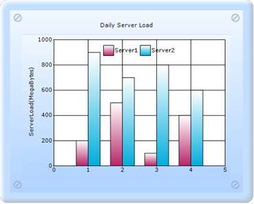
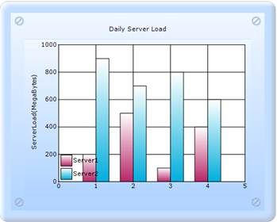
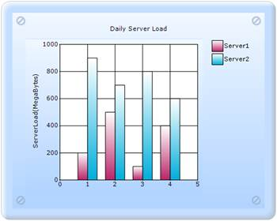
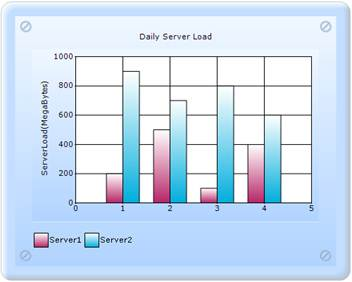
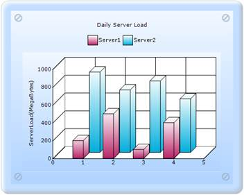

::: {style="DISPLAY: none"}
{#d2h_url_template}{#d2h_package_url style="WIDTH: 0px; DISPLAY: none; HEIGHT: 0px"}
:::

::::: {#nsbanner .d2h_main_nsbanner style="BORDER-BOTTOM: #999999 1px solid; POSITION: relative; PADDING-BOTTOM: 0px; BACKGROUND-COLOR: transparent; PADDING-LEFT: 0px; PADDING-RIGHT: 0px; DISPLAY: none; BORDER-TOP: #999999 1px solid; PADDING-TOP: 0px; LEFT: 0px"}
:::: {#TitleRow .d2h_main_titlerow style="PADDING-BOTTOM: 4px; BACKGROUND-COLOR: transparent; PADDING-LEFT: 22px; WIDTH: 100%; PADDING-RIGHT: 10px; DISPLAY: none; PADDING-TOP: 4px"}
::: {#ienav .d2h_main_ienav style="DISPLAY: none"}
{#D2HPrevious .D2HPreviousEnabled}  {#D2HNext .D2HNextEnabled}
:::
::::
:::::

::::::: {#nstext .d2h_main_nstext style="PADDING-BOTTOM: 10px; BACKGROUND-COLOR: transparent; PADDING-LEFT: 22px; PADDING-RIGHT: 10px; HEIGHT: 100%; OVERFLOW: auto; PADDING-TOP: 5px" hasuserbackground="true" valign="bottom"}
::: {#d2h_breadcrumbs .d2h_breadcrumbs}
[Essential Studio User Guide Documentation](ms-xhelp:///?Id=12457748-09e3-4d74-a240-8e049cedf030){.d2h_breadcrumbsNormal}[ \> ]{.d2h_breadcrumbsLinkSeparator}[User Interface Edition](ms-xhelp:///?Id=c29296b7-531c-413b-a0ec-488ca1f7f669){.d2h_breadcrumbsNormal}[ \> ]{.d2h_breadcrumbsLinkSeparator}[Essential ASP.NET MVC](ms-xhelp:///?Id=4b14e7d1-65c4-4f67-b1aa-2c37709905a5){.d2h_breadcrumbsNormal}[ \> ]{.d2h_breadcrumbsLinkSeparator}[Essential Chart]{.d2h_breadcrumbsContentsOnly}[ \> ]{.d2h_breadcrumbsLinkSeparator}[Concepts and Features](ms-xhelp:///?Id=696f5666-8b81-4685-9bd9-12198f06f3ad){.d2h_breadcrumbsNormal}[ \> ]{.d2h_breadcrumbsLinkSeparator}[Chart Legend with Legend Items](ms-xhelp:///?Id=da36b9c7-3e53-42d5-b02c-dbead57fef4f){.d2h_breadcrumbsNormal}
:::

### Customizing Legend Location {#customizing-legend-location style="tab-stops: 0pt"}

Chart Legend Customization

[]{#RichViewCheckpoint0}Essential Chart also supports the legend placement and legend alignment properties.[]{#RichViewCheckpoint1} It allows you to decide whether the legend should be placed inside or outside the chart, also the legend alignment can be done according to the chart content.

Legends Placement

The legend can be placed inside or outside the ChartArea by using the LegendsPlacement property. By default it is set to Inside.

Properties

The following table lists more information on the property:

::: {align="center"}
+-----------------------------------+-----------------------------------------------------------------------------------------------------+
| Chart Property                    | Description                                                                                         |
+-----------------------------------+-----------------------------------------------------------------------------------------------------+
| LegendsPlacement                  | Specifies the placement of the legend relative to the ChartArea. It includes the following options: |
|                                   |                                                                                                     |
|                                   | [·      ]{style="FONT-FAMILY: Symbol"}Inside: Legend is placed inside the ChartArea.                |
|                                   |                                                                                                     |
|                                   | [·      ]{style="FONT-FAMILY: Symbol"}Outside: Legend is placed outside the ChartArea.              |
+-----------------------------------+-----------------------------------------------------------------------------------------------------+
:::

**[]{style="FONT-FAMILY: 'Calibri','sans-serif'"}** 

Legend Position

You can set the position for the legend in a Chart control by using the LegendPosition property.

Properties

The following table lists more information on the property:

::: {align="center"}
+-----------------------------------+----------------------------------------------------------------------------------------------------------------------------+
| Chart Property                    | Description                                                                                                                |
+-----------------------------------+----------------------------------------------------------------------------------------------------------------------------+
| LegendPosition                    | Specifies the position relative to the chart for which to render the legend. It includes the following options:            |
|                                   |                                                                                                                            |
|                                   | [·      ]{style="FONT-FAMILY: Symbol"}Top - Above the chart.                                                               |
|                                   |                                                                                                                            |
|                                   | [·      ]{style="FONT-FAMILY: Symbol"}Left - Left of the chart.                                                            |
|                                   |                                                                                                                            |
|                                   | [·      ]{style="FONT-FAMILY: Symbol"}Right - Right of the chart.                                                          |
|                                   |                                                                                                                            |
|                                   | [·      ]{style="FONT-FAMILY: Symbol"}Bottom - Below the chart.                                                            |
|                                   |                                                                                                                            |
|                                   | [·      ]{style="FONT-FAMILY: Symbol"}Floating - Will not be docked to any specific location. This is the default setting. |
+-----------------------------------+----------------------------------------------------------------------------------------------------------------------------+
:::

**[]{style="FONT-FAMILY: 'Calibri','sans-serif'"}** 

Legend Alignment

The legend can be aligned to the center, near, or far in the ChartModel or ChartArea by using the LegendAlignment property.

Properties

The following table lists more information on the property:

 

::: {align="center"}
+-----------------------------------+----------------------------------------------------------------------------------------------------------------+
| Chart Property                    | Description                                                                                                    |
+-----------------------------------+----------------------------------------------------------------------------------------------------------------+
| LegendAlignment                   | Specifies the legend alignment relative to the ChartArea and Chart control. It includes the following options: |
|                                   |                                                                                                                |
|                                   | [·      ]{style="FONT-FAMILY: Symbol"}Center: Legend placed at the center.                                     |
|                                   |                                                                                                                |
|                                   | [·      ]{style="FONT-FAMILY: Symbol"}Near: Legend placed near the position.                                   |
|                                   |                                                                                                                |
|                                   | [·      ]{style="FONT-FAMILY: Symbol"}Far: Legend placed far from the position.                                |
+-----------------------------------+----------------------------------------------------------------------------------------------------------------+
:::

 

The following screenshots show different combinations of the above properties:

[]{style="FONT-FAMILY: 'Times New Roman','serif'; FONT-SIZE: 12pt"} 

{border="0"}

Figure 297: Legend Position Top, LegendAlignment Center, and LegendsPlacement Inside

**[]{style="FONT-FAMILY: 'Calibri','sans-serif'"}** 

{border="0"}

Figure 298: Legend Position Left, LegendAlignment Far, and LegendsPlacement Inside

**[]{style="FONT-FAMILY: 'Calibri','sans-serif'"}** 

**[]{style="FONT-FAMILY: 'Calibri','sans-serif'"}** 

{border="0"}

Figure 299: Legend Position Right, LegendAlignment Near, and LegendsPlacement Outside

**[]{style="FONT-FAMILY: 'Calibri','sans-serif'"}** 

{border="0"}

Figure 300: Legend Position Bottom, LegendAlignment Near, and LegendsPlacement Outside

 

{border="0"}

Figure 301: Legend Position Top, LegendAlignment Center, and LegendsPlacement Outside

Legend customization in any chart can be created in two ways:

[·      ]{style="FONT-FAMILY: Symbol"}Builder

[·      ]{style="FONT-FAMILY: Symbol"}ChartModel

More:

[ ]{#related-topics}

[{border="0" align="absMiddle"}Builder](ms-xhelp:///?Id=f121fc68-5b57-493f-a8be-8d8b783c1885){style="TEXT-DECORATION: none"}

[{border="0" align="absMiddle"}ChartModel](ms-xhelp:///?Id=a307e8af-8a55-4079-88ca-177b0873cc50){style="TEXT-DECORATION: none"}
:::::::
