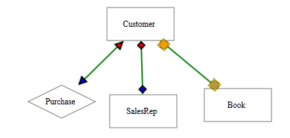

::: {style="DISPLAY: none"}
{#d2h_url_template}{#d2h_package_url style="WIDTH: 0px; DISPLAY: none; HEIGHT: 0px"}
:::

::::: {#nsbanner .d2h_main_nsbanner style="BORDER-BOTTOM: #999999 1px solid; POSITION: relative; PADDING-BOTTOM: 0px; BACKGROUND-COLOR: transparent; PADDING-LEFT: 0px; PADDING-RIGHT: 0px; DISPLAY: none; BORDER-TOP: #999999 1px solid; PADDING-TOP: 0px; LEFT: 0px"}
:::: {#TitleRow .d2h_main_titlerow style="PADDING-BOTTOM: 4px; BACKGROUND-COLOR: transparent; PADDING-LEFT: 22px; WIDTH: 100%; PADDING-RIGHT: 10px; DISPLAY: none; PADDING-TOP: 4px"}
::: {#ienav .d2h_main_ienav style="DISPLAY: none"}
{#D2HPrevious .D2HPreviousEnabled}  {#D2HNext .D2HNextEnabled}
:::
::::
:::::

:::: {#nstext .d2h_main_nstext style="PADDING-BOTTOM: 10px; BACKGROUND-COLOR: transparent; PADDING-LEFT: 22px; PADDING-RIGHT: 10px; HEIGHT: 100%; OVERFLOW: auto; PADDING-TOP: 5px" hasuserbackground="true" valign="bottom"}
::: {#d2h_breadcrumbs .d2h_breadcrumbs}
[Essential Studio User Guide Documentation](ms-xhelp:///?Id=12457748-09e3-4d74-a240-8e049cedf030){.d2h_breadcrumbsNormal}[ \> ]{.d2h_breadcrumbsLinkSeparator}[User Interface Edition](ms-xhelp:///?Id=c29296b7-531c-413b-a0ec-488ca1f7f669){.d2h_breadcrumbsNormal}[ \> ]{.d2h_breadcrumbsLinkSeparator}[Essential ASP.NET MVC](ms-xhelp:///?Id=4b14e7d1-65c4-4f67-b1aa-2c37709905a5){.d2h_breadcrumbsNormal}[ \> ]{.d2h_breadcrumbsLinkSeparator}[Essential Diagram]{.d2h_breadcrumbsContentsOnly}[ \> ]{.d2h_breadcrumbsLinkSeparator}[Concepts and Features](ms-xhelp:///?Id=04839cdf-94fc-4d24-9f6b-119fdbd7bbfb){.d2h_breadcrumbsNormal}[ \> ]{.d2h_breadcrumbsLinkSeparator}[Line Connector](ms-xhelp:///?Id=c7ae1b55-3b10-4b74-889d-cf088e9eca27){.d2h_breadcrumbsNormal}
:::

### Customizing Line Connectors {#customizing-line-connectors style="tab-stops: 0pt"}

The lineconnector can be customized by using the following properties:

 

Properties

  ---------------------------------------------------------- ------------------------------------------------------------------------------------ ------------------ ---------------
  Property Name                                              Description                                                                          Value it Accepts   Default Value
  LineColor                                                  Used to change the color of the line/connector.                                      String             Black
  LineWidth                                                  Used to change the width of the line/connector.                                      Double             1
  [HeadDecoratorHeight]{style="COLOR: black"}                Used to change the height of the line/connector head decorator shape.                Double             8
  [HeadDecoratorWidth]{style="COLOR: black"}                 Used to change the width of the line/connector head decorator shape.                 Double             8
  [HeadDecoratorBackground]{style="COLOR: black"}            Used to change the background color of the line/connector head decorator shape.      String             Black
  [HeadDecoratorBorderColor]{style="COLOR: black"}           Used to change the border color of the line/connector headdecorator shape.           String             Black
  [HeadDecoratorSelectorBackground]{style="COLOR: black"}    Used to change the background color of the line/connector head decorator selector.   String             Gray
  [HeadDecoratorSelectorBorderColor]{style="COLOR: black"}   Used to change the border color of the line/connector head decorator selector.       String             Black
  [TailDecoratorBackground]{style="COLOR: black"}            Used to change the background color of the line/connector tail decorator shape.      String             Black
  [TailDecoratorBorderColor]{style="COLOR: black"}           Used to change the border color of the line/connector tail decorator shape.          String             Black
  [TailDecoratorSelectorBackground]{style="COLOR: black"}    Used to change the background color of the line/connector tail decorator selector.   String             Gray
  [TailDecoratorSelectorBorderColor]{style="COLOR: black"}   Used to change the border color of the line/connector tail decorator selector.       String             Black
  [TailDecoratorHeight]{style="COLOR: black"}                Used to change the height of the line/connector tail decorator shape.                Double             8
  [TailDecoratorWidth]{style="COLOR: black"}                 Used to change the width of the line/connector tail decorator shape.                 Double             8
  ---------------------------------------------------------- ------------------------------------------------------------------------------------ ------------------ ---------------

 

The following code can be used to customize the line connector. 

+----------------------------------------------------------------------------------------------------------------------------------------------------------------------------------------------------------------------------------------------------------------------------------------------+
| **[Controller]{style="FONT-FAMILY: 'Courier New'; FONT-SIZE: 11pt"}**[]{style="FONT-FAMILY: 'Courier New'; FONT-SIZE: 11pt"}                                                                                                                                                                 |
|                                                                                                                                                                                                                                                                                              |
| [             LineConnector]{style="FONT-FAMILY: 'Courier New'; COLOR: #2b91af; FONT-SIZE: 11pt"}[ lineConnector = [new]{style="COLOR: blue"} [LineConnector]{style="COLOR: #2b91af"}()]{style="FONT-FAMILY: 'Courier New'; FONT-SIZE: 11pt"}                                                |
|                                                                                                                                                                                                                                                                                              |
| [            {]{style="FONT-FAMILY: 'Courier New'; FONT-SIZE: 11pt"}                                                                                                                                                                                                                         |
|                                                                                                                                                                                                                                                                                              |
| [                Name=name,]{style="FONT-FAMILY: 'Courier New'; FONT-SIZE: 11pt"}                                                                                                                                                                                                            |
|                                                                                                                                                                                                                                                                                              |
| [                HeadNode = headNode,]{style="FONT-FAMILY: 'Courier New'; FONT-SIZE: 11pt"}                                                                                                                                                                                                  |
|                                                                                                                                                                                                                                                                                              |
| [                TailNode = tailNode,]{style="FONT-FAMILY: 'Courier New'; FONT-SIZE: 11pt"}                                                                                                                                                                                                  |
|                                                                                                                                                                                                                                                                                              |
| [                ConnectorType = [ConnectorType]{style="COLOR: #2b91af"}.Beizer,]{style="FONT-FAMILY: 'Courier New'; FONT-SIZE: 11pt"}                                                                                                                                                       |
|                                                                                                                                                                                                                                                                                              |
|                    LineColor = "green",                                                                                                                                                                                                                                                      |
|                                                                                                                                                                                                                                                                                              |
| [                LineWidth = 2,]{style="FONT-FAMILY: 'Courier New'; COLOR: black; FONT-SIZE: 11pt"}                                                                                                                                                                                          |
|                                                                                                                                                                                                                                                                                              |
| [                HeadDecoratorHeight=14,]{style="FONT-FAMILY: 'Courier New'; COLOR: black; FONT-SIZE: 11pt"}                                                                                                                                                                                 |
|                                                                                                                                                                                                                                                                                              |
| [                HeadDecoratorWidth=14,]{style="FONT-FAMILY: 'Courier New'; COLOR: black; FONT-SIZE: 11pt"}                                                                                                                                                                                  |
|                                                                                                                                                                                                                                                                                              |
| [                HeadDecoratorBackground=]{style="FONT-FAMILY: 'Courier New'; COLOR: black; FONT-SIZE: 11pt"}[\"red\"]{style="FONT-FAMILY: 'Courier New'; COLOR: #a31515; FONT-SIZE: 11pt"}[,]{style="FONT-FAMILY: 'Courier New'; COLOR: black; FONT-SIZE: 11pt"}                            |
|                                                                                                                                                                                                                                                                                              |
| [                HeadDecoratorBorderColor=]{style="FONT-FAMILY: 'Courier New'; COLOR: black; FONT-SIZE: 11pt"}[\"black\"]{style="FONT-FAMILY: 'Courier New'; COLOR: #a31515; FONT-SIZE: 11pt"}[,]{style="FONT-FAMILY: 'Courier New'; COLOR: black; FONT-SIZE: 11pt"}                         |
|                                                                                                                                                                                                                                                                                              |
| [                HeadDecoratorSelectorBackground=]{style="FONT-FAMILY: 'Courier New'; COLOR: black; FONT-SIZE: 11pt"}[\"gold\"]{style="FONT-FAMILY: 'Courier New'; COLOR: #a31515; FONT-SIZE: 11pt"}[,]{style="FONT-FAMILY: 'Courier New'; COLOR: black; FONT-SIZE: 11pt"}                   |
|                                                                                                                                                                                                                                                                                              |
| [                HeadDecoratorSelectorBorderColor = ]{style="FONT-FAMILY: 'Courier New'; COLOR: black; FONT-SIZE: 11pt"}[\"black\"]{style="FONT-FAMILY: 'Courier New'; COLOR: #a31515; FONT-SIZE: 11pt"}[,  ]{style="FONT-FAMILY: 'Courier New'; COLOR: black; FONT-SIZE: 11pt"}             |
|                                                                                                                                                                                                                                                                                              |
| [                TailDecoratorBackground=]{style="FONT-FAMILY: 'Courier New'; COLOR: black; FONT-SIZE: 11pt"}[\"blue\"]{style="FONT-FAMILY: 'Courier New'; COLOR: #a31515; FONT-SIZE: 11pt"}[,]{style="FONT-FAMILY: 'Courier New'; COLOR: black; FONT-SIZE: 11pt"}                           |
|                                                                                                                                                                                                                                                                                              |
| [                TailDecoratorBorderColor=]{style="FONT-FAMILY: 'Courier New'; COLOR: black; FONT-SIZE: 11pt"}[\"black\"]{style="FONT-FAMILY: 'Courier New'; COLOR: #a31515; FONT-SIZE: 11pt"}[,]{style="FONT-FAMILY: 'Courier New'; COLOR: black; FONT-SIZE: 11pt"}                         |
|                                                                                                                                                                                                                                                                                              |
| [                TailDecoratorSelectorBackground = ]{style="FONT-FAMILY: 'Courier New'; COLOR: black; FONT-SIZE: 11pt"}[\"gold\"]{style="FONT-FAMILY: 'Courier New'; COLOR: #a31515; FONT-SIZE: 11pt"}[,]{style="FONT-FAMILY: 'Courier New'; COLOR: black; FONT-SIZE: 11pt"}                 |
|                                                                                                                                                                                                                                                                                              |
| [                TailDecoratorSelectorBorderColor=]{style="FONT-FAMILY: 'Courier New'; COLOR: black; FONT-SIZE: 11pt"}[\"black\"]{style="FONT-FAMILY: 'Courier New'; COLOR: #a31515; FONT-SIZE: 11pt"}[,                ]{style="FONT-FAMILY: 'Courier New'; COLOR: black; FONT-SIZE: 11pt"} |
|                                                                                                                                                                                                                                                                                              |
| [                TailDecoratorHeight=14,]{style="FONT-FAMILY: 'Courier New'; COLOR: black; FONT-SIZE: 11pt"}                                                                                                                                                                                 |
|                                                                                                                                                                                                                                                                                              |
| [                TailDecoratorWidth=14]{style="FONT-FAMILY: 'Courier New'; COLOR: black; FONT-SIZE: 11pt"}                                                                                                                                                                                   |
|                                                                                                                                                                                                                                                                                              |
| [            };]{style="FONT-FAMILY: 'Courier New'; FONT-SIZE: 11pt"}                                                                                                                                                                                                                        |
+----------------------------------------------------------------------------------------------------------------------------------------------------------------------------------------------------------------------------------------------------------------------------------------------+

 

{border="0"}

Figure 72: Connector Customization

[]{#related-topics}
::::
