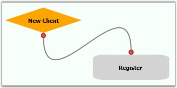

::: {style="DISPLAY: none"}
{#d2h_url_template}{#d2h_package_url style="WIDTH: 0px; DISPLAY: none; HEIGHT: 0px"}
:::

::::: {#nsbanner .d2h_main_nsbanner style="BORDER-BOTTOM: #999999 1px solid; POSITION: relative; PADDING-BOTTOM: 0px; BACKGROUND-COLOR: transparent; PADDING-LEFT: 0px; PADDING-RIGHT: 0px; DISPLAY: none; BORDER-TOP: #999999 1px solid; PADDING-TOP: 0px; LEFT: 0px"}
:::: {#TitleRow .d2h_main_titlerow style="PADDING-BOTTOM: 4px; BACKGROUND-COLOR: transparent; PADDING-LEFT: 22px; WIDTH: 100%; PADDING-RIGHT: 10px; DISPLAY: none; PADDING-TOP: 4px"}
::: {#ienav .d2h_main_ienav style="DISPLAY: none"}
{#D2HPrevious .D2HPreviousEnabled}  {#D2HNext .D2HNextEnabled}
:::
::::
:::::

:::: {#nstext .d2h_main_nstext style="PADDING-BOTTOM: 10px; BACKGROUND-COLOR: transparent; PADDING-LEFT: 22px; PADDING-RIGHT: 10px; HEIGHT: 100%; OVERFLOW: auto; PADDING-TOP: 5px" hasuserbackground="true" valign="bottom"}
::: {#d2h_breadcrumbs .d2h_breadcrumbs}
[Essential Studio User Guide Documentation](ms-xhelp:///?Id=12457748-09e3-4d74-a240-8e049cedf030){.d2h_breadcrumbsNormal}[ \> ]{.d2h_breadcrumbsLinkSeparator}[User Interface Edition](ms-xhelp:///?Id=c29296b7-531c-413b-a0ec-488ca1f7f669){.d2h_breadcrumbsNormal}[ \> ]{.d2h_breadcrumbsLinkSeparator}[Essential Silverlight](ms-xhelp:///?Id=66221bd1-ba2e-43c2-94a7-618f50e01d24){.d2h_breadcrumbsNormal}[ \> ]{.d2h_breadcrumbsLinkSeparator}[Essential Diagram]{.d2h_breadcrumbsContentsOnly}[ \> ]{.d2h_breadcrumbsLinkSeparator}[Concepts and Features](ms-xhelp:///?Id=d592a058-dcc0-44a4-994e-e7901da8db52){.d2h_breadcrumbsNormal}[ \> ]{.d2h_breadcrumbsLinkSeparator}[Line Connectors](ms-xhelp:///?Id=c0725ce8-38f1-496a-8a8e-c6602250e6b6){.d2h_breadcrumbsNormal}
:::

### Customizing Line Connectors {#customizing-line-connectors style="tab-stops: 0pt"}

[]{style="FONT-FAMILY: 'Trebuchet MS','sans-serif'; COLOR: #15428b; FONT-SIZE: 9pt"} 

This topic describes two properties namely:

[·      ]{style="FONT-FAMILY: Symbol"}LineStyle

[·      ]{style="FONT-FAMILY: Symbol"}DecoratorStyle

[]{style="FONT-FAMILY: 'Trebuchet MS','sans-serif'; COLOR: #15428b; FONT-SIZE: 9pt"} 

Line Style

**[]{style="FONT-FAMILY: 'Trebuchet MS','sans-serif'; COLOR: #15428b"}** 

A connector can be customized by specifying the values under the **LineStyle** property. The various properties under LineStyle are:

[]{style="FONT-FAMILY: 'Trebuchet MS','sans-serif'; COLOR: #15428b; FONT-SIZE: 9pt"} 

[·      ]{style="FONT-FAMILY: Symbol"}**Fill -** Specifies the color used to fill the connector.

[·      ]{style="FONT-FAMILY: Symbol"}**StrokeThickness -** Specifies the thickness value for the connector\'s border.

[·      ]{style="FONT-FAMILY: Symbol"}**Stroke** - Specifies the color used for the border of the connector.

[·      ]{style="FONT-FAMILY: Symbol"}**StrokeStartLineCap -** Specifies the shape to be used at the start of a line or segment.

[·      ]{style="FONT-FAMILY: Symbol"}**StrokeEndLineCap** - Specifies the shape at the end of a line or segment.

[·      ]{style="FONT-FAMILY: Symbol"}**StrokeLineJoin -** Specifies the shape that joins two lines or segments.

[·      ]{style="FONT-FAMILY: Symbol"}**StrokeDashArray -** Specifies a collection of double values that indicate the pattern of dashes and gaps used to outline shapes.

[]{style="FONT-FAMILY: 'Trebuchet MS','sans-serif'; COLOR: #15428b; FONT-SIZE: 9pt"} 

As an example, the Stroke property can be applied as follows.

[]{style="FONT-FAMILY: 'Trebuchet MS','sans-serif'; COLOR: #15428b; FONT-SIZE: 9pt"} 

+--------------------------------------------------------------------------------------------------------------------------------------------------------------------------------------+
| **[\[C#\]]{style="FONT-FAMILY: 'Courier New'; COLOR: black"}**                                                                                                                       |
|                                                                                                                                                                                      |
| []{style="FONT-FAMILY: 'Courier New'"}                                                                                                                                               |
|                                                                                                                                                                                      |
| [LineConnector]{style="FONT-FAMILY: 'Courier New'; COLOR: #2b91af"}[ l1 = [new]{style="COLOR: blue"} [LineConnector]{style="COLOR: #2b91af"}();]{style="FONT-FAMILY: 'Courier New'"} |
|                                                                                                                                                                                      |
| [l1.HeadNode = n1;]{style="FONT-FAMILY: 'Courier New'"}                                                                                                                              |
|                                                                                                                                                                                      |
| [l1.TailNode = n2;]{style="FONT-FAMILY: 'Courier New'"}                                                                                                                              |
|                                                                                                                                                                                      |
| [l1.ConnectorType = [ConnectorType]{style="COLOR: #2b91af"}.Bezier;]{style="FONT-FAMILY: 'Courier New'"}                                                                             |
|                                                                                                                                                                                      |
| [l1.LineStyle.Stroke = [Brushes]{style="COLOR: #2b91af"}.Red;]{style="FONT-FAMILY: 'Courier New'"}                                                                                   |
|                                                                                                                                                                                      |
| [diagramModel.Connections.Add(l1);]{style="FONT-FAMILY: 'Courier New'"}                                                                                                              |
+--------------------------------------------------------------------------------------------------------------------------------------------------------------------------------------+

[]{style="FONT-FAMILY: 'Trebuchet MS','sans-serif'; COLOR: #15428b; FONT-SIZE: 9pt"} 

+------------------------------------------------------------------------------------------------------------------------------------------------------------------------------------------------+
| **[\[VB\]]{style="FONT-FAMILY: 'Courier New'; COLOR: black"}**                                                                                                                                 |
|                                                                                                                                                                                                |
| []{style="FONT-FAMILY: 'Courier New'"}                                                                                                                                                         |
|                                                                                                                                                                                                |
| [Dim]{style="FONT-FAMILY: 'Courier New'; COLOR: blue"}[ l1 [As]{style="COLOR: blue"} [New]{style="COLOR: blue"} [LineConnector]{style="COLOR: #2b91af"}()]{style="FONT-FAMILY: 'Courier New'"} |
|                                                                                                                                                                                                |
| [l1.HeadNode = n1]{style="FONT-FAMILY: 'Courier New'"}                                                                                                                                         |
|                                                                                                                                                                                                |
| [l1.TailNode = n2]{style="FONT-FAMILY: 'Courier New'"}                                                                                                                                         |
|                                                                                                                                                                                                |
| [l1.ConnectorType = ConnectorType.Bezier]{style="FONT-FAMILY: 'Courier New'"}                                                                                                                  |
|                                                                                                                                                                                                |
| [l1.LineStyle.Stroke = Brushes.Red]{style="FONT-FAMILY: 'Courier New'"}                                                                                                                        |
|                                                                                                                                                                                                |
| [diagramModel.Connections.Add(l1)]{style="FONT-FAMILY: 'Courier New'"}[]{style="FONT-FAMILY: 'Courier New'"}                                                                                   |
+------------------------------------------------------------------------------------------------------------------------------------------------------------------------------------------------+

[]{style="FONT-FAMILY: 'Trebuchet MS','sans-serif'; COLOR: #15428b; FONT-SIZE: 9pt"} 

{border="0"}

Figure 66: LineStyle**[]{style="FONT-STYLE: normal; FONT-FAMILY: 'Trebuchet MS','sans-serif'; COLOR: #15428b"}**

**[]{style="FONT-FAMILY: 'Trebuchet MS','sans-serif'; COLOR: #15428b; FONT-SIZE: 9pt"}** 

DecoratorStyle

**[]{style="FONT-FAMILY: 'Trebuchet MS','sans-serif'; COLOR: #15428b; FONT-SIZE: 9pt"}** 

The decorator shapes used for the connector can be customized by specifying the property values under the **DecoratorStyle** property. To change the decorator style, the HeadDecoratorStyle and TailDecoratorStyle properties are used.

 

The various properties under the DecoratorStyle property are as follows:

[]{style="FONT-FAMILY: 'Trebuchet MS','sans-serif'; COLOR: #15428b; FONT-SIZE: 9pt"} 

[·      ]{style="FONT-FAMILY: Symbol"}**Fill** - Specifies the color to be used to fill the decorator.

[·      ]{style="FONT-FAMILY: Symbol"}**StrokeThickness** - Specifies the thickness value for the decorator\'s border.

[·      ]{style="FONT-FAMILY: Symbol"}**Stroke -** Specifies the color to be used for the border of the decorator.

[·      ]{style="FONT-FAMILY: Symbol"}**StrokeStartLineCap** - Specifies the shape used at the start of a line or segment.

[·      ]{style="FONT-FAMILY: Symbol"}**StrokeEndLineCap -** Specifies the shape at the end of a line or segment.

[·      ]{style="FONT-FAMILY: Symbol"}**StrokeLineJoin** - Specifies the shape that joins two lines or segments.

[·      ]{style="FONT-FAMILY: Symbol"}**StrokeDashArray** - Specifies a collection of double values that indicate the pattern of dashes and gaps used to outline shapes.

[]{style="FONT-FAMILY: 'Trebuchet MS','sans-serif'; COLOR: #15428b; FONT-SIZE: 9pt"} 

An example of the **Stroke** property can be applied to the head decorator as folllows.

[]{style="FONT-FAMILY: 'Trebuchet MS','sans-serif'; COLOR: #15428b; FONT-SIZE: 9pt"} 

+--------------------------------------------------------------------------------------------------------------------------------------------------------------------------------------+
| **[\[C#\]]{style="FONT-FAMILY: 'Courier New'; COLOR: black"}**                                                                                                                       |
|                                                                                                                                                                                      |
| []{style="FONT-FAMILY: 'Courier New'"}                                                                                                                                               |
|                                                                                                                                                                                      |
| [LineConnector]{style="FONT-FAMILY: 'Courier New'; COLOR: #2b91af"}[ l1 = [new]{style="COLOR: blue"} [LineConnector]{style="COLOR: #2b91af"}();]{style="FONT-FAMILY: 'Courier New'"} |
|                                                                                                                                                                                      |
| [l1.HeadNode = n1;]{style="FONT-FAMILY: 'Courier New'"}                                                                                                                              |
|                                                                                                                                                                                      |
| [l1.TailNode = n2;]{style="FONT-FAMILY: 'Courier New'"}                                                                                                                              |
|                                                                                                                                                                                      |
| [l1.ConnectorType = [ConnectorType]{style="COLOR: #2b91af"}.Bezier;]{style="FONT-FAMILY: 'Courier New'"}                                                                             |
|                                                                                                                                                                                      |
| [l1.HeadDecoratorStyle.Stroke = [Brushes]{style="COLOR: #2b91af"}.Red;]{style="FONT-FAMILY: 'Courier New'"}                                                                          |
|                                                                                                                                                                                      |
| [l1.TailDecoratorStyle.Stroke = [Brushes]{style="COLOR: #2b91af"}.Red;]{style="FONT-FAMILY: 'Courier New'"}                                                                          |
|                                                                                                                                                                                      |
| [diagramModel.Connections.Add(l1);]{style="FONT-FAMILY: 'Courier New'"}                                                                                                              |
+--------------------------------------------------------------------------------------------------------------------------------------------------------------------------------------+

[]{style="FONT-FAMILY: 'Trebuchet MS','sans-serif'; COLOR: #15428b; FONT-SIZE: 9pt"} 

+------------------------------------------------------------------------------------------------------------------------------------------------------------------------------------------------+
| **[\[VB\]]{style="FONT-FAMILY: 'Courier New'; COLOR: black"}**                                                                                                                                 |
|                                                                                                                                                                                                |
| []{style="FONT-FAMILY: 'Courier New'"}                                                                                                                                                         |
|                                                                                                                                                                                                |
| [Dim]{style="FONT-FAMILY: 'Courier New'; COLOR: blue"}[ l1 [As]{style="COLOR: blue"} [New]{style="COLOR: blue"} [LineConnector]{style="COLOR: #2b91af"}()]{style="FONT-FAMILY: 'Courier New'"} |
|                                                                                                                                                                                                |
| [l1.HeadNode = n1]{style="FONT-FAMILY: 'Courier New'"}                                                                                                                                         |
|                                                                                                                                                                                                |
| [l1.TailNode = n2]{style="FONT-FAMILY: 'Courier New'"}                                                                                                                                         |
|                                                                                                                                                                                                |
| [l1.ConnectorType = ConnectorType.Bezier]{style="FONT-FAMILY: 'Courier New'"}                                                                                                                  |
|                                                                                                                                                                                                |
| [l1.HeadDecoratorStyle.Stroke = Brushes.Red]{style="FONT-FAMILY: 'Courier New'"}                                                                                                               |
|                                                                                                                                                                                                |
| [l1.TailDecoratorStyle.Stroke = Brushes.Red]{style="FONT-FAMILY: 'Courier New'"}                                                                                                               |
|                                                                                                                                                                                                |
| [diagramModel.Connections.Add(l1)]{style="FONT-FAMILY: 'Courier New'"}[]{style="FONT-FAMILY: 'Courier New'"}                                                                                   |
+------------------------------------------------------------------------------------------------------------------------------------------------------------------------------------------------+

[]{style="FONT-FAMILY: 'Trebuchet MS','sans-serif'; COLOR: #15428b; FONT-SIZE: 9pt"} 

{border="0"}

Figure 67: Decorator Style

[]{#p44} 

[]{#related-topics}
::::
