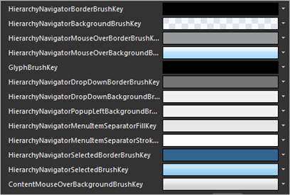
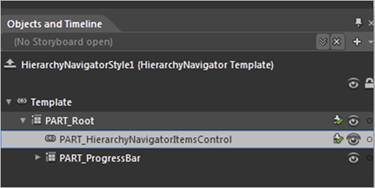
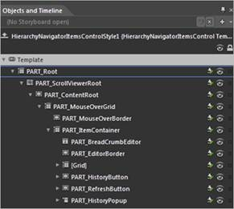
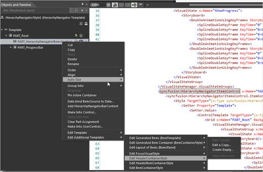
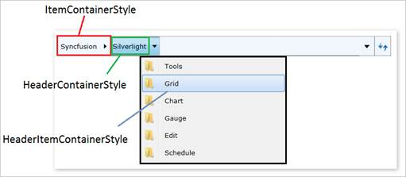
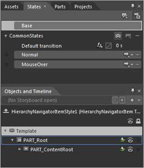
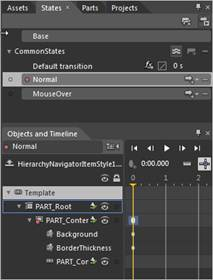

::: {style="DISPLAY: none"}
{#d2h_url_template}{#d2h_package_url style="WIDTH: 0px; DISPLAY: none; HEIGHT: 0px"}
:::

::: {.d2h_secondary_topic style="PADDING-BOTTOM: 10pt; MARGIN: 0pt; PADDING-LEFT: 0pt; PADDING-RIGHT: 0pt; PADDING-TOP: 0pt"}
#### [Customizing templates with Expression Blend]{#_Ref262127604} {#customizing-templates-with-expression-blend style="tab-stops: 0pt"}

The steps to customize templates by using Expression Blend are as follows:

1.   Create a new application in Expression Blend. Refer [Creating a HierarchyNavigator control by using Expression Blend](ms-xhelp:///?Id=8bd8ba14-aebf-445a-bc1b-1cec782bc509).

The following are the default resources, which are used for HierarchyNavigator control that can be changed in Expression Blend.

{border="0"}

 

Figure 591: Default Resources for Hierarchy Navigator

**[]{style="COLOR: #4f81bd; FONT-SIZE: 9pt"}** 

2.   Right-click the **HierarchyNavigator** control and select **Edit**, then select **Style**, and type a name.

[]{style="FONT-FAMILY: 'Trebuchet MS','sans-serif'; COLOR: #15428b; FONT-SIZE: 9pt"} 

{border="0"}

 

Figure 592: HierarchyNavigator in Expression Blend

 

3.   Right-click the **HierarchyNavigatorItemsControl** and select **Edit**, then select **Template**, and then select **Edit a Copy**, to edit the Refresh button, the History button, or the overall content. Additional styles (templates) can be used to edit a template available in the **HierarchyNavigatorItemsControl** class.

{border="0"}

 

Figure 593: HierarchyNavigatorItemsControl in Expression Blend

[]{style="FONT-FAMILY: 'Trebuchet MS','sans-serif'; COLOR: #15428b; FONT-SIZE: 9pt"} 

4.   Right-click the **Part_HierarchyNavigatorItemsControl** and select **Edit**, and then select **Additional Templates**. A list of additional styles to edit will be displayed. Figure 40 displays the style names.

 

{border="0"}

 

Figure 594: Edit Additional Templates

[{border="0"} ]{#_Ref261964963}

 

Figure 595: Additional styles illustrated

**[]{style="COLOR: #4f81bd; FONT-SIZE: 9pt"}** 

5.   Storyboards used in the VisualStateManager of every control are easy to customize and manage.

6.   For example, the HierarchyNavigatorItem control has two states: Normal and MouseOver. This is available on the States window, which can be accessed by clicking the **Window** menu and selecting **States**.

 

 

{border="0"}

 

Figure 596: States window

**[]{style="COLOR: #4f81bd; FONT-SIZE: 9pt"}** 

7.   Click the Visual State name, to edit the storyboard.

{border="0"}

 

Figure 597: Editing the storyboard

**[]{style="COLOR: #4f81bd; FONT-SIZE: 9pt"}** 

More:

[ ]{#related-topics}

[{border="0" align="absMiddle"}Customized sample styles](ms-xhelp:///?Id=8ec9935b-bc2a-493e-9c39-83b08d13126e){style="TEXT-DECORATION: none"}

[{border="0" align="absMiddle"}Sample XAML for ItemContainerStyle](ms-xhelp:///?Id=958d376c-c394-4772-abed-49da72c0c5e7){style="TEXT-DECORATION: none"}
:::
