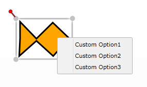

::: {style="DISPLAY: none"}
{#d2h_url_template}{#d2h_package_url style="WIDTH: 0px; DISPLAY: none; HEIGHT: 0px"}
:::

:::: {.d2h_secondary_topic style="PADDING-BOTTOM: 10pt; MARGIN: 0pt; PADDING-LEFT: 0pt; PADDING-RIGHT: 0pt; PADDING-TOP: 0pt"}
#### Customizing the Context Menu {#customizing-the-context-menu style="tab-stops: 0pt"}

The context menu of the nodes can be customized by adding ContextMenuControlItem, as shown in the following code snippets.

 

+----------------------------------------------------------------------------------------------------------------------------------------------------------------------------------------------------------------------------------------------------------------------------------------------------------------------------------------------------------------------------------------------------------------------------------------------------------------------------------------------------------------------------------------------------------------------------------------------------------------------------------------------------------------------------------+
| **[\[XAML\]]{style="FONT-FAMILY: 'Courier New'; COLOR: black"}**                                                                                                                                                                                                                                                                                                                                                                                                                                                                                                                                                                                                                 |
|                                                                                                                                                                                                                                                                                                                                                                                                                                                                                                                                                                                                                                                                                  |
| []{style="FONT-FAMILY: 'Courier New'"}                                                                                                                                                                                                                                                                                                                                                                                                                                                                                                                                                                                                                                           |
|                                                                                                                                                                                                                                                                                                                                                                                                                                                                                                                                                                                                                                                                                  |
| [ ]{style="FONT-FAMILY: 'Courier New'"}[\<]{style="FONT-FAMILY: 'Courier New'; COLOR: blue"}[syncfusion]{style="FONT-FAMILY: 'Courier New'; COLOR: #a31515"}[:]{style="FONT-FAMILY: 'Courier New'; COLOR: blue"}[Node]{style="FONT-FAMILY: 'Courier New'; COLOR: #a31515"}[ Shape]{style="FONT-FAMILY: 'Courier New'; COLOR: red"}[=\"Ellipse\"]{style="FONT-FAMILY: 'Courier New'; COLOR: blue"}[ Width]{style="FONT-FAMILY: 'Courier New'; COLOR: red"}[=\"100\"]{style="FONT-FAMILY: 'Courier New'; COLOR: blue"}[ Height]{style="FONT-FAMILY: 'Courier New'; COLOR: red"}[=\"100\"\>]{style="FONT-FAMILY: 'Courier New'; COLOR: blue"}[]{style="FONT-FAMILY: 'Courier New'"} |
|                                                                                                                                                                                                                                                                                                                                                                                                                                                                                                                                                                                                                                                                                  |
| [    ]{style="FONT-FAMILY: 'Courier New'; COLOR: #a31515"}[\<]{style="FONT-FAMILY: 'Courier New'; COLOR: blue"}[syncfusion]{style="FONT-FAMILY: 'Courier New'; COLOR: #a31515"}[:]{style="FONT-FAMILY: 'Courier New'; COLOR: blue"}[Node.ContextMenu]{style="FONT-FAMILY: 'Courier New'; COLOR: #a31515"}[\>]{style="FONT-FAMILY: 'Courier New'; COLOR: blue"}[]{style="FONT-FAMILY: 'Courier New'"}                                                                                                                                                                                                                                                                             |
|                                                                                                                                                                                                                                                                                                                                                                                                                                                                                                                                                                                                                                                                                  |
| [        ]{style="FONT-FAMILY: 'Courier New'; COLOR: #a31515"}[\<]{style="FONT-FAMILY: 'Courier New'; COLOR: blue"}[syncfusion]{style="FONT-FAMILY: 'Courier New'; COLOR: #a31515"}[:]{style="FONT-FAMILY: 'Courier New'; COLOR: blue"}[ContextMenuControl]{style="FONT-FAMILY: 'Courier New'; COLOR: #a31515"}[\>]{style="FONT-FAMILY: 'Courier New'; COLOR: blue"}[]{style="FONT-FAMILY: 'Courier New'"}                                                                                                                                                                                                                                                                       |
|                                                                                                                                                                                                                                                                                                                                                                                                                                                                                                                                                                                                                                                                                  |
| [            ]{style="FONT-FAMILY: 'Courier New'; COLOR: #a31515"}[\<]{style="FONT-FAMILY: 'Courier New'; COLOR: blue"}[syncfusion]{style="FONT-FAMILY: 'Courier New'; COLOR: #a31515"}[:]{style="FONT-FAMILY: 'Courier New'; COLOR: blue"}[ContextMenuControl.Items]{style="FONT-FAMILY: 'Courier New'; COLOR: #a31515"}[\>]{style="FONT-FAMILY: 'Courier New'; COLOR: blue"}[]{style="FONT-FAMILY: 'Courier New'"}                                                                                                                                                                                                                                                             |
|                                                                                                                                                                                                                                                                                                                                                                                                                                                                                                                                                                                                                                                                                  |
| [                ]{style="FONT-FAMILY: 'Courier New'; COLOR: #a31515"}[\<]{style="FONT-FAMILY: 'Courier New'; COLOR: blue"}[syncfusion]{style="FONT-FAMILY: 'Courier New'; COLOR: #a31515"}[:]{style="FONT-FAMILY: 'Courier New'; COLOR: blue"}[ContextMenuControlItem]{style="FONT-FAMILY: 'Courier New'; COLOR: #a31515"}[ Header]{style="FONT-FAMILY: 'Courier New'; COLOR: red"}[=\"Option1\"/\>]{style="FONT-FAMILY: 'Courier New'; COLOR: blue"}[]{style="FONT-FAMILY: 'Courier New'"}                                                                                                                                                                                     |
|                                                                                                                                                                                                                                                                                                                                                                                                                                                                                                                                                                                                                                                                                  |
| [                ]{style="FONT-FAMILY: 'Courier New'; COLOR: #a31515"}[\<]{style="FONT-FAMILY: 'Courier New'; COLOR: blue"}[syncfusion]{style="FONT-FAMILY: 'Courier New'; COLOR: #a31515"}[:]{style="FONT-FAMILY: 'Courier New'; COLOR: blue"}[ContextMenuControlItem]{style="FONT-FAMILY: 'Courier New'; COLOR: #a31515"}[ Header]{style="FONT-FAMILY: 'Courier New'; COLOR: red"}[=\"Option2\"/\>]{style="FONT-FAMILY: 'Courier New'; COLOR: blue"}                                                                                                                                                                                                                           |
|                                                                                                                                                                                                                                                                                                                                                                                                                                                                                                                                                                                                                                                                                  |
| [                ]{style="FONT-FAMILY: 'Courier New'; COLOR: #a31515"}[\<]{style="FONT-FAMILY: 'Courier New'; COLOR: blue"}[syncfusion]{style="FONT-FAMILY: 'Courier New'; COLOR: #a31515"}[:]{style="FONT-FAMILY: 'Courier New'; COLOR: blue"}[ContextMenuControlItem]{style="FONT-FAMILY: 'Courier New'; COLOR: #a31515"}[ Header]{style="FONT-FAMILY: 'Courier New'; COLOR: red"}[=\"Option3\"/\>]{style="FONT-FAMILY: 'Courier New'; COLOR: blue"}[]{style="FONT-FAMILY: 'Courier New'"}                                                                                                                                                                                     |
|                                                                                                                                                                                                                                                                                                                                                                                                                                                                                                                                                                                                                                                                                  |
| [            ]{style="FONT-FAMILY: 'Courier New'; COLOR: #a31515"}[\</]{style="FONT-FAMILY: 'Courier New'; COLOR: blue"}[syncfusion]{style="FONT-FAMILY: 'Courier New'; COLOR: #a31515"}[:]{style="FONT-FAMILY: 'Courier New'; COLOR: blue"}[ContextMenuControl.Items]{style="FONT-FAMILY: 'Courier New'; COLOR: #a31515"}[\>]{style="FONT-FAMILY: 'Courier New'; COLOR: blue"}[]{style="FONT-FAMILY: 'Courier New'"}                                                                                                                                                                                                                                                            |
|                                                                                                                                                                                                                                                                                                                                                                                                                                                                                                                                                                                                                                                                                  |
| [        ]{style="FONT-FAMILY: 'Courier New'; COLOR: #a31515"}[\</]{style="FONT-FAMILY: 'Courier New'; COLOR: blue"}[syncfusion]{style="FONT-FAMILY: 'Courier New'; COLOR: #a31515"}[:]{style="FONT-FAMILY: 'Courier New'; COLOR: blue"}[ContextMenuControl]{style="FONT-FAMILY: 'Courier New'; COLOR: #a31515"}[\>]{style="FONT-FAMILY: 'Courier New'; COLOR: blue"}[]{style="FONT-FAMILY: 'Courier New'"}                                                                                                                                                                                                                                                                      |
|                                                                                                                                                                                                                                                                                                                                                                                                                                                                                                                                                                                                                                                                                  |
| [    ]{style="FONT-FAMILY: 'Courier New'; COLOR: #a31515"}[\</]{style="FONT-FAMILY: 'Courier New'; COLOR: blue"}[syncfusion]{style="FONT-FAMILY: 'Courier New'; COLOR: #a31515"}[:]{style="FONT-FAMILY: 'Courier New'; COLOR: blue"}[Node.ContextMenu]{style="FONT-FAMILY: 'Courier New'; COLOR: #a31515"}[\>]{style="FONT-FAMILY: 'Courier New'; COLOR: blue"}[]{style="FONT-FAMILY: 'Courier New'"}                                                                                                                                                                                                                                                                            |
|                                                                                                                                                                                                                                                                                                                                                                                                                                                                                                                                                                                                                                                                                  |
| [\</]{style="FONT-FAMILY: 'Courier New'; COLOR: blue"}[syncfusion]{style="FONT-FAMILY: 'Courier New'; COLOR: #a31515"}[:]{style="FONT-FAMILY: 'Courier New'; COLOR: blue"}[Node]{style="FONT-FAMILY: 'Courier New'; COLOR: #a31515"}[\>]{style="FONT-FAMILY: 'Courier New'; COLOR: blue"}[]{style="FONT-FAMILY: 'Courier New'"}                                                                                                                                                                                                                                                                                                                                                  |
+----------------------------------------------------------------------------------------------------------------------------------------------------------------------------------------------------------------------------------------------------------------------------------------------------------------------------------------------------------------------------------------------------------------------------------------------------------------------------------------------------------------------------------------------------------------------------------------------------------------------------------------------------------------------------------+

 

+-------------------------------------------------------------------------------------------------------------------------------------------------------------------------------------------+
| **[\[C#\]]{style="FONT-FAMILY: 'Courier New'; COLOR: black"}**[]{style="FONT-FAMILY: 'Courier New'"}                                                                                      |
|                                                                                                                                                                                           |
| []{style="FONT-FAMILY: 'Courier New'"}                                                                                                                                                    |
|                                                                                                                                                                                           |
| [            [ContextMenuControl]{style="COLOR: #2b91af"} menu = [new]{style="COLOR: blue"} [ContextMenuControl]{style="COLOR: #2b91af"}();]{style="FONT-FAMILY: 'Courier New'"}          |
|                                                                                                                                                                                           |
| [            [ContextMenuControlItem]{style="COLOR: #2b91af"} item1 = [new]{style="COLOR: blue"} [ContextMenuControlItem]{style="COLOR: #2b91af"}();]{style="FONT-FAMILY: 'Courier New'"} |
|                                                                                                                                                                                           |
| [            item1.Header = [\"Custom Option1\"]{style="COLOR: #a31515"};]{style="FONT-FAMILY: 'Courier New'"}                                                                            |
|                                                                                                                                                                                           |
| [            [ContextMenuControlItem]{style="COLOR: #2b91af"} item2 = [new]{style="COLOR: blue"} [ContextMenuControlItem]{style="COLOR: #2b91af"}();]{style="FONT-FAMILY: 'Courier New'"} |
|                                                                                                                                                                                           |
| [            item2.Header = [\"Custom Option2\"]{style="COLOR: #a31515"};]{style="FONT-FAMILY: 'Courier New'"}                                                                            |
|                                                                                                                                                                                           |
| [            [ContextMenuControlItem]{style="COLOR: #2b91af"} item3 = [new]{style="COLOR: blue"} [ContextMenuControlItem]{style="COLOR: #2b91af"}();]{style="FONT-FAMILY: 'Courier New'"} |
|                                                                                                                                                                                           |
| [            item3.Header = [\"Custom Option3\"]{style="COLOR: #a31515"};]{style="FONT-FAMILY: 'Courier New'"}                                                                            |
|                                                                                                                                                                                           |
| [            menu.Items.Add(item1);]{style="FONT-FAMILY: 'Courier New'"}                                                                                                                  |
|                                                                                                                                                                                           |
| [            menu.Items.Add(item2);]{style="FONT-FAMILY: 'Courier New'"}                                                                                                                  |
|                                                                                                                                                                                           |
| [            menu.Items.Add(item3);]{style="FONT-FAMILY: 'Courier New'"}                                                                                                                  |
|                                                                                                                                                                                           |
| [            node1.ContextMenu = menu;]{style="FONT-FAMILY: 'Courier New'"}[]{style="FONT-FAMILY: 'Courier New'"}                                                                         |
+-------------------------------------------------------------------------------------------------------------------------------------------------------------------------------------------+

 

+-----------------------------------------------------------------------------------------------------------------------------------------------------------------------------------------------------------+
| **[\[VB\]]{style="FONT-FAMILY: 'Courier New'; COLOR: black"}**[ ]{style="FONT-FAMILY: 'Courier New'"}                                                                                                     |
|                                                                                                                                                                                                           |
| [    Dim]{style="FONT-FAMILY: 'Courier New'; COLOR: blue"}[ menu [As]{style="COLOR: blue"} [New]{style="COLOR: blue"} [ContextMenuControl]{style="COLOR: #2b91af"}()]{style="FONT-FAMILY: 'Courier New'"} |
|                                                                                                                                                                                                           |
| [    [Dim]{style="COLOR: blue"} item1 [As]{style="COLOR: blue"} [New]{style="COLOR: blue"} [ContextMenuControlItem]{style="COLOR: #2b91af"}()]{style="FONT-FAMILY: 'Courier New'"}                        |
|                                                                                                                                                                                                           |
| [                  item1.Header = \"Custom [Option]{style="COLOR: blue"}1\"]{style="FONT-FAMILY: 'Courier New'"}                                                                                          |
|                                                                                                                                                                                                           |
| [    [Dim]{style="COLOR: blue"} item2 [As]{style="COLOR: blue"} [New]{style="COLOR: blue"} [ContextMenuControlItem]{style="COLOR: #2b91af"}()]{style="FONT-FAMILY: 'Courier New'"}                        |
|                                                                                                                                                                                                           |
| [                  item2.Header = \"Custom [Option]{style="COLOR: blue"}2\"]{style="FONT-FAMILY: 'Courier New'"}                                                                                          |
|                                                                                                                                                                                                           |
| [    [Dim]{style="COLOR: blue"} item3 [As]{style="COLOR: blue"} [New]{style="COLOR: blue"} [ContextMenuControlItem]{style="COLOR: #2b91af"}()]{style="FONT-FAMILY: 'Courier New'"}                        |
|                                                                                                                                                                                                           |
| [                  item3.Header = \"Custom [Option]{style="COLOR: blue"}3\"]{style="FONT-FAMILY: 'Courier New'"}                                                                                          |
|                                                                                                                                                                                                           |
| [                  menu.Items.Add(item1)]{style="FONT-FAMILY: 'Courier New'"}                                                                                                                             |
|                                                                                                                                                                                                           |
| [                  menu.Items.Add(item2)]{style="FONT-FAMILY: 'Courier New'"}                                                                                                                             |
|                                                                                                                                                                                                           |
| [                  menu.Items.Add(item3)]{style="FONT-FAMILY: 'Courier New'"}                                                                                                                             |
|                                                                                                                                                                                                           |
| [                  node1.ContextMenu = menu]{style="FONT-FAMILY: 'Courier New'"}[]{style="FONT-FAMILY: 'Courier New'"}                                                                                    |
+-----------------------------------------------------------------------------------------------------------------------------------------------------------------------------------------------------------+

 

Similarly, the context menu of the connectors can be customized by adding ContextMenuControlItem, as shown in the following code snippet.

 

+----------------------------------------------------------------------------------------------------------------------------------------------------------------------------------------------------------------------------------------------------+
| **[\[C#\]]{style="FONT-FAMILY: 'Courier New'; COLOR: black"}**[ ]{style="FONT-FAMILY: 'Courier New'"}                                                                                                                                              |
|                                                                                                                                                                                                                                                    |
| [            [LineConnector]{style="COLOR: #2b91af"} line = [new]{style="COLOR: blue"} [LineConnector]{style="COLOR: #2b91af"}();]{style="FONT-FAMILY: 'Courier New'"}                                                                             |
|                                                                                                                                                                                                                                                    |
| [            line.ContextMenu = menu;]{style="FONT-FAMILY: 'Courier New'"}[]{style="FONT-FAMILY: 'Courier New'"}                                                                                                                                   |
+----------------------------------------------------------------------------------------------------------------------------------------------------------------------------------------------------------------------------------------------------+
| **[\[VB\]]{style="FONT-FAMILY: 'Courier New'; COLOR: black"}**[ ]{style="FONT-FAMILY: 'Courier New'"}                                                                                                                                              |
|                                                                                                                                                                                                                                                    |
| [            ]{style="FONT-FAMILY: 'Courier New'"}[Dim]{style="FONT-FAMILY: 'Courier New'; COLOR: blue"}[ line [As]{style="COLOR: blue"} [New]{style="COLOR: blue"} [LineConnector]{style="COLOR: #2b91af"}()]{style="FONT-FAMILY: 'Courier New'"} |
|                                                                                                                                                                                                                                                    |
| [           line.ContextMenu = menu]{style="FONT-FAMILY: 'Courier New'"}**[]{style="FONT-FAMILY: 'Courier New'; COLOR: black"}**                                                                                                                   |
+----------------------------------------------------------------------------------------------------------------------------------------------------------------------------------------------------------------------------------------------------+

{border="0"}

Figure 169: Custom Context Menu

The context menu can also be assigned to all the nodes on a page by using the NodeContextMenu property. Similarly, DiagramView's LineConnectorContextMenu property can be used to assign the customized context menu to all the lines on a page, as shown in the following code snippet.

[]{style="FONT-FAMILY: 'Courier New'"} 

+-------------------------------------------------------------------------------------------------------------------------------------------------------------------------------------------------------------------------------------------------------------------+
| **[\[C#\]]{style="FONT-FAMILY: 'Courier New'; COLOR: black"}**[]{style="FONT-FAMILY: 'Courier New'"}                                                                                                                                                              |
|                                                                                                                                                                                                                                                                   |
| []{style="FONT-FAMILY: 'Courier New'"}                                                                                                                                                                                                                            |
|                                                                                                                                                                                                                                                                   |
| [          ]{style="FONT-FAMILY: 'Courier New'; COLOR: #2b91af"}[ContextMenuControl]{style="FONT-FAMILY: 'Courier New'; COLOR: #2b91af"}[ menu1 = [new]{style="COLOR: blue"} [ContextMenuControl]{style="COLOR: #2b91af"}();]{style="FONT-FAMILY: 'Courier New'"} |
|                                                                                                                                                                                                                                                                   |
| [            [ContextMenuControlItem]{style="COLOR: #2b91af"} item11 = [new]{style="COLOR: blue"} [ContextMenuControlItem]{style="COLOR: #2b91af"}();]{style="FONT-FAMILY: 'Courier New'"}                                                                        |
|                                                                                                                                                                                                                                                                   |
| [            item11.Header = [\"Custom Option11\"]{style="COLOR: #a31515"};]{style="FONT-FAMILY: 'Courier New'"}                                                                                                                                                  |
|                                                                                                                                                                                                                                                                   |
| [            [ContextMenuControlItem]{style="COLOR: #2b91af"} item21 = [new]{style="COLOR: blue"} [ContextMenuControlItem]{style="COLOR: #2b91af"}();]{style="FONT-FAMILY: 'Courier New'"}                                                                        |
|                                                                                                                                                                                                                                                                   |
| [            item21.Header = [\"Custom Option21\"]{style="COLOR: #a31515"};]{style="FONT-FAMILY: 'Courier New'"}                                                                                                                                                  |
|                                                                                                                                                                                                                                                                   |
| [            [ContextMenuControlItem]{style="COLOR: #2b91af"} item31 = [new]{style="COLOR: blue"} [ContextMenuControlItem]{style="COLOR: #2b91af"}();]{style="FONT-FAMILY: 'Courier New'"}                                                                        |
|                                                                                                                                                                                                                                                                   |
| [            item31.Header = [\"Custom Option31\"]{style="COLOR: #a31515"};]{style="FONT-FAMILY: 'Courier New'"}                                                                                                                                                  |
|                                                                                                                                                                                                                                                                   |
| [            menu1.Items.Add(item11);]{style="FONT-FAMILY: 'Courier New'"}                                                                                                                                                                                        |
|                                                                                                                                                                                                                                                                   |
| [            menu1.Items.Add(item21);]{style="FONT-FAMILY: 'Courier New'"}                                                                                                                                                                                        |
|                                                                                                                                                                                                                                                                   |
| [            menu1.Items.Add(item31);]{style="FONT-FAMILY: 'Courier New'"}                                                                                                                                                                                        |
|                                                                                                                                                                                                                                                                   |
| [            diagramView.NodeContextMenu = menu1;]{style="FONT-FAMILY: 'Courier New'"}                                                                                                                                                                            |
|                                                                                                                                                                                                                                                                   |
| [            diagramView.LineConnectorContextMenu = menu1;]{style="FONT-FAMILY: 'Courier New'"}                                                                                                                                                                   |
|                                                                                                                                                                                                                                                                   |
| []{style="FONT-FAMILY: 'Courier New'"}                                                                                                                                                                                                                            |
+-------------------------------------------------------------------------------------------------------------------------------------------------------------------------------------------------------------------------------------------------------------------+

 

+-----------------------------------------------------------------------------------------------------------------------------------------------------------------------------------------------------------------------------------------------------------------------------------------+
| **[\[VB\]]{style="FONT-FAMILY: 'Courier New'; COLOR: black"}**[]{style="FONT-FAMILY: 'Courier New'"}                                                                                                                                                                                    |
|                                                                                                                                                                                                                                                                                         |
| []{style="FONT-FAMILY: 'Courier New'"}                                                                                                                                                                                                                                                  |
|                                                                                                                                                                                                                                                                                         |
| [     ]{style="FONT-FAMILY: 'Courier New'"}[Dim]{style="FONT-FAMILY: 'Courier New'; COLOR: blue"}[ menu1 [As]{style="COLOR: blue"} [New]{style="COLOR: blue"} [ContextMenuControl]{style="COLOR: #2b91af"}()]{style="FONT-FAMILY: 'Courier New'"}[]{style="FONT-FAMILY: 'Courier New'"} |
|                                                                                                                                                                                                                                                                                         |
| [    [Dim]{style="COLOR: blue"} item11 [As]{style="COLOR: blue"} [New]{style="COLOR: blue"} [ContextMenuControlItem]{style="COLOR: #2b91af"}()]{style="FONT-FAMILY: 'Courier New'"}                                                                                                     |
|                                                                                                                                                                                                                                                                                         |
| [                  item11.Header = \"Custom [Option]{style="COLOR: blue"}11\"]{style="FONT-FAMILY: 'Courier New'"}                                                                                                                                                                      |
|                                                                                                                                                                                                                                                                                         |
| [    [Dim]{style="COLOR: blue"} item21 [As]{style="COLOR: blue"} [New]{style="COLOR: blue"} [ContextMenuControlItem]{style="COLOR: #2b91af"}()]{style="FONT-FAMILY: 'Courier New'"}                                                                                                     |
|                                                                                                                                                                                                                                                                                         |
| [                  item21.Header = \"Custom [Option]{style="COLOR: blue"}21\"]{style="FONT-FAMILY: 'Courier New'"}                                                                                                                                                                      |
|                                                                                                                                                                                                                                                                                         |
| [    [Dim]{style="COLOR: blue"} item31 [As]{style="COLOR: blue"} [New]{style="COLOR: blue"} [ContextMenuControlItem]{style="COLOR: #2b91af"}()]{style="FONT-FAMILY: 'Courier New'"}                                                                                                     |
|                                                                                                                                                                                                                                                                                         |
| [                  item31.Header = \"Custom [Option]{style="COLOR: blue"}31\"]{style="FONT-FAMILY: 'Courier New'"}                                                                                                                                                                      |
|                                                                                                                                                                                                                                                                                         |
| [                  menu1.Items.Add(item11)]{style="FONT-FAMILY: 'Courier New'"}                                                                                                                                                                                                         |
|                                                                                                                                                                                                                                                                                         |
| [                  menu1.Items.Add(item21)]{style="FONT-FAMILY: 'Courier New'"}                                                                                                                                                                                                         |
|                                                                                                                                                                                                                                                                                         |
| [                  menu1.Items.Add(item31)]{style="FONT-FAMILY: 'Courier New'"}                                                                                                                                                                                                         |
|                                                                                                                                                                                                                                                                                         |
| [                  diagramView.NodeContextMenu = menu1]{style="FONT-FAMILY: 'Courier New'"}                                                                                                                                                                                             |
|                                                                                                                                                                                                                                                                                         |
| [                  diagramView.LineConnectorContextMenu = menu1]{style="FONT-FAMILY: 'Courier New'"}                                                                                                                                                                                    |
|                                                                                                                                                                                                                                                                                         |
| []{style="FONT-FAMILY: 'Courier New'"}                                                                                                                                                                                                                                                  |
+-----------------------------------------------------------------------------------------------------------------------------------------------------------------------------------------------------------------------------------------------------------------------------------------+

 

::: {style="BORDER-BOTTOM: windowtext 1pt solid; BORDER-LEFT: medium none; PADDING-BOTTOM: 1pt; MARGIN-TOP: 9pt; PADDING-LEFT: 0pt; PADDING-RIGHT: 0pt; MARGIN-BOTTOM: 9pt; BORDER-TOP: windowtext 1pt solid; BORDER-RIGHT: medium none; PADDING-TOP: 1pt"}
{border="0"}Note:

If a context menu is assigned to all the nodes on a page by using Node's ContextMenu property and DiagramView's NodeContextMenu property, then Node's ContextMenu property will take precedence over DiagramView's NodeContextMenu property.
:::

**[]{style="FONT-FAMILY: 'Trebuchet MS','sans-serif'; COLOR: #15428b; FONT-SIZE: 9pt"}** 

Properties

The property of the context menu for the nodes and line connectors is described in the following tabulation:

 

Table 18: Property Table

  -------------- ----------------------------------------------------------------------------- --------------------- -------------------- -----------------
  Property       Description                                                                   Type                  Data Type            Reference links
   ContextMenu   Refers to an instance of ContextMenuControl for the Node and LineConnector.   Dependency property   ContextMenuControl   Not applicable
  -------------- ----------------------------------------------------------------------------- --------------------- -------------------- -----------------

[]{#related-topics}
::::
