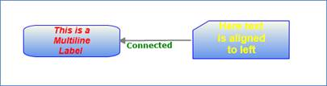

::: {style="DISPLAY: none"}
{#d2h_url_template}{#d2h_package_url style="WIDTH: 0px; DISPLAY: none; HEIGHT: 0px"}
:::

::::: {#nsbanner .d2h_main_nsbanner style="BORDER-BOTTOM: #999999 1px solid; POSITION: relative; PADDING-BOTTOM: 0px; BACKGROUND-COLOR: transparent; PADDING-LEFT: 0px; PADDING-RIGHT: 0px; DISPLAY: none; BORDER-TOP: #999999 1px solid; PADDING-TOP: 0px; LEFT: 0px"}
:::: {#TitleRow .d2h_main_titlerow style="PADDING-BOTTOM: 4px; BACKGROUND-COLOR: transparent; PADDING-LEFT: 22px; WIDTH: 100%; PADDING-RIGHT: 10px; DISPLAY: none; PADDING-TOP: 4px"}
::: {#ienav .d2h_main_ienav style="DISPLAY: none"}
{#D2HPrevious .D2HPreviousEnabled}  {#D2HNext .D2HNextEnabled}
:::
::::
:::::

::::: {#nstext .d2h_main_nstext style="PADDING-BOTTOM: 10px; BACKGROUND-COLOR: transparent; PADDING-LEFT: 22px; PADDING-RIGHT: 10px; HEIGHT: 100%; OVERFLOW: auto; PADDING-TOP: 5px" hasuserbackground="true" valign="bottom"}
::: {#d2h_breadcrumbs .d2h_breadcrumbs}
[Essential Studio User Guide Documentation](ms-xhelp:///?Id=12457748-09e3-4d74-a240-8e049cedf030){.d2h_breadcrumbsNormal}[ \> ]{.d2h_breadcrumbsLinkSeparator}[User Interface Edition](ms-xhelp:///?Id=c29296b7-531c-413b-a0ec-488ca1f7f669){.d2h_breadcrumbsNormal}[ \> ]{.d2h_breadcrumbsLinkSeparator}[Essential Silverlight](ms-xhelp:///?Id=66221bd1-ba2e-43c2-94a7-618f50e01d24){.d2h_breadcrumbsNormal}[ \> ]{.d2h_breadcrumbsLinkSeparator}[Essential Diagram]{.d2h_breadcrumbsContentsOnly}[ \> ]{.d2h_breadcrumbsLinkSeparator}[Concepts and Features](ms-xhelp:///?Id=d592a058-dcc0-44a4-994e-e7901da8db52){.d2h_breadcrumbsNormal}[ \> ]{.d2h_breadcrumbsLinkSeparator}[General](ms-xhelp:///?Id=f42a58ff-f8c9-4042-a1df-b5ffc5a5f983){.d2h_breadcrumbsNormal}
:::

### Customizing the Label of Nodes and Line Connectors {#customizing-the-label-of-nodes-and-line-connectors style="tab-stops: 0pt"}

 

[]{style="FONT-FAMILY: 'Trebuchet MS','sans-serif'; COLOR: #15428b; FONT-SIZE: 9pt"} 

The labels of the nodes and connectors are equipped with Multiline support i.e. the user can specify the labels to span multiple lines by setting the LabelTextWrapping property to wrap the text and by specifying the width of the label. Also, several other customization properties have been added for the labels. These are tabulated below:\
\

Properties[]{style="FONT-SIZE: 9pt"}

[]{style="FONT-FAMILY: 'Trebuchet MS','sans-serif'; COLOR: #15428b; FONT-SIZE: 9pt"} 

::: {align="center"}
+-------------------+---------------------------------------------------------------------------+----------------------+-------------------------------+---------------------------------------------------+
| Property          | Description                                                               | Type of the property | Value it accepts              | Any other dependencies/ sub properties associated |
+===================+===========================================================================+======================+===============================+===================================================+
| LabelForeground   | Gets or sets the foreground of the label. The default value is Black.     | Dependency property  | Brush                         | No                                                |
+-------------------+---------------------------------------------------------------------------+----------------------+-------------------------------+---------------------------------------------------+
| LabelBakground    | Gets or sets the background of the label. The default value is White.     | Dependency property  | Brush                         | No                                                |
+-------------------+---------------------------------------------------------------------------+----------------------+-------------------------------+---------------------------------------------------+
| LabelFontStyle    | Gets or sets the background of the label. The default value is White.     | Dependency property  | FontStyles.Oblique            | No                                                |
|                   |                                                                           |                      |                               |                                                   |
|                   |                                                                           |                      | FontStyles.Italic             |                                                   |
|                   |                                                                           |                      |                               |                                                   |
|                   |                                                                           |                      | FontStyles.Normal             |                                                   |
+-------------------+---------------------------------------------------------------------------+----------------------+-------------------------------+---------------------------------------------------+
| LabelFontFamily   | Gets or sets the font family of the label. The default value is Arial.    | Dependency property  | FontFamily                    | No                                                |
+-------------------+---------------------------------------------------------------------------+----------------------+-------------------------------+---------------------------------------------------+
| LabelFontSize     | Gets or sets the font size of the label. The default value is 11.         | Dependency property  | Double                        | No                                                |
+-------------------+---------------------------------------------------------------------------+----------------------+-------------------------------+---------------------------------------------------+
| LabelFontWeight   | Gets or sets the font weight of the label. The default value is SemiBold. | Dependency property  | FontWeights                   | No                                                |
+-------------------+---------------------------------------------------------------------------+----------------------+-------------------------------+---------------------------------------------------+
| LabelTextWrapping | Gets or sets the text wrapping of the label. The default value is NoWrap. | Dependency property  | TextWrapping.NoWrap           | No                                                |
|                   |                                                                           |                      |                               |                                                   |
|                   |                                                                           |                      | TextWrapping.Wrap             |                                                   |
|                   |                                                                           |                      |                               |                                                   |
|                   |                                                                           |                      | TextWrapping.WrapWithOverflow |                                                   |
+-------------------+---------------------------------------------------------------------------+----------------------+-------------------------------+---------------------------------------------------+
| LabelWidth        | Gets or sets the width of the label. The default value is node's width.   | Dependency property  | Double                        | No                                                |
+-------------------+---------------------------------------------------------------------------+----------------------+-------------------------------+---------------------------------------------------+
:::

[]{style="FONT-FAMILY: 'Trebuchet MS','sans-serif'; COLOR: #15428b; FONT-SIZE: 9pt"} 

The following code snippet illustrates the implementation of the properties mentioned in the table above.

[]{style="FONT-FAMILY: 'Trebuchet MS','sans-serif'; COLOR: #15428b; FONT-SIZE: 9pt"} 

+-------------------------------------------------------------------------------------------------------------------------------------------------------------------------------------------------------------------------------------------------------+
| **[\[C#\]]{style="FONT-FAMILY: 'Courier New'; COLOR: black"}**                                                                                                                                                                                        |
|                                                                                                                                                                                                                                                       |
| []{style="FONT-FAMILY: 'Courier New'"}                                                                                                                                                                                                                |
|                                                                                                                                                                                                                                                       |
| [Node]{style="FONT-FAMILY: 'Courier New'; COLOR: #2b91af"}[ node1 = [new]{style="COLOR: blue"} [Node]{style="COLOR: #2b91af"}([Guid]{style="COLOR: #2b91af"}.NewGuid(), [\"Register\"]{style="COLOR: #a31515"});]{style="FONT-FAMILY: 'Courier New'"} |
|                                                                                                                                                                                                                                                       |
| [            node1.Shape = [Shapes]{style="COLOR: #2b91af"}.RoundedSquare;]{style="FONT-FAMILY: 'Courier New'"}                                                                                                                                       |
|                                                                                                                                                                                                                                                       |
| [            node1.Width = 150;]{style="FONT-FAMILY: 'Courier New'"}                                                                                                                                                                                  |
|                                                                                                                                                                                                                                                       |
| [            node1.Height = 50;]{style="FONT-FAMILY: 'Courier New'"}                                                                                                                                                                                  |
|                                                                                                                                                                                                                                                       |
| [            node1.OffsetX = 250;]{style="FONT-FAMILY: 'Courier New'"}                                                                                                                                                                                |
|                                                                                                                                                                                                                                                       |
| [            node1.OffsetY = 100;]{style="FONT-FAMILY: 'Courier New'"}                                                                                                                                                                                |
|                                                                                                                                                                                                                                                       |
| [            node1.Label = [\"This is a Multiline Label \"]{style="COLOR: #a31515"};]{style="FONT-FAMILY: 'Courier New'"}                                                                                                                             |
|                                                                                                                                                                                                                                                       |
| [            node1.LabelWidth = 70;]{style="FONT-FAMILY: 'Courier New'"}                                                                                                                                                                              |
|                                                                                                                                                                                                                                                       |
| [            node1.LabelHeight = 150;]{style="FONT-FAMILY: 'Courier New'"}                                                                                                                                                                            |
|                                                                                                                                                                                                                                                       |
| [            node1.LabelTextWrapping = [TextWrapping]{style="COLOR: #2b91af"}.Wrap;]{style="FONT-FAMILY: 'Courier New'"}                                                                                                                              |
|                                                                                                                                                                                                                                                       |
| [            node1.LabelForeground = [new]{style="COLOR: blue"} [SolidColorBrush]{style="COLOR: #2b91af"}([Colors]{style="COLOR: #2b91af"}.Red);]{style="FONT-FAMILY: 'Courier New'"}                                                                 |
|                                                                                                                                                                                                                                                       |
| [            node1.LabelFontSize = 14;]{style="FONT-FAMILY: 'Courier New'"}                                                                                                                                                                           |
|                                                                                                                                                                                                                                                       |
| [            node1.LabelFontStyle = [FontStyles]{style="COLOR: #2b91af"}.Italic;]{style="FONT-FAMILY: 'Courier New'"}                                                                                                                                 |
|                                                                                                                                                                                                                                                       |
| [            ]{style="FONT-FAMILY: 'Courier New'"}                                                                                                                                                                                                    |
|                                                                                                                                                                                                                                                       |
| [            [Node]{style="COLOR: #2b91af"} node2 = [new]{style="COLOR: blue"} [Node]{style="COLOR: #2b91af"}([Guid]{style="COLOR: #2b91af"}.NewGuid(), [\"ClientAccountInfo\"]{style="COLOR: #a31515"});]{style="FONT-FAMILY: 'Courier New'"}        |
|                                                                                                                                                                                                                                                       |
| [            node2.Shape = [Shapes]{style="COLOR: #2b91af"}.FlowChart_Card;]{style="FONT-FAMILY: 'Courier New'"}                                                                                                                                      |
|                                                                                                                                                                                                                                                       |
| [            node2.Width = 150;]{style="FONT-FAMILY: 'Courier New'"}                                                                                                                                                                                  |
|                                                                                                                                                                                                                                                       |
| [            node2.Height = 60;]{style="FONT-FAMILY: 'Courier New'"}                                                                                                                                                                                  |
|                                                                                                                                                                                                                                                       |
| [            node2.OffsetX = 450;]{style="FONT-FAMILY: 'Courier New'"}                                                                                                                                                                                |
|                                                                                                                                                                                                                                                       |
| [            node2.OffsetY = 100;]{style="FONT-FAMILY: 'Courier New'"}                                                                                                                                                                                |
|                                                                                                                                                                                                                                                       |
| [            node2.LabelWidth = 75;]{style="FONT-FAMILY: 'Courier New'"}                                                                                                                                                                              |
|                                                                                                                                                                                                                                                       |
| [            node2.LabelHeight = 150;]{style="FONT-FAMILY: 'Courier New'"}                                                                                                                                                                            |
|                                                                                                                                                                                                                                                       |
| [            node2.LabelTextWrapping = [TextWrapping]{style="COLOR: #2b91af"}.Wrap;]{style="FONT-FAMILY: 'Courier New'"}                                                                                                                              |
|                                                                                                                                                                                                                                                       |
| [            node2.LabelForeground = [new]{style="COLOR: blue"} [SolidColorBrush]{style="COLOR: #2b91af"}([Colors]{style="COLOR: #2b91af"}.Yellow);]{style="FONT-FAMILY: 'Courier New'"}                                                              |
|                                                                                                                                                                                                                                                       |
| [            node2.LabelFontSize = 16;]{style="FONT-FAMILY: 'Courier New'"}                                                                                                                                                                           |
|                                                                                                                                                                                                                                                       |
| [            node2.LabelHorizontalAlignment = [HorizontalAlignment]{style="COLOR: #2b91af"}.Center;]{style="FONT-FAMILY: 'Courier New'"}                                                                                                              |
|                                                                                                                                                                                                                                                       |
| [            node2.Label = [\"Here text is aligned to left\"]{style="COLOR: #a31515"};]{style="FONT-FAMILY: 'Courier New'"}                                                                                                                           |
|                                                                                                                                                                                                                                                       |
| []{style="FONT-FAMILY: 'Courier New'"}                                                                                                                                                                                                                |
|                                                                                                                                                                                                                                                       |
| [            [LineConnector]{style="COLOR: #2b91af"} line = [new]{style="COLOR: blue"} [LineConnector]{style="COLOR: #2b91af"}();]{style="FONT-FAMILY: 'Courier New'"}                                                                                |
|                                                                                                                                                                                                                                                       |
| [            line.ConnectorType = [ConnectorType]{style="COLOR: #2b91af"}.Straight;]{style="FONT-FAMILY: 'Courier New'"}                                                                                                                              |
|                                                                                                                                                                                                                                                       |
| [            line.TailNode = node1;]{style="FONT-FAMILY: 'Courier New'"}                                                                                                                                                                              |
|                                                                                                                                                                                                                                                       |
| [            line.HeadNode = node2;]{style="FONT-FAMILY: 'Courier New'"}                                                                                                                                                                              |
|                                                                                                                                                                                                                                                       |
| [            line.HeadDecoratorShape = [DecoratorShape]{style="COLOR: #2b91af"}.None;]{style="FONT-FAMILY: 'Courier New'"}                                                                                                                            |
|                                                                                                                                                                                                                                                       |
| [            line.Label = [\"Connected\"]{style="COLOR: #a31515"};]{style="FONT-FAMILY: 'Courier New'"}                                                                                                                                               |
|                                                                                                                                                                                                                                                       |
| [            line.LabelWidth = 44;]{style="FONT-FAMILY: 'Courier New'"}                                                                                                                                                                               |
|                                                                                                                                                                                                                                                       |
| [            line.LabelHeight = 100;]{style="FONT-FAMILY: 'Courier New'"}                                                                                                                                                                             |
|                                                                                                                                                                                                                                                       |
| [            line.LabelTextWrapping = [TextWrapping]{style="COLOR: #2b91af"}.Wrap;]{style="FONT-FAMILY: 'Courier New'"}                                                                                                                               |
|                                                                                                                                                                                                                                                       |
| [            line.LabelForeground = [new]{style="COLOR: blue"} [SolidColorBrush]{style="COLOR: #2b91af"}([Colors]{style="COLOR: #2b91af"}.Green);]{style="FONT-FAMILY: 'Courier New'"}                                                                |
|                                                                                                                                                                                                                                                       |
| [            line.LabelFontSize = 12;]{style="FONT-FAMILY: 'Courier New'"}                                                                                                                                                                            |
|                                                                                                                                                                                                                                                       |
| [            line.LabelFontStyle = [FontStyles]{style="COLOR: #2b91af"}.Normal;]{style="FONT-FAMILY: 'Courier New'"}                                                                                                                                  |
|                                                                                                                                                                                                                                                       |
| [            line.LabelBackground = [new]{style="COLOR: blue"} [SolidColorBrush]{style="COLOR: #2b91af"}([Colors]{style="COLOR: #2b91af"}.Yellow);]{style="FONT-FAMILY: 'Courier New'"}                                                               |
|                                                                                                                                                                                                                                                       |
| [            diagramControl.Model.Nodes.Add(node1);]{style="FONT-FAMILY: 'Courier New'"}                                                                                                                                                              |
|                                                                                                                                                                                                                                                       |
| [            diagramControl.Model.Nodes.Add(node2);]{style="FONT-FAMILY: 'Courier New'"}                                                                                                                                                              |
|                                                                                                                                                                                                                                                       |
| [            diagramControl.Model.Connections.Add(line);]{style="FONT-FAMILY: 'Courier New'"}                                                                                                                                                         |
+-------------------------------------------------------------------------------------------------------------------------------------------------------------------------------------------------------------------------------------------------------+

[]{style="FONT-FAMILY: 'Courier New'"} 

+--------------------------------------------------------------------------------------------------------------------------------------------------------------------------------------------------------------------------------------------------------------------------+
| **[\[VB\]]{style="FONT-FAMILY: 'Courier New'; COLOR: black"}**                                                                                                                                                                                                           |
|                                                                                                                                                                                                                                                                          |
| []{style="FONT-FAMILY: 'Courier New'"}                                                                                                                                                                                                                                   |
|                                                                                                                                                                                                                                                                          |
| [Dim]{style="FONT-FAMILY: 'Courier New'; COLOR: blue"}[ node1 [As]{style="COLOR: blue"} [New]{style="COLOR: blue"} [Node]{style="COLOR: #2b91af"}([Guid]{style="COLOR: #2b91af"}.NewGuid(), [\"Register\"]{style="COLOR: #a31515"})]{style="FONT-FAMILY: 'Courier New'"} |
|                                                                                                                                                                                                                                                                          |
| [                  node1.Shape = Shapes.RoundedSquare]{style="FONT-FAMILY: 'Courier New'"}                                                                                                                                                                               |
|                                                                                                                                                                                                                                                                          |
| [                  node1.Width = 150]{style="FONT-FAMILY: 'Courier New'"}                                                                                                                                                                                                |
|                                                                                                                                                                                                                                                                          |
| [                  node1.Height = 50]{style="FONT-FAMILY: 'Courier New'"}                                                                                                                                                                                                |
|                                                                                                                                                                                                                                                                          |
| [                  node1.OffsetX = 250]{style="FONT-FAMILY: 'Courier New'"}                                                                                                                                                                                              |
|                                                                                                                                                                                                                                                                          |
| [                  node1.OffsetY = 100]{style="FONT-FAMILY: 'Courier New'"}                                                                                                                                                                                              |
|                                                                                                                                                                                                                                                                          |
| [                  node1.Label = \"This [is]{style="COLOR: blue"} a Multiline Label \"]{style="FONT-FAMILY: 'Courier New'"}                                                                                                                                              |
|                                                                                                                                                                                                                                                                          |
| [                  node1.LabelWidth = 70]{style="FONT-FAMILY: 'Courier New'"}                                                                                                                                                                                            |
|                                                                                                                                                                                                                                                                          |
| [                  node1.LabelHeight = 150]{style="FONT-FAMILY: 'Courier New'"}                                                                                                                                                                                          |
|                                                                                                                                                                                                                                                                          |
| [                  node1.LabelTextWrapping = TextWrapping.Wrap]{style="FONT-FAMILY: 'Courier New'"}                                                                                                                                                                      |
|                                                                                                                                                                                                                                                                          |
| [                  node1.LabelForeground = [New]{style="COLOR: blue"} SolidColorBrush(Colors.Red)]{style="FONT-FAMILY: 'Courier New'"}                                                                                                                                   |
|                                                                                                                                                                                                                                                                          |
| [                  node1.LabelFontSize = 14]{style="FONT-FAMILY: 'Courier New'"}                                                                                                                                                                                         |
|                                                                                                                                                                                                                                                                          |
| [                  node1.LabelFontStyle = FontStyles.Italic]{style="FONT-FAMILY: 'Courier New'"}                                                                                                                                                                         |
|                                                                                                                                                                                                                                                                          |
| []{style="FONT-FAMILY: 'Courier New'"}                                                                                                                                                                                                                                   |
|                                                                                                                                                                                                                                                                          |
| [    [Dim]{style="COLOR: blue"} node2 [As]{style="COLOR: blue"} [New]{style="COLOR: blue"} [Node]{style="COLOR: #2b91af"}([Guid]{style="COLOR: #2b91af"}.NewGuid(), [\"ClientAccountInfo\"]{style="COLOR: #a31515"})]{style="FONT-FAMILY: 'Courier New'"}                |
|                                                                                                                                                                                                                                                                          |
| [                  node2.Shape = Shapes.FlowChart_Card]{style="FONT-FAMILY: 'Courier New'"}                                                                                                                                                                              |
|                                                                                                                                                                                                                                                                          |
| [                  node2.Width = 150]{style="FONT-FAMILY: 'Courier New'"}                                                                                                                                                                                                |
|                                                                                                                                                                                                                                                                          |
| [                  node2.Height = 60]{style="FONT-FAMILY: 'Courier New'"}                                                                                                                                                                                                |
|                                                                                                                                                                                                                                                                          |
| [                  node2.OffsetX = 450]{style="FONT-FAMILY: 'Courier New'"}                                                                                                                                                                                              |
|                                                                                                                                                                                                                                                                          |
| [                  node2.OffsetY = 100]{style="FONT-FAMILY: 'Courier New'"}                                                                                                                                                                                              |
|                                                                                                                                                                                                                                                                          |
| [                  node2.LabelWidth = 75]{style="FONT-FAMILY: 'Courier New'"}                                                                                                                                                                                            |
|                                                                                                                                                                                                                                                                          |
| [                  node2.LabelHeight = 150]{style="FONT-FAMILY: 'Courier New'"}                                                                                                                                                                                          |
|                                                                                                                                                                                                                                                                          |
| [                  node2.LabelTextWrapping = TextWrapping.Wrap]{style="FONT-FAMILY: 'Courier New'"}                                                                                                                                                                      |
|                                                                                                                                                                                                                                                                          |
| [                  node2.LabelForeground = [New]{style="COLOR: blue"} SolidColorBrush(Colors.Yellow)]{style="FONT-FAMILY: 'Courier New'"}                                                                                                                                |
|                                                                                                                                                                                                                                                                          |
| [                  node2.LabelFontSize = 16]{style="FONT-FAMILY: 'Courier New'"}                                                                                                                                                                                         |
|                                                                                                                                                                                                                                                                          |
| [                  node2.LabelHorizontalAlignment = HorizontalAlignment.Center]{style="FONT-FAMILY: 'Courier New'"}                                                                                                                                                      |
|                                                                                                                                                                                                                                                                          |
| [                  node2.Label = \"Here [text]{style="COLOR: blue"} [is]{style="COLOR: blue"} aligned [to]{style="COLOR: blue"} left\"]{style="FONT-FAMILY: 'Courier New'"}                                                                                              |
|                                                                                                                                                                                                                                                                          |
| []{style="FONT-FAMILY: 'Courier New'"}                                                                                                                                                                                                                                   |
|                                                                                                                                                                                                                                                                          |
| [    [Dim]{style="COLOR: blue"} line [As]{style="COLOR: blue"} [New]{style="COLOR: blue"} [LineConnector]{style="COLOR: #2b91af"}()]{style="FONT-FAMILY: 'Courier New'"}                                                                                                 |
|                                                                                                                                                                                                                                                                          |
| [                  line.ConnectorType = ConnectorType.Straight]{style="FONT-FAMILY: 'Courier New'"}                                                                                                                                                                      |
|                                                                                                                                                                                                                                                                          |
| [                  line.TailNode = node1]{style="FONT-FAMILY: 'Courier New'"}                                                                                                                                                                                            |
|                                                                                                                                                                                                                                                                          |
| [                  line.HeadNode = node2]{style="FONT-FAMILY: 'Courier New'"}                                                                                                                                                                                            |
|                                                                                                                                                                                                                                                                          |
| [                  line.HeadDecoratorShape = DecoratorShape.None]{style="FONT-FAMILY: 'Courier New'"}                                                                                                                                                                    |
|                                                                                                                                                                                                                                                                          |
| [                  line.Label = \"Connected\"]{style="FONT-FAMILY: 'Courier New'"}                                                                                                                                                                                       |
|                                                                                                                                                                                                                                                                          |
| [                  line.LabelWidth = 44]{style="FONT-FAMILY: 'Courier New'"}                                                                                                                                                                                             |
|                                                                                                                                                                                                                                                                          |
| [                  line.LabelHeight = 100]{style="FONT-FAMILY: 'Courier New'"}                                                                                                                                                                                           |
|                                                                                                                                                                                                                                                                          |
| [                  line.LabelTextWrapping = TextWrapping.Wrap]{style="FONT-FAMILY: 'Courier New'"}                                                                                                                                                                       |
|                                                                                                                                                                                                                                                                          |
| [                  line.LabelForeground = [New]{style="COLOR: blue"} SolidColorBrush(Colors.Green)]{style="FONT-FAMILY: 'Courier New'"}                                                                                                                                  |
|                                                                                                                                                                                                                                                                          |
| [                  line.LabelFontSize = 12]{style="FONT-FAMILY: 'Courier New'"}                                                                                                                                                                                          |
|                                                                                                                                                                                                                                                                          |
| [                  line.LabelFontStyle = FontStyles.Normal]{style="FONT-FAMILY: 'Courier New'"}                                                                                                                                                                          |
|                                                                                                                                                                                                                                                                          |
| [                  line.LabelBackground = [New]{style="COLOR: blue"} SolidColorBrush(Colors.Yellow)]{style="FONT-FAMILY: 'Courier New'"}                                                                                                                                 |
|                                                                                                                                                                                                                                                                          |
| [                  diagramControl.Model.Nodes.Add(node1)]{style="FONT-FAMILY: 'Courier New'"}                                                                                                                                                                            |
|                                                                                                                                                                                                                                                                          |
| [                  diagramControl.Model.Nodes.Add(node2)]{style="FONT-FAMILY: 'Courier New'"}                                                                                                                                                                            |
|                                                                                                                                                                                                                                                                          |
| [                  diagramControl.Model.Connections.Add(line)]{style="FONT-FAMILY: 'Courier New'"}[]{style="FONT-FAMILY: 'Courier New'"}                                                                                                                                 |
+--------------------------------------------------------------------------------------------------------------------------------------------------------------------------------------------------------------------------------------------------------------------------+

[]{style="FONT-FAMILY: 'Courier New'"} 

The following output is generated using the code snippets above:

[]{style="FONT-FAMILY: 'Trebuchet MS','sans-serif'; COLOR: #15428b; FONT-SIZE: 9pt"} 

{border="0"}

Figure 167:Customized Multiline Label[]{#p109}

[]{#related-topics}
:::::
