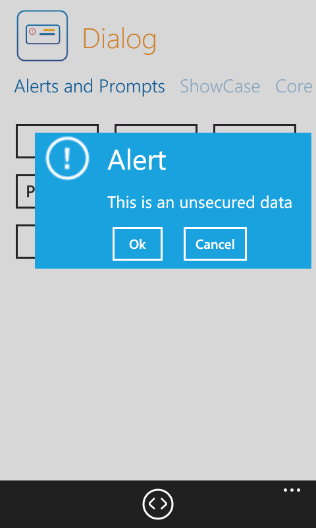
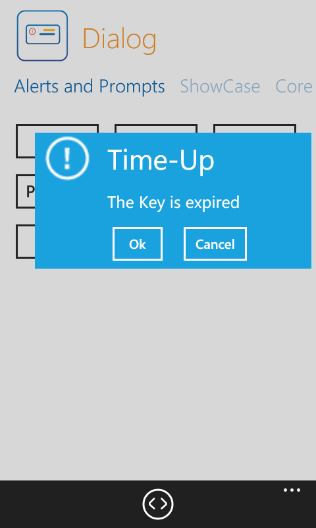
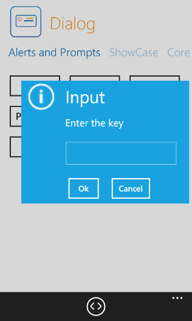
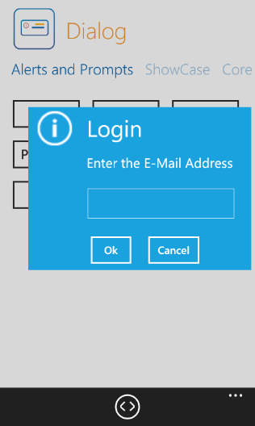
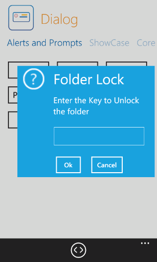

::: {style="DISPLAY: none"}
{#d2h_url_template}{#d2h_package_url style="WIDTH: 0px; DISPLAY: none; HEIGHT: 0px"}
:::

::: {.d2h_secondary_topic style="PADDING-BOTTOM: 10pt; MARGIN: 0pt; PADDING-LEFT: 0pt; PADDING-RIGHT: 0pt; PADDING-TOP: 0pt"}
##### Customizing the Predefined Dialog {#customizing-the-predefined-dialog style="tab-stops: 0pt"}

You can customise the template as required using the *ShowAlert* and the *ShowPrompt* method. 

 

###### 4.10.2.8.1.1        Alerts {#alerts style="tab-stops: 0pt"}

 

You can customize the alert message, title and the icon.

The following code illustrates how to customize the alert message:

 

+-----------------------------------------------------------------------------------------------------------------------------------------------------------------------+
| \[C#\]                                                                                                                                                                |
|                                                                                                                                                                       |
|                                                                                                                                                                       |
|                                                                                                                                                                       |
| [            [this]{style="COLOR: blue"}.dialog.ShowAlert([\"This is an unsecured data\"]{style="COLOR: #a31515"});]{style="FONT-FAMILY: Consolas; FONT-SIZE: 9.5pt"} |
|                                                                                                                                                                       |
| []{style="FONT-FAMILY: Consolas; FONT-SIZE: 9.5pt"}                                                                                                                   |
+-----------------------------------------------------------------------------------------------------------------------------------------------------------------------+

 

{border="0"}

Figure 95: Customised Alert Message

 

The following code illustrates how to customize title and message:

 

+------------------------------------------------------------------------------------------------------------------------------------------------------------------------------------------------------------------------------------+
| [\[C#\]]{style="FONT-STYLE: normal"}                                                                                                                                                                                               |
|                                                                                                                                                                                                                                    |
| [this]{style="FONT-FAMILY: Consolas; COLOR: blue; FONT-SIZE: 9.5pt"}[.dialog.ShowAlert([\"Time-Up\"]{style="COLOR: #a31515"}, [\"The Key is expired\"]{style="COLOR: #a31515"});]{style="FONT-FAMILY: Consolas; FONT-SIZE: 9.5pt"} |
|                                                                                                                                                                                                                                    |
| []{style="FONT-FAMILY: Consolas; FONT-SIZE: 9.5pt"}                                                                                                                                                                                |
+------------------------------------------------------------------------------------------------------------------------------------------------------------------------------------------------------------------------------------+

 

[{border="0"}]{style="FONT-FAMILY: Consolas; FONT-SIZE: 9.5pt"}

Figure 96: Customized Title and Message

 

The following code illustrates how to customize title, icon and message:

 

+---------------------------------------------------------------------------------------------------------------------------------------------------------------------------------------------------------------------------------------------------------+
| [\[C#\]]{style="FONT-STYLE: normal; FONT-SIZE: 14pt"}                                                                                                                                                                                                   |
|                                                                                                                                                                                                                                                         |
| [            [this]{style="COLOR: blue"}.dialog.ShowAlert([\"Warning \"]{style="COLOR: #a31515"}, [\"System under threat !\"]{style="COLOR: #a31515"}, [DialogIcon]{style="COLOR: #2b91af"}.Warning);]{style="FONT-FAMILY: Consolas; FONT-SIZE: 9.5pt"} |
|                                                                                                                                                                                                                                                         |
| []{style="FONT-FAMILY: Consolas; FONT-SIZE: 9.5pt"}                                                                                                                                                                                                     |
|                                                                                                                                                                                                                                                         |
| []{style="FONT-FAMILY: Consolas; FONT-SIZE: 9.5pt"}                                                                                                                                                                                                     |
+---------------------------------------------------------------------------------------------------------------------------------------------------------------------------------------------------------------------------------------------------------+

 

 

[{border="0"}]{style="FONT-FAMILY: Consolas; FONT-SIZE: 9.5pt"}

Figure 97: Customized Icon, Title and Message

###### 4.10.2.8.1.2        Prompt {#prompt style="tab-stops: 0pt"}

You can customize the message, title and icon.

The following code illustrates how to customize the message:

[]{style="FONT-FAMILY: Consolas; FONT-SIZE: 9.5pt"} 

+------------------------------------------------------------------------------------------------------------------------------------------------------------+
| [\[C#\]]{style="FONT-FAMILY: Consolas; FONT-SIZE: 9.5pt"}                                                                                                  |
|                                                                                                                                                            |
| [            [this]{style="COLOR: blue"}.dialog.ShowPrompt([\"Enter the key\"]{style="COLOR: #a31515"});]{style="FONT-FAMILY: Consolas; FONT-SIZE: 9.5pt"} |
|                                                                                                                                                            |
| []{style="FONT-FAMILY: Consolas; FONT-SIZE: 9.5pt"}                                                                                                        |
+------------------------------------------------------------------------------------------------------------------------------------------------------------+

[]{style="FONT-FAMILY: Consolas; FONT-SIZE: 9.5pt"} 

[{border="0"}]{style="FONT-FAMILY: Consolas; FONT-SIZE: 9.5pt"}

Figure 98: Customized Message

 

The following code illustrates how to customize the title and message:

 

+-----------------------------------------------------------------------------------------------------------------------------------------------------------------------------------------------------------------------------------------+
| [\[C#\]]{style="FONT-STYLE: normal"}                                                                                                                                                                                                    |
|                                                                                                                                                                                                                                         |
| [this]{style="FONT-FAMILY: Consolas; COLOR: blue; FONT-SIZE: 9.5pt"}[.dialog.ShowPrompt([\"Login\"]{style="COLOR: #a31515"}, [\"Enter the E-Mail Address\"]{style="COLOR: #a31515"});]{style="FONT-FAMILY: Consolas; FONT-SIZE: 9.5pt"} |
|                                                                                                                                                                                                                                         |
| []{style="FONT-FAMILY: Consolas; FONT-SIZE: 9.5pt"}                                                                                                                                                                                     |
|                                                                                                                                                                                                                                         |
| []{style="FONT-FAMILY: Consolas; FONT-SIZE: 9.5pt"}                                                                                                                                                                                     |
+-----------------------------------------------------------------------------------------------------------------------------------------------------------------------------------------------------------------------------------------+

 

[]{style="FONT-FAMILY: Consolas; FONT-SIZE: 9.5pt"} 

[{border="0"}]{style="FONT-FAMILY: Consolas; FONT-SIZE: 9.5pt"}

Figure 99: Customized Title and Message

[]{style="FONT-FAMILY: Consolas; FONT-SIZE: 9.5pt"} 

The following code illustrates how to customize the icon, title and the message:

[]{style="FONT-STYLE: normal"} 

+--------------------------------------------------------------------------------------------------------------------------------------------------------------------------------------------------------------------------------------------------------------------------------------------------------+
| [\[C#\]]{style="FONT-STYLE: normal"}                                                                                                                                                                                                                                                                   |
|                                                                                                                                                                                                                                                                                                        |
| [this]{style="FONT-FAMILY: Consolas; COLOR: blue; FONT-SIZE: 9.5pt"}[.dialog.ShowPrompt([\"Folder Lock\"]{style="COLOR: #a31515"}, [\"Enter the Key to Unlock the folder\"]{style="COLOR: #a31515"}, [DialogIcon]{style="COLOR: #2b91af"}.Question);]{style="FONT-FAMILY: Consolas; FONT-SIZE: 9.5pt"} |
|                                                                                                                                                                                                                                                                                                        |
| []{style="FONT-FAMILY: Consolas; FONT-SIZE: 9.5pt"}                                                                                                                                                                                                                                                    |
|                                                                                                                                                                                                                                                                                                        |
| []{style="FONT-FAMILY: Consolas; FONT-SIZE: 9.5pt"}                                                                                                                                                                                                                                                    |
+--------------------------------------------------------------------------------------------------------------------------------------------------------------------------------------------------------------------------------------------------------------------------------------------------------+

 

 

 

[{border="0"}]{style="FONT-FAMILY: Consolas; FONT-SIZE: 9.5pt"}

Figure 100: Customized Icon, Title and Message

[]{style="FONT-SIZE: 14pt"} 

[]{style="COLOR: #c00000"} 

[]{style="COLOR: #c00000"} 

[]{#related-topics}
:::
