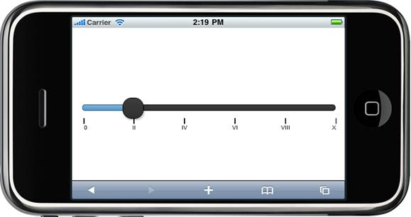

::: {style="DISPLAY: none"}
{#d2h_url_template} {#d2h_package_url style="WIDTH: 0px; DISPLAY: none; HEIGHT: 0px"}
:::

::: {.d2h_secondary_topic style="PADDING-BOTTOM: 10pt; MARGIN: 0pt; PADDING-LEFT: 0pt; PADDING-RIGHT: 0pt; PADDING-TOP: 0pt"}
#### Custom Label {#custom-label style="tab-stops: 0pt"}

 

This feature allows you to customize the label for the slider.

  -------------- --------------------------------------------- -------------------------- -------------------------- ----------------
  Name           Description                                   Type of property           Value it accepts           Dependency
  Custom Label   Used to customize the label.                  Action\<TickLabelAdder\>   Action\<TickLabelAdder\>   NA
  ShowLabel      Used to display the label for the tick mark   Bool                       True/false                 EnableTickMark
  -------------- --------------------------------------------- -------------------------- -------------------------- ----------------

 

Custom Label Sub-Properties

  ------------- -------------------------------------------------- ------------------ ------------------- ------------
  Name          Description                                        Type of property   Value it accepts    Dependency
  Text          Used to set the custom text for specific value.    String             Any String          NA
  Value         The Value used to set the custom text.             Int                0 to int MaxValue   NA
  ToolTipText   Used to set the ToolTip text for specific values   String             Any String          NA
  ------------- -------------------------------------------------- ------------------ ------------------- ------------

 

The following steps explain how to set the Custom Label for slider control through the builder:**

1.   In **View**, invoke the slider helper with the control ID as an argument followed by the **CustomLabel** method which contains the methods(**Text, Value and ToolTipText**)  to customize the slider label.

[]{style="FONT-FAMILY: Consolas; BACKGROUND: yellow; FONT-SIZE: 9.5pt"} 

[]{style="BACKGROUND: yellow"} 

+----------------------------------------------------------------------------------------------------------------------------------------------------------------------------------------------------------------------------+
| **[\[ASPX\]]{style="FONT-FAMILY: 'Courier New'"}**                                                                                                                                                                         |
|                                                                                                                                                                                                                            |
| [\<%]{style="FONT-FAMILY: 'Courier New'; BACKGROUND: yellow"} [=]{style="FONT-FAMILY: 'Courier New'; COLOR: blue"} [Html.MobSyncfusion().Slider([\"slider\"]{style="COLOR: #a31515"})]{style="FONT-FAMILY: 'Courier New'"} |
|                                                                                                                                                                                                                            |
| [         .Value(20)]{style="FONT-FAMILY: 'Courier New'"}                                                                                                                                                                  |
|                                                                                                                                                                                                                            |
| [                 **.CustomLabel(lable =\>**]{style="FONT-FAMILY: 'Courier New'"}                                                                                                                                          |
|                                                                                                                                                                                                                            |
| **[                 {]{style="FONT-FAMILY: 'Courier New'"}**                                                                                                                                                               |
|                                                                                                                                                                                                                            |
| **[                     lable.Add().Text([\"0\"]{style="COLOR: #a31515"}).Value(0);]{style="FONT-FAMILY: 'Courier New'"}**                                                                                                 |
|                                                                                                                                                                                                                            |
| **[                     lable.Add().Text([\"II\"]{style="COLOR: #a31515"}).Value(20);]{style="FONT-FAMILY: 'Courier New'"}**                                                                                               |
|                                                                                                                                                                                                                            |
| **[                     lable.Add().Text([\"IV\"]{style="COLOR: #a31515"}).Value(40);]{style="FONT-FAMILY: 'Courier New'"}**                                                                                               |
|                                                                                                                                                                                                                            |
| **[                     lable.Add().Text([\"VI\"]{style="COLOR: #a31515"}).Value(60);]{style="FONT-FAMILY: 'Courier New'"}**                                                                                               |
|                                                                                                                                                                                                                            |
| **[                     lable.Add().Text([\"VIII\"]{style="COLOR: #a31515"}).Value(80);]{style="FONT-FAMILY: 'Courier New'"}**                                                                                             |
|                                                                                                                                                                                                                            |
| **[                     lable.Add().Text([\"X\"]{style="COLOR: #a31515"}).Value(100);]{style="FONT-FAMILY: 'Courier New'"}**                                                                                               |
|                                                                                                                                                                                                                            |
| **[                 })]{style="FONT-FAMILY: 'Courier New'"}**                                                                                                                                                              |
|                                                                                                                                                                                                                            |
| [                 .EnableTickMark([true]{style="COLOR: blue"})]{style="FONT-FAMILY: 'Courier New'"}                                                                                                                        |
|                                                                                                                                                                                                                            |
| [                 **.ShowLabel([true]{style="COLOR: blue"})**]{style="FONT-FAMILY: 'Courier New'"}                                                                                                                         |
|                                                                                                                                                                                                                            |
| [    [%\>]{style="BACKGROUND: yellow"}]{style="FONT-FAMILY: 'Courier New'"}                                                                                                                                                |
+----------------------------------------------------------------------------------------------------------------------------------------------------------------------------------------------------------------------------+

[]{style="BACKGROUND: yellow"} 

+------------------------------------------------------------------------------------------------------------------------------------------------------------------------+
| []{style="FONT-FAMILY: 'Courier New'; BACKGROUND: yellow"}                                                                                                             |
|                                                                                                                                                                        |
| **[\[Razor\]]{style="FONT-FAMILY: 'Courier New'"}**                                                                                                                    |
|                                                                                                                                                                        |
| [\@{]{style="FONT-FAMILY: 'Courier New'; BACKGROUND: yellow"} [ Html.MobSyncfusion().Slider([\"slider\"]{style="COLOR: #a31515"})]{style="FONT-FAMILY: 'Courier New'"} |
|                                                                                                                                                                        |
| [.Value(20)]{style="FONT-FAMILY: 'Courier New'"}                                                                                                                       |
|                                                                                                                                                                        |
| [                 **.CustomLabel(lable =\>**]{style="FONT-FAMILY: 'Courier New'"}                                                                                      |
|                                                                                                                                                                        |
| **[                 {]{style="FONT-FAMILY: 'Courier New'"}**                                                                                                           |
|                                                                                                                                                                        |
| **[                     lable.Add().Text([\"0\"]{style="COLOR: #a31515"}).Value(0);]{style="FONT-FAMILY: 'Courier New'"}**                                             |
|                                                                                                                                                                        |
| **[                     lable.Add().Text([\"II\"]{style="COLOR: #a31515"}).Value(20);]{style="FONT-FAMILY: 'Courier New'"}**                                           |
|                                                                                                                                                                        |
| **[                     lable.Add().Text([\"IV\"]{style="COLOR: #a31515"}).Value(40);]{style="FONT-FAMILY: 'Courier New'"}**                                           |
|                                                                                                                                                                        |
| **[                     lable.Add().Text([\"VI\"]{style="COLOR: #a31515"}).Value(60);]{style="FONT-FAMILY: 'Courier New'"}**                                           |
|                                                                                                                                                                        |
| **[                     lable.Add().Text([\"VIII\"]{style="COLOR: #a31515"}).Value(80);]{style="FONT-FAMILY: 'Courier New'"}**                                         |
|                                                                                                                                                                        |
| **[                     lable.Add().Text([\"X\"]{style="COLOR: #a31515"}).Value(100);]{style="FONT-FAMILY: 'Courier New'"}**                                           |
|                                                                                                                                                                        |
| **[                 })]{style="FONT-FAMILY: 'Courier New'"}**                                                                                                          |
|                                                                                                                                                                        |
| [                 .EnableTickMark([true]{style="COLOR: blue"})]{style="FONT-FAMILY: 'Courier New'"}                                                                    |
|                                                                                                                                                                        |
| [                 **.ShowLabel([true]{style="COLOR: blue"})**]{style="FONT-FAMILY: 'Courier New'"}                                                                     |
|                                                                                                                                                                        |
| [    .Render();]{style="FONT-FAMILY: 'Courier New'"}                                                                                                                   |
|                                                                                                                                                                        |
| [    [}]{style="BACKGROUND: yellow"}]{style="FONT-FAMILY: 'Courier New'"}                                                                                              |
+------------------------------------------------------------------------------------------------------------------------------------------------------------------------+

[]{style="BACKGROUND: yellow"} 

2.   Build and run the application in the emulator.

*[[ []{style="TEXT-DECORATION: none"} ]{style="FONT-FAMILY: 'Calibri','sans-serif'"}]{.underline}*  

[ {border="0"} ]{style="LINE-HEIGHT: 115%; FONT-FAMILY: 'Calibri','sans-serif'; FONT-SIZE: 11pt"} []{style="LINE-HEIGHT: 115%; FONT-FAMILY: 'Calibri','sans-serif'; FONT-SIZE: 11pt"}

*[[ []{style="TEXT-DECORATION: none"} ]{style="FONT-FAMILY: 'Calibri','sans-serif'"}]{.underline}*  

[]{#related-topics}
:::
