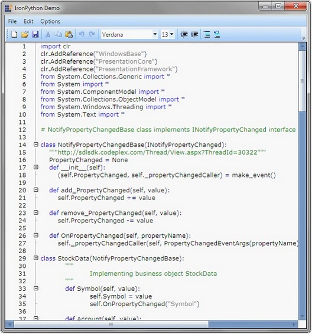

::: {style="DISPLAY: none"}
{#d2h_url_template}{#d2h_package_url style="WIDTH: 0px; DISPLAY: none; HEIGHT: 0px"}
:::

::::: {#nsbanner .d2h_main_nsbanner style="BORDER-BOTTOM: #999999 1px solid; POSITION: relative; PADDING-BOTTOM: 0px; BACKGROUND-COLOR: transparent; PADDING-LEFT: 0px; PADDING-RIGHT: 0px; DISPLAY: none; BORDER-TOP: #999999 1px solid; PADDING-TOP: 0px; LEFT: 0px"}
:::: {#TitleRow .d2h_main_titlerow style="PADDING-BOTTOM: 4px; BACKGROUND-COLOR: transparent; PADDING-LEFT: 22px; WIDTH: 100%; PADDING-RIGHT: 10px; DISPLAY: none; PADDING-TOP: 4px"}
::: {#ienav .d2h_main_ienav style="DISPLAY: none"}
{#D2HPrevious .D2HPreviousEnabled}  {#D2HNext .D2HNextEnabled}
:::
::::
:::::

:::::::::: {#nstext .d2h_main_nstext style="PADDING-BOTTOM: 10px; BACKGROUND-COLOR: transparent; PADDING-LEFT: 22px; PADDING-RIGHT: 10px; HEIGHT: 100%; OVERFLOW: auto; PADDING-TOP: 5px" hasuserbackground="true" valign="bottom"}
::: {#d2h_breadcrumbs .d2h_breadcrumbs}
[Essential Studio User Guide Documentation](ms-xhelp:///?Id=12457748-09e3-4d74-a240-8e049cedf030){.d2h_breadcrumbsNormal}[ \> ]{.d2h_breadcrumbsLinkSeparator}[User Interface Edition](ms-xhelp:///?Id=c29296b7-531c-413b-a0ec-488ca1f7f669){.d2h_breadcrumbsNormal}[ \> ]{.d2h_breadcrumbsLinkSeparator}[Essential WPF](ms-xhelp:///?Id=7f4f82c5-151c-4262-94d0-75c4626c77bc){.d2h_breadcrumbsNormal}[ \> ]{.d2h_breadcrumbsLinkSeparator}[Essential Edit]{.d2h_breadcrumbsContentsOnly}[ \> ]{.d2h_breadcrumbsLinkSeparator}[Concepts and Features](ms-xhelp:///?Id=f61feb80-1940-4b18-ab36-1ab89df8b52a){.d2h_breadcrumbsNormal}[ \> ]{.d2h_breadcrumbsLinkSeparator}[Language Support](ms-xhelp:///?Id=25124e73-46d4-4eee-a5bb-f3c15c93e5b4){.d2h_breadcrumbsNormal}
:::

###   Custom Language Support {#custom-language-support style="tab-stops: 0pt"}

**EditControl** provides built-in syntax highlighting and outlining support for common procedural languages such as **C#** and **Visual Basic**, markup languages like **XAML** and **XML**, and **SQL**. It also lets the developer to create custom language configurations to apply syntax highlighting and outlining.

[]{style="FONT-FAMILY: 'Trebuchet MS','sans-serif'; COLOR: #15428b; FONT-SIZE: 9pt"} 

**EditControl**'s custom language support will help the developers create code editors for custom languages by specifying their language configurations class and applying it as a custom language in **EditControl.**

**[]{style="FONT-FAMILY: 'Trebuchet MS','sans-serif'; COLOR: #15428b; FONT-SIZE: 9pt"}** 

Edit WPF provides the following classes to enable the users create their custom languages by inheriting from any of the base classes.

[]{style="FONT-FAMILY: 'Trebuchet MS','sans-serif'; COLOR: #15428b; FONT-SIZE: 9pt"} 

[·      ]{style="FONT-FAMILY: Symbol"}LanguageBase

[·      ]{style="FONT-FAMILY: Symbol"}ProceduralLanguageBase

[·      ]{style="FONT-FAMILY: Symbol"}MarkupLanguageBase

[]{style="FONT-FAMILY: 'Trebuchet MS','sans-serif'; COLOR: #15428b; FONT-SIZE: 9pt"} 

Each of these classes has basic level of implementations to let the users define minimum set of configurations to get started with the custom languages easily.

[]{style="FONT-FAMILY: 'Trebuchet MS','sans-serif'; COLOR: #15428b; FONT-SIZE: 9pt"} 

Important features

[]{style="FONT-FAMILY: 'Trebuchet MS','sans-serif'; COLOR: #15428b; FONT-SIZE: 9pt"} 

[·      ]{style="FONT-FAMILY: Symbol"}Lets the developer to choose the base class considering the complexity and type of language that developer is planning to create.

[·      ]{style="FONT-FAMILY: Symbol"}Provides much more flexibility to developers than before in writing their custom logics in syntax coloring and outlining.

[]{style="FONT-FAMILY: 'Trebuchet MS','sans-serif'; COLOR: #15428b; FONT-SIZE: 9pt"} 

Supports **databinding** of **Lexem** and formats by implementing their custom business classes with **ILexem** and **IFormat** **Interfaces.**

**[]{style="FONT-FAMILY: 'Times New Roman','serif'; COLOR: black; FONT-SIZE: 14pt"}** 

Customization of features

[]{style="FONT-FAMILY: 'Trebuchet MS','sans-serif'; COLOR: #15428b; FONT-SIZE: 9pt"} 

Language Base Classes

As described in earlier topics, Edit WPF provides three base classes for the developers to choose, in order to create their custom languages. Following are the level of implementations available in each of base classes.

[]{style="FONT-FAMILY: 'Trebuchet MS','sans-serif'; COLOR: #15428b; FONT-SIZE: 9pt"} 

**LanguageBase**---Contains implementation that are common for all the languages such as rendering lines, backspace and delete key operations, comment and uncomment commands and provides methods to override language specific functionalities such as syntax coloring, outlining and **IntelliSense**.

[]{style="FONT-FAMILY: 'Trebuchet MS','sans-serif'; COLOR: #15428b; FONT-SIZE: 9pt"} 

**ProceduralLanguageBase**---Contains implementations of syntax highlighting, outlining and **IntelliSense** for procedural languages such **C#** and **Visual Basic**.

[]{style="FONT-FAMILY: 'Trebuchet MS','sans-serif'; COLOR: #15428b; FONT-SIZE: 9pt"} 

**MarkupLanguageBase**---Contains implementation of Regex based syntax highlighting and outlining features specific to markup languages such as **XAML** and **XML.**

[]{style="FONT-FAMILY: 'Trebuchet MS','sans-serif'; COLOR: #15428b; FONT-SIZE: 9pt"} 

Creating a Custom Language

This section of the documentation discusses on creating a custom language configuration with **EditControl.** A language specification document for which custom language is being created will help the users in finding the details of languages such as keywords, literals, comments etc. In this section, a custom language for **IronPython** is created as an example.

[]{style="FONT-FAMILY: 'Trebuchet MS','sans-serif'; COLOR: #15428b; FONT-SIZE: 9pt"} 

Create a new class inheriting from **ProceduralLanguageBase** class and set basic properties of the language, by using the following code.

[]{style="FONT-FAMILY: 'Trebuchet MS','sans-serif'; COLOR: black; FONT-SIZE: 9pt"} 

+--------------------------------------------------------------------------------------------------------------------------------------------------------------------------------------------------------------------------+
| [public]{style="FONT-FAMILY: 'Courier New'; COLOR: blue"}[ [class]{style="COLOR: blue"} [PythonLanguage]{style="COLOR: #2b91af"} : [ProceduralLanguageBase]{style="COLOR: #2b91af"}]{style="FONT-FAMILY: 'Courier New'"} |
|                                                                                                                                                                                                                          |
| [    {]{style="FONT-FAMILY: 'Courier New'"}                                                                                                                                                                              |
|                                                                                                                                                                                                                          |
| [        [public]{style="COLOR: blue"} PythonLanguage([EditControl]{style="COLOR: #2b91af"} control)]{style="FONT-FAMILY: 'Courier New'"}                                                                                |
|                                                                                                                                                                                                                          |
| [            : [base]{style="COLOR: blue"}(control)]{style="FONT-FAMILY: 'Courier New'"}                                                                                                                                 |
|                                                                                                                                                                                                                          |
| [        {]{style="FONT-FAMILY: 'Courier New'"}                                                                                                                                                                          |
|                                                                                                                                                                                                                          |
| [            [this]{style="COLOR: blue"}.Name = [\"Python\"]{style="COLOR: #a31515"};]{style="FONT-FAMILY: 'Courier New'"}                                                                                               |
|                                                                                                                                                                                                                          |
| [            [this]{style="COLOR: blue"}.FileExtension = [\"py\"]{style="COLOR: #a31515"};]{style="FONT-FAMILY: 'Courier New'"}                                                                                          |
|                                                                                                                                                                                                                          |
| [            [this]{style="COLOR: blue"}.ApplyColoring = [true]{style="COLOR: blue"};]{style="FONT-FAMILY: 'Courier New'"}                                                                                               |
|                                                                                                                                                                                                                          |
| [            [this]{style="COLOR: blue"}.SupportsIntellisense = [false]{style="COLOR: blue"};]{style="FONT-FAMILY: 'Courier New'"}                                                                                       |
|                                                                                                                                                                                                                          |
| [            [this]{style="COLOR: blue"}.SupportsOutlining = [true]{style="COLOR: blue"};]{style="FONT-FAMILY: 'Courier New'"}                                                                                           |
|                                                                                                                                                                                                                          |
| [            [this]{style="COLOR: blue"}.TextForeground = [Brushes]{style="COLOR: #2b91af"}.Black;]{style="FONT-FAMILY: 'Courier New'"}                                                                                  |
|                                                                                                                                                                                                                          |
| [        }]{style="FONT-FAMILY: 'Courier New'"}                                                                                                                                                                          |
|                                                                                                                                                                                                                          |
| [    }]{style="FONT-FAMILY: 'Courier New'"}                                                                                                                                                                              |
+--------------------------------------------------------------------------------------------------------------------------------------------------------------------------------------------------------------------------+

[]{style="FONT-FAMILY: 'Trebuchet MS','sans-serif'; COLOR: black; FONT-SIZE: 9pt"} 

[]{style="FONT-FAMILY: 'Trebuchet MS','sans-serif'; COLOR: black; FONT-SIZE: 9pt"} 

Create **Lexem** and **Formats** collection for custom language, to enable data binding with **Lexem** and **Format** properties; we have modified the Lexem and Formats property type to **IEnumerable** from **LexemCollection** and **FormatCollection** respectively.

::: {style="BORDER-BOTTOM: windowtext 1pt solid; BORDER-LEFT: medium none; PADDING-BOTTOM: 1pt; MARGIN-TOP: 9pt; PADDING-LEFT: 0pt; PADDING-RIGHT: 0pt; MARGIN-BOTTOM: 9pt; BORDER-TOP: windowtext 1pt solid; BORDER-RIGHT: medium none; PADDING-TOP: 1pt"}
 

{border="0"}Note: In previous versions, Lexem and Formats were added directly to Lexems and Formats properties of EditLanguage class. Now since it is IEnumerable, a custom collection need to be created and apply it to Lexem and Format properties of custom language class, here it is PythonLanguage class.
:::

Formats for IronPython

Create a collection of **IFormat** implemented classes to apply in **Formats** property of custom language, by using the following code.

::: {style="BORDER-BOTTOM: windowtext 1pt solid; BORDER-LEFT: medium none; PADDING-BOTTOM: 1pt; MARGIN-TOP: 9pt; PADDING-LEFT: 0pt; PADDING-RIGHT: 0pt; MARGIN-BOTTOM: 9pt; BORDER-TOP: windowtext 1pt solid; BORDER-RIGHT: medium none; PADDING-TOP: 1pt"}
{border="0"}Note: EditControl uses this collection to fetch the color to be applied to the tokens.
:::

[]{style="FONT-FAMILY: 'Times New Roman','serif'; COLOR: black; FONT-SIZE: 14pt"} 

+------------------------------------------------------------------------------------------------------------------------------------------------------------------------------------------------------------------------------------------------------------------------------------------------------------------------------------------------------------------------------------------------------------------------------------------------------------------------------------------------------------------------------------------------------------------------------------------+
| [\<!\--Resources\--\>]{style="FONT-FAMILY: 'Courier New'; COLOR: green"}                                                                                                                                                                                                                                                                                                                                                                                                                                                                                                                 |
|                                                                                                                                                                                                                                                                                                                                                                                                                                                                                                                                                                                          |
| [\<]{style="FONT-FAMILY: 'Courier New'; COLOR: blue"}[syncfusion]{style="FONT-FAMILY: 'Courier New'; COLOR: #a31515"}[:]{style="FONT-FAMILY: 'Courier New'; COLOR: blue"}[FormatsCollection]{style="FONT-FAMILY: 'Courier New'; COLOR: #a31515"}[ x]{style="FONT-FAMILY: 'Courier New'; COLOR: red"}[:]{style="FONT-FAMILY: 'Courier New'; COLOR: blue"}[Key]{style="FONT-FAMILY: 'Courier New'; COLOR: red"}[=\"pythonLanguageFormats\"\>]{style="FONT-FAMILY: 'Courier New'; COLOR: blue"}                                                                                             |
|                                                                                                                                                                                                                                                                                                                                                                                                                                                                                                                                                                                          |
| [                ]{style="FONT-FAMILY: 'Courier New'; COLOR: #a31515"}[\<]{style="FONT-FAMILY: 'Courier New'; COLOR: blue"}[syncfusion]{style="FONT-FAMILY: 'Courier New'; COLOR: #a31515"}[:]{style="FONT-FAMILY: 'Courier New'; COLOR: blue"}[EditFormats]{style="FONT-FAMILY: 'Courier New'; COLOR: #a31515"}[ Foreground]{style="FONT-FAMILY: 'Courier New'; COLOR: red"}[=\"Green\"]{style="FONT-FAMILY: 'Courier New'; COLOR: blue"}[ FormatName]{style="FONT-FAMILY: 'Courier New'; COLOR: red"}[=\"CommentFormat\"/\>]{style="FONT-FAMILY: 'Courier New'; COLOR: blue"}          |
|                                                                                                                                                                                                                                                                                                                                                                                                                                                                                                                                                                                          |
| [                ]{style="FONT-FAMILY: 'Courier New'; COLOR: #a31515"}[\<]{style="FONT-FAMILY: 'Courier New'; COLOR: blue"}[syncfusion]{style="FONT-FAMILY: 'Courier New'; COLOR: #a31515"}[:]{style="FONT-FAMILY: 'Courier New'; COLOR: blue"}[EditFormats]{style="FONT-FAMILY: 'Courier New'; COLOR: #a31515"}[ Foreground]{style="FONT-FAMILY: 'Courier New'; COLOR: red"}[=\"Black\"]{style="FONT-FAMILY: 'Courier New'; COLOR: blue"}[ FormatName]{style="FONT-FAMILY: 'Courier New'; COLOR: red"}[=\"MultilineCommentFormat\"/\>]{style="FONT-FAMILY: 'Courier New'; COLOR: blue"} |
|                                                                                                                                                                                                                                                                                                                                                                                                                                                                                                                                                                                          |
| [                ]{style="FONT-FAMILY: 'Courier New'; COLOR: #a31515"}[\<]{style="FONT-FAMILY: 'Courier New'; COLOR: blue"}[syncfusion]{style="FONT-FAMILY: 'Courier New'; COLOR: #a31515"}[:]{style="FONT-FAMILY: 'Courier New'; COLOR: blue"}[EditFormats]{style="FONT-FAMILY: 'Courier New'; COLOR: #a31515"}[ Foreground]{style="FONT-FAMILY: 'Courier New'; COLOR: red"}[=\"Blue\"]{style="FONT-FAMILY: 'Courier New'; COLOR: blue"}[ FormatName]{style="FONT-FAMILY: 'Courier New'; COLOR: red"}[=\"KeywordFormat\"/\>]{style="FONT-FAMILY: 'Courier New'; COLOR: blue"}           |
|                                                                                                                                                                                                                                                                                                                                                                                                                                                                                                                                                                                          |
| [                ]{style="FONT-FAMILY: 'Courier New'; COLOR: #a31515"}[\<]{style="FONT-FAMILY: 'Courier New'; COLOR: blue"}[syncfusion]{style="FONT-FAMILY: 'Courier New'; COLOR: #a31515"}[:]{style="FONT-FAMILY: 'Courier New'; COLOR: blue"}[EditFormats]{style="FONT-FAMILY: 'Courier New'; COLOR: #a31515"}[ Foreground]{style="FONT-FAMILY: 'Courier New'; COLOR: red"}[=\"Navy\"]{style="FONT-FAMILY: 'Courier New'; COLOR: blue"}[ FormatName]{style="FONT-FAMILY: 'Courier New'; COLOR: red"}[=\"OperatorFormat\"/\>]{style="FONT-FAMILY: 'Courier New'; COLOR: blue"}          |
|                                                                                                                                                                                                                                                                                                                                                                                                                                                                                                                                                                                          |
| [                ]{style="FONT-FAMILY: 'Courier New'; COLOR: #a31515"}[\<]{style="FONT-FAMILY: 'Courier New'; COLOR: blue"}[syncfusion]{style="FONT-FAMILY: 'Courier New'; COLOR: #a31515"}[:]{style="FONT-FAMILY: 'Courier New'; COLOR: blue"}[EditFormats]{style="FONT-FAMILY: 'Courier New'; COLOR: #a31515"}[ Foreground]{style="FONT-FAMILY: 'Courier New'; COLOR: red"}[=\"Gray\"]{style="FONT-FAMILY: 'Courier New'; COLOR: blue"}[ FormatName]{style="FONT-FAMILY: 'Courier New'; COLOR: red"}[=\"LiteralsFormat\"/\>]{style="FONT-FAMILY: 'Courier New'; COLOR: blue"}          |
|                                                                                                                                                                                                                                                                                                                                                                                                                                                                                                                                                                                          |
| [            ]{style="FONT-FAMILY: 'Courier New'; COLOR: #a31515"}[\</]{style="FONT-FAMILY: 'Courier New'; COLOR: blue"}[syncfusion]{style="FONT-FAMILY: 'Courier New'; COLOR: #a31515"}[:]{style="FONT-FAMILY: 'Courier New'; COLOR: blue"}[FormatsCollection]{style="FONT-FAMILY: 'Courier New'; COLOR: #a31515"}[\>]{style="FONT-FAMILY: 'Courier New'; COLOR: blue"}                                                                                                                                                                                                                 |
+------------------------------------------------------------------------------------------------------------------------------------------------------------------------------------------------------------------------------------------------------------------------------------------------------------------------------------------------------------------------------------------------------------------------------------------------------------------------------------------------------------------------------------------------------------------------------------------+

[]{style="FONT-FAMILY: 'Trebuchet MS','sans-serif'; COLOR: green; FONT-SIZE: 9pt"} 

[]{style="FONT-FAMILY: 'Trebuchet MS','sans-serif'; COLOR: green; FONT-SIZE: 9pt"} 

Lexem for IronPython

Create a collection of **ILexem** implemented class, by using the following code.

::: {style="BORDER-BOTTOM: windowtext 1pt solid; BORDER-LEFT: medium none; PADDING-BOTTOM: 1pt; MARGIN-TOP: 9pt; PADDING-LEFT: 0pt; PADDING-RIGHT: 0pt; MARGIN-BOTTOM: 9pt; BORDER-TOP: windowtext 1pt solid; BORDER-RIGHT: medium none; PADDING-TOP: 1pt"}
{border="0"}Note: This collection will be applied to Lexem property of the custom language. EditControl uses the Lexem property to retrieve all keywords, comments, literals, preprocessors etc.
:::

[]{style="FONT-FAMILY: 'Trebuchet MS','sans-serif'; COLOR: #15428b; FONT-SIZE: 9pt"} 

+---------------------------------------------------------------------------------------------------------------------------------------------------------------------------------------------------------------------------------------------------------------------------------------------------------------------------------------------------------------------------------------------------------------------------------------------------------------------------------------------------------------------------------------------------------------------------------------------------------------------------------------------------------------------------------------------------------------------------------------------------------------------------------------------------------------------------------------------------------------------------------------------------------------------------------------+
| [          ]{style="FONT-FAMILY: 'Courier New'; COLOR: #a31515"}                                                                                                                                                                                                                                                                                                                                                                                                                                                                                                                                                                                                                                                                                                                                                                                                                                                                      |
|                                                                                                                                                                                                                                                                                                                                                                                                                                                                                                                                                                                                                                                                                                                                                                                                                                                                                                                                       |
| []{style="FONT-FAMILY: 'Courier New'; COLOR: #a31515"}                                                                                                                                                                                                                                                                                                                                                                                                                                                                                                                                                                                                                                                                                                                                                                                                                                                                                |
|                                                                                                                                                                                                                                                                                                                                                                                                                                                                                                                                                                                                                                                                                                                                                                                                                                                                                                                                       |
| [  ]{style="FONT-FAMILY: 'Courier New'; COLOR: #a31515"}[\<]{style="FONT-FAMILY: 'Courier New'; COLOR: blue"}[syncfusion]{style="FONT-FAMILY: 'Courier New'; COLOR: #a31515"}[:]{style="FONT-FAMILY: 'Courier New'; COLOR: blue"}[LexemCollection]{style="FONT-FAMILY: 'Courier New'; COLOR: #a31515"}[ x]{style="FONT-FAMILY: 'Courier New'; COLOR: red"}[:]{style="FONT-FAMILY: 'Courier New'; COLOR: blue"}[Key]{style="FONT-FAMILY: 'Courier New'; COLOR: red"}[=\"pythonLanguageLexems\"\>]{style="FONT-FAMILY: 'Courier New'; COLOR: blue"}                                                                                                                                                                                                                                                                                                                                                                                     |
|                                                                                                                                                                                                                                                                                                                                                                                                                                                                                                                                                                                                                                                                                                                                                                                                                                                                                                                                       |
| [                ]{style="FONT-FAMILY: 'Courier New'; COLOR: #a31515"}[\<]{style="FONT-FAMILY: 'Courier New'; COLOR: blue"}[syncfusion]{style="FONT-FAMILY: 'Courier New'; COLOR: #a31515"}[:]{style="FONT-FAMILY: 'Courier New'; COLOR: blue"}[Lexem]{style="FONT-FAMILY: 'Courier New'; COLOR: #a31515"}[ StartText]{style="FONT-FAMILY: 'Courier New'; COLOR: red"}[=\"class \\w+\[\\s:\\w,()\]+\"]{style="FONT-FAMILY: 'Courier New'; COLOR: blue"}[ IsRegex]{style="FONT-FAMILY: 'Courier New'; COLOR: red"}[=\"True\"]{style="FONT-FAMILY: 'Courier New'; COLOR: blue"}[ IsMultiline]{style="FONT-FAMILY: 'Courier New'; COLOR: red"}[=\"True\"]{style="FONT-FAMILY: 'Courier New'; COLOR: blue"}[ ]{style="FONT-FAMILY: 'Courier New'; COLOR: red"}                                                                                                                                                                            |
|                                                                                                                                                                                                                                                                                                                                                                                                                                                                                                                                                                                                                                                                                                                                                                                                                                                                                                                                       |
| [ContainsEndText]{style="FONT-FAMILY: 'Courier New'; COLOR: red"}[=\"True\"]{style="FONT-FAMILY: 'Courier New'; COLOR: blue"}[ LexemType]{style="FONT-FAMILY: 'Courier New'; COLOR: red"}[=\"CodeSnippet\"]{style="FONT-FAMILY: 'Courier New'; COLOR: blue"}[ EndText]{style="FONT-FAMILY: 'Courier New'; COLOR: red"}[=\"\\r\\n\"]{style="FONT-FAMILY: 'Courier New'; COLOR: blue"}[ ScopeLevel]{style="FONT-FAMILY: 'Courier New'; COLOR: red"}[=\"Class\"]{style="FONT-FAMILY: 'Courier New'; COLOR: blue"}[ ]{style="FONT-FAMILY: 'Courier New'; COLOR: red"}                                                                                                                                                                                                                                                                                                                                                                     |
|                                                                                                                                                                                                                                                                                                                                                                                                                                                                                                                                                                                                                                                                                                                                                                                                                                                                                                                                       |
| [ShowAlternateIntellisenseText]{style="FONT-FAMILY: 'Courier New'; COLOR: red"}[=\"True\"]{style="FONT-FAMILY: 'Courier New'; COLOR: blue"}[ ]{style="FONT-FAMILY: 'Courier New'; COLOR: #15428b"}[ IntellisenseDisplayText]{style="FONT-FAMILY: 'Courier New'; COLOR: red"}[=\"class\"/\>]{style="FONT-FAMILY: 'Courier New'; COLOR: blue"}                                                                                                                                                                                                                                                                                                                                                                                                                                                                                                                                                                                          |
|                                                                                                                                                                                                                                                                                                                                                                                                                                                                                                                                                                                                                                                                                                                                                                                                                                                                                                                                       |
| [                ]{style="FONT-FAMILY: 'Courier New'; COLOR: #a31515"}[\<]{style="FONT-FAMILY: 'Courier New'; COLOR: blue"}[syncfusion]{style="FONT-FAMILY: 'Courier New'; COLOR: #a31515"}[:]{style="FONT-FAMILY: 'Courier New'; COLOR: blue"}[Lexem]{style="FONT-FAMILY: 'Courier New'; COLOR: #a31515"}[ StartText]{style="FONT-FAMILY: 'Courier New'; COLOR: red"}[=\"def \\w+\[\\s:\\w,()\]+\"]{style="FONT-FAMILY: 'Courier New'; COLOR: blue"}[ IsRegex]{style="FONT-FAMILY: 'Courier New'; COLOR: red"}[=\"True\"]{style="FONT-FAMILY: 'Courier New'; COLOR: blue"}[ IsMultiline]{style="FONT-FAMILY: 'Courier New'; COLOR: red"}[=\"True\"]{style="FONT-FAMILY: 'Courier New'; COLOR: blue"}                                                                                                                                                                                                                                 |
|                                                                                                                                                                                                                                                                                                                                                                                                                                                                                                                                                                                                                                                                                                                                                                                                                                                                                                                                       |
| [ ContainsEndText]{style="FONT-FAMILY: 'Courier New'; COLOR: red"}[=\"True\"]{style="FONT-FAMILY: 'Courier New'; COLOR: blue"}[ LexemType]{style="FONT-FAMILY: 'Courier New'; COLOR: red"}[=\"CodeSnippet\"]{style="FONT-FAMILY: 'Courier New'; COLOR: blue"}[ EndText]{style="FONT-FAMILY: 'Courier New'; COLOR: red"}[=\"\\r\\n\"]{style="FONT-FAMILY: 'Courier New'; COLOR: blue"}[ ScopeLevel]{style="FONT-FAMILY: 'Courier New'; COLOR: red"}[=\"Member\"]{style="FONT-FAMILY: 'Courier New'; COLOR: blue"}[ ]{style="FONT-FAMILY: 'Courier New'; COLOR: red"}                                                                                                                                                                                                                                                                                                                                                                   |
|                                                                                                                                                                                                                                                                                                                                                                                                                                                                                                                                                                                                                                                                                                                                                                                                                                                                                                                                       |
| [ShowAlternateIntellisenseText]{style="FONT-FAMILY: 'Courier New'; COLOR: red"}[=\"True\"]{style="FONT-FAMILY: 'Courier New'; COLOR: blue"}[ ]{style="FONT-FAMILY: 'Courier New'; COLOR: #15428b"}[ IntellisenseDisplayText]{style="FONT-FAMILY: 'Courier New'; COLOR: red"}[=\"def\"/\>]{style="FONT-FAMILY: 'Courier New'; COLOR: blue"}                                                                                                                                                                                                                                                                                                                                                                                                                                                                                                                                                                                            |
|                                                                                                                                                                                                                                                                                                                                                                                                                                                                                                                                                                                                                                                                                                                                                                                                                                                                                                                                       |
| [                ]{style="FONT-FAMILY: 'Courier New'; COLOR: #a31515"}[\<]{style="FONT-FAMILY: 'Courier New'; COLOR: blue"}[syncfusion]{style="FONT-FAMILY: 'Courier New'; COLOR: #a31515"}[:]{style="FONT-FAMILY: 'Courier New'; COLOR: blue"}[Lexem]{style="FONT-FAMILY: 'Courier New'; COLOR: #a31515"}[ StartText]{style="FONT-FAMILY: 'Courier New'; COLOR: red"}[=\"#\"]{style="FONT-FAMILY: 'Courier New'; COLOR: blue"}[ EndText]{style="FONT-FAMILY: 'Courier New'; COLOR: red"}[=\"\\r\\n\"]{style="FONT-FAMILY: 'Courier New'; COLOR: blue"}[ IsMultiline]{style="FONT-FAMILY: 'Courier New'; COLOR: red"}[=\"False\"]{style="FONT-FAMILY: 'Courier New'; COLOR: blue"}[ ContainsEndText]{style="FONT-FAMILY: 'Courier New'; COLOR: red"}[=\"True\"]{style="FONT-FAMILY: 'Courier New'; COLOR: blue"}[ ]{style="FONT-FAMILY: 'Courier New'; COLOR: red"}                                                                   |
|                                                                                                                                                                                                                                                                                                                                                                                                                                                                                                                                                                                                                                                                                                                                                                                                                                                                                                                                       |
| [LexemType]{style="FONT-FAMILY: 'Courier New'; COLOR: red"}[=\"Comment\"]{style="FONT-FAMILY: 'Courier New'; COLOR: blue"}[ FormatName]{style="FONT-FAMILY: 'Courier New'; COLOR: red"}[=\"CommentFormat\"/\>]{style="FONT-FAMILY: 'Courier New'; COLOR: blue"}                                                                                                                                                                                                                                                                                                                                                                                                                                                                                                                                                                                                                                                                       |
|                                                                                                                                                                                                                                                                                                                                                                                                                                                                                                                                                                                                                                                                                                                                                                                                                                                                                                                                       |
| [                ]{style="FONT-FAMILY: 'Courier New'; COLOR: #a31515"}[\<]{style="FONT-FAMILY: 'Courier New'; COLOR: blue"}[syncfusion]{style="FONT-FAMILY: 'Courier New'; COLOR: #a31515"}[:]{style="FONT-FAMILY: 'Courier New'; COLOR: blue"}[Lexem]{style="FONT-FAMILY: 'Courier New'; COLOR: #a31515"}[ StartText]{style="FONT-FAMILY: 'Courier New'; COLOR: red"}[=\"&quot;&quot;&quot;\"]{style="FONT-FAMILY: 'Courier New'; COLOR: blue"}[ EndText]{style="FONT-FAMILY: 'Courier New'; COLOR: red"}[=\"&quot;&quot;&quot;\"]{style="FONT-FAMILY: 'Courier New'; COLOR: blue"}[ IsMultiline]{style="FONT-FAMILY: 'Courier New'; COLOR: red"}[=\"True\"]{style="FONT-FAMILY: 'Courier New'; COLOR: blue"}                                                                                                                                                                                                                        |
|                                                                                                                                                                                                                                                                                                                                                                                                                                                                                                                                                                                                                                                                                                                                                                                                                                                                                                                                       |
| [ ContainsEndText]{style="FONT-FAMILY: 'Courier New'; COLOR: red"}[=\"True\"]{style="FONT-FAMILY: 'Courier New'; COLOR: blue"}[ LexemType]{style="FONT-FAMILY: 'Courier New'; COLOR: red"}[=\"Comment\"]{style="FONT-FAMILY: 'Courier New'; COLOR: blue"}[ FormatName]{style="FONT-FAMILY: 'Courier New'; COLOR: red"}[=\"CommentFormat\" /\>]{style="FONT-FAMILY: 'Courier New'; COLOR: blue"}                                                                                                                                                                                                                                                                                                                                                                                                                                                                                                                                       |
|                                                                                                                                                                                                                                                                                                                                                                                                                                                                                                                                                                                                                                                                                                                                                                                                                                                                                                                                       |
| [                ]{style="FONT-FAMILY: 'Courier New'; COLOR: #a31515"}[\<]{style="FONT-FAMILY: 'Courier New'; COLOR: blue"}[syncfusion]{style="FONT-FAMILY: 'Courier New'; COLOR: #a31515"}[:]{style="FONT-FAMILY: 'Courier New'; COLOR: blue"}[Lexem]{style="FONT-FAMILY: 'Courier New'; COLOR: #a31515"}[ StartText]{style="FONT-FAMILY: 'Courier New'; COLOR: red"}[=\"and\"]{style="FONT-FAMILY: 'Courier New'; COLOR: blue"}[ ContainsEndText]{style="FONT-FAMILY: 'Courier New'; COLOR: red"}[=\"False\"]{style="FONT-FAMILY: 'Courier New'; COLOR: blue"}[ IsMultiline]{style="FONT-FAMILY: 'Courier New'; COLOR: red"}[=\"False\"]{style="FONT-FAMILY: 'Courier New'; COLOR: blue"}[ LexemType]{style="FONT-FAMILY: 'Courier New'; COLOR: red"}[=\"Keyword\"]{style="FONT-FAMILY: 'Courier New'; COLOR: blue"}[ ]{style="FONT-FAMILY: 'Courier New'; COLOR: #15428b"}                                                         |
|                                                                                                                                                                                                                                                                                                                                                                                                                                                                                                                                                                                                                                                                                                                                                                                                                                                                                                                                       |
| [ FormatName]{style="FONT-FAMILY: 'Courier New'; COLOR: red"}[=\"KeywordFormat\"/\>]{style="FONT-FAMILY: 'Courier New'; COLOR: blue"}                                                                                                                                                                                                                                                                                                                                                                                                                                                                                                                                                                                                                                                                                                                                                                                                 |
|                                                                                                                                                                                                                                                                                                                                                                                                                                                                                                                                                                                                                                                                                                                                                                                                                                                                                                                                       |
| [                ]{style="FONT-FAMILY: 'Courier New'; COLOR: #a31515"}[\<]{style="FONT-FAMILY: 'Courier New'; COLOR: blue"}[syncfusion]{style="FONT-FAMILY: 'Courier New'; COLOR: #a31515"}[:]{style="FONT-FAMILY: 'Courier New'; COLOR: blue"}[Lexem]{style="FONT-FAMILY: 'Courier New'; COLOR: #a31515"}[ StartText]{style="FONT-FAMILY: 'Courier New'; COLOR: red"}[=\"as\"]{style="FONT-FAMILY: 'Courier New'; COLOR: blue"}[ ContainsEndText]{style="FONT-FAMILY: 'Courier New'; COLOR: red"}[=\"False\"]{style="FONT-FAMILY: 'Courier New'; COLOR: blue"}[ IsMultiline]{style="FONT-FAMILY: 'Courier New'; COLOR: red"}[=\"False\"]{style="FONT-FAMILY: 'Courier New'; COLOR: blue"}[ LexemType]{style="FONT-FAMILY: 'Courier New'; COLOR: red"}[=\"Keyword\"]{style="FONT-FAMILY: 'Courier New'; COLOR: blue"}                                                                                                                 |
|                                                                                                                                                                                                                                                                                                                                                                                                                                                                                                                                                                                                                                                                                                                                                                                                                                                                                                                                       |
| [ ]{style="FONT-FAMILY: 'Courier New'; COLOR: #15428b"}[FormatName]{style="FONT-FAMILY: 'Courier New'; COLOR: red"}[=\"KeywordFormat\"/\>]{style="FONT-FAMILY: 'Courier New'; COLOR: blue"}                                                                                                                                                                                                                                                                                                                                                                                                                                                                                                                                                                                                                                                                                                                                           |
|                                                                                                                                                                                                                                                                                                                                                                                                                                                                                                                                                                                                                                                                                                                                                                                                                                                                                                                                       |
| [                ]{style="FONT-FAMILY: 'Courier New'; COLOR: #a31515"}[\<]{style="FONT-FAMILY: 'Courier New'; COLOR: blue"}[syncfusion]{style="FONT-FAMILY: 'Courier New'; COLOR: #a31515"}[:]{style="FONT-FAMILY: 'Courier New'; COLOR: blue"}[Lexem]{style="FONT-FAMILY: 'Courier New'; COLOR: #a31515"}[ StartText]{style="FONT-FAMILY: 'Courier New'; COLOR: red"}[=\"assert\"]{style="FONT-FAMILY: 'Courier New'; COLOR: blue"}[ ContainsEndText]{style="FONT-FAMILY: 'Courier New'; COLOR: red"}[=\"False\"]{style="FONT-FAMILY: 'Courier New'; COLOR: blue"}[ IsMultiline]{style="FONT-FAMILY: 'Courier New'; COLOR: red"}[=\"False\"]{style="FONT-FAMILY: 'Courier New'; COLOR: blue"}[ LexemType]{style="FONT-FAMILY: 'Courier New'; COLOR: red"}[=\"Keyword\"]{style="FONT-FAMILY: 'Courier New'; COLOR: blue"}[ ]{style="FONT-FAMILY: 'Courier New'; COLOR: #15428b"}[ ]{style="FONT-FAMILY: 'Courier New'; COLOR: red"}   |
|                                                                                                                                                                                                                                                                                                                                                                                                                                                                                                                                                                                                                                                                                                                                                                                                                                                                                                                                       |
| [FormatName]{style="FONT-FAMILY: 'Courier New'; COLOR: red"}[=\"KeywordFormat\"/\>]{style="FONT-FAMILY: 'Courier New'; COLOR: blue"}                                                                                                                                                                                                                                                                                                                                                                                                                                                                                                                                                                                                                                                                                                                                                                                                  |
|                                                                                                                                                                                                                                                                                                                                                                                                                                                                                                                                                                                                                                                                                                                                                                                                                                                                                                                                       |
| [                ]{style="FONT-FAMILY: 'Courier New'; COLOR: #a31515"}[\<]{style="FONT-FAMILY: 'Courier New'; COLOR: blue"}[syncfusion]{style="FONT-FAMILY: 'Courier New'; COLOR: #a31515"}[:]{style="FONT-FAMILY: 'Courier New'; COLOR: blue"}[Lexem]{style="FONT-FAMILY: 'Courier New'; COLOR: #a31515"}[ StartText]{style="FONT-FAMILY: 'Courier New'; COLOR: red"}[=\"break\"]{style="FONT-FAMILY: 'Courier New'; COLOR: blue"}[ ContainsEndText]{style="FONT-FAMILY: 'Courier New'; COLOR: red"}[=\"False\"]{style="FONT-FAMILY: 'Courier New'; COLOR: blue"}[ IsMultiline]{style="FONT-FAMILY: 'Courier New'; COLOR: red"}[=\"False\"]{style="FONT-FAMILY: 'Courier New'; COLOR: blue"}[ LexemType]{style="FONT-FAMILY: 'Courier New'; COLOR: red"}[=\"Keyword\"]{style="FONT-FAMILY: 'Courier New'; COLOR: blue"}[ ]{style="FONT-FAMILY: 'Courier New'; COLOR: #15428b"}[ ]{style="FONT-FAMILY: 'Courier New'; COLOR: red"}    |
|                                                                                                                                                                                                                                                                                                                                                                                                                                                                                                                                                                                                                                                                                                                                                                                                                                                                                                                                       |
| [FormatName]{style="FONT-FAMILY: 'Courier New'; COLOR: red"}[=\"KeywordFormat\"/\>]{style="FONT-FAMILY: 'Courier New'; COLOR: blue"}                                                                                                                                                                                                                                                                                                                                                                                                                                                                                                                                                                                                                                                                                                                                                                                                  |
|                                                                                                                                                                                                                                                                                                                                                                                                                                                                                                                                                                                                                                                                                                                                                                                                                                                                                                                                       |
| [                ]{style="FONT-FAMILY: 'Courier New'; COLOR: #a31515"}[\<]{style="FONT-FAMILY: 'Courier New'; COLOR: blue"}[syncfusion]{style="FONT-FAMILY: 'Courier New'; COLOR: #a31515"}[:]{style="FONT-FAMILY: 'Courier New'; COLOR: blue"}[Lexem]{style="FONT-FAMILY: 'Courier New'; COLOR: #a31515"}[ StartText]{style="FONT-FAMILY: 'Courier New'; COLOR: red"}[=\"class\"]{style="FONT-FAMILY: 'Courier New'; COLOR: blue"}[ ContainsEndText]{style="FONT-FAMILY: 'Courier New'; COLOR: red"}[=\"False\"]{style="FONT-FAMILY: 'Courier New'; COLOR: blue"}[ IsMultiline]{style="FONT-FAMILY: 'Courier New'; COLOR: red"}[=\"False\"]{style="FONT-FAMILY: 'Courier New'; COLOR: blue"}[ LexemType]{style="FONT-FAMILY: 'Courier New'; COLOR: red"}[=\"Keyword\"]{style="FONT-FAMILY: 'Courier New'; COLOR: blue"}[ ]{style="FONT-FAMILY: 'Courier New'; COLOR: #15428b"}[ ]{style="FONT-FAMILY: 'Courier New'; COLOR: red"}    |
|                                                                                                                                                                                                                                                                                                                                                                                                                                                                                                                                                                                                                                                                                                                                                                                                                                                                                                                                       |
| [FormatName]{style="FONT-FAMILY: 'Courier New'; COLOR: red"}[=\"KeywordFormat\"/\>]{style="FONT-FAMILY: 'Courier New'; COLOR: blue"}                                                                                                                                                                                                                                                                                                                                                                                                                                                                                                                                                                                                                                                                                                                                                                                                  |
|                                                                                                                                                                                                                                                                                                                                                                                                                                                                                                                                                                                                                                                                                                                                                                                                                                                                                                                                       |
| [                ]{style="FONT-FAMILY: 'Courier New'; COLOR: #a31515"}[\<]{style="FONT-FAMILY: 'Courier New'; COLOR: blue"}[syncfusion]{style="FONT-FAMILY: 'Courier New'; COLOR: #a31515"}[:]{style="FONT-FAMILY: 'Courier New'; COLOR: blue"}[Lexem]{style="FONT-FAMILY: 'Courier New'; COLOR: #a31515"}[ StartText]{style="FONT-FAMILY: 'Courier New'; COLOR: red"}[=\"continue\"]{style="FONT-FAMILY: 'Courier New'; COLOR: blue"}[ ContainsEndText]{style="FONT-FAMILY: 'Courier New'; COLOR: red"}[=\"False\"]{style="FONT-FAMILY: 'Courier New'; COLOR: blue"}[ IsMultiline]{style="FONT-FAMILY: 'Courier New'; COLOR: red"}[=\"False\"]{style="FONT-FAMILY: 'Courier New'; COLOR: blue"}[ LexemType]{style="FONT-FAMILY: 'Courier New'; COLOR: red"}[=\"Keyword\"]{style="FONT-FAMILY: 'Courier New'; COLOR: blue"}[ ]{style="FONT-FAMILY: 'Courier New'; COLOR: #15428b"}[ ]{style="FONT-FAMILY: 'Courier New'; COLOR: red"} |
|                                                                                                                                                                                                                                                                                                                                                                                                                                                                                                                                                                                                                                                                                                                                                                                                                                                                                                                                       |
| [FormatName]{style="FONT-FAMILY: 'Courier New'; COLOR: red"}[=\"KeywordFormat\"/\>]{style="FONT-FAMILY: 'Courier New'; COLOR: blue"}                                                                                                                                                                                                                                                                                                                                                                                                                                                                                                                                                                                                                                                                                                                                                                                                  |
|                                                                                                                                                                                                                                                                                                                                                                                                                                                                                                                                                                                                                                                                                                                                                                                                                                                                                                                                       |
| [                ]{style="FONT-FAMILY: 'Courier New'; COLOR: #a31515"}[\<]{style="FONT-FAMILY: 'Courier New'; COLOR: blue"}[syncfusion]{style="FONT-FAMILY: 'Courier New'; COLOR: #a31515"}[:]{style="FONT-FAMILY: 'Courier New'; COLOR: blue"}[Lexem]{style="FONT-FAMILY: 'Courier New'; COLOR: #a31515"}[ StartText]{style="FONT-FAMILY: 'Courier New'; COLOR: red"}[=\"def\"]{style="FONT-FAMILY: 'Courier New'; COLOR: blue"}[ ContainsEndText]{style="FONT-FAMILY: 'Courier New'; COLOR: red"}[=\"False\"]{style="FONT-FAMILY: 'Courier New'; COLOR: blue"}[ IsMultiline]{style="FONT-FAMILY: 'Courier New'; COLOR: red"}[=\"False\"]{style="FONT-FAMILY: 'Courier New'; COLOR: blue"}[ LexemType]{style="FONT-FAMILY: 'Courier New'; COLOR: red"}[=\"Keyword\"]{style="FONT-FAMILY: 'Courier New'; COLOR: blue"}[ ]{style="FONT-FAMILY: 'Courier New'; COLOR: #15428b"}[ ]{style="FONT-FAMILY: 'Courier New'; COLOR: red"}      |
|                                                                                                                                                                                                                                                                                                                                                                                                                                                                                                                                                                                                                                                                                                                                                                                                                                                                                                                                       |
| [FormatName]{style="FONT-FAMILY: 'Courier New'; COLOR: red"}[=\"KeywordFormat\"/\>]{style="FONT-FAMILY: 'Courier New'; COLOR: blue"}                                                                                                                                                                                                                                                                                                                                                                                                                                                                                                                                                                                                                                                                                                                                                                                                  |
|                                                                                                                                                                                                                                                                                                                                                                                                                                                                                                                                                                                                                                                                                                                                                                                                                                                                                                                                       |
| [                ]{style="FONT-FAMILY: 'Courier New'; COLOR: #a31515"}[\<]{style="FONT-FAMILY: 'Courier New'; COLOR: blue"}[syncfusion]{style="FONT-FAMILY: 'Courier New'; COLOR: #a31515"}[:]{style="FONT-FAMILY: 'Courier New'; COLOR: blue"}[Lexem]{style="FONT-FAMILY: 'Courier New'; COLOR: #a31515"}[ StartText]{style="FONT-FAMILY: 'Courier New'; COLOR: red"}[=\"del\"]{style="FONT-FAMILY: 'Courier New'; COLOR: blue"}[ ContainsEndText]{style="FONT-FAMILY: 'Courier New'; COLOR: red"}[=\"False\"]{style="FONT-FAMILY: 'Courier New'; COLOR: blue"}[ IsMultiline]{style="FONT-FAMILY: 'Courier New'; COLOR: red"}[=\"False\"]{style="FONT-FAMILY: 'Courier New'; COLOR: blue"}[ LexemType]{style="FONT-FAMILY: 'Courier New'; COLOR: red"}[=\"Keyword\"]{style="FONT-FAMILY: 'Courier New'; COLOR: blue"}[ ]{style="FONT-FAMILY: 'Courier New'; COLOR: #15428b"}[ ]{style="FONT-FAMILY: 'Courier New'; COLOR: red"}      |
|                                                                                                                                                                                                                                                                                                                                                                                                                                                                                                                                                                                                                                                                                                                                                                                                                                                                                                                                       |
| [FormatName]{style="FONT-FAMILY: 'Courier New'; COLOR: red"}[=\"KeywordFormat\"/\>]{style="FONT-FAMILY: 'Courier New'; COLOR: blue"}                                                                                                                                                                                                                                                                                                                                                                                                                                                                                                                                                                                                                                                                                                                                                                                                  |
|                                                                                                                                                                                                                                                                                                                                                                                                                                                                                                                                                                                                                                                                                                                                                                                                                                                                                                                                       |
| [                ]{style="FONT-FAMILY: 'Courier New'; COLOR: #a31515"}[\<]{style="FONT-FAMILY: 'Courier New'; COLOR: blue"}[syncfusion]{style="FONT-FAMILY: 'Courier New'; COLOR: #a31515"}[:]{style="FONT-FAMILY: 'Courier New'; COLOR: blue"}[Lexem]{style="FONT-FAMILY: 'Courier New'; COLOR: #a31515"}[ StartText]{style="FONT-FAMILY: 'Courier New'; COLOR: red"}[=\"elif\"]{style="FONT-FAMILY: 'Courier New'; COLOR: blue"}[ ContainsEndText]{style="FONT-FAMILY: 'Courier New'; COLOR: red"}[=\"False\"]{style="FONT-FAMILY: 'Courier New'; COLOR: blue"}[ IsMultiline]{style="FONT-FAMILY: 'Courier New'; COLOR: red"}[=\"False\"]{style="FONT-FAMILY: 'Courier New'; COLOR: blue"}[ LexemType]{style="FONT-FAMILY: 'Courier New'; COLOR: red"}[=\"Keyword\"]{style="FONT-FAMILY: 'Courier New'; COLOR: blue"}[ ]{style="FONT-FAMILY: 'Courier New'; COLOR: #15428b"}[ ]{style="FONT-FAMILY: 'Courier New'; COLOR: red"}     |
|                                                                                                                                                                                                                                                                                                                                                                                                                                                                                                                                                                                                                                                                                                                                                                                                                                                                                                                                       |
| [FormatName]{style="FONT-FAMILY: 'Courier New'; COLOR: red"}[=\"KeywordFormat\"/\>]{style="FONT-FAMILY: 'Courier New'; COLOR: blue"}                                                                                                                                                                                                                                                                                                                                                                                                                                                                                                                                                                                                                                                                                                                                                                                                  |
|                                                                                                                                                                                                                                                                                                                                                                                                                                                                                                                                                                                                                                                                                                                                                                                                                                                                                                                                       |
| [                ]{style="FONT-FAMILY: 'Courier New'; COLOR: #a31515"}[\<]{style="FONT-FAMILY: 'Courier New'; COLOR: blue"}[syncfusion]{style="FONT-FAMILY: 'Courier New'; COLOR: #a31515"}[:]{style="FONT-FAMILY: 'Courier New'; COLOR: blue"}[Lexem]{style="FONT-FAMILY: 'Courier New'; COLOR: #a31515"}[ StartText]{style="FONT-FAMILY: 'Courier New'; COLOR: red"}[=\"else\"]{style="FONT-FAMILY: 'Courier New'; COLOR: blue"}[ ContainsEndText]{style="FONT-FAMILY: 'Courier New'; COLOR: red"}[=\"False\"]{style="FONT-FAMILY: 'Courier New'; COLOR: blue"}[ IsMultiline]{style="FONT-FAMILY: 'Courier New'; COLOR: red"}[=\"False\"]{style="FONT-FAMILY: 'Courier New'; COLOR: blue"}[ LexemType]{style="FONT-FAMILY: 'Courier New'; COLOR: red"}[=\"Keyword\"]{style="FONT-FAMILY: 'Courier New'; COLOR: blue"}[ ]{style="FONT-FAMILY: 'Courier New'; COLOR: #15428b"}[ ]{style="FONT-FAMILY: 'Courier New'; COLOR: red"}     |
|                                                                                                                                                                                                                                                                                                                                                                                                                                                                                                                                                                                                                                                                                                                                                                                                                                                                                                                                       |
| [FormatName]{style="FONT-FAMILY: 'Courier New'; COLOR: red"}[=\"KeywordFormat\"/\>]{style="FONT-FAMILY: 'Courier New'; COLOR: blue"}                                                                                                                                                                                                                                                                                                                                                                                                                                                                                                                                                                                                                                                                                                                                                                                                  |
|                                                                                                                                                                                                                                                                                                                                                                                                                                                                                                                                                                                                                                                                                                                                                                                                                                                                                                                                       |
| [                ]{style="FONT-FAMILY: 'Courier New'; COLOR: #a31515"}[\<]{style="FONT-FAMILY: 'Courier New'; COLOR: blue"}[syncfusion]{style="FONT-FAMILY: 'Courier New'; COLOR: #a31515"}[:]{style="FONT-FAMILY: 'Courier New'; COLOR: blue"}[Lexem]{style="FONT-FAMILY: 'Courier New'; COLOR: #a31515"}[ StartText]{style="FONT-FAMILY: 'Courier New'; COLOR: red"}[=\"except\"]{style="FONT-FAMILY: 'Courier New'; COLOR: blue"}[ ContainsEndText]{style="FONT-FAMILY: 'Courier New'; COLOR: red"}[=\"False\"]{style="FONT-FAMILY: 'Courier New'; COLOR: blue"}[ IsMultiline]{style="FONT-FAMILY: 'Courier New'; COLOR: red"}[=\"False\"]{style="FONT-FAMILY: 'Courier New'; COLOR: blue"}[ LexemType]{style="FONT-FAMILY: 'Courier New'; COLOR: red"}[=\"Keyword\"]{style="FONT-FAMILY: 'Courier New'; COLOR: blue"}[ ]{style="FONT-FAMILY: 'Courier New'; COLOR: #15428b"}[ ]{style="FONT-FAMILY: 'Courier New'; COLOR: red"}   |
|                                                                                                                                                                                                                                                                                                                                                                                                                                                                                                                                                                                                                                                                                                                                                                                                                                                                                                                                       |
| [FormatName]{style="FONT-FAMILY: 'Courier New'; COLOR: red"}[=\"KeywordFormat\"/\>]{style="FONT-FAMILY: 'Courier New'; COLOR: blue"}                                                                                                                                                                                                                                                                                                                                                                                                                                                                                                                                                                                                                                                                                                                                                                                                  |
|                                                                                                                                                                                                                                                                                                                                                                                                                                                                                                                                                                                                                                                                                                                                                                                                                                                                                                                                       |
| [                ]{style="FONT-FAMILY: 'Courier New'; COLOR: #a31515"}[\<]{style="FONT-FAMILY: 'Courier New'; COLOR: blue"}[syncfusion]{style="FONT-FAMILY: 'Courier New'; COLOR: #a31515"}[:]{style="FONT-FAMILY: 'Courier New'; COLOR: blue"}[Lexem]{style="FONT-FAMILY: 'Courier New'; COLOR: #a31515"}[ StartText]{style="FONT-FAMILY: 'Courier New'; COLOR: red"}[=\"exec\"]{style="FONT-FAMILY: 'Courier New'; COLOR: blue"}[ ContainsEndText]{style="FONT-FAMILY: 'Courier New'; COLOR: red"}[=\"False\"]{style="FONT-FAMILY: 'Courier New'; COLOR: blue"}[ IsMultiline]{style="FONT-FAMILY: 'Courier New'; COLOR: red"}[=\"False\"]{style="FONT-FAMILY: 'Courier New'; COLOR: blue"}[ LexemType]{style="FONT-FAMILY: 'Courier New'; COLOR: red"}[=\"Keyword\"]{style="FONT-FAMILY: 'Courier New'; COLOR: blue"}[ ]{style="FONT-FAMILY: 'Courier New'; COLOR: #15428b"}[ ]{style="FONT-FAMILY: 'Courier New'; COLOR: red"}     |
|                                                                                                                                                                                                                                                                                                                                                                                                                                                                                                                                                                                                                                                                                                                                                                                                                                                                                                                                       |
| [FormatName]{style="FONT-FAMILY: 'Courier New'; COLOR: red"}[=\"KeywordFormat\"/\>]{style="FONT-FAMILY: 'Courier New'; COLOR: blue"}                                                                                                                                                                                                                                                                                                                                                                                                                                                                                                                                                                                                                                                                                                                                                                                                  |
|                                                                                                                                                                                                                                                                                                                                                                                                                                                                                                                                                                                                                                                                                                                                                                                                                                                                                                                                       |
| [                ]{style="FONT-FAMILY: 'Courier New'; COLOR: #a31515"}[\<]{style="FONT-FAMILY: 'Courier New'; COLOR: blue"}[syncfusion]{style="FONT-FAMILY: 'Courier New'; COLOR: #a31515"}[:]{style="FONT-FAMILY: 'Courier New'; COLOR: blue"}[Lexem]{style="FONT-FAMILY: 'Courier New'; COLOR: #a31515"}[ StartText]{style="FONT-FAMILY: 'Courier New'; COLOR: red"}[=\"finally\"]{style="FONT-FAMILY: 'Courier New'; COLOR: blue"}[ ContainsEndText]{style="FONT-FAMILY: 'Courier New'; COLOR: red"}[=\"False\"]{style="FONT-FAMILY: 'Courier New'; COLOR: blue"}[ IsMultiline]{style="FONT-FAMILY: 'Courier New'; COLOR: red"}[=\"False\"]{style="FONT-FAMILY: 'Courier New'; COLOR: blue"}[ LexemType]{style="FONT-FAMILY: 'Courier New'; COLOR: red"}[=\"Keyword\"]{style="FONT-FAMILY: 'Courier New'; COLOR: blue"}[ ]{style="FONT-FAMILY: 'Courier New'; COLOR: #15428b"}[ ]{style="FONT-FAMILY: 'Courier New'; COLOR: red"}  |
|                                                                                                                                                                                                                                                                                                                                                                                                                                                                                                                                                                                                                                                                                                                                                                                                                                                                                                                                       |
| [FormatName]{style="FONT-FAMILY: 'Courier New'; COLOR: red"}[=\"KeywordFormat\"/\>]{style="FONT-FAMILY: 'Courier New'; COLOR: blue"}                                                                                                                                                                                                                                                                                                                                                                                                                                                                                                                                                                                                                                                                                                                                                                                                  |
|                                                                                                                                                                                                                                                                                                                                                                                                                                                                                                                                                                                                                                                                                                                                                                                                                                                                                                                                       |
| [                ]{style="FONT-FAMILY: 'Courier New'; COLOR: #a31515"}[\<]{style="FONT-FAMILY: 'Courier New'; COLOR: blue"}[syncfusion]{style="FONT-FAMILY: 'Courier New'; COLOR: #a31515"}[:]{style="FONT-FAMILY: 'Courier New'; COLOR: blue"}[Lexem]{style="FONT-FAMILY: 'Courier New'; COLOR: #a31515"}[ StartText]{style="FONT-FAMILY: 'Courier New'; COLOR: red"}[=\"for\"]{style="FONT-FAMILY: 'Courier New'; COLOR: blue"}[ ContainsEndText]{style="FONT-FAMILY: 'Courier New'; COLOR: red"}[=\"False\"]{style="FONT-FAMILY: 'Courier New'; COLOR: blue"}[ IsMultiline]{style="FONT-FAMILY: 'Courier New'; COLOR: red"}[=\"False\"]{style="FONT-FAMILY: 'Courier New'; COLOR: blue"}[ LexemType]{style="FONT-FAMILY: 'Courier New'; COLOR: red"}[=\"Keyword\"]{style="FONT-FAMILY: 'Courier New'; COLOR: blue"}[ ]{style="FONT-FAMILY: 'Courier New'; COLOR: #15428b"}[ ]{style="FONT-FAMILY: 'Courier New'; COLOR: red"}      |
|                                                                                                                                                                                                                                                                                                                                                                                                                                                                                                                                                                                                                                                                                                                                                                                                                                                                                                                                       |
| [FormatName]{style="FONT-FAMILY: 'Courier New'; COLOR: red"}[=\"KeywordFormat\"/\>]{style="FONT-FAMILY: 'Courier New'; COLOR: blue"}                                                                                                                                                                                                                                                                                                                                                                                                                                                                                                                                                                                                                                                                                                                                                                                                  |
|                                                                                                                                                                                                                                                                                                                                                                                                                                                                                                                                                                                                                                                                                                                                                                                                                                                                                                                                       |
| [                ]{style="FONT-FAMILY: 'Courier New'; COLOR: #a31515"}[\<]{style="FONT-FAMILY: 'Courier New'; COLOR: blue"}[syncfusion]{style="FONT-FAMILY: 'Courier New'; COLOR: #a31515"}[:]{style="FONT-FAMILY: 'Courier New'; COLOR: blue"}[Lexem]{style="FONT-FAMILY: 'Courier New'; COLOR: #a31515"}[ StartText]{style="FONT-FAMILY: 'Courier New'; COLOR: red"}[=\"from\"]{style="FONT-FAMILY: 'Courier New'; COLOR: blue"}[ ContainsEndText]{style="FONT-FAMILY: 'Courier New'; COLOR: red"}[=\"False\"]{style="FONT-FAMILY: 'Courier New'; COLOR: blue"}[ IsMultiline]{style="FONT-FAMILY: 'Courier New'; COLOR: red"}[=\"False\"]{style="FONT-FAMILY: 'Courier New'; COLOR: blue"}[ LexemType]{style="FONT-FAMILY: 'Courier New'; COLOR: red"}[=\"Keyword\"]{style="FONT-FAMILY: 'Courier New'; COLOR: blue"}[ ]{style="FONT-FAMILY: 'Courier New'; COLOR: #15428b"}[ ]{style="FONT-FAMILY: 'Courier New'; COLOR: red"}     |
|                                                                                                                                                                                                                                                                                                                                                                                                                                                                                                                                                                                                                                                                                                                                                                                                                                                                                                                                       |
| [FormatName]{style="FONT-FAMILY: 'Courier New'; COLOR: red"}[=\"KeywordFormat\"/\>]{style="FONT-FAMILY: 'Courier New'; COLOR: blue"}                                                                                                                                                                                                                                                                                                                                                                                                                                                                                                                                                                                                                                                                                                                                                                                                  |
|                                                                                                                                                                                                                                                                                                                                                                                                                                                                                                                                                                                                                                                                                                                                                                                                                                                                                                                                       |
| [                ]{style="FONT-FAMILY: 'Courier New'; COLOR: #a31515"}[\<]{style="FONT-FAMILY: 'Courier New'; COLOR: blue"}[syncfusion]{style="FONT-FAMILY: 'Courier New'; COLOR: #a31515"}[:]{style="FONT-FAMILY: 'Courier New'; COLOR: blue"}[Lexem]{style="FONT-FAMILY: 'Courier New'; COLOR: #a31515"}[ StartText]{style="FONT-FAMILY: 'Courier New'; COLOR: red"}[=\"global\"]{style="FONT-FAMILY: 'Courier New'; COLOR: blue"}[ ContainsEndText]{style="FONT-FAMILY: 'Courier New'; COLOR: red"}[=\"False\"]{style="FONT-FAMILY: 'Courier New'; COLOR: blue"}[ IsMultiline]{style="FONT-FAMILY: 'Courier New'; COLOR: red"}[=\"False\"]{style="FONT-FAMILY: 'Courier New'; COLOR: blue"}[ LexemType]{style="FONT-FAMILY: 'Courier New'; COLOR: red"}[=\"Keyword\"]{style="FONT-FAMILY: 'Courier New'; COLOR: blue"}[ ]{style="FONT-FAMILY: 'Courier New'; COLOR: #15428b"}[ ]{style="FONT-FAMILY: 'Courier New'; COLOR: red"}   |
|                                                                                                                                                                                                                                                                                                                                                                                                                                                                                                                                                                                                                                                                                                                                                                                                                                                                                                                                       |
| [FormatName]{style="FONT-FAMILY: 'Courier New'; COLOR: red"}[=\"KeywordFormat\"/\>]{style="FONT-FAMILY: 'Courier New'; COLOR: blue"}                                                                                                                                                                                                                                                                                                                                                                                                                                                                                                                                                                                                                                                                                                                                                                                                  |
|                                                                                                                                                                                                                                                                                                                                                                                                                                                                                                                                                                                                                                                                                                                                                                                                                                                                                                                                       |
| [                ]{style="FONT-FAMILY: 'Courier New'; COLOR: #a31515"}[\<]{style="FONT-FAMILY: 'Courier New'; COLOR: blue"}[syncfusion]{style="FONT-FAMILY: 'Courier New'; COLOR: #a31515"}[:]{style="FONT-FAMILY: 'Courier New'; COLOR: blue"}[Lexem]{style="FONT-FAMILY: 'Courier New'; COLOR: #a31515"}[ StartText]{style="FONT-FAMILY: 'Courier New'; COLOR: red"}[=\"if\"]{style="FONT-FAMILY: 'Courier New'; COLOR: blue"}[ ContainsEndText]{style="FONT-FAMILY: 'Courier New'; COLOR: red"}[=\"False\"]{style="FONT-FAMILY: 'Courier New'; COLOR: blue"}[ IsMultiline]{style="FONT-FAMILY: 'Courier New'; COLOR: red"}[=\"False\"]{style="FONT-FAMILY: 'Courier New'; COLOR: blue"}[ LexemType]{style="FONT-FAMILY: 'Courier New'; COLOR: red"}[=\"Keyword\"]{style="FONT-FAMILY: 'Courier New'; COLOR: blue"}[ ]{style="FONT-FAMILY: 'Courier New'; COLOR: #15428b"}[ ]{style="FONT-FAMILY: 'Courier New'; COLOR: red"}       |
|                                                                                                                                                                                                                                                                                                                                                                                                                                                                                                                                                                                                                                                                                                                                                                                                                                                                                                                                       |
| [FormatName]{style="FONT-FAMILY: 'Courier New'; COLOR: red"}[=\"KeywordFormat\"/\>]{style="FONT-FAMILY: 'Courier New'; COLOR: blue"}                                                                                                                                                                                                                                                                                                                                                                                                                                                                                                                                                                                                                                                                                                                                                                                                  |
|                                                                                                                                                                                                                                                                                                                                                                                                                                                                                                                                                                                                                                                                                                                                                                                                                                                                                                                                       |
| [                ]{style="FONT-FAMILY: 'Courier New'; COLOR: #a31515"}[\<]{style="FONT-FAMILY: 'Courier New'; COLOR: blue"}[syncfusion]{style="FONT-FAMILY: 'Courier New'; COLOR: #a31515"}[:]{style="FONT-FAMILY: 'Courier New'; COLOR: blue"}[Lexem]{style="FONT-FAMILY: 'Courier New'; COLOR: #a31515"}[ StartText]{style="FONT-FAMILY: 'Courier New'; COLOR: red"}[=\"import\"]{style="FONT-FAMILY: 'Courier New'; COLOR: blue"}[ ContainsEndText]{style="FONT-FAMILY: 'Courier New'; COLOR: red"}[=\"False\"]{style="FONT-FAMILY: 'Courier New'; COLOR: blue"}[ IsMultiline]{style="FONT-FAMILY: 'Courier New'; COLOR: red"}[=\"False\"]{style="FONT-FAMILY: 'Courier New'; COLOR: blue"}[ LexemType]{style="FONT-FAMILY: 'Courier New'; COLOR: red"}[=\"Keyword\"]{style="FONT-FAMILY: 'Courier New'; COLOR: blue"}[ ]{style="FONT-FAMILY: 'Courier New'; COLOR: #15428b"}[ ]{style="FONT-FAMILY: 'Courier New'; COLOR: red"}   |
|                                                                                                                                                                                                                                                                                                                                                                                                                                                                                                                                                                                                                                                                                                                                                                                                                                                                                                                                       |
| [FormatName]{style="FONT-FAMILY: 'Courier New'; COLOR: red"}[=\"KeywordFormat\"/\>]{style="FONT-FAMILY: 'Courier New'; COLOR: blue"}                                                                                                                                                                                                                                                                                                                                                                                                                                                                                                                                                                                                                                                                                                                                                                                                  |
|                                                                                                                                                                                                                                                                                                                                                                                                                                                                                                                                                                                                                                                                                                                                                                                                                                                                                                                                       |
| [                ]{style="FONT-FAMILY: 'Courier New'; COLOR: #a31515"}[\<]{style="FONT-FAMILY: 'Courier New'; COLOR: blue"}[syncfusion]{style="FONT-FAMILY: 'Courier New'; COLOR: #a31515"}[:]{style="FONT-FAMILY: 'Courier New'; COLOR: blue"}[Lexem]{style="FONT-FAMILY: 'Courier New'; COLOR: #a31515"}[ StartText]{style="FONT-FAMILY: 'Courier New'; COLOR: red"}[=\"in\"]{style="FONT-FAMILY: 'Courier New'; COLOR: blue"}[ ContainsEndText]{style="FONT-FAMILY: 'Courier New'; COLOR: red"}[=\"False\"]{style="FONT-FAMILY: 'Courier New'; COLOR: blue"}[ IsMultiline]{style="FONT-FAMILY: 'Courier New'; COLOR: red"}[=\"False\"]{style="FONT-FAMILY: 'Courier New'; COLOR: blue"}[ LexemType]{style="FONT-FAMILY: 'Courier New'; COLOR: red"}[=\"Keyword\"]{style="FONT-FAMILY: 'Courier New'; COLOR: blue"}[ ]{style="FONT-FAMILY: 'Courier New'; COLOR: #15428b"}[ ]{style="FONT-FAMILY: 'Courier New'; COLOR: red"}       |
|                                                                                                                                                                                                                                                                                                                                                                                                                                                                                                                                                                                                                                                                                                                                                                                                                                                                                                                                       |
| [FormatName]{style="FONT-FAMILY: 'Courier New'; COLOR: red"}[=\"KeywordFormat\"/\>]{style="FONT-FAMILY: 'Courier New'; COLOR: blue"}                                                                                                                                                                                                                                                                                                                                                                                                                                                                                                                                                                                                                                                                                                                                                                                                  |
|                                                                                                                                                                                                                                                                                                                                                                                                                                                                                                                                                                                                                                                                                                                                                                                                                                                                                                                                       |
| [                ]{style="FONT-FAMILY: 'Courier New'; COLOR: #a31515"}[\<]{style="FONT-FAMILY: 'Courier New'; COLOR: blue"}[syncfusion]{style="FONT-FAMILY: 'Courier New'; COLOR: #a31515"}[:]{style="FONT-FAMILY: 'Courier New'; COLOR: blue"}[Lexem]{style="FONT-FAMILY: 'Courier New'; COLOR: #a31515"}[ StartText]{style="FONT-FAMILY: 'Courier New'; COLOR: red"}[=\"is\"]{style="FONT-FAMILY: 'Courier New'; COLOR: blue"}[ ContainsEndText]{style="FONT-FAMILY: 'Courier New'; COLOR: red"}[=\"False\"]{style="FONT-FAMILY: 'Courier New'; COLOR: blue"}[ IsMultiline]{style="FONT-FAMILY: 'Courier New'; COLOR: red"}[=\"False\"]{style="FONT-FAMILY: 'Courier New'; COLOR: blue"}[ LexemType]{style="FONT-FAMILY: 'Courier New'; COLOR: red"}[=\"Keyword\"]{style="FONT-FAMILY: 'Courier New'; COLOR: blue"}[ ]{style="FONT-FAMILY: 'Courier New'; COLOR: #15428b"}[ ]{style="FONT-FAMILY: 'Courier New'; COLOR: red"}       |
|                                                                                                                                                                                                                                                                                                                                                                                                                                                                                                                                                                                                                                                                                                                                                                                                                                                                                                                                       |
| [FormatName]{style="FONT-FAMILY: 'Courier New'; COLOR: red"}[=\"KeywordFormat\"/\>]{style="FONT-FAMILY: 'Courier New'; COLOR: blue"}                                                                                                                                                                                                                                                                                                                                                                                                                                                                                                                                                                                                                                                                                                                                                                                                  |
|                                                                                                                                                                                                                                                                                                                                                                                                                                                                                                                                                                                                                                                                                                                                                                                                                                                                                                                                       |
| [                ]{style="FONT-FAMILY: 'Courier New'; COLOR: #a31515"}[\<]{style="FONT-FAMILY: 'Courier New'; COLOR: blue"}[syncfusion]{style="FONT-FAMILY: 'Courier New'; COLOR: #a31515"}[:]{style="FONT-FAMILY: 'Courier New'; COLOR: blue"}[Lexem]{style="FONT-FAMILY: 'Courier New'; COLOR: #a31515"}[ StartText]{style="FONT-FAMILY: 'Courier New'; COLOR: red"}[=\"lambda\"]{style="FONT-FAMILY: 'Courier New'; COLOR: blue"}[ ContainsEndText]{style="FONT-FAMILY: 'Courier New'; COLOR: red"}[=\"False\"]{style="FONT-FAMILY: 'Courier New'; COLOR: blue"}[ IsMultiline]{style="FONT-FAMILY: 'Courier New'; COLOR: red"}[=\"False\"]{style="FONT-FAMILY: 'Courier New'; COLOR: blue"}[ LexemType]{style="FONT-FAMILY: 'Courier New'; COLOR: red"}[=\"Keyword\"]{style="FONT-FAMILY: 'Courier New'; COLOR: blue"}[ ]{style="FONT-FAMILY: 'Courier New'; COLOR: #15428b"}[ ]{style="FONT-FAMILY: 'Courier New'; COLOR: red"}   |
|                                                                                                                                                                                                                                                                                                                                                                                                                                                                                                                                                                                                                                                                                                                                                                                                                                                                                                                                       |
| [FormatName]{style="FONT-FAMILY: 'Courier New'; COLOR: red"}[=\"KeywordFormat\"/\>]{style="FONT-FAMILY: 'Courier New'; COLOR: blue"}                                                                                                                                                                                                                                                                                                                                                                                                                                                                                                                                                                                                                                                                                                                                                                                                  |
|                                                                                                                                                                                                                                                                                                                                                                                                                                                                                                                                                                                                                                                                                                                                                                                                                                                                                                                                       |
| [                ]{style="FONT-FAMILY: 'Courier New'; COLOR: #a31515"}[\<]{style="FONT-FAMILY: 'Courier New'; COLOR: blue"}[syncfusion]{style="FONT-FAMILY: 'Courier New'; COLOR: #a31515"}[:]{style="FONT-FAMILY: 'Courier New'; COLOR: blue"}[Lexem]{style="FONT-FAMILY: 'Courier New'; COLOR: #a31515"}[ StartText]{style="FONT-FAMILY: 'Courier New'; COLOR: red"}[=\"not\"]{style="FONT-FAMILY: 'Courier New'; COLOR: blue"}[ ContainsEndText]{style="FONT-FAMILY: 'Courier New'; COLOR: red"}[=\"False\"]{style="FONT-FAMILY: 'Courier New'; COLOR: blue"}[ IsMultiline]{style="FONT-FAMILY: 'Courier New'; COLOR: red"}[=\"False\"]{style="FONT-FAMILY: 'Courier New'; COLOR: blue"}[ LexemType]{style="FONT-FAMILY: 'Courier New'; COLOR: red"}[=\"Keyword\"]{style="FONT-FAMILY: 'Courier New'; COLOR: blue"}[ ]{style="FONT-FAMILY: 'Courier New'; COLOR: #15428b"}[ ]{style="FONT-FAMILY: 'Courier New'; COLOR: red"}      |
|                                                                                                                                                                                                                                                                                                                                                                                                                                                                                                                                                                                                                                                                                                                                                                                                                                                                                                                                       |
| [FormatName]{style="FONT-FAMILY: 'Courier New'; COLOR: red"}[=\"KeywordFormat\"/\>]{style="FONT-FAMILY: 'Courier New'; COLOR: blue"}                                                                                                                                                                                                                                                                                                                                                                                                                                                                                                                                                                                                                                                                                                                                                                                                  |
|                                                                                                                                                                                                                                                                                                                                                                                                                                                                                                                                                                                                                                                                                                                                                                                                                                                                                                                                       |
| [                ]{style="FONT-FAMILY: 'Courier New'; COLOR: #a31515"}[\<]{style="FONT-FAMILY: 'Courier New'; COLOR: blue"}[syncfusion]{style="FONT-FAMILY: 'Courier New'; COLOR: #a31515"}[:]{style="FONT-FAMILY: 'Courier New'; COLOR: blue"}[Lexem]{style="FONT-FAMILY: 'Courier New'; COLOR: #a31515"}[ StartText]{style="FONT-FAMILY: 'Courier New'; COLOR: red"}[=\"or\"]{style="FONT-FAMILY: 'Courier New'; COLOR: blue"}[ ContainsEndText]{style="FONT-FAMILY: 'Courier New'; COLOR: red"}[=\"False\"]{style="FONT-FAMILY: 'Courier New'; COLOR: blue"}[ IsMultiline]{style="FONT-FAMILY: 'Courier New'; COLOR: red"}[=\"False\"]{style="FONT-FAMILY: 'Courier New'; COLOR: blue"}[ LexemType]{style="FONT-FAMILY: 'Courier New'; COLOR: red"}[=\"Keyword\"]{style="FONT-FAMILY: 'Courier New'; COLOR: blue"}[ ]{style="FONT-FAMILY: 'Courier New'; COLOR: #15428b"}[ ]{style="FONT-FAMILY: 'Courier New'; COLOR: red"}       |
|                                                                                                                                                                                                                                                                                                                                                                                                                                                                                                                                                                                                                                                                                                                                                                                                                                                                                                                                       |
| [FormatName]{style="FONT-FAMILY: 'Courier New'; COLOR: red"}[=\"KeywordFormat\"/\>]{style="FONT-FAMILY: 'Courier New'; COLOR: blue"}                                                                                                                                                                                                                                                                                                                                                                                                                                                                                                                                                                                                                                                                                                                                                                                                  |
|                                                                                                                                                                                                                                                                                                                                                                                                                                                                                                                                                                                                                                                                                                                                                                                                                                                                                                                                       |
| [                ]{style="FONT-FAMILY: 'Courier New'; COLOR: #a31515"}[\<]{style="FONT-FAMILY: 'Courier New'; COLOR: blue"}[syncfusion]{style="FONT-FAMILY: 'Courier New'; COLOR: #a31515"}[:]{style="FONT-FAMILY: 'Courier New'; COLOR: blue"}[Lexem]{style="FONT-FAMILY: 'Courier New'; COLOR: #a31515"}[ StartText]{style="FONT-FAMILY: 'Courier New'; COLOR: red"}[=\"pass\"]{style="FONT-FAMILY: 'Courier New'; COLOR: blue"}[ ContainsEndText]{style="FONT-FAMILY: 'Courier New'; COLOR: red"}[=\"False\"]{style="FONT-FAMILY: 'Courier New'; COLOR: blue"}[ IsMultiline]{style="FONT-FAMILY: 'Courier New'; COLOR: red"}[=\"False\"]{style="FONT-FAMILY: 'Courier New'; COLOR: blue"}[ LexemType]{style="FONT-FAMILY: 'Courier New'; COLOR: red"}[=\"Keyword\"]{style="FONT-FAMILY: 'Courier New'; COLOR: blue"}[ ]{style="FONT-FAMILY: 'Courier New'; COLOR: #15428b"}[ ]{style="FONT-FAMILY: 'Courier New'; COLOR: red"}     |
|                                                                                                                                                                                                                                                                                                                                                                                                                                                                                                                                                                                                                                                                                                                                                                                                                                                                                                                                       |
| [FormatName]{style="FONT-FAMILY: 'Courier New'; COLOR: red"}[=\"KeywordFormat\"/\>]{style="FONT-FAMILY: 'Courier New'; COLOR: blue"}                                                                                                                                                                                                                                                                                                                                                                                                                                                                                                                                                                                                                                                                                                                                                                                                  |
|                                                                                                                                                                                                                                                                                                                                                                                                                                                                                                                                                                                                                                                                                                                                                                                                                                                                                                                                       |
| [                ]{style="FONT-FAMILY: 'Courier New'; COLOR: #a31515"}[\<]{style="FONT-FAMILY: 'Courier New'; COLOR: blue"}[syncfusion]{style="FONT-FAMILY: 'Courier New'; COLOR: #a31515"}[:]{style="FONT-FAMILY: 'Courier New'; COLOR: blue"}[Lexem]{style="FONT-FAMILY: 'Courier New'; COLOR: #a31515"}[ StartText]{style="FONT-FAMILY: 'Courier New'; COLOR: red"}[=\"print\"]{style="FONT-FAMILY: 'Courier New'; COLOR: blue"}[ ContainsEndText]{style="FONT-FAMILY: 'Courier New'; COLOR: red"}[=\"False\"]{style="FONT-FAMILY: 'Courier New'; COLOR: blue"}[ IsMultiline]{style="FONT-FAMILY: 'Courier New'; COLOR: red"}[=\"False\"]{style="FONT-FAMILY: 'Courier New'; COLOR: blue"}[ LexemType]{style="FONT-FAMILY: 'Courier New'; COLOR: red"}[=\"Keyword\"]{style="FONT-FAMILY: 'Courier New'; COLOR: blue"}[ ]{style="FONT-FAMILY: 'Courier New'; COLOR: #15428b"}[ ]{style="FONT-FAMILY: 'Courier New'; COLOR: red"}    |
|                                                                                                                                                                                                                                                                                                                                                                                                                                                                                                                                                                                                                                                                                                                                                                                                                                                                                                                                       |
| [FormatName]{style="FONT-FAMILY: 'Courier New'; COLOR: red"}[=\"KeywordFormat\"/\>]{style="FONT-FAMILY: 'Courier New'; COLOR: blue"}                                                                                                                                                                                                                                                                                                                                                                                                                                                                                                                                                                                                                                                                                                                                                                                                  |
|                                                                                                                                                                                                                                                                                                                                                                                                                                                                                                                                                                                                                                                                                                                                                                                                                                                                                                                                       |
| [                ]{style="FONT-FAMILY: 'Courier New'; COLOR: #a31515"}[\<]{style="FONT-FAMILY: 'Courier New'; COLOR: blue"}[syncfusion]{style="FONT-FAMILY: 'Courier New'; COLOR: #a31515"}[:]{style="FONT-FAMILY: 'Courier New'; COLOR: blue"}[Lexem]{style="FONT-FAMILY: 'Courier New'; COLOR: #a31515"}[ StartText]{style="FONT-FAMILY: 'Courier New'; COLOR: red"}[=\"raise\"]{style="FONT-FAMILY: 'Courier New'; COLOR: blue"}[ ContainsEndText]{style="FONT-FAMILY: 'Courier New'; COLOR: red"}[=\"False\"]{style="FONT-FAMILY: 'Courier New'; COLOR: blue"}[ IsMultiline]{style="FONT-FAMILY: 'Courier New'; COLOR: red"}[=\"False\"]{style="FONT-FAMILY: 'Courier New'; COLOR: blue"}[ LexemType]{style="FONT-FAMILY: 'Courier New'; COLOR: red"}[=\"Keyword\"]{style="FONT-FAMILY: 'Courier New'; COLOR: blue"}[ ]{style="FONT-FAMILY: 'Courier New'; COLOR: #15428b"}[ ]{style="FONT-FAMILY: 'Courier New'; COLOR: red"}    |
|                                                                                                                                                                                                                                                                                                                                                                                                                                                                                                                                                                                                                                                                                                                                                                                                                                                                                                                                       |
| [FormatName]{style="FONT-FAMILY: 'Courier New'; COLOR: red"}[=\"KeywordFormat\"/\>]{style="FONT-FAMILY: 'Courier New'; COLOR: blue"}                                                                                                                                                                                                                                                                                                                                                                                                                                                                                                                                                                                                                                                                                                                                                                                                  |
|                                                                                                                                                                                                                                                                                                                                                                                                                                                                                                                                                                                                                                                                                                                                                                                                                                                                                                                                       |
| [                ]{style="FONT-FAMILY: 'Courier New'; COLOR: #a31515"}[\<]{style="FONT-FAMILY: 'Courier New'; COLOR: blue"}[syncfusion]{style="FONT-FAMILY: 'Courier New'; COLOR: #a31515"}[:]{style="FONT-FAMILY: 'Courier New'; COLOR: blue"}[Lexem]{style="FONT-FAMILY: 'Courier New'; COLOR: #a31515"}[ StartText]{style="FONT-FAMILY: 'Courier New'; COLOR: red"}[=\"return\"]{style="FONT-FAMILY: 'Courier New'; COLOR: blue"}[ ContainsEndText]{style="FONT-FAMILY: 'Courier New'; COLOR: red"}[=\"False\"]{style="FONT-FAMILY: 'Courier New'; COLOR: blue"}[ IsMultiline]{style="FONT-FAMILY: 'Courier New'; COLOR: red"}[=\"False\"]{style="FONT-FAMILY: 'Courier New'; COLOR: blue"}[ LexemType]{style="FONT-FAMILY: 'Courier New'; COLOR: red"}[=\"Keyword\"]{style="FONT-FAMILY: 'Courier New'; COLOR: blue"}[ ]{style="FONT-FAMILY: 'Courier New'; COLOR: #15428b"}[ ]{style="FONT-FAMILY: 'Courier New'; COLOR: red"}   |
|                                                                                                                                                                                                                                                                                                                                                                                                                                                                                                                                                                                                                                                                                                                                                                                                                                                                                                                                       |
| [FormatName]{style="FONT-FAMILY: 'Courier New'; COLOR: red"}[=\"KeywordFormat\"/\>]{style="FONT-FAMILY: 'Courier New'; COLOR: blue"}                                                                                                                                                                                                                                                                                                                                                                                                                                                                                                                                                                                                                                                                                                                                                                                                  |
|                                                                                                                                                                                                                                                                                                                                                                                                                                                                                                                                                                                                                                                                                                                                                                                                                                                                                                                                       |
| [                ]{style="FONT-FAMILY: 'Courier New'; COLOR: #a31515"}[\<]{style="FONT-FAMILY: 'Courier New'; COLOR: blue"}[syncfusion]{style="FONT-FAMILY: 'Courier New'; COLOR: #a31515"}[:]{style="FONT-FAMILY: 'Courier New'; COLOR: blue"}[Lexem]{style="FONT-FAMILY: 'Courier New'; COLOR: #a31515"}[ StartText]{style="FONT-FAMILY: 'Courier New'; COLOR: red"}[=\"try\"]{style="FONT-FAMILY: 'Courier New'; COLOR: blue"}[ ContainsEndText]{style="FONT-FAMILY: 'Courier New'; COLOR: red"}[=\"False\"]{style="FONT-FAMILY: 'Courier New'; COLOR: blue"}[ IsMultiline]{style="FONT-FAMILY: 'Courier New'; COLOR: red"}[=\"False\"]{style="FONT-FAMILY: 'Courier New'; COLOR: blue"}[ LexemType]{style="FONT-FAMILY: 'Courier New'; COLOR: red"}[=\"Keyword\"]{style="FONT-FAMILY: 'Courier New'; COLOR: blue"}[ ]{style="FONT-FAMILY: 'Courier New'; COLOR: #15428b"}[ ]{style="FONT-FAMILY: 'Courier New'; COLOR: red"}      |
|                                                                                                                                                                                                                                                                                                                                                                                                                                                                                                                                                                                                                                                                                                                                                                                                                                                                                                                                       |
| [FormatName]{style="FONT-FAMILY: 'Courier New'; COLOR: red"}[=\"KeywordFormat\"/\>]{style="FONT-FAMILY: 'Courier New'; COLOR: blue"}                                                                                                                                                                                                                                                                                                                                                                                                                                                                                                                                                                                                                                                                                                                                                                                                  |
|                                                                                                                                                                                                                                                                                                                                                                                                                                                                                                                                                                                                                                                                                                                                                                                                                                                                                                                                       |
| [                ]{style="FONT-FAMILY: 'Courier New'; COLOR: #a31515"}[\<]{style="FONT-FAMILY: 'Courier New'; COLOR: blue"}[syncfusion]{style="FONT-FAMILY: 'Courier New'; COLOR: #a31515"}[:]{style="FONT-FAMILY: 'Courier New'; COLOR: blue"}[Lexem]{style="FONT-FAMILY: 'Courier New'; COLOR: #a31515"}[ StartText]{style="FONT-FAMILY: 'Courier New'; COLOR: red"}[=\"while\"]{style="FONT-FAMILY: 'Courier New'; COLOR: blue"}[ ContainsEndText]{style="FONT-FAMILY: 'Courier New'; COLOR: red"}[=\"False\"]{style="FONT-FAMILY: 'Courier New'; COLOR: blue"}[ IsMultiline]{style="FONT-FAMILY: 'Courier New'; COLOR: red"}[=\"False\"]{style="FONT-FAMILY: 'Courier New'; COLOR: blue"}[ LexemType]{style="FONT-FAMILY: 'Courier New'; COLOR: red"}[=\"Keyword\"]{style="FONT-FAMILY: 'Courier New'; COLOR: blue"}[ ]{style="FONT-FAMILY: 'Courier New'; COLOR: #15428b"}[ ]{style="FONT-FAMILY: 'Courier New'; COLOR: red"}    |
|                                                                                                                                                                                                                                                                                                                                                                                                                                                                                                                                                                                                                                                                                                                                                                                                                                                                                                                                       |
| [FormatName]{style="FONT-FAMILY: 'Courier New'; COLOR: red"}[=\"KeywordFormat\"/\>]{style="FONT-FAMILY: 'Courier New'; COLOR: blue"}                                                                                                                                                                                                                                                                                                                                                                                                                                                                                                                                                                                                                                                                                                                                                                                                  |
|                                                                                                                                                                                                                                                                                                                                                                                                                                                                                                                                                                                                                                                                                                                                                                                                                                                                                                                                       |
| [                ]{style="FONT-FAMILY: 'Courier New'; COLOR: #a31515"}[\<]{style="FONT-FAMILY: 'Courier New'; COLOR: blue"}[syncfusion]{style="FONT-FAMILY: 'Courier New'; COLOR: #a31515"}[:]{style="FONT-FAMILY: 'Courier New'; COLOR: blue"}[Lexem]{style="FONT-FAMILY: 'Courier New'; COLOR: #a31515"}[ StartText]{style="FONT-FAMILY: 'Courier New'; COLOR: red"}[=\"with\"]{style="FONT-FAMILY: 'Courier New'; COLOR: blue"}[ ContainsEndText]{style="FONT-FAMILY: 'Courier New'; COLOR: red"}[=\"False\"]{style="FONT-FAMILY: 'Courier New'; COLOR: blue"}[ IsMultiline]{style="FONT-FAMILY: 'Courier New'; COLOR: red"}[=\"False\"]{style="FONT-FAMILY: 'Courier New'; COLOR: blue"}[ LexemType]{style="FONT-FAMILY: 'Courier New'; COLOR: red"}[=\"Keyword\"]{style="FONT-FAMILY: 'Courier New'; COLOR: blue"}[ ]{style="FONT-FAMILY: 'Courier New'; COLOR: #15428b"}[ ]{style="FONT-FAMILY: 'Courier New'; COLOR: red"}     |
|                                                                                                                                                                                                                                                                                                                                                                                                                                                                                                                                                                                                                                                                                                                                                                                                                                                                                                                                       |
| [FormatName]{style="FONT-FAMILY: 'Courier New'; COLOR: red"}[=\"KeywordFormat\"/\>]{style="FONT-FAMILY: 'Courier New'; COLOR: blue"}                                                                                                                                                                                                                                                                                                                                                                                                                                                                                                                                                                                                                                                                                                                                                                                                  |
|                                                                                                                                                                                                                                                                                                                                                                                                                                                                                                                                                                                                                                                                                                                                                                                                                                                                                                                                       |
| [                ]{style="FONT-FAMILY: 'Courier New'; COLOR: #a31515"}[\<]{style="FONT-FAMILY: 'Courier New'; COLOR: blue"}[syncfusion]{style="FONT-FAMILY: 'Courier New'; COLOR: #a31515"}[:]{style="FONT-FAMILY: 'Courier New'; COLOR: blue"}[Lexem]{style="FONT-FAMILY: 'Courier New'; COLOR: #a31515"}[ StartText]{style="FONT-FAMILY: 'Courier New'; COLOR: red"}[=\"yeild\"]{style="FONT-FAMILY: 'Courier New'; COLOR: blue"}[ ContainsEndText]{style="FONT-FAMILY: 'Courier New'; COLOR: red"}[=\"False\"]{style="FONT-FAMILY: 'Courier New'; COLOR: blue"}[ IsMultiline]{style="FONT-FAMILY: 'Courier New'; COLOR: red"}[=\"False\"]{style="FONT-FAMILY: 'Courier New'; COLOR: blue"}[ LexemType]{style="FONT-FAMILY: 'Courier New'; COLOR: red"}[=\"Keyword\"]{style="FONT-FAMILY: 'Courier New'; COLOR: blue"}[ ]{style="FONT-FAMILY: 'Courier New'; COLOR: #15428b"}[ ]{style="FONT-FAMILY: 'Courier New'; COLOR: red"}    |
|                                                                                                                                                                                                                                                                                                                                                                                                                                                                                                                                                                                                                                                                                                                                                                                                                                                                                                                                       |
| [FormatName]{style="FONT-FAMILY: 'Courier New'; COLOR: red"}[=\"KeywordFormat\"/\>]{style="FONT-FAMILY: 'Courier New'; COLOR: blue"}                                                                                                                                                                                                                                                                                                                                                                                                                                                                                                                                                                                                                                                                                                                                                                                                  |
|                                                                                                                                                                                                                                                                                                                                                                                                                                                                                                                                                                                                                                                                                                                                                                                                                                                                                                                                       |
| [                ]{style="FONT-FAMILY: 'Courier New'; COLOR: #a31515"}[\<]{style="FONT-FAMILY: 'Courier New'; COLOR: blue"}[syncfusion]{style="FONT-FAMILY: 'Courier New'; COLOR: #a31515"}[:]{style="FONT-FAMILY: 'Courier New'; COLOR: blue"}[Lexem]{style="FONT-FAMILY: 'Courier New'; COLOR: #a31515"}[ StartText]{style="FONT-FAMILY: 'Courier New'; COLOR: red"}[=\"&quot;\"]{style="FONT-FAMILY: 'Courier New'; COLOR: blue"}[ EndText]{style="FONT-FAMILY: 'Courier New'; COLOR: red"}[=\"&quot;\"]{style="FONT-FAMILY: 'Courier New'; COLOR: blue"}[ IsMultiline]{style="FONT-FAMILY: 'Courier New'; COLOR: red"}[=\"False\"]{style="FONT-FAMILY: 'Courier New'; COLOR: blue"}[ LexemType]{style="FONT-FAMILY: 'Courier New'; COLOR: red"}[=\"Literals\"]{style="FONT-FAMILY: 'Courier New'; COLOR: blue"}[ ]{style="FONT-FAMILY: 'Courier New'; COLOR: red"}                                                                |
|                                                                                                                                                                                                                                                                                                                                                                                                                                                                                                                                                                                                                                                                                                                                                                                                                                                                                                                                       |
| [FormatName]{style="FONT-FAMILY: 'Courier New'; COLOR: red"}[=\"LiteralsFormat\"/\>]{style="FONT-FAMILY: 'Courier New'; COLOR: blue"}                                                                                                                                                                                                                                                                                                                                                                                                                                                                                                                                                                                                                                                                                                                                                                                                 |
|                                                                                                                                                                                                                                                                                                                                                                                                                                                                                                                                                                                                                                                                                                                                                                                                                                                                                                                                       |
| [                ]{style="FONT-FAMILY: 'Courier New'; COLOR: #a31515"}[\<]{style="FONT-FAMILY: 'Courier New'; COLOR: blue"}[syncfusion]{style="FONT-FAMILY: 'Courier New'; COLOR: #a31515"}[:]{style="FONT-FAMILY: 'Courier New'; COLOR: blue"}[Lexem]{style="FONT-FAMILY: 'Courier New'; COLOR: #a31515"}[ StartText]{style="FONT-FAMILY: 'Courier New'; COLOR: red"}[=\"(\"]{style="FONT-FAMILY: 'Courier New'; COLOR: blue"}[ ContainsEndText]{style="FONT-FAMILY: 'Courier New'; COLOR: red"}[=\"False\"]{style="FONT-FAMILY: 'Courier New'; COLOR: blue"}[ IsMultiline]{style="FONT-FAMILY: 'Courier New'; COLOR: red"}[=\"False\"]{style="FONT-FAMILY: 'Courier New'; COLOR: blue"}[ LexemType]{style="FONT-FAMILY: 'Courier New'; COLOR: red"}[=\"Operator\"]{style="FONT-FAMILY: 'Courier New'; COLOR: blue"}[ ]{style="FONT-FAMILY: 'Courier New'; COLOR: red"}                                                              |
|                                                                                                                                                                                                                                                                                                                                                                                                                                                                                                                                                                                                                                                                                                                                                                                                                                                                                                                                       |
| [FormatName]{style="FONT-FAMILY: 'Courier New'; COLOR: red"}[=\"OperatorFormat\"/\>]{style="FONT-FAMILY: 'Courier New'; COLOR: blue"}                                                                                                                                                                                                                                                                                                                                                                                                                                                                                                                                                                                                                                                                                                                                                                                                 |
|                                                                                                                                                                                                                                                                                                                                                                                                                                                                                                                                                                                                                                                                                                                                                                                                                                                                                                                                       |
| [                ]{style="FONT-FAMILY: 'Courier New'; COLOR: #a31515"}[\<]{style="FONT-FAMILY: 'Courier New'; COLOR: blue"}[syncfusion]{style="FONT-FAMILY: 'Courier New'; COLOR: #a31515"}[:]{style="FONT-FAMILY: 'Courier New'; COLOR: blue"}[Lexem]{style="FONT-FAMILY: 'Courier New'; COLOR: #a31515"}[ StartText]{style="FONT-FAMILY: 'Courier New'; COLOR: red"}[=\")\"]{style="FONT-FAMILY: 'Courier New'; COLOR: blue"}[ ContainsEndText]{style="FONT-FAMILY: 'Courier New'; COLOR: red"}[=\"False\"]{style="FONT-FAMILY: 'Courier New'; COLOR: blue"}[ IsMultiline]{style="FONT-FAMILY: 'Courier New'; COLOR: red"}[=\"False\"]{style="FONT-FAMILY: 'Courier New'; COLOR: blue"}[ LexemType]{style="FONT-FAMILY: 'Courier New'; COLOR: red"}[=\"Operator\"]{style="FONT-FAMILY: 'Courier New'; COLOR: blue"}[ ]{style="FONT-FAMILY: 'Courier New'; COLOR: red"}                                                              |
|                                                                                                                                                                                                                                                                                                                                                                                                                                                                                                                                                                                                                                                                                                                                                                                                                                                                                                                                       |
| [FormatName]{style="FONT-FAMILY: 'Courier New'; COLOR: red"}[=\"OperatorFormat\"/\>]{style="FONT-FAMILY: 'Courier New'; COLOR: blue"}                                                                                                                                                                                                                                                                                                                                                                                                                                                                                                                                                                                                                                                                                                                                                                                                 |
|                                                                                                                                                                                                                                                                                                                                                                                                                                                                                                                                                                                                                                                                                                                                                                                                                                                                                                                                       |
| [                ]{style="FONT-FAMILY: 'Courier New'; COLOR: #a31515"}[\<]{style="FONT-FAMILY: 'Courier New'; COLOR: blue"}[syncfusion]{style="FONT-FAMILY: 'Courier New'; COLOR: #a31515"}[:]{style="FONT-FAMILY: 'Courier New'; COLOR: blue"}[Lexem]{style="FONT-FAMILY: 'Courier New'; COLOR: #a31515"}[ StartText]{style="FONT-FAMILY: 'Courier New'; COLOR: red"}[=\"\[\"]{style="FONT-FAMILY: 'Courier New'; COLOR: blue"}[ ContainsEndText]{style="FONT-FAMILY: 'Courier New'; COLOR: red"}[=\"False\"]{style="FONT-FAMILY: 'Courier New'; COLOR: blue"}[ IsMultiline]{style="FONT-FAMILY: 'Courier New'; COLOR: red"}[=\"False\"]{style="FONT-FAMILY: 'Courier New'; COLOR: blue"}[ LexemType]{style="FONT-FAMILY: 'Courier New'; COLOR: red"}[=\"Operator\"]{style="FONT-FAMILY: 'Courier New'; COLOR: blue"}[ ]{style="FONT-FAMILY: 'Courier New'; COLOR: red"}                                                             |
|                                                                                                                                                                                                                                                                                                                                                                                                                                                                                                                                                                                                                                                                                                                                                                                                                                                                                                                                       |
| [FormatName]{style="FONT-FAMILY: 'Courier New'; COLOR: red"}[=\"OperatorFormat\"/\>]{style="FONT-FAMILY: 'Courier New'; COLOR: blue"}                                                                                                                                                                                                                                                                                                                                                                                                                                                                                                                                                                                                                                                                                                                                                                                                 |
|                                                                                                                                                                                                                                                                                                                                                                                                                                                                                                                                                                                                                                                                                                                                                                                                                                                                                                                                       |
| [                ]{style="FONT-FAMILY: 'Courier New'; COLOR: #a31515"}[\<]{style="FONT-FAMILY: 'Courier New'; COLOR: blue"}[syncfusion]{style="FONT-FAMILY: 'Courier New'; COLOR: #a31515"}[:]{style="FONT-FAMILY: 'Courier New'; COLOR: blue"}[Lexem]{style="FONT-FAMILY: 'Courier New'; COLOR: #a31515"}[ StartText]{style="FONT-FAMILY: 'Courier New'; COLOR: red"}[=\"\]\"]{style="FONT-FAMILY: 'Courier New'; COLOR: blue"}[ ContainsEndText]{style="FONT-FAMILY: 'Courier New'; COLOR: red"}[=\"False\"]{style="FONT-FAMILY: 'Courier New'; COLOR: blue"}[ IsMultiline]{style="FONT-FAMILY: 'Courier New'; COLOR: red"}[=\"False\"]{style="FONT-FAMILY: 'Courier New'; COLOR: blue"}[ LexemType]{style="FONT-FAMILY: 'Courier New'; COLOR: red"}[=\"Operator\"]{style="FONT-FAMILY: 'Courier New'; COLOR: blue"}[ ]{style="FONT-FAMILY: 'Courier New'; COLOR: red"}                                                             |
|                                                                                                                                                                                                                                                                                                                                                                                                                                                                                                                                                                                                                                                                                                                                                                                                                                                                                                                                       |
| [FormatName]{style="FONT-FAMILY: 'Courier New'; COLOR: red"}[=\"OperatorFormat\"/\>]{style="FONT-FAMILY: 'Courier New'; COLOR: blue"}                                                                                                                                                                                                                                                                                                                                                                                                                                                                                                                                                                                                                                                                                                                                                                                                 |
|                                                                                                                                                                                                                                                                                                                                                                                                                                                                                                                                                                                                                                                                                                                                                                                                                                                                                                                                       |
| [                ]{style="FONT-FAMILY: 'Courier New'; COLOR: #a31515"}[\<]{style="FONT-FAMILY: 'Courier New'; COLOR: blue"}[syncfusion]{style="FONT-FAMILY: 'Courier New'; COLOR: #a31515"}[:]{style="FONT-FAMILY: 'Courier New'; COLOR: blue"}[Lexem]{style="FONT-FAMILY: 'Courier New'; COLOR: #a31515"}[ StartText]{style="FONT-FAMILY: 'Courier New'; COLOR: red"}[=\"\\{\"]{style="FONT-FAMILY: 'Courier New'; COLOR: blue"}[ ContainsEndText]{style="FONT-FAMILY: 'Courier New'; COLOR: red"}[=\"False\"]{style="FONT-FAMILY: 'Courier New'; COLOR: blue"}[ IsMultiline]{style="FONT-FAMILY: 'Courier New'; COLOR: red"}[=\"False\"]{style="FONT-FAMILY: 'Courier New'; COLOR: blue"}[ LexemType]{style="FONT-FAMILY: 'Courier New'; COLOR: red"}[=\"Operator\"]{style="FONT-FAMILY: 'Courier New'; COLOR: blue"}[ ]{style="FONT-FAMILY: 'Courier New'; COLOR: red"}                                                            |
|                                                                                                                                                                                                                                                                                                                                                                                                                                                                                                                                                                                                                                                                                                                                                                                                                                                                                                                                       |
| [FormatName]{style="FONT-FAMILY: 'Courier New'; COLOR: red"}[=\"OperatorFormat\"/\>]{style="FONT-FAMILY: 'Courier New'; COLOR: blue"}                                                                                                                                                                                                                                                                                                                                                                                                                                                                                                                                                                                                                                                                                                                                                                                                 |
|                                                                                                                                                                                                                                                                                                                                                                                                                                                                                                                                                                                                                                                                                                                                                                                                                                                                                                                                       |
| [                ]{style="FONT-FAMILY: 'Courier New'; COLOR: #a31515"}[\<]{style="FONT-FAMILY: 'Courier New'; COLOR: blue"}[syncfusion]{style="FONT-FAMILY: 'Courier New'; COLOR: #a31515"}[:]{style="FONT-FAMILY: 'Courier New'; COLOR: blue"}[Lexem]{style="FONT-FAMILY: 'Courier New'; COLOR: #a31515"}[ StartText]{style="FONT-FAMILY: 'Courier New'; COLOR: red"}[=\"\\}\"]{style="FONT-FAMILY: 'Courier New'; COLOR: blue"}[ ContainsEndText]{style="FONT-FAMILY: 'Courier New'; COLOR: red"}[=\"False\"]{style="FONT-FAMILY: 'Courier New'; COLOR: blue"}[ IsMultiline]{style="FONT-FAMILY: 'Courier New'; COLOR: red"}[=\"False\"]{style="FONT-FAMILY: 'Courier New'; COLOR: blue"}[ LexemType]{style="FONT-FAMILY: 'Courier New'; COLOR: red"}[=\"Operator\"]{style="FONT-FAMILY: 'Courier New'; COLOR: blue"}[ ]{style="FONT-FAMILY: 'Courier New'; COLOR: red"}                                                            |
|                                                                                                                                                                                                                                                                                                                                                                                                                                                                                                                                                                                                                                                                                                                                                                                                                                                                                                                                       |
| [FormatName]{style="FONT-FAMILY: 'Courier New'; COLOR: red"}[=\"OperatorFormat\"/\>]{style="FONT-FAMILY: 'Courier New'; COLOR: blue"}                                                                                                                                                                                                                                                                                                                                                                                                                                                                                                                                                                                                                                                                                                                                                                                                 |
|                                                                                                                                                                                                                                                                                                                                                                                                                                                                                                                                                                                                                                                                                                                                                                                                                                                                                                                                       |
| [                ]{style="FONT-FAMILY: 'Courier New'; COLOR: #a31515"}[\<]{style="FONT-FAMILY: 'Courier New'; COLOR: blue"}[syncfusion]{style="FONT-FAMILY: 'Courier New'; COLOR: #a31515"}[:]{style="FONT-FAMILY: 'Courier New'; COLOR: blue"}[Lexem]{style="FONT-FAMILY: 'Courier New'; COLOR: #a31515"}[ StartText]{style="FONT-FAMILY: 'Courier New'; COLOR: red"}[=\".\"]{style="FONT-FAMILY: 'Courier New'; COLOR: blue"}[ ContainsEndText]{style="FONT-FAMILY: 'Courier New'; COLOR: red"}[=\"False\"]{style="FONT-FAMILY: 'Courier New'; COLOR: blue"}[ IsMultiline]{style="FONT-FAMILY: 'Courier New'; COLOR: red"}[=\"False\"]{style="FONT-FAMILY: 'Courier New'; COLOR: blue"}[ LexemType]{style="FONT-FAMILY: 'Courier New'; COLOR: red"}[=\"Operator\"]{style="FONT-FAMILY: 'Courier New'; COLOR: blue"}[ ]{style="FONT-FAMILY: 'Courier New'; COLOR: red"}                                                              |
|                                                                                                                                                                                                                                                                                                                                                                                                                                                                                                                                                                                                                                                                                                                                                                                                                                                                                                                                       |
| [FormatName]{style="FONT-FAMILY: 'Courier New'; COLOR: red"}[=\"OperatorFormat\"/\>]{style="FONT-FAMILY: 'Courier New'; COLOR: blue"}                                                                                                                                                                                                                                                                                                                                                                                                                                                                                                                                                                                                                                                                                                                                                                                                 |
|                                                                                                                                                                                                                                                                                                                                                                                                                                                                                                                                                                                                                                                                                                                                                                                                                                                                                                                                       |
| [                ]{style="FONT-FAMILY: 'Courier New'; COLOR: #a31515"}[\<]{style="FONT-FAMILY: 'Courier New'; COLOR: blue"}[syncfusion]{style="FONT-FAMILY: 'Courier New'; COLOR: #a31515"}[:]{style="FONT-FAMILY: 'Courier New'; COLOR: blue"}[Lexem]{style="FONT-FAMILY: 'Courier New'; COLOR: #a31515"}[ StartText]{style="FONT-FAMILY: 'Courier New'; COLOR: red"}[=\",\"]{style="FONT-FAMILY: 'Courier New'; COLOR: blue"}[ ContainsEndText]{style="FONT-FAMILY: 'Courier New'; COLOR: red"}[=\"False\"]{style="FONT-FAMILY: 'Courier New'; COLOR: blue"}[ IsMultiline]{style="FONT-FAMILY: 'Courier New'; COLOR: red"}[=\"False\"]{style="FONT-FAMILY: 'Courier New'; COLOR: blue"}[ LexemType]{style="FONT-FAMILY: 'Courier New'; COLOR: red"}[=\"Operator\"]{style="FONT-FAMILY: 'Courier New'; COLOR: blue"}[ ]{style="FONT-FAMILY: 'Courier New'; COLOR: red"}                                                              |
|                                                                                                                                                                                                                                                                                                                                                                                                                                                                                                                                                                                                                                                                                                                                                                                                                                                                                                                                       |
| [FormatName]{style="FONT-FAMILY: 'Courier New'; COLOR: red"}[=\"OperatorFormat\"/\>]{style="FONT-FAMILY: 'Courier New'; COLOR: blue"}                                                                                                                                                                                                                                                                                                                                                                                                                                                                                                                                                                                                                                                                                                                                                                                                 |
|                                                                                                                                                                                                                                                                                                                                                                                                                                                                                                                                                                                                                                                                                                                                                                                                                                                                                                                                       |
| [                ]{style="FONT-FAMILY: 'Courier New'; COLOR: #a31515"}[\<]{style="FONT-FAMILY: 'Courier New'; COLOR: blue"}[syncfusion]{style="FONT-FAMILY: 'Courier New'; COLOR: #a31515"}[:]{style="FONT-FAMILY: 'Courier New'; COLOR: blue"}[Lexem]{style="FONT-FAMILY: 'Courier New'; COLOR: #a31515"}[ StartText]{style="FONT-FAMILY: 'Courier New'; COLOR: red"}[=\";\"]{style="FONT-FAMILY: 'Courier New'; COLOR: blue"}[ ContainsEndText]{style="FONT-FAMILY: 'Courier New'; COLOR: red"}[=\"False\"]{style="FONT-FAMILY: 'Courier New'; COLOR: blue"}[ IsMultiline]{style="FONT-FAMILY: 'Courier New'; COLOR: red"}[=\"False\"]{style="FONT-FAMILY: 'Courier New'; COLOR: blue"}[ LexemType]{style="FONT-FAMILY: 'Courier New'; COLOR: red"}[=\"Operator\"]{style="FONT-FAMILY: 'Courier New'; COLOR: blue"}[ ]{style="FONT-FAMILY: 'Courier New'; COLOR: red"}                                                              |
|                                                                                                                                                                                                                                                                                                                                                                                                                                                                                                                                                                                                                                                                                                                                                                                                                                                                                                                                       |
| [FormatName]{style="FONT-FAMILY: 'Courier New'; COLOR: red"}[=\"OperatorFormat\"/\>]{style="FONT-FAMILY: 'Courier New'; COLOR: blue"}                                                                                                                                                                                                                                                                                                                                                                                                                                                                                                                                                                                                                                                                                                                                                                                                 |
|                                                                                                                                                                                                                                                                                                                                                                                                                                                                                                                                                                                                                                                                                                                                                                                                                                                                                                                                       |
| [                ]{style="FONT-FAMILY: 'Courier New'; COLOR: #a31515"}[\<]{style="FONT-FAMILY: 'Courier New'; COLOR: blue"}[syncfusion]{style="FONT-FAMILY: 'Courier New'; COLOR: #a31515"}[:]{style="FONT-FAMILY: 'Courier New'; COLOR: blue"}[Lexem]{style="FONT-FAMILY: 'Courier New'; COLOR: #a31515"}[ StartText]{style="FONT-FAMILY: 'Courier New'; COLOR: red"}[=\":\"]{style="FONT-FAMILY: 'Courier New'; COLOR: blue"}[ ContainsEndText]{style="FONT-FAMILY: 'Courier New'; COLOR: red"}[=\"False\"]{style="FONT-FAMILY: 'Courier New'; COLOR: blue"}[ IsMultiline]{style="FONT-FAMILY: 'Courier New'; COLOR: red"}[=\"False\"]{style="FONT-FAMILY: 'Courier New'; COLOR: blue"}[ LexemType]{style="FONT-FAMILY: 'Courier New'; COLOR: red"}[=\"Operator\"]{style="FONT-FAMILY: 'Courier New'; COLOR: blue"}[ ]{style="FONT-FAMILY: 'Courier New'; COLOR: red"}                                                              |
|                                                                                                                                                                                                                                                                                                                                                                                                                                                                                                                                                                                                                                                                                                                                                                                                                                                                                                                                       |
| [FormatName]{style="FONT-FAMILY: 'Courier New'; COLOR: red"}[=\"OperatorFormat\"/\>]{style="FONT-FAMILY: 'Courier New'; COLOR: blue"}                                                                                                                                                                                                                                                                                                                                                                                                                                                                                                                                                                                                                                                                                                                                                                                                 |
|                                                                                                                                                                                                                                                                                                                                                                                                                                                                                                                                                                                                                                                                                                                                                                                                                                                                                                                                       |
| [                ]{style="FONT-FAMILY: 'Courier New'; COLOR: #a31515"}[\<]{style="FONT-FAMILY: 'Courier New'; COLOR: blue"}[syncfusion]{style="FONT-FAMILY: 'Courier New'; COLOR: #a31515"}[:]{style="FONT-FAMILY: 'Courier New'; COLOR: blue"}[Lexem]{style="FONT-FAMILY: 'Courier New'; COLOR: #a31515"}[ StartText]{style="FONT-FAMILY: 'Courier New'; COLOR: red"}[=\"+\"]{style="FONT-FAMILY: 'Courier New'; COLOR: blue"}[ ContainsEndText]{style="FONT-FAMILY: 'Courier New'; COLOR: red"}[=\"False\"]{style="FONT-FAMILY: 'Courier New'; COLOR: blue"}[ IsMultiline]{style="FONT-FAMILY: 'Courier New'; COLOR: red"}[=\"False\"]{style="FONT-FAMILY: 'Courier New'; COLOR: blue"}[ LexemType]{style="FONT-FAMILY: 'Courier New'; COLOR: red"}[=\"Operator\"]{style="FONT-FAMILY: 'Courier New'; COLOR: blue"}[ ]{style="FONT-FAMILY: 'Courier New'; COLOR: red"}                                                              |
|                                                                                                                                                                                                                                                                                                                                                                                                                                                                                                                                                                                                                                                                                                                                                                                                                                                                                                                                       |
| [FormatName]{style="FONT-FAMILY: 'Courier New'; COLOR: red"}[=\"OperatorFormat\"/\>]{style="FONT-FAMILY: 'Courier New'; COLOR: blue"}                                                                                                                                                                                                                                                                                                                                                                                                                                                                                                                                                                                                                                                                                                                                                                                                 |
|                                                                                                                                                                                                                                                                                                                                                                                                                                                                                                                                                                                                                                                                                                                                                                                                                                                                                                                                       |
| [                ]{style="FONT-FAMILY: 'Courier New'; COLOR: #a31515"}[\<]{style="FONT-FAMILY: 'Courier New'; COLOR: blue"}[syncfusion]{style="FONT-FAMILY: 'Courier New'; COLOR: #a31515"}[:]{style="FONT-FAMILY: 'Courier New'; COLOR: blue"}[Lexem]{style="FONT-FAMILY: 'Courier New'; COLOR: #a31515"}[ StartText]{style="FONT-FAMILY: 'Courier New'; COLOR: red"}[=\"-\"]{style="FONT-FAMILY: 'Courier New'; COLOR: blue"}[ ContainsEndText]{style="FONT-FAMILY: 'Courier New'; COLOR: red"}[=\"False\"]{style="FONT-FAMILY: 'Courier New'; COLOR: blue"}[ IsMultiline]{style="FONT-FAMILY: 'Courier New'; COLOR: red"}[=\"False\"]{style="FONT-FAMILY: 'Courier New'; COLOR: blue"}[ LexemType]{style="FONT-FAMILY: 'Courier New'; COLOR: red"}[=\"Operator\"]{style="FONT-FAMILY: 'Courier New'; COLOR: blue"}[ ]{style="FONT-FAMILY: 'Courier New'; COLOR: red"}                                                              |
|                                                                                                                                                                                                                                                                                                                                                                                                                                                                                                                                                                                                                                                                                                                                                                                                                                                                                                                                       |
| [FormatName]{style="FONT-FAMILY: 'Courier New'; COLOR: red"}[=\"OperatorFormat\"/\>]{style="FONT-FAMILY: 'Courier New'; COLOR: blue"}                                                                                                                                                                                                                                                                                                                                                                                                                                                                                                                                                                                                                                                                                                                                                                                                 |
|                                                                                                                                                                                                                                                                                                                                                                                                                                                                                                                                                                                                                                                                                                                                                                                                                                                                                                                                       |
| [                ]{style="FONT-FAMILY: 'Courier New'; COLOR: #a31515"}[\<]{style="FONT-FAMILY: 'Courier New'; COLOR: blue"}[syncfusion]{style="FONT-FAMILY: 'Courier New'; COLOR: #a31515"}[:]{style="FONT-FAMILY: 'Courier New'; COLOR: blue"}[Lexem]{style="FONT-FAMILY: 'Courier New'; COLOR: #a31515"}[ StartText]{style="FONT-FAMILY: 'Courier New'; COLOR: red"}[=\"/\"]{style="FONT-FAMILY: 'Courier New'; COLOR: blue"}[ ContainsEndText]{style="FONT-FAMILY: 'Courier New'; COLOR: red"}[=\"False\"]{style="FONT-FAMILY: 'Courier New'; COLOR: blue"}[ IsMultiline]{style="FONT-FAMILY: 'Courier New'; COLOR: red"}[=\"False\"]{style="FONT-FAMILY: 'Courier New'; COLOR: blue"}[ LexemType]{style="FONT-FAMILY: 'Courier New'; COLOR: red"}[=\"Operator\"]{style="FONT-FAMILY: 'Courier New'; COLOR: blue"}[ ]{style="FONT-FAMILY: 'Courier New'; COLOR: red"}                                                              |
|                                                                                                                                                                                                                                                                                                                                                                                                                                                                                                                                                                                                                                                                                                                                                                                                                                                                                                                                       |
| [FormatName]{style="FONT-FAMILY: 'Courier New'; COLOR: red"}[=\"OperatorFormat\"/\>]{style="FONT-FAMILY: 'Courier New'; COLOR: blue"}                                                                                                                                                                                                                                                                                                                                                                                                                                                                                                                                                                                                                                                                                                                                                                                                 |
|                                                                                                                                                                                                                                                                                                                                                                                                                                                                                                                                                                                                                                                                                                                                                                                                                                                                                                                                       |
| [                ]{style="FONT-FAMILY: 'Courier New'; COLOR: #a31515"}[\<]{style="FONT-FAMILY: 'Courier New'; COLOR: blue"}[syncfusion]{style="FONT-FAMILY: 'Courier New'; COLOR: #a31515"}[:]{style="FONT-FAMILY: 'Courier New'; COLOR: blue"}[Lexem]{style="FONT-FAMILY: 'Courier New'; COLOR: #a31515"}[ StartText]{style="FONT-FAMILY: 'Courier New'; COLOR: red"}[=\"%\"]{style="FONT-FAMILY: 'Courier New'; COLOR: blue"}[ ContainsEndText]{style="FONT-FAMILY: 'Courier New'; COLOR: red"}[=\"False\"]{style="FONT-FAMILY: 'Courier New'; COLOR: blue"}[ IsMultiline]{style="FONT-FAMILY: 'Courier New'; COLOR: red"}[=\"False\"]{style="FONT-FAMILY: 'Courier New'; COLOR: blue"}[ LexemType]{style="FONT-FAMILY: 'Courier New'; COLOR: red"}[=\"Operator\"]{style="FONT-FAMILY: 'Courier New'; COLOR: blue"}[ ]{style="FONT-FAMILY: 'Courier New'; COLOR: red"}                                                              |
|                                                                                                                                                                                                                                                                                                                                                                                                                                                                                                                                                                                                                                                                                                                                                                                                                                                                                                                                       |
| [FormatName]{style="FONT-FAMILY: 'Courier New'; COLOR: red"}[=\"OperatorFormat\"/\>]{style="FONT-FAMILY: 'Courier New'; COLOR: blue"}                                                                                                                                                                                                                                                                                                                                                                                                                                                                                                                                                                                                                                                                                                                                                                                                 |
|                                                                                                                                                                                                                                                                                                                                                                                                                                                                                                                                                                                                                                                                                                                                                                                                                                                                                                                                       |
| [                ]{style="FONT-FAMILY: 'Courier New'; COLOR: #a31515"}[\<]{style="FONT-FAMILY: 'Courier New'; COLOR: blue"}[syncfusion]{style="FONT-FAMILY: 'Courier New'; COLOR: #a31515"}[:]{style="FONT-FAMILY: 'Courier New'; COLOR: blue"}[Lexem]{style="FONT-FAMILY: 'Courier New'; COLOR: #a31515"}[ StartText]{style="FONT-FAMILY: 'Courier New'; COLOR: red"}[=\"\^\"]{style="FONT-FAMILY: 'Courier New'; COLOR: blue"}[ ContainsEndText]{style="FONT-FAMILY: 'Courier New'; COLOR: red"}[=\"False\"]{style="FONT-FAMILY: 'Courier New'; COLOR: blue"}[ IsMultiline]{style="FONT-FAMILY: 'Courier New'; COLOR: red"}[=\"False\"]{style="FONT-FAMILY: 'Courier New'; COLOR: blue"}[ LexemType]{style="FONT-FAMILY: 'Courier New'; COLOR: red"}[=\"Operator\"]{style="FONT-FAMILY: 'Courier New'; COLOR: blue"}[ ]{style="FONT-FAMILY: 'Courier New'; COLOR: red"}                                                             |
|                                                                                                                                                                                                                                                                                                                                                                                                                                                                                                                                                                                                                                                                                                                                                                                                                                                                                                                                       |
| [FormatName]{style="FONT-FAMILY: 'Courier New'; COLOR: red"}[=\"OperatorFormat\"/\>]{style="FONT-FAMILY: 'Courier New'; COLOR: blue"}                                                                                                                                                                                                                                                                                                                                                                                                                                                                                                                                                                                                                                                                                                                                                                                                 |
|                                                                                                                                                                                                                                                                                                                                                                                                                                                                                                                                                                                                                                                                                                                                                                                                                                                                                                                                       |
| [                ]{style="FONT-FAMILY: 'Courier New'; COLOR: #a31515"}[\<]{style="FONT-FAMILY: 'Courier New'; COLOR: blue"}[syncfusion]{style="FONT-FAMILY: 'Courier New'; COLOR: #a31515"}[:]{style="FONT-FAMILY: 'Courier New'; COLOR: blue"}[Lexem]{style="FONT-FAMILY: 'Courier New'; COLOR: #a31515"}[ StartText]{style="FONT-FAMILY: 'Courier New'; COLOR: red"}[=\"\*\"]{style="FONT-FAMILY: 'Courier New'; COLOR: blue"}[ ContainsEndText]{style="FONT-FAMILY: 'Courier New'; COLOR: red"}[=\"False\"]{style="FONT-FAMILY: 'Courier New'; COLOR: blue"}[ IsMultiline]{style="FONT-FAMILY: 'Courier New'; COLOR: red"}[=\"False\"]{style="FONT-FAMILY: 'Courier New'; COLOR: blue"}[ LexemType]{style="FONT-FAMILY: 'Courier New'; COLOR: red"}[=\"Operator\"]{style="FONT-FAMILY: 'Courier New'; COLOR: blue"}[ ]{style="FONT-FAMILY: 'Courier New'; COLOR: red"}                                                             |
|                                                                                                                                                                                                                                                                                                                                                                                                                                                                                                                                                                                                                                                                                                                                                                                                                                                                                                                                       |
| [FormatName]{style="FONT-FAMILY: 'Courier New'; COLOR: red"}[=\"OperatorFormat\"/\>]{style="FONT-FAMILY: 'Courier New'; COLOR: blue"}                                                                                                                                                                                                                                                                                                                                                                                                                                                                                                                                                                                                                                                                                                                                                                                                 |
|                                                                                                                                                                                                                                                                                                                                                                                                                                                                                                                                                                                                                                                                                                                                                                                                                                                                                                                                       |
| [                ]{style="FONT-FAMILY: 'Courier New'; COLOR: #a31515"}[\<]{style="FONT-FAMILY: 'Courier New'; COLOR: blue"}[syncfusion]{style="FONT-FAMILY: 'Courier New'; COLOR: #a31515"}[:]{style="FONT-FAMILY: 'Courier New'; COLOR: blue"}[Lexem]{style="FONT-FAMILY: 'Courier New'; COLOR: #a31515"}[ StartText]{style="FONT-FAMILY: 'Courier New'; COLOR: red"}[=\"\*\*\"]{style="FONT-FAMILY: 'Courier New'; COLOR: blue"}[ ContainsEndText]{style="FONT-FAMILY: 'Courier New'; COLOR: red"}[=\"False\"]{style="FONT-FAMILY: 'Courier New'; COLOR: blue"}[ IsMultiline]{style="FONT-FAMILY: 'Courier New'; COLOR: red"}[=\"False\"]{style="FONT-FAMILY: 'Courier New'; COLOR: blue"}[ LexemType]{style="FONT-FAMILY: 'Courier New'; COLOR: red"}[=\"Operator\"]{style="FONT-FAMILY: 'Courier New'; COLOR: blue"}[ ]{style="FONT-FAMILY: 'Courier New'; COLOR: red"}                                                           |
|                                                                                                                                                                                                                                                                                                                                                                                                                                                                                                                                                                                                                                                                                                                                                                                                                                                                                                                                       |
| [FormatName]{style="FONT-FAMILY: 'Courier New'; COLOR: red"}[=\"OperatorFormat\"/\>]{style="FONT-FAMILY: 'Courier New'; COLOR: blue"}                                                                                                                                                                                                                                                                                                                                                                                                                                                                                                                                                                                                                                                                                                                                                                                                 |
|                                                                                                                                                                                                                                                                                                                                                                                                                                                                                                                                                                                                                                                                                                                                                                                                                                                                                                                                       |
| [                ]{style="FONT-FAMILY: 'Courier New'; COLOR: #a31515"}[\<]{style="FONT-FAMILY: 'Courier New'; COLOR: blue"}[syncfusion]{style="FONT-FAMILY: 'Courier New'; COLOR: #a31515"}[:]{style="FONT-FAMILY: 'Courier New'; COLOR: blue"}[Lexem]{style="FONT-FAMILY: 'Courier New'; COLOR: #a31515"}[ StartText]{style="FONT-FAMILY: 'Courier New'; COLOR: red"}[=\"\|\"]{style="FONT-FAMILY: 'Courier New'; COLOR: blue"}[ ContainsEndText]{style="FONT-FAMILY: 'Courier New'; COLOR: red"}[=\"False\"]{style="FONT-FAMILY: 'Courier New'; COLOR: blue"}[ IsMultiline]{style="FONT-FAMILY: 'Courier New'; COLOR: red"}[=\"False\"]{style="FONT-FAMILY: 'Courier New'; COLOR: blue"}[ LexemType]{style="FONT-FAMILY: 'Courier New'; COLOR: red"}[=\"Operator\"]{style="FONT-FAMILY: 'Courier New'; COLOR: blue"}[ ]{style="FONT-FAMILY: 'Courier New'; COLOR: red"}                                                             |
|                                                                                                                                                                                                                                                                                                                                                                                                                                                                                                                                                                                                                                                                                                                                                                                                                                                                                                                                       |
| [FormatName]{style="FONT-FAMILY: 'Courier New'; COLOR: red"}[=\"OperatorFormat\"/\>]{style="FONT-FAMILY: 'Courier New'; COLOR: blue"}                                                                                                                                                                                                                                                                                                                                                                                                                                                                                                                                                                                                                                                                                                                                                                                                 |
|                                                                                                                                                                                                                                                                                                                                                                                                                                                                                                                                                                                                                                                                                                                                                                                                                                                                                                                                       |
| [                ]{style="FONT-FAMILY: 'Courier New'; COLOR: #a31515"}[\<]{style="FONT-FAMILY: 'Courier New'; COLOR: blue"}[syncfusion]{style="FONT-FAMILY: 'Courier New'; COLOR: #a31515"}[:]{style="FONT-FAMILY: 'Courier New'; COLOR: blue"}[Lexem]{style="FONT-FAMILY: 'Courier New'; COLOR: #a31515"}[ StartText]{style="FONT-FAMILY: 'Courier New'; COLOR: red"}[=\"\|=\"]{style="FONT-FAMILY: 'Courier New'; COLOR: blue"}[ ContainsEndText]{style="FONT-FAMILY: 'Courier New'; COLOR: red"}[=\"False\"]{style="FONT-FAMILY: 'Courier New'; COLOR: blue"}[ IsMultiline]{style="FONT-FAMILY: 'Courier New'; COLOR: red"}[=\"False\"]{style="FONT-FAMILY: 'Courier New'; COLOR: blue"}[ LexemType]{style="FONT-FAMILY: 'Courier New'; COLOR: red"}[=\"Operator\"]{style="FONT-FAMILY: 'Courier New'; COLOR: blue"}[ ]{style="FONT-FAMILY: 'Courier New'; COLOR: red"}                                                            |
|                                                                                                                                                                                                                                                                                                                                                                                                                                                                                                                                                                                                                                                                                                                                                                                                                                                                                                                                       |
| [FormatName]{style="FONT-FAMILY: 'Courier New'; COLOR: red"}[=\"OperatorFormat\"/\>]{style="FONT-FAMILY: 'Courier New'; COLOR: blue"}                                                                                                                                                                                                                                                                                                                                                                                                                                                                                                                                                                                                                                                                                                                                                                                                 |
|                                                                                                                                                                                                                                                                                                                                                                                                                                                                                                                                                                                                                                                                                                                                                                                                                                                                                                                                       |
| [                ]{style="FONT-FAMILY: 'Courier New'; COLOR: #a31515"}[\<]{style="FONT-FAMILY: 'Courier New'; COLOR: blue"}[syncfusion]{style="FONT-FAMILY: 'Courier New'; COLOR: #a31515"}[:]{style="FONT-FAMILY: 'Courier New'; COLOR: blue"}[Lexem]{style="FONT-FAMILY: 'Courier New'; COLOR: #a31515"}[ StartText]{style="FONT-FAMILY: 'Courier New'; COLOR: red"}[=\"&amp;\"]{style="FONT-FAMILY: 'Courier New'; COLOR: blue"}[ ContainsEndText]{style="FONT-FAMILY: 'Courier New'; COLOR: red"}[=\"False\"]{style="FONT-FAMILY: 'Courier New'; COLOR: blue"}[ IsMultiline]{style="FONT-FAMILY: 'Courier New'; COLOR: red"}[=\"False\"]{style="FONT-FAMILY: 'Courier New'; COLOR: blue"}[ LexemType]{style="FONT-FAMILY: 'Courier New'; COLOR: red"}[=\"Operator\"]{style="FONT-FAMILY: 'Courier New'; COLOR: blue"}[ ]{style="FONT-FAMILY: 'Courier New'; COLOR: red"}                                                          |
|                                                                                                                                                                                                                                                                                                                                                                                                                                                                                                                                                                                                                                                                                                                                                                                                                                                                                                                                       |
| [FormatName]{style="FONT-FAMILY: 'Courier New'; COLOR: red"}[=\"OperatorFormat\"/\>]{style="FONT-FAMILY: 'Courier New'; COLOR: blue"}                                                                                                                                                                                                                                                                                                                                                                                                                                                                                                                                                                                                                                                                                                                                                                                                 |
|                                                                                                                                                                                                                                                                                                                                                                                                                                                                                                                                                                                                                                                                                                                                                                                                                                                                                                                                       |
| [                ]{style="FONT-FAMILY: 'Courier New'; COLOR: #a31515"}[\<]{style="FONT-FAMILY: 'Courier New'; COLOR: blue"}[syncfusion]{style="FONT-FAMILY: 'Courier New'; COLOR: #a31515"}[:]{style="FONT-FAMILY: 'Courier New'; COLOR: blue"}[Lexem]{style="FONT-FAMILY: 'Courier New'; COLOR: #a31515"}[ StartText]{style="FONT-FAMILY: 'Courier New'; COLOR: red"}[=\"\~\"]{style="FONT-FAMILY: 'Courier New'; COLOR: blue"}[ ContainsEndText]{style="FONT-FAMILY: 'Courier New'; COLOR: red"}[=\"False\"]{style="FONT-FAMILY: 'Courier New'; COLOR: blue"}[ IsMultiline]{style="FONT-FAMILY: 'Courier New'; COLOR: red"}[=\"False\"]{style="FONT-FAMILY: 'Courier New'; COLOR: blue"}[ LexemType]{style="FONT-FAMILY: 'Courier New'; COLOR: red"}[=\"Operator\"]{style="FONT-FAMILY: 'Courier New'; COLOR: blue"}[ ]{style="FONT-FAMILY: 'Courier New'; COLOR: red"}                                                             |
|                                                                                                                                                                                                                                                                                                                                                                                                                                                                                                                                                                                                                                                                                                                                                                                                                                                                                                                                       |
| [FormatName]{style="FONT-FAMILY: 'Courier New'; COLOR: red"}[=\"OperatorFormat\"/\>]{style="FONT-FAMILY: 'Courier New'; COLOR: blue"}                                                                                                                                                                                                                                                                                                                                                                                                                                                                                                                                                                                                                                                                                                                                                                                                 |
|                                                                                                                                                                                                                                                                                                                                                                                                                                                                                                                                                                                                                                                                                                                                                                                                                                                                                                                                       |
| [                ]{style="FONT-FAMILY: 'Courier New'; COLOR: #a31515"}[\<]{style="FONT-FAMILY: 'Courier New'; COLOR: blue"}[syncfusion]{style="FONT-FAMILY: 'Courier New'; COLOR: #a31515"}[:]{style="FONT-FAMILY: 'Courier New'; COLOR: blue"}[Lexem]{style="FONT-FAMILY: 'Courier New'; COLOR: #a31515"}[ StartText]{style="FONT-FAMILY: 'Courier New'; COLOR: red"}[=\"=\"]{style="FONT-FAMILY: 'Courier New'; COLOR: blue"}[ ContainsEndText]{style="FONT-FAMILY: 'Courier New'; COLOR: red"}[=\"False\"]{style="FONT-FAMILY: 'Courier New'; COLOR: blue"}[ IsMultiline]{style="FONT-FAMILY: 'Courier New'; COLOR: red"}[=\"False\"]{style="FONT-FAMILY: 'Courier New'; COLOR: blue"}[ LexemType]{style="FONT-FAMILY: 'Courier New'; COLOR: red"}[=\"Operator\"]{style="FONT-FAMILY: 'Courier New'; COLOR: blue"}[ ]{style="FONT-FAMILY: 'Courier New'; COLOR: red"}                                                              |
|                                                                                                                                                                                                                                                                                                                                                                                                                                                                                                                                                                                                                                                                                                                                                                                                                                                                                                                                       |
| [FormatName]{style="FONT-FAMILY: 'Courier New'; COLOR: red"}[=\"OperatorFormat\"/\>]{style="FONT-FAMILY: 'Courier New'; COLOR: blue"}                                                                                                                                                                                                                                                                                                                                                                                                                                                                                                                                                                                                                                                                                                                                                                                                 |
|                                                                                                                                                                                                                                                                                                                                                                                                                                                                                                                                                                                                                                                                                                                                                                                                                                                                                                                                       |
| [                ]{style="FONT-FAMILY: 'Courier New'; COLOR: #a31515"}[\<]{style="FONT-FAMILY: 'Courier New'; COLOR: blue"}[syncfusion]{style="FONT-FAMILY: 'Courier New'; COLOR: #a31515"}[:]{style="FONT-FAMILY: 'Courier New'; COLOR: blue"}[Lexem]{style="FONT-FAMILY: 'Courier New'; COLOR: #a31515"}[ StartText]{style="FONT-FAMILY: 'Courier New'; COLOR: red"}[=\"&lt;\"]{style="FONT-FAMILY: 'Courier New'; COLOR: blue"}[ ContainsEndText]{style="FONT-FAMILY: 'Courier New'; COLOR: red"}[=\"False\"]{style="FONT-FAMILY: 'Courier New'; COLOR: blue"}[ IsMultiline]{style="FONT-FAMILY: 'Courier New'; COLOR: red"}[=\"False\"]{style="FONT-FAMILY: 'Courier New'; COLOR: blue"}[ LexemType]{style="FONT-FAMILY: 'Courier New'; COLOR: red"}[=\"Operator\"]{style="FONT-FAMILY: 'Courier New'; COLOR: blue"}[ ]{style="FONT-FAMILY: 'Courier New'; COLOR: red"}                                                           |
|                                                                                                                                                                                                                                                                                                                                                                                                                                                                                                                                                                                                                                                                                                                                                                                                                                                                                                                                       |
| [FormatName]{style="FONT-FAMILY: 'Courier New'; COLOR: red"}[=\"OperatorFormat\"/\>]{style="FONT-FAMILY: 'Courier New'; COLOR: blue"}                                                                                                                                                                                                                                                                                                                                                                                                                                                                                                                                                                                                                                                                                                                                                                                                 |
|                                                                                                                                                                                                                                                                                                                                                                                                                                                                                                                                                                                                                                                                                                                                                                                                                                                                                                                                       |
| [                ]{style="FONT-FAMILY: 'Courier New'; COLOR: #a31515"}[\<]{style="FONT-FAMILY: 'Courier New'; COLOR: blue"}[syncfusion]{style="FONT-FAMILY: 'Courier New'; COLOR: #a31515"}[:]{style="FONT-FAMILY: 'Courier New'; COLOR: blue"}[Lexem]{style="FONT-FAMILY: 'Courier New'; COLOR: #a31515"}[ StartText]{style="FONT-FAMILY: 'Courier New'; COLOR: red"}[=\"&gt;\"]{style="FONT-FAMILY: 'Courier New'; COLOR: blue"}[ ContainsEndText]{style="FONT-FAMILY: 'Courier New'; COLOR: red"}[=\"False\"]{style="FONT-FAMILY: 'Courier New'; COLOR: blue"}[ IsMultiline]{style="FONT-FAMILY: 'Courier New'; COLOR: red"}[=\"False\"]{style="FONT-FAMILY: 'Courier New'; COLOR: blue"}[ LexemType]{style="FONT-FAMILY: 'Courier New'; COLOR: red"}[=\"Operator\"]{style="FONT-FAMILY: 'Courier New'; COLOR: blue"}[ ]{style="FONT-FAMILY: 'Courier New'; COLOR: red"}                                                           |
|                                                                                                                                                                                                                                                                                                                                                                                                                                                                                                                                                                                                                                                                                                                                                                                                                                                                                                                                       |
| [FormatName]{style="FONT-FAMILY: 'Courier New'; COLOR: red"}[=\"OperatorFormat\"/\>]{style="FONT-FAMILY: 'Courier New'; COLOR: blue"}                                                                                                                                                                                                                                                                                                                                                                                                                                                                                                                                                                                                                                                                                                                                                                                                 |
|                                                                                                                                                                                                                                                                                                                                                                                                                                                                                                                                                                                                                                                                                                                                                                                                                                                                                                                                       |
| [                ]{style="FONT-FAMILY: 'Courier New'; COLOR: #a31515"}[\<]{style="FONT-FAMILY: 'Courier New'; COLOR: blue"}[syncfusion]{style="FONT-FAMILY: 'Courier New'; COLOR: #a31515"}[:]{style="FONT-FAMILY: 'Courier New'; COLOR: blue"}[Lexem]{style="FONT-FAMILY: 'Courier New'; COLOR: #a31515"}[ StartText]{style="FONT-FAMILY: 'Courier New'; COLOR: red"}[=\"==\"]{style="FONT-FAMILY: 'Courier New'; COLOR: blue"}[ ContainsEndText]{style="FONT-FAMILY: 'Courier New'; COLOR: red"}[=\"False\"]{style="FONT-FAMILY: 'Courier New'; COLOR: blue"}[ IsMultiline]{style="FONT-FAMILY: 'Courier New'; COLOR: red"}[=\"False\"]{style="FONT-FAMILY: 'Courier New'; COLOR: blue"}[ LexemType]{style="FONT-FAMILY: 'Courier New'; COLOR: red"}[=\"Operator\"]{style="FONT-FAMILY: 'Courier New'; COLOR: blue"}[ ]{style="FONT-FAMILY: 'Courier New'; COLOR: red"}                                                             |
|                                                                                                                                                                                                                                                                                                                                                                                                                                                                                                                                                                                                                                                                                                                                                                                                                                                                                                                                       |
| [FormatName]{style="FONT-FAMILY: 'Courier New'; COLOR: red"}[=\"OperatorFormat\"/\>]{style="FONT-FAMILY: 'Courier New'; COLOR: blue"}                                                                                                                                                                                                                                                                                                                                                                                                                                                                                                                                                                                                                                                                                                                                                                                                 |
|                                                                                                                                                                                                                                                                                                                                                                                                                                                                                                                                                                                                                                                                                                                                                                                                                                                                                                                                       |
| [                ]{style="FONT-FAMILY: 'Courier New'; COLOR: #a31515"}[\<]{style="FONT-FAMILY: 'Courier New'; COLOR: blue"}[syncfusion]{style="FONT-FAMILY: 'Courier New'; COLOR: #a31515"}[:]{style="FONT-FAMILY: 'Courier New'; COLOR: blue"}[Lexem]{style="FONT-FAMILY: 'Courier New'; COLOR: #a31515"}[ StartText]{style="FONT-FAMILY: 'Courier New'; COLOR: red"}[=\"!=\"]{style="FONT-FAMILY: 'Courier New'; COLOR: blue"}[ ContainsEndText]{style="FONT-FAMILY: 'Courier New'; COLOR: red"}[=\"False\"]{style="FONT-FAMILY: 'Courier New'; COLOR: blue"}[ IsMultiline]{style="FONT-FAMILY: 'Courier New'; COLOR: red"}[=\"False\"]{style="FONT-FAMILY: 'Courier New'; COLOR: blue"}[ LexemType]{style="FONT-FAMILY: 'Courier New'; COLOR: red"}[=\"Operator\"]{style="FONT-FAMILY: 'Courier New'; COLOR: blue"}[ ]{style="FONT-FAMILY: 'Courier New'; COLOR: red"}                                                             |
|                                                                                                                                                                                                                                                                                                                                                                                                                                                                                                                                                                                                                                                                                                                                                                                                                                                                                                                                       |
| [FormatName]{style="FONT-FAMILY: 'Courier New'; COLOR: red"}[=\"OperatorFormat\"/\>]{style="FONT-FAMILY: 'Courier New'; COLOR: blue"}                                                                                                                                                                                                                                                                                                                                                                                                                                                                                                                                                                                                                                                                                                                                                                                                 |
|                                                                                                                                                                                                                                                                                                                                                                                                                                                                                                                                                                                                                                                                                                                                                                                                                                                                                                                                       |
| [                ]{style="FONT-FAMILY: 'Courier New'; COLOR: #a31515"}[\<]{style="FONT-FAMILY: 'Courier New'; COLOR: blue"}[syncfusion]{style="FONT-FAMILY: 'Courier New'; COLOR: #a31515"}[:]{style="FONT-FAMILY: 'Courier New'; COLOR: blue"}[Lexem]{style="FONT-FAMILY: 'Courier New'; COLOR: #a31515"}[ StartText]{style="FONT-FAMILY: 'Courier New'; COLOR: red"}[=\"&lt;=\"]{style="FONT-FAMILY: 'Courier New'; COLOR: blue"}[ ContainsEndText]{style="FONT-FAMILY: 'Courier New'; COLOR: red"}[=\"False\"]{style="FONT-FAMILY: 'Courier New'; COLOR: blue"}[ IsMultiline]{style="FONT-FAMILY: 'Courier New'; COLOR: red"}[=\"False\"]{style="FONT-FAMILY: 'Courier New'; COLOR: blue"}[ LexemType]{style="FONT-FAMILY: 'Courier New'; COLOR: red"}[=\"Operator\"]{style="FONT-FAMILY: 'Courier New'; COLOR: blue"}[ ]{style="FONT-FAMILY: 'Courier New'; COLOR: red"}                                                          |
|                                                                                                                                                                                                                                                                                                                                                                                                                                                                                                                                                                                                                                                                                                                                                                                                                                                                                                                                       |
| [FormatName]{style="FONT-FAMILY: 'Courier New'; COLOR: red"}[=\"OperatorFormat\"/\>]{style="FONT-FAMILY: 'Courier New'; COLOR: blue"}                                                                                                                                                                                                                                                                                                                                                                                                                                                                                                                                                                                                                                                                                                                                                                                                 |
|                                                                                                                                                                                                                                                                                                                                                                                                                                                                                                                                                                                                                                                                                                                                                                                                                                                                                                                                       |
| [                ]{style="FONT-FAMILY: 'Courier New'; COLOR: #a31515"}[\<]{style="FONT-FAMILY: 'Courier New'; COLOR: blue"}[syncfusion]{style="FONT-FAMILY: 'Courier New'; COLOR: #a31515"}[:]{style="FONT-FAMILY: 'Courier New'; COLOR: blue"}[Lexem]{style="FONT-FAMILY: 'Courier New'; COLOR: #a31515"}[ StartText]{style="FONT-FAMILY: 'Courier New'; COLOR: red"}[=\"&gt;=\"]{style="FONT-FAMILY: 'Courier New'; COLOR: blue"}[ ContainsEndText]{style="FONT-FAMILY: 'Courier New'; COLOR: red"}[=\"False\"]{style="FONT-FAMILY: 'Courier New'; COLOR: blue"}[ IsMultiline]{style="FONT-FAMILY: 'Courier New'; COLOR: red"}[=\"False\"]{style="FONT-FAMILY: 'Courier New'; COLOR: blue"}[ LexemType]{style="FONT-FAMILY: 'Courier New'; COLOR: red"}[=\"Operator\"]{style="FONT-FAMILY: 'Courier New'; COLOR: blue"}[ ]{style="FONT-FAMILY: 'Courier New'; COLOR: red"}                                                          |
|                                                                                                                                                                                                                                                                                                                                                                                                                                                                                                                                                                                                                                                                                                                                                                                                                                                                                                                                       |
| [FormatName]{style="FONT-FAMILY: 'Courier New'; COLOR: red"}[=\"OperatorFormat\"/\>]{style="FONT-FAMILY: 'Courier New'; COLOR: blue"}                                                                                                                                                                                                                                                                                                                                                                                                                                                                                                                                                                                                                                                                                                                                                                                                 |
|                                                                                                                                                                                                                                                                                                                                                                                                                                                                                                                                                                                                                                                                                                                                                                                                                                                                                                                                       |
| [                ]{style="FONT-FAMILY: 'Courier New'; COLOR: #a31515"}[\<]{style="FONT-FAMILY: 'Courier New'; COLOR: blue"}[syncfusion]{style="FONT-FAMILY: 'Courier New'; COLOR: #a31515"}[:]{style="FONT-FAMILY: 'Courier New'; COLOR: blue"}[Lexem]{style="FONT-FAMILY: 'Courier New'; COLOR: #a31515"}[ StartText]{style="FONT-FAMILY: 'Courier New'; COLOR: red"}[=\"+=\"]{style="FONT-FAMILY: 'Courier New'; COLOR: blue"}[ ContainsEndText]{style="FONT-FAMILY: 'Courier New'; COLOR: red"}[=\"False\"]{style="FONT-FAMILY: 'Courier New'; COLOR: blue"}[ IsMultiline]{style="FONT-FAMILY: 'Courier New'; COLOR: red"}[=\"False\"]{style="FONT-FAMILY: 'Courier New'; COLOR: blue"}[ LexemType]{style="FONT-FAMILY: 'Courier New'; COLOR: red"}[=\"Operator\"]{style="FONT-FAMILY: 'Courier New'; COLOR: blue"}[ ]{style="FONT-FAMILY: 'Courier New'; COLOR: red"}                                                             |
|                                                                                                                                                                                                                                                                                                                                                                                                                                                                                                                                                                                                                                                                                                                                                                                                                                                                                                                                       |
| [FormatName]{style="FONT-FAMILY: 'Courier New'; COLOR: red"}[=\"OperatorFormat\"/\>]{style="FONT-FAMILY: 'Courier New'; COLOR: blue"}                                                                                                                                                                                                                                                                                                                                                                                                                                                                                                                                                                                                                                                                                                                                                                                                 |
|                                                                                                                                                                                                                                                                                                                                                                                                                                                                                                                                                                                                                                                                                                                                                                                                                                                                                                                                       |
| [                ]{style="FONT-FAMILY: 'Courier New'; COLOR: #a31515"}[\<]{style="FONT-FAMILY: 'Courier New'; COLOR: blue"}[syncfusion]{style="FONT-FAMILY: 'Courier New'; COLOR: #a31515"}[:]{style="FONT-FAMILY: 'Courier New'; COLOR: blue"}[Lexem]{style="FONT-FAMILY: 'Courier New'; COLOR: #a31515"}[ StartText]{style="FONT-FAMILY: 'Courier New'; COLOR: red"}[=\"-=\"]{style="FONT-FAMILY: 'Courier New'; COLOR: blue"}[ ContainsEndText]{style="FONT-FAMILY: 'Courier New'; COLOR: red"}[=\"False\"]{style="FONT-FAMILY: 'Courier New'; COLOR: blue"}[ IsMultiline]{style="FONT-FAMILY: 'Courier New'; COLOR: red"}[=\"False\"]{style="FONT-FAMILY: 'Courier New'; COLOR: blue"}[ LexemType]{style="FONT-FAMILY: 'Courier New'; COLOR: red"}[=\"Operator\"]{style="FONT-FAMILY: 'Courier New'; COLOR: blue"}[ ]{style="FONT-FAMILY: 'Courier New'; COLOR: red"}                                                             |
|                                                                                                                                                                                                                                                                                                                                                                                                                                                                                                                                                                                                                                                                                                                                                                                                                                                                                                                                       |
| [FormatName]{style="FONT-FAMILY: 'Courier New'; COLOR: red"}[=\"OperatorFormat\"/\>]{style="FONT-FAMILY: 'Courier New'; COLOR: blue"}                                                                                                                                                                                                                                                                                                                                                                                                                                                                                                                                                                                                                                                                                                                                                                                                 |
|                                                                                                                                                                                                                                                                                                                                                                                                                                                                                                                                                                                                                                                                                                                                                                                                                                                                                                                                       |
| [                ]{style="FONT-FAMILY: 'Courier New'; COLOR: #a31515"}[\<]{style="FONT-FAMILY: 'Courier New'; COLOR: blue"}[syncfusion]{style="FONT-FAMILY: 'Courier New'; COLOR: #a31515"}[:]{style="FONT-FAMILY: 'Courier New'; COLOR: blue"}[Lexem]{style="FONT-FAMILY: 'Courier New'; COLOR: #a31515"}[ StartText]{style="FONT-FAMILY: 'Courier New'; COLOR: red"}[=\"\*=\"]{style="FONT-FAMILY: 'Courier New'; COLOR: blue"}[ ContainsEndText]{style="FONT-FAMILY: 'Courier New'; COLOR: red"}[=\"False\"]{style="FONT-FAMILY: 'Courier New'; COLOR: blue"}[ IsMultiline]{style="FONT-FAMILY: 'Courier New'; COLOR: red"}[=\"False\"]{style="FONT-FAMILY: 'Courier New'; COLOR: blue"}[ LexemType]{style="FONT-FAMILY: 'Courier New'; COLOR: red"}[=\"Operator\"]{style="FONT-FAMILY: 'Courier New'; COLOR: blue"}[ ]{style="FONT-FAMILY: 'Courier New'; COLOR: red"}                                                            |
|                                                                                                                                                                                                                                                                                                                                                                                                                                                                                                                                                                                                                                                                                                                                                                                                                                                                                                                                       |
| [FormatName]{style="FONT-FAMILY: 'Courier New'; COLOR: red"}[=\"OperatorFormat\"/\>]{style="FONT-FAMILY: 'Courier New'; COLOR: blue"}                                                                                                                                                                                                                                                                                                                                                                                                                                                                                                                                                                                                                                                                                                                                                                                                 |
|                                                                                                                                                                                                                                                                                                                                                                                                                                                                                                                                                                                                                                                                                                                                                                                                                                                                                                                                       |
| [                ]{style="FONT-FAMILY: 'Courier New'; COLOR: #a31515"}[\<]{style="FONT-FAMILY: 'Courier New'; COLOR: blue"}[syncfusion]{style="FONT-FAMILY: 'Courier New'; COLOR: #a31515"}[:]{style="FONT-FAMILY: 'Courier New'; COLOR: blue"}[Lexem]{style="FONT-FAMILY: 'Courier New'; COLOR: #a31515"}[ StartText]{style="FONT-FAMILY: 'Courier New'; COLOR: red"}[=\"%=\"]{style="FONT-FAMILY: 'Courier New'; COLOR: blue"}[ ContainsEndText]{style="FONT-FAMILY: 'Courier New'; COLOR: red"}[=\"False\"]{style="FONT-FAMILY: 'Courier New'; COLOR: blue"}[ IsMultiline]{style="FONT-FAMILY: 'Courier New'; COLOR: red"}[=\"False\"]{style="FONT-FAMILY: 'Courier New'; COLOR: blue"}[ LexemType]{style="FONT-FAMILY: 'Courier New'; COLOR: red"}[=\"Operator\"]{style="FONT-FAMILY: 'Courier New'; COLOR: blue"}[ ]{style="FONT-FAMILY: 'Courier New'; COLOR: red"}                                                             |
|                                                                                                                                                                                                                                                                                                                                                                                                                                                                                                                                                                                                                                                                                                                                                                                                                                                                                                                                       |
| [FormatName]{style="FONT-FAMILY: 'Courier New'; COLOR: red"}[=\"OperatorFormat\"/\>]{style="FONT-FAMILY: 'Courier New'; COLOR: blue"}                                                                                                                                                                                                                                                                                                                                                                                                                                                                                                                                                                                                                                                                                                                                                                                                 |
|                                                                                                                                                                                                                                                                                                                                                                                                                                                                                                                                                                                                                                                                                                                                                                                                                                                                                                                                       |
| [                ]{style="FONT-FAMILY: 'Courier New'; COLOR: #a31515"}[\<]{style="FONT-FAMILY: 'Courier New'; COLOR: blue"}[syncfusion]{style="FONT-FAMILY: 'Courier New'; COLOR: #a31515"}[:]{style="FONT-FAMILY: 'Courier New'; COLOR: blue"}[Lexem]{style="FONT-FAMILY: 'Courier New'; COLOR: #a31515"}[ StartText]{style="FONT-FAMILY: 'Courier New'; COLOR: red"}[=\"/=\"]{style="FONT-FAMILY: 'Courier New'; COLOR: blue"}[ ContainsEndText]{style="FONT-FAMILY: 'Courier New'; COLOR: red"}[=\"False\"]{style="FONT-FAMILY: 'Courier New'; COLOR: blue"}[ IsMultiline]{style="FONT-FAMILY: 'Courier New'; COLOR: red"}[=\"False\"]{style="FONT-FAMILY: 'Courier New'; COLOR: blue"}[ LexemType]{style="FONT-FAMILY: 'Courier New'; COLOR: red"}[=\"Operator\"]{style="FONT-FAMILY: 'Courier New'; COLOR: blue"}[ ]{style="FONT-FAMILY: 'Courier New'; COLOR: red"}                                                             |
|                                                                                                                                                                                                                                                                                                                                                                                                                                                                                                                                                                                                                                                                                                                                                                                                                                                                                                                                       |
| [FormatName]{style="FONT-FAMILY: 'Courier New'; COLOR: red"}[=\"OperatorFormat\"/\>]{style="FONT-FAMILY: 'Courier New'; COLOR: blue"}                                                                                                                                                                                                                                                                                                                                                                                                                                                                                                                                                                                                                                                                                                                                                                                                 |
|                                                                                                                                                                                                                                                                                                                                                                                                                                                                                                                                                                                                                                                                                                                                                                                                                                                                                                                                       |
| [                ]{style="FONT-FAMILY: 'Courier New'; COLOR: #a31515"}[\<]{style="FONT-FAMILY: 'Courier New'; COLOR: blue"}[syncfusion]{style="FONT-FAMILY: 'Courier New'; COLOR: #a31515"}[:]{style="FONT-FAMILY: 'Courier New'; COLOR: blue"}[Lexem]{style="FONT-FAMILY: 'Courier New'; COLOR: #a31515"}[ StartText]{style="FONT-FAMILY: 'Courier New'; COLOR: red"}[=\"&amp;=\"]{style="FONT-FAMILY: 'Courier New'; COLOR: blue"}[ ContainsEndText]{style="FONT-FAMILY: 'Courier New'; COLOR: red"}[=\"False\"]{style="FONT-FAMILY: 'Courier New'; COLOR: blue"}[ IsMultiline]{style="FONT-FAMILY: 'Courier New'; COLOR: red"}[=\"False\"]{style="FONT-FAMILY: 'Courier New'; COLOR: blue"}[ LexemType]{style="FONT-FAMILY: 'Courier New'; COLOR: red"}[=\"Operator\"]{style="FONT-FAMILY: 'Courier New'; COLOR: blue"}[ ]{style="FONT-FAMILY: 'Courier New'; COLOR: red"}                                                         |
|                                                                                                                                                                                                                                                                                                                                                                                                                                                                                                                                                                                                                                                                                                                                                                                                                                                                                                                                       |
| [FormatName]{style="FONT-FAMILY: 'Courier New'; COLOR: red"}[=\"OperatorFormat\"/\>]{style="FONT-FAMILY: 'Courier New'; COLOR: blue"}                                                                                                                                                                                                                                                                                                                                                                                                                                                                                                                                                                                                                                                                                                                                                                                                 |
|                                                                                                                                                                                                                                                                                                                                                                                                                                                                                                                                                                                                                                                                                                                                                                                                                                                                                                                                       |
| [                ]{style="FONT-FAMILY: 'Courier New'; COLOR: #a31515"}[\<]{style="FONT-FAMILY: 'Courier New'; COLOR: blue"}[syncfusion]{style="FONT-FAMILY: 'Courier New'; COLOR: #a31515"}[:]{style="FONT-FAMILY: 'Courier New'; COLOR: blue"}[Lexem]{style="FONT-FAMILY: 'Courier New'; COLOR: #a31515"}[ StartText]{style="FONT-FAMILY: 'Courier New'; COLOR: red"}[=\"\^=\"]{style="FONT-FAMILY: 'Courier New'; COLOR: blue"}[ ContainsEndText]{style="FONT-FAMILY: 'Courier New'; COLOR: red"}[=\"False\"]{style="FONT-FAMILY: 'Courier New'; COLOR: blue"}[ IsMultiline]{style="FONT-FAMILY: 'Courier New'; COLOR: red"}[=\"False\"]{style="FONT-FAMILY: 'Courier New'; COLOR: blue"}[ LexemType]{style="FONT-FAMILY: 'Courier New'; COLOR: red"}[=\"Operator\"]{style="FONT-FAMILY: 'Courier New'; COLOR: blue"}[ ]{style="FONT-FAMILY: 'Courier New'; COLOR: red"}                                                            |
|                                                                                                                                                                                                                                                                                                                                                                                                                                                                                                                                                                                                                                                                                                                                                                                                                                                                                                                                       |
| [FormatName]{style="FONT-FAMILY: 'Courier New'; COLOR: red"}[=\"OperatorFormat\"/\>]{style="FONT-FAMILY: 'Courier New'; COLOR: blue"}                                                                                                                                                                                                                                                                                                                                                                                                                                                                                                                                                                                                                                                                                                                                                                                                 |
|                                                                                                                                                                                                                                                                                                                                                                                                                                                                                                                                                                                                                                                                                                                                                                                                                                                                                                                                       |
| [                ]{style="FONT-FAMILY: 'Courier New'; COLOR: #a31515"}[\<]{style="FONT-FAMILY: 'Courier New'; COLOR: blue"}[syncfusion]{style="FONT-FAMILY: 'Courier New'; COLOR: #a31515"}[:]{style="FONT-FAMILY: 'Courier New'; COLOR: blue"}[Lexem]{style="FONT-FAMILY: 'Courier New'; COLOR: #a31515"}[ StartText]{style="FONT-FAMILY: 'Courier New'; COLOR: red"}[=\"\|=\"]{style="FONT-FAMILY: 'Courier New'; COLOR: blue"}[ ContainsEndText]{style="FONT-FAMILY: 'Courier New'; COLOR: red"}[=\"False\"]{style="FONT-FAMILY: 'Courier New'; COLOR: blue"}[ IsMultiline]{style="FONT-FAMILY: 'Courier New'; COLOR: red"}[=\"False\"]{style="FONT-FAMILY: 'Courier New'; COLOR: blue"}[ LexemType]{style="FONT-FAMILY: 'Courier New'; COLOR: red"}[=\"Operator\"]{style="FONT-FAMILY: 'Courier New'; COLOR: blue"}[ ]{style="FONT-FAMILY: 'Courier New'; COLOR: red"}                                                            |
|                                                                                                                                                                                                                                                                                                                                                                                                                                                                                                                                                                                                                                                                                                                                                                                                                                                                                                                                       |
| [FormatName]{style="FONT-FAMILY: 'Courier New'; COLOR: red"}[=\"OperatorFormat\"/\>]{style="FONT-FAMILY: 'Courier New'; COLOR: blue"}                                                                                                                                                                                                                                                                                                                                                                                                                                                                                                                                                                                                                                                                                                                                                                                                 |
|                                                                                                                                                                                                                                                                                                                                                                                                                                                                                                                                                                                                                                                                                                                                                                                                                                                                                                                                       |
| [                ]{style="FONT-FAMILY: 'Courier New'; COLOR: #a31515"}[\<]{style="FONT-FAMILY: 'Courier New'; COLOR: blue"}[syncfusion]{style="FONT-FAMILY: 'Courier New'; COLOR: #a31515"}[:]{style="FONT-FAMILY: 'Courier New'; COLOR: blue"}[Lexem]{style="FONT-FAMILY: 'Courier New'; COLOR: #a31515"}[ StartText]{style="FONT-FAMILY: 'Courier New'; COLOR: red"}[=\"&lt;&lt;\"]{style="FONT-FAMILY: 'Courier New'; COLOR: blue"}[ ContainsEndText]{style="FONT-FAMILY: 'Courier New'; COLOR: red"}[=\"False\"]{style="FONT-FAMILY: 'Courier New'; COLOR: blue"}[ IsMultiline]{style="FONT-FAMILY: 'Courier New'; COLOR: red"}[=\"False\"]{style="FONT-FAMILY: 'Courier New'; COLOR: blue"}[ LexemType]{style="FONT-FAMILY: 'Courier New'; COLOR: red"}[=\"Operator\"]{style="FONT-FAMILY: 'Courier New'; COLOR: blue"}[ ]{style="FONT-FAMILY: 'Courier New'; COLOR: red"}                                                       |
|                                                                                                                                                                                                                                                                                                                                                                                                                                                                                                                                                                                                                                                                                                                                                                                                                                                                                                                                       |
| [FormatName]{style="FONT-FAMILY: 'Courier New'; COLOR: red"}[=\"OperatorFormat\"/\>]{style="FONT-FAMILY: 'Courier New'; COLOR: blue"}                                                                                                                                                                                                                                                                                                                                                                                                                                                                                                                                                                                                                                                                                                                                                                                                 |
|                                                                                                                                                                                                                                                                                                                                                                                                                                                                                                                                                                                                                                                                                                                                                                                                                                                                                                                                       |
| [                ]{style="FONT-FAMILY: 'Courier New'; COLOR: #a31515"}[\<]{style="FONT-FAMILY: 'Courier New'; COLOR: blue"}[syncfusion]{style="FONT-FAMILY: 'Courier New'; COLOR: #a31515"}[:]{style="FONT-FAMILY: 'Courier New'; COLOR: blue"}[Lexem]{style="FONT-FAMILY: 'Courier New'; COLOR: #a31515"}[ StartText]{style="FONT-FAMILY: 'Courier New'; COLOR: red"}[=\"&lt;&lt;=\"]{style="FONT-FAMILY: 'Courier New'; COLOR: blue"}[ ContainsEndText]{style="FONT-FAMILY: 'Courier New'; COLOR: red"}[=\"False\"]{style="FONT-FAMILY: 'Courier New'; COLOR: blue"}[ IsMultiline]{style="FONT-FAMILY: 'Courier New'; COLOR: red"}[=\"False\"]{style="FONT-FAMILY: 'Courier New'; COLOR: blue"}[ LexemType]{style="FONT-FAMILY: 'Courier New'; COLOR: red"}[=\"Operator\"]{style="FONT-FAMILY: 'Courier New'; COLOR: blue"}[ ]{style="FONT-FAMILY: 'Courier New'; COLOR: red"}                                                      |
|                                                                                                                                                                                                                                                                                                                                                                                                                                                                                                                                                                                                                                                                                                                                                                                                                                                                                                                                       |
| [FormatName]{style="FONT-FAMILY: 'Courier New'; COLOR: red"}[=\"OperatorFormat\"/\>]{style="FONT-FAMILY: 'Courier New'; COLOR: blue"}                                                                                                                                                                                                                                                                                                                                                                                                                                                                                                                                                                                                                                                                                                                                                                                                 |
|                                                                                                                                                                                                                                                                                                                                                                                                                                                                                                                                                                                                                                                                                                                                                                                                                                                                                                                                       |
| [                ]{style="FONT-FAMILY: 'Courier New'; COLOR: #a31515"}[\<]{style="FONT-FAMILY: 'Courier New'; COLOR: blue"}[syncfusion]{style="FONT-FAMILY: 'Courier New'; COLOR: #a31515"}[:]{style="FONT-FAMILY: 'Courier New'; COLOR: blue"}[Lexem]{style="FONT-FAMILY: 'Courier New'; COLOR: #a31515"}[ StartText]{style="FONT-FAMILY: 'Courier New'; COLOR: red"}[=\"=&gt;\"]{style="FONT-FAMILY: 'Courier New'; COLOR: blue"}[ ContainsEndText]{style="FONT-FAMILY: 'Courier New'; COLOR: red"}[=\"False\"]{style="FONT-FAMILY: 'Courier New'; COLOR: blue"}[ IsMultiline]{style="FONT-FAMILY: 'Courier New'; COLOR: red"}[=\"False\"]{style="FONT-FAMILY: 'Courier New'; COLOR: blue"}[ LexemType]{style="FONT-FAMILY: 'Courier New'; COLOR: red"}[=\"Operator\"]{style="FONT-FAMILY: 'Courier New'; COLOR: blue"}[ ]{style="FONT-FAMILY: 'Courier New'; COLOR: red"}                                                          |
|                                                                                                                                                                                                                                                                                                                                                                                                                                                                                                                                                                                                                                                                                                                                                                                                                                                                                                                                       |
| [FormatName]{style="FONT-FAMILY: 'Courier New'; COLOR: red"}[=\"OperatorFormat\"/\>]{style="FONT-FAMILY: 'Courier New'; COLOR: blue"}                                                                                                                                                                                                                                                                                                                                                                                                                                                                                                                                                                                                                                                                                                                                                                                                 |
|                                                                                                                                                                                                                                                                                                                                                                                                                                                                                                                                                                                                                                                                                                                                                                                                                                                                                                                                       |
| [                ]{style="FONT-FAMILY: 'Courier New'; COLOR: #a31515"}[\<]{style="FONT-FAMILY: 'Courier New'; COLOR: blue"}[syncfusion]{style="FONT-FAMILY: 'Courier New'; COLOR: #a31515"}[:]{style="FONT-FAMILY: 'Courier New'; COLOR: blue"}[Lexem]{style="FONT-FAMILY: 'Courier New'; COLOR: #a31515"}[ StartText]{style="FONT-FAMILY: 'Courier New'; COLOR: red"}[=\"&lt;&gt;\"]{style="FONT-FAMILY: 'Courier New'; COLOR: blue"}[ ContainsEndText]{style="FONT-FAMILY: 'Courier New'; COLOR: red"}[=\"False\"]{style="FONT-FAMILY: 'Courier New'; COLOR: blue"}[ IsMultiline]{style="FONT-FAMILY: 'Courier New'; COLOR: red"}[=\"False\"]{style="FONT-FAMILY: 'Courier New'; COLOR: blue"}[ LexemType]{style="FONT-FAMILY: 'Courier New'; COLOR: red"}[=\"Operator\"]{style="FONT-FAMILY: 'Courier New'; COLOR: blue"}[ ]{style="FONT-FAMILY: 'Courier New'; COLOR: red"}                                                       |
|                                                                                                                                                                                                                                                                                                                                                                                                                                                                                                                                                                                                                                                                                                                                                                                                                                                                                                                                       |
| [FormatName]{style="FONT-FAMILY: 'Courier New'; COLOR: red"}[=\"OperatorFormat\"/\>]{style="FONT-FAMILY: 'Courier New'; COLOR: blue"}                                                                                                                                                                                                                                                                                                                                                                                                                                                                                                                                                                                                                                                                                                                                                                                                 |
|                                                                                                                                                                                                                                                                                                                                                                                                                                                                                                                                                                                                                                                                                                                                                                                                                                                                                                                                       |
| [                ]{style="FONT-FAMILY: 'Courier New'; COLOR: #a31515"}[\<]{style="FONT-FAMILY: 'Courier New'; COLOR: blue"}[syncfusion]{style="FONT-FAMILY: 'Courier New'; COLOR: #a31515"}[:]{style="FONT-FAMILY: 'Courier New'; COLOR: blue"}[Lexem]{style="FONT-FAMILY: 'Courier New'; COLOR: #a31515"}[ StartText]{style="FONT-FAMILY: 'Courier New'; COLOR: red"}[=\"&gt;&gt;=\"]{style="FONT-FAMILY: 'Courier New'; COLOR: blue"}[ ContainsEndText]{style="FONT-FAMILY: 'Courier New'; COLOR: red"}[=\"False\"]{style="FONT-FAMILY: 'Courier New'; COLOR: blue"}[ IsMultiline]{style="FONT-FAMILY: 'Courier New'; COLOR: red"}[=\"False\"]{style="FONT-FAMILY: 'Courier New'; COLOR: blue"}[ LexemType]{style="FONT-FAMILY: 'Courier New'; COLOR: red"}[=\"Operator\"]{style="FONT-FAMILY: 'Courier New'; COLOR: blue"}[ ]{style="FONT-FAMILY: 'Courier New'; COLOR: red"}                                                      |
|                                                                                                                                                                                                                                                                                                                                                                                                                                                                                                                                                                                                                                                                                                                                                                                                                                                                                                                                       |
| [FormatName]{style="FONT-FAMILY: 'Courier New'; COLOR: red"}[=\"OperatorFormat\"/\>]{style="FONT-FAMILY: 'Courier New'; COLOR: blue"}                                                                                                                                                                                                                                                                                                                                                                                                                                                                                                                                                                                                                                                                                                                                                                                                 |
|                                                                                                                                                                                                                                                                                                                                                                                                                                                                                                                                                                                                                                                                                                                                                                                                                                                                                                                                       |
| [                ]{style="FONT-FAMILY: 'Courier New'; COLOR: #a31515"}[\<]{style="FONT-FAMILY: 'Courier New'; COLOR: blue"}[syncfusion]{style="FONT-FAMILY: 'Courier New'; COLOR: #a31515"}[:]{style="FONT-FAMILY: 'Courier New'; COLOR: blue"}[Lexem]{style="FONT-FAMILY: 'Courier New'; COLOR: #a31515"}[ StartText]{style="FONT-FAMILY: 'Courier New'; COLOR: red"}[=\"\*\*;=\"]{style="FONT-FAMILY: 'Courier New'; COLOR: blue"}[ ContainsEndText]{style="FONT-FAMILY: 'Courier New'; COLOR: red"}[=\"False\"]{style="FONT-FAMILY: 'Courier New'; COLOR: blue"}[ IsMultiline]{style="FONT-FAMILY: 'Courier New'; COLOR: red"}[=\"False\"]{style="FONT-FAMILY: 'Courier New'; COLOR: blue"}[ LexemType]{style="FONT-FAMILY: 'Courier New'; COLOR: red"}[=\"Operator\"]{style="FONT-FAMILY: 'Courier New'; COLOR: blue"}[ ]{style="FONT-FAMILY: 'Courier New'; COLOR: red"}                                                         |
|                                                                                                                                                                                                                                                                                                                                                                                                                                                                                                                                                                                                                                                                                                                                                                                                                                                                                                                                       |
| [FormatName]{style="FONT-FAMILY: 'Courier New'; COLOR: red"}[=\"OperatorFormat\"/\>]{style="FONT-FAMILY: 'Courier New'; COLOR: blue"}                                                                                                                                                                                                                                                                                                                                                                                                                                                                                                                                                                                                                                                                                                                                                                                                 |
|                                                                                                                                                                                                                                                                                                                                                                                                                                                                                                                                                                                                                                                                                                                                                                                                                                                                                                                                       |
| [            ]{style="FONT-FAMILY: 'Courier New'; COLOR: #a31515"}[\</]{style="FONT-FAMILY: 'Courier New'; COLOR: blue"}[syncfusion]{style="FONT-FAMILY: 'Courier New'; COLOR: #a31515"}[:]{style="FONT-FAMILY: 'Courier New'; COLOR: blue"}[LexemCollection]{style="FONT-FAMILY: 'Courier New'; COLOR: #a31515"}[\>]{style="FONT-FAMILY: 'Courier New'; COLOR: blue"}                                                                                                                                                                                                                                                                                                                                                                                                                                                                                                                                                                |
+---------------------------------------------------------------------------------------------------------------------------------------------------------------------------------------------------------------------------------------------------------------------------------------------------------------------------------------------------------------------------------------------------------------------------------------------------------------------------------------------------------------------------------------------------------------------------------------------------------------------------------------------------------------------------------------------------------------------------------------------------------------------------------------------------------------------------------------------------------------------------------------------------------------------------------------+

[]{style="FONT-FAMILY: 'Segoe UI','sans-serif'; COLOR: black; FONT-SIZE: 9pt"} 

[       ]{style="FONT-FAMILY: 'Segoe UI','sans-serif'; COLOR: #a31515; FONT-SIZE: 9pt"}

Initialize **Lexem** and **Formats** property of **PythonLanguage**, by using the following code.

[]{style="FONT-FAMILY: 'Times New Roman','serif'; COLOR: black; FONT-SIZE: 15pt"} 

+-----------------------------------------------------------------------------------------------------------------------------------------------------------------------------------------------------------------------------------------------------------------------------+
| []{style="FONT-FAMILY: 'Courier New'; COLOR: blue"}                                                                                                                                                                                                                         |
|                                                                                                                                                                                                                                                                             |
| [this]{style="FONT-FAMILY: 'Courier New'; COLOR: blue"}[.Lexem = [this]{style="COLOR: blue"}.Resources\[[\"pythonLanguageLexems\"]{style="COLOR: #a31515"}\] [as]{style="COLOR: blue"} [LexemCollection]{style="COLOR: #2b91af"};]{style="FONT-FAMILY: 'Courier New'"}      |
|                                                                                                                                                                                                                                                                             |
| [this]{style="FONT-FAMILY: 'Courier New'; COLOR: blue"}[.Formats = [this]{style="COLOR: blue"}.Resources\[[\"pythonLanguageFormats\"]{style="COLOR: #a31515"}\] [as]{style="COLOR: blue"} [FormatsCollection]{style="COLOR: #2b91af"};]{style="FONT-FAMILY: 'Courier New'"} |
+-----------------------------------------------------------------------------------------------------------------------------------------------------------------------------------------------------------------------------------------------------------------------------+

[]{style="FONT-FAMILY: 'Trebuchet MS','sans-serif'; COLOR: blue"} 

Syntax highlighting will work with these changes itself as the implementations are same for procedural languages. Moreover, if there are any tweaks needs to be done **ApplyColoring** method can be overridden to apply syntax colorings.

[]{style="FONT-FAMILY: 'Trebuchet MS','sans-serif'; COLOR: #15428b; FONT-SIZE: 9pt"} 

Outlining in **IronPython** differs when compared to **C#** and **Visual Basic** as **IronPython** does not have specific keyword or symbol to mark the close of a block. So the regular expand collapse logic in **ProceduralLanguageBase** needs to be overridden to write custom outlining logic for **IronPython.**

[]{style="FONT-FAMILY: 'Trebuchet MS','sans-serif'; COLOR: #15428b; FONT-SIZE: 9pt"} 

To provide interactivity and overcome **UI blockages**, **ApplyExpandCollapse** method runs in the Background thread hence any attempt to access resources outside this thread will throw a thread access exception. Therefore helper classes that would serve the necessary information as argument for this **ApplyExpandCollapse** method is created.

[]{style="FONT-FAMILY: 'Trebuchet MS','sans-serif'; COLOR: #15428b; FONT-SIZE: 9pt"} 

LineItemExpandInformation

**[]{style="FONT-FAMILY: 'Trebuchet MS','sans-serif'; COLOR: #15428b; FONT-SIZE: 9pt"}** 

Table 11: LineItemExpandInformation

::: {align="center"}
  ---------------------- ----------------------------------------------------------------------------------------------------------------------------------------------------------------------------------------------------------------------------------------------------------------------------------------------------------------
  Name of the Property   [Description]{style="FONT-SIZE: 9pt"}
  ContainsLines          A **bool** property to determine whether the line contains child items. Default value is set to **false.** This property has to be set based on the language's block configuration. Set this property to **true** to displays a button in the outlining area of **EditControl** otherwise a line is displayed.
  ContainsPreprocessor   A **bool** property to determine if the **LineItem** contains a preprocessor text. This property is used to display the collapsed lines similar to **Visual Studio**. For instance, region name within rounded rectangle.
  EndLine                Specifies the line number of block's end.
  IsExpanded             Specifies the state of the **LineItem**. This property displays - symbol for true value and **+** symbol for false value.
  LineStartBlock         A property to hold Block information. This property is used as a reference to previous lines block information.
  ParentLineNumber       Specifies the **LineNumber** of its Parent.
  PreprocessorText       Specifies the text to be displayed when the preprocessor is collapsed.
  StartLine              Specifies the start line of the block.
  ToggleExpansion        A bool property to expand all the child lines of a line item. This property is used to unhide all the collapsed lines when a collapsed line loses the block status. For instance, the lines under a namespace need to be expanded when the namespace is commented.
  ---------------------- ----------------------------------------------------------------------------------------------------------------------------------------------------------------------------------------------------------------------------------------------------------------------------------------------------------------
:::

**[]{style="FONT-FAMILY: 'Trebuchet MS','sans-serif'; COLOR: #15428b; FONT-SIZE: 9pt"}** 

[]{style="FONT-FAMILY: 'Trebuchet MS','sans-serif'; COLOR: #15428b; FONT-SIZE: 9pt"} 

Property values of **LineItemExpandInformation** need to be updated in the **ApplyExpandCollapse** method which will be reflected in the **LineItem** once the Background thread is completed.

[]{style="FONT-FAMILY: 'Trebuchet MS','sans-serif'; COLOR: #15428b; FONT-SIZE: 9pt"} 

ApplyExpandCollapseArgs

**ApplyExpandCollapseArgs** class contains following properties to enable the developers get necessary information about the language and content of the **EditControl**.

[]{style="FONT-FAMILY: 'Trebuchet MS','sans-serif'; COLOR: #15428b; FONT-SIZE: 9pt"} 

Table 12: ApplyExpandCollapseArgs

::: {align="center"}
  ---------------------- ------------------------------------------------------------------------------------------------------------------------------------------------------------------------------------ -----------------------------------
  Name of the Property   Description                                                                                                                                                                          Type of the Property
  Assemblies             Contains the assemblies added as references in EditControl, if any operations related to **IntelliSense** are to be performed while outlining like creating scope definitions etc.   List\<Uri\>
  ExpandInformation      A property of type **LineItemExpandInformation** containing all necessary properties related to current **LineItem**.                                                                LineItemExpandInformation
  Formats                Returns the Formats property of custom language.                                                                                                                                     IEnumerable\<IFormat\>
  LanguageBlocks         Provides a collection of blocks definitions from the **Lexem** included.                                                                                                             List\<BlockListener\>
  Lexems                 Returns the **Lexem** property of custom language.                                                                                                                                   IEnumerable\<ILexem\>
  Source                 Returns a collection of **LineItemExpandInformation** for all lines in EditControl.                                                                                                  List\<LineItemExpandInformation\>
  ---------------------- ------------------------------------------------------------------------------------------------------------------------------------------------------------------------------------ -----------------------------------
:::

[]{style="FONT-FAMILY: 'Trebuchet MS','sans-serif'; COLOR: #15428b; FONT-SIZE: 9pt"} 

[]{style="FONT-FAMILY: 'Trebuchet MS','sans-serif'; COLOR: #15428b; FONT-SIZE: 9pt"} 

Here we proceed to override the **ApplyExpandCollapse** method of **LanguageBase class** to apply custom outlining. In this method, use **LanguageBlocks** property from argument as reference for Block definitions. These block definitions are generated using the **Lexem** property.

[]{style="FONT-FAMILY: 'Calibri','sans-serif'; COLOR: black; FONT-SIZE: 12pt"} 

+---------------------------------------------------------------------------------------------------------------------------------------------------------------------------------------------------------------------------------------------------------------------------------------------------+
| [        [///]{style="COLOR: gray"}[ ]{style="COLOR: green"}[\<summary\>]{style="COLOR: gray"}]{style="FONT-FAMILY: 'Courier New'"}                                                                                                                                                               |
|                                                                                                                                                                                                                                                                                                   |
| [        [///]{style="COLOR: gray"}[ Override method of ApplyExpandCollapse to perform language specific expand]{style="COLOR: green"}]{style="FONT-FAMILY: 'Courier New'"}                                                                                                                       |
|                                                                                                                                                                                                                                                                                                   |
| [        [///]{style="COLOR: gray"}[ options. This method runs in a background thread to provided better]{style="COLOR: green"}]{style="FONT-FAMILY: 'Courier New'"}                                                                                                                              |
|                                                                                                                                                                                                                                                                                                   |
| [        [///]{style="COLOR: gray"}[ interactivity.]{style="COLOR: green"}]{style="FONT-FAMILY: 'Courier New'"}                                                                                                                                                                                   |
|                                                                                                                                                                                                                                                                                                   |
| [        [///]{style="COLOR: gray"}[ ]{style="COLOR: green"}[\</summary\>]{style="COLOR: gray"}]{style="FONT-FAMILY: 'Courier New'"}                                                                                                                                                              |
|                                                                                                                                                                                                                                                                                                   |
| [        [///]{style="COLOR: gray"}[ ]{style="COLOR: green"}[\<param name=\"args\"\>]{style="COLOR: gray"}[represents the instance of ApplyExpandCollapseArgs contains]{style="COLOR: green"}]{style="FONT-FAMILY: 'Courier New'"}                                                                |
|                                                                                                                                                                                                                                                                                                   |
| [        [///]{style="COLOR: gray"}[ all necessary information related to each line]{style="COLOR: green"}[\</param\>]{style="COLOR: gray"}]{style="FONT-FAMILY: 'Courier New'"}                                                                                                                  |
|                                                                                                                                                                                                                                                                                                   |
| [        [protected]{style="COLOR: blue"} [override]{style="COLOR: blue"} [void]{style="COLOR: blue"} ApplyExpandCollapse([ApplyExpandCollapseArgs]{style="COLOR: #2b91af"} args)]{style="FONT-FAMILY: 'Courier New'"}                                                                            |
|                                                                                                                                                                                                                                                                                                   |
| [        {]{style="FONT-FAMILY: 'Courier New'"}                                                                                                                                                                                                                                                   |
|                                                                                                                                                                                                                                                                                                   |
| [            [bool]{style="COLOR: blue"} createListener = [false]{style="COLOR: blue"};]{style="FONT-FAMILY: 'Courier New'"}                                                                                                                                                                      |
|                                                                                                                                                                                                                                                                                                   |
| [            [if]{style="COLOR: blue"} (args.LanguageBlocks == [null]{style="COLOR: blue"})]{style="FONT-FAMILY: 'Courier New'"}                                                                                                                                                                  |
|                                                                                                                                                                                                                                                                                                   |
| [            {]{style="FONT-FAMILY: 'Courier New'"}                                                                                                                                                                                                                                               |
|                                                                                                                                                                                                                                                                                                   |
| [                [return]{style="COLOR: blue"};]{style="FONT-FAMILY: 'Courier New'"}                                                                                                                                                                                                              |
|                                                                                                                                                                                                                                                                                                   |
| [            }]{style="FONT-FAMILY: 'Courier New'"}                                                                                                                                                                                                                                               |
|                                                                                                                                                                                                                                                                                                   |
| []{style="FONT-FAMILY: 'Courier New'"}                                                                                                                                                                                                                                                            |
|                                                                                                                                                                                                                                                                                                   |
| [            [///]{style="COLOR: gray"}[ LanguageBlocks of args is a collection block definitions added in Lexem property]{style="COLOR: green"}]{style="FONT-FAMILY: 'Courier New'"}                                                                                                             |
|                                                                                                                                                                                                                                                                                                   |
| [            [///]{style="COLOR: gray"}[ we use it as identify if the current line contains any block start]{style="COLOR: green"}]{style="FONT-FAMILY: 'Courier New'"}                                                                                                                           |
|                                                                                                                                                                                                                                                                                                   |
| [            [var]{style="COLOR: blue"} selblocks = [from]{style="COLOR: blue"} blk [in]{style="COLOR: blue"} args.LanguageBlocks]{style="FONT-FAMILY: 'Courier New'"}                                                                                                                            |
|                                                                                                                                                                                                                                                                                                   |
| [                            [where]{style="COLOR: blue"} ((!blk.IsRegex && args.ExpandInformation.Text.Trim().StartsWith(blk.BlockStart) \|\| (blk.IsRegex && [Regex]{style="COLOR: #2b91af"}.Match(args.ExpandInformation.Text, blk.BlockStart).Success)))]{style="FONT-FAMILY: 'Courier New'"} |
|                                                                                                                                                                                                                                                                                                   |
| [                            [select]{style="COLOR: blue"} blk;]{style="FONT-FAMILY: 'Courier New'"}                                                                                                                                                                                              |
|                                                                                                                                                                                                                                                                                                   |
| [            [if]{style="COLOR: blue"} (selblocks.Count() \> 0)]{style="FONT-FAMILY: 'Courier New'"}                                                                                                                                                                                              |
|                                                                                                                                                                                                                                                                                                   |
| [            {]{style="FONT-FAMILY: 'Courier New'"}                                                                                                                                                                                                                                               |
|                                                                                                                                                                                                                                                                                                   |
| []{style="FONT-FAMILY: 'Courier New'"}                                                                                                                                                                                                                                                            |
|                                                                                                                                                                                                                                                                                                   |
| [                [var]{style="COLOR: blue"} block = selblocks.ElementAt(0);]{style="FONT-FAMILY: 'Courier New'"}                                                                                                                                                                                  |
|                                                                                                                                                                                                                                                                                                   |
| []{style="FONT-FAMILY: 'Courier New'"}                                                                                                                                                                                                                                                            |
|                                                                                                                                                                                                                                                                                                   |
| [                [///]{style="COLOR: gray"}[Checks if the Line starts with a comment or comes under a comment block.]{style="COLOR: green"}]{style="FONT-FAMILY: 'Courier New'"}                                                                                                                  |
|                                                                                                                                                                                                                                                                                                   |
| [                [if]{style="COLOR: blue"} (CheckCommentBlock(args.ExpandInformation))]{style="FONT-FAMILY: 'Courier New'"}                                                                                                                                                                       |
|                                                                                                                                                                                                                                                                                                   |
| [                {]{style="FONT-FAMILY: 'Courier New'"}                                                                                                                                                                                                                                           |
|                                                                                                                                                                                                                                                                                                   |
| [                    createListener = [true]{style="COLOR: blue"};]{style="FONT-FAMILY: 'Courier New'"}                                                                                                                                                                                           |
|                                                                                                                                                                                                                                                                                                   |
| [                }]{style="FONT-FAMILY: 'Courier New'"}                                                                                                                                                                                                                                           |
|                                                                                                                                                                                                                                                                                                   |
| []{style="FONT-FAMILY: 'Courier New'"}                                                                                                                                                                                                                                                            |
|                                                                                                                                                                                                                                                                                                   |
| [                [if]{style="COLOR: blue"} (createListener)]{style="FONT-FAMILY: 'Courier New'"}                                                                                                                                                                                                  |
|                                                                                                                                                                                                                                                                                                   |
| [                {]{style="FONT-FAMILY: 'Courier New'"}                                                                                                                                                                                                                                           |
|                                                                                                                                                                                                                                                                                                   |
| [                    [///]{style="COLOR: gray"}[currentListener property is used to hold the current block information. Whenever a block is encountered]{style="COLOR: green"}]{style="FONT-FAMILY: 'Courier New'"}                                                                               |
|                                                                                                                                                                                                                                                                                                   |
| [                    [///]{style="COLOR: gray"}[the currentListener value is moved in a stack and a new currentListener is created with the necessary values.]{style="COLOR: green"}]{style="FONT-FAMILY: 'Courier New'"}                                                                         |
|                                                                                                                                                                                                                                                                                                   |
| [                    [if]{style="COLOR: blue"} (currentListener != [null]{style="COLOR: blue"})]{style="FONT-FAMILY: 'Courier New'"}                                                                                                                                                              |
|                                                                                                                                                                                                                                                                                                   |
| [                    {]{style="FONT-FAMILY: 'Courier New'"}                                                                                                                                                                                                                                       |
|                                                                                                                                                                                                                                                                                                   |
| [                        [///]{style="COLOR: gray"}[IronPython does not have a specific Block end,  and a condition is checked whether a  class is contained in the current block.]{style="COLOR: green"}]{style="FONT-FAMILY: 'Courier New'"}                                                    |
|                                                                                                                                                                                                                                                                                                   |
| [                        [if]{style="COLOR: blue"} (currentListener.BlockStart.StartsWith([\"class\"]{style="COLOR: #a31515"}) && block.BlockStart.StartsWith([\"class\"]{style="COLOR: #a31515"}))]{style="FONT-FAMILY: 'Courier New'"}                                                          |
|                                                                                                                                                                                                                                                                                                   |
| [                        {]{style="FONT-FAMILY: 'Courier New'"}                                                                                                                                                                                                                                   |
|                                                                                                                                                                                                                                                                                                   |
| [                            [var]{style="COLOR: blue"} parentLineItem = args.Source\[currentListener.ParentLineNumber - 1\];]{style="FONT-FAMILY: 'Courier New'"}                                                                                                                                |
|                                                                                                                                                                                                                                                                                                   |
| [                            parentLineItem.EndLine = args.Source.IndexOf(args.ExpandInformation) - 1;]{style="FONT-FAMILY: 'Courier New'"}                                                                                                                                                       |
|                                                                                                                                                                                                                                                                                                   |
| [                            currentListener.EndLineNumber = parentLineItem.EndLine;]{style="FONT-FAMILY: 'Courier New'"}                                                                                                                                                                         |
|                                                                                                                                                                                                                                                                                                   |
| [                            lastBlockEndLine = parentLineItem.EndLine;]{style="FONT-FAMILY: 'Courier New'"}                                                                                                                                                                                      |
|                                                                                                                                                                                                                                                                                                   |
| [                        }]{style="FONT-FAMILY: 'Courier New'"}                                                                                                                                                                                                                                   |
|                                                                                                                                                                                                                                                                                                   |
| [                        [else]{style="COLOR: blue"}]{style="FONT-FAMILY: 'Courier New'"}                                                                                                                                                                                                         |
|                                                                                                                                                                                                                                                                                                   |
| [                        {]{style="FONT-FAMILY: 'Courier New'"}                                                                                                                                                                                                                                   |
|                                                                                                                                                                                                                                                                                                   |
| [                            args.ExpandInformation.ParentLineNumber = currentListener.ParentLineNumber;]{style="FONT-FAMILY: 'Courier New'"}                                                                                                                                                     |
|                                                                                                                                                                                                                                                                                                   |
| [                            args.ExpandInformation.StartLine = args.Source.IndexOf(args.ExpandInformation) + 2;]{style="FONT-FAMILY: 'Courier New'"}                                                                                                                                             |
|                                                                                                                                                                                                                                                                                                   |
| [                            [if]{style="COLOR: blue"} (blocksStack == [null]{style="COLOR: blue"})]{style="FONT-FAMILY: 'Courier New'"}                                                                                                                                                          |
|                                                                                                                                                                                                                                                                                                   |
| [                            {]{style="FONT-FAMILY: 'Courier New'"}                                                                                                                                                                                                                               |
|                                                                                                                                                                                                                                                                                                   |
| [                                blocksStack = [new]{style="COLOR: blue"} [Stack]{style="COLOR: #2b91af"}\<[BlockListener]{style="COLOR: #2b91af"}\>();]{style="FONT-FAMILY: 'Courier New'"}                                                                                                      |
|                                                                                                                                                                                                                                                                                                   |
| [                            }]{style="FONT-FAMILY: 'Courier New'"}                                                                                                                                                                                                                               |
|                                                                                                                                                                                                                                                                                                   |
| [                            blocksStack.Push(currentListener);]{style="FONT-FAMILY: 'Courier New'"}                                                                                                                                                                                              |
|                                                                                                                                                                                                                                                                                                   |
| [                        }]{style="FONT-FAMILY: 'Courier New'"}                                                                                                                                                                                                                                   |
|                                                                                                                                                                                                                                                                                                   |
| [                    }]{style="FONT-FAMILY: 'Courier New'"}                                                                                                                                                                                                                                       |
|                                                                                                                                                                                                                                                                                                   |
| [                    currentListener = [new]{style="COLOR: blue"} [BlockListener]{style="COLOR: #2b91af"}()]{style="FONT-FAMILY: 'Courier New'"}                                                                                                                                                  |
|                                                                                                                                                                                                                                                                                                   |
| [                    {]{style="FONT-FAMILY: 'Courier New'"}                                                                                                                                                                                                                                       |
|                                                                                                                                                                                                                                                                                                   |
| [                        BlockStart = block.BlockStart,]{style="FONT-FAMILY: 'Courier New'"}                                                                                                                                                                                                      |
|                                                                                                                                                                                                                                                                                                   |
| [                        BlockEnd = block.BlockEnd,]{style="FONT-FAMILY: 'Courier New'"}                                                                                                                                                                                                          |
|                                                                                                                                                                                                                                                                                                   |
| [                        IsPreprocessor = block.IsPreprocessor,]{style="FONT-FAMILY: 'Courier New'"}                                                                                                                                                                                              |
|                                                                                                                                                                                                                                                                                                   |
| [                        ParentLineNumber = args.Source.IndexOf(args.ExpandInformation) + 1,]{style="FONT-FAMILY: 'Courier New'"}                                                                                                                                                                 |
|                                                                                                                                                                                                                                                                                                   |
| [                        IsRegex = block.IsRegex,]{style="FONT-FAMILY: 'Courier New'"}                                                                                                                                                                                                            |
|                                                                                                                                                                                                                                                                                                   |
| [                        CheckParentType = block.CheckParentType,]{style="FONT-FAMILY: 'Courier New'"}                                                                                                                                                                                            |
|                                                                                                                                                                                                                                                                                                   |
| [                        ParentLexemType = block.ParentLexemType,]{style="FONT-FAMILY: 'Courier New'"}                                                                                                                                                                                            |
|                                                                                                                                                                                                                                                                                                   |
| [                        LexemType = block.LexemType,]{style="FONT-FAMILY: 'Courier New'"}                                                                                                                                                                                                        |
|                                                                                                                                                                                                                                                                                                   |
| [                        ScopeLevel = block.ScopeLevel]{style="FONT-FAMILY: 'Courier New'"}                                                                                                                                                                                                       |
|                                                                                                                                                                                                                                                                                                   |
| [                    };]{style="FONT-FAMILY: 'Courier New'"}                                                                                                                                                                                                                                      |
|                                                                                                                                                                                                                                                                                                   |
| []{style="FONT-FAMILY: 'Courier New'"}                                                                                                                                                                                                                                                            |
|                                                                                                                                                                                                                                                                                                   |
| [                    args.ExpandInformation.ContainsPreprocessor = block.IsPreprocessor;]{style="FONT-FAMILY: 'Courier New'"}                                                                                                                                                                     |
|                                                                                                                                                                                                                                                                                                   |
| [                    args.ExpandInformation.PreprocessorText = block.IsPreprocessor ? args.ExpandInformation.Text.Trim().Substring(block.BlockStart.Length).Trim() : [string]{style="COLOR: blue"}.Empty;]{style="FONT-FAMILY: 'Courier New'"}                                                    |
|                                                                                                                                                                                                                                                                                                   |
| [                    args.ExpandInformation.ContainsLines = [true]{style="COLOR: blue"};]{style="FONT-FAMILY: 'Courier New'"}                                                                                                                                                                     |
|                                                                                                                                                                                                                                                                                                   |
| [                    [int]{style="COLOR: blue"} tempInd = args.Source.IndexOf(args.ExpandInformation);]{style="FONT-FAMILY: 'Courier New'"}                                                                                                                                                       |
|                                                                                                                                                                                                                                                                                                   |
| [                    args.ExpandInformation.StartLine = block.IsPreprocessor ? tempInd + 1 : tempInd + 2;]{style="FONT-FAMILY: 'Courier New'"}                                                                                                                                                    |
|                                                                                                                                                                                                                                                                                                   |
| [                }]{style="FONT-FAMILY: 'Courier New'"}                                                                                                                                                                                                                                           |
|                                                                                                                                                                                                                                                                                                   |
| [                [else]{style="COLOR: blue"} [if]{style="COLOR: blue"} (currentListener != [null]{style="COLOR: blue"})]{style="FONT-FAMILY: 'Courier New'"}                                                                                                                                      |
|                                                                                                                                                                                                                                                                                                   |
| [                {]{style="FONT-FAMILY: 'Courier New'"}                                                                                                                                                                                                                                           |
|                                                                                                                                                                                                                                                                                                   |
| [                    args.ExpandInformation.ParentLineNumber = currentListener.ParentLineNumber;]{style="FONT-FAMILY: 'Courier New'"}                                                                                                                                                             |
|                                                                                                                                                                                                                                                                                                   |
| [                    args.ExpandInformation.IsExpanded = [true]{style="COLOR: blue"};]{style="FONT-FAMILY: 'Courier New'"}                                                                                                                                                                        |
|                                                                                                                                                                                                                                                                                                   |
| [                    args.ExpandInformation.ContainsLines = [false]{style="COLOR: blue"};]{style="FONT-FAMILY: 'Courier New'"}                                                                                                                                                                    |
|                                                                                                                                                                                                                                                                                                   |
| [                }]{style="FONT-FAMILY: 'Courier New'"}                                                                                                                                                                                                                                           |
|                                                                                                                                                                                                                                                                                                   |
| [                [else]{style="COLOR: blue"}]{style="FONT-FAMILY: 'Courier New'"}                                                                                                                                                                                                                 |
|                                                                                                                                                                                                                                                                                                   |
| [                {]{style="FONT-FAMILY: 'Courier New'"}                                                                                                                                                                                                                                           |
|                                                                                                                                                                                                                                                                                                   |
| [                    args.ExpandInformation.ParentLineNumber = -1;]{style="FONT-FAMILY: 'Courier New'"}                                                                                                                                                                                           |
|                                                                                                                                                                                                                                                                                                   |
| [                    args.ExpandInformation.IsExpanded = [true]{style="COLOR: blue"};]{style="FONT-FAMILY: 'Courier New'"}                                                                                                                                                                        |
|                                                                                                                                                                                                                                                                                                   |
| [                    args.ExpandInformation.ContainsLines = [false]{style="COLOR: blue"};]{style="FONT-FAMILY: 'Courier New'"}                                                                                                                                                                    |
|                                                                                                                                                                                                                                                                                                   |
| [                }]{style="FONT-FAMILY: 'Courier New'"}                                                                                                                                                                                                                                           |
|                                                                                                                                                                                                                                                                                                   |
| [            }]{style="FONT-FAMILY: 'Courier New'"}                                                                                                                                                                                                                                               |
|                                                                                                                                                                                                                                                                                                   |
| [            [else]{style="COLOR: blue"} [if]{style="COLOR: blue"} (currentListener != [null]{style="COLOR: blue"})]{style="FONT-FAMILY: 'Courier New'"}                                                                                                                                          |
|                                                                                                                                                                                                                                                                                                   |
| [            {]{style="FONT-FAMILY: 'Courier New'"}                                                                                                                                                                                                                                               |
|                                                                                                                                                                                                                                                                                                   |
| [                args.ExpandInformation.ContainsLines = [false]{style="COLOR: blue"};]{style="FONT-FAMILY: 'Courier New'"}                                                                                                                                                                        |
|                                                                                                                                                                                                                                                                                                   |
| [                args.ExpandInformation.ParentLineNumber = currentListener.ParentLineNumber;]{style="FONT-FAMILY: 'Courier New'"}                                                                                                                                                                 |
|                                                                                                                                                                                                                                                                                                   |
| []{style="FONT-FAMILY: 'Courier New'"}                                                                                                                                                                                                                                                            |
|                                                                                                                                                                                                                                                                                                   |
| [                [///]{style="COLOR: gray"}[Checking if the text is empty to close the block. If there is a block end available we can check the condition and close the block.]{style="COLOR: green"}]{style="FONT-FAMILY: 'Courier New'"}                                                       |
|                                                                                                                                                                                                                                                                                                   |
| [                [if]{style="COLOR: blue"} (args.ExpandInformation.Text.Trim() == [string]{style="COLOR: blue"}.Empty)]{style="FONT-FAMILY: 'Courier New'"}                                                                                                                                       |
|                                                                                                                                                                                                                                                                                                   |
| [                {]{style="FONT-FAMILY: 'Courier New'"}                                                                                                                                                                                                                                           |
|                                                                                                                                                                                                                                                                                                   |
| [                    [var]{style="COLOR: blue"} parentLineItem = args.Source\[currentListener.ParentLineNumber - 1\];]{style="FONT-FAMILY: 'Courier New'"}                                                                                                                                        |
|                                                                                                                                                                                                                                                                                                   |
| [                    parentLineItem.EndLine = args.Source.IndexOf(args.ExpandInformation);]{style="FONT-FAMILY: 'Courier New'"}                                                                                                                                                                   |
|                                                                                                                                                                                                                                                                                                   |
| [                    currentListener.EndLineNumber = parentLineItem.EndLine;]{style="FONT-FAMILY: 'Courier New'"}                                                                                                                                                                                 |
|                                                                                                                                                                                                                                                                                                   |
| [                    lastBlockEndLine = parentLineItem.EndLine;]{style="FONT-FAMILY: 'Courier New'"}                                                                                                                                                                                              |
|                                                                                                                                                                                                                                                                                                   |
| [                    currentListener = [null]{style="COLOR: blue"};]{style="FONT-FAMILY: 'Courier New'"}                                                                                                                                                                                          |
|                                                                                                                                                                                                                                                                                                   |
| [                    [if]{style="COLOR: blue"} (blocksStack.Count \> 0)]{style="FONT-FAMILY: 'Courier New'"}                                                                                                                                                                                      |
|                                                                                                                                                                                                                                                                                                   |
| [                    {]{style="FONT-FAMILY: 'Courier New'"}                                                                                                                                                                                                                                       |
|                                                                                                                                                                                                                                                                                                   |
| [                        currentListener = blocksStack.Pop();]{style="FONT-FAMILY: 'Courier New'"}                                                                                                                                                                                                |
|                                                                                                                                                                                                                                                                                                   |
| [                    }]{style="FONT-FAMILY: 'Courier New'"}                                                                                                                                                                                                                                       |
|                                                                                                                                                                                                                                                                                                   |
| [                }]{style="FONT-FAMILY: 'Courier New'"}                                                                                                                                                                                                                                           |
|                                                                                                                                                                                                                                                                                                   |
| [                [else]{style="COLOR: blue"} [if]{style="COLOR: blue"} (currentListener.BlockEnd == [null]{style="COLOR: blue"})]{style="FONT-FAMILY: 'Courier New'"}                                                                                                                             |
|                                                                                                                                                                                                                                                                                                   |
| [                {]{style="FONT-FAMILY: 'Courier New'"}                                                                                                                                                                                                                                           |
|                                                                                                                                                                                                                                                                                                   |
| [                    currentListener = [null]{style="COLOR: blue"};]{style="FONT-FAMILY: 'Courier New'"}                                                                                                                                                                                          |
|                                                                                                                                                                                                                                                                                                   |
| [                    [if]{style="COLOR: blue"} (blocksStack.Count \> 0)]{style="FONT-FAMILY: 'Courier New'"}                                                                                                                                                                                      |
|                                                                                                                                                                                                                                                                                                   |
| [                    {]{style="FONT-FAMILY: 'Courier New'"}                                                                                                                                                                                                                                       |
|                                                                                                                                                                                                                                                                                                   |
| [                        currentListener = blocksStack.Pop();]{style="FONT-FAMILY: 'Courier New'"}                                                                                                                                                                                                |
|                                                                                                                                                                                                                                                                                                   |
| [                    }]{style="FONT-FAMILY: 'Courier New'"}                                                                                                                                                                                                                                       |
|                                                                                                                                                                                                                                                                                                   |
| [                }]{style="FONT-FAMILY: 'Courier New'"}                                                                                                                                                                                                                                           |
|                                                                                                                                                                                                                                                                                                   |
| [            }]{style="FONT-FAMILY: 'Courier New'"}                                                                                                                                                                                                                                               |
|                                                                                                                                                                                                                                                                                                   |
| [            [else]{style="COLOR: blue"}]{style="FONT-FAMILY: 'Courier New'"}                                                                                                                                                                                                                     |
|                                                                                                                                                                                                                                                                                                   |
| [            {]{style="FONT-FAMILY: 'Courier New'"}                                                                                                                                                                                                                                               |
|                                                                                                                                                                                                                                                                                                   |
| [                args.ExpandInformation.ContainsLines = [false]{style="COLOR: blue"};]{style="FONT-FAMILY: 'Courier New'"}                                                                                                                                                                        |
|                                                                                                                                                                                                                                                                                                   |
| [                [if]{style="COLOR: blue"} (!args.ExpandInformation.IsExpanded)]{style="FONT-FAMILY: 'Courier New'"}                                                                                                                                                                              |
|                                                                                                                                                                                                                                                                                                   |
| [                {]{style="FONT-FAMILY: 'Courier New'"}                                                                                                                                                                                                                                           |
|                                                                                                                                                                                                                                                                                                   |
| [                    args.ExpandInformation.IsExpanded = [true]{style="COLOR: blue"};]{style="FONT-FAMILY: 'Courier New'"}                                                                                                                                                                        |
|                                                                                                                                                                                                                                                                                                   |
| [                    args.ExpandInformation.ToggleExpansion = [true]{style="COLOR: blue"};]{style="FONT-FAMILY: 'Courier New'"}                                                                                                                                                                   |
|                                                                                                                                                                                                                                                                                                   |
| [                }]{style="FONT-FAMILY: 'Courier New'"}                                                                                                                                                                                                                                           |
|                                                                                                                                                                                                                                                                                                   |
| [                args.ExpandInformation.IsExpanded = [true]{style="COLOR: blue"};]{style="FONT-FAMILY: 'Courier New'"}                                                                                                                                                                            |
|                                                                                                                                                                                                                                                                                                   |
| [                args.ExpandInformation.ContainsLines = [false]{style="COLOR: blue"};]{style="FONT-FAMILY: 'Courier New'"}                                                                                                                                                                        |
|                                                                                                                                                                                                                                                                                                   |
| [            }]{style="FONT-FAMILY: 'Courier New'"}                                                                                                                                                                                                                                               |
|                                                                                                                                                                                                                                                                                                   |
| [            ]{style="FONT-FAMILY: 'Courier New'"}                                                                                                                                                                                                                                                |
|                                                                                                                                                                                                                                                                                                   |
| [            [///]{style="COLOR: gray"}[Closing block for last line since there will not be any empty lines]{style="COLOR: green"}]{style="FONT-FAMILY: 'Courier New'"}                                                                                                                           |
|                                                                                                                                                                                                                                                                                                   |
| [            [if]{style="COLOR: blue"} (args.Source.IndexOf(args.ExpandInformation) == args.Source.Count - 1)]{style="FONT-FAMILY: 'Courier New'"}                                                                                                                                                |
|                                                                                                                                                                                                                                                                                                   |
| [            {]{style="FONT-FAMILY: 'Courier New'"}                                                                                                                                                                                                                                               |
|                                                                                                                                                                                                                                                                                                   |
| [                [if]{style="COLOR: blue"} (currentListener != [null]{style="COLOR: blue"})]{style="FONT-FAMILY: 'Courier New'"}                                                                                                                                                                  |
|                                                                                                                                                                                                                                                                                                   |
| [                {]{style="FONT-FAMILY: 'Courier New'"}                                                                                                                                                                                                                                           |
|                                                                                                                                                                                                                                                                                                   |
| [                    [var]{style="COLOR: blue"} parentLineItem = args.Source\[currentListener.ParentLineNumber - 1\];]{style="FONT-FAMILY: 'Courier New'"}                                                                                                                                        |
|                                                                                                                                                                                                                                                                                                   |
| [                    parentLineItem.EndLine = lastBlockEndLine;]{style="FONT-FAMILY: 'Courier New'"}                                                                                                                                                                                              |
|                                                                                                                                                                                                                                                                                                   |
| [                    currentListener.EndLineNumber = parentLineItem.EndLine;]{style="FONT-FAMILY: 'Courier New'"}                                                                                                                                                                                 |
|                                                                                                                                                                                                                                                                                                   |
| [                }]{style="FONT-FAMILY: 'Courier New'"}                                                                                                                                                                                                                                           |
|                                                                                                                                                                                                                                                                                                   |
| [            }]{style="FONT-FAMILY: 'Courier New'"}                                                                                                                                                                                                                                               |
|                                                                                                                                                                                                                                                                                                   |
| [        }        }]{style="FONT-FAMILY: 'Courier New'"}                                                                                                                                                                                                                                          |
|                                                                                                                                                                                                                                                                                                   |
| []{style="FONT-FAMILY: 'Courier New'"}                                                                                                                                                                                                                                                            |
|                                                                                                                                                                                                                                                                                                   |
| []{style="FONT-FAMILY: 'Courier New'"}                                                                                                                                                                                                                                                            |
|                                                                                                                                                                                                                                                                                                   |
| [        [///]{style="COLOR: gray"}[ ]{style="COLOR: green"}[\<summary\>]{style="COLOR: gray"}]{style="FONT-FAMILY: 'Courier New'"}                                                                                                                                                               |
|                                                                                                                                                                                                                                                                                                   |
| [        [///]{style="COLOR: gray"}[ Override method of ApplyExpandCollapse to perform any initialization before Expand ]{style="COLOR: green"}]{style="FONT-FAMILY: 'Courier New'"}                                                                                                              |
|                                                                                                                                                                                                                                                                                                   |
| [       ]{style="FONT-FAMILY: 'Courier New'; COLOR: green"}[///]{style="FONT-FAMILY: 'Courier New'; COLOR: gray"}[collapse is applied.]{style="FONT-FAMILY: 'Courier New'; COLOR: green"}                                                                                                         |
|                                                                                                                                                                                                                                                                                                   |
| [        [///]{style="COLOR: gray"}[ ]{style="COLOR: green"}[\</summary\>]{style="COLOR: gray"}]{style="FONT-FAMILY: 'Courier New'"}                                                                                                                                                              |
|                                                                                                                                                                                                                                                                                                   |
| [        [protected]{style="COLOR: blue"} [override]{style="COLOR: blue"} [void]{style="COLOR: blue"} InitializeApplyExpandCollapse()]{style="FONT-FAMILY: 'Courier New'"}                                                                                                                        |
|                                                                                                                                                                                                                                                                                                   |
| [        {]{style="FONT-FAMILY: 'Courier New'"}                                                                                                                                                                                                                                                   |
|                                                                                                                                                                                                                                                                                                   |
| [            currentListener = [null]{style="COLOR: blue"};]{style="FONT-FAMILY: 'Courier New'"}                                                                                                                                                                                                  |
|                                                                                                                                                                                                                                                                                                   |
| [        }]{style="FONT-FAMILY: 'Courier New'"}                                                                                                                                                                                                                                                   |
|                                                                                                                                                                                                                                                                                                   |
| []{style="FONT-FAMILY: 'Courier New'"}                                                                                                                                                                                                                                                            |
|                                                                                                                                                                                                                                                                                                   |
| [///]{style="FONT-FAMILY: 'Courier New'; COLOR: gray"}[ ]{style="FONT-FAMILY: 'Courier New'; COLOR: green"}[\<summary\>]{style="FONT-FAMILY: 'Courier New'; COLOR: gray"}                                                                                                                         |
|                                                                                                                                                                                                                                                                                                   |
| [        [///]{style="COLOR: gray"}[ Helper method to check if the line starts with single line or multiline]{style="COLOR: green"}]{style="FONT-FAMILY: 'Courier New'"}                                                                                                                          |
|                                                                                                                                                                                                                                                                                                   |
| [        [///]{style="COLOR: gray"}[ comment]{style="COLOR: green"}]{style="FONT-FAMILY: 'Courier New'"}                                                                                                                                                                                          |
|                                                                                                                                                                                                                                                                                                   |
| [        [///]{style="COLOR: gray"}[ ]{style="COLOR: green"}[\</summary\>]{style="COLOR: gray"}]{style="FONT-FAMILY: 'Courier New'"}                                                                                                                                                              |
|                                                                                                                                                                                                                                                                                                   |
| [        [///]{style="COLOR: gray"}[ ]{style="COLOR: green"}[\<param name=\"item\"\>]{style="COLOR: gray"}[represents the LineItemExpandInformation instance.]{style="COLOR: green"}[\</param\>]{style="COLOR: gray"}]{style="FONT-FAMILY: 'Courier New'"}                                        |
|                                                                                                                                                                                                                                                                                                   |
| [        [///]{style="COLOR: gray"}[ ]{style="COLOR: green"}[\<returns\>]{style="COLOR: gray"}]{style="FONT-FAMILY: 'Courier New'"}                                                                                                                                                               |
|                                                                                                                                                                                                                                                                                                   |
| [        [///]{style="COLOR: gray"}[ a bool value indicating if the line starts with comment type of lexem.]{style="COLOR: green"}]{style="FONT-FAMILY: 'Courier New'"}                                                                                                                           |
|                                                                                                                                                                                                                                                                                                   |
| [        [///]{style="COLOR: gray"}[ ]{style="COLOR: green"}[\</returns\>]{style="COLOR: gray"}]{style="FONT-FAMILY: 'Courier New'"}                                                                                                                                                              |
|                                                                                                                                                                                                                                                                                                   |
| [        [private]{style="COLOR: blue"} [bool]{style="COLOR: blue"} CheckCommentBlock([LineItemExpandInformation]{style="COLOR: #2b91af"} item)]{style="FONT-FAMILY: 'Courier New'"}                                                                                                              |
|                                                                                                                                                                                                                                                                                                   |
| [        {]{style="FONT-FAMILY: 'Courier New'"}                                                                                                                                                                                                                                                   |
|                                                                                                                                                                                                                                                                                                   |
| [            [if]{style="COLOR: blue"} (item.LineStartBlock != [null]{style="COLOR: blue"} && item.LineStartBlock.LexemType == [EditTokenType]{style="COLOR: #2b91af"}.Comment)]{style="FONT-FAMILY: 'Courier New'"}                                                                              |
|                                                                                                                                                                                                                                                                                                   |
| [            {]{style="FONT-FAMILY: 'Courier New'"}                                                                                                                                                                                                                                               |
|                                                                                                                                                                                                                                                                                                   |
| [                [return]{style="COLOR: blue"} [false]{style="COLOR: blue"};]{style="FONT-FAMILY: 'Courier New'"}                                                                                                                                                                                 |
|                                                                                                                                                                                                                                                                                                   |
| [            }]{style="FONT-FAMILY: 'Courier New'"}                                                                                                                                                                                                                                               |
|                                                                                                                                                                                                                                                                                                   |
| []{style="FONT-FAMILY: 'Courier New'"}                                                                                                                                                                                                                                                            |
|                                                                                                                                                                                                                                                                                                   |
| [            [if]{style="COLOR: blue"} (commentsCollection != [null]{style="COLOR: blue"})]{style="FONT-FAMILY: 'Courier New'"}                                                                                                                                                                   |
|                                                                                                                                                                                                                                                                                                   |
| [            {]{style="FONT-FAMILY: 'Courier New'"}                                                                                                                                                                                                                                               |
|                                                                                                                                                                                                                                                                                                   |
| [                [LineItemExpandInformation]{style="COLOR: #2b91af"} tempItem = item;]{style="FONT-FAMILY: 'Courier New'"}                                                                                                                                                                        |
|                                                                                                                                                                                                                                                                                                   |
| [                [RegexOptions]{style="COLOR: #2b91af"} options = [this]{style="COLOR: blue"}.CaseSensitive ? [RegexOptions]{style="COLOR: #2b91af"}.None : [RegexOptions]{style="COLOR: #2b91af"}.IgnoreCase;]{style="FONT-FAMILY: 'Courier New'"}                                               |
|                                                                                                                                                                                                                                                                                                   |
| [                [var]{style="COLOR: blue"} blocks = commentsCollection.Where(lexem =\> (!lexem.IsMultiline && tempItem.Text.Trim().StartsWith(lexem.StartText)) \|\| (lexem.IsMultiline && tempItem.Text.Trim().StartsWith(lexem.StartText) &&]{style="FONT-FAMILY: 'Courier New'"}              |
|                                                                                                                                                                                                                                                                                                   |
| [                    (tempItem.Text.IndexOf(lexem.EndText) == -1 \|\| tempItem.Text.IndexOf(lexem.EndText) == tempItem.Text.Length - lexem.EndText.Length)));]{style="FONT-FAMILY: 'Courier New'"}                                                                                                |
|                                                                                                                                                                                                                                                                                                   |
| [                [if]{style="COLOR: blue"} (blocks.Count() \> 0)]{style="FONT-FAMILY: 'Courier New'"}                                                                                                                                                                                             |
|                                                                                                                                                                                                                                                                                                   |
| [                {]{style="FONT-FAMILY: 'Courier New'"}                                                                                                                                                                                                                                           |
|                                                                                                                                                                                                                                                                                                   |
| [                    [return]{style="COLOR: blue"} [false]{style="COLOR: blue"};]{style="FONT-FAMILY: 'Courier New'"}                                                                                                                                                                             |
|                                                                                                                                                                                                                                                                                                   |
| [                }]{style="FONT-FAMILY: 'Courier New'"}                                                                                                                                                                                                                                           |
|                                                                                                                                                                                                                                                                                                   |
| [            }]{style="FONT-FAMILY: 'Courier New'"}                                                                                                                                                                                                                                               |
|                                                                                                                                                                                                                                                                                                   |
| []{style="FONT-FAMILY: 'Courier New'"}                                                                                                                                                                                                                                                            |
|                                                                                                                                                                                                                                                                                                   |
| [            [return]{style="COLOR: blue"} [true]{style="COLOR: blue"};]{style="FONT-FAMILY: 'Courier New'"}                                                                                                                                                                                      |
|                                                                                                                                                                                                                                                                                                   |
| [        }]{style="FONT-FAMILY: 'Courier New'"}                                                                                                                                                                                                                                                   |
+---------------------------------------------------------------------------------------------------------------------------------------------------------------------------------------------------------------------------------------------------------------------------------------------------+

[]{style="FONT-FAMILY: 'Calibri','sans-serif'; COLOR: black; FONT-SIZE: 12pt"} 

[]{style="FONT-FAMILY: 'Trebuchet MS','sans-serif'"} 

{border="0"}

Figure 44: EditControl With IronPython Language Syntax Highlighting and Outlining

*[]{style="FONT-FAMILY: 'Trebuchet MS','sans-serif'; COLOR: #15428b; FONT-SIZE: 9pt"}* 

::: {style="BORDER-BOTTOM: windowtext 1pt solid; BORDER-LEFT: medium none; PADDING-BOTTOM: 1pt; MARGIN-TOP: 9pt; PADDING-LEFT: 0pt; PADDING-RIGHT: 0pt; MARGIN-BOTTOM: 9pt; BORDER-TOP: windowtext 1pt solid; BORDER-RIGHT: medium none; PADDING-TOP: 1pt"}
{border="0"}Note: Refer to IronPython Demo in the Essential Studio WPF SampleBrowser to view its functionality or debug the application.
:::

[]{style="FONT-FAMILY: 'Trebuchet MS','sans-serif'; COLOR: #15428b; FONT-SIZE: 9pt"} 

[]{#related-topics}
::::::::::
