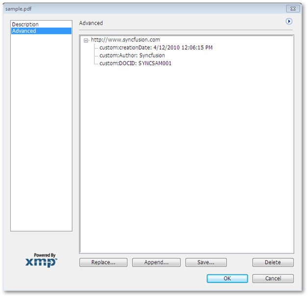

::: {style="DISPLAY: none"}
{#d2h_url_template}{#d2h_package_url style="WIDTH: 0px; DISPLAY: none; HEIGHT: 0px"}
:::

:::: {.d2h_secondary_topic style="PADDING-BOTTOM: 10pt; MARGIN: 0pt; PADDING-LEFT: 0pt; PADDING-RIGHT: 0pt; PADDING-TOP: 0pt"}
#### Custom Metadata {#custom-metadata style="tab-stops: 0pt"}

[]{style="FONT-FAMILY: 'Trebuchet MS','sans-serif'; COLOR: #15428b; FONT-SIZE: 9pt"} 

Essential PDF allows you to add required metadata (custom metadata) to a PDF document. Custom metadata can be information about the document which cannot be fit in the predefined metadata fields. For example: If a metadata field "Link" is available, you can only provide a link there.  But, Essential PDF allows you to add additional information like Author, date of creation etc. about the link.

This feature allows you to add as many metadata fields as you want. Only new metadata fields can be added. You cannot add metadata fields under the predefined metadata fields.

[]{style="FONT-FAMILY: 'Calibri','sans-serif'"} 

How to add a Custom Metadata Field

 

To add a custom metadata field,

 

[·      ]{style="FONT-FAMILY: Symbol"}Add namespace in the project

[·      ]{style="FONT-FAMILY: Symbol"}Create an XML document container

[·      ]{style="FONT-FAMILY: Symbol"}Create a custom schema

[]{style="FONT-FAMILY: 'Calibri','sans-serif'"} 

Adding Namespace in the Project

 

[The user needs to add the namespace Syncfusion.Pdf.Xmp in the project to enable addition of custom metadata fields in the PDF document.  ]{style="FONT-SIZE: 9pt"}

[Add the namespace using the following code.]{style="FONT-SIZE: 9pt"}

[]{style="FONT-SIZE: 9pt"} 

+--------------------------------------------------------------------------------------------------------------------+
| **[\[C#\]]{style="FONT-FAMILY: 'Courier New'; COLOR: black"}**                                                     |
|                                                                                                                    |
| []{style="FONT-FAMILY: 'Courier New'; COLOR: black"}                                                               |
|                                                                                                                    |
| [using]{style="FONT-FAMILY: 'Courier New'; COLOR: blue"}[ Syncfusion.Pdf.Xmp;]{style="FONT-FAMILY: 'Courier New'"} |
+--------------------------------------------------------------------------------------------------------------------+

[]{style="FONT-FAMILY: 'Trebuchet MS','sans-serif'; COLOR: #15428b; FONT-SIZE: 9pt"} 

Creating an XML Document Container

The custom metadata to be created has to be stored and linked to the PDF document in use. Here an XML document is used as a container to save the custom metadata fields for the PDF document.

Add the following code to create an XML document to store custom metadata fields.

[]{style="FONT-FAMILY: 'Trebuchet MS','sans-serif'; COLOR: #15428b; FONT-SIZE: 9pt"} 

+---------------------------------------------------------------------------------------------------------------------------------------------------------------------------------------------------------------------------------+
| **[\[C#\]]{style="FONT-FAMILY: 'Courier New'; COLOR: black"}**                                                                                                                                                                  |
|                                                                                                                                                                                                                                 |
| []{style="FONT-FAMILY: 'Courier New'; COLOR: black"}                                                                                                                                                                            |
|                                                                                                                                                                                                                                 |
| [XmpMetadata]{style="FONT-FAMILY: 'Courier New'; COLOR: #2b91af"}[ xmp = [new]{style="COLOR: blue"} [XmpMetadata]{style="COLOR: #2b91af"}(pdfDoc.DocumentInformation.XmpMetadata.XmlData);]{style="FONT-FAMILY: 'Courier New'"} |
|                                                                                                                                                                                                                                 |
| []{style="FONT-FAMILY: 'Courier New'"}                                                                                                                                                                                          |
+---------------------------------------------------------------------------------------------------------------------------------------------------------------------------------------------------------------------------------+

[]{style="FONT-FAMILY: 'Trebuchet MS','sans-serif'; COLOR: #15428b; FONT-SIZE: 9pt"} 

The following table provides more information on the code.

 

::: {align="center"}
  ---------- ------------ ------------------
  Property   Type         Value It Accepts
  XmlData    XmlElement   XmlElement
  ---------- ------------ ------------------
:::

 

Creating a Custom Schema

 

A custom schema defines the structure of the customized information records. You can use the customschema class to:

[·      ]{style="FONT-FAMILY: Symbol"}Define custom metadata files; and,

[·      ]{style="FONT-FAMILY: Symbol"}Add them to the PDF document

 

Add the following code to define a custom schema.

 

+-----------------------------------------------------------------------------------------------------------------------------------------------------------------------------------------------------------------------------------------------------------------------------------------------+
| **[\[C#\]]{style="FONT-FAMILY: 'Courier New'; COLOR: black"}**                                                                                                                                                                                                                                |
|                                                                                                                                                                                                                                                                                               |
| []{style="FONT-FAMILY: 'Courier New'; COLOR: black"}                                                                                                                                                                                                                                          |
|                                                                                                                                                                                                                                                                                               |
| [//create a custom schema]{style="FONT-FAMILY: 'Courier New'; COLOR: green"}                                                                                                                                                                                                                  |
|                                                                                                                                                                                                                                                                                               |
| [CustomSchema]{style="FONT-FAMILY: 'Courier New'; COLOR: #2b91af"}[ cs = [new]{style="COLOR: blue"} [CustomSchema]{style="COLOR: #2b91af"}(xmp,[\"custom\"]{style="COLOR: #a31515"},[\"http://www.syncfusion.com\"]{style="COLOR: #a31515"});           ]{style="FONT-FAMILY: 'Courier New'"} |
|                                                                                                                                                                                                                                                                                               |
| [cs\[[\"Author\"]{style="COLOR: #a31515"}\] = [\"Syncfusion\"]{style="COLOR: #a31515"};]{style="FONT-FAMILY: 'Courier New'"}                                                                                                                                                                  |
|                                                                                                                                                                                                                                                                                               |
| [cs\[[\"creationDate\"]{style="COLOR: #a31515"}\] = [DateTime]{style="COLOR: #2b91af"}.Now.ToString();]{style="FONT-FAMILY: 'Courier New'"}                                                                                                                                                   |
|                                                                                                                                                                                                                                                                                               |
| [cs\[[\"DOCID\"]{style="COLOR: #a31515"}\] = [\"SYNCSAM001\"]{style="COLOR: #a31515"};]{style="FONT-FAMILY: 'Courier New'"}                                                                                                                                                                   |
+-----------------------------------------------------------------------------------------------------------------------------------------------------------------------------------------------------------------------------------------------------------------------------------------------+

[]{style="FONT-FAMILY: 'Trebuchet MS','sans-serif'; COLOR: #15428b; FONT-SIZE: 9pt"} 

The code snippet above, illustrates creation of custom schema or first-level metadata field *www.syncfusion.com*, which is a link. The second-level metadata fields under the link are Author, creation date and DocID.

On running the code, the values assigned to these fields are reflected as data on expanding the first-level metadata field as shown in the following screenshot.

 

{border="0"}

Figure 33: Custom Metadata Field

 

You have successfully created a custom metadata field in the PDF document.[]{#p65}

 

[]{#related-topics}
::::
