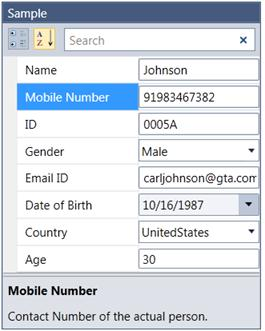

::: {style="DISPLAY: none"}
{#d2h_url_template}{#d2h_package_url style="WIDTH: 0px; DISPLAY: none; HEIGHT: 0px"}
:::

::: {.d2h_secondary_topic style="PADDING-BOTTOM: 10pt; MARGIN: 0pt; PADDING-LEFT: 0pt; PADDING-RIGHT: 0pt; PADDING-TOP: 0pt"}
#### Custom Object {#custom-object style="tab-stops: 0pt"}

You can edit the custom object properties using the PropertyGrid. The following example illustrates how to edit the custom object properties.

1.  [Create a class called **Person** and define the properties. ]{style="FONT-FAMILY: 'Arial','sans-serif'"}

 

+---------------------------------------------------------------------------------------------------------------------------------------------------------------------------------------+
| **[\[C#\]]{style="FONT-FAMILY: 'Courier New'"}**                                                                                                                                      |
|                                                                                                                                                                                       |
| [\[[TypeConverter]{style="COLOR: #2b91af"}([typeof]{style="COLOR: blue"}([ExpandableObjects]{style="COLOR: #2b91af"}))\]]{style="FONT-FAMILY: Consolas; FONT-SIZE: 9.5pt"}            |
|                                                                                                                                                                                       |
| [    [public]{style="COLOR: blue"} [class]{style="COLOR: blue"} [Person]{style="COLOR: #2b91af"}]{style="FONT-FAMILY: Consolas; FONT-SIZE: 9.5pt"}                                    |
|                                                                                                                                                                                       |
| [    {]{style="FONT-FAMILY: Consolas; FONT-SIZE: 9.5pt"}                                                                                                                              |
|                                                                                                                                                                                       |
| [        [public]{style="COLOR: blue"} Person()]{style="FONT-FAMILY: Consolas; FONT-SIZE: 9.5pt"}                                                                                     |
|                                                                                                                                                                                       |
| [        {            ]{style="FONT-FAMILY: Consolas; FONT-SIZE: 9.5pt"}                                                                                                              |
|                                                                                                                                                                                       |
| [            Name = [\"Johnson\"]{style="COLOR: #a31515"};]{style="FONT-FAMILY: Consolas; FONT-SIZE: 9.5pt"}                                                                          |
|                                                                                                                                                                                       |
| [            Age = 30;]{style="FONT-FAMILY: Consolas; FONT-SIZE: 9.5pt"}                                                                                                              |
|                                                                                                                                                                                       |
| [            Mobile = 91983467382;]{style="FONT-FAMILY: Consolas; FONT-SIZE: 9.5pt"}                                                                                                  |
|                                                                                                                                                                                       |
| [            Email = [\"carljohnson@gta.com\"]{style="COLOR: #a31515"};]{style="FONT-FAMILY: Consolas; FONT-SIZE: 9.5pt"}                                                             |
|                                                                                                                                                                                       |
| [            ID = [\"0005A\"]{style="COLOR: #a31515"};]{style="FONT-FAMILY: Consolas; FONT-SIZE: 9.5pt"}                                                                              |
|                                                                                                                                                                                       |
| [            DOB = [new]{style="COLOR: blue"} [DateTime]{style="COLOR: #2b91af"}(1987, 10, 16);           ]{style="FONT-FAMILY: Consolas; FONT-SIZE: 9.5pt"}                          |
|                                                                                                                                                                                       |
| [        }]{style="FONT-FAMILY: Consolas; FONT-SIZE: 9.5pt"}                                                                                                                          |
|                                                                                                                                                                                       |
| []{style="FONT-FAMILY: Consolas; FONT-SIZE: 9.5pt"}                                                                                                                                   |
|                                                                                                                                                                                       |
| [        \[[CategoryAttribute]{style="COLOR: #2b91af"}([\"Identity\"]{style="COLOR: #a31515"})\]]{style="FONT-FAMILY: Consolas; FONT-SIZE: 9.5pt"}                                    |
|                                                                                                                                                                                       |
| [        \[[DisplayNameAttribute]{style="COLOR: #2b91af"}([\"Name\"]{style="COLOR: #a31515"})\]]{style="FONT-FAMILY: Consolas; FONT-SIZE: 9.5pt"}                                     |
|                                                                                                                                                                                       |
| [        \[[DescriptionAttribute]{style="COLOR: #2b91af"}([\"Name of the actual person.\"]{style="COLOR: #a31515"})\]]{style="FONT-FAMILY: Consolas; FONT-SIZE: 9.5pt"}               |
|                                                                                                                                                                                       |
| [        [public]{style="COLOR: blue"} [string]{style="COLOR: blue"} Name]{style="FONT-FAMILY: Consolas; FONT-SIZE: 9.5pt"}                                                           |
|                                                                                                                                                                                       |
| [        {]{style="FONT-FAMILY: Consolas; FONT-SIZE: 9.5pt"}                                                                                                                          |
|                                                                                                                                                                                       |
| [            [get]{style="COLOR: blue"};]{style="FONT-FAMILY: Consolas; FONT-SIZE: 9.5pt"}                                                                                            |
|                                                                                                                                                                                       |
| [            [set]{style="COLOR: blue"};]{style="FONT-FAMILY: Consolas; FONT-SIZE: 9.5pt"}                                                                                            |
|                                                                                                                                                                                       |
| [        }]{style="FONT-FAMILY: Consolas; FONT-SIZE: 9.5pt"}                                                                                                                          |
|                                                                                                                                                                                       |
| []{style="FONT-FAMILY: Consolas; FONT-SIZE: 9.5pt"}                                                                                                                                   |
|                                                                                                                                                                                       |
| [       ]{style="FONT-FAMILY: Consolas; FONT-SIZE: 9.5pt"}                                                                                                                            |
|                                                                                                                                                                                       |
| [        \[[CategoryAttribute]{style="COLOR: #2b91af"}([\"Identity\"]{style="COLOR: #a31515"})\]]{style="FONT-FAMILY: Consolas; FONT-SIZE: 9.5pt"}                                    |
|                                                                                                                                                                                       |
| [        \[[DisplayNameAttribute]{style="COLOR: #2b91af"}([\"ID\"]{style="COLOR: #a31515"})\]]{style="FONT-FAMILY: Consolas; FONT-SIZE: 9.5pt"}                                       |
|                                                                                                                                                                                       |
| [        \[[DescriptionAttribute]{style="COLOR: #2b91af"}([\"ID of the actual person.\"]{style="COLOR: #a31515"})\]]{style="FONT-FAMILY: Consolas; FONT-SIZE: 9.5pt"}                 |
|                                                                                                                                                                                       |
| [        [public]{style="COLOR: blue"} [string]{style="COLOR: blue"} ID]{style="FONT-FAMILY: Consolas; FONT-SIZE: 9.5pt"}                                                             |
|                                                                                                                                                                                       |
| [        {]{style="FONT-FAMILY: Consolas; FONT-SIZE: 9.5pt"}                                                                                                                          |
|                                                                                                                                                                                       |
| [            [get]{style="COLOR: blue"};]{style="FONT-FAMILY: Consolas; FONT-SIZE: 9.5pt"}                                                                                            |
|                                                                                                                                                                                       |
| [            [set]{style="COLOR: blue"};]{style="FONT-FAMILY: Consolas; FONT-SIZE: 9.5pt"}                                                                                            |
|                                                                                                                                                                                       |
| [        }]{style="FONT-FAMILY: Consolas; FONT-SIZE: 9.5pt"}                                                                                                                          |
|                                                                                                                                                                                       |
| []{style="FONT-FAMILY: Consolas; FONT-SIZE: 9.5pt"}                                                                                                                                   |
|                                                                                                                                                                                       |
| [        \[[CategoryAttribute]{style="COLOR: #2b91af"}([\"Identity\"]{style="COLOR: #a31515"})\]]{style="FONT-FAMILY: Consolas; FONT-SIZE: 9.5pt"}                                    |
|                                                                                                                                                                                       |
| [        \[[DisplayNameAttribute]{style="COLOR: #2b91af"}([\"Date of Birth\"]{style="COLOR: #a31515"})\]]{style="FONT-FAMILY: Consolas; FONT-SIZE: 9.5pt"}                            |
|                                                                                                                                                                                       |
| [        \[[DescriptionAttribute]{style="COLOR: #2b91af"}([\"Birth date of the actual person.\"]{style="COLOR: #a31515"})\]]{style="FONT-FAMILY: Consolas; FONT-SIZE: 9.5pt"}         |
|                                                                                                                                                                                       |
| [        [public]{style="COLOR: blue"} [DateTime]{style="COLOR: #2b91af"} DOB]{style="FONT-FAMILY: Consolas; FONT-SIZE: 9.5pt"}                                                       |
|                                                                                                                                                                                       |
| [        {]{style="FONT-FAMILY: Consolas; FONT-SIZE: 9.5pt"}                                                                                                                          |
|                                                                                                                                                                                       |
| [            [get]{style="COLOR: blue"};]{style="FONT-FAMILY: Consolas; FONT-SIZE: 9.5pt"}                                                                                            |
|                                                                                                                                                                                       |
| [            [set]{style="COLOR: blue"};]{style="FONT-FAMILY: Consolas; FONT-SIZE: 9.5pt"}                                                                                            |
|                                                                                                                                                                                       |
| [        }]{style="FONT-FAMILY: Consolas; FONT-SIZE: 9.5pt"}                                                                                                                          |
|                                                                                                                                                                                       |
| []{style="FONT-FAMILY: Consolas; FONT-SIZE: 9.5pt"}                                                                                                                                   |
|                                                                                                                                                                                       |
| [        \[[CategoryAttribute]{style="COLOR: #2b91af"}([\"Contact Details\"]{style="COLOR: #a31515"})\]]{style="FONT-FAMILY: Consolas; FONT-SIZE: 9.5pt"}                             |
|                                                                                                                                                                                       |
| [        \[[DisplayNameAttribute]{style="COLOR: #2b91af"}([\"Email ID\"]{style="COLOR: #a31515"})\]]{style="FONT-FAMILY: Consolas; FONT-SIZE: 9.5pt"}                                 |
|                                                                                                                                                                                       |
| [        \[[DescriptionAttribute]{style="COLOR: #2b91af"}([\"Email address of the actual person.\"]{style="COLOR: #a31515"})\]]{style="FONT-FAMILY: Consolas; FONT-SIZE: 9.5pt"}      |
|                                                                                                                                                                                       |
| [        [public]{style="COLOR: blue"} [string]{style="COLOR: blue"} Email]{style="FONT-FAMILY: Consolas; FONT-SIZE: 9.5pt"}                                                          |
|                                                                                                                                                                                       |
| [        {]{style="FONT-FAMILY: Consolas; FONT-SIZE: 9.5pt"}                                                                                                                          |
|                                                                                                                                                                                       |
| [            [get]{style="COLOR: blue"};]{style="FONT-FAMILY: Consolas; FONT-SIZE: 9.5pt"}                                                                                            |
|                                                                                                                                                                                       |
| [            [set]{style="COLOR: blue"};]{style="FONT-FAMILY: Consolas; FONT-SIZE: 9.5pt"}                                                                                            |
|                                                                                                                                                                                       |
| [        }]{style="FONT-FAMILY: Consolas; FONT-SIZE: 9.5pt"}                                                                                                                          |
|                                                                                                                                                                                       |
| []{style="FONT-FAMILY: Consolas; FONT-SIZE: 9.5pt"}                                                                                                                                   |
|                                                                                                                                                                                       |
| [        \[[CategoryAttribute]{style="COLOR: #2b91af"}([\"Contact Details\"]{style="COLOR: #a31515"})\]]{style="FONT-FAMILY: Consolas; FONT-SIZE: 9.5pt"}                             |
|                                                                                                                                                                                       |
| [        \[[DisplayNameAttribute]{style="COLOR: #2b91af"}([\"Mobile Number\"]{style="COLOR: #a31515"})\]]{style="FONT-FAMILY: Consolas; FONT-SIZE: 9.5pt"}                            |
|                                                                                                                                                                                       |
| [        \[[DescriptionAttribute]{style="COLOR: #2b91af"}([\"Contact number of the actual person.\"]{style="COLOR: #a31515"})\]]{style="FONT-FAMILY: Consolas; FONT-SIZE: 9.5pt"}     |
|                                                                                                                                                                                       |
| [        [public]{style="COLOR: blue"} [long]{style="COLOR: blue"} Mobile]{style="FONT-FAMILY: Consolas; FONT-SIZE: 9.5pt"}                                                           |
|                                                                                                                                                                                       |
| [        {]{style="FONT-FAMILY: Consolas; FONT-SIZE: 9.5pt"}                                                                                                                          |
|                                                                                                                                                                                       |
| [            [get]{style="COLOR: blue"};]{style="FONT-FAMILY: Consolas; FONT-SIZE: 9.5pt"}                                                                                            |
|                                                                                                                                                                                       |
| [            [set]{style="COLOR: blue"};]{style="FONT-FAMILY: Consolas; FONT-SIZE: 9.5pt"}                                                                                            |
|                                                                                                                                                                                       |
| [        }]{style="FONT-FAMILY: Consolas; FONT-SIZE: 9.5pt"}                                                                                                                          |
|                                                                                                                                                                                       |
| []{style="FONT-FAMILY: Consolas; FONT-SIZE: 9.5pt"}                                                                                                                                   |
|                                                                                                                                                                                       |
| [        \[[CategoryAttribute]{style="COLOR: #2b91af"}([\"Identity\"]{style="COLOR: #a31515"})\]]{style="FONT-FAMILY: Consolas; FONT-SIZE: 9.5pt"}                                    |
|                                                                                                                                                                                       |
| [        \[[DisplayNameAttribute]{style="COLOR: #2b91af"}([\"Age\"]{style="COLOR: #a31515"})\]]{style="FONT-FAMILY: Consolas; FONT-SIZE: 9.5pt"}                                      |
|                                                                                                                                                                                       |
| [        \[[DescriptionAttribute]{style="COLOR: #2b91af"}([\"Age of the actual person.\"]{style="COLOR: #a31515"})\]]{style="FONT-FAMILY: Consolas; FONT-SIZE: 9.5pt"}                |
|                                                                                                                                                                                       |
| [        [public]{style="COLOR: blue"} [int]{style="COLOR: blue"} Age]{style="FONT-FAMILY: Consolas; FONT-SIZE: 9.5pt"}                                                               |
|                                                                                                                                                                                       |
| [        {]{style="FONT-FAMILY: Consolas; FONT-SIZE: 9.5pt"}                                                                                                                          |
|                                                                                                                                                                                       |
| [            [get]{style="COLOR: blue"};]{style="FONT-FAMILY: Consolas; FONT-SIZE: 9.5pt"}                                                                                            |
|                                                                                                                                                                                       |
| [            [set]{style="COLOR: blue"};]{style="FONT-FAMILY: Consolas; FONT-SIZE: 9.5pt"}                                                                                            |
|                                                                                                                                                                                       |
| [        }]{style="FONT-FAMILY: Consolas; FONT-SIZE: 9.5pt"}                                                                                                                          |
|                                                                                                                                                                                       |
| []{style="FONT-FAMILY: Consolas; FONT-SIZE: 9.5pt"}                                                                                                                                   |
|                                                                                                                                                                                       |
| [      ]{style="FONT-FAMILY: Consolas; FONT-SIZE: 9.5pt"}                                                                                                                             |
|                                                                                                                                                                                       |
| [        \[[CategoryAttribute]{style="COLOR: #2b91af"}([\"Identity\"]{style="COLOR: #a31515"})\]]{style="FONT-FAMILY: Consolas; FONT-SIZE: 9.5pt"}                                    |
|                                                                                                                                                                                       |
| [        \[[DisplayNameAttribute]{style="COLOR: #2b91af"}([\"Gender\"]{style="COLOR: #a31515"})\]]{style="FONT-FAMILY: Consolas; FONT-SIZE: 9.5pt"}                                   |
|                                                                                                                                                                                       |
| [        \[[DescriptionAttribute]{style="COLOR: #2b91af"}([\"Gender information of the actual person.\"]{style="COLOR: #a31515"})\]]{style="FONT-FAMILY: Consolas; FONT-SIZE: 9.5pt"} |
|                                                                                                                                                                                       |
| [        [public]{style="COLOR: blue"} [Gender]{style="COLOR: #2b91af"} Gender]{style="FONT-FAMILY: Consolas; FONT-SIZE: 9.5pt"}                                                      |
|                                                                                                                                                                                       |
| [        {]{style="FONT-FAMILY: Consolas; FONT-SIZE: 9.5pt"}                                                                                                                          |
|                                                                                                                                                                                       |
| [            [get]{style="COLOR: blue"};]{style="FONT-FAMILY: Consolas; FONT-SIZE: 9.5pt"}                                                                                            |
|                                                                                                                                                                                       |
| [            [set]{style="COLOR: blue"};]{style="FONT-FAMILY: Consolas; FONT-SIZE: 9.5pt"}                                                                                            |
|                                                                                                                                                                                       |
| [        }]{style="FONT-FAMILY: Consolas; FONT-SIZE: 9.5pt"}                                                                                                                          |
|                                                                                                                                                                                       |
| []{style="FONT-FAMILY: Consolas; FONT-SIZE: 9.5pt"}                                                                                                                                   |
|                                                                                                                                                                                       |
| [        \[[CategoryAttribute]{style="COLOR: #2b91af"}([\"Location\"]{style="COLOR: #a31515"})\]]{style="FONT-FAMILY: Consolas; FONT-SIZE: 9.5pt"}                                    |
|                                                                                                                                                                                       |
| [        \[[DisplayNameAttribute]{style="COLOR: #2b91af"}([\"Country\"]{style="COLOR: #a31515"})\]]{style="FONT-FAMILY: Consolas; FONT-SIZE: 9.5pt"}                                  |
|                                                                                                                                                                                       |
| [        \[[DescriptionAttribute]{style="COLOR: #2b91af"}([\"Country where the person is located.\"]{style="COLOR: #a31515"})\]]{style="FONT-FAMILY: Consolas; FONT-SIZE: 9.5pt"}     |
|                                                                                                                                                                                       |
| [        [public]{style="COLOR: blue"} [Country]{style="COLOR: #2b91af"} Country]{style="FONT-FAMILY: Consolas; FONT-SIZE: 9.5pt"}                                                    |
|                                                                                                                                                                                       |
| [        {]{style="FONT-FAMILY: Consolas; FONT-SIZE: 9.5pt"}                                                                                                                          |
|                                                                                                                                                                                       |
| [            [get]{style="COLOR: blue"};]{style="FONT-FAMILY: Consolas; FONT-SIZE: 9.5pt"}                                                                                            |
|                                                                                                                                                                                       |
| [            [set]{style="COLOR: blue"};]{style="FONT-FAMILY: Consolas; FONT-SIZE: 9.5pt"}                                                                                            |
|                                                                                                                                                                                       |
| [        }       ]{style="FONT-FAMILY: Consolas; FONT-SIZE: 9.5pt"}                                                                                                                   |
|                                                                                                                                                                                       |
| [    }]{style="FONT-FAMILY: Consolas; FONT-SIZE: 9.5pt"}                                                                                                                              |
|                                                                                                                                                                                       |
| []{style="FONT-FAMILY: Consolas; FONT-SIZE: 9.5pt"}                                                                                                                                   |
|                                                                                                                                                                                       |
| [  ]{style="FONT-FAMILY: 'Courier New'"}                                                                                                                                              |
|                                                                                                                                                                                       |
| [  [public]{style="COLOR: blue"} [enum]{style="COLOR: blue"} [Country]{style="COLOR: #2b91af"}]{style="FONT-FAMILY: 'Courier New'"}                                                   |
|                                                                                                                                                                                       |
| [    {]{style="FONT-FAMILY: 'Courier New'"}                                                                                                                                           |
|                                                                                                                                                                                       |
| [        UnitedStates,]{style="FONT-FAMILY: 'Courier New'"}                                                                                                                           |
|                                                                                                                                                                                       |
| []{style="FONT-FAMILY: 'Courier New'"}                                                                                                                                                |
|                                                                                                                                                                                       |
| [        Germany,]{style="FONT-FAMILY: 'Courier New'"}                                                                                                                                |
|                                                                                                                                                                                       |
| []{style="FONT-FAMILY: 'Courier New'"}                                                                                                                                                |
|                                                                                                                                                                                       |
| [        Canada,]{style="FONT-FAMILY: 'Courier New'"}                                                                                                                                 |
|                                                                                                                                                                                       |
| [     ]{style="FONT-FAMILY: 'Courier New'"}                                                                                                                                           |
|                                                                                                                                                                                       |
| [    }]{style="FONT-FAMILY: 'Courier New'"}                                                                                                                                           |
|                                                                                                                                                                                       |
| []{style="FONT-FAMILY: 'Courier New'"}                                                                                                                                                |
+---------------------------------------------------------------------------------------------------------------------------------------------------------------------------------------+

 

2.  [Set the ]{style="FONT-FAMILY: 'Arial','sans-serif'"}**[SelectedObject]{style="FONT-FAMILY: 'Arial','sans-serif'"}**[ of the property to the instance of the class **Person**.]{style="FONT-FAMILY: 'Arial','sans-serif'"}

 

+---------------------------------------------------------------------------------------------------------------------------------------------------------------------------------------+
| **[\[C#\]]{style="FONT-FAMILY: 'Courier New'"}**                                                                                                                                      |
|                                                                                                                                                                                       |
| [PropertyGrid]{style="FONT-FAMILY: 'Courier New'; COLOR: #2b91af"}[ pGrid = [new]{style="COLOR: blue"} [PropertyGrid]{style="COLOR: #2b91af"}();]{style="FONT-FAMILY: 'Courier New'"} |
|                                                                                                                                                                                       |
| [            pGrid.SelectedObject = [new]{style="COLOR: blue"} [Person]{style="COLOR: #2b91af"}();]{style="FONT-FAMILY: 'Courier New'"}                                               |
|                                                                                                                                                                                       |
|                                                                                                                                                                                       |
+---------------------------------------------------------------------------------------------------------------------------------------------------------------------------------------+

[]{style="FONT-SIZE: 9pt"} 

3.  [The PropertyGrid will be generated as shown in the following screenshot.]{style="FONT-FAMILY: 'Arial','sans-serif'"}

 

{border="0"}

Figure 812: PropertyGrid with Custom Object

[]{#related-topics}
:::
