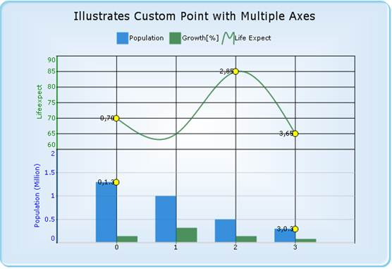

::: {style="DISPLAY: none"}
{#d2h_url_template}{#d2h_package_url style="WIDTH: 0px; DISPLAY: none; HEIGHT: 0px"}
:::

::: {.d2h_secondary_topic style="PADDING-BOTTOM: 10pt; MARGIN: 0pt; PADDING-LEFT: 0pt; PADDING-RIGHT: 0pt; PADDING-TOP: 0pt"}
#### Custom Point in Multiple Axes {#custom-point-in-multiple-axes style="tab-stops: 0pt"}

 

The custom points for the Secondary axis can be achieved by assigning the Series Index for the ChartCoordinates type.

The following code snippet illustrates this:

+--------------------------------------------------------------------------------------------------------------------------------------------------------------------------------------------+
| [\[C#\]]{style="FONT-FAMILY: 'Courier New'"}                                                                                                                                               |
|                                                                                                                                                                                            |
| [ChartCustomPoint]{style="FONT-FAMILY: 'Courier New'; COLOR: #2b91af"}[ cp = [new]{style="COLOR: blue"} [ChartCustomPoint]{style="COLOR: #2b91af"}();]{style="FONT-FAMILY: 'Courier New'"} |
|                                                                                                                                                                                            |
| [cp.CustomType = [ChartCustomPointType]{style="COLOR: #2b91af"}.ChartCoordinates;]{style="FONT-FAMILY: 'Courier New'"}                                                                     |
|                                                                                                                                                                                            |
| [//Set the series index if the Customtype is ChartCoordinates in multiple axis]{style="FONT-FAMILY: 'Courier New'; COLOR: green"}                                                          |
|                                                                                                                                                                                            |
| [cp.SeriesIndex = 0;]{style="FONT-FAMILY: 'Courier New'"}                                                                                                                                  |
|                                                                                                                                                                                            |
| [cp.XValue = 10; ]{style="FONT-FAMILY: 'Courier New'"}                                                                                                                                     |
|                                                                                                                                                                                            |
| [cp.YValue = 60;]{style="FONT-FAMILY: 'Courier New'"}                                                                                                                                      |
|                                                                                                                                                                                            |
| [cp.Symbol.Shape = [ChartSymbolShape]{style="COLOR: #2b91af"}.Circle;]{style="FONT-FAMILY: 'Courier New'"}                                                                                 |
|                                                                                                                                                                                            |
| [cp.Alignment = [ChartTextOrientation]{style="COLOR: #2b91af"}.Left;]{style="FONT-FAMILY: 'Courier New'"}                                                                                  |
|                                                                                                                                                                                            |
| [cp.Color = [Color]{style="COLOR: #2b91af"}.Black;]{style="FONT-FAMILY: 'Courier New'"}                                                                                                    |
|                                                                                                                                                                                            |
| [cp.Font.Facename = [\"Verdana\"]{style="COLOR: #a31515"};]{style="FONT-FAMILY: 'Courier New'"}                                                                                            |
|                                                                                                                                                                                            |
| [cp.Font.Size = 8.0F;]{style="FONT-FAMILY: 'Courier New'"}                                                                                                                                 |
|                                                                                                                                                                                            |
| [cp.Symbol.Color = [Color]{style="COLOR: #2b91af"}.Yellow;]{style="FONT-FAMILY: 'Courier New'"}                                                                                            |
|                                                                                                                                                                                            |
| [cp.Text = cp.XValue + [\",\"]{style="COLOR: #a31515"} + cp.YValue;]{style="FONT-FAMILY: 'Courier New'"}                                                                                   |
|                                                                                                                                                                                            |
| [this]{style="FONT-FAMILY: 'Courier New'; COLOR: blue"}[.ChartWebControl1.CustomPoints.Add(cp);]{style="FONT-FAMILY: 'Courier New'"}[]{style="FONT-FAMILY: 'Courier New'"}                 |
+--------------------------------------------------------------------------------------------------------------------------------------------------------------------------------------------+

 

+--------------------------------------------------------------------------------------------------------------------------------------------------------------------------------------------+
| [\[VB\]]{style="FONT-FAMILY: 'Courier New'"}                                                                                                                                               |
|                                                                                                                                                                                            |
| [Dim]{style="FONT-FAMILY: 'Courier New'; COLOR: blue"}[ cp [As]{style="COLOR: blue"} ChartCustomPoint = [New]{style="COLOR: blue"} ChartCustomPoint()]{style="FONT-FAMILY: 'Courier New'"} |
|                                                                                                                                                                                            |
| [cp.CustomType = ChartCustomPointType.ChartCoordinates]{style="FONT-FAMILY: 'Courier New'"}                                                                                                |
|                                                                                                                                                                                            |
| [\'Set the series index if the Customtype is ChartCoordinates in multiple axis]{style="FONT-FAMILY: 'Courier New'; COLOR: green"}[]{style="FONT-FAMILY: 'Courier New'"}                    |
|                                                                                                                                                                                            |
| [cp.SeriesIndex = 0]{style="FONT-FAMILY: 'Courier New'"}                                                                                                                                   |
|                                                                                                                                                                                            |
| [cp.XValue = 10]{style="FONT-FAMILY: 'Courier New'"}                                                                                                                                       |
|                                                                                                                                                                                            |
| [cp.YValue = 60]{style="FONT-FAMILY: 'Courier New'"}                                                                                                                                       |
|                                                                                                                                                                                            |
| [cp.Symbol.Shape = ChartSymbolShape.Circle]{style="FONT-FAMILY: 'Courier New'"}                                                                                                            |
|                                                                                                                                                                                            |
| [cp.Alignment = ChartTextOrientation.Left]{style="FONT-FAMILY: 'Courier New'"}                                                                                                             |
|                                                                                                                                                                                            |
| [cp.Color = Color.Black]{style="FONT-FAMILY: 'Courier New'"}                                                                                                                               |
|                                                                                                                                                                                            |
| [cp.Font.Facename = \"Verdana\"]{style="FONT-FAMILY: 'Courier New'"}                                                                                                                       |
|                                                                                                                                                                                            |
| [cp.Font.Size = 8.0F]{style="FONT-FAMILY: 'Courier New'"}                                                                                                                                  |
|                                                                                                                                                                                            |
| [cp.Symbol.Color = Color.Yellow]{style="FONT-FAMILY: 'Courier New'"}                                                                                                                       |
|                                                                                                                                                                                            |
| [cp.Text = cp.XValue & \",\" & cp.YValue]{style="FONT-FAMILY: 'Courier New'"}                                                                                                              |
|                                                                                                                                                                                            |
| [Me]{style="FONT-FAMILY: 'Courier New'; COLOR: blue"}[.ChartWebControl1.CustomPoints.Add(cp)]{style="FONT-FAMILY: 'Courier New'"}                                                          |
+--------------------------------------------------------------------------------------------------------------------------------------------------------------------------------------------+

[]{style="FONT-FAMILY: 'Times New Roman','serif'; FONT-SIZE: 12pt"} 

[]{style="FONT-FAMILY: 'Times New Roman','serif'; FONT-SIZE: 12pt"} 

[]{style="FONT-FAMILY: 'Calibri','sans-serif'; FONT-SIZE: 11pt"} 

 

 

             {border="0"}

Figure 241: Custom Points in Multiple Axes

 

 

[]{#p171} 

 

[]{#related-topics}
:::
