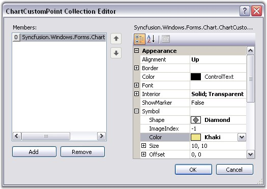
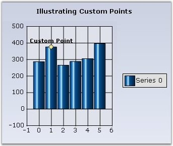
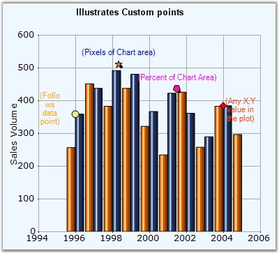

::: {style="DISPLAY: none"}
{#d2h_url_template}{#d2h_package_url style="WIDTH: 0px; DISPLAY: none; HEIGHT: 0px"}
:::

::::: {#nsbanner .d2h_main_nsbanner style="BORDER-BOTTOM: #999999 1px solid; POSITION: relative; PADDING-BOTTOM: 0px; BACKGROUND-COLOR: transparent; PADDING-LEFT: 0px; PADDING-RIGHT: 0px; DISPLAY: none; BORDER-TOP: #999999 1px solid; PADDING-TOP: 0px; LEFT: 0px"}
:::: {#TitleRow .d2h_main_titlerow style="PADDING-BOTTOM: 4px; BACKGROUND-COLOR: transparent; PADDING-LEFT: 22px; WIDTH: 100%; PADDING-RIGHT: 10px; DISPLAY: none; PADDING-TOP: 4px"}
::: {#ienav .d2h_main_ienav style="DISPLAY: none"}
{#D2HPrevious .D2HPreviousEnabled}  {#D2HNext .D2HNextEnabled}
:::
::::
:::::

:::::: {#nstext .d2h_main_nstext style="PADDING-BOTTOM: 10px; BACKGROUND-COLOR: transparent; PADDING-LEFT: 22px; PADDING-RIGHT: 10px; HEIGHT: 100%; OVERFLOW: auto; PADDING-TOP: 5px" hasuserbackground="true" valign="bottom"}
::: {#d2h_breadcrumbs .d2h_breadcrumbs}
[Essential Studio User Guide Documentation](ms-xhelp:///?Id=12457748-09e3-4d74-a240-8e049cedf030){.d2h_breadcrumbsNormal}[ \> ]{.d2h_breadcrumbsLinkSeparator}[User Interface Edition](ms-xhelp:///?Id=c29296b7-531c-413b-a0ec-488ca1f7f669){.d2h_breadcrumbsNormal}[ \> ]{.d2h_breadcrumbsLinkSeparator}[Essential Windows](ms-xhelp:///?Id=e60759d8-47a4-4570-9d7a-16a68d63f2ea){.d2h_breadcrumbsNormal}[ \> ]{.d2h_breadcrumbsLinkSeparator}[Essential Chart]{.d2h_breadcrumbsContentsOnly}[ \> ]{.d2h_breadcrumbsLinkSeparator}[Concepts and Features](ms-xhelp:///?Id=71321e9c-336c-4c1c-a127-be9f135ad4bb){.d2h_breadcrumbsNormal}[ \> ]{.d2h_breadcrumbsLinkSeparator}[Chart Series](ms-xhelp:///?Id=68f205e3-aef5-4514-8a16-640be1079703){.d2h_breadcrumbsNormal}
:::

### Custom Points {#custom-points style="tab-stops: 0pt"}

 

Essential Chart supports plotting of points on the Chart Area even if they don\'t belong to a series. These are stored in the **ChartControl.CustomPoints** collection. They can be set at custom coordinates of the Chart Area or be made to follow a certain point or percentage coordinates. A custom point displays a text, background, border, symbol and marker, which is a line that connects the CustomPoint with the point on the chart area when it is offset from it.

 

Through Designer the Custom Points can be set using the **CustomPoints** property. Clicking this property will popup ChartCustomPoint Collection Editor window where you can add your custom points.

 

You can set the co-ordinates (**XValue** and the **YValue** property), symbols and their customization, using the **Symbols** property, text, using the **Text** property, alignment of the text, using the **Alignment** property and so on.

 

{border="0"}

 

Figure 238: CustomPoints Collection Editor during Design Time

[]{style="COLOR: red; FONT-SIZE: 8pt"} 

{border="0"}

 

Figure 239: ChartControl with a Custom Point

 

Programmatically

 

[·      ]{style="FONT-FAMILY: Symbol"}Creating and Customizing the Custom Point.

 

+--------------------------------------------------------------------------------------------------------------------------------------------------------------------------------------+
| **[\[C#\]]{style="FONT-FAMILY: 'Courier New'; COLOR: black"}**                                                                                                                       |
|                                                                                                                                                                                      |
| []{style="COLOR: black; FONT-SIZE: 12pt"}                                                                                                                                            |
|                                                                                                                                                                                      |
| [// Point that follows a series point:]{style="FONT-FAMILY: 'Courier New'; COLOR: green"}                                                                                            |
|                                                                                                                                                                                      |
| [ChartCustomPoint]{style="FONT-FAMILY: 'Courier New'; COLOR: teal"}[ cp = [new]{style="COLOR: blue"} [ChartCustomPoint]{style="COLOR: teal"}();]{style="FONT-FAMILY: 'Courier New'"} |
|                                                                                                                                                                                      |
| []{style="FONT-FAMILY: 'Courier New'"}                                                                                                                                               |
|                                                                                                                                                                                      |
| [// Gets the series index and point index if the Customtype is Pointfollow.]{style="FONT-FAMILY: 'Courier New'; COLOR: green"}                                                       |
|                                                                                                                                                                                      |
| [cp.PointIndex = 1;]{style="FONT-FAMILY: 'Courier New'"}                                                                                                                             |
|                                                                                                                                                                                      |
| [cp.SeriesIndex = 0;]{style="FONT-FAMILY: 'Courier New'"}                                                                                                                            |
|                                                                                                                                                                                      |
| []{style="FONT-FAMILY: 'Courier New'"}                                                                                                                                               |
|                                                                                                                                                                                      |
| [// Specifies the text of the custom point.]{style="FONT-FAMILY: 'Courier New'; COLOR: green"}                                                                                       |
|                                                                                                                                                                                      |
| [cp.Text = [\"Custom Point\"]{style="COLOR: maroon"};]{style="FONT-FAMILY: 'Courier New'"}                                                                                           |
|                                                                                                                                                                                      |
| []{style="FONT-FAMILY: 'Courier New'"}                                                                                                                                               |
|                                                                                                                                                                                      |
| [// Specifies the custom type.]{style="FONT-FAMILY: 'Courier New'; COLOR: green"}                                                                                                    |
|                                                                                                                                                                                      |
| [chartCustomPoint1.CustomType = Syncfusion.Windows.Forms.Chart.[ChartCustomPointType]{style="COLOR: teal"}.PointFollow;]{style="FONT-FAMILY: 'Courier New'"}                         |
|                                                                                                                                                                                      |
| []{style="FONT-FAMILY: 'Courier New'"}                                                                                                                                               |
|                                                                                                                                                                                      |
| [// Specifies the shape of the custom point symbol.]{style="FONT-FAMILY: 'Courier New'; COLOR: green"}                                                                               |
|                                                                                                                                                                                      |
| [cp.Symbol.Shape = [ChartSymbolShape]{style="COLOR: teal"}.Diamond;]{style="FONT-FAMILY: 'Courier New'"}                                                                             |
|                                                                                                                                                                                      |
| []{style="FONT-FAMILY: 'Courier New'"}                                                                                                                                               |
|                                                                                                                                                                                      |
| [// Specifies the color of the custom point.]{style="FONT-FAMILY: 'Courier New'; COLOR: green"}                                                                                      |
|                                                                                                                                                                                      |
| [chartCustomPoint1.Symbol.Color = [Color]{style="COLOR: teal"}.Khaki;]{style="FONT-FAMILY: 'Courier New'"}                                                                           |
|                                                                                                                                                                                      |
| []{style="FONT-FAMILY: 'Courier New'"}                                                                                                                                               |
|                                                                                                                                                                                      |
| [//Setting X-value and Y- value]{style="FONT-FAMILY: 'Courier New'; COLOR: green"}                                                                                                   |
|                                                                                                                                                                                      |
| [chartCustomPoint1.XValue = 1;]{style="FONT-FAMILY: 'Courier New'"}                                                                                                                  |
|                                                                                                                                                                                      |
| [chartCustomPoint1.YValue = 370;]{style="FONT-FAMILY: 'Courier New'"}                                                                                                                |
|                                                                                                                                                                                      |
| []{style="FONT-FAMILY: 'Courier New'"}                                                                                                                                               |
|                                                                                                                                                                                      |
| [//Setting the font properties]{style="FONT-FAMILY: 'Courier New'; COLOR: green"}                                                                                                    |
|                                                                                                                                                                                      |
| [chartCustomPoint1.Color = System.Drawing.[SystemColors]{style="COLOR: teal"}.ButtonHighlight;]{style="FONT-FAMILY: 'Courier New'"}                                                  |
|                                                                                                                                                                                      |
| [chartCustomPoint1.Font.Bold = [true]{style="COLOR: blue"};]{style="FONT-FAMILY: 'Courier New'"}                                                                                     |
|                                                                                                                                                                                      |
| [chartCustomPoint1.Font.Facename = [\"Verdana\"]{style="COLOR: maroon"};]{style="FONT-FAMILY: 'Courier New'"}                                                                        |
|                                                                                                                                                                                      |
| [chartCustomPoint1.Font.Size = 10F;]{style="FONT-FAMILY: 'Courier New'"}                                                                                                             |
+--------------------------------------------------------------------------------------------------------------------------------------------------------------------------------------+

 

+-------------------------------------------------------------------------------------------------------------------------------------------------------------+
| **[\[VB.NET\]]{style="FONT-FAMILY: 'Courier New'; COLOR: black"}**                                                                                          |
|                                                                                                                                                             |
| []{style="COLOR: black; FONT-SIZE: 12pt"}                                                                                                                   |
|                                                                                                                                                             |
| [\'Point that follows a series point:]{style="FONT-FAMILY: 'Courier New'; COLOR: green"}                                                                    |
|                                                                                                                                                             |
| [cp As ChartCustomPoint = [New]{style="COLOR: blue"} ChartCustomPoint()]{style="FONT-FAMILY: 'Courier New'"}                                                |
|                                                                                                                                                             |
| []{style="FONT-FAMILY: 'Courier New'"}                                                                                                                      |
|                                                                                                                                                             |
| [\'Gets the series index and point index if the Customtype is Pointfollow.]{style="FONT-FAMILY: 'Courier New'; COLOR: green"}                               |
|                                                                                                                                                             |
| [cp.PointIndex = 1]{style="FONT-FAMILY: 'Courier New'"}                                                                                                     |
|                                                                                                                                                             |
| [cp.SeriesIndex = 0]{style="FONT-FAMILY: 'Courier New'"}                                                                                                    |
|                                                                                                                                                             |
| []{style="FONT-FAMILY: 'Courier New'"}                                                                                                                      |
|                                                                                                                                                             |
| [\'Specifies the text of the custom point.]{style="FONT-FAMILY: 'Courier New'; COLOR: green"}                                                               |
|                                                                                                                                                             |
| [cp.Text = [\"Custom Point\"]{style="COLOR: maroon"}]{style="FONT-FAMILY: 'Courier New'"}                                                                   |
|                                                                                                                                                             |
| []{style="FONT-FAMILY: 'Courier New'; COLOR: maroon"}                                                                                                       |
|                                                                                                                                                             |
| [\'Specifies the custom type.]{style="FONT-FAMILY: 'Courier New'; COLOR: green"}                                                                            |
|                                                                                                                                                             |
| [chartCustomPoint1.CustomType = Syncfusion.Windows.Forms.Chart.[ChartCustomPointType]{style="COLOR: teal"}.PointFollow]{style="FONT-FAMILY: 'Courier New'"} |
|                                                                                                                                                             |
| []{style="FONT-FAMILY: 'Courier New'"}                                                                                                                      |
|                                                                                                                                                             |
| [\'Specifies the shape of the custom point symbol.]{style="FONT-FAMILY: 'Courier New'; COLOR: green"}                                                       |
|                                                                                                                                                             |
| [cp.Symbol.Shape = ChartSymbolShape.Diamond]{style="FONT-FAMILY: 'Courier New'"}                                                                            |
|                                                                                                                                                             |
| []{style="FONT-FAMILY: 'Courier New'"}                                                                                                                      |
|                                                                                                                                                             |
| [\'Specifies the color of the custom point.]{style="FONT-FAMILY: 'Courier New'; COLOR: green"}                                                              |
|                                                                                                                                                             |
| [cp.Symbol.Color = [Color]{style="COLOR: teal"}.Khaki]{style="FONT-FAMILY: 'Courier New'"}                                                                  |
|                                                                                                                                                             |
| []{style="FONT-FAMILY: 'Courier New'"}                                                                                                                      |
|                                                                                                                                                             |
| [//Setting X-value and Y- value]{style="FONT-FAMILY: 'Courier New'; COLOR: green"}                                                                          |
|                                                                                                                                                             |
| [chartCustomPoint1.XValue = 1]{style="FONT-FAMILY: 'Courier New'"}                                                                                          |
|                                                                                                                                                             |
| [chartCustomPoint1.YValue = 370]{style="FONT-FAMILY: 'Courier New'"}                                                                                        |
|                                                                                                                                                             |
| []{style="FONT-FAMILY: 'Courier New'"}                                                                                                                      |
|                                                                                                                                                             |
| [\'Setting the font properties]{style="FONT-FAMILY: 'Courier New'; COLOR: green"}                                                                           |
|                                                                                                                                                             |
| [chartCustomPoint1.Color = System.Drawing.[SystemColors]{style="COLOR: teal"}.ButtonHighlight]{style="FONT-FAMILY: 'Courier New'"}                          |
|                                                                                                                                                             |
| [chartCustomPoint1.Font.Bold = [true]{style="COLOR: blue"}]{style="FONT-FAMILY: 'Courier New'"}                                                             |
|                                                                                                                                                             |
| [chartCustomPoint1.Font.Facename = [\"Verdana\"]{style="COLOR: maroon"}]{style="FONT-FAMILY: 'Courier New'"}                                                |
|                                                                                                                                                             |
| [chartCustomPoint1.Font.Size = 10F]{style="FONT-FAMILY: 'Courier New'"}                                                                                     |
+-------------------------------------------------------------------------------------------------------------------------------------------------------------+

 

::: {style="BORDER-BOTTOM: windowtext 1pt solid; BORDER-LEFT: medium none; PADDING-BOTTOM: 1pt; MARGIN-TOP: 9pt; PADDING-LEFT: 0pt; PADDING-RIGHT: 0pt; MARGIN-BOTTOM: 9pt; BORDER-TOP: windowtext 1pt solid; BORDER-RIGHT: medium none; PADDING-TOP: 1pt"}
{border="0"}Note: You can also customize a custom point symbol using [Symbol]{style="COLOR: black"} property.
:::

 

[·      ]{style="FONT-FAMILY: Symbol"}Adding Custom Point to the Chart.

 

+-----------------------------------------------------------------------------------------------------------------------------------+
| **[\[C#\]]{style="FONT-FAMILY: 'Courier New'; COLOR: black"}**                                                                    |
|                                                                                                                                   |
| []{style="COLOR: black; FONT-SIZE: 12pt"}                                                                                         |
|                                                                                                                                   |
| [// Adds the custom point to the collection.]{style="FONT-FAMILY: 'Courier New'; COLOR: green"}                                   |
|                                                                                                                                   |
| [this]{style="FONT-FAMILY: 'Courier New'; COLOR: blue"}[.chartControl1.CustomPoints.Add(cp);]{style="FONT-FAMILY: 'Courier New'"} |
+-----------------------------------------------------------------------------------------------------------------------------------+

 

+--------------------------------------------------------------------------------------------------------------------------------+
| **[\[VB.NET\]]{style="FONT-FAMILY: 'Courier New'; COLOR: black"}**                                                             |
|                                                                                                                                |
| []{style="FONT-FAMILY: 'Courier New'"}                                                                                         |
|                                                                                                                                |
| [\'Adds the custom point to the collection.]{style="FONT-FAMILY: 'Courier New'; COLOR: green"}                                 |
|                                                                                                                                |
| [Me]{style="FONT-FAMILY: 'Courier New'; COLOR: blue"}[.chartControl1.CustomPoints.Add(cp)]{style="FONT-FAMILY: 'Courier New'"} |
+--------------------------------------------------------------------------------------------------------------------------------+

 

Custom point types

 

::: {align="center"}
+-----------------------------------+------------------------------------------------------------------------------------------+
|                                   |                                                                                          |
|                                   |                                                                                          |
| CustomPoint types                 | Description                                                                              |
+-----------------------------------+------------------------------------------------------------------------------------------+
| PointFollow                       | This custom point will follow the regular points of any series, to which it is assigned. |
+-----------------------------------+------------------------------------------------------------------------------------------+
| ChartCoordinates                  | This lets you render a point type at any location in the chart.                          |
+-----------------------------------+------------------------------------------------------------------------------------------+
| Percent                           | The coordinates are specified as the percentage of the chart area.                       |
+-----------------------------------+------------------------------------------------------------------------------------------+
| Pixel                             | The coordinates are specified to be in pixels of the chart area.                         |
+-----------------------------------+------------------------------------------------------------------------------------------+
:::

 

{border="0"}

 

Figure 240: Custom Point Types Illustrated

 

The custom point symbols in the above image represents following Custom Types respectively.

 

1.   Yellow "Circle" -- PointFollow

2.   Orange "Star" - Pixel

3.   Pink "Pentagon" - Percent

4.   OrangeRed "Diamond" - ChartCoordinates

 

A sample demonstrating all the custom point types is available in our installation at the following location:

 

[..\\My Documents\\Syncfusion\\EssentialStudio\\Version Number\\Windows\\Chart.Windows\\Samples\\2.0\\Chart Series\\Chart Custom Points]{.UGHyperlink}

[[]{style="TEXT-DECORATION: none"}]{.UGHyperlink} 

More:

[ ]{#related-topics}

[{border="0" align="absMiddle"}Custom Point in Multiple Axes](ms-xhelp:///?Id=77dbd022-7d11-46f5-874a-75e7f19c7278){style="TEXT-DECORATION: none"}
::::::
