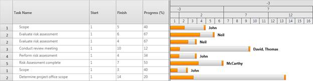
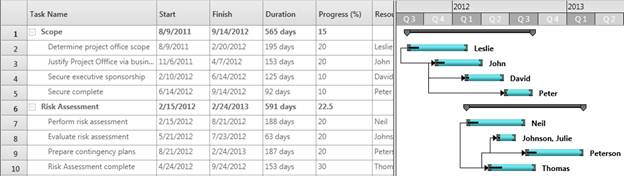

::: {style="DISPLAY: none"}
{#d2h_url_template}{#d2h_package_url style="WIDTH: 0px; DISPLAY: none; HEIGHT: 0px"}
:::

::::: {#nsbanner .d2h_main_nsbanner style="BORDER-BOTTOM: #999999 1px solid; POSITION: relative; PADDING-BOTTOM: 0px; BACKGROUND-COLOR: transparent; PADDING-LEFT: 0px; PADDING-RIGHT: 0px; DISPLAY: none; BORDER-TOP: #999999 1px solid; PADDING-TOP: 0px; LEFT: 0px"}
:::: {#TitleRow .d2h_main_titlerow style="PADDING-BOTTOM: 4px; BACKGROUND-COLOR: transparent; PADDING-LEFT: 22px; WIDTH: 100%; PADDING-RIGHT: 10px; DISPLAY: none; PADDING-TOP: 4px"}
::: {#ienav .d2h_main_ienav style="DISPLAY: none"}
{#D2HPrevious .D2HPreviousEnabled}  {#D2HNext .D2HNextEnabled}
:::
::::
:::::

::::::: {#nstext .d2h_main_nstext style="PADDING-BOTTOM: 10px; BACKGROUND-COLOR: transparent; PADDING-LEFT: 22px; PADDING-RIGHT: 10px; HEIGHT: 100%; OVERFLOW: auto; PADDING-TOP: 5px" hasuserbackground="true" valign="bottom"}
::: {#d2h_breadcrumbs .d2h_breadcrumbs}
[Essential Studio User Guide Documentation](ms-xhelp:///?Id=12457748-09e3-4d74-a240-8e049cedf030){.d2h_breadcrumbsNormal}[ \> ]{.d2h_breadcrumbsLinkSeparator}[User Interface Edition](ms-xhelp:///?Id=c29296b7-531c-413b-a0ec-488ca1f7f669){.d2h_breadcrumbsNormal}[ \> ]{.d2h_breadcrumbsLinkSeparator}[Essential Silverlight](ms-xhelp:///?Id=66221bd1-ba2e-43c2-94a7-618f50e01d24){.d2h_breadcrumbsNormal}[ \> ]{.d2h_breadcrumbsLinkSeparator}[Essential Gantt]{.d2h_breadcrumbsContentsOnly}[ \> ]{.d2h_breadcrumbsLinkSeparator}[Concepts and Features](ms-xhelp:///?Id=00182e64-b79e-45a4-817a-bc3646aff2c1){.d2h_breadcrumbsNormal}
:::

## Custom Schedule {#custom-schedule style="tab-stops: 0pt"}

Essential Gantt provides the custom schedule support that allows you to define your own schedule for Gantt to track the progress of projects. You can define the schedule for any measurement unit or for different types of date time formats such as quarterly basis scale and so on, with this feature.

This feature will get information from users and draw the Gantt schedule with the obtained information. Custom schedule has been split into two types namely:

 

[·      ]{style="FONT-FAMILY: Symbol"}Custom Numeric

[·      ]{style="FONT-FAMILY: Symbol"}Custom DateTime

These types are included in the existing SchduleType enum.

 

Custom Numeric:

Custom Numeric schedule is to define your own schedule with any numeric measurement unit other than date time. With this schedule, you can track the progress of your projects based on your own measurement, and need not depend on Date Time. Two new API's are added to the Mapping attributes in order to support this schedule in GanttChart and GanttGrid.

 

Custom DateTime:

Custom DateTime schedule is to define your own date time schedule, which can match your current financial calendar. In case you need the schedule on quarterly basis, then you can use this schedule type to define the custom schedule.

In both the custom schedules, Gantt will get the information from the application to render the schedule. Gantt will accept the custom schedule information in the form of a collection of "GanttScheduleRowInfo" objects, and process it to draw the schedule.

 

GanttScheduleRowInfo class will have following fields:

**PixelsPerUnit** -- Gets the information about the pixel value equivalent to one unit in custom measurement.

 

**CellsPerUnit** -- Gets the information about a cell size of the preceding row in the schedule based on the immediate next row. In CustomDateTime Schedule, CellsPerUnit will be used to customize the cell. For example, in quarterly basis month cell, you need to draw a cell by consolidating three months. For this, you need to define the CellsPerUnit of that corresponding row as 3.

 

**TimeUnit** -- Gets the information about the type of row, when the schedule type is CustomDateTime. The Time unit can be any one of the following:

 

[·      ]{style="FONT-FAMILY: Symbol"}Days -- represents the corresponding row as day's row

[·      ]{style="FONT-FAMILY: Symbol"}Weeks -- represents the corresponding row as week's row

[·      ]{style="FONT-FAMILY: Symbol"}Months -- represents the corresponding row as month's row

[·      ]{style="FONT-FAMILY: Symbol"}Years -- represents the corresponding row as year's row

[**[]{style="COLOR: black"}**]{.apple-style-span} 

Use Case Scenarios

[[This will be useful when users like to define their schedules with their own measurements or calendars.]{style="COLOR: black"}]{.apple-style-span}

**Example 1:** Research organizations may follow different measurements to track their work progress. The measurements will depend on their products. In such a scenario, they can use CustomNumeric schedule to define schedules with their own measures.

 

**Example 2:** A very big construction project many have the time period of many years or months and so they need some customized way of date time schedule to track their progress. In this scenario, they can use the CustomDateTime schedule to customize their schedule.  The schedule can have the time scale on quarterly basis to track their progress.

[**[]{style="COLOR: black"}**]{.apple-style-span} 

[Properties]{.apple-style-span}

Table 1: Properties Table

::: {align="center"}
  ---------------------- ------------------------------------------------------ -------------------- -------------------------------
  Property               Description                                            Type                 Data Type
  CustomScheduleSource   Gets/Sets the custom schedule items Source of Gantt.   DependencyProperty   IList\<GanttScheduleRowInfo\>
  ---------------------- ------------------------------------------------------ -------------------- -------------------------------
:::

[**[]{style="COLOR: black"}**]{.apple-style-span} 

[Events]{.apple-style-span}

Table: ScheduleCellCrated Event Table

::: {align="center"}
+---------------------+--------------------------------------------------------------------------------------------------------------------------------------------------------------+-----------------------------------------------------------------------+-----------------+
| Event               | Description                                                                                                                                                  | Arguments                                                             | Type            |
+---------------------+--------------------------------------------------------------------------------------------------------------------------------------------------------------+-----------------------------------------------------------------------+-----------------+
| ScheduleCellCreated | Whenever a schedule cell is created, this event is triggered. The handler of the event will have the newly created cell (GanttScheduleCell) in the argument. | ScheduleCellCreated(object sender, ScheduleCellCreatedEventArgs args) | Routed Event    |
|                     |                                                                                                                                                              |                                                                       |                 |
|                     | By handling this event, users can customize the appearance of the cell.                                                                                      |                                                                       |                 |
+=====================+==============================================================================================================================================================+=======================================================================+=================+
:::

[[]{style="COLOR: black"}]{.apple-style-span} 

GanttScheduleCell Class

The properties of the GanttScheduleCell class are as tabulated:

[**[]{style="COLOR: black"}**]{.apple-style-span} 

::: {align="center"}
+-----------------+------------------------------------------------------------------------------+---------------------+-----------------+
| Property        | Description                                                                  | Type                | Data Type       |
+-----------------+------------------------------------------------------------------------------+---------------------+-----------------+
| CellDate        | Gets/Sets the current schedule cell date in the datetime schedule.           | Dependency Property | DateTime        |
+-----------------+------------------------------------------------------------------------------+---------------------+-----------------+
|                 | Gets/Sets the current schedule cell tool tip.                                | Dependency Property | Object          |
|                 |                                                                              |                     |                 |
| CellToolTip     |                                                                              |                     |                 |
+-----------------+------------------------------------------------------------------------------+---------------------+-----------------+
| CellTimeUnit    | Gets/Sets the current schedule row time unit (like weeks, months and so on). | Dependency Property | TimeUnit (Enum) |
+-----------------+------------------------------------------------------------------------------+---------------------+-----------------+
| Content         | Gets/Sets the current schedule cell content                                  | Dependency Property | Object          |
+-----------------+------------------------------------------------------------------------------+---------------------+-----------------+
:::

 

Adding Custom Schedule to an Application

To add CustomNumeric Schedule to an application:

1.   Define the Mapping for StartPointMapping and FinishPointMapping in TaskAttributeMapping.

2.   Set the Gantt Schedule type as CustomNumeric.

3.   Bind the GanttScheduleRowInfo collection to the **CustomScheduleSource** property of Gantt.

The following code illustrates this:

+------------------------------------------------------------------------------------------------------------------------------------------------------------------------------------------------------------------------------------------------------------------------------------------------------------------------------------------------------------------------------------------------------------------------------------------------------------------------------------------------------------------------------------------------------------------------------------------------------------------------------------------------+
| **[\[XAML\]]{style="FONT-FAMILY: 'Courier New'"}**                                                                                                                                                                                                                                                                                                                                                                                                                                                                                                                                                                                             |
|                                                                                                                                                                                                                                                                                                                                                                                                                                                                                                                                                                                                                                                |
| []{style="FONT-FAMILY: Consolas; COLOR: #a31515"}[]{style="FONT-FAMILY: Consolas; COLOR: #a31515; FONT-SIZE: 9.5pt"}                                                                                                                                                                                                                                                                                                                                                                                                                                                                                                                           |
|                                                                                                                                                                                                                                                                                                                                                                                                                                                                                                                                                                                                                                                |
| [   ]{style="FONT-FAMILY: Consolas; COLOR: #a31515; FONT-SIZE: 9.5pt"}[ \<]{style="FONT-FAMILY: Consolas; COLOR: blue; FONT-SIZE: 9.5pt"}[sync]{style="FONT-FAMILY: Consolas; COLOR: #a31515; FONT-SIZE: 9.5pt"}[:]{style="FONT-FAMILY: Consolas; COLOR: blue; FONT-SIZE: 9.5pt"}[GanttControl]{style="FONT-FAMILY: Consolas; COLOR: #a31515; FONT-SIZE: 9.5pt"}[ Grid.Row]{style="FONT-FAMILY: Consolas; COLOR: red; FONT-SIZE: 9.5pt"}[=\"1\"]{style="FONT-FAMILY: Consolas; COLOR: blue; FONT-SIZE: 9.5pt"}[ [ScheduleType]{style="COLOR: red"}[=\"CustomNumeric\"]{style="COLOR: blue"} ]{style="FONT-FAMILY: Consolas; FONT-SIZE: 9.5pt"} |
|                                                                                                                                                                                                                                                                                                                                                                                                                                                                                                                                                                                                                                                |
| [              [ x]{style="COLOR: red"}[:]{style="COLOR: blue"}[Name]{style="COLOR: red"}[=\"Gantt\"]{style="COLOR: blue"}[ VisualStyle]{style="COLOR: red"}[=\"Office2010Black\"\>]{style="COLOR: blue"}]{style="FONT-FAMILY: Consolas; FONT-SIZE: 9.5pt"}                                                                                                                                                                                                                                                                                                                                                                                    |
|                                                                                                                                                                                                                                                                                                                                                                                                                                                                                                                                                                                                                                                |
| [                ]{style="FONT-FAMILY: Consolas; COLOR: #a31515; FONT-SIZE: 9.5pt"}[\<]{style="FONT-FAMILY: Consolas; COLOR: blue; FONT-SIZE: 9.5pt"}[sync]{style="FONT-FAMILY: Consolas; COLOR: #a31515; FONT-SIZE: 9.5pt"}[:]{style="FONT-FAMILY: Consolas; COLOR: blue; FONT-SIZE: 9.5pt"}[GanttControl.TaskAttributeMapping]{style="FONT-FAMILY: Consolas; COLOR: #a31515; FONT-SIZE: 9.5pt"}[\>]{style="FONT-FAMILY: Consolas; COLOR: blue; FONT-SIZE: 9.5pt"}[]{style="FONT-FAMILY: Consolas; FONT-SIZE: 9.5pt"}                                                                                                                         |
|                                                                                                                                                                                                                                                                                                                                                                                                                                                                                                                                                                                                                                                |
| [                    ]{style="FONT-FAMILY: Consolas; COLOR: #a31515; FONT-SIZE: 9.5pt"}[\<]{style="FONT-FAMILY: Consolas; COLOR: blue; FONT-SIZE: 9.5pt"}[sync]{style="FONT-FAMILY: Consolas; COLOR: #a31515; FONT-SIZE: 9.5pt"}[:]{style="FONT-FAMILY: Consolas; COLOR: blue; FONT-SIZE: 9.5pt"}[TaskAttributeMapping]{style="FONT-FAMILY: Consolas; COLOR: #a31515; FONT-SIZE: 9.5pt"}[ ]{style="FONT-FAMILY: Consolas; FONT-SIZE: 9.5pt"}                                                                                                                                                                                                   |
|                                                                                                                                                                                                                                                                                                                                                                                                                                                                                                                                                                                                                                                |
| [                       [ TaskIdMapping]{style="COLOR: red"}[=\"Id\"]{style="COLOR: blue"}                                            ]{style="FONT-FAMILY: Consolas; FONT-SIZE: 9.5pt"}                                                                                                                                                                                                                                                                                                                                                                                                                                                       |
|                                                                                                                                                                                                                                                                                                                                                                                                                                                                                                                                                                                                                                                |
| [                       [ TaskNameMapping]{style="COLOR: red"}[=\"Name\"]{style="COLOR: blue"}                                        ]{style="FONT-FAMILY: Consolas; FONT-SIZE: 9.5pt"}                                                                                                                                                                                                                                                                                                                                                                                                                                                       |
|                                                                                                                                                                                                                                                                                                                                                                                                                                                                                                                                                                                                                                                |
| [                       [ StartPointMapping]{style="COLOR: red"}[=\"Start\"]{style="COLOR: blue"}                                               ]{style="FONT-FAMILY: Consolas; FONT-SIZE: 9.5pt"}                                                                                                                                                                                                                                                                                                                                                                                                                                             |
|                                                                                                                                                                                                                                                                                                                                                                                                                                                                                                                                                                                                                                                |
| [                       [ FinishPointMapping]{style="COLOR: red"}[=\"End\"]{style="COLOR: blue"}                                            ]{style="FONT-FAMILY: Consolas; FONT-SIZE: 9.5pt"}                                                                                                                                                                                                                                                                                                                                                                                                                                                 |
|                                                                                                                                                                                                                                                                                                                                                                                                                                                                                                                                                                                                                                                |
| [                       [ ChildMapping]{style="COLOR: red"}[=\"ChildTask\"]{style="COLOR: blue"}                                                ]{style="FONT-FAMILY: Consolas; FONT-SIZE: 9.5pt"}                                                                                                                                                                                                                                                                                                                                                                                                                                             |
|                                                                                                                                                                                                                                                                                                                                                                                                                                                                                                                                                                                                                                                |
| [                       [ ProgressMapping]{style="COLOR: red"}[=\"Complete\"]{style="COLOR: blue"}]{style="FONT-FAMILY: Consolas; FONT-SIZE: 9.5pt"}                                                                                                                                                                                                                                                                                                                                                                                                                                                                                           |
|                                                                                                                                                                                                                                                                                                                                                                                                                                                                                                                                                                                                                                                |
| [                       [ ResourceInfoMapping]{style="COLOR: red"}[=\"Resource\"\>]{style="COLOR: blue"}]{style="FONT-FAMILY: Consolas; FONT-SIZE: 9.5pt"}                                                                                                                                                                                                                                                                                                                                                                                                                                                                                     |
|                                                                                                                                                                                                                                                                                                                                                                                                                                                                                                                                                                                                                                                |
| [                    ]{style="FONT-FAMILY: Consolas; COLOR: #a31515; FONT-SIZE: 9.5pt"}[\</]{style="FONT-FAMILY: Consolas; COLOR: blue; FONT-SIZE: 9.5pt"}[sync]{style="FONT-FAMILY: Consolas; COLOR: #a31515; FONT-SIZE: 9.5pt"}[:]{style="FONT-FAMILY: Consolas; COLOR: blue; FONT-SIZE: 9.5pt"}[TaskAttributeMapping]{style="FONT-FAMILY: Consolas; COLOR: #a31515; FONT-SIZE: 9.5pt"}[\>]{style="FONT-FAMILY: Consolas; COLOR: blue; FONT-SIZE: 9.5pt"}[]{style="FONT-FAMILY: Consolas; FONT-SIZE: 9.5pt"}                                                                                                                                 |
|                                                                                                                                                                                                                                                                                                                                                                                                                                                                                                                                                                                                                                                |
| [                ]{style="FONT-FAMILY: Consolas; COLOR: #a31515; FONT-SIZE: 9.5pt"}[\</]{style="FONT-FAMILY: Consolas; COLOR: blue; FONT-SIZE: 9.5pt"}[sync]{style="FONT-FAMILY: Consolas; COLOR: #a31515; FONT-SIZE: 9.5pt"}[:]{style="FONT-FAMILY: Consolas; COLOR: blue; FONT-SIZE: 9.5pt"}[GanttControl.TaskAttributeMapping]{style="FONT-FAMILY: Consolas; COLOR: #a31515; FONT-SIZE: 9.5pt"}[\>]{style="FONT-FAMILY: Consolas; COLOR: blue; FONT-SIZE: 9.5pt"}                                                                                                                                                                           |
|                                                                                                                                                                                                                                                                                                                                                                                                                                                                                                                                                                                                                                                |
| [  ]{style="FONT-FAMILY: 'Courier New'"}                                                                                                                                                                                                                                                                                                                                                                                                                                                                                                                                                                                                       |
+------------------------------------------------------------------------------------------------------------------------------------------------------------------------------------------------------------------------------------------------------------------------------------------------------------------------------------------------------------------------------------------------------------------------------------------------------------------------------------------------------------------------------------------------------------------------------------------------------------------------------------------------+

 

+------------------------------------------------------------------------------------------------------------------------------------------------------------------------------------------------------------------------------------------+
| **[\[C#\]]{style="FONT-FAMILY: Consolas; FONT-SIZE: 9.5pt"}**                                                                                                                                                                            |
|                                                                                                                                                                                                                                          |
| **[]{style="FONT-FAMILY: Consolas; FONT-SIZE: 9.5pt"}**                                                                                                                                                                                  |
|                                                                                                                                                                                                                                          |
| [   // Assigning the custom schedule Items Source]{style="FONT-FAMILY: Consolas; COLOR: green; FONT-SIZE: 9.5pt"}**[]{style="FONT-FAMILY: Consolas; FONT-SIZE: 9.5pt"}**                                                                 |
|                                                                                                                                                                                                                                          |
| [   this]{style="FONT-FAMILY: Consolas; COLOR: blue; FONT-SIZE: 9.5pt"}[.Gantt.CustomScheduleSource = [this]{style="COLOR: blue"}.GetInfo();   ]{style="FONT-FAMILY: Consolas; FONT-SIZE: 9.5pt"}                                        |
|                                                                                                                                                                                                                                          |
| []{style="FONT-FAMILY: Consolas; FONT-SIZE: 9.5pt"}                                                                                                                                                                                      |
|                                                                                                                                                                                                                                          |
| [   [///]{style="COLOR: gray"}[ Gets the Numeric Schedule Items Info]{style="COLOR: green"}        ]{style="FONT-FAMILY: Consolas; FONT-SIZE: 9.5pt"}                                                                                    |
|                                                                                                                                                                                                                                          |
| [   [private]{style="COLOR: blue"} [ObservableCollection]{style="COLOR: #2b91af"}\<[GanttScheduleRowInfo]{style="COLOR: #2b91af"}\> GetInfo()]{style="FONT-FAMILY: Consolas; FONT-SIZE: 9.5pt"}                                          |
|                                                                                                                                                                                                                                          |
| [   {]{style="FONT-FAMILY: Consolas; FONT-SIZE: 9.5pt"}                                                                                                                                                                                  |
|                                                                                                                                                                                                                                          |
| [       [// Creating a new collection]{style="COLOR: green"}]{style="FONT-FAMILY: Consolas; FONT-SIZE: 9.5pt"}                                                                                                                           |
|                                                                                                                                                                                                                                          |
| [       [ObservableCollection]{style="COLOR: #2b91af"}\<[GanttScheduleRowInfo]{style="COLOR: #2b91af"}\> RowInfo = [new]{style="COLOR: blue"}]{style="FONT-FAMILY: Consolas; FONT-SIZE: 9.5pt"}                                          |
|                                                                                                                                                                                                                                          |
| [                                         ObservableCollection]{style="FONT-FAMILY: Consolas; COLOR: #2b91af; FONT-SIZE: 9.5pt"}[\<[GanttScheduleRowInfo]{style="COLOR: #2b91af"}\>();]{style="FONT-FAMILY: Consolas; FONT-SIZE: 9.5pt"} |
|                                                                                                                                                                                                                                          |
| []{style="FONT-FAMILY: Consolas; FONT-SIZE: 9.5pt"}                                                                                                                                                                                      |
|                                                                                                                                                                                                                                          |
| [       [// Defining the top most row of the schedule ]{style="COLOR: green"}]{style="FONT-FAMILY: Consolas; FONT-SIZE: 9.5pt"}                                                                                                          |
|                                                                                                                                                                                                                                          |
| [       RowInfo.Add([new]{style="COLOR: blue"} [GanttScheduleRowInfo]{style="COLOR: #2b91af"}() { CellsPerUnit = 3 });]{style="FONT-FAMILY: Consolas; FONT-SIZE: 9.5pt"}                                                                 |
|                                                                                                                                                                                                                                          |
| []{style="FONT-FAMILY: Consolas; FONT-SIZE: 9.5pt"}                                                                                                                                                                                      |
|                                                                                                                                                                                                                                          |
| [       [// Defining the consecutive rows of the schedule]{style="COLOR: green"}]{style="FONT-FAMILY: Consolas; FONT-SIZE: 9.5pt"}                                                                                                       |
|                                                                                                                                                                                                                                          |
| [       RowInfo.Add([new]{style="COLOR: blue"} [GanttScheduleRowInfo]{style="COLOR: #2b91af"}() { CellsPerUnit = 2 });]{style="FONT-FAMILY: Consolas; FONT-SIZE: 9.5pt"}                                                                 |
|                                                                                                                                                                                                                                          |
| [       RowInfo.Add([new]{style="COLOR: blue"} [GanttScheduleRowInfo]{style="COLOR: #2b91af"}() { CellsPerUnit = 5 });]{style="FONT-FAMILY: Consolas; FONT-SIZE: 9.5pt"}                                                                 |
|                                                                                                                                                                                                                                          |
| [       ]{style="FONT-FAMILY: Consolas; FONT-SIZE: 9.5pt"}                                                                                                                                                                               |
|                                                                                                                                                                                                                                          |
| [       [// Defining the bottom most row of the schedule]{style="COLOR: green"}]{style="FONT-FAMILY: Consolas; FONT-SIZE: 9.5pt"}                                                                                                        |
|                                                                                                                                                                                                                                          |
| [       [// Here we are setting the cell width in pixels]{style="COLOR: green"}]{style="FONT-FAMILY: Consolas; FONT-SIZE: 9.5pt"}                                                                                                        |
|                                                                                                                                                                                                                                          |
| [       RowInfo.Add([new]{style="COLOR: blue"} [GanttScheduleRowInfo]{style="COLOR: #2b91af"}() { PixelsPerUnit = 30d });]{style="FONT-FAMILY: Consolas; FONT-SIZE: 9.5pt"}                                                              |
|                                                                                                                                                                                                                                          |
| []{style="FONT-FAMILY: Consolas; FONT-SIZE: 9.5pt"}                                                                                                                                                                                      |
|                                                                                                                                                                                                                                          |
| [       [return]{style="COLOR: blue"} RowInfo;]{style="FONT-FAMILY: Consolas; FONT-SIZE: 9.5pt"}                                                                                                                                         |
|                                                                                                                                                                                                                                          |
| [   }   ]{style="FONT-FAMILY: Consolas; FONT-SIZE: 9.5pt"}                                                                                                                                                                               |
|                                                                                                                                                                                                                                          |
|                                                                                                                                                                                                                                          |
+------------------------------------------------------------------------------------------------------------------------------------------------------------------------------------------------------------------------------------------+

 

 

{border="0"}

Figure 28

**[]{style="FONT-FAMILY: 'Arial','sans-serif'; COLOR: black; FONT-SIZE: 10pt"}** 

Samples

To view samples:

1.   Select **Start** -\> **Programs** -\> **Syncfusion** -\> **Essential Studio x.x.xx** -\> **Dashboard**.

2.   Click[[ ]{style="COLOR: black"}]{.apple-converted-space}**Run Samples**[[ ]{style="COLOR: black"}]{.apple-converted-space}for WPF under **User Interface Edition** panel.

3.   Select[[ ]{style="COLOR: black"}]{.apple-converted-space}**Gantt**.

4.   Expand the **Custom Schedule** item in the **Sample Browser**.

5.   Choose the **Custom Numeric Schedule** sample to launch.

[]{style="COLOR: black"} 

Adding CustomDateTime Schedule to an Application

To add CustomDateTime Schedule to an application:

1.   Define the **Gantt Schedule** type as **CustomDateTime**.

2.   Bind the **GanttScheduleRowInfo** collection to the **CustomScheduleSource** property of the Gantt.

The following code illustrates this:

 

+-------------------------------------------------------------------------------------------------------------------------------------------------------------------------------------------------------------------------------------------------------------------------------------------------------------------------------------------------------------------------------------------------------------------------------------------------------------------------------------------------------------------------------------------------------------------------------------------------------------------------------------------------------+
| **[\[XAML\]]{style="FONT-FAMILY: 'Courier New'"}**                                                                                                                                                                                                                                                                                                                                                                                                                                                                                                                                                                                                    |
|                                                                                                                                                                                                                                                                                                                                                                                                                                                                                                                                                                                                                                                       |
| []{style="FONT-FAMILY: Consolas; COLOR: #a31515"}[]{style="FONT-FAMILY: Consolas; COLOR: #a31515; FONT-SIZE: 9.5pt"}                                                                                                                                                                                                                                                                                                                                                                                                                                                                                                                                  |
|                                                                                                                                                                                                                                                                                                                                                                                                                                                                                                                                                                                                                                                       |
| [   ]{style="FONT-FAMILY: Consolas; COLOR: #a31515; FONT-SIZE: 9.5pt"}[ \<]{style="FONT-FAMILY: Consolas; COLOR: blue; FONT-SIZE: 9.5pt"}[sync]{style="FONT-FAMILY: Consolas; COLOR: #a31515; FONT-SIZE: 9.5pt"}[:]{style="FONT-FAMILY: Consolas; COLOR: blue; FONT-SIZE: 9.5pt"}[GanttControl]{style="FONT-FAMILY: Consolas; COLOR: #a31515; FONT-SIZE: 9.5pt"}[ Grid.Row]{style="FONT-FAMILY: Consolas; COLOR: red; FONT-SIZE: 9.5pt"}[=\"1\"]{style="FONT-FAMILY: Consolas; COLOR: blue; FONT-SIZE: 9.5pt"}[ ]{style="FONT-FAMILY: Consolas; COLOR: red; FONT-SIZE: 9.5pt"}                                                                        |
|                                                                                                                                                                                                                                                                                                                                                                                                                                                                                                                                                                                                                                                       |
| [                x]{style="FONT-FAMILY: Consolas; COLOR: red; FONT-SIZE: 9.5pt"}[:]{style="FONT-FAMILY: Consolas; COLOR: blue; FONT-SIZE: 9.5pt"}[Name]{style="FONT-FAMILY: Consolas; COLOR: red; FONT-SIZE: 9.5pt"}[=\"Gantt\"]{style="FONT-FAMILY: Consolas; COLOR: blue; FONT-SIZE: 9.5pt"}[ ScheduleType]{style="FONT-FAMILY: Consolas; COLOR: red; FONT-SIZE: 9.5pt"}[=\"CustomDateTime\"]{style="FONT-FAMILY: Consolas; COLOR: blue; FONT-SIZE: 9.5pt"}[ [                                                                                                              ]{style="COLOR: red"}]{style="FONT-FAMILY: Consolas; FONT-SIZE: 9.5pt"} |
|                                                                                                                                                                                                                                                                                                                                                                                                                                                                                                                                                                                                                                                       |
| [                VisualStyle]{style="FONT-FAMILY: Consolas; COLOR: red; FONT-SIZE: 9.5pt"}[=\"Office2010Black\"]{style="FONT-FAMILY: Consolas; COLOR: blue; FONT-SIZE: 9.5pt"}                                                                                                                                                                                                                                                                                                                                                                                                                                                                        |
|                                                                                                                                                                                                                                                                                                                                                                                                                                                                                                                                                                                                                                                       |
| [                ItemsSource]{style="FONT-FAMILY: Consolas; COLOR: red; FONT-SIZE: 9.5pt"}[=\"{]{style="FONT-FAMILY: Consolas; COLOR: blue; FONT-SIZE: 9.5pt"}[Binding]{style="FONT-FAMILY: Consolas; COLOR: #a31515; FONT-SIZE: 9.5pt"}[ GanttItemSource]{style="FONT-FAMILY: Consolas; COLOR: red; FONT-SIZE: 9.5pt"}[}\"]{style="FONT-FAMILY: Consolas; COLOR: blue; FONT-SIZE: 9.5pt"}[ ShowChartLines]{style="FONT-FAMILY: Consolas; COLOR: red; FONT-SIZE: 9.5pt"}[=\"False\"]{style="FONT-FAMILY: Consolas; COLOR: blue; FONT-SIZE: 9.5pt"}                                                                                                    |
|                                                                                                                                                                                                                                                                                                                                                                                                                                                                                                                                                                                                                                                       |
| [               ]{style="FONT-FAMILY: Consolas; COLOR: blue; FONT-SIZE: 9.5pt"}[ ShowNonWorkingHoursBackground]{style="FONT-FAMILY: Consolas; COLOR: red; FONT-SIZE: 9.5pt"}[=\"False\"]{style="FONT-FAMILY: Consolas; COLOR: blue; FONT-SIZE: 9.5pt"}                                                                                                                                                                                                                                                                                                                                                                                                |
|                                                                                                                                                                                                                                                                                                                                                                                                                                                                                                                                                                                                                                                       |
| [               ]{style="FONT-FAMILY: Consolas; COLOR: blue; FONT-SIZE: 9.5pt"}[ ToolTipTemplate]{style="FONT-FAMILY: Consolas; COLOR: red; FONT-SIZE: 9.5pt"}[=\"{]{style="FONT-FAMILY: Consolas; COLOR: blue; FONT-SIZE: 9.5pt"}[StaticResource]{style="FONT-FAMILY: Consolas; COLOR: #a31515; FONT-SIZE: 9.5pt"}[ toolTipTemplate]{style="FONT-FAMILY: Consolas; COLOR: red; FONT-SIZE: 9.5pt"}[}\"]{style="FONT-FAMILY: Consolas; COLOR: blue; FONT-SIZE: 9.5pt"}[\>]{style="FONT-FAMILY: Consolas; FONT-SIZE: 9.5pt"}                                                                                                                            |
|                                                                                                                                                                                                                                                                                                                                                                                                                                                                                                                                                                                                                                                       |
| [                ]{style="FONT-FAMILY: Consolas; COLOR: #a31515; FONT-SIZE: 9.5pt"}[\<]{style="FONT-FAMILY: Consolas; COLOR: blue; FONT-SIZE: 9.5pt"}[sync]{style="FONT-FAMILY: Consolas; COLOR: #a31515; FONT-SIZE: 9.5pt"}[:]{style="FONT-FAMILY: Consolas; COLOR: blue; FONT-SIZE: 9.5pt"}[GanttControl.TaskAttributeMapping]{style="FONT-FAMILY: Consolas; COLOR: #a31515; FONT-SIZE: 9.5pt"}[\>]{style="FONT-FAMILY: Consolas; COLOR: blue; FONT-SIZE: 9.5pt"}[]{style="FONT-FAMILY: Consolas; FONT-SIZE: 9.5pt"}                                                                                                                                |
|                                                                                                                                                                                                                                                                                                                                                                                                                                                                                                                                                                                                                                                       |
| [                    ]{style="FONT-FAMILY: Consolas; COLOR: #a31515; FONT-SIZE: 9.5pt"}[\<]{style="FONT-FAMILY: Consolas; COLOR: blue; FONT-SIZE: 9.5pt"}[sync]{style="FONT-FAMILY: Consolas; COLOR: #a31515; FONT-SIZE: 9.5pt"}[:]{style="FONT-FAMILY: Consolas; COLOR: blue; FONT-SIZE: 9.5pt"}[TaskAttributeMapping]{style="FONT-FAMILY: Consolas; COLOR: #a31515; FONT-SIZE: 9.5pt"}[ TaskIdMapping]{style="FONT-FAMILY: Consolas; COLOR: red; FONT-SIZE: 9.5pt"}[=\"Id\"]{style="FONT-FAMILY: Consolas; COLOR: blue; FONT-SIZE: 9.5pt"}[]{style="FONT-FAMILY: Consolas; FONT-SIZE: 9.5pt"}                                                       |
|                                                                                                                                                                                                                                                                                                                                                                                                                                                                                                                                                                                                                                                       |
| [                                           [ TaskNameMapping]{style="COLOR: red"}[=\"Name\"]{style="COLOR: blue"}]{style="FONT-FAMILY: Consolas; FONT-SIZE: 9.5pt"}                                                                                                                                                                                                                                                                                                                                                                                                                                                                                  |
|                                                                                                                                                                                                                                                                                                                                                                                                                                                                                                                                                                                                                                                       |
| [                                           [ StartDateMapping]{style="COLOR: red"}[=\"StDate\"]{style="COLOR: blue"} ]{style="FONT-FAMILY: Consolas; FONT-SIZE: 9.5pt"}                                                                                                                                                                                                                                                                                                                                                                                                                                                                              |
|                                                                                                                                                                                                                                                                                                                                                                                                                                                                                                                                                                                                                                                       |
| [                                           [ ChildMapping]{style="COLOR: red"}[=\"ChildTask\"]{style="COLOR: blue"}]{style="FONT-FAMILY: Consolas; FONT-SIZE: 9.5pt"}                                                                                                                                                                                                                                                                                                                                                                                                                                                                                |
|                                                                                                                                                                                                                                                                                                                                                                                                                                                                                                                                                                                                                                                       |
| [                                           [ FinishDateMapping]{style="COLOR: red"}[=\"EndDate\"]{style="COLOR: blue"}]{style="FONT-FAMILY: Consolas; FONT-SIZE: 9.5pt"}                                                                                                                                                                                                                                                                                                                                                                                                                                                                             |
|                                                                                                                                                                                                                                                                                                                                                                                                                                                                                                                                                                                                                                                       |
| [                                           [ DurationMapping]{style="COLOR: red"}[=\"Duration\"]{style="COLOR: blue"}                                            ]{style="FONT-FAMILY: Consolas; FONT-SIZE: 9.5pt"}                                                                                                                                                                                                                                                                                                                                                                                                                                  |
|                                                                                                                                                                                                                                                                                                                                                                                                                                                                                                                                                                                                                                                       |
| [                                           [ ProgressMapping]{style="COLOR: red"}[=\"Complete\"]{style="COLOR: blue"}]{style="FONT-FAMILY: Consolas; FONT-SIZE: 9.5pt"}                                                                                                                                                                                                                                                                                                                                                                                                                                                                              |
|                                                                                                                                                                                                                                                                                                                                                                                                                                                                                                                                                                                                                                                       |
| [                                           [ ResourceInfoMapping]{style="COLOR: red"}[=\"Resource\"]{style="COLOR: blue"}]{style="FONT-FAMILY: Consolas; FONT-SIZE: 9.5pt"}                                                                                                                                                                                                                                                                                                                                                                                                                                                                          |
|                                                                                                                                                                                                                                                                                                                                                                                                                                                                                                                                                                                                                                                       |
| [                                           [ PredecessorMapping]{style="COLOR: red"}[=\"Predecessor\"]{style="COLOR: blue"}]{style="FONT-FAMILY: Consolas; FONT-SIZE: 9.5pt"}                                                                                                                                                                                                                                                                                                                                                                                                                                                                        |
|                                                                                                                                                                                                                                                                                                                                                                                                                                                                                                                                                                                                                                                       |
| [                                           [ \>]{style="COLOR: blue"}]{style="FONT-FAMILY: Consolas; FONT-SIZE: 9.5pt"}                                                                                                                                                                                                                                                                                                                                                                                                                                                                                                                              |
|                                                                                                                                                                                                                                                                                                                                                                                                                                                                                                                                                                                                                                                       |
| [                    ]{style="FONT-FAMILY: Consolas; COLOR: #a31515; FONT-SIZE: 9.5pt"}[\</]{style="FONT-FAMILY: Consolas; COLOR: blue; FONT-SIZE: 9.5pt"}[sync]{style="FONT-FAMILY: Consolas; COLOR: #a31515; FONT-SIZE: 9.5pt"}[:]{style="FONT-FAMILY: Consolas; COLOR: blue; FONT-SIZE: 9.5pt"}[TaskAttributeMapping]{style="FONT-FAMILY: Consolas; COLOR: #a31515; FONT-SIZE: 9.5pt"}[\>]{style="FONT-FAMILY: Consolas; COLOR: blue; FONT-SIZE: 9.5pt"}[]{style="FONT-FAMILY: Consolas; FONT-SIZE: 9.5pt"}                                                                                                                                        |
|                                                                                                                                                                                                                                                                                                                                                                                                                                                                                                                                                                                                                                                       |
| [                ]{style="FONT-FAMILY: Consolas; COLOR: #a31515; FONT-SIZE: 9.5pt"}[\</]{style="FONT-FAMILY: Consolas; COLOR: blue; FONT-SIZE: 9.5pt"}[sync]{style="FONT-FAMILY: Consolas; COLOR: #a31515; FONT-SIZE: 9.5pt"}[:]{style="FONT-FAMILY: Consolas; COLOR: blue; FONT-SIZE: 9.5pt"}[GanttControl.TaskAttributeMapping]{style="FONT-FAMILY: Consolas; COLOR: #a31515; FONT-SIZE: 9.5pt"}[\>]{style="FONT-FAMILY: Consolas; COLOR: blue; FONT-SIZE: 9.5pt"}[]{style="FONT-FAMILY: Consolas; FONT-SIZE: 9.5pt"}                                                                                                                               |
|                                                                                                                                                                                                                                                                                                                                                                                                                                                                                                                                                                                                                                                       |
| [            ]{style="FONT-FAMILY: Consolas; COLOR: #a31515; FONT-SIZE: 9.5pt"}[\</]{style="FONT-FAMILY: Consolas; COLOR: blue; FONT-SIZE: 9.5pt"}[sync]{style="FONT-FAMILY: Consolas; COLOR: #a31515; FONT-SIZE: 9.5pt"}[:]{style="FONT-FAMILY: Consolas; COLOR: blue; FONT-SIZE: 9.5pt"}[GanttControl]{style="FONT-FAMILY: Consolas; COLOR: #a31515; FONT-SIZE: 9.5pt"}[\>]{style="FONT-FAMILY: Consolas; COLOR: blue; FONT-SIZE: 9.5pt"}                                                                                                                                                                                                           |
|                                                                                                                                                                                                                                                                                                                                                                                                                                                                                                                                                                                                                                                       |
| [  ]{style="FONT-FAMILY: 'Courier New'"}                                                                                                                                                                                                                                                                                                                                                                                                                                                                                                                                                                                                              |
+-------------------------------------------------------------------------------------------------------------------------------------------------------------------------------------------------------------------------------------------------------------------------------------------------------------------------------------------------------------------------------------------------------------------------------------------------------------------------------------------------------------------------------------------------------------------------------------------------------------------------------------------------------+

 

+------------------------------------------------------------------------------------------------------------------------------------------------------------------------------------------------------------------------------------------------------------------------------------+
| **[\[C#\]]{style="FONT-FAMILY: Consolas; FONT-SIZE: 9.5pt"}**                                                                                                                                                                                                                      |
|                                                                                                                                                                                                                                                                                    |
| **[]{style="FONT-FAMILY: Consolas; FONT-SIZE: 9.5pt"}**                                                                                                                                                                                                                            |
|                                                                                                                                                                                                                                                                                    |
| [   // Assigning the custom schedule Items Source.]{style="FONT-FAMILY: Consolas; COLOR: green; FONT-SIZE: 9.5pt"}**[]{style="FONT-FAMILY: Consolas; FONT-SIZE: 9.5pt"}**                                                                                                          |
|                                                                                                                                                                                                                                                                                    |
| [   this]{style="FONT-FAMILY: Consolas; COLOR: blue; FONT-SIZE: 9.5pt"}[.Gantt.CustomScheduleSource = [this]{style="COLOR: blue"}.GetCustomScheduleSource();  ]{style="FONT-FAMILY: Consolas; FONT-SIZE: 9.5pt"}                                                                   |
|                                                                                                                                                                                                                                                                                    |
| []{style="FONT-FAMILY: Consolas; FONT-SIZE: 9.5pt"}                                                                                                                                                                                                                                |
|                                                                                                                                                                                                                                                                                    |
| [   // Hooks the Schedulecell created event to customize the schedule cell appearance.]{style="FONT-FAMILY: Consolas; COLOR: green; FONT-SIZE: 9.5pt"}[]{style="FONT-FAMILY: Consolas; FONT-SIZE: 9.5pt"}                                                                          |
|                                                                                                                                                                                                                                                                                    |
| [   this]{style="FONT-FAMILY: Consolas; COLOR: blue; FONT-SIZE: 9.5pt"}[.Gantt.ScheduleCellCreated+=[new]{style="COLOR: blue"} [GanttControl]{style="COLOR: #2b91af"}.[ScheduleCellCreatedEventHandler ]{style="COLOR: #2b91af"}]{style="FONT-FAMILY: Consolas; FONT-SIZE: 9.5pt"} |
|                                                                                                                                                                                                                                                                                    |
| [                                                        (Gantt_ScheduleCellCreated);           ]{style="FONT-FAMILY: Consolas; FONT-SIZE: 9.5pt"}                                                                                                                                 |
|                                                                                                                                                                                                                                                                                    |
| [         ]{style="FONT-FAMILY: Consolas; FONT-SIZE: 9.5pt"}                                                                                                                                                                                                                       |
|                                                                                                                                                                                                                                                                                    |
| []{style="FONT-FAMILY: Consolas; FONT-SIZE: 9.5pt"}                                                                                                                                                                                                                                |
|                                                                                                                                                                                                                                                                                    |
| [   [///]{style="COLOR: gray"}[ Gets the Custom DateTime Schedule Items Info]{style="COLOR: green"}        ]{style="FONT-FAMILY: Consolas; FONT-SIZE: 9.5pt"}                                                                                                                      |
|                                                                                                                                                                                                                                                                                    |
| [   public]{style="FONT-FAMILY: Consolas; COLOR: blue; FONT-SIZE: 9.5pt"}[  [IList]{style="COLOR: #2b91af"}\<[GanttScheduleRowInfo]{style="COLOR: #2b91af"}\> GetCustomScheduleSource()]{style="FONT-FAMILY: Consolas; FONT-SIZE: 9.5pt"}                                          |
|                                                                                                                                                                                                                                                                                    |
| [   {]{style="FONT-FAMILY: Consolas; FONT-SIZE: 9.5pt"}                                                                                                                                                                                                                            |
|                                                                                                                                                                                                                                                                                    |
| [       [List]{style="COLOR: #2b91af"}\<[GanttScheduleRowInfo]{style="COLOR: #2b91af"}\> RowInfo = [new]{style="COLOR: blue"} [List]{style="COLOR: #2b91af"}\<[GanttScheduleRowInfo]{style="COLOR: #2b91af"}\>();]{style="FONT-FAMILY: Consolas; FONT-SIZE: 9.5pt"}                |
|                                                                                                                                                                                                                                                                                    |
| []{style="FONT-FAMILY: Consolas; FONT-SIZE: 9.5pt"}                                                                                                                                                                                                                                |
|                                                                                                                                                                                                                                                                                    |
| [       [// Defining the top most row of the schedule]{style="COLOR: green"}]{style="FONT-FAMILY: Consolas; FONT-SIZE: 9.5pt"}                                                                                                                                                     |
|                                                                                                                                                                                                                                                                                    |
| [       [// Here we need the Year Schedule in this row. So we are defining the TimeUnit as years.]{style="COLOR: green"}]{style="FONT-FAMILY: Consolas; FONT-SIZE: 9.5pt"}                                                                                                         |
|                                                                                                                                                                                                                                                                                    |
| [       RowInfo.Add([new]{style="COLOR: blue"} [GanttScheduleRowInfo]{style="COLOR: #2b91af"}() { TimeUnit = [TimeUnit]{style="COLOR: #2b91af"}.Years, ]{style="FONT-FAMILY: Consolas; FONT-SIZE: 9.5pt"}                                                                          |
|                                                                                                                                                                                                                                                                                    |
| [                  CellsPerUnit = 1, HorizontalAlignment = [HorizontalAlignment]{style="COLOR: #2b91af"}.Left });]{style="FONT-FAMILY: Consolas; FONT-SIZE: 9.5pt"}                                                                                                                |
|                                                                                                                                                                                                                                                                                    |
| []{style="FONT-FAMILY: Consolas; FONT-SIZE: 9.5pt"}                                                                                                                                                                                                                                |
|                                                                                                                                                                                                                                                                                    |
| [       [// Defining the bottom most row of the schedule]{style="COLOR: green"}]{style="FONT-FAMILY: Consolas; FONT-SIZE: 9.5pt"}                                                                                                                                                  |
|                                                                                                                                                                                                                                                                                    |
| [       [// Here we need to display the three months in a cell. So we are defining TimeUnit in  months, and setting cells per unit to 3. ]{style="COLOR: green"}]{style="FONT-FAMILY: Consolas; FONT-SIZE: 9.5pt"}                                                                 |
|                                                                                                                                                                                                                                                                                    |
| [       // The bottom most row should consist information about the pixels per unit, so we define the pixels per unit as 15 (here this is a one month width).]{style="FONT-FAMILY: Consolas; COLOR: green; FONT-SIZE: 9.5pt"}[]{style="FONT-FAMILY: Consolas; FONT-SIZE: 9.5pt"}   |
|                                                                                                                                                                                                                                                                                    |
| [       RowInfo.Add([new]{style="COLOR: blue"} [GanttScheduleRowInfo]{style="COLOR: #2b91af"}() { TimeUnit = [TimeUnit]{style="COLOR: #2b91af"}.Months, ]{style="FONT-FAMILY: Consolas; FONT-SIZE: 9.5pt"}                                                                         |
|                                                                                                                                                                                                                                                                                    |
| [                  CellsPerUnit = 3, PixelsPerUnit = 15 });]{style="FONT-FAMILY: Consolas; FONT-SIZE: 9.5pt"}                                                                                                                                                                      |
|                                                                                                                                                                                                                                                                                    |
| []{style="FONT-FAMILY: Consolas; FONT-SIZE: 9.5pt"}                                                                                                                                                                                                                                |
|                                                                                                                                                                                                                                                                                    |
| [            [return]{style="COLOR: blue"} RowInfo;]{style="FONT-FAMILY: Consolas; FONT-SIZE: 9.5pt"}                                                                                                                                                                              |
|                                                                                                                                                                                                                                                                                    |
| [    }]{style="FONT-FAMILY: Consolas; FONT-SIZE: 9.5pt"}                                                                                                                                                                                                                           |
|                                                                                                                                                                                                                                                                                    |
| []{style="FONT-FAMILY: Consolas; FONT-SIZE: 9.5pt"}                                                                                                                                                                                                                                |
|                                                                                                                                                                                                                                                                                    |
| [    ///]{style="FONT-FAMILY: Consolas; COLOR: gray; FONT-SIZE: 9.5pt"}[ Handles the Schedule cell Created Event of the Gantt]{style="FONT-FAMILY: Consolas; COLOR: green; FONT-SIZE: 9.5pt"}[ ]{style="FONT-FAMILY: Consolas; FONT-SIZE: 9.5pt"}                                  |
|                                                                                                                                                                                                                                                                                    |
| [    void]{style="FONT-FAMILY: Consolas; COLOR: blue; FONT-SIZE: 9.5pt"}[ Gantt_ScheduleCellCreated([object]{style="COLOR: blue"} sender, [ScheduleCellCreatedEventArgs]{style="COLOR: #2b91af"} args)]{style="FONT-FAMILY: Consolas; FONT-SIZE: 9.5pt"}                           |
|                                                                                                                                                                                                                                                                                    |
| [        {]{style="FONT-FAMILY: Consolas; FONT-SIZE: 9.5pt"}                                                                                                                                                                                                                       |
|                                                                                                                                                                                                                                                                                    |
| [            [DateTime]{style="COLOR: #2b91af"} currentDate = args.CurrentCell.CellDate;                ]{style="FONT-FAMILY: Consolas; FONT-SIZE: 9.5pt"}                                                                                                                         |
|                                                                                                                                                                                                                                                                                    |
| []{style="FONT-FAMILY: Consolas; FONT-SIZE: 9.5pt"}                                                                                                                                                                                                                                |
|                                                                                                                                                                                                                                                                                    |
| [            [if]{style="COLOR: blue"} (args.CurrentCell.CellTimeUnit == [TimeUnit]{style="COLOR: #2b91af"}.Months)]{style="FONT-FAMILY: Consolas; FONT-SIZE: 9.5pt"}                                                                                                              |
|                                                                                                                                                                                                                                                                                    |
| [            {]{style="FONT-FAMILY: Consolas; FONT-SIZE: 9.5pt"}                                                                                                                                                                                                                   |
|                                                                                                                                                                                                                                                                                    |
| [                 args.CurrentCell.Foreground = [new]{style="COLOR: blue"} [SolidColorBrush]{style="COLOR: #2b91af"}([Colors]{style="COLOR: #2b91af"}.White);]{style="FONT-FAMILY: Consolas; FONT-SIZE: 9.5pt"}                                                                    |
|                                                                                                                                                                                                                                                                                    |
| []{style="FONT-FAMILY: Consolas; FONT-SIZE: 9.5pt"}                                                                                                                                                                                                                                |
|                                                                                                                                                                                                                                                                                    |
| [                [// Quarter 1 dates contain months below 3as we are checking the      ]{style="COLOR: green"}]{style="FONT-FAMILY: Consolas; FONT-SIZE: 9.5pt"}                                                                                                                   |
|                                                                                                                                                                                                                                                                                    |
| [                                     cell date and changing the content of the cell.]{style="FONT-FAMILY: Consolas; COLOR: green; FONT-SIZE: 9.5pt"}[]{style="FONT-FAMILY: Consolas; FONT-SIZE: 9.5pt"}                                                                           |
|                                                                                                                                                                                                                                                                                    |
| [                [if]{style="COLOR: blue"} (currentDate.Month \<= 3)]{style="FONT-FAMILY: Consolas; FONT-SIZE: 9.5pt"}                                                                                                                                                             |
|                                                                                                                                                                                                                                                                                    |
| [                {]{style="FONT-FAMILY: Consolas; FONT-SIZE: 9.5pt"}                                                                                                                                                                                                               |
|                                                                                                                                                                                                                                                                                    |
| [                    args.CurrentCell.Content = [\"Q 1\"]{style="COLOR: #a31515"};]{style="FONT-FAMILY: Consolas; FONT-SIZE: 9.5pt"}                                                                                                                                               |
|                                                                                                                                                                                                                                                                                    |
| [                    args.CurrentCell.CellToolTip = [\"Quarter 1\"]{style="COLOR: #a31515"};]{style="FONT-FAMILY: Consolas; FONT-SIZE: 9.5pt"}                                                                                                                                     |
|                                                                                                                                                                                                                                                                                    |
| [                    args.CurrentCell.Background = [new]{style="COLOR: blue"} [SolidColorBrush]{style="COLOR: #2b91af"}([Colors]{style="COLOR: #2b91af"}.DarkGray);]{style="FONT-FAMILY: Consolas; FONT-SIZE: 9.5pt"}                                                              |
|                                                                                                                                                                                                                                                                                    |
| [                }]{style="FONT-FAMILY: Consolas; FONT-SIZE: 9.5pt"}                                                                                                                                                                                                               |
|                                                                                                                                                                                                                                                                                    |
| []{style="FONT-FAMILY: Consolas; FONT-SIZE: 9.5pt"}                                                                                                                                                                                                                                |
|                                                                                                                                                                                                                                                                                    |
| [                [// Quarter 2 dates contain months between 4 - 6as we are checking the cell dates and changing the content of the cell.]{style="COLOR: green"}]{style="FONT-FAMILY: Consolas; FONT-SIZE: 9.5pt"}                                                                  |
|                                                                                                                                                                                                                                                                                    |
| [                [else]{style="COLOR: blue"} [if]{style="COLOR: blue"} (currentDate.Month \> 3 && currentDate.Month \<= 6)]{style="FONT-FAMILY: Consolas; FONT-SIZE: 9.5pt"}                                                                                                       |
|                                                                                                                                                                                                                                                                                    |
| [                {]{style="FONT-FAMILY: Consolas; FONT-SIZE: 9.5pt"}                                                                                                                                                                                                               |
|                                                                                                                                                                                                                                                                                    |
| [                    args.CurrentCell.Content = [\"Q 2\"]{style="COLOR: #a31515"};]{style="FONT-FAMILY: Consolas; FONT-SIZE: 9.5pt"}                                                                                                                                               |
|                                                                                                                                                                                                                                                                                    |
| [                    args.CurrentCell.CellToolTip = [\"Quarter 2\"]{style="COLOR: #a31515"};]{style="FONT-FAMILY: Consolas; FONT-SIZE: 9.5pt"}                                                                                                                                     |
|                                                                                                                                                                                                                                                                                    |
| [                    args.CurrentCell.Background =[new ]{style="COLOR: blue"}[SolidColorBrush]{style="COLOR: #2b91af"}([Colors]{style="COLOR: #2b91af"}.LightGray);]{style="FONT-FAMILY: Consolas; FONT-SIZE: 9.5pt"}                                                              |
|                                                                                                                                                                                                                                                                                    |
| [                }]{style="FONT-FAMILY: Consolas; FONT-SIZE: 9.5pt"}                                                                                                                                                                                                               |
|                                                                                                                                                                                                                                                                                    |
| []{style="FONT-FAMILY: Consolas; FONT-SIZE: 9.5pt"}                                                                                                                                                                                                                                |
|                                                                                                                                                                                                                                                                                    |
| [                [// Quarter 3 dates contain months between 6 - 9as we are checking the cell date and changing the content of the cell.]{style="COLOR: green"}]{style="FONT-FAMILY: Consolas; FONT-SIZE: 9.5pt"}                                                                   |
|                                                                                                                                                                                                                                                                                    |
| [                                   ]{style="FONT-FAMILY: Consolas; COLOR: green; FONT-SIZE: 9.5pt"}[]{style="FONT-FAMILY: Consolas; FONT-SIZE: 9.5pt"}                                                                                                                            |
|                                                                                                                                                                                                                                                                                    |
| [                [else]{style="COLOR: blue"} [if]{style="COLOR: blue"} (currentDate.Month \> 6 && currentDate.Month \<= 9)]{style="FONT-FAMILY: Consolas; FONT-SIZE: 9.5pt"}                                                                                                       |
|                                                                                                                                                                                                                                                                                    |
| [                {]{style="FONT-FAMILY: Consolas; FONT-SIZE: 9.5pt"}                                                                                                                                                                                                               |
|                                                                                                                                                                                                                                                                                    |
| [                    args.CurrentCell.Content = [\"Q 3\"]{style="COLOR: #a31515"};]{style="FONT-FAMILY: Consolas; FONT-SIZE: 9.5pt"}                                                                                                                                               |
|                                                                                                                                                                                                                                                                                    |
| [                    args.CurrentCell.CellToolTip = [\"Quarter 3\"]{style="COLOR: #a31515"};]{style="FONT-FAMILY: Consolas; FONT-SIZE: 9.5pt"}                                                                                                                                     |
|                                                                                                                                                                                                                                                                                    |
| [                    args.CurrentCell.Background = [new]{style="COLOR: blue"} [SolidColorBrush]{style="COLOR: #2b91af"}([Colors]{style="COLOR: #2b91af"}.DarkGray);]{style="FONT-FAMILY: Consolas; FONT-SIZE: 9.5pt"}                                                              |
|                                                                                                                                                                                                                                                                                    |
| [                }]{style="FONT-FAMILY: Consolas; FONT-SIZE: 9.5pt"}                                                                                                                                                                                                               |
|                                                                                                                                                                                                                                                                                    |
| []{style="FONT-FAMILY: Consolas; FONT-SIZE: 9.5pt"}                                                                                                                                                                                                                                |
|                                                                                                                                                                                                                                                                                    |
| [                [// Quarter 4 dates contain months between 9 - 12. So we are checking]{style="COLOR: green"}]{style="FONT-FAMILY: Consolas; FONT-SIZE: 9.5pt"}                                                                                                                    |
|                                                                                                                                                                                                                                                                                    |
| [                                   the cell date and changing the content of the cell.]{style="FONT-FAMILY: Consolas; COLOR: green; FONT-SIZE: 9.5pt"}[]{style="FONT-FAMILY: Consolas; FONT-SIZE: 9.5pt"}                                                                         |
|                                                                                                                                                                                                                                                                                    |
| [                [else]{style="COLOR: blue"} [if]{style="COLOR: blue"} (currentDate.Month \> 9 && currentDate.Month \<= 12)]{style="FONT-FAMILY: Consolas; FONT-SIZE: 9.5pt"}                                                                                                      |
|                                                                                                                                                                                                                                                                                    |
| [                {]{style="FONT-FAMILY: Consolas; FONT-SIZE: 9.5pt"}                                                                                                                                                                                                               |
|                                                                                                                                                                                                                                                                                    |
| [                    args.CurrentCell.Content = [\"Q 4\"]{style="COLOR: #a31515"};]{style="FONT-FAMILY: Consolas; FONT-SIZE: 9.5pt"}                                                                                                                                               |
|                                                                                                                                                                                                                                                                                    |
| [                    args.CurrentCell.CellToolTip = [\"Quarter 4\"]{style="COLOR: #a31515"};]{style="FONT-FAMILY: Consolas; FONT-SIZE: 9.5pt"}                                                                                                                                     |
|                                                                                                                                                                                                                                                                                    |
| [                    args.CurrentCell.Background =[new]{style="COLOR: blue"} [SolidColorBrush]{style="COLOR: #2b91af"}([Colors]{style="COLOR: #2b91af"}.LightGray);]{style="FONT-FAMILY: Consolas; FONT-SIZE: 9.5pt"}                                                              |
|                                                                                                                                                                                                                                                                                    |
| [                }]{style="FONT-FAMILY: Consolas; FONT-SIZE: 9.5pt"}                                                                                                                                                                                                               |
|                                                                                                                                                                                                                                                                                    |
| [            }]{style="FONT-FAMILY: Consolas; FONT-SIZE: 9.5pt"}                                                                                                                                                                                                                   |
|                                                                                                                                                                                                                                                                                    |
| [        }]{style="FONT-FAMILY: Consolas; FONT-SIZE: 9.5pt"}                                                                                                                                                                                                                       |
|                                                                                                                                                                                                                                                                                    |
| []{style="FONT-FAMILY: Consolas; FONT-SIZE: 9.5pt"}                                                                                                                                                                                                                                |
|                                                                                                                                                                                                                                                                                    |
|                                                                                                                                                                                                                                                                                    |
+------------------------------------------------------------------------------------------------------------------------------------------------------------------------------------------------------------------------------------------------------------------------------------+

 

 

{border="0"}

Figure 29

Samples Link

To view samples:

1.   Select **Start** -\> **Programs** -\> **Syncfusion** -\> **Essential Studio x.x.xx** -\> **Dashboard**.

2.   Click[[ ]{style="COLOR: black"}]{.apple-converted-space}**Run Samples**[[ ]{style="COLOR: black"}]{.apple-converted-space}for Silverlight under **User Interface Edition** panel.

3.   Select[[ ]{style="COLOR: black"}]{.apple-converted-space}**Gantt**.

4.   Expand the **Custom Schedule** item in the **Sample Browser**.

5.   Choose the **Customized Schedule Appearance** sample to launch.

 

ScheduleCellCreatedEventArgs Class

The ScheduleCellCreatedEventArgs consists of the current schedule cell in the name of "CurrentCell". It is the "GanttScheduleCell" type.

 

[]{#related-topics}
:::::::
