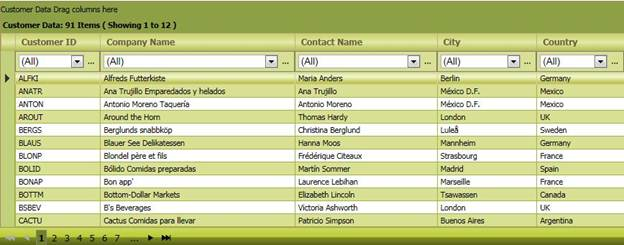
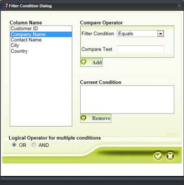

::: {style="DISPLAY: none"}
{#d2h_url_template}{#d2h_package_url style="WIDTH: 0px; DISPLAY: none; HEIGHT: 0px"}
:::

::: {.d2h_secondary_topic style="PADDING-BOTTOM: 10pt; MARGIN: 0pt; PADDING-LEFT: 0pt; PADDING-RIGHT: 0pt; PADDING-TOP: 0pt"}
#### Custom skins {#custom-skins style="tab-stops: 0pt"}

[]{style="FONT-FAMILY: 'Trebuchet MS','sans-serif'; COLOR: #15428b; FONT-SIZE: 9pt"} 

[]{#p106}Using this feature, you can customize skins in every element in the GridGroupingControl using CssClass. This way, you can customize the skins of a number of elements of the GridGroupingControl.

The following figures give you a basic idea of the customization that can be attained using this feature:

{border="0"}

Figure 125: Grid with custom skin**[]{style="FONT-STYLE: normal"}**

 

{border="0"}

Figure 126: Filter Dialog with custom skin

To customize the various elements in the GridGroupingControl, you will have to set a CssClass and set a skin accordingly.

More:

[ ]{#related-topics}

[{border="0" align="absMiddle"}Where do I find Installed samples?](ms-xhelp:///?Id=5757c106-a525-48f8-8a6e-3bab812c7228){style="TEXT-DECORATION: none"}

[{border="0" align="absMiddle"}Properties](ms-xhelp:///?Id=cc272441-7a14-411e-b482-48a0af4c55eb){style="TEXT-DECORATION: none"}

[{border="0" align="absMiddle"}Adding Custom Skins to ASP.NET Grid](ms-xhelp:///?Id=2a540665-a4b9-46d8-a18d-53721f2e4e0e){style="TEXT-DECORATION: none"}
:::
