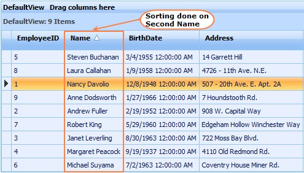

::: {style="DISPLAY: none"}
{#d2h_url_template}{#d2h_package_url style="WIDTH: 0px; DISPLAY: none; HEIGHT: 0px"}
:::

::::: {#nsbanner .d2h_main_nsbanner style="BORDER-BOTTOM: #999999 1px solid; POSITION: relative; PADDING-BOTTOM: 0px; BACKGROUND-COLOR: transparent; PADDING-LEFT: 0px; PADDING-RIGHT: 0px; DISPLAY: none; BORDER-TOP: #999999 1px solid; PADDING-TOP: 0px; LEFT: 0px"}
:::: {#TitleRow .d2h_main_titlerow style="PADDING-BOTTOM: 4px; BACKGROUND-COLOR: transparent; PADDING-LEFT: 22px; WIDTH: 100%; PADDING-RIGHT: 10px; DISPLAY: none; PADDING-TOP: 4px"}
::: {#ienav .d2h_main_ienav style="DISPLAY: none"}
{#D2HPrevious .D2HPreviousEnabled}  {#D2HNext .D2HNextEnabled}
:::
::::
:::::

:::: {#nstext .d2h_main_nstext style="PADDING-BOTTOM: 10px; BACKGROUND-COLOR: transparent; PADDING-LEFT: 22px; PADDING-RIGHT: 10px; HEIGHT: 100%; OVERFLOW: auto; PADDING-TOP: 5px" hasuserbackground="true" valign="bottom"}
::: {#d2h_breadcrumbs .d2h_breadcrumbs}
[Essential Studio User Guide Documentation](ms-xhelp:///?Id=12457748-09e3-4d74-a240-8e049cedf030){.d2h_breadcrumbsNormal}[ \> ]{.d2h_breadcrumbsLinkSeparator}[User Interface Edition](ms-xhelp:///?Id=c29296b7-531c-413b-a0ec-488ca1f7f669){.d2h_breadcrumbsNormal}[ \> ]{.d2h_breadcrumbsLinkSeparator}[Essential ASP.NET](ms-xhelp:///?Id=25c35330-c127-4dad-9a92-ed79dc7261a6){.d2h_breadcrumbsNormal}[ \> ]{.d2h_breadcrumbsLinkSeparator}[Essential Grid]{.d2h_breadcrumbsContentsOnly}[ \> ]{.d2h_breadcrumbsLinkSeparator}[Concepts and Features](ms-xhelp:///?Id=9e489974-524d-457c-9881-e458b1321685){.d2h_breadcrumbsNormal}[ \> ]{.d2h_breadcrumbsLinkSeparator}[Sorting](ms-xhelp:///?Id=950e7194-7643-4a68-baa6-17e17f21a501){.d2h_breadcrumbsNormal}
:::

### Custom Sorting {#custom-sorting style="tab-stops: 0pt"}

[]{style="FONT-FAMILY: 'Trebuchet MS','sans-serif'; COLOR: #15428b; FONT-SIZE: 9pt"} 

Custom Sorting

**[]{style="COLOR: black; FONT-SIZE: 8pt"}** 

Custom sorting enables you to implement custom sorting logic if the standard sorting techniques don\'t meet your requirements.

 

You can add a custom IComparer to the GridSortColumnDescriptor for this column. You do this by setting the Comparer property on the GridSortColumnDescriptor. In your custom IComparer object, you can sort based on any criteria you choose including any color criteria on the record value.

 

The Comparer object allows you to control how the sorting is done on your column. Once the column is sorted, the custom Categorizer is used to determine which adjacent records in the sorted column belong to the same group. To create custom Comparer and Categorizer objects, you define classes that implement IComparer.

[]{style="FONT-FAMILY: 'Trebuchet MS','sans-serif'; COLOR: #15428b; FONT-SIZE: 9pt"} 

Example Scenario

[]{style="FONT-FAMILY: 'Trebuchet MS','sans-serif'; COLOR: #15428b; FONT-SIZE: 9pt"} 

The following code snippet sorts the column Name.

[]{style="FONT-FAMILY: 'Trebuchet MS','sans-serif'; COLOR: #15428b; FONT-SIZE: 9pt"} 

[·      ]{style="FONT-FAMILY: Symbol"}First include the required namespace for implementing the custom Comparer.

[]{style="FONT-FAMILY: 'Trebuchet MS','sans-serif'; COLOR: #15428b; FONT-SIZE: 9pt"} 

+---------------------------------------------------------------------------------------------------------------------------------------------+
| **[\[C#\]]{style="FONT-FAMILY: 'Courier New'; COLOR: black"}**                                                                              |
|                                                                                                                                             |
| []{style="FONT-FAMILY: 'Courier New'; COLOR: black"}                                                                                        |
|                                                                                                                                             |
| [using]{style="FONT-FAMILY: 'Courier New'; COLOR: blue"}[ System.Collections;]{style="FONT-FAMILY: 'Courier New'"}                          |
|                                                                                                                                             |
| [using]{style="FONT-FAMILY: 'Courier New'; COLOR: blue"}[ Syncfusion.Web.UI.WebControls.Grid.Grouping;]{style="FONT-FAMILY: 'Courier New'"} |
+---------------------------------------------------------------------------------------------------------------------------------------------+

[]{style="FONT-FAMILY: 'Trebuchet MS','sans-serif'; COLOR: #15428b; FONT-SIZE: 9pt"} 

+-----------------------------------------------------------------------------------------------------------------------------------------------+
| **[\[VB.NET\]]{style="FONT-FAMILY: 'Courier New'; COLOR: black"}**                                                                            |
|                                                                                                                                               |
| []{style="FONT-FAMILY: 'Courier New'; COLOR: blue"}                                                                                           |
|                                                                                                                                               |
| [Imports]{style="FONT-FAMILY: 'Courier New'; COLOR: blue"}[ System.Collections]{style="FONT-FAMILY: 'Courier New'"}                           |
|                                                                                                                                               |
| [Imports]{style="FONT-FAMILY: 'Courier New'; COLOR: blue"}[ Syncfusion.Web.UI.WebControls.Grid.Grouping;]{style="FONT-FAMILY: 'Courier New'"} |
+-----------------------------------------------------------------------------------------------------------------------------------------------+

[]{style="FONT-FAMILY: 'Trebuchet MS','sans-serif'; COLOR: #15428b; FONT-SIZE: 9pt"} 

[·      ]{style="FONT-FAMILY: Symbol"}Set up the following data source to the GridGroupingControl.

[]{style="FONT-FAMILY: 'Trebuchet MS','sans-serif'; COLOR: #15428b; FONT-SIZE: 9pt"} 

+---------------------------------------------------------------------------------------------------------------------------------------------------------------------------------------------------------------------------------------------------------------------------------------------------------------------------------------------------------------------------------------------------------------------------------------------------------------------------------------------------------------------------------------------------------------------------------------------------------------------------------------------+
| **[\[ASPX\]]{style="FONT-FAMILY: 'Courier New'; COLOR: black"}**                                                                                                                                                                                                                                                                                                                                                                                                                                                                                                                                                                            |
|                                                                                                                                                                                                                                                                                                                                                                                                                                                                                                                                                                                                                                             |
| []{style="FONT-FAMILY: 'Courier New'; COLOR: black"}                                                                                                                                                                                                                                                                                                                                                                                                                                                                                                                                                                                        |
|                                                                                                                                                                                                                                                                                                                                                                                                                                                                                                                                                                                                                                             |
| [\<]{style="FONT-FAMILY: 'Courier New'; COLOR: blue"}[asp]{style="FONT-FAMILY: 'Courier New'; COLOR: #a31515"}[:]{style="FONT-FAMILY: 'Courier New'; COLOR: blue"}[AccessDataSource]{style="FONT-FAMILY: 'Courier New'; COLOR: #a31515"}[ [ID]{style="COLOR: red"}[=\"AccessDataSource1\"]{style="COLOR: blue"} [runat]{style="COLOR: red"}[=\"server\"]{style="COLOR: blue"} [SelectCommand]{style="COLOR: red"}[=\"SELECT \[EmployeeID\],\[FirstName\]+ \' \' + \[LastName\] as Name, \[BirthDate\], \[Address\], \[PostalCode\], \[Country\], \[City\] FROM \[Employees\]\"\>]{style="COLOR: blue"}]{style="FONT-FAMILY: 'Courier New'"} |
|                                                                                                                                                                                                                                                                                                                                                                                                                                                                                                                                                                                                                                             |
| [ [\</]{style="COLOR: blue"}[asp]{style="COLOR: #a31515"}[:]{style="COLOR: blue"}[AccessDataSource]{style="COLOR: #a31515"}[\>]{style="COLOR: blue"}]{style="FONT-FAMILY: 'Courier New'"}                                                                                                                                                                                                                                                                                                                                                                                                                                                   |
+---------------------------------------------------------------------------------------------------------------------------------------------------------------------------------------------------------------------------------------------------------------------------------------------------------------------------------------------------------------------------------------------------------------------------------------------------------------------------------------------------------------------------------------------------------------------------------------------------------------------------------------------+

[]{style="FONT-FAMILY: 'Trebuchet MS','sans-serif'; COLOR: #15428b; FONT-SIZE: 9pt"} 

+-------------------------------------------------------------------------------------------------------------------------------------------------------------------------------------------------------------------------------------------------+
| **[\[C#\]]{style="FONT-FAMILY: 'Courier New'; COLOR: black"}**                                                                                                                                                                                  |
|                                                                                                                                                                                                                                                 |
| []{style="FONT-FAMILY: 'Courier New'; COLOR: blue"}                                                                                                                                                                                             |
|                                                                                                                                                                                                                                                 |
| [protected]{style="FONT-FAMILY: 'Courier New'; COLOR: blue"}[ [void]{style="COLOR: blue"} Page_Load([object]{style="COLOR: blue"} sender, [EventArgs]{style="COLOR: #2b91af"} e)]{style="FONT-FAMILY: 'Courier New'"}                           |
|                                                                                                                                                                                                                                                 |
| [{]{style="FONT-FAMILY: 'Courier New'"}                                                                                                                                                                                                         |
|                                                                                                                                                                                                                                                 |
| [    [this]{style="COLOR: blue"}.AccessDataSource1.DataFile = ResolveApplicationDataPath([\"NWIND.MDB\"]{style="COLOR: #a31515"});]{style="FONT-FAMILY: 'Courier New'"}                                                                         |
|                                                                                                                                                                                                                                                 |
| [    [this]{style="COLOR: blue"}.GridGroupingControl1.DataSource = AccessDataSource1;]{style="FONT-FAMILY: 'Courier New'"}                                                                                                                      |
|                                                                                                                                                                                                                                                 |
| [  [if]{style="COLOR: blue"}(RadioButtonList1.SelectedItem.Value==[\"2\"]{style="COLOR: #a31515"})]{style="FONT-FAMILY: 'Courier New'"}                                                                                                         |
|                                                                                                                                                                                                                                                 |
| [    [this]{style="COLOR: blue"}.GridGroupingControl1.TableDescriptor.SortedColumns.Changed += [new]{style="COLOR: blue"} Syncfusion.Collections.ListPropertyChangedEventHandler(SortedColumns_Changed);]{style="FONT-FAMILY: 'Courier New'"}   |
|                                                                                                                                                                                                                                                 |
| [  [else]{style="COLOR: blue"}]{style="FONT-FAMILY: 'Courier New'"}                                                                                                                                                                             |
|                                                                                                                                                                                                                                                 |
| [      [this]{style="COLOR: blue"}.GridGroupingControl1.TableDescriptor.SortedColumns.Changed -= [new]{style="COLOR: blue"} Syncfusion.Collections.ListPropertyChangedEventHandler(SortedColumns_Changed);]{style="FONT-FAMILY: 'Courier New'"} |
|                                                                                                                                                                                                                                                 |
| [}]{style="FONT-FAMILY: 'Courier New'"}                                                                                                                                                                                                         |
+-------------------------------------------------------------------------------------------------------------------------------------------------------------------------------------------------------------------------------------------------+

[]{style="FONT-FAMILY: 'Trebuchet MS','sans-serif'; COLOR: #15428b; FONT-SIZE: 9pt"} 

[·      ]{style="FONT-FAMILY: Symbol"}Use **GridGroupingControl.TableDescriptor.SortedColumns.Changing** event to hook into the sorting to use custom comparer.

[]{style="FONT-FAMILY: 'Trebuchet MS','sans-serif'; COLOR: #15428b; FONT-SIZE: 9pt"} 

+----------------------------------------------------------------------------------------------------------------------------------------------------------------------------------------------------------------------------------------------------------------------+
| **[\[C#\]]{style="FONT-FAMILY: 'Courier New'; COLOR: black"}**                                                                                                                                                                                                       |
|                                                                                                                                                                                                                                                                      |
| []{style="FONT-FAMILY: 'Courier New'; COLOR: blue"}                                                                                                                                                                                                                  |
|                                                                                                                                                                                                                                                                      |
| [this]{style="FONT-FAMILY: 'Courier New'; COLOR: blue"}[.GridGroupingControl1.TableDescriptor.SortedColumns.Changing+=[new]{style="COLOR: blue"} Syncfusion.Collections.ListPropertyChangedEventHandler(SortedColumns_Changed);]{style="FONT-FAMILY: 'Courier New'"} |
|                                                                                                                                                                                                                                                                      |
| []{style="FONT-FAMILY: 'Courier New'"}                                                                                                                                                                                                                               |
|                                                                                                                                                                                                                                                                      |
| [void]{style="FONT-FAMILY: 'Courier New'; COLOR: blue"}[ SortedColumns_Changed([object]{style="COLOR: blue"} sender, Syncfusion.Collections.ListPropertyChangedEventArgs e)]{style="FONT-FAMILY: 'Courier New'"}                                                     |
|                                                                                                                                                                                                                                                                      |
| [{]{style="FONT-FAMILY: 'Courier New'"}                                                                                                                                                                                                                              |
|                                                                                                                                                                                                                                                                      |
| [if]{style="FONT-FAMILY: 'Courier New'; COLOR: blue"}[ (e.Action == Syncfusion.Collections.ListPropertyChangedType.Add \|\| e.Action == Syncfusion.Collections.ListPropertyChangedType.Insert)]{style="FONT-FAMILY: 'Courier New'"}                                  |
|                                                                                                                                                                                                                                                                      |
| [        {]{style="FONT-FAMILY: 'Courier New'"}                                                                                                                                                                                                                      |
|                                                                                                                                                                                                                                                                      |
| [            ]{style="FONT-FAMILY: 'Courier New'"}                                                                                                                                                                                                                   |
|                                                                                                                                                                                                                                                                      |
| [            SortColumnDescriptor sd = e.Item [as]{style="COLOR: blue"} SortColumnDescriptor;]{style="FONT-FAMILY: 'Courier New'"}                                                                                                                                   |
|                                                                                                                                                                                                                                                                      |
| [            ]{style="FONT-FAMILY: 'Courier New'"}                                                                                                                                                                                                                   |
|                                                                                                                                                                                                                                                                      |
| [            [if]{style="COLOR: blue"} (sd.Name == [\"Name\"]{style="COLOR: #a31515"})]{style="FONT-FAMILY: 'Courier New'"}                                                                                                                                          |
|                                                                                                                                                                                                                                                                      |
| [            {]{style="FONT-FAMILY: 'Courier New'"}                                                                                                                                                                                                                  |
|                                                                                                                                                                                                                                                                      |
| [                sd.Comparer = [new]{style="COLOR: blue"} NameComparer();]{style="FONT-FAMILY: 'Courier New'"}                                                                                                                                                       |
|                                                                                                                                                                                                                                                                      |
| [            }]{style="FONT-FAMILY: 'Courier New'"}                                                                                                                                                                                                                  |
|                                                                                                                                                                                                                                                                      |
| [        }]{style="FONT-FAMILY: 'Courier New'"}                                                                                                                                                                                                                      |
|                                                                                                                                                                                                                                                                      |
| [        [else]{style="COLOR: blue"} [if]{style="COLOR: blue"} (!IsAlreadySorted)]{style="FONT-FAMILY: 'Courier New'"}                                                                                                                                               |
|                                                                                                                                                                                                                                                                      |
| [        {]{style="FONT-FAMILY: 'Courier New'"}                                                                                                                                                                                                                      |
|                                                                                                                                                                                                                                                                      |
| [            [if]{style="COLOR: blue"} (e.Action == Syncfusion.Collections.ListPropertyChangedType.ItemPropertyChanged)]{style="FONT-FAMILY: 'Courier New'"}                                                                                                         |
|                                                                                                                                                                                                                                                                      |
| [            {]{style="FONT-FAMILY: 'Courier New'"}                                                                                                                                                                                                                  |
|                                                                                                                                                                                                                                                                      |
| [                SortColumnDescriptor sd = e.Item [as]{style="COLOR: blue"} SortColumnDescriptor;]{style="FONT-FAMILY: 'Courier New'"}                                                                                                                               |
|                                                                                                                                                                                                                                                                      |
| [                [if]{style="COLOR: blue"} (sd.Name == [\"Name\"]{style="COLOR: #a31515"})]{style="FONT-FAMILY: 'Courier New'"}                                                                                                                                      |
|                                                                                                                                                                                                                                                                      |
| [                {]{style="FONT-FAMILY: 'Courier New'"}                                                                                                                                                                                                              |
|                                                                                                                                                                                                                                                                      |
| [                    IsAlreadySorted = [true]{style="COLOR: blue"};]{style="FONT-FAMILY: 'Courier New'"}                                                                                                                                                             |
|                                                                                                                                                                                                                                                                      |
| [                    sd.Comparer = [new]{style="COLOR: blue"} NameComparer();]{style="FONT-FAMILY: 'Courier New'"}                                                                                                                                                   |
|                                                                                                                                                                                                                                                                      |
| [                }]{style="FONT-FAMILY: 'Courier New'"}                                                                                                                                                                                                              |
|                                                                                                                                                                                                                                                                      |
| [            }]{style="FONT-FAMILY: 'Courier New'"}                                                                                                                                                                                                                  |
|                                                                                                                                                                                                                                                                      |
| [        }]{style="FONT-FAMILY: 'Courier New'"}                                                                                                                                                                                                                      |
|                                                                                                                                                                                                                                                                      |
| [}]{style="FONT-FAMILY: 'Courier New'"}                                                                                                                                                                                                                              |
+----------------------------------------------------------------------------------------------------------------------------------------------------------------------------------------------------------------------------------------------------------------------+

[]{style="FONT-FAMILY: 'Trebuchet MS','sans-serif'; COLOR: #15428b; FONT-SIZE: 9pt"} 

+--------------------------------------------------------------------------------------------------------------------------------------------------------------------------------------------------------------------------------------------------------------------------------------------------------------------------------------------------------------+
| **[\[VB.NET\]]{style="FONT-FAMILY: 'Courier New'; COLOR: black"}**                                                                                                                                                                                                                                                                                           |
|                                                                                                                                                                                                                                                                                                                                                              |
| []{style="FONT-FAMILY: 'Courier New'"}                                                                                                                                                                                                                                                                                                                       |
|                                                                                                                                                                                                                                                                                                                                                              |
| [Me]{style="FONT-FAMILY: 'Courier New'; COLOR: blue"}[.GridGroupingControl1.TableDescriptor.SortedColumns.Changing+= [New]{style="COLOR: blue"} Syncfusion.Collections.ListPropertyChangedEventHandler(SortedColumns_Changed)]{style="FONT-FAMILY: 'Courier New'"}                                                                                           |
|                                                                                                                                                                                                                                                                                                                                                              |
| [Private]{style="FONT-FAMILY: 'Courier New'; COLOR: blue"}[ [Sub]{style="COLOR: blue"} SortedColumns_Changed([ByVal]{style="COLOR: blue"} sender [As]{style="COLOR: blue"} [Object]{style="COLOR: blue"}, [ByVal]{style="COLOR: blue"} e [As]{style="COLOR: blue"} Syncfusion.Collections.ListPropertyChangedEventArgs)]{style="FONT-FAMILY: 'Courier New'"} |
|                                                                                                                                                                                                                                                                                                                                                              |
| [    [If]{style="COLOR: blue"} e.Action = Syncfusion.Collections.ListPropertyChangedType.Add [OrElse]{style="COLOR: blue"} e.Action = Syncfusion.Collections.ListPropertyChangedType.Insert [Then]{style="COLOR: blue"}]{style="FONT-FAMILY: 'Courier New'"}                                                                                                 |
|                                                                                                                                                                                                                                                                                                                                                              |
| [        [Dim]{style="COLOR: blue"} sd [As]{style="COLOR: blue"} SortColumnDescriptor = [TryCast]{style="COLOR: blue"}(e.Item, SortColumnDescriptor)]{style="FONT-FAMILY: 'Courier New'"}                                                                                                                                                                    |
|                                                                                                                                                                                                                                                                                                                                                              |
| [        [If]{style="COLOR: blue"} sd.Name = [\"Name\"]{style="COLOR: maroon"} [Then]{style="COLOR: blue"}]{style="FONT-FAMILY: 'Courier New'"}                                                                                                                                                                                                              |
|                                                                                                                                                                                                                                                                                                                                                              |
| [            sd.Comparer = [New]{style="COLOR: blue"} NameComparer()]{style="FONT-FAMILY: 'Courier New'"}                                                                                                                                                                                                                                                    |
|                                                                                                                                                                                                                                                                                                                                                              |
| [        [End]{style="COLOR: blue"} [If]{style="COLOR: blue"}]{style="FONT-FAMILY: 'Courier New'"}                                                                                                                                                                                                                                                           |
|                                                                                                                                                                                                                                                                                                                                                              |
| [    [ElseIf]{style="COLOR: blue"} ([Not]{style="COLOR: blue"} IsAlreadySorted) [Then]{style="COLOR: blue"}]{style="FONT-FAMILY: 'Courier New'"}                                                                                                                                                                                                             |
|                                                                                                                                                                                                                                                                                                                                                              |
| [        [If]{style="COLOR: blue"} e.Action = Syncfusion.Collections.ListPropertyChangedType.ItemPropertyChanged [Then]{style="COLOR: blue"}]{style="FONT-FAMILY: 'Courier New'"}                                                                                                                                                                            |
|                                                                                                                                                                                                                                                                                                                                                              |
| [            [Dim]{style="COLOR: blue"} sd [As]{style="COLOR: blue"} SortColumnDescriptor = [TryCast]{style="COLOR: blue"}(e.Item, SortColumnDescriptor)]{style="FONT-FAMILY: 'Courier New'"}                                                                                                                                                                |
|                                                                                                                                                                                                                                                                                                                                                              |
| [            [If]{style="COLOR: blue"} sd.Name = [\"Name\"]{style="COLOR: maroon"} [Then]{style="COLOR: blue"}]{style="FONT-FAMILY: 'Courier New'"}                                                                                                                                                                                                          |
|                                                                                                                                                                                                                                                                                                                                                              |
| [                IsAlreadySorted = [True]{style="COLOR: blue"}]{style="FONT-FAMILY: 'Courier New'"}                                                                                                                                                                                                                                                          |
|                                                                                                                                                                                                                                                                                                                                                              |
| [                sd.Comparer = [New]{style="COLOR: blue"} NameComparer()]{style="FONT-FAMILY: 'Courier New'"}                                                                                                                                                                                                                                                |
|                                                                                                                                                                                                                                                                                                                                                              |
| [            [End]{style="COLOR: blue"} [If]{style="COLOR: blue"}]{style="FONT-FAMILY: 'Courier New'"}                                                                                                                                                                                                                                                       |
|                                                                                                                                                                                                                                                                                                                                                              |
| [        [End]{style="COLOR: blue"} [If]{style="COLOR: blue"}]{style="FONT-FAMILY: 'Courier New'"}                                                                                                                                                                                                                                                           |
|                                                                                                                                                                                                                                                                                                                                                              |
| [    [End]{style="COLOR: blue"} [If]{style="COLOR: blue"}]{style="FONT-FAMILY: 'Courier New'"}                                                                                                                                                                                                                                                               |
|                                                                                                                                                                                                                                                                                                                                                              |
| [End]{style="FONT-FAMILY: 'Courier New'; COLOR: blue"}[ [Sub]{style="COLOR: blue"}]{style="FONT-FAMILY: 'Courier New'"}                                                                                                                                                                                                                                      |
+--------------------------------------------------------------------------------------------------------------------------------------------------------------------------------------------------------------------------------------------------------------------------------------------------------------------------------------------------------------+

[]{style="FONT-FAMILY: 'Trebuchet MS','sans-serif'; COLOR: #15428b; FONT-SIZE: 9pt"} 

[·      ]{style="FONT-FAMILY: Symbol"}Set up the custom Comparer object.

[]{style="FONT-FAMILY: 'Trebuchet MS','sans-serif'; COLOR: #15428b; FONT-SIZE: 9pt"} 

+-----------------------------------------------------------------------------------------------------------------------------------------------------------------------------------------------------------+
| **[\[C#\]]{style="FONT-FAMILY: 'Courier New'; COLOR: black"}**                                                                                                                                            |
|                                                                                                                                                                                                           |
| []{style="FONT-FAMILY: 'Courier New'; COLOR: blue"}                                                                                                                                                       |
|                                                                                                                                                                                                           |
| [public]{style="FONT-FAMILY: 'Courier New'; COLOR: blue"}[ [class]{style="COLOR: blue"} [NameComparer]{style="COLOR: #2b91af"} : [IComparer]{style="COLOR: #2b91af"}]{style="FONT-FAMILY: 'Courier New'"} |
|                                                                                                                                                                                                           |
| [{]{style="FONT-FAMILY: 'Courier New'"}                                                                                                                                                                   |
|                                                                                                                                                                                                           |
| [    [public]{style="COLOR: blue"} NameComparer()]{style="FONT-FAMILY: 'Courier New'"}                                                                                                                    |
|                                                                                                                                                                                                           |
| [    {]{style="FONT-FAMILY: 'Courier New'"}                                                                                                                                                               |
|                                                                                                                                                                                                           |
| [    }]{style="FONT-FAMILY: 'Courier New'"}                                                                                                                                                               |
|                                                                                                                                                                                                           |
| [    #region]{style="FONT-FAMILY: 'Courier New'; COLOR: blue"}[ IComparer Members]{style="FONT-FAMILY: 'Courier New'"}                                                                                    |
|                                                                                                                                                                                                           |
| []{style="FONT-FAMILY: 'Courier New'"}                                                                                                                                                                    |
|                                                                                                                                                                                                           |
| [    [public]{style="COLOR: blue"} [int]{style="COLOR: blue"} Compare([object]{style="COLOR: blue"} x, [object]{style="COLOR: blue"} y)]{style="FONT-FAMILY: 'Courier New'"}                              |
|                                                                                                                                                                                                           |
| [    {]{style="FONT-FAMILY: 'Courier New'"}                                                                                                                                                               |
|                                                                                                                                                                                                           |
| [        [string]{style="COLOR: blue"} p1 = ([string]{style="COLOR: blue"})x;]{style="FONT-FAMILY: 'Courier New'"}                                                                                        |
|                                                                                                                                                                                                           |
| [        [string]{style="COLOR: blue"} p2 = ([string]{style="COLOR: blue"})y;]{style="FONT-FAMILY: 'Courier New'"}                                                                                        |
|                                                                                                                                                                                                           |
| [        [string]{style="COLOR: blue"}\[\] p1names = p1.Split([new]{style="COLOR: blue"} [char]{style="COLOR: blue"}\[\] { [\' \']{style="COLOR: #a31515"} });]{style="FONT-FAMILY: 'Courier New'"}       |
|                                                                                                                                                                                                           |
| [        [string]{style="COLOR: blue"}\[\] p2names = p2.Split([new]{style="COLOR: blue"} [char]{style="COLOR: blue"}\[\] { [\' \']{style="COLOR: #a31515"} });]{style="FONT-FAMILY: 'Courier New'"}       |
|                                                                                                                                                                                                           |
| []{style="FONT-FAMILY: 'Courier New'"}                                                                                                                                                                    |
|                                                                                                                                                                                                           |
| [        [return]{style="COLOR: blue"} p1names\[1\].CompareTo(p2names\[1\]);]{style="FONT-FAMILY: 'Courier New'"}                                                                                         |
|                                                                                                                                                                                                           |
| [    }]{style="FONT-FAMILY: 'Courier New'"}                                                                                                                                                               |
|                                                                                                                                                                                                           |
| []{style="FONT-FAMILY: 'Courier New'"}                                                                                                                                                                    |
|                                                                                                                                                                                                           |
| [    #endregion]{style="FONT-FAMILY: 'Courier New'; COLOR: blue"}                                                                                                                                         |
|                                                                                                                                                                                                           |
| [}]{style="FONT-FAMILY: 'Courier New'"}                                                                                                                                                                   |
+-----------------------------------------------------------------------------------------------------------------------------------------------------------------------------------------------------------+

[]{style="FONT-FAMILY: 'Trebuchet MS','sans-serif'; COLOR: #15428b; FONT-SIZE: 9pt"} 

+--------------------------------------------------------------------------------------------------------------------------------------------------------------------------------------------------------------------------------------------------------------------------------------------------------------------------------------------------------------------------------------------------------------+
| **[\[VB.NET\]]{style="FONT-FAMILY: 'Courier New'; COLOR: black"}**                                                                                                                                                                                                                                                                                                                                           |
|                                                                                                                                                                                                                                                                                                                                                                                                              |
| []{style="FONT-FAMILY: 'Courier New'"}                                                                                                                                                                                                                                                                                                                                                                       |
|                                                                                                                                                                                                                                                                                                                                                                                                              |
| [Public]{style="FONT-FAMILY: 'Courier New'; COLOR: blue"}[ [Class]{style="COLOR: blue"} NameComparer : [Implements]{style="COLOR: blue"} IComparer]{style="FONT-FAMILY: 'Courier New'"}                                                                                                                                                                                                                      |
|                                                                                                                                                                                                                                                                                                                                                                                                              |
| [    [Public]{style="COLOR: blue"} [Sub]{style="COLOR: blue"} [New]{style="COLOR: blue"}()]{style="FONT-FAMILY: 'Courier New'"}                                                                                                                                                                                                                                                                              |
|                                                                                                                                                                                                                                                                                                                                                                                                              |
| [    [End]{style="COLOR: blue"} [Sub]{style="COLOR: blue"}]{style="FONT-FAMILY: 'Courier New'"}                                                                                                                                                                                                                                                                                                              |
|                                                                                                                                                                                                                                                                                                                                                                                                              |
| [\#[Region]{style="COLOR: blue"} [\"IComparer Members\"]{style="COLOR: maroon"}]{style="FONT-FAMILY: 'Courier New'"}                                                                                                                                                                                                                                                                                         |
|                                                                                                                                                                                                                                                                                                                                                                                                              |
| []{style="FONT-FAMILY: 'Courier New'; COLOR: maroon"}                                                                                                                                                                                                                                                                                                                                                        |
|                                                                                                                                                                                                                                                                                                                                                                                                              |
| [    [Public]{style="COLOR: blue"} [Function]{style="COLOR: blue"} Compare([ByVal]{style="COLOR: blue"} x [As]{style="COLOR: blue"} [Object]{style="COLOR: blue"}, [ByVal]{style="COLOR: blue"} y [As]{style="COLOR: blue"} [Object]{style="COLOR: blue"}) [As]{style="COLOR: blue"} [Integer]{style="COLOR: blue"} [Implements]{style="COLOR: blue"} IComparer.Compare]{style="FONT-FAMILY: 'Courier New'"} |
|                                                                                                                                                                                                                                                                                                                                                                                                              |
| [        [Dim]{style="COLOR: blue"} p1 [As]{style="COLOR: blue"} [String]{style="COLOR: blue"} = [CStr]{style="COLOR: blue"}(x)]{style="FONT-FAMILY: 'Courier New'"}                                                                                                                                                                                                                                         |
|                                                                                                                                                                                                                                                                                                                                                                                                              |
| [        [Dim]{style="COLOR: blue"} p2 [As]{style="COLOR: blue"} [String]{style="COLOR: blue"} = [CStr]{style="COLOR: blue"}(y)]{style="FONT-FAMILY: 'Courier New'"}                                                                                                                                                                                                                                         |
|                                                                                                                                                                                                                                                                                                                                                                                                              |
| [        [Dim]{style="COLOR: blue"} p1names [As]{style="COLOR: blue"} [String]{style="COLOR: blue"}() = p1.Split([New]{style="COLOR: blue"} [Char]{style="COLOR: blue"}() {\" \"c})]{style="FONT-FAMILY: 'Courier New'"}                                                                                                                                                                                     |
|                                                                                                                                                                                                                                                                                                                                                                                                              |
| [        [Dim]{style="COLOR: blue"} p2names [As]{style="COLOR: blue"} [String]{style="COLOR: blue"}() = p2.Split([New]{style="COLOR: blue"} [Char]{style="COLOR: blue"}() {\" \"c})]{style="FONT-FAMILY: 'Courier New'"}                                                                                                                                                                                     |
|                                                                                                                                                                                                                                                                                                                                                                                                              |
| []{style="FONT-FAMILY: 'Courier New'"}                                                                                                                                                                                                                                                                                                                                                                       |
|                                                                                                                                                                                                                                                                                                                                                                                                              |
| [        [Return]{style="COLOR: blue"} p1names(1).CompareTo(p2names(1))]{style="FONT-FAMILY: 'Courier New'"}                                                                                                                                                                                                                                                                                                 |
|                                                                                                                                                                                                                                                                                                                                                                                                              |
| [    [End]{style="COLOR: blue"} [Function]{style="COLOR: blue"}]{style="FONT-FAMILY: 'Courier New'"}                                                                                                                                                                                                                                                                                                         |
|                                                                                                                                                                                                                                                                                                                                                                                                              |
| []{style="FONT-FAMILY: 'Courier New'; COLOR: blue"}                                                                                                                                                                                                                                                                                                                                                          |
|                                                                                                                                                                                                                                                                                                                                                                                                              |
| [\#[End]{style="COLOR: blue"} [Region]{style="COLOR: blue"}]{style="FONT-FAMILY: 'Courier New'"}                                                                                                                                                                                                                                                                                                             |
|                                                                                                                                                                                                                                                                                                                                                                                                              |
| [End]{style="FONT-FAMILY: 'Courier New'; COLOR: blue"}[ [Class]{style="COLOR: blue"}]{style="FONT-FAMILY: 'Courier New'"}                                                                                                                                                                                                                                                                                    |
+--------------------------------------------------------------------------------------------------------------------------------------------------------------------------------------------------------------------------------------------------------------------------------------------------------------------------------------------------------------------------------------------------------------+

[]{style="FONT-FAMILY: 'Trebuchet MS','sans-serif'; COLOR: #15428b; FONT-SIZE: 9pt"} 

[{border="0"}]{style="FONT-FAMILY: 'Trebuchet MS','sans-serif'; COLOR: #15428b; FONT-SIZE: 9pt"}[]{style="FONT-FAMILY: 'Trebuchet MS','sans-serif'; COLOR: #15428b; FONT-SIZE: 9pt"}

Figure 75[]{style="FONT-FAMILY: 'Trebuchet MS','sans-serif'; COLOR: #15428b"}

[]{style="FONT-FAMILY: 'Trebuchet MS','sans-serif'; FONT-SIZE: 12pt"} 

[]{#related-topics}
::::
