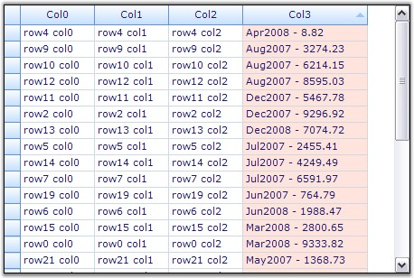
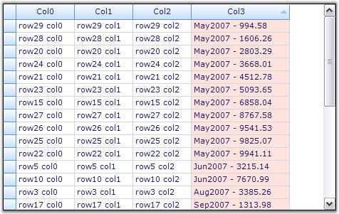

::: {style="DISPLAY: none"}
{#d2h_url_template}{#d2h_package_url style="WIDTH: 0px; DISPLAY: none; HEIGHT: 0px"}
:::

::: {.d2h_secondary_topic style="PADDING-BOTTOM: 10pt; MARGIN: 0pt; PADDING-LEFT: 0pt; PADDING-RIGHT: 0pt; PADDING-TOP: 0pt"}
##### Custom Sorting {#custom-sorting style="tab-stops: 0pt"}

[]{style="FONT-FAMILY: 'Trebuchet MS','sans-serif'; COLOR: #15428b; FONT-SIZE: 9pt"} 

Custom Sorting allows you to implement custom sorting logic when the standard sorting techniques do not meet your needs. To support custom sorting in Grid Grouping control, the user needs to add an **IComparer** object and handle one event[.]{style="FONT-FAMILY: 'Verdana','sans-serif'; FONT-SIZE: 8pt"}

[]{style="FONT-FAMILY: 'Verdana','sans-serif'; FONT-SIZE: 8pt"} 

The **Comparer** object allows you to control how the sorting is done on the column. This is the place where you can define your own sorting logic. After customizing the sorting logic through IComparer, you can make the grouping grid use this special IComparer by handling an event.

[]{style="FONT-FAMILY: 'Verdana','sans-serif'; FONT-SIZE: 8pt"} 

**Example**

 

Consider a scenario where one of the data columns of your datasource consists of **Date-Numeric** combination values. In this case, the default sorting will not produce the results we desire. The sorting has to be done first on date values and then on numeric values. Hence we need to write a custom sorting logic by defining a special IComparer object. The grouping grid could then be made to use this custom comparer by handling an event that gets fired while sorting the columns.

[]{style="FONT-SIZE: 8pt"} 

The example illustrates this process in a step by step manner.

[]{style="FONT-FAMILY: 'Trebuchet MS','sans-serif'; COLOR: #15428b; FONT-SIZE: 9pt"} 

1.   Setup a datasource and bind it to a grid grouping control.

[]{style="FONT-FAMILY: 'Trebuchet MS','sans-serif'; COLOR: #15428b; FONT-SIZE: 9pt"} 

+-------------------------------------------------------------------------------------------------------------------------------------------------------------------------------------------------------------------+
| **[\[C#\]]{style="FONT-FAMILY: 'Courier New'; COLOR: black"}**                                                                                                                                                    |
|                                                                                                                                                                                                                   |
| []{style="FONT-FAMILY: 'Courier New'; COLOR: black"}                                                                                                                                                              |
|                                                                                                                                                                                                                   |
| [// Create a Data Source.]{style="FONT-FAMILY: 'Courier New'; COLOR: green"}                                                                                                                                      |
|                                                                                                                                                                                                                   |
| [DataTable]{style="FONT-FAMILY: 'Courier New'; COLOR: #2b91af"}[ dt = [new]{style="COLOR: blue"} [DataTable]{style="COLOR: #2b91af"}([\"MyTable\"]{style="COLOR: #a31515"});]{style="FONT-FAMILY: 'Courier New'"} |
|                                                                                                                                                                                                                   |
| [int]{style="FONT-FAMILY: 'Courier New'; COLOR: blue"}[ nCols = 4;]{style="FONT-FAMILY: 'Courier New'"}                                                                                                           |
|                                                                                                                                                                                                                   |
| [int]{style="FONT-FAMILY: 'Courier New'; COLOR: blue"}[ nRows = 30;]{style="FONT-FAMILY: 'Courier New'"}                                                                                                          |
|                                                                                                                                                                                                                   |
| [for]{style="FONT-FAMILY: 'Courier New'; COLOR: blue"}[ ([int]{style="COLOR: blue"} i = 0; i \< nCols; i++)]{style="FONT-FAMILY: 'Courier New'"}                                                                  |
|                                                                                                                                                                                                                   |
| [    dt.Columns.Add([new]{style="COLOR: blue"} [DataColumn]{style="COLOR: #2b91af"}([string]{style="COLOR: blue"}.Format([\"Col{0}\"]{style="COLOR: #a31515"}, i)));]{style="FONT-FAMILY: 'Courier New'"}         |
|                                                                                                                                                                                                                   |
| [Random]{style="FONT-FAMILY: 'Courier New'; COLOR: #2b91af"}[ r = [new]{style="COLOR: blue"} [Random]{style="COLOR: #2b91af"}();]{style="FONT-FAMILY: 'Courier New'"}                                             |
|                                                                                                                                                                                                                   |
| [for]{style="FONT-FAMILY: 'Courier New'; COLOR: blue"}[ ([int]{style="COLOR: blue"} i = 0; i \< nRows; ++i)]{style="FONT-FAMILY: 'Courier New'"}                                                                  |
|                                                                                                                                                                                                                   |
| [{]{style="FONT-FAMILY: 'Courier New'"}                                                                                                                                                                           |
|                                                                                                                                                                                                                   |
| [    [DataRow]{style="COLOR: #2b91af"} dr = dt.NewRow();]{style="FONT-FAMILY: 'Courier New'"}                                                                                                                     |
|                                                                                                                                                                                                                   |
| [    [for]{style="COLOR: blue"} ([int]{style="COLOR: blue"} j = 0; j \< nCols; j++)]{style="FONT-FAMILY: 'Courier New'"}                                                                                          |
|                                                                                                                                                                                                                   |
| [        dr\[j\] = [string]{style="COLOR: blue"}.Format([\"row{0} col{1}\"]{style="COLOR: #a31515"}, i, j);]{style="FONT-FAMILY: 'Courier New'"}                                                                  |
|                                                                                                                                                                                                                   |
| [    [DateTime]{style="COLOR: #2b91af"} d = [DateTime]{style="COLOR: #2b91af"}.Now.AddDays(r.Next(i \< 20 ? 700 : 1));]{style="FONT-FAMILY: 'Courier New'"}                                                       |
|                                                                                                                                                                                                                   |
| [    dr\[nCols - 1\] = [string]{style="COLOR: blue"}.Format([\"{0:MMM}{1:00} - {2:0.00}\"]{style="COLOR: #a31515"}, d, d.Year, r.Next(1000000) / 100d);]{style="FONT-FAMILY: 'Courier New'"}                      |
|                                                                                                                                                                                                                   |
| [    dt.Rows.Add(dr);]{style="FONT-FAMILY: 'Courier New'"}                                                                                                                                                        |
|                                                                                                                                                                                                                   |
| [}]{style="FONT-FAMILY: 'Courier New'"}                                                                                                                                                                           |
|                                                                                                                                                                                                                   |
| []{style="FONT-FAMILY: 'Courier New'"}                                                                                                                                                                            |
|                                                                                                                                                                                                                   |
| [// Bind the data source to the grouping grid.]{style="FONT-FAMILY: 'Courier New'; COLOR: green"}                                                                                                                 |
|                                                                                                                                                                                                                   |
| [this]{style="FONT-FAMILY: 'Courier New'; COLOR: blue"}[.gridGroupingControl1.DataSource = [new]{style="COLOR: blue"} [DataView]{style="COLOR: #2b91af"}(dt);]{style="FONT-FAMILY: 'Courier New'"}                |
+-------------------------------------------------------------------------------------------------------------------------------------------------------------------------------------------------------------------+

[]{style="FONT-FAMILY: 'Trebuchet MS','sans-serif'; COLOR: #15428b; FONT-SIZE: 9pt"} 

+-------------------------------------------------------------------------------------------------------------------------------------------------------------------------------------------------------------------+
| **[\[VB.NET\]]{style="FONT-FAMILY: 'Courier New'; COLOR: black"}**                                                                                                                                                |
|                                                                                                                                                                                                                   |
| []{style="FONT-FAMILY: 'Courier New'; COLOR: black"}                                                                                                                                                              |
|                                                                                                                                                                                                                   |
| [\' Create a Data Source.]{style="FONT-FAMILY: 'Courier New'; COLOR: green"}                                                                                                                                      |
|                                                                                                                                                                                                                   |
| [Dim]{style="FONT-FAMILY: 'Courier New'; COLOR: blue"}[ dt [As]{style="COLOR: blue"} DataTable = [New]{style="COLOR: blue"} DataTable([\"MyTable\"]{style="COLOR: #a31515"})]{style="FONT-FAMILY: 'Courier New'"} |
|                                                                                                                                                                                                                   |
| []{style="FONT-FAMILY: 'Courier New'"}                                                                                                                                                                            |
|                                                                                                                                                                                                                   |
| [Dim]{style="FONT-FAMILY: 'Courier New'; COLOR: blue"}[ nCols [As]{style="COLOR: blue"} [Integer]{style="COLOR: blue"} = 4]{style="FONT-FAMILY: 'Courier New'"}                                                   |
|                                                                                                                                                                                                                   |
| [Dim]{style="FONT-FAMILY: 'Courier New'; COLOR: blue"}[ nRows [As]{style="COLOR: blue"} [Integer]{style="COLOR: blue"} = 30]{style="FONT-FAMILY: 'Courier New'"}                                                  |
|                                                                                                                                                                                                                   |
| []{style="FONT-FAMILY: 'Courier New'"}                                                                                                                                                                            |
|                                                                                                                                                                                                                   |
| [Dim]{style="FONT-FAMILY: 'Courier New'; COLOR: blue"}[ i [As]{style="COLOR: blue"} [Integer]{style="COLOR: blue"} = 0]{style="FONT-FAMILY: 'Courier New'"}                                                       |
|                                                                                                                                                                                                                   |
| [Do]{style="FONT-FAMILY: 'Courier New'; COLOR: blue"}[ [While]{style="COLOR: blue"} i \< nCols]{style="FONT-FAMILY: 'Courier New'"}                                                                               |
|                                                                                                                                                                                                                   |
| [dt.Columns.Add([New]{style="COLOR: blue"} DataColumn([String]{style="COLOR: blue"}.Format([\"Col{0}\"]{style="COLOR: #a31515"}, i)))]{style="FONT-FAMILY: 'Courier New'"}                                        |
|                                                                                                                                                                                                                   |
| [i += 1]{style="FONT-FAMILY: 'Courier New'"}                                                                                                                                                                      |
|                                                                                                                                                                                                                   |
| [Loop]{style="FONT-FAMILY: 'Courier New'; COLOR: blue"}                                                                                                                                                           |
|                                                                                                                                                                                                                   |
| []{style="FONT-FAMILY: 'Courier New'; COLOR: blue"}                                                                                                                                                               |
|                                                                                                                                                                                                                   |
| [Dim]{style="FONT-FAMILY: 'Courier New'; COLOR: blue"}[ r [As]{style="COLOR: blue"} Random = [New]{style="COLOR: blue"} Random()]{style="FONT-FAMILY: 'Courier New'"}                                             |
|                                                                                                                                                                                                                   |
| [i = 0]{style="FONT-FAMILY: 'Courier New'"}                                                                                                                                                                       |
|                                                                                                                                                                                                                   |
| [Do]{style="FONT-FAMILY: 'Courier New'; COLOR: blue"}[ [While]{style="COLOR: blue"} i \< nRows]{style="FONT-FAMILY: 'Courier New'"}                                                                               |
|                                                                                                                                                                                                                   |
| [Dim]{style="FONT-FAMILY: 'Courier New'; COLOR: blue"}[ dr [As]{style="COLOR: blue"} DataRow = dt.NewRow()]{style="FONT-FAMILY: 'Courier New'"}                                                                   |
|                                                                                                                                                                                                                   |
| [Dim]{style="FONT-FAMILY: 'Courier New'; COLOR: blue"}[ j [As]{style="COLOR: blue"} [Integer]{style="COLOR: blue"} = 0]{style="FONT-FAMILY: 'Courier New'"}                                                       |
|                                                                                                                                                                                                                   |
| [Do]{style="FONT-FAMILY: 'Courier New'; COLOR: blue"}[ [While]{style="COLOR: blue"} j \< nCols]{style="FONT-FAMILY: 'Courier New'"}                                                                               |
|                                                                                                                                                                                                                   |
| [dr(j) = [String]{style="COLOR: blue"}.Format([\"row{0} col{1}\"]{style="COLOR: #a31515"}, i, j)]{style="FONT-FAMILY: 'Courier New'"}                                                                             |
|                                                                                                                                                                                                                   |
| [j += 1]{style="FONT-FAMILY: 'Courier New'"}                                                                                                                                                                      |
|                                                                                                                                                                                                                   |
| [Loop]{style="FONT-FAMILY: 'Courier New'; COLOR: blue"}                                                                                                                                                           |
|                                                                                                                                                                                                                   |
| [Dim]{style="FONT-FAMILY: 'Courier New'; COLOR: blue"}[ d [As]{style="COLOR: blue"} DateTime = DateTime.Now.AddDays(r.Next(IIf(i \< 20, 700, 1)))]{style="FONT-FAMILY: 'Courier New'"}                            |
|                                                                                                                                                                                                                   |
| [dr(nCols - 1) = [String]{style="COLOR: blue"}.Format([\"{0:MMM}{1:00} - {2:0.00}\"]{style="COLOR: #a31515"}, d, d.Year, r.Next(1000000) / 100.0R)]{style="FONT-FAMILY: 'Courier New'"}                           |
|                                                                                                                                                                                                                   |
| [dt.Rows.Add(dr)]{style="FONT-FAMILY: 'Courier New'"}                                                                                                                                                             |
|                                                                                                                                                                                                                   |
| [i += 1]{style="FONT-FAMILY: 'Courier New'"}                                                                                                                                                                      |
|                                                                                                                                                                                                                   |
| [Loop]{style="FONT-FAMILY: 'Courier New'; COLOR: blue"}                                                                                                                                                           |
|                                                                                                                                                                                                                   |
| []{style="FONT-FAMILY: 'Courier New'; COLOR: blue"}                                                                                                                                                               |
|                                                                                                                                                                                                                   |
| [\' Bind the data source to the grouping grid.]{style="FONT-FAMILY: 'Courier New'; COLOR: green"}                                                                                                                 |
|                                                                                                                                                                                                                   |
| [Me]{style="FONT-FAMILY: 'Courier New'; COLOR: blue"}[.gridGroupingControl1.DataSource = [New]{style="COLOR: blue"} DataView(dt)]{style="FONT-FAMILY: 'Courier New'"}                                             |
+-------------------------------------------------------------------------------------------------------------------------------------------------------------------------------------------------------------------+

[]{style="FONT-FAMILY: 'Trebuchet MS','sans-serif'; COLOR: #15428b; FONT-SIZE: 9pt"} 

2.   Define a Custom Comparer by implementing the IComparer interface.

[]{style="FONT-FAMILY: 'Trebuchet MS','sans-serif'; COLOR: #15428b; FONT-SIZE: 9pt"} 

+-----------------------------------------------------------------------------------------------------------------------------------------------------------------------------------------------------------+
| **[\[C#\]]{style="FONT-FAMILY: 'Courier New'; COLOR: black"}**                                                                                                                                            |
|                                                                                                                                                                                                           |
| []{style="FONT-FAMILY: 'Courier New'; COLOR: black"}                                                                                                                                                      |
|                                                                                                                                                                                                           |
| [// Sorts first on date and then on value.]{style="FONT-FAMILY: 'Courier New'; COLOR: green"}                                                                                                             |
|                                                                                                                                                                                                           |
| [public]{style="FONT-FAMILY: 'Courier New'; COLOR: blue"}[ [class]{style="COLOR: blue"} [DateComparer]{style="COLOR: #2b91af"} : [IComparer]{style="COLOR: #2b91af"}]{style="FONT-FAMILY: 'Courier New'"} |
|                                                                                                                                                                                                           |
| [{]{style="FONT-FAMILY: 'Courier New'"}                                                                                                                                                                   |
|                                                                                                                                                                                                           |
| [    [// IComparer Members.]{style="COLOR: green"}]{style="FONT-FAMILY: 'Courier New'"}                                                                                                                   |
|                                                                                                                                                                                                           |
| [    [public]{style="COLOR: blue"} [int]{style="COLOR: blue"} Compare([object]{style="COLOR: blue"} x, [object]{style="COLOR: blue"} y)]{style="FONT-FAMILY: 'Courier New'"}                              |
|                                                                                                                                                                                                           |
| [    {]{style="FONT-FAMILY: 'Courier New'"}                                                                                                                                                               |
|                                                                                                                                                                                                           |
| [        [if]{style="COLOR: blue"} (x == [null]{style="COLOR: blue"} && y == [null]{style="COLOR: blue"})]{style="FONT-FAMILY: 'Courier New'"}                                                            |
|                                                                                                                                                                                                           |
| [        [return]{style="COLOR: blue"} 0;]{style="FONT-FAMILY: 'Courier New'"}                                                                                                                            |
|                                                                                                                                                                                                           |
| [        [else]{style="COLOR: blue"} [if]{style="COLOR: blue"} (x == [null]{style="COLOR: blue"})]{style="FONT-FAMILY: 'Courier New'"}                                                                    |
|                                                                                                                                                                                                           |
| [        [return]{style="COLOR: blue"} -1;]{style="FONT-FAMILY: 'Courier New'"}                                                                                                                           |
|                                                                                                                                                                                                           |
| [        [else]{style="COLOR: blue"} [if]{style="COLOR: blue"} (y == [null]{style="COLOR: blue"})]{style="FONT-FAMILY: 'Courier New'"}                                                                    |
|                                                                                                                                                                                                           |
| [        [return]{style="COLOR: blue"} 1;]{style="FONT-FAMILY: 'Courier New'"}                                                                                                                            |
|                                                                                                                                                                                                           |
| [        [else]{style="COLOR: blue"}]{style="FONT-FAMILY: 'Courier New'"}                                                                                                                                 |
|                                                                                                                                                                                                           |
| [        {]{style="FONT-FAMILY: 'Courier New'"}                                                                                                                                                           |
|                                                                                                                                                                                                           |
| [            [DateTime]{style="COLOR: #2b91af"} xdate = [Convert]{style="COLOR: #2b91af"}.ToDateTime(x.ToString());]{style="FONT-FAMILY: 'Courier New'"}                                                  |
|                                                                                                                                                                                                           |
| [            [DateTime]{style="COLOR: #2b91af"} ydate = [Convert]{style="COLOR: #2b91af"}.ToDateTime(y.ToString());]{style="FONT-FAMILY: 'Courier New'"}                                                  |
|                                                                                                                                                                                                           |
| [            [int]{style="COLOR: blue"} c = xdate.CompareTo(ydate);]{style="FONT-FAMILY: 'Courier New'"}                                                                                                  |
|                                                                                                                                                                                                           |
| [            [return]{style="COLOR: blue"} c;]{style="FONT-FAMILY: 'Courier New'"}                                                                                                                        |
|                                                                                                                                                                                                           |
| [        }]{style="FONT-FAMILY: 'Courier New'"}                                                                                                                                                           |
|                                                                                                                                                                                                           |
| [    }]{style="FONT-FAMILY: 'Courier New'"}                                                                                                                                                               |
|                                                                                                                                                                                                           |
| [}]{style="FONT-FAMILY: 'Courier New'"}                                                                                                                                                                   |
+-----------------------------------------------------------------------------------------------------------------------------------------------------------------------------------------------------------+

[]{style="FONT-FAMILY: 'Trebuchet MS','sans-serif'; COLOR: #15428b; FONT-SIZE: 9pt"} 

+--------------------------------------------------------------------------------------------------------------------------------------------------------------------------------------------------------------------------------------------------------------------------------------------------------------------------------------------------------------------------------------------------------------------------------------+
| **[\[VB.NET\]]{style="FONT-FAMILY: 'Courier New'; COLOR: black"}**                                                                                                                                                                                                                                                                                                                                                                   |
|                                                                                                                                                                                                                                                                                                                                                                                                                                      |
| []{style="FONT-FAMILY: 'Courier New'; COLOR: black"}                                                                                                                                                                                                                                                                                                                                                                                 |
|                                                                                                                                                                                                                                                                                                                                                                                                                                      |
| [\' Sorts first on date and then on value.]{style="FONT-FAMILY: 'Courier New'; COLOR: green"}                                                                                                                                                                                                                                                                                                                                        |
|                                                                                                                                                                                                                                                                                                                                                                                                                                      |
| [Public]{style="FONT-FAMILY: 'Courier New'; COLOR: blue"}[ [Class]{style="COLOR: blue"} DateComparer : [Implements]{style="COLOR: blue"} IComparer]{style="FONT-FAMILY: 'Courier New'"}                                                                                                                                                                                                                                              |
|                                                                                                                                                                                                                                                                                                                                                                                                                                      |
| []{style="FONT-FAMILY: 'Courier New'"}                                                                                                                                                                                                                                                                                                                                                                                               |
|                                                                                                                                                                                                                                                                                                                                                                                                                                      |
| [\' IComparer Members.]{style="FONT-FAMILY: 'Courier New'; COLOR: green"}                                                                                                                                                                                                                                                                                                                                                            |
|                                                                                                                                                                                                                                                                                                                                                                                                                                      |
| [Public]{style="FONT-FAMILY: 'Courier New'; COLOR: blue"}[ [Function]{style="COLOR: blue"} Compare([ByVal]{style="COLOR: blue"} x [As]{style="COLOR: blue"} [Object]{style="COLOR: blue"}, [ByVal]{style="COLOR: blue"} y [As]{style="COLOR: blue"} [Object]{style="COLOR: blue"}) [As]{style="COLOR: blue"} [Integer]{style="COLOR: blue"} [Implements]{style="COLOR: blue"} IComparer.Compare]{style="FONT-FAMILY: 'Courier New'"} |
|                                                                                                                                                                                                                                                                                                                                                                                                                                      |
| [If]{style="FONT-FAMILY: 'Courier New'; COLOR: blue"}[ x [Is]{style="COLOR: blue"} [Nothing]{style="COLOR: blue"} [AndAlso]{style="COLOR: blue"} y [Is]{style="COLOR: blue"} [Nothing]{style="COLOR: blue"} [Then]{style="COLOR: blue"}]{style="FONT-FAMILY: 'Courier New'"}                                                                                                                                                         |
|                                                                                                                                                                                                                                                                                                                                                                                                                                      |
| [Return]{style="FONT-FAMILY: 'Courier New'; COLOR: blue"}[ 0]{style="FONT-FAMILY: 'Courier New'"}                                                                                                                                                                                                                                                                                                                                    |
|                                                                                                                                                                                                                                                                                                                                                                                                                                      |
| [Else]{style="FONT-FAMILY: 'Courier New'; COLOR: blue"}[ [If]{style="COLOR: blue"} x [Is]{style="COLOR: blue"} [Nothing]{style="COLOR: blue"} [Then]{style="COLOR: blue"}]{style="FONT-FAMILY: 'Courier New'"}                                                                                                                                                                                                                       |
|                                                                                                                                                                                                                                                                                                                                                                                                                                      |
| [Return]{style="FONT-FAMILY: 'Courier New'; COLOR: blue"}[ -1]{style="FONT-FAMILY: 'Courier New'"}                                                                                                                                                                                                                                                                                                                                   |
|                                                                                                                                                                                                                                                                                                                                                                                                                                      |
| [Else]{style="FONT-FAMILY: 'Courier New'; COLOR: blue"}[ [If]{style="COLOR: blue"} y [Is]{style="COLOR: blue"} [Nothing]{style="COLOR: blue"} [Then]{style="COLOR: blue"}]{style="FONT-FAMILY: 'Courier New'"}                                                                                                                                                                                                                       |
|                                                                                                                                                                                                                                                                                                                                                                                                                                      |
| [Return]{style="FONT-FAMILY: 'Courier New'; COLOR: blue"}[ 1]{style="FONT-FAMILY: 'Courier New'"}                                                                                                                                                                                                                                                                                                                                    |
|                                                                                                                                                                                                                                                                                                                                                                                                                                      |
| [Else]{style="FONT-FAMILY: 'Courier New'; COLOR: blue"}                                                                                                                                                                                                                                                                                                                                                                              |
|                                                                                                                                                                                                                                                                                                                                                                                                                                      |
| [Dim]{style="FONT-FAMILY: 'Courier New'; COLOR: blue"}[ c [As]{style="COLOR: blue"} [Integer]{style="COLOR: blue"} = GetDate(x.ToString()).CompareTo(GetDate(y.ToString()))]{style="FONT-FAMILY: 'Courier New'"}                                                                                                                                                                                                                     |
|                                                                                                                                                                                                                                                                                                                                                                                                                                      |
| [If]{style="FONT-FAMILY: 'Courier New'; COLOR: blue"}[ c = 0 [Then]{style="COLOR: blue"}]{style="FONT-FAMILY: 'Courier New'"}                                                                                                                                                                                                                                                                                                        |
|                                                                                                                                                                                                                                                                                                                                                                                                                                      |
| [c = GetDouble(x.ToString()).CompareTo(GetDouble(y.ToString()))]{style="FONT-FAMILY: 'Courier New'"}                                                                                                                                                                                                                                                                                                                                 |
|                                                                                                                                                                                                                                                                                                                                                                                                                                      |
| [End]{style="FONT-FAMILY: 'Courier New'; COLOR: blue"}[ [If]{style="COLOR: blue"}]{style="FONT-FAMILY: 'Courier New'"}                                                                                                                                                                                                                                                                                                               |
|                                                                                                                                                                                                                                                                                                                                                                                                                                      |
| [Return]{style="FONT-FAMILY: 'Courier New'; COLOR: blue"}[ c]{style="FONT-FAMILY: 'Courier New'"}                                                                                                                                                                                                                                                                                                                                    |
|                                                                                                                                                                                                                                                                                                                                                                                                                                      |
| [End]{style="FONT-FAMILY: 'Courier New'; COLOR: blue"}[ [If]{style="COLOR: blue"}]{style="FONT-FAMILY: 'Courier New'"}                                                                                                                                                                                                                                                                                                               |
|                                                                                                                                                                                                                                                                                                                                                                                                                                      |
| [End]{style="FONT-FAMILY: 'Courier New'; COLOR: blue"}[ [Function]{style="COLOR: blue"}]{style="FONT-FAMILY: 'Courier New'"}                                                                                                                                                                                                                                                                                                         |
|                                                                                                                                                                                                                                                                                                                                                                                                                                      |
| []{style="FONT-FAMILY: 'Courier New'; COLOR: blue"}                                                                                                                                                                                                                                                                                                                                                                                  |
|                                                                                                                                                                                                                                                                                                                                                                                                                                      |
| [Private]{style="FONT-FAMILY: 'Courier New'; COLOR: blue"}[ [Function]{style="COLOR: blue"} GetDate([ByVal]{style="COLOR: blue"} s [As]{style="COLOR: blue"} [String]{style="COLOR: blue"}) [As]{style="COLOR: blue"} DateTime]{style="FONT-FAMILY: 'Courier New'"}                                                                                                                                                                  |
|                                                                                                                                                                                                                                                                                                                                                                                                                                      |
| [Dim]{style="FONT-FAMILY: 'Courier New'; COLOR: blue"}[ dt [As]{style="COLOR: blue"} DateTime = DateTime.MinValue]{style="FONT-FAMILY: 'Courier New'"}                                                                                                                                                                                                                                                                               |
|                                                                                                                                                                                                                                                                                                                                                                                                                                      |
| [Dim]{style="FONT-FAMILY: 'Courier New'; COLOR: blue"}[ pos [As]{style="COLOR: blue"} [Integer]{style="COLOR: blue"} = s.IndexOf([\"-\"c]{style="COLOR: #a31515"})]{style="FONT-FAMILY: 'Courier New'"}                                                                                                                                                                                                                              |
|                                                                                                                                                                                                                                                                                                                                                                                                                                      |
| [If]{style="FONT-FAMILY: 'Courier New'; COLOR: blue"}[ pos \> -1 [Then]{style="COLOR: blue"}]{style="FONT-FAMILY: 'Courier New'"}                                                                                                                                                                                                                                                                                                    |
|                                                                                                                                                                                                                                                                                                                                                                                                                                      |
| [DateTime.TryParse(s.Substring(0, pos), dt)]{style="FONT-FAMILY: 'Courier New'"}                                                                                                                                                                                                                                                                                                                                                     |
|                                                                                                                                                                                                                                                                                                                                                                                                                                      |
| [End]{style="FONT-FAMILY: 'Courier New'; COLOR: blue"}[ [If]{style="COLOR: blue"}]{style="FONT-FAMILY: 'Courier New'"}                                                                                                                                                                                                                                                                                                               |
|                                                                                                                                                                                                                                                                                                                                                                                                                                      |
| [Return]{style="FONT-FAMILY: 'Courier New'; COLOR: blue"}[ dt]{style="FONT-FAMILY: 'Courier New'"}                                                                                                                                                                                                                                                                                                                                   |
|                                                                                                                                                                                                                                                                                                                                                                                                                                      |
| [End]{style="FONT-FAMILY: 'Courier New'; COLOR: blue"}[ [Function]{style="COLOR: blue"}]{style="FONT-FAMILY: 'Courier New'"}                                                                                                                                                                                                                                                                                                         |
|                                                                                                                                                                                                                                                                                                                                                                                                                                      |
| []{style="FONT-FAMILY: 'Courier New'; COLOR: blue"}                                                                                                                                                                                                                                                                                                                                                                                  |
|                                                                                                                                                                                                                                                                                                                                                                                                                                      |
| [Private]{style="FONT-FAMILY: 'Courier New'; COLOR: blue"}[ [Function]{style="COLOR: blue"} GetDouble([ByVal]{style="COLOR: blue"} s [As]{style="COLOR: blue"} [String]{style="COLOR: blue"}) [As]{style="COLOR: blue"} [Double]{style="COLOR: blue"}]{style="FONT-FAMILY: 'Courier New'"}                                                                                                                                           |
|                                                                                                                                                                                                                                                                                                                                                                                                                                      |
| [Dim]{style="FONT-FAMILY: 'Courier New'; COLOR: blue"}[ d [As]{style="COLOR: blue"} [Double]{style="COLOR: blue"} = [Double]{style="COLOR: blue"}.NaN]{style="FONT-FAMILY: 'Courier New'"}                                                                                                                                                                                                                                           |
|                                                                                                                                                                                                                                                                                                                                                                                                                                      |
| [Dim]{style="FONT-FAMILY: 'Courier New'; COLOR: blue"}[ pos [As]{style="COLOR: blue"} [Integer]{style="COLOR: blue"} = s.IndexOf([\"-\"c]{style="COLOR: #a31515"})]{style="FONT-FAMILY: 'Courier New'"}                                                                                                                                                                                                                              |
|                                                                                                                                                                                                                                                                                                                                                                                                                                      |
| [If]{style="FONT-FAMILY: 'Courier New'; COLOR: blue"}[ pos \> -1 [Then]{style="COLOR: blue"}]{style="FONT-FAMILY: 'Courier New'"}                                                                                                                                                                                                                                                                                                    |
|                                                                                                                                                                                                                                                                                                                                                                                                                                      |
| [Double]{style="FONT-FAMILY: 'Courier New'; COLOR: blue"}[.TryParse(s.Substring(pos + 1), d)]{style="FONT-FAMILY: 'Courier New'"}                                                                                                                                                                                                                                                                                                    |
|                                                                                                                                                                                                                                                                                                                                                                                                                                      |
| [End]{style="FONT-FAMILY: 'Courier New'; COLOR: blue"}[ [If]{style="COLOR: blue"}]{style="FONT-FAMILY: 'Courier New'"}                                                                                                                                                                                                                                                                                                               |
|                                                                                                                                                                                                                                                                                                                                                                                                                                      |
| [Return]{style="FONT-FAMILY: 'Courier New'; COLOR: blue"}[ d]{style="FONT-FAMILY: 'Courier New'"}                                                                                                                                                                                                                                                                                                                                    |
|                                                                                                                                                                                                                                                                                                                                                                                                                                      |
| [End]{style="FONT-FAMILY: 'Courier New'; COLOR: blue"}[ [Function]{style="COLOR: blue"}]{style="FONT-FAMILY: 'Courier New'"}                                                                                                                                                                                                                                                                                                         |
|                                                                                                                                                                                                                                                                                                                                                                                                                                      |
| [End]{style="FONT-FAMILY: 'Courier New'; COLOR: blue"}[ [Class]{style="COLOR: blue"}   ]{style="FONT-FAMILY: 'Courier New'"}                                                                                                                                                                                                                                                                                                         |
+--------------------------------------------------------------------------------------------------------------------------------------------------------------------------------------------------------------------------------------------------------------------------------------------------------------------------------------------------------------------------------------------------------------------------------------+

[]{style="FONT-FAMILY: 'Trebuchet MS','sans-serif'; COLOR: #15428b; FONT-SIZE: 9pt"} 

3.   Handle the SortColumnsChanging event to make the grid use the custom comparer.

[]{style="FONT-FAMILY: 'Trebuchet MS','sans-serif'; COLOR: #15428b; FONT-SIZE: 9pt"} 

+--------------------------------------------------------------------------------------------------------------------------------------------------------------------------------------------------------------------------------------------------+
| **[\[C#\]]{style="FONT-FAMILY: 'Courier New'; COLOR: black"}**                                                                                                                                                                                   |
|                                                                                                                                                                                                                                                  |
| []{style="FONT-FAMILY: 'Courier New'; COLOR: black"}                                                                                                                                                                                             |
|                                                                                                                                                                                                                                                  |
| [private]{style="FONT-FAMILY: 'Courier New'; COLOR: blue"}[ [string]{style="COLOR: blue"} specialDateColName = [\"Col3\"]{style="COLOR: #a31515"};]{style="FONT-FAMILY: 'Courier New'"}                                                          |
|                                                                                                                                                                                                                                                  |
| [private]{style="FONT-FAMILY: 'Courier New'; COLOR: blue"}[ DateComparer specialDateComparer = [new]{style="COLOR: blue"} DateComparer();]{style="FONT-FAMILY: 'Courier New'"}                                                                   |
|                                                                                                                                                                                                                                                  |
| []{style="FONT-FAMILY: 'Courier New'"}                                                                                                                                                                                                           |
|                                                                                                                                                                                                                                                  |
| [// Set up support for custom sort on Grid Grouping control.]{style="FONT-FAMILY: 'Courier New'; COLOR: green"}                                                                                                                                  |
|                                                                                                                                                                                                                                                  |
| [this]{style="FONT-FAMILY: 'Courier New'; COLOR: blue"}[.gridGroupingControl1.TableDescriptor.SortedColumns.Changing += [new]{style="COLOR: blue"} ListPropertyChangedEventHandler(SortedColumns_Changing);]{style="FONT-FAMILY: 'Courier New'"} |
|                                                                                                                                                                                                                                                  |
| []{style="FONT-FAMILY: 'Courier New'"}                                                                                                                                                                                                           |
|                                                                                                                                                                                                                                                  |
| [// Make the Grid Grouping control use the special IComparer.]{style="FONT-FAMILY: 'Courier New'; COLOR: green"}                                                                                                                                 |
|                                                                                                                                                                                                                                                  |
| [void]{style="FONT-FAMILY: 'Courier New'; COLOR: blue"}[ SortedColumns_Changing([object]{style="COLOR: blue"} sender, ListPropertyChangedEventArgs e)]{style="FONT-FAMILY: 'Courier New'"}                                                       |
|                                                                                                                                                                                                                                                  |
| [{]{style="FONT-FAMILY: 'Courier New'"}                                                                                                                                                                                                          |
|                                                                                                                                                                                                                                                  |
| [    [SortColumnDescriptor]{style="COLOR: #2b91af"} scd = e.Item [as]{style="COLOR: blue"} [SortColumnDescriptor]{style="COLOR: #2b91af"};]{style="FONT-FAMILY: 'Courier New'"}                                                                  |
|                                                                                                                                                                                                                                                  |
| [    [if]{style="COLOR: blue"} (e.Action == ListPropertyChangedType.Add && scd != [null]{style="COLOR: blue"} && scd.Name == specialDateColName)]{style="FONT-FAMILY: 'Courier New'"}                                                            |
|                                                                                                                                                                                                                                                  |
| [    {]{style="FONT-FAMILY: 'Courier New'"}                                                                                                                                                                                                      |
|                                                                                                                                                                                                                                                  |
| [        (([SortColumnDescriptor]{style="COLOR: #2b91af"})e.Item).Comparer = specialDateComparer;]{style="FONT-FAMILY: 'Courier New'"}                                                                                                           |
|                                                                                                                                                                                                                                                  |
| [    }]{style="FONT-FAMILY: 'Courier New'"}                                                                                                                                                                                                      |
|                                                                                                                                                                                                                                                  |
| [}]{style="FONT-FAMILY: 'Courier New'"}                                                                                                                                                                                                          |
+--------------------------------------------------------------------------------------------------------------------------------------------------------------------------------------------------------------------------------------------------+

[]{style="FONT-FAMILY: 'Trebuchet MS','sans-serif'; COLOR: #15428b; FONT-SIZE: 9pt"} 

+----------------------------------------------------------------------------------------------------------------------------------------------------------------------------------------------------------------------------------------------------------------------------------------------------------------------------------------------------+
| **[\[VB.NET\]]{style="FONT-FAMILY: 'Courier New'; COLOR: black"}**                                                                                                                                                                                                                                                                                 |
|                                                                                                                                                                                                                                                                                                                                                    |
| []{style="FONT-FAMILY: 'Courier New'; COLOR: black"}                                                                                                                                                                                                                                                                                               |
|                                                                                                                                                                                                                                                                                                                                                    |
| [Private]{style="FONT-FAMILY: 'Courier New'; COLOR: blue"}[ specialDateColName [As]{style="COLOR: blue"} [String]{style="COLOR: blue"} = [\"Col3\"]{style="COLOR: #a31515"}]{style="FONT-FAMILY: 'Courier New'"}                                                                                                                                   |
|                                                                                                                                                                                                                                                                                                                                                    |
| [Private]{style="FONT-FAMILY: 'Courier New'; COLOR: blue"}[ specialDateComparer [As]{style="COLOR: blue"} DateComparer = [New]{style="COLOR: blue"} DateComparer()]{style="FONT-FAMILY: 'Courier New'"}                                                                                                                                            |
|                                                                                                                                                                                                                                                                                                                                                    |
| []{style="FONT-FAMILY: 'Courier New'"}                                                                                                                                                                                                                                                                                                             |
|                                                                                                                                                                                                                                                                                                                                                    |
| [\' Set up support for custom sort on Grid Grouping control.]{style="FONT-FAMILY: 'Courier New'; COLOR: green"}                                                                                                                                                                                                                                    |
|                                                                                                                                                                                                                                                                                                                                                    |
| [AddHandler]{style="FONT-FAMILY: 'Courier New'; COLOR: blue"}[ gridGroupingControl1.TableDescriptor.SortedColumns.Changing, [AddressOf]{style="COLOR: blue"} SortedColumns_Changing]{style="FONT-FAMILY: 'Courier New'"}                                                                                                                           |
|                                                                                                                                                                                                                                                                                                                                                    |
| []{style="FONT-FAMILY: 'Courier New'"}                                                                                                                                                                                                                                                                                                             |
|                                                                                                                                                                                                                                                                                                                                                    |
| [\' Make the Grid Grouping control use the special IComparer.]{style="FONT-FAMILY: 'Courier New'; COLOR: green"}                                                                                                                                                                                                                                   |
|                                                                                                                                                                                                                                                                                                                                                    |
| [Private]{style="FONT-FAMILY: 'Courier New'; COLOR: blue"}[ [Sub]{style="COLOR: blue"} SortedColumns_Changing([ByVal]{style="COLOR: blue"} sender [As]{style="COLOR: blue"} [Object]{style="COLOR: blue"}, [ByVal]{style="COLOR: blue"} e [As]{style="COLOR: blue"} ListPropertyChangedEventArgs)]{style="FONT-FAMILY: 'Courier New'"}             |
|                                                                                                                                                                                                                                                                                                                                                    |
| [Dim]{style="FONT-FAMILY: 'Courier New'; COLOR: blue"}[ scd [As]{style="COLOR: blue"} SortColumnDescriptor = [CType]{style="COLOR: blue"}(IIf([TypeOf]{style="COLOR: blue"} e.Item [Is]{style="COLOR: blue"} SortColumnDescriptor, e.Item, [Nothing]{style="COLOR: blue"}), SortColumnDescriptor)]{style="FONT-FAMILY: 'Courier New'"}             |
|                                                                                                                                                                                                                                                                                                                                                    |
| [If]{style="FONT-FAMILY: 'Courier New'; COLOR: blue"}[ e.Action = ListPropertyChangedType.Add [AndAlso]{style="COLOR: blue"} [Not]{style="COLOR: blue"} scd [Is]{style="COLOR: blue"} [Nothing]{style="COLOR: blue"} [AndAlso]{style="COLOR: blue"} scd.Name = specialDateColName [Then]{style="COLOR: blue"}]{style="FONT-FAMILY: 'Courier New'"} |
|                                                                                                                                                                                                                                                                                                                                                    |
| [CType]{style="FONT-FAMILY: 'Courier New'; COLOR: blue"}[(e.Item, SortColumnDescriptor).Comparer = specialDateComparer]{style="FONT-FAMILY: 'Courier New'"}                                                                                                                                                                                        |
|                                                                                                                                                                                                                                                                                                                                                    |
| [End]{style="FONT-FAMILY: 'Courier New'; COLOR: blue"}[ [If]{style="COLOR: blue"}]{style="FONT-FAMILY: 'Courier New'"}                                                                                                                                                                                                                             |
|                                                                                                                                                                                                                                                                                                                                                    |
| [End]{style="FONT-FAMILY: 'Courier New'; COLOR: blue"}[ [Sub]{style="COLOR: blue"}]{style="FONT-FAMILY: 'Courier New'"}                                                                                                                                                                                                                            |
+----------------------------------------------------------------------------------------------------------------------------------------------------------------------------------------------------------------------------------------------------------------------------------------------------------------------------------------------------+

[]{style="FONT-FAMILY: 'Trebuchet MS','sans-serif'; COLOR: #15428b; FONT-SIZE: 9pt"} 

4.   When you run the sample, click on Col3 to sort it. You will see the effect of the custom sorting logic. The screen shots given below shows the sorted grid with/without Custom Comparer.

[]{style="FONT-SIZE: 8pt"} 

{border="0"}

[]{style="FONT-FAMILY: 'Trebuchet MS','sans-serif'; COLOR: #15428b; FONT-SIZE: 9pt"} 

*[Figure ]{style="FONT-SIZE: 9pt"}[410]{style="FONT-SIZE: 9pt"}[: Sorted Grid without Custom Comparer]{style="FONT-SIZE: 9pt"}****[]{style="FONT-FAMILY: 'Trebuchet MS','sans-serif'; COLOR: #15428b; FONT-SIZE: 9pt"}***

**[]{style="FONT-SIZE: 8pt"}** 

{border="0"}

***[]{style="FONT-FAMILY: 'Trebuchet MS','sans-serif'; COLOR: #15428b; FONT-SIZE: 9pt"}*** 

*[Figure ]{style="FONT-SIZE: 9pt"}[411]{style="FONT-SIZE: 9pt"}[: Sorted Grid with Custom Comparer]{style="FONT-SIZE: 9pt"}*

 

[]{#p481} 

 

[]{#related-topics}
:::
