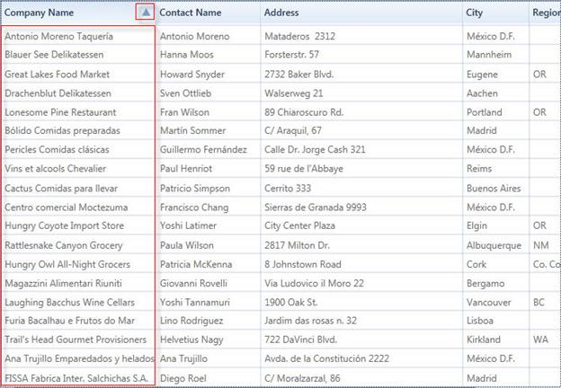

::: {style="DISPLAY: none"}
{#d2h_url_template}{#d2h_package_url style="WIDTH: 0px; DISPLAY: none; HEIGHT: 0px"}
:::

::: {.d2h_secondary_topic style="PADDING-BOTTOM: 10pt; MARGIN: 0pt; PADDING-LEFT: 0pt; PADDING-RIGHT: 0pt; PADDING-TOP: 0pt"}
##### Custom Sorting {#custom-sorting style="tab-stops: 0pt"}

Custom sorting helps you to sort the records of the selected field values depending on your needs.  It also allows you to sort the data against one or more columns in the GridDataControl.

 

The custom sorting sorts the values using custom sorting logic. To perform the custom sorting, you need to hook the *SortColumnChanging* or *SortColumnChangingCommand* event and pass the custom sorting logic to the *CustomComparer*.

 

To create a custom comparer to implement the custom sorting logic, you need to derive the logic from *IComparer\<object\>* and *ISortDirection*. The custom sorting is performed by comparing the values of particular columns. When grouping is applied, the custom sorting can be performed by comparing the Group keys.

 

Example Scenario

 

The following code examples illustrate how to perform the custom sorting for the names in the **Company Name** column according to the string length of the names.

 

To enable the custom sorting, hook the *SortColumnsChanging* event.

**[]{style="FONT-FAMILY: 'Cambria','serif'; FONT-SIZE: 12pt"}** 

+----------------------------------------------------------------------------------+
|     [C#]                                                                         |
|                                                                                  |
|                                                                                  |
|                                                                                  |
|     this.dataGrid.Model.Table.SortColumnsChanging += new GridDataSortColumnsChan |
|                                                                                  |
|     gingEventHandler(Table_SortColumnsChanging);                                 |
|                                                                                  |
|                                                                                  |
+----------------------------------------------------------------------------------+

**[]{style="FONT-FAMILY: 'Cambria','serif'; FONT-SIZE: 12pt"}** 

Set the comparer for the column on which the data needs to be sorted using the custom sorting logic. Here, the comparer is assigned to CompanyName.

**[]{style="FONT-FAMILY: 'Cambria','serif'; FONT-SIZE: 12pt"}** 

+------------------------------------------------------------------------------------+
| **[\[C#\]]{style="FONT-FAMILY: 'Courier New'"}**                                   |
|                                                                                    |
| []{style="FONT-FAMILY: 'Courier New'; COLOR: blue"}                                |
|                                                                                    |
|     //This method will be hooked when clicking the header                          |
|                                                                                    |
|                                                                                    |
|       void Table_SortColumnsChanging(object sender, GridDataSortColumnsChangingEve |
|                                                                                    |
|     ntArgs args)                                                                   |
|                                                                                    |
|     {                                                                              |
|                                                                                    |
|         if (args != null)                                                          |
|                                                                                    |
|         {                                                                          |
|                                                                                    |
|             foreach (var item in args.AddedItems)                                  |
|                                                                                    |
|             {                                                                      |
|                                                                                    |
|                //Choosing the column to be sorted                                  |
|                                                                                    |
|                                                                                    |
|                if (item.ColumnName.Equals("CompanyName"))                          |
|                                                                                    |
|                {                                                                   |
|                                                                                    |
|                    //Passing the custom sort logic to CustomComparer               |
|                                                                                    |
|                                                                                    |
|                    item.CustomComparer = new CustomerInfo();                       |
|                                                                                    |
|                }                                                                   |
|                                                                                    |
|             }                                                                      |
|                                                                                    |
|         }                                                                          |
|                                                                                    |
|     }                                                                              |
+------------------------------------------------------------------------------------+

 

Check the direction of the sorting by using the *SortDirection* property of the *ListSortDirection* class. The *Compare* method of the *IComparer* interface uses two parameters to compare the length of the string.

**[]{style="FONT-FAMILY: 'Cambria','serif'; FONT-SIZE: 12pt"}** 

+-----------------------------------------------------------------------------------------------------------------------------------------------------------------------------------------------------------------------------------------------------+
| **[\[C#\]]{style="FONT-FAMILY: 'Courier New'"}**                                                                                                                                                                                                    |
|                                                                                                                                                                                                                                                     |
| []{style="FONT-FAMILY: 'Courier New'; COLOR: blue"}                                                                                                                                                                                                 |
|                                                                                                                                                                                                                                                     |
| [public]{style="FONT-FAMILY: 'Courier New'; COLOR: blue"}[ [class]{style="COLOR: blue"} [CustomerInfo]{style="COLOR: #2b91af"} : [IComparer]{style="COLOR: #2b91af"}\<[Object]{style="COLOR: #2b91af"}\>, [ISortDirection]{style="COLOR: #2b91af"}\ |
|     {\                                                                                                                                                                                                                                              |
|         [//Implementation of ICompare method]{style="COLOR: green"}]{style="FONT-FAMILY: 'Courier New'"}                                                                                                                                            |
|                                                                                                                                                                                                                                                     |
| [\                                                                                                                                                                                                                                                  |
|         [public]{style="COLOR: blue"} [int]{style="COLOR: blue"} Compare([object]{style="COLOR: blue"} x, [object]{style="COLOR: blue"} y)\                                                                                                         |
|         {\                                                                                                                                                                                                                                          |
|             [int]{style="COLOR: blue"} namX;\                                                                                                                                                                                                       |
|             [int]{style="COLOR: blue"} namY;\                                                                                                                                                                                                       |
|             [//For Normal case]{style="COLOR: green"}]{style="FONT-FAMILY: 'Courier New'"}                                                                                                                                                          |
|                                                                                                                                                                                                                                                     |
| []{style="FONT-FAMILY: 'Courier New'"}                                                                                                                                                                                                              |
|                                                                                                                                                                                                                                                     |
| [            [if]{style="COLOR: blue"} (x.GetType() == [typeof]{style="COLOR: blue"}([Customers]{style="COLOR: #2b91af"}))\                                                                                                                         |
|             {\                                                                                                                                                                                                                                      |
|                 [//Calculating the length if the object is of Customers type]{style="COLOR: green"}]{style="FONT-FAMILY: 'Courier New'"}                                                                                                            |
|                                                                                                                                                                                                                                                     |
| [\                                                                                                                                                                                                                                                  |
|                 namX = (([Customers]{style="COLOR: #2b91af"})x).CompanyName.Length;\                                                                                                                                                                |
|                 namY = (([Customers]{style="COLOR: #2b91af"})y).CompanyName.Length;\                                                                                                                                                                |
|             }]{style="FONT-FAMILY: 'Courier New'"}                                                                                                                                                                                                  |
|                                                                                                                                                                                                                                                     |
| [            [//While Grouping]{style="COLOR: green"}]{style="FONT-FAMILY: 'Courier New'"}                                                                                                                                                          |
|                                                                                                                                                                                                                                                     |
| [\                                                                                                                                                                                                                                                  |
|             [else]{style="COLOR: blue"} [if]{style="COLOR: blue"} (x.GetType() == [typeof]{style="COLOR: blue"}([Group]{style="COLOR: #2b91af"}))\                                                                                                  |
|             {\                                                                                                                                                                                                                                      |
|                 [//Calculating the length if the object is of Group type]{style="COLOR: green"}]{style="FONT-FAMILY: 'Courier New'"}                                                                                                                |
|                                                                                                                                                                                                                                                     |
| [\                                                                                                                                                                                                                                                  |
|                 namX = (([Group]{style="COLOR: #2b91af"})x).Key.ToString().Length;\                                                                                                                                                                 |
|                 namY = (([Group]{style="COLOR: #2b91af"})y).Key.ToString().Length;\                                                                                                                                                                 |
|             }\                                                                                                                                                                                                                                      |
|             [else]{style="COLOR: blue"}\                                                                                                                                                                                                            |
|             {\                                                                                                                                                                                                                                      |
|                 namX = x.ToString().Length;\                                                                                                                                                                                                        |
|                 namY = y.ToString().Length;\                                                                                                                                                                                                        |
|             }\                                                                                                                                                                                                                                      |
|             [//Object is passed through the Compare method and gets the]{style="COLOR: green"}]{style="FONT-FAMILY: 'Courier New'"}                                                                                                                 |
|                                                                                                                                                                                                                                                     |
| [ SortDirection.]{style="FONT-FAMILY: 'Courier New'; COLOR: green"}                                                                                                                                                                                 |
|                                                                                                                                                                                                                                                     |
| [\                                                                                                                                                                                                                                                  |
|             [if]{style="COLOR: blue"} (namX.CompareTo(namY) \> 0)\                                                                                                                                                                                  |
|                 [return]{style="COLOR: blue"} SortDirection == [ListSortDirection]{style="COLOR: #2b91af"}.Ascending ? 1 : -1;\                                                                                                                     |
|             [else]{style="COLOR: blue"} [if]{style="COLOR: blue"} (namX.CompareTo(namY) == -1)\                                                                                                                                                     |
|                 [return]{style="COLOR: blue"} SortDirection == [ListSortDirection]{style="COLOR: #2b91af"}.Ascending ? -1 : 1;\                                                                                                                     |
|             [else]{style="COLOR: blue"}\                                                                                                                                                                                                            |
|                 [return]{style="COLOR: blue"} 0;\                                                                                                                                                                                                   |
|         }\                                                                                                                                                                                                                                          |
|  \                                                                                                                                                                                                                                                  |
|         [//gets or sets the SortDirection]{style="COLOR: green"}]{style="FONT-FAMILY: 'Courier New'"}                                                                                                                                               |
|                                                                                                                                                                                                                                                     |
| [\                                                                                                                                                                                                                                                  |
|         [private]{style="COLOR: blue"} [ListSortDirection]{style="COLOR: #2b91af"} \_SortDirection;\                                                                                                                                                |
|         [public]{style="COLOR: blue"} [ListSortDirection]{style="COLOR: #2b91af"} SortDirection\                                                                                                                                                    |
|         {\                                                                                                                                                                                                                                          |
|             [get]{style="COLOR: blue"}\                                                                                                                                                                                                             |
|             {\                                                                                                                                                                                                                                      |
|                 [return]{style="COLOR: blue"} \_SortDirection;\                                                                                                                                                                                     |
|             }\                                                                                                                                                                                                                                      |
|             [set]{style="COLOR: blue"}\                                                                                                                                                                                                             |
|             {\                                                                                                                                                                                                                                      |
|                 \_SortDirection = [value]{style="COLOR: blue"};\                                                                                                                                                                                    |
|             }\                                                                                                                                                                                                                                      |
|         }\                                                                                                                                                                                                                                          |
|     }]{style="FONT-FAMILY: 'Courier New'"}                                                                                                                                                                                                          |
|                                                                                                                                                                                                                                                     |
| []{style="FONT-FAMILY: 'Courier New'"}                                                                                                                                                                                                              |
+-----------------------------------------------------------------------------------------------------------------------------------------------------------------------------------------------------------------------------------------------------+

 

The following screenshot displays the **Company Name** column with the sorted names according to their length.

 

{border="0"}

Figure 171. Custom Sorting by "Company Name" header according to the string length

 

[]{#related-topics}
:::
