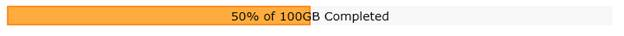

::: {style="DISPLAY: none"}
{#d2h_url_template}{#d2h_package_url style="WIDTH: 0px; DISPLAY: none; HEIGHT: 0px"}
:::

::: {.d2h_secondary_topic style="PADDING-BOTTOM: 10pt; MARGIN: 0pt; PADDING-LEFT: 0pt; PADDING-RIGHT: 0pt; PADDING-TOP: 0pt"}
#### Custom Text {#custom-text style="tab-stops: 0pt"}

You can set the custom text that will display when the progress bar shows different levels of progress, using the following code.\
There are two ways in which you can set the orientation of the Progress bar, both of which use properties from the [properties table]{style="FONT-FAMILY: 'Arial','sans-serif'"}.

Using Builder

1.   In **View**, invoke the ProgressBar helper with the control ID as an argument, followed by the Custom text method, with the desired text as an argument.

[]{style="FONT-SIZE: 12pt"} 

+--------------------------------------------------------------------------------------------------------------------------+
| [\[ASPX\]]{style="FONT-FAMILY: 'Courier New'"}                                                                           |
|                                                                                                                          |
| []{style="FONT-FAMILY: 'Courier New'; BACKGROUND: yellow"}                                                               |
|                                                                                                                          |
| [\<%]{style="FONT-FAMILY: 'Courier New'; BACKGROUND: yellow"}[{]{style="FONT-FAMILY: 'Courier New'"}                     |
|                                                                                                                          |
| [      Html.Syncfusion().ProgressBar([\"Progress\"]{style="COLOR: #a31515"})]{style="FONT-FAMILY: 'Courier New'"}        |
|                                                                                                                          |
| [      .AllowCustomText([true]{style="COLOR: blue"})]{style="FONT-FAMILY: 'Courier New'"}                                |
|                                                                                                                          |
| [      .ClientSideOnCustomTextRendering([\"onCustomText\"]{style="COLOR: #a31515"})]{style="FONT-FAMILY: 'Courier New'"} |
|                                                                                                                          |
| [      .Render();]{style="FONT-FAMILY: 'Courier New'"}                                                                   |
|                                                                                                                          |
| [  } [%\>]{style="BACKGROUND: yellow"}]{style="FONT-FAMILY: 'Courier New'"}                                              |
+--------------------------------------------------------------------------------------------------------------------------+

[]{style="FONT-SIZE: 12pt"} 

+----------------------------------------------------------------------------------------------------------------------------------------------------------------------------------------------------------------------+
| [\[Razor\]]{style="BACKGROUND: yellow; COLOR: black"}                                                                                                                                                                |
|                                                                                                                                                                                                                      |
| []{style="BACKGROUND: yellow; COLOR: black"}                                                                                                                                                                         |
|                                                                                                                                                                                                                      |
| [\@{]{style="FONT-FAMILY: 'Courier New'; BACKGROUND: yellow; COLOR: black"}[]{style="FONT-FAMILY: 'Courier New'; COLOR: black"}                                                                                      |
|                                                                                                                                                                                                                      |
| [    Html.Syncfusion().ProgressBar(]{style="FONT-FAMILY: 'Courier New'; COLOR: black"}[\"Progress\"]{style="FONT-FAMILY: 'Courier New'; COLOR: #a31515"}[)]{style="FONT-FAMILY: 'Courier New'; COLOR: black"}        |
|                                                                                                                                                                                                                      |
| [    .Height(22)]{style="FONT-FAMILY: 'Courier New'; COLOR: black"}                                                                                                                                                  |
|                                                                                                                                                                                                                      |
| [    .Width(700)]{style="FONT-FAMILY: 'Courier New'; COLOR: black"}                                                                                                                                                  |
|                                                                                                                                                                                                                      |
| [    .Value(50)]{style="FONT-FAMILY: 'Courier New'; COLOR: black"}                                                                                                                                                   |
|                                                                                                                                                                                                                      |
| [    .AllowCustomText(]{style="FONT-FAMILY: 'Courier New'; COLOR: black"}[true]{style="FONT-FAMILY: 'Courier New'; COLOR: blue"}[)]{style="FONT-FAMILY: 'Courier New'; COLOR: black"}                                |
|                                                                                                                                                                                                                      |
| [    .Orientation(]{style="FONT-FAMILY: 'Courier New'; COLOR: black"}[ProgressBarOrientation]{style="FONT-FAMILY: 'Courier New'; COLOR: #2b91af"}[.Horizontal)]{style="FONT-FAMILY: 'Courier New'; COLOR: black"}    |
|                                                                                                                                                                                                                      |
| [    .Minimum(10)]{style="FONT-FAMILY: 'Courier New'; COLOR: black"}                                                                                                                                                 |
|                                                                                                                                                                                                                      |
| [    .Maximum(100)    ]{style="FONT-FAMILY: 'Courier New'; COLOR: black"}                                                                                                                                            |
|                                                                                                                                                                                                                      |
| [    .ClientSideOnCustomTextRendering(]{style="FONT-FAMILY: 'Courier New'; COLOR: black"}[\"onCustomText\"]{style="FONT-FAMILY: 'Courier New'; COLOR: #a31515"}[)]{style="FONT-FAMILY: 'Courier New'; COLOR: black"} |
|                                                                                                                                                                                                                      |
| [    .Render();]{style="FONT-FAMILY: 'Courier New'; COLOR: black"}                                                                                                                                                   |
|                                                                                                                                                                                                                      |
| [}]{style="FONT-FAMILY: 'Courier New'; BACKGROUND: yellow; COLOR: black"}[]{style="FONT-FAMILY: 'Courier New'; COLOR: black"}                                                                                        |
|                                                                                                                                                                                                                      |
| []{style="FONT-FAMILY: 'Courier New'"}                                                                                                                                                                               |
+----------------------------------------------------------------------------------------------------------------------------------------------------------------------------------------------------------------------+

[]{style="FONT-SIZE: 12pt"} 

2.   In Javascript, define the handler as shown below:

 

+--------------------------------------------------------------------------------------------------------------------------------------------------------------------------------------------+
|                                                                                                                                                                                            |
|                                                                                                                                                                                            |
| \[Javascript\]                                                                                                                                                                             |
|                                                                                                                                                                                            |
| \<[script]{style="COLOR: maroon"} [type]{style="COLOR: red"}=\"text/javascript\"\>[]{style="COLOR: blue"}                                                                                  |
|                                                                                                                                                                                            |
| [function]{style="COLOR: blue"}[ onCustomText(progressBar, currentValue) {]{style="COLOR: black"}                                                                                          |
|                                                                                                                                                                                            |
| [     ]{style="COLOR: black"}[var]{style="COLOR: blue"}[ context = currentValue.\_Context;]{style="COLOR: black"}                                                                          |
|                                                                                                                                                                                            |
| [    ]{style="COLOR: black"}[var]{style="COLOR: blue"}[ text;]{style="COLOR: black"}                                                                                                       |
|                                                                                                                                                                                            |
| [    ]{style="COLOR: black"}[if]{style="COLOR: blue"}[ (progressBar == ]{style="COLOR: black"}[null]{style="COLOR: blue"}[)]{style="COLOR: black"}                                         |
|                                                                                                                                                                                            |
| [        progressBar = \$find(controlId);]{style="COLOR: black"}                                                                                                                           |
|                                                                                                                                                                                            |
| [    ]{style="COLOR: black"}[/// adding the custom text with the progressbar value  ]{style="COLOR: darkgreen"}[]{style="COLOR: black"}                                                    |
|                                                                                                                                                                                            |
| [    text = currentValue.\_Value + ]{style="COLOR: black"}[\"% of 100GB Completed\"]{style="COLOR: maroon"}[;]{style="COLOR: black"}                                                       |
|                                                                                                                                                                                            |
| [    ]{style="COLOR: black"}[var]{style="COLOR: blue"}[ text_width = context.measureText(text).width;]{style="COLOR: black"}                                                               |
|                                                                                                                                                                                            |
| [    ]{style="COLOR: black"}[/// we must set this angle then only the text is aligned properly when we set the Orientation as Vertical]{style="COLOR: darkgreen"}[]{style="COLOR: black"}  |
|                                                                                                                                                                                            |
| [    ]{style="COLOR: black"}[///The user must define the font size]{style="COLOR: darkgreen"}                                                                                              |
|                                                                                                                                                                                            |
| [   /// This is the simple example for how to calculate the width, text_x value.]{style="COLOR: darkgreen"}[ ]{style="COLOR: black"}                                                       |
|                                                                                                                                                                                            |
| [    ]{style="COLOR: black"}[var]{style="COLOR: blue"}[ ang = 270;]{style="COLOR: black"}                                                                                                  |
|                                                                                                                                                                                            |
| [    ]{style="COLOR: black"}[var]{style="COLOR: blue"}[ fontsize = 22;]{style="COLOR: black"}                                                                                              |
|                                                                                                                                                                                            |
| [    ]{style="COLOR: black"}[if]{style="COLOR: blue"}[ (progressOrientation == ]{style="COLOR: black"}[null]{style="COLOR: blue"}[)]{style="COLOR: black"}                                 |
|                                                                                                                                                                                            |
| [        progressOrientation = ]{style="COLOR: black"}[\"horizontal\"]{style="COLOR: maroon"}[;]{style="COLOR: black"}                                                                     |
|                                                                                                                                                                                            |
| [    context.save();]{style="COLOR: black"}                                                                                                                                                |
|                                                                                                                                                                                            |
| [    ]{style="COLOR: black"}[if]{style="COLOR: blue"}[ (progressOrientation == ]{style="COLOR: black"}[\"horizontal\"]{style="COLOR: maroon"}[) {]{style="COLOR: black"}                   |
|                                                                                                                                                                                            |
| [        ]{style="COLOR: black"}[var]{style="COLOR: blue"}[ text_x = currentValue.\_OffsetX + currentValue.\_Width / 2 - text_width / 2;]{style="COLOR: black"}                            |
|                                                                                                                                                                                            |
| [        context.fillText(text, text_x, currentValue.\_Height / 2 + currentValue.\_OffsetY + currentValue.\_Radius / 2);]{style="COLOR: black"}                                            |
|                                                                                                                                                                                            |
| [    }]{style="COLOR: black"}                                                                                                                                                              |
|                                                                                                                                                                                            |
| [    ]{style="COLOR: black"}[else]{style="COLOR: blue"}[ {]{style="COLOR: black"}                                                                                                          |
|                                                                                                                                                                                            |
| [        ]{style="COLOR: black"}[var]{style="COLOR: blue"}[ text_x = currentValue.\_Width / 2 - currentValue.\_Radius / 2 + currentValue.\_OffsetX;]{style="COLOR: black"}                 |
|                                                                                                                                                                                            |
| [        context.fillText(text, fontsize, text_x, currentValue.\_OffsetX + currentValue.\_Height / 2, ]{style="COLOR: black"}[\"\"]{style="COLOR: maroon"}[ + ang);]{style="COLOR: black"} |
|                                                                                                                                                                                            |
| [    }]{style="COLOR: black"}                                                                                                                                                              |
|                                                                                                                                                                                            |
| [    context.restore();]{style="COLOR: black"}                                                                                                                                             |
|                                                                                                                                                                                            |
| [ }  ]{style="COLOR: black"}                                                                                                                                                               |
|                                                                                                                                                                                            |
| [\</[script\>]{style="COLOR: maroon"}[                  ]{style="COLOR: black"}]{style="FONT-FAMILY: 'Courier New'"}                                                                       |
+--------------------------------------------------------------------------------------------------------------------------------------------------------------------------------------------+

[]{style="FONT-SIZE: 12pt"} 

[]{style="FONT-SIZE: 12pt"} 

3.   Build and run the application.

 

Using PropertiesModel

1.   In the controller, create an instance of the ProgressBarPropertiesModel.

2.   Define the Custom text property and pass the instance through the view-specific data to the view.

 

+---------------------------------------------------------------------------------------------------------------------------------------------------------------------------------------------------------------------------------------------------------------------------------------+
| [\[controller\]]{style="FONT-FAMILY: 'Courier New'; COLOR: blue"}                                                                                                                                                                                                                     |
|                                                                                                                                                                                                                                                                                       |
| []{style="FONT-FAMILY: 'Courier New'; COLOR: blue"}                                                                                                                                                                                                                                   |
|                                                                                                                                                                                                                                                                                       |
| [public]{style="FONT-FAMILY: 'Courier New'; COLOR: blue"}[ ActionResult Index()]{style="FONT-FAMILY: 'Courier New'"}                                                                                                                                                                  |
|                                                                                                                                                                                                                                                                                       |
| [{  ]{style="FONT-FAMILY: 'Courier New'"}                                                                                                                                                                                                                                             |
|                                                                                                                                                                                                                                                                                       |
| [                        ]{style="FONT-FAMILY: 'Courier New'; COLOR: black"}[ProgressBarPropertiesModel[ model = ]{style="COLOR: black"}[new]{style="COLOR: blue"}[ ]{style="COLOR: black"}ProgressBarPropertiesModel[();]{style="COLOR: black"}]{style="FONT-FAMILY: 'Courier New'"} |
|                                                                                                                                                                                                                                                                                       |
| [model.AllowCustomText = [true]{style="COLOR: blue"};]{style="FONT-FAMILY: 'Courier New'"}                                                                                                                                                                                            |
|                                                                                                                                                                                                                                                                                       |
| [model.ClientSideOnCustomTextRendering = [\" onCustomText \"]{style="COLOR: #a31515"};]{style="FONT-FAMILY: 'Courier New'"}                                                                                                                                                           |
|                                                                                                                                                                                                                                                                                       |
| [            ViewData\[[\"Progress\"]{style="COLOR: #a31515"}\] = [model]{style="COLOR: black"};]{style="FONT-FAMILY: 'Courier New'"}                                                                                                                                                 |
|                                                                                                                                                                                                                                                                                       |
| []{style="FONT-FAMILY: 'Courier New'"}                                                                                                                                                                                                                                                |
|                                                                                                                                                                                                                                                                                       |
| [            [return]{style="COLOR: blue"} View();]{style="FONT-FAMILY: 'Courier New'"}                                                                                                                                                                                               |
|                                                                                                                                                                                                                                                                                       |
| [ }]{style="FONT-FAMILY: 'Courier New'"}                                                                                                                                                                                                                                              |
|                                                                                                                                                                                                                                                                                       |
|                                                                                                                                                                                                                                                                                       |
+---------------------------------------------------------------------------------------------------------------------------------------------------------------------------------------------------------------------------------------------------------------------------------------+

[]{style="FONT-SIZE: 12pt"} 

3.   In View, invoke the ProgressBar helper with the view data key as the control ID.

 

+------------------------------------------------------------------------------------------------------------------------------------------------------------------------------------------------------------+
| **[\[View\]]{style="FONT-FAMILY: 'Courier New'"}**                                                                                                                                                         |
|                                                                                                                                                                                                            |
| [    [\<%]{style="BACKGROUND: yellow"}{ Html.Syncfusion().ProgressBar(]{style="COLOR: black"}[\"Progress\"]{style="COLOR: #a31515"}[).Render(); } [%\>]{style="BACKGROUND: yellow"}]{style="COLOR: black"} |
|                                                                                                                                                                                                            |
|                                                                                                                                                                                                            |
+------------------------------------------------------------------------------------------------------------------------------------------------------------------------------------------------------------+

 

+--------------------------------------------------------------------------------------------------------------------------------------------------------------------------------------------------------+
| [\[Razor\]]{style="BACKGROUND: yellow; COLOR: black"}                                                                                                                                                  |
|                                                                                                                                                                                                        |
| []{style="BACKGROUND: yellow; COLOR: black"}                                                                                                                                                           |
|                                                                                                                                                                                                        |
| [\@{]{style="FONT-FAMILY: 'Courier New'; BACKGROUND: yellow; COLOR: black"}[]{style="FONT-FAMILY: 'Courier New'; COLOR: black"}                                                                        |
|                                                                                                                                                                                                        |
| [      ]{style="COLOR: black"}[Html.Syncfusion().ProgressBar(]{style="COLOR: black; FONT-SIZE: 12pt"}[\"Progress\"]{style="COLOR: #a31515; FONT-SIZE: 12pt"}[)]{style="COLOR: black; FONT-SIZE: 12pt"} |
|                                                                                                                                                                                                        |
| [     .Render();]{style="COLOR: black; FONT-SIZE: 12pt"}                                                                                                                                               |
|                                                                                                                                                                                                        |
| []{style="FONT-FAMILY: 'Courier New'; COLOR: black"}                                                                                                                                                   |
|                                                                                                                                                                                                        |
| [}]{style="FONT-FAMILY: 'Courier New'; BACKGROUND: yellow; COLOR: black"}[]{style="FONT-FAMILY: 'Courier New'; COLOR: black"}                                                                          |
|                                                                                                                                                                                                        |
| []{style="FONT-FAMILY: 'Courier New'"}                                                                                                                                                                 |
+--------------------------------------------------------------------------------------------------------------------------------------------------------------------------------------------------------+

[]{style="FONT-SIZE: 12pt"} 

4.   In Javascript, define the handler as shown below:

 

+----------------------------------------------------------------------------------------------------------------------------------------------------------------------------------------------------------------------------------------------------------------------------+
|                                                                                                                                                                                                                                                                            |
|                                                                                                                                                                                                                                                                            |
| \[Javascript\]                                                                                                                                                                                                                                                             |
|                                                                                                                                                                                                                                                                            |
| \<[script]{style="COLOR: maroon"} [type]{style="COLOR: red"}=\"text/javascript\"\>[]{style="COLOR: blue"}                                                                                                                                                                  |
|                                                                                                                                                                                                                                                                            |
| [function]{style="COLOR: blue"}[ onCustomText(progressBar, currentValue) {]{style="COLOR: black"}                                                                                                                                                                          |
|                                                                                                                                                                                                                                                                            |
| [     ]{style="COLOR: black"}[var]{style="COLOR: blue"}[ context = currentValue.\_Context;]{style="COLOR: black"}                                                                                                                                                          |
|                                                                                                                                                                                                                                                                            |
| [    ]{style="COLOR: black"}[var]{style="COLOR: blue"}[ text;]{style="COLOR: black"}                                                                                                                                                                                       |
|                                                                                                                                                                                                                                                                            |
| [    ]{style="COLOR: black"}[if]{style="COLOR: blue"}[ (progressBar == ]{style="COLOR: black"}[null]{style="COLOR: blue"}[)]{style="COLOR: black"}                                                                                                                         |
|                                                                                                                                                                                                                                                                            |
| [        progressBar = \$find(controlId);]{style="COLOR: black"}                                                                                                                                                                                                           |
|                                                                                                                                                                                                                                                                            |
| [    ]{style="COLOR: black"}[/// adding the custom text with the progressbar value  ]{style="COLOR: darkgreen"}[]{style="COLOR: black"}                                                                                                                                    |
|                                                                                                                                                                                                                                                                            |
| [    text = currentValue.\_Value + ]{style="COLOR: black"}[\"% of 100GB Completed\"]{style="COLOR: maroon"}[;]{style="COLOR: black"}                                                                                                                                       |
|                                                                                                                                                                                                                                                                            |
| [    ]{style="COLOR: black"}[var]{style="COLOR: blue"}[ text_width = context.measureText(text).width;]{style="COLOR: black"}                                                                                                                                               |
|                                                                                                                                                                                                                                                                            |
| [    ]{style="COLOR: black"}[/// we must set this angle then only the text is aligned properly when we set the Orientation as Vertical]{style="COLOR: darkgreen"}[]{style="COLOR: black"}                                                                                  |
|                                                                                                                                                                                                                                                                            |
| [    ]{style="COLOR: black"}[///The user must define the font size]{style="COLOR: darkgreen"}                                                                                                                                                                              |
|                                                                                                                                                                                                                                                                            |
| [   /// This is the simple example for how to calculate the width, text_x value.]{style="COLOR: darkgreen"}[ ]{style="COLOR: black"}                                                                                                                                       |
|                                                                                                                                                                                                                                                                            |
| [    ]{style="COLOR: black"}[var]{style="COLOR: blue"}[ ang = 270;]{style="COLOR: black"}                                                                                                                                                                                  |
|                                                                                                                                                                                                                                                                            |
| [    ]{style="COLOR: black"}[var]{style="COLOR: blue"}[ fontsize = 22;]{style="COLOR: black"}                                                                                                                                                                              |
|                                                                                                                                                                                                                                                                            |
| [    ]{style="COLOR: black"}[if]{style="COLOR: blue"}[ (progressOrientation == ]{style="COLOR: black"}[null]{style="COLOR: blue"}[)]{style="COLOR: black"}                                                                                                                 |
|                                                                                                                                                                                                                                                                            |
| [        progressOrientation = ]{style="COLOR: black"}[\"horizontal\"]{style="COLOR: maroon"}[;]{style="COLOR: black"}                                                                                                                                                     |
|                                                                                                                                                                                                                                                                            |
| [    context.save();]{style="COLOR: black"}                                                                                                                                                                                                                                |
|                                                                                                                                                                                                                                                                            |
| [       if]{style="COLOR: blue"}[ (progressOrientation == ]{style="COLOR: black"}[\"horizontal\"]{style="COLOR: maroon"}[) {]{style="COLOR: black"}                                                                                                                        |
|                                                                                                                                                                                                                                                                            |
| [         var]{style="COLOR: blue"}[ text_x = currentValue.\_OffsetX + currentValue.\_Width / 2 -          text_width / 2;          context.fillText(text, text_x, currentValue.\_Height / 2 + currentValue.\_OffsetY + currentValue.\_Radius / 2);]{style="COLOR: black"} |
|                                                                                                                                                                                                                                                                            |
| [    }]{style="COLOR: black"}                                                                                                                                                                                                                                              |
|                                                                                                                                                                                                                                                                            |
| [    ]{style="COLOR: black"}[else]{style="COLOR: blue"}[ {]{style="COLOR: black"}                                                                                                                                                                                          |
|                                                                                                                                                                                                                                                                            |
| [        ]{style="COLOR: black"}[var]{style="COLOR: blue"}[ text_x = currentValue.\_Width / 2 -        currentValue.\_Radius / 2 + currentValue.\_OffsetX;]{style="COLOR: black"}                                                                                          |
|                                                                                                                                                                                                                                                                            |
| [        context.fillText(text, fontsize, text_x, currentValue.\_OffsetX + currentValue.\_Height / 2, ]{style="COLOR: black"}[\"\"]{style="COLOR: maroon"}[ + ang);]{style="COLOR: black"}                                                                                 |
|                                                                                                                                                                                                                                                                            |
| [    }]{style="COLOR: black"}                                                                                                                                                                                                                                              |
|                                                                                                                                                                                                                                                                            |
| [    context.restore();]{style="COLOR: black"}                                                                                                                                                                                                                             |
|                                                                                                                                                                                                                                                                            |
| [ }  ]{style="COLOR: black"}                                                                                                                                                                                                                                               |
|                                                                                                                                                                                                                                                                            |
| [\</[script\>]{style="COLOR: maroon"}[                  ]{style="COLOR: black"}]{style="FONT-FAMILY: 'Courier New'"}                                                                                                                                                       |
+----------------------------------------------------------------------------------------------------------------------------------------------------------------------------------------------------------------------------------------------------------------------------+

[]{style="FONT-SIZE: 12pt"} 

[]{style="FONT-SIZE: 12pt"} 

5.   Build and run the application, the output will be as follows:

 

{border="0"}

Figure 174: Custom Text in Progress Bar**[]{style="FONT-STYLE: normal"}**

 

[]{#related-topics}
:::
