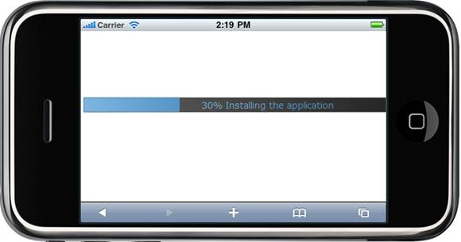

::: {style="DISPLAY: none"}
{#d2h_url_template} {#d2h_package_url style="WIDTH: 0px; DISPLAY: none; HEIGHT: 0px"}
:::

::: {.d2h_secondary_topic style="PADDING-BOTTOM: 10pt; MARGIN: 0pt; PADDING-LEFT: 0pt; PADDING-RIGHT: 0pt; PADDING-TOP: 0pt"}
#### CustomText {#customtext style="tab-stops: 0pt"}

This feature allows the user to customize the display text of the Progress Bar. You can set the custom text that will display when the progress bar shows different levels of progress.

+-----------------+------------------------------------------------------------+------------------+------------------+-------------+
| Name            | Description                                                | Type of property | Value it accepts | Dependency  |
+-----------------+------------------------------------------------------------+------------------+------------------+-------------+
| AllowCustomText | Sets the whether the custom text will be displayed or not. | bool             | True/            | NA          |
|                 |                                                            |                  |                  |             |
|                 |                                                            |                  | False            |             |
+-----------------+------------------------------------------------------------+------------------+------------------+-------------+

 

The following steps guide you to customize the display text of the progress bar.

1.   In View, invoke the ProgressBar helper with the ProgressBar id as the first argument and set the AllowCustomText() method with the desired value as an argument. 

+---------------------------------------------------------------------------------------------------------------------------------------------------------------------------------+
| **[\[ASPX\]]{style="FONT-FAMILY: 'Courier New'"}**                                                                                                                              |
|                                                                                                                                                                                 |
| [\<%]{style="FONT-FAMILY: 'Courier New'; BACKGROUND: yellow"} [Html.MobSyncfusion().ProgressBar([\"progressBar\"]{style="COLOR: #a31515"})]{style="FONT-FAMILY: 'Courier New'"} |
|                                                                                                                                                                                 |
| [       .Value(30)]{style="FONT-FAMILY: 'Courier New'"}                                                                                                                         |
|                                                                                                                                                                                 |
| [       **.AllowCustomText(true)**]{style="FONT-FAMILY: 'Courier New'"}                                                                                                         |
|                                                                                                                                                                                 |
| **[       .ClientSideOnCustomTextRendering([\"onCustomText\"]{style="COLOR: #a31515"})]{style="FONT-FAMILY: 'Courier New'"}**                                                   |
|                                                                                                                                                                                 |
| [      .Render();]{style="FONT-FAMILY: 'Courier New'"}                                                                                                                          |
|                                                                                                                                                                                 |
| [    [%\>]{style="BACKGROUND: yellow"}]{style="FONT-FAMILY: 'Courier New'"}                                                                                                     |
+---------------------------------------------------------------------------------------------------------------------------------------------------------------------------------+

[]{style="COLOR: black"} 

+------------------------------------------------------------------------------------------------------------------------------------------------------------------------------+
| **[\[Razor\]]{style="FONT-FAMILY: 'Courier New'"}**                                                                                                                          |
|                                                                                                                                                                              |
| [ [\@{]{style="BACKGROUND: yellow"}]{style="FONT-FAMILY: 'Courier New'; COLOR: black"}                                                                                       |
|                                                                                                                                                                              |
| [      ]{style="FONT-FAMILY: 'Courier New'; COLOR: black"} [Html.MobSyncfusion().ProgressBar([\"progressBar\"]{style="COLOR: #a31515"})]{style="FONT-FAMILY: 'Courier New'"} |
|                                                                                                                                                                              |
| [       .Value(30)]{style="FONT-FAMILY: 'Courier New'"}                                                                                                                      |
|                                                                                                                                                                              |
| [       **.AllowCustomText(true)**]{style="FONT-FAMILY: 'Courier New'"}                                                                                                      |
|                                                                                                                                                                              |
| **[       .ClientSideOnCustomTextRendering([\"onCustomText\"]{style="COLOR: #a31515"})]{style="FONT-FAMILY: 'Courier New'"}**                                                |
|                                                                                                                                                                              |
| [      .Render();]{style="FONT-FAMILY: 'Courier New'"}                                                                                                                       |
|                                                                                                                                                                              |
| [ }]{style="FONT-FAMILY: 'Courier New'; COLOR: black"} []{style="FONT-FAMILY: 'Courier New'; COLOR: black"}                                                                  |
+------------------------------------------------------------------------------------------------------------------------------------------------------------------------------+

[]{style="COLOR: black"} 

2.  [Define the custom text handler in view.]{style="FONT-FAMILY: 'Arial','sans-serif'"}

+------------------------------------------------------------------------------------------------------------------------------------------------------------------------------------------------------------------------------------+
| []{style="FONT-FAMILY: 'Courier New'; COLOR: blue"}                                                                                                                                                                                |
|                                                                                                                                                                                                                                    |
| **[\[Javascript\]]{style="FONT-FAMILY: 'Courier New'"}** []{style="FONT-FAMILY: 'Courier New'; COLOR: blue"}                                                                                                                       |
|                                                                                                                                                                                                                                    |
| []{style="FONT-FAMILY: 'Courier New'; COLOR: blue"}                                                                                                                                                                                |
|                                                                                                                                                                                                                                    |
| [\<]{style="FONT-FAMILY: 'Courier New'; COLOR: blue"} [script]{style="FONT-FAMILY: 'Courier New'; COLOR: maroon"} [ [type]{style="COLOR: red"} [=\"text/javascript\"\>]{style="COLOR: blue"} ]{style="FONT-FAMILY: 'Courier New'"} |
|                                                                                                                                                                                                                                    |
| [        [function]{style="COLOR: blue"} onCustomText(progressBar, currentValue) {]{style="FONT-FAMILY: 'Courier New'"}                                                                                                            |
|                                                                                                                                                                                                                                    |
| [            [var]{style="COLOR: blue"} context = currentValue.Context;]{style="FONT-FAMILY: 'Courier New'"}                                                                                                                       |
|                                                                                                                                                                                                                                    |
| [            [var]{style="COLOR: blue"} text = currentValue.Text;]{style="FONT-FAMILY: 'Courier New'"}                                                                                                                             |
|                                                                                                                                                                                                                                    |
| [            [var]{style="COLOR: blue"} textwidth = 131;]{style="FONT-FAMILY: 'Courier New'"}                                                                                                                                      |
|                                                                                                                                                                                                                                    |
| [            [var]{style="COLOR: blue"} ang = 270;]{style="FONT-FAMILY: 'Courier New'"}                                                                                                                                            |
|                                                                                                                                                                                                                                    |
| [            [var]{style="COLOR: blue"} fontsize = 22, progressOrientation = [null]{style="COLOR: blue"} ;]{style="FONT-FAMILY: 'Courier New'"}                                                                                    |
|                                                                                                                                                                                                                                    |
| [            [if]{style="COLOR: blue"} (progressOrientation == [null]{style="COLOR: blue"})]{style="FONT-FAMILY: 'Courier New'"}                                                                                                   |
|                                                                                                                                                                                                                                    |
| [                progressOrientation = [\"horizontal\"]{style="COLOR: maroon"};]{style="FONT-FAMILY: 'Courier New'"}                                                                                                               |
|                                                                                                                                                                                                                                    |
| [            context.save();]{style="FONT-FAMILY: 'Courier New'"}                                                                                                                                                                  |
|                                                                                                                                                                                                                                    |
| [            [if]{style="COLOR: blue"} (progressOrientation == [\"horizontal\"]{style="COLOR: maroon"}) {]{style="FONT-FAMILY: 'Courier New'"}                                                                                     |
|                                                                                                                                                                                                                                    |
| [                [var]{style="COLOR: blue"} textx = currentValue.OffsetX + currentValue.Width / 2 - textwidth / 2;]{style="FONT-FAMILY: 'Courier New'"}                                                                            |
|                                                                                                                                                                                                                                    |
| [                context.fillText(text, textx, currentValue.Height / 2 + currentValue.OffsetY + currentValue.Radius / 2);]{style="FONT-FAMILY: 'Courier New'"}                                                                     |
|                                                                                                                                                                                                                                    |
| [            }]{style="FONT-FAMILY: 'Courier New'"}                                                                                                                                                                                |
|                                                                                                                                                                                                                                    |
| [            [else]{style="COLOR: blue"} {]{style="FONT-FAMILY: 'Courier New'"}                                                                                                                                                    |
|                                                                                                                                                                                                                                    |
| [                [var]{style="COLOR: blue"} textx = currentValue.Width / 2 - currentValue.Radius / 2 + currentValue.OffsetX;]{style="FONT-FAMILY: 'Courier New'"}                                                                  |
|                                                                                                                                                                                                                                    |
| [                context.fillText(text, fontsize, textx, currentValue.OffsetX + currentValue.Height / 2, [\"\"]{style="COLOR: maroon"} + ang);]{style="FONT-FAMILY: 'Courier New'"}                                                |
|                                                                                                                                                                                                                                    |
| [            }]{style="FONT-FAMILY: 'Courier New'"}                                                                                                                                                                                |
|                                                                                                                                                                                                                                    |
| [            context.restore();]{style="FONT-FAMILY: 'Courier New'"}                                                                                                                                                               |
|                                                                                                                                                                                                                                    |
| [        }]{style="FONT-FAMILY: 'Courier New'"}                                                                                                                                                                                    |
|                                                                                                                                                                                                                                    |
| [    [\</]{style="COLOR: blue"}[script]{style="COLOR: maroon"}[\>]{style="COLOR: blue"}]{style="FONT-FAMILY: 'Courier New'"}                                                                                                       |
|                                                                                                                                                                                                                                    |
| []{style="FONT-FAMILY: 'Courier New'; COLOR: black"}                                                                                                                                                                               |
+------------------------------------------------------------------------------------------------------------------------------------------------------------------------------------------------------------------------------------+

[]{style="COLOR: black"} 

3.   Build and run the application.

 

 

{border="0"}

Figure 89: Progressbar

 

[]{#related-topics}
:::
