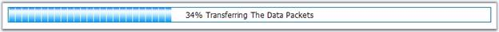

::: {style="DISPLAY: none"}
{#d2h_url_template}{#d2h_package_url style="WIDTH: 0px; DISPLAY: none; HEIGHT: 0px"}
:::

:::::: {.d2h_secondary_topic style="PADDING-BOTTOM: 10pt; MARGIN: 0pt; PADDING-LEFT: 0pt; PADDING-RIGHT: 0pt; PADDING-TOP: 0pt"}
##### Custom Text on the ProgressBar {#custom-text-on-the-progressbar style="tab-stops: 0pt"}

 

Using this, we can display custom text for various progress values. The custom text can be set by the **UpdateText** property of the **UpdateProgressEvent**.

[]{style="FONT-FAMILY: 'Trebuchet MS','sans-serif'; COLOR: #15428b; FONT-SIZE: 9pt"} 

::: {align="center"}
  ------------ --------------------------------------------------------------------------------------------------------------------
  Property     Description
  UpdateText   To display custom text on the ProgressBar, to indicate the status of the task instead of the percentage completed.
  ------------ --------------------------------------------------------------------------------------------------------------------
:::

[]{style="FONT-FAMILY: 'Trebuchet MS','sans-serif'; COLOR: #15428b; FONT-SIZE: 9pt"} 

+-------------------------------------------------------------------------------------------------------------------------------+
| **[\[C#\]]{style="FONT-FAMILY: 'Courier New'"}**                                                                              |
|                                                                                                                               |
| []{style="FONT-FAMILY: 'Courier New'; COLOR: blue"}                                                                           |
|                                                                                                                               |
| [e.UpdateText = [\"your desired text\"]{style="COLOR: #a31515"}[;]{style="COLOR: black"}]{style="FONT-FAMILY: 'Courier New'"} |
+-------------------------------------------------------------------------------------------------------------------------------+

[]{style="FONT-FAMILY: 'Trebuchet MS','sans-serif'; COLOR: #15428b; FONT-SIZE: 9pt"} 

+------------------------------------------------------------------------------------------------------+
| **[\[VB\]]{style="FONT-FAMILY: 'Courier New'"}**                                                     |
|                                                                                                      |
| []{style="FONT-FAMILY: 'Courier New'; COLOR: blue"}                                                  |
|                                                                                                      |
| [e.UpdateText = [\"your desired text\"]{style="COLOR: #a31515"}]{style="FONT-FAMILY: 'Courier New'"} |
+------------------------------------------------------------------------------------------------------+

[]{style="FONT-FAMILY: 'Trebuchet MS','sans-serif'; COLOR: #15428b; FONT-SIZE: 9pt"} 

The following sample code demonstrates the UpdateText property.

[]{style="FONT-FAMILY: 'Trebuchet MS','sans-serif'; COLOR: #15428b; FONT-SIZE: 9pt"} 

+-------------------------------------------------------------------------------------------------------------------------------------------------------------------------------------------------------------------------------------------------------------------------------------------+
| **[\[C#\]]{style="FONT-FAMILY: 'Courier New'"}**                                                                                                                                                                                                                                          |
|                                                                                                                                                                                                                                                                                           |
| []{style="FONT-FAMILY: 'Courier New'; COLOR: blue"}                                                                                                                                                                                                                                       |
|                                                                                                                                                                                                                                                                                           |
| [protected]{style="FONT-FAMILY: 'Courier New'; COLOR: blue"}[ [void]{style="COLOR: blue"} ProgressBar1_UpdateProgress([object]{style="COLOR: blue"} sender, Syncfusion.Web.UI.WebControls.Tools.[UpdateProgressEventArgs]{style="COLOR: #2b91af"} e)]{style="FONT-FAMILY: 'Courier New'"} |
|                                                                                                                                                                                                                                                                                           |
| [{]{style="FONT-FAMILY: 'Courier New'"}                                                                                                                                                                                                                                                   |
|                                                                                                                                                                                                                                                                                           |
| [        [this]{style="COLOR: blue"}.ProgressBar1.ProgressPercentage = [this]{style="COLOR: blue"}.Progress;]{style="FONT-FAMILY: 'Courier New'"}                                                                                                                                         |
|                                                                                                                                                                                                                                                                                           |
| []{style="FONT-FAMILY: 'Courier New'"}                                                                                                                                                                                                                                                    |
|                                                                                                                                                                                                                                                                                           |
| [        [if]{style="COLOR: blue"} ([this]{style="COLOR: blue"}.ProgressBar1.ProgressPercentage \> 25 && [this]{style="COLOR: blue"}.ProgressBar1.ProgressPercentage \< 50 )]{style="FONT-FAMILY: 'Courier New'"}                                                                         |
|                                                                                                                                                                                                                                                                                           |
| [        {]{style="FONT-FAMILY: 'Courier New'"}                                                                                                                                                                                                                                           |
|                                                                                                                                                                                                                                                                                           |
| [            e.UpdateText = [\"Transferring data packets\"]{style="COLOR: #a31515"};]{style="FONT-FAMILY: 'Courier New'"}                                                                                                                                                                 |
|                                                                                                                                                                                                                                                                                           |
| []{style="FONT-FAMILY: 'Courier New'"}                                                                                                                                                                                                                                                    |
|                                                                                                                                                                                                                                                                                           |
| [        }]{style="FONT-FAMILY: 'Courier New'"}                                                                                                                                                                                                                                           |
|                                                                                                                                                                                                                                                                                           |
| [        ]{style="FONT-FAMILY: 'Courier New'"}                                                                                                                                                                                                                                            |
|                                                                                                                                                                                                                                                                                           |
| [            [if]{style="COLOR: blue"} ([this]{style="COLOR: blue"}.ProgressBar1.ProgressPercentage \> 50 && [this]{style="COLOR: blue"}.ProgressBar1.ProgressPercentage \< 75)]{style="FONT-FAMILY: 'Courier New'"}                                                                      |
|                                                                                                                                                                                                                                                                                           |
| [        {]{style="FONT-FAMILY: 'Courier New'"}                                                                                                                                                                                                                                           |
|                                                                                                                                                                                                                                                                                           |
| [            e.UpdateText = [\"Receiving the acknowledgement\"]{style="COLOR: #a31515"};]{style="FONT-FAMILY: 'Courier New'"}                                                                                                                                                             |
|                                                                                                                                                                                                                                                                                           |
| []{style="FONT-FAMILY: 'Courier New'"}                                                                                                                                                                                                                                                    |
|                                                                                                                                                                                                                                                                                           |
| []{style="FONT-FAMILY: 'Courier New'"}                                                                                                                                                                                                                                                    |
|                                                                                                                                                                                                                                                                                           |
| [        }]{style="FONT-FAMILY: 'Courier New'"}                                                                                                                                                                                                                                           |
|                                                                                                                                                                                                                                                                                           |
| [        [if]{style="COLOR: blue"} ([this]{style="COLOR: blue"}.ProgressBar1.ProgressPercentage \> 75 && [this]{style="COLOR: blue"}.ProgressBar1.ProgressPercentage \<= 100)]{style="FONT-FAMILY: 'Courier New'"}                                                                        |
|                                                                                                                                                                                                                                                                                           |
| [        {]{style="FONT-FAMILY: 'Courier New'"}                                                                                                                                                                                                                                           |
|                                                                                                                                                                                                                                                                                           |
| [            e.UpdateText = [\"Terminating the connection\"]{style="COLOR: #a31515"};]{style="FONT-FAMILY: 'Courier New'"}                                                                                                                                                                |
|                                                                                                                                                                                                                                                                                           |
| []{style="FONT-FAMILY: 'Courier New'"}                                                                                                                                                                                                                                                    |
|                                                                                                                                                                                                                                                                                           |
| [        }]{style="FONT-FAMILY: 'Courier New'"}                                                                                                                                                                                                                                           |
|                                                                                                                                                                                                                                                                                           |
| [}]{style="FONT-FAMILY: 'Courier New'"}                                                                                                                                                                                                                                                   |
+-------------------------------------------------------------------------------------------------------------------------------------------------------------------------------------------------------------------------------------------------------------------------------------------+

[]{style="FONT-FAMILY: 'Trebuchet MS','sans-serif'; COLOR: #15428b; FONT-SIZE: 9pt"} 

+------------------------------------------------------------------------------------------------------------------------------------------------------------------------------------------------------------------------------------------------------------------------------------------------------------------------------------------------------------------------+
| **[\[VB\]]{style="FONT-FAMILY: 'Courier New'"}**                                                                                                                                                                                                                                                                                                                       |
|                                                                                                                                                                                                                                                                                                                                                                        |
| []{style="FONT-FAMILY: 'Courier New'; COLOR: blue"}                                                                                                                                                                                                                                                                                                                    |
|                                                                                                                                                                                                                                                                                                                                                                        |
| [Protected]{style="FONT-FAMILY: 'Courier New'; COLOR: blue"}[ [Sub]{style="COLOR: blue"} ProgressBar1_UpdateProgress([ByVal]{style="COLOR: blue"} sender [As]{style="COLOR: blue"} [Object]{style="COLOR: blue"}, [ByVal]{style="COLOR: blue"} e [As]{style="COLOR: blue"} System.Web.UI.WebControls.DetailsViewUpdatedEventArgs)]{style="FONT-FAMILY: 'Courier New'"} |
|                                                                                                                                                                                                                                                                                                                                                                        |
| [        [Me]{style="COLOR: blue"}.ProgressBar1.ProgressPercentage = [Me]{style="COLOR: blue"}.Progress]{style="FONT-FAMILY: 'Courier New'"}                                                                                                                                                                                                                           |
|                                                                                                                                                                                                                                                                                                                                                                        |
| []{style="FONT-FAMILY: 'Courier New'"}                                                                                                                                                                                                                                                                                                                                 |
|                                                                                                                                                                                                                                                                                                                                                                        |
| [        [If]{style="COLOR: blue"} [Me]{style="COLOR: blue"}.ProgressBar1.ProgressPercentage \> 25 [And]{style="COLOR: blue"} [Me]{style="COLOR: blue"}.ProgressBar1.ProgressPercentage \< 50 [Then]{style="COLOR: blue"}]{style="FONT-FAMILY: 'Courier New'"}                                                                                                         |
|                                                                                                                                                                                                                                                                                                                                                                        |
| [                   e.UpdateText = [\"Transferring data packets\"]{style="COLOR: #a31515"};]{style="FONT-FAMILY: 'Courier New'"}                                                                                                                                                                                                                                       |
|                                                                                                                                                                                                                                                                                                                                                                        |
| []{style="FONT-FAMILY: 'Courier New'"}                                                                                                                                                                                                                                                                                                                                 |
|                                                                                                                                                                                                                                                                                                                                                                        |
| [        [End]{style="COLOR: blue"} [If]{style="COLOR: blue"}]{style="FONT-FAMILY: 'Courier New'"}                                                                                                                                                                                                                                                                     |
|                                                                                                                                                                                                                                                                                                                                                                        |
| []{style="FONT-FAMILY: 'Courier New'; COLOR: blue"}                                                                                                                                                                                                                                                                                                                    |
|                                                                                                                                                                                                                                                                                                                                                                        |
| [        [If]{style="COLOR: blue"} [Me]{style="COLOR: blue"}.ProgressBar1.ProgressPercentage \> 50 [And]{style="COLOR: blue"} [Me]{style="COLOR: blue"}.ProgressBar1.ProgressPercentage \< 75 [Then]{style="COLOR: blue"}]{style="FONT-FAMILY: 'Courier New'"}                                                                                                         |
|                                                                                                                                                                                                                                                                                                                                                                        |
| [                  e.UpdateText = [\"Receiving the acknowledgement\"]{style="COLOR: #a31515"};]{style="FONT-FAMILY: 'Courier New'"}                                                                                                                                                                                                                                    |
|                                                                                                                                                                                                                                                                                                                                                                        |
| []{style="FONT-FAMILY: 'Courier New'"}                                                                                                                                                                                                                                                                                                                                 |
|                                                                                                                                                                                                                                                                                                                                                                        |
| []{style="FONT-FAMILY: 'Courier New'"}                                                                                                                                                                                                                                                                                                                                 |
|                                                                                                                                                                                                                                                                                                                                                                        |
| [        [End]{style="COLOR: blue"} [If]{style="COLOR: blue"}]{style="FONT-FAMILY: 'Courier New'"}                                                                                                                                                                                                                                                                     |
|                                                                                                                                                                                                                                                                                                                                                                        |
| [        [If]{style="COLOR: blue"} [Me]{style="COLOR: blue"}.ProgressBar1.ProgressPercentage \> 75 [And]{style="COLOR: blue"} [Me]{style="COLOR: blue"}.ProgressBar1.ProgressPercentage \<= 100 [Then]{style="COLOR: blue"}]{style="FONT-FAMILY: 'Courier New'"}                                                                                                       |
|                                                                                                                                                                                                                                                                                                                                                                        |
| [                  e.UpdateText = [\"Terminating the connection\"]{style="COLOR: #a31515"};]{style="FONT-FAMILY: 'Courier New'"}                                                                                                                                                                                                                                       |
|                                                                                                                                                                                                                                                                                                                                                                        |
| []{style="FONT-FAMILY: 'Courier New'"}                                                                                                                                                                                                                                                                                                                                 |
|                                                                                                                                                                                                                                                                                                                                                                        |
| [        [End]{style="COLOR: blue"} [If]{style="COLOR: blue"}]{style="FONT-FAMILY: 'Courier New'"}                                                                                                                                                                                                                                                                     |
|                                                                                                                                                                                                                                                                                                                                                                        |
| [End]{style="FONT-FAMILY: 'Courier New'; COLOR: blue"}[ [Sub]{style="COLOR: blue"}]{style="FONT-FAMILY: 'Courier New'"}                                                                                                                                                                                                                                                |
+------------------------------------------------------------------------------------------------------------------------------------------------------------------------------------------------------------------------------------------------------------------------------------------------------------------------------------------------------------------------+

[]{style="FONT-FAMILY: 'Trebuchet MS','sans-serif'; COLOR: #15428b; FONT-SIZE: 9pt"} 

[]{style="FONT-FAMILY: 'Trebuchet MS','sans-serif'; COLOR: #15428b; FONT-SIZE: 9pt"} 

{border="0"}

Figure 429[]{#p590}: Progress bar control

###### 5.8.4.2.1.1 DisplayProgressText {#displayprogresstext style="tab-stops: 0pt"}

 

This specifies where the custom text of the ProgressBar should be displayed. We can display the custom text either inside the ProgressBar, or inside the innerHtml of any html, or inside an asp element, or inside both.

 

For external controls, we have to set the id of the control to the **DisplayProgressElementID** property.

[]{style="FONT-FAMILY: 'Trebuchet MS','sans-serif'; COLOR: #15428b; FONT-SIZE: 9pt"} 

::: {align="center"}
+-----------------------------------+-----------------------------------------------------------------------------------------------------------------------------------------------------------+
| Property                          | Description                                                                                                                                               |
+-----------------------------------+-----------------------------------------------------------------------------------------------------------------------------------------------------------+
| DisplayProgressText               | Gets / sets the where the progress bar custom text should be displayed. The options included are as follows.                                              |
|                                   |                                                                                                                                                           |
|                                   | [·      ]{style="FONT-FAMILY: Symbol"}InsideProgressBar                                                                                                   |
|                                   |                                                                                                                                                           |
|                                   | [·      ]{style="FONT-FAMILY: Symbol"}ExternalControl                                                                                                     |
|                                   |                                                                                                                                                           |
|                                   | [·      ]{style="FONT-FAMILY: Symbol"}Both                                                                                                                |
+-----------------------------------+-----------------------------------------------------------------------------------------------------------------------------------------------------------+
| DisplayProgressElementId          | Gets / sets the id of the control, to display the custom text in the inner HTML, when the DisplayProgressText is set to the ExternalControl or Both mode. |
+-----------------------------------+-----------------------------------------------------------------------------------------------------------------------------------------------------------+
:::

[]{style="FONT-FAMILY: 'Trebuchet MS','sans-serif'; COLOR: #15428b; FONT-SIZE: 9pt"} 

+---------------------------------------------------------------------------------------------------------------------+
| **[\[C#\]]{style="FONT-FAMILY: 'Courier New'"}**                                                                    |
|                                                                                                                     |
| []{style="FONT-FAMILY: 'Courier New'; COLOR: blue"}                                                                 |
|                                                                                                                     |
| [ProgressBar1.DisplayProgressText= [\"Both\"]{style="COLOR: #a31515"};]{style="FONT-FAMILY: 'Courier New'"}         |
|                                                                                                                     |
| [ProgressBar1.DisplayProgressElementId = [\"Label1\"]{style="COLOR: #a31515"};]{style="FONT-FAMILY: 'Courier New'"} |
+---------------------------------------------------------------------------------------------------------------------+

[]{style="FONT-FAMILY: 'Trebuchet MS','sans-serif'; COLOR: #15428b; FONT-SIZE: 9pt"} 

+--------------------------------------------------------------------------------------------------------------------+
| **[\[VB\]]{style="FONT-FAMILY: 'Courier New'"}**                                                                   |
|                                                                                                                    |
| []{style="FONT-FAMILY: 'Courier New'; COLOR: blue"}                                                                |
|                                                                                                                    |
| [ProgressBar1.DisplayProgressText= [\"Both\"]{style="COLOR: #a31515"}]{style="FONT-FAMILY: 'Courier New'"}         |
|                                                                                                                    |
| [ProgressBar1.DisplayProgressElementId = [\"Label1\"]{style="COLOR: #a31515"}]{style="FONT-FAMILY: 'Courier New'"} |
+--------------------------------------------------------------------------------------------------------------------+

 

###### 5.8.4.2.1.2 TextStyle {#textstyle style="tab-stops: 0pt"}

[]{style="FONT-FAMILY: 'Trebuchet MS','sans-serif'; COLOR: #15428b; FONT-SIZE: 9pt"} 

The ProgressBar\'s progress percentage or progress value can be hidden by setting the **TextStyle** property to **None**.

[]{style="FONT-FAMILY: 'Trebuchet MS','sans-serif'; COLOR: #15428b; FONT-SIZE: 9pt"} 

::: {align="center"}
+-----------------------------------+-----------------------------------------------------------------------------------------------------+
| Property                          | Description                                                                                         |
+-----------------------------------+-----------------------------------------------------------------------------------------------------+
| TextStyle                         | Used to show / hide the progress value inside the ProgressBar. The options included are as follows: |
|                                   |                                                                                                     |
|                                   | [·      ]{style="FONT-FAMILY: Symbol"}Value                                                         |
|                                   |                                                                                                     |
|                                   | [·      ]{style="FONT-FAMILY: Symbol"}Percentage                                                    |
|                                   |                                                                                                     |
|                                   | [·      ]{style="FONT-FAMILY: Symbol"}None                                                          |
+-----------------------------------+-----------------------------------------------------------------------------------------------------+
:::

[]{style="FONT-FAMILY: 'Trebuchet MS','sans-serif'; COLOR: #15428b; FONT-SIZE: 9pt"} 

+---------------------------------------------------------------------------------------------------+
| **[\[C#\]]{style="FONT-FAMILY: 'Courier New'"}**                                                  |
|                                                                                                   |
| []{style="FONT-FAMILY: 'Courier New'; COLOR: blue"}                                               |
|                                                                                                   |
| [ProgressBar1.TextSyle = [\"None\"]{style="COLOR: #a31515"};]{style="FONT-FAMILY: 'Courier New'"} |
+---------------------------------------------------------------------------------------------------+

[]{style="FONT-FAMILY: 'Trebuchet MS','sans-serif'; COLOR: #15428b; FONT-SIZE: 9pt"} 

+--------------------------------------------------------------------------------------------------+
| **[\[VB\]]{style="FONT-FAMILY: 'Courier New'"}**                                                 |
|                                                                                                  |
| []{style="FONT-FAMILY: 'Courier New'; COLOR: blue"}                                              |
|                                                                                                  |
| [ProgressBar1.TextSyle = [\"None\"]{style="COLOR: #a31515"}]{style="FONT-FAMILY: 'Courier New'"} |
+--------------------------------------------------------------------------------------------------+

 

[]{#related-topics}
::::::
