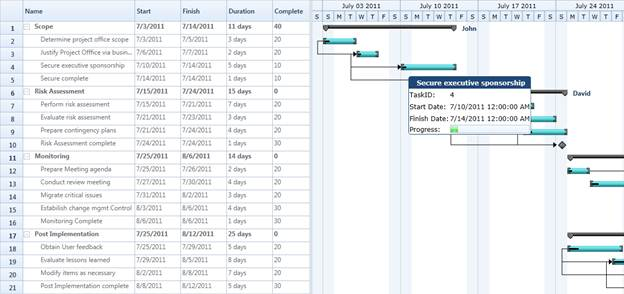

::: {style="DISPLAY: none"}
{#d2h_url_template}{#d2h_package_url style="WIDTH: 0px; DISPLAY: none; HEIGHT: 0px"}
:::

::::: {#nsbanner .d2h_main_nsbanner style="BORDER-BOTTOM: #999999 1px solid; POSITION: relative; PADDING-BOTTOM: 0px; BACKGROUND-COLOR: transparent; PADDING-LEFT: 0px; PADDING-RIGHT: 0px; DISPLAY: none; BORDER-TOP: #999999 1px solid; PADDING-TOP: 0px; LEFT: 0px"}
:::: {#TitleRow .d2h_main_titlerow style="PADDING-BOTTOM: 4px; BACKGROUND-COLOR: transparent; PADDING-LEFT: 22px; WIDTH: 100%; PADDING-RIGHT: 10px; DISPLAY: none; PADDING-TOP: 4px"}
::: {#ienav .d2h_main_ienav style="DISPLAY: none"}
{#D2HPrevious .D2HPreviousEnabled}  {#D2HNext .D2HNextEnabled}
:::
::::
:::::

::::: {#nstext .d2h_main_nstext style="PADDING-BOTTOM: 10px; BACKGROUND-COLOR: transparent; PADDING-LEFT: 22px; PADDING-RIGHT: 10px; HEIGHT: 100%; OVERFLOW: auto; PADDING-TOP: 5px" hasuserbackground="true" valign="bottom"}
::: {#d2h_breadcrumbs .d2h_breadcrumbs}
[Essential Studio User Guide Documentation](ms-xhelp:///?Id=12457748-09e3-4d74-a240-8e049cedf030){.d2h_breadcrumbsNormal}[ \> ]{.d2h_breadcrumbsLinkSeparator}[User Interface Edition](ms-xhelp:///?Id=c29296b7-531c-413b-a0ec-488ca1f7f669){.d2h_breadcrumbsNormal}[ \> ]{.d2h_breadcrumbsLinkSeparator}[Essential WPF](ms-xhelp:///?Id=7f4f82c5-151c-4262-94d0-75c4626c77bc){.d2h_breadcrumbsNormal}[ \> ]{.d2h_breadcrumbsLinkSeparator}[Essential Gantt]{.d2h_breadcrumbsContentsOnly}[ \> ]{.d2h_breadcrumbsLinkSeparator}[Concepts and Features](ms-xhelp:///?Id=b8172a4a-8718-4370-8781-8351a2959492){.d2h_breadcrumbsNormal}
:::

## CustomToolTip {#customtooltip style="tab-stops: 0pt"}

[Essential Gantt provides tooltip support for the TaskBar. Tooltip is a small pop-up box, which is usually displayed on mouse hover. This is used to display additional information about the elements without increasing the window size. Essential Gantt provides support to add customizable tooltip. You can add text or image to your tooltip as needed. ]{style="COLOR: black"}

 

Properties

::: {align="center"}
  ----------------- -------------------------------------------------------------- --------------------- --------------
  Property          Description                                                    Type                  Data Type
  ToolTipTemplate   Gets or set the *TaskBarCollection* Property of GanttControl   Dependency Property   DataTemplate
  ----------------- -------------------------------------------------------------- --------------------- --------------
:::

[]{style="FONT-SIZE: 11pt"} 

Adding CustomToolTip to Gantt

The following code illustrates how to add a custom tooltip to the Gantt control.

 

+----------------------------------------------------------------------------------------------------------------------------------------------------------------------------------------------------------------------------------------------------------------------------------------------------------------------------------------------------------------------------------------------------------------------------------------------------------------------------------------------------------------------------------------------------------------------------------------------------------------------------------------------------------------------------------------------------------------------------------------------------------------------------------------------------------------------------+
| **[\[XAML\]]{style="FONT-FAMILY: 'Courier New'"}**                                                                                                                                                                                                                                                                                                                                                                                                                                                                                                                                                                                                                                                                                                                                                                         |
|                                                                                                                                                                                                                                                                                                                                                                                                                                                                                                                                                                                                                                                                                                                                                                                                                            |
| [ ]{style="FONT-FAMILY: 'Courier New'; COLOR: #a31515"}[\<]{style="FONT-FAMILY: 'Courier New'; COLOR: blue"}[DataTemplate]{style="FONT-FAMILY: 'Courier New'; COLOR: #a31515"}[ x]{style="FONT-FAMILY: 'Courier New'; COLOR: red"}[:]{style="FONT-FAMILY: 'Courier New'; COLOR: blue"}[Key]{style="FONT-FAMILY: 'Courier New'; COLOR: red"}[=\"ToolTipTemp\"\>]{style="FONT-FAMILY: 'Courier New'; COLOR: blue"}[\                                                                                                                                                                                                                                                                                                                                                                                                         |
| [            ]{style="COLOR: #a31515"}[\<]{style="COLOR: blue"}[Grid]{style="COLOR: #a31515"}[\>]{style="COLOR: blue"}\                                                                                                                                                                                                                                                                                                                                                                                                                                                                                                                                                                                                                                                                                                    |
| [                ]{style="COLOR: #a31515"}[\<]{style="COLOR: blue"}[Grid.ColumnDefinitions]{style="COLOR: #a31515"}[\>]{style="COLOR: blue"}\                                                                                                                                                                                                                                                                                                                                                                                                                                                                                                                                                                                                                                                                              |
| [                    ]{style="COLOR: #a31515"}[\<]{style="COLOR: blue"}[ColumnDefinition]{style="COLOR: #a31515"}[ /\>]{style="COLOR: blue"}\                                                                                                                                                                                                                                                                                                                                                                                                                                                                                                                                                                                                                                                                              |
| [                    ]{style="COLOR: #a31515"}[\<]{style="COLOR: blue"}[ColumnDefinition]{style="COLOR: #a31515"}[ /\>]{style="COLOR: blue"}\                                                                                                                                                                                                                                                                                                                                                                                                                                                                                                                                                                                                                                                                              |
| [                ]{style="COLOR: #a31515"}[\</]{style="COLOR: blue"}[Grid.ColumnDefinitions]{style="COLOR: #a31515"}[\>]{style="COLOR: blue"}\                                                                                                                                                                                                                                                                                                                                                                                                                                                                                                                                                                                                                                                                             |
| [                ]{style="COLOR: #a31515"}[\<]{style="COLOR: blue"}[Grid.RowDefinitions]{style="COLOR: #a31515"}[\>]{style="COLOR: blue"}\                                                                                                                                                                                                                                                                                                                                                                                                                                                                                                                                                                                                                                                                                 |
| [                    ]{style="COLOR: #a31515"}[\<]{style="COLOR: blue"}[RowDefinition]{style="COLOR: #a31515"}[ Height]{style="COLOR: red"}[=\"40\" /\>]{style="COLOR: blue"}\                                                                                                                                                                                                                                                                                                                                                                                                                                                                                                                                                                                                                                             |
| [                    ]{style="COLOR: #a31515"}[\<]{style="COLOR: blue"}[RowDefinition]{style="COLOR: #a31515"}[ Height]{style="COLOR: red"}[=\"40\" /\>]{style="COLOR: blue"}\                                                                                                                                                                                                                                                                                                                                                                                                                                                                                                                                                                                                                                             |
| [                    ]{style="COLOR: #a31515"}[\<]{style="COLOR: blue"}[RowDefinition]{style="COLOR: #a31515"}[ Height]{style="COLOR: red"}[=\"40\" /\>]{style="COLOR: blue"}\                                                                                                                                                                                                                                                                                                                                                                                                                                                                                                                                                                                                                                             |
| [                    ]{style="COLOR: #a31515"}[\<]{style="COLOR: blue"}[RowDefinition]{style="COLOR: #a31515"}[ Height]{style="COLOR: red"}[=\"40\" /\>]{style="COLOR: blue"}\                                                                                                                                                                                                                                                                                                                                                                                                                                                                                                                                                                                                                                             |
| [                    ]{style="COLOR: #a31515"}[\<]{style="COLOR: blue"}[RowDefinition]{style="COLOR: #a31515"}[ Height]{style="COLOR: red"}[=\"40\" /\>]{style="COLOR: blue"}\                                                                                                                                                                                                                                                                                                                                                                                                                                                                                                                                                                                                                                             |
| [                ]{style="COLOR: #a31515"}[\</]{style="COLOR: blue"}[Grid.RowDefinitions]{style="COLOR: #a31515"}[\>]{style="COLOR: blue"}\                                                                                                                                                                                                                                                                                                                                                                                                                                                                                                                                                                                                                                                                                |
| [                ]{style="COLOR: #a31515"}[\<]{style="COLOR: blue"}[Border]{style="COLOR: #a31515"}[ Grid.Column]{style="COLOR: red"}[=\"0\"]{style="COLOR: blue"} [Grid.Row]{style="COLOR: red"}[=\"0\"]{style="COLOR: blue"} [Margin]{style="COLOR: red"}[=\"-2\"]{style="COLOR: blue"}\                                                                                                                                                                                                                                                                                                                                                                                                                                                                                                                                 |
|                        [ CornerRadius]{style="COLOR: red"}[=\"5\"]{style="COLOR: blue"} [Grid.ColumnSpan]{style="COLOR: red"}[=\"2\"]{style="COLOR: blue"} [Background]{style="COLOR: red"}[=\"#FF1F4877\"]{style="COLOR: blue"}\                                                                                                                                                                                                                                                                                                                                                                                                                                                                                                                                                                                          |
|                        [ BorderThickness]{style="COLOR: red"}[=\"2\"\>]{style="COLOR: blue"}\                                                                                                                                                                                                                                                                                                                                                                                                                                                                                                                                                                                                                                                                                                                              |
| [                    ]{style="COLOR: #a31515"}[\<]{style="COLOR: blue"}[TextBlock]{style="COLOR: #a31515"} [ Margin]{style="COLOR: red"}[=\"5,0,0,0\" ]{style="COLOR: blue"}[Text]{style="COLOR: red"}[=\"{]{style="COLOR: blue"}[Binding]{style="COLOR: #a31515"}[ TaskName]{style="COLOR: red"}[}\"]{style="COLOR: blue"}\                                                                                                                                                                                                                                                                                                                                                                                                                                                                                               |
|                                [ HorizontalAlignment]{style="COLOR: red"}[=\"Center\"]{style="COLOR: blue"}\                                                                                                                                                                                                                                                                                                                                                                                                                                                                                                                                                                                                                                                                                                               |
|                                [ VerticalAlignment]{style="COLOR: red"}[=\"Center\"]{style="COLOR: blue"} [FontWeight]{style="COLOR: red"}[=\"Bold\"]{style="COLOR: blue"}\                                                                                                                                                                                                                                                                                                                                                                                                                                                                                                                                                                                                                                                |
|                                [ FontFamily]{style="COLOR: red"}[=\"Verdana\"]{style="COLOR: blue"} [Foreground]{style="COLOR: red"}[=\"WhiteSmoke\" /\>]{style="COLOR: blue"}\                                                                                                                                                                                                                                                                                                                                                                                                                                                                                                                                                                                                                                            |
|  \                                                                                                                                                                                                                                                                                                                                                                                                                                                                                                                                                                                                                                                                                                                                                                                                                         |
| [                ]{style="COLOR: #a31515"}[\</]{style="COLOR: blue"}[Border]{style="COLOR: #a31515"}[\>]{style="COLOR: blue"}\                                                                                                                                                                                                                                                                                                                                                                                                                                                                                                                                                                                                                                                                                             |
| [                ]{style="COLOR: #a31515"}[\<]{style="COLOR: blue"}[TextBlock]{style="COLOR: #a31515"}[ Margin]{style="COLOR: red"}[=\"1\" ]{style="COLOR: blue"}[Text]{style="COLOR: red"}[=\"TaskID:\"]{style="COLOR: blue"} [Grid.Column]{style="COLOR: red"}[=\"0\"]{style="COLOR: blue"}\                                                                                                                                                                                                                                                                                                                                                                                                                                                                                                                             |
|                           [ Grid.Row]{style="COLOR: red"}[=\"1\" ]{style="COLOR: blue"}[VerticalAlignment]{style="COLOR: red"}[=\"Center\"]{style="COLOR: blue"}\                                                                                                                                                                                                                                                                                                                                                                                                                                                                                                                                                                                                                                                          |
|                           [ FontFamily]{style="COLOR: red"}[=\"Verdana\" /\>]{style="COLOR: blue"}\                                                                                                                                                                                                                                                                                                                                                                                                                                                                                                                                                                                                                                                                                                                        |
| [                ]{style="COLOR: #a31515"}[\<]{style="COLOR: blue"}[TextBlock]{style="COLOR: #a31515"}[ Margin]{style="COLOR: red"}[=\"1\"]{style="COLOR: blue"} [Text]{style="COLOR: red"}[=\"{]{style="COLOR: blue"}[Binding]{style="COLOR: #a31515"}[ TaskId]{style="COLOR: red"}[}\"]{style="COLOR: blue"} [Grid.Column]{style="COLOR: red"}[=\"1\"]{style="COLOR: blue"}\                                                                                                                                                                                                                                                                                                                                                                                                                                             |
|                           [ VerticalAlignment]{style="COLOR: red"}[=\"Center\"]{style="COLOR: blue"} [Grid.Row]{style="COLOR: red"}[=\"1\"]{style="COLOR: blue"}\                                                                                                                                                                                                                                                                                                                                                                                                                                                                                                                                                                                                                                                          |
|                           [ FontFamily]{style="COLOR: red"}[=\"Verdana\" /\>]{style="COLOR: blue"}\                                                                                                                                                                                                                                                                                                                                                                                                                                                                                                                                                                                                                                                                                                                        |
|  \                                                                                                                                                                                                                                                                                                                                                                                                                                                                                                                                                                                                                                                                                                                                                                                                                         |
| [                ]{style="COLOR: #a31515"}[\<]{style="COLOR: blue"}[TextBlock]{style="COLOR: #a31515"}[ Margin]{style="COLOR: red"}[=\"1\"]{style="COLOR: blue"} [Text]{style="COLOR: red"}[=\"Start Date:\"]{style="COLOR: blue"} [Grid.Column]{style="COLOR: red"}[=\"0\"]{style="COLOR: blue"}\                                                                                                                                                                                                                                                                                                                                                                                                                                                                                                                         |
|                           [ Grid.Row]{style="COLOR: red"}[=\"2\" ]{style="COLOR: blue"}[VerticalAlignment]{style="COLOR: red"}[=\"Center\"]{style="COLOR: blue"}\                                                                                                                                                                                                                                                                                                                                                                                                                                                                                                                                                                                                                                                          |
|                           [ FontFamily]{style="COLOR: red"}[=\"Verdana\" /\>]{style="COLOR: blue"}\                                                                                                                                                                                                                                                                                                                                                                                                                                                                                                                                                                                                                                                                                                                        |
| [                ]{style="COLOR: #a31515"}[\<]{style="COLOR: blue"}[TextBlock]{style="COLOR: #a31515"}[ Margin]{style="COLOR: red"}[=\"1\"]{style="COLOR: blue"} [Text]{style="COLOR: red"}[=\"{]{style="COLOR: blue"}[Binding]{style="COLOR: #a31515"}[ StartDate]{style="COLOR: red"}[}\"]{style="COLOR: blue"} [Grid.Row]{style="COLOR: red"}[=\"2\"]{style="COLOR: blue"}]{style="FONT-FAMILY: 'Courier New'"}                                                                                                                                                                                                                                                                                                                                                                                                         |
|                                                                                                                                                                                                                                                                                                                                                                                                                                                                                                                                                                                                                                                                                                                                                                                                                            |
| [                          [ Grid.Column]{style="COLOR: red"}[=\"1\" ]{style="COLOR: blue"}[VerticalAlignment]{style="COLOR: red"}[=\"Center\"]{style="COLOR: blue"}\                                                                                                                                                                                                                                                                                                                                                                                                                                                                                                                                                                                                                                                      |
|                           [ FontFamily]{style="COLOR: red"}[=\"Verdana\" /\>]{style="COLOR: blue"}\                                                                                                                                                                                                                                                                                                                                                                                                                                                                                                                                                                                                                                                                                                                        |
| [                ]{style="COLOR: #a31515"}[\<]{style="COLOR: blue"}[TextBlock]{style="COLOR: #a31515"}[ Margin]{style="COLOR: red"}[=\"1\"]{style="COLOR: blue"} [Text]{style="COLOR: red"}[=\"Finish Date:\" ]{style="COLOR: blue"}[ Grid.Column]{style="COLOR: red"}[=\"0\"]{style="COLOR: blue"}\                                                                                                                                                                                                                                                                                                                                                                                                                                                                                                                       |
|                           [ Grid.Row]{style="COLOR: red"}[=\"3\" ]{style="COLOR: blue"}[VerticalAlignment]{style="COLOR: red"}[=\"Center\"]{style="COLOR: blue"}\                                                                                                                                                                                                                                                                                                                                                                                                                                                                                                                                                                                                                                                          |
|                           [ FontFamily]{style="COLOR: red"}[=\"Verdana\" /\>]{style="COLOR: blue"}\                                                                                                                                                                                                                                                                                                                                                                                                                                                                                                                                                                                                                                                                                                                        |
| [                ]{style="COLOR: #a31515"}[\<]{style="COLOR: blue"}[TextBlock]{style="COLOR: #a31515"}[ Margin]{style="COLOR: red"}[=\"1\"]{style="COLOR: blue"} [Text]{style="COLOR: red"}[=\"{]{style="COLOR: blue"}[Binding]{style="COLOR: #a31515"}[ FinishDate]{style="COLOR: red"}[}\"]{style="COLOR: blue"} [Grid.Column]{style="COLOR: red"}[=\"1\"]{style="COLOR: blue"}\                                                                                                                                                                                                                                                                                                                                                                                                                                         |
|                           [ Grid.Row]{style="COLOR: red"}[=\"3\" ]{style="COLOR: blue"}[VerticalAlignment]{style="COLOR: red"}[=\"Center\"]{style="COLOR: blue"}\                                                                                                                                                                                                                                                                                                                                                                                                                                                                                                                                                                                                                                                          |
|                           [ FontFamily]{style="COLOR: red"}[=\"Verdana\" /\>]{style="COLOR: blue"}\                                                                                                                                                                                                                                                                                                                                                                                                                                                                                                                                                                                                                                                                                                                        |
| [                ]{style="COLOR: #a31515"}[\<]{style="COLOR: blue"}[TextBlock]{style="COLOR: #a31515"}[ Margin]{style="COLOR: red"}[=\"1\"]{style="COLOR: blue"} [Text]{style="COLOR: red"}[=\"Progress:\"]{style="COLOR: blue"} [Grid.Column]{style="COLOR: red"}[=\"0\"]{style="COLOR: blue"}\                                                                                                                                                                                                                                                                                                                                                                                                                                                                                                                           |
|                           [ Grid.Row]{style="COLOR: red"}[=\"4\" ]{style="COLOR: blue"}[VerticalAlignment]{style="COLOR: red"}[=\"Center\"]{style="COLOR: blue"}\                                                                                                                                                                                                                                                                                                                                                                                                                                                                                                                                                                                                                                                          |
|                           [ FontFamily]{style="COLOR: red"}[=\"Verdana\" /\>]{style="COLOR: blue"}\                                                                                                                                                                                                                                                                                                                                                                                                                                                                                                                                                                                                                                                                                                                        |
| [                ]{style="COLOR: #a31515"}[\<]{style="COLOR: blue"}[ProgressBar]{style="COLOR: #a31515"}[ Margin]{style="COLOR: red"}[=\"1\"]{style="COLOR: blue"}[ Height]{style="COLOR: red"}[=\"25\"]{style="COLOR: blue"} [Value]{style="COLOR: red"}[=\"{]{style="COLOR: blue"}[Binding]{style="COLOR: #a31515"}[ Progress]{style="COLOR: red"}[}\"]{style="COLOR: blue"}\                                                                                                                                                                                                                                                                                                                                                                                                                                            |
|                             [ Grid.Column]{style="COLOR: red"}[=\"1\" ]{style="COLOR: blue"}[VerticalAlignment]{style="COLOR: red"}[=\"Center\"]{style="COLOR: blue"}\                                                                                                                                                                                                                                                                                                                                                                                                                                                                                                                                                                                                                                                     |
|                             [ Grid.Row]{style="COLOR: red"}[=\"4\" /\>]{style="COLOR: blue"}\                                                                                                                                                                                                                                                                                                                                                                                                                                                                                                                                                                                                                                                                                                                              |
| [            ]{style="COLOR: #a31515"}[\</]{style="COLOR: blue"}[Grid]{style="COLOR: #a31515"}[\>]{style="COLOR: blue"}\                                                                                                                                                                                                                                                                                                                                                                                                                                                                                                                                                                                                                                                                                                   |
| [        ]{style="COLOR: #a31515"}[\</]{style="COLOR: blue"}[DataTemplate]{style="COLOR: #a31515"}[\>]{style="COLOR: blue"}]{style="FONT-FAMILY: 'Courier New'"}                                                                                                                                                                                                                                                                                                                                                                                                                                                                                                                                                                                                                                                           |
|                                                                                                                                                                                                                                                                                                                                                                                                                                                                                                                                                                                                                                                                                                                                                                                                                            |
| [\<]{style="FONT-FAMILY: 'Courier New'; COLOR: blue"}[Sync]{style="FONT-FAMILY: 'Courier New'; COLOR: #a31515"}[:]{style="FONT-FAMILY: 'Courier New'; COLOR: blue"}[GanttControl]{style="FONT-FAMILY: 'Courier New'; COLOR: #a31515"}[ x]{style="FONT-FAMILY: 'Courier New'; COLOR: red"}[:]{style="FONT-FAMILY: 'Courier New'; COLOR: blue"}[Name]{style="FONT-FAMILY: 'Courier New'; COLOR: red"}[=\"Gantt\" ]{style="FONT-FAMILY: 'Courier New'; COLOR: blue"}[ToolTipTemplate]{style="FONT-FAMILY: 'Courier New'; COLOR: red"}[=\"{]{style="FONT-FAMILY: 'Courier New'; COLOR: blue"}[StaticResource]{style="FONT-FAMILY: 'Courier New'; COLOR: #a31515"}[ ToolTipTemp]{style="FONT-FAMILY: 'Courier New'; COLOR: red"}[}\"/\>]{style="FONT-FAMILY: 'Courier New'; COLOR: blue"}[]{style="FONT-FAMILY: 'Courier New'"} |
|                                                                                                                                                                                                                                                                                                                                                                                                                                                                                                                                                                                                                                                                                                                                                                                                                            |
| []{style="FONT-FAMILY: 'Courier New'"}                                                                                                                                                                                                                                                                                                                                                                                                                                                                                                                                                                                                                                                                                                                                                                                     |
+----------------------------------------------------------------------------------------------------------------------------------------------------------------------------------------------------------------------------------------------------------------------------------------------------------------------------------------------------------------------------------------------------------------------------------------------------------------------------------------------------------------------------------------------------------------------------------------------------------------------------------------------------------------------------------------------------------------------------------------------------------------------------------------------------------------------------+

[]{style="COLOR: #c00000"} 

 {border="0"}

Figure 27: Custom ToolTip Demo

[]{style="COLOR: #c00000"} 

Samples Link

To view samples:

1.   Select **Start** -\> **Programs** -\> **Syncfusion** -\> **Essential Studio x.x.xx** -\> **Dashboard**.

2.   Click **Run Samples** for WPF under **User Interface Edition** panel .

3.   Select **Gantt**.

4.   Expand the **Interactive Features** item in the **Sample Browser**.

5.   Choose the **CustomToolTip** samples to launch.

 

[]{#related-topics}
:::::
