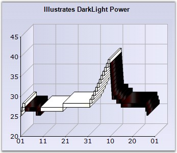

::: {style="DISPLAY: none"}
{#d2h_url_template}{#d2h_package_url style="WIDTH: 0px; DISPLAY: none; HEIGHT: 0px"}
:::

:::: {.d2h_secondary_topic style="PADDING-BOTTOM: 10pt; MARGIN: 0pt; PADDING-LEFT: 0pt; PADDING-RIGHT: 0pt; PADDING-TOP: 0pt"}
#### DarkLightPower {#darklightpower style="tab-stops: 0pt"}

 

Gets or sets the intensity of the dark and light colors used in DarkLight color mode.

 

::: {align="center"}
+-------------------------------------+-------------------------------------+
|                                                                           |
|                                                                           |
| Details                                                                   |
+-------------------------------------+-------------------------------------+
|                                     |                                     |
|                                     |                                     |
| **Possible Values**                 | Ranges from 0 to 255 bytes          |
+-------------------------------------+-------------------------------------+
|                                     |                                     |
|                                     |                                     |
| **Default Value    **               | **100**                             |
+-------------------------------------+-------------------------------------+
|                                     |                                     |
|                                     |                                     |
| **2D / 3D Limitations**             | No                                  |
+-------------------------------------+-------------------------------------+
|                                     |                                     |
|                                     |                                     |
| **Applies to Chart Element**        | All series                          |
+-------------------------------------+-------------------------------------+
|                                     |                                     |
|                                     |                                     |
| **Applies to Chart Types**          | Renko Chart (Financial Charts)      |
+-------------------------------------+-------------------------------------+
:::

 

Here is some sample code.

 

+--------------------------------------------------------------------------------------------------------------------------------------------------------------------------------------------------------------------------+
| **[\[C#\]]{style="FONT-FAMILY: 'Courier New'; COLOR: black"}**                                                                                                                                                           |
|                                                                                                                                                                                                                          |
| **[]{style="FONT-FAMILY: 'Courier New'; COLOR: black"}**                                                                                                                                                                 |
|                                                                                                                                                                                                                          |
| [// Setting ColorsMode as DarkLight]{style="FONT-FAMILY: 'Courier New'; COLOR: green"}                                                                                                                                   |
|                                                                                                                                                                                                                          |
| [this]{style="FONT-FAMILY: 'Courier New'; COLOR: blue"}[.chartControl1.Series\[0\].ConfigItems.FinancialItem.ColorsMode = [ChartFinancialColorMode]{style="COLOR: teal"}.DarkLight;]{style="FONT-FAMILY: 'Courier New'"} |
|                                                                                                                                                                                                                          |
| [// Setting the power value of the darklight]{style="FONT-FAMILY: 'Courier New'; COLOR: green"}                                                                                                                          |
|                                                                                                                                                                                                                          |
| [this]{style="FONT-FAMILY: 'Courier New'; COLOR: blue"}[.chartControl1.Series\[0\].ConfigItems.FinancialItem.DarkLightPower = 200;]{style="FONT-FAMILY: 'Courier New'"}                                                  |
+--------------------------------------------------------------------------------------------------------------------------------------------------------------------------------------------------------------------------+

 

+-------------------------------------------------------------------------------------------------------------------------------------------------------------------------------------------------------------------------------------------------------------------+
| **[\[VB.NET\]]{style="FONT-FAMILY: 'Courier New'; COLOR: black"}**                                                                                                                                                                                                |
|                                                                                                                                                                                                                                                                   |
| **[]{style="FONT-FAMILY: 'Courier New'; COLOR: black"}**                                                                                                                                                                                                          |
|                                                                                                                                                                                                                                                                   |
| [\' Setting ColorsMode as DarkLight]{style="FONT-FAMILY: 'Courier New'; COLOR: green"}                                                                                                                                                                            |
|                                                                                                                                                                                                                                                                   |
| [Me]{style="FONT-FAMILY: 'Courier New'; COLOR: blue"}[.chartControl1.Series(0).ConfigItems.FinancialItem.ColorsMode =[ ]{style="COLOR: blue"}[ChartFinancialColorMode]{style="COLOR: teal"}[.]{style="COLOR: blue"}DarkLight]{style="FONT-FAMILY: 'Courier New'"} |
|                                                                                                                                                                                                                                                                   |
| [\' Setting the power value of the darklight]{style="FONT-FAMILY: 'Courier New'; COLOR: green"}                                                                                                                                                                   |
|                                                                                                                                                                                                                                                                   |
| [Me]{style="FONT-FAMILY: 'Courier New'; COLOR: blue"}[.chartControl1.Series(0).ConfigItems.FinancialItem.DarkLightPower = 200]{style="FONT-FAMILY: 'Courier New'"}                                                                                                |
+-------------------------------------------------------------------------------------------------------------------------------------------------------------------------------------------------------------------------------------------------------------------+

 

{hspace="12" align="left"}\

**[]{style="COLOR: black; FONT-SIZE: 8pt"}** 

Figure 110: Renko Chart with DarkLightPower set to 200**[]{style="FONT-STYLE: normal"}**

**[]{style="COLOR: black; FONT-SIZE: 8pt"}** 

See Also

 

[Renko Chart]{.UGHyperlink}[]{.UGHyperlink}

 

[]{#p86} 

 

[]{#related-topics}
::::
