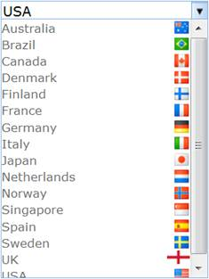

::: {style="DISPLAY: none"}
{#d2h_url_template}{#d2h_package_url style="WIDTH: 0px; DISPLAY: none; HEIGHT: 0px"}
:::

::::::: {.d2h_secondary_topic style="PADDING-BOTTOM: 10pt; MARGIN: 0pt; PADDING-LEFT: 0pt; PADDING-RIGHT: 0pt; PADDING-TOP: 0pt"}
#### Data Binding {#data-binding style="tab-stops: 0pt"}

Generic Drop-Down provides extensive data binding support to populate Generic Drop-Down items so that the columns of a table can be mapped to the Generic Drop-Down properties, namely Id, Text, ImageUrl, SpriteCss, ImageAttributes, and HtmlAttributes.

 

Use Case Scenarios

The Data Binding feature helps users to plug-in data from a DataTable or DataSet to Generic Drop-Down.

 

Adding Data Binding[ ]{style="COLOR: red"}to an Application

Data Binding in Generic Drop-Down can be customized by using two ways, namely:

[·      ]{style="FONT-FAMILY: Symbol"}GenericDropDownBuilder

[·      ]{style="FONT-FAMILY: Symbol"}GenericDropDownModel

 

Using GenericDropDownBuilder

To customize Data Binding in Generic Drop-Down by using GenericDropDownBuilder:

1.   In the **Controller**, pass the data to the **View** page.

 

                               

::: {align="center"}
+------------------------------------------------------------------------------------------------------------------------------------------------+
| **[\[Controller\]]{style="FONT-FAMILY: 'Courier New'"}**                                                                                       |
|                                                                                                                                                |
| [public]{style="FONT-FAMILY: 'Courier New'; COLOR: blue"}[ [ActionResult]{style="COLOR: #2b91af"} Index()]{style="FONT-FAMILY: 'Courier New'"} |
|                                                                                                                                                |
| [        {]{style="FONT-FAMILY: 'Courier New'"}                                                                                                |
|                                                                                                                                                |
| [            [Northwind]{style="COLOR: #2b91af"} data = SqlCE;]{style="FONT-FAMILY: 'Courier New'"}                                            |
|                                                                                                                                                |
| [            [// Passing the data to the View.]{style="COLOR: green"}]{style="FONT-FAMILY: 'Courier New'"}                                     |
|                                                                                                                                                |
| [            [return]{style="COLOR: blue"} View(data.GenericDropDownData);]{style="FONT-FAMILY: 'Courier New'"}                                |
|                                                                                                                                                |
| [  }   ]{style="FONT-FAMILY: 'Courier New'"}                                                                                                   |
+------------------------------------------------------------------------------------------------------------------------------------------------+
:::

[]{style="FONT-FAMILY: 'Courier New'"} 

[2.   Create a ]{style="COLOR: black"}[Strongly Typed View]{.UGHyperlink}[. ]{style="COLOR: black"}

[3.   In the **View**, invoke the **GenericDropDown** helper with the control ID.]{style="COLOR: black"}

[4.   Set the **DataSource** and **BindTo** methods.]{style="COLOR: black"}

[]{style="COLOR: black"} 

+-------------------------------------------------------------------------------------------------------------------------------------------------------------------------------------------------------------------------------------------+
| **[View]{style="FONT-FAMILY: 'Cambria','serif'"}[\[ASPX\]]{style="FONT-FAMILY: 'Cambria','serif'"}[]{style="FONT-FAMILY: 'Cambria','serif'"}**                                                                                            |
|                                                                                                                                                                                                                                           |
| **[]{style="FONT-FAMILY: 'Cambria','serif'"}**                                                                                                                                                                                            |
|                                                                                                                                                                                                                                           |
| [\<%]{style="FONT-FAMILY: 'Courier New'; BACKGROUND: yellow"}[=]{style="FONT-FAMILY: 'Courier New'; COLOR: blue"}[Html.Syncfusion().GenericDropDown([\"myGenericDropDown\"]{style="COLOR: #a31515"})]{style="FONT-FAMILY: 'Courier New'"} |
|                                                                                                                                                                                                                                           |
| [.**DataSource(Model)**]{style="FONT-FAMILY: 'Courier New'"}                                                                                                                                                                              |
|                                                                                                                                                                                                                                           |
| **[.BindTo(bind=\>]{style="FONT-FAMILY: 'Courier New'"}**                                                                                                                                                                                 |
|                                                                                                                                                                                                                                           |
| **[bind.Text([\"Title\"]{style="COLOR: #a31515"})]{style="FONT-FAMILY: 'Courier New'"}**                                                                                                                                                  |
|                                                                                                                                                                                                                                           |
| **[    .Id([\"GenericDropDownId\"]{style="COLOR: #a31515"})]{style="FONT-FAMILY: 'Courier New'"}**                                                                                                                                        |
|                                                                                                                                                                                                                                           |
| **[    .SpriteCss([\"SpriteClass\"]{style="COLOR: #a31515"})]{style="FONT-FAMILY: 'Courier New'"}**                                                                                                                                       |
|                                                                                                                                                                                                                                           |
| **[    .ImageUrl([\"ImagePath\"]{style="COLOR: #a31515"})]{style="FONT-FAMILY: 'Courier New'"}**                                                                                                                                          |
|                                                                                                                                                                                                                                           |
| **[    .ImageAttributes([\"Imageattributes\"]{style="COLOR: #a31515"})]{style="FONT-FAMILY: 'Courier New'"}**[)[%\>]{style="BACKGROUND: yellow"}]{style="FONT-FAMILY: 'Courier New'"}                                                     |
+-------------------------------------------------------------------------------------------------------------------------------------------------------------------------------------------------------------------------------------------+

 

+-------------------------------------------------------------------------------------------------------------------------------------------------------------------------------------------------------------------------------------------+
| **[View\[cshtml\]]{style="FONT-FAMILY: 'Cambria','serif'; FONT-SIZE: 11pt"}**                                                                                                                                                             |
|                                                                                                                                                                                                                                           |
| **[]{style="FONT-FAMILY: 'Cambria','serif'; FONT-SIZE: 11pt"}**                                                                                                                                                                           |
|                                                                                                                                                                                                                                           |
| [\@{]{style="FONT-FAMILY: 'Courier New'; BACKGROUND: yellow"}[ ]{style="FONT-FAMILY: 'Courier New'; COLOR: blue"}[Html.Syncfusion().GenericDropDown([\"myGenericDropDown\"]{style="COLOR: #a31515"})]{style="FONT-FAMILY: 'Courier New'"} |
|                                                                                                                                                                                                                                           |
| [.**DataSource(Model)**]{style="FONT-FAMILY: 'Courier New'"}                                                                                                                                                                              |
|                                                                                                                                                                                                                                           |
| **[.BindTo(bind=\>]{style="FONT-FAMILY: 'Courier New'"}**                                                                                                                                                                                 |
|                                                                                                                                                                                                                                           |
| **[bind.Text([\"Title\"]{style="COLOR: #a31515"})]{style="FONT-FAMILY: 'Courier New'"}**                                                                                                                                                  |
|                                                                                                                                                                                                                                           |
| **[    .Id([\"GenericDropDownId\"]{style="COLOR: #a31515"})]{style="FONT-FAMILY: 'Courier New'"}**                                                                                                                                        |
|                                                                                                                                                                                                                                           |
| **[    .SpriteCss([\"SpriteClass\"]{style="COLOR: #a31515"})]{style="FONT-FAMILY: 'Courier New'"}**                                                                                                                                       |
|                                                                                                                                                                                                                                           |
| **[    .ImageUrl([\"ImagePath\"]{style="COLOR: #a31515"})]{style="FONT-FAMILY: 'Courier New'"}**                                                                                                                                          |
|                                                                                                                                                                                                                                           |
| **[    .ImageAttributes([\"Imageattributes\"]{style="COLOR: #a31515"})]{style="FONT-FAMILY: 'Courier New'"}**[).Render();[}]{style="BACKGROUND: yellow"}]{style="FONT-FAMILY: 'Courier New'"}                                             |
+-------------------------------------------------------------------------------------------------------------------------------------------------------------------------------------------------------------------------------------------+

 

5.   Build and run the application.

 

{border="0"}

Figure 141: Generic Drop-Down - Data Binding Using GenericDropDownBuilder

**[]{style="COLOR: black"}** 

Using GenericDropDownModel

To customize Data Binding in Generic Drop-Down by using GenericDropDownModel:

1.   In the **Controller**, create an object for the **GenericDropDownModel** class.

2.   Set the **DataSource** and **BindTo** properties.

3.   Pass the **GenericDropDownModel** class to the **ViewData**.

[]{style="COLOR: black"} 

::: {align="center"}
+--------------------------------------------------------------------------------------------------------------------------------------------------------------------------------------------------------+
| [      **\[Controller\]**]{style="FONT-FAMILY: 'Courier New'"}                                                                                                                                         |
|                                                                                                                                                                                                        |
| [        [public]{style="COLOR: blue"} [ActionResult]{style="COLOR: #2b91af"} Index()]{style="FONT-FAMILY: 'Courier New'"}                                                                             |
|                                                                                                                                                                                                        |
| [        {]{style="FONT-FAMILY: 'Courier New'"}                                                                                                                                                        |
|                                                                                                                                                                                                        |
| [            [Northwind]{style="COLOR: #2b91af"} context = SqlCE;]{style="FONT-FAMILY: 'Courier New'"}                                                                                                 |
|                                                                                                                                                                                                        |
| [            [GenericDropDownFields]{style="COLOR: #2b91af"} genericdropdownFields = [new]{style="COLOR: blue"} [GenericDropDownFields]{style="COLOR: #2b91af"}()]{style="FONT-FAMILY: 'Courier New'"} |
|                                                                                                                                                                                                        |
| [            {]{style="FONT-FAMILY: 'Courier New'"}                                                                                                                                                    |
|                                                                                                                                                                                                        |
| [                Id = [\"Id\"]{style="COLOR: #a31515"},]{style="FONT-FAMILY: 'Courier New'"}                                                                                                           |
|                                                                                                                                                                                                        |
| [                ParentId = [\"ParentId\"]{style="COLOR: #a31515"},]{style="FONT-FAMILY: 'Courier New'"}                                                                                               |
|                                                                                                                                                                                                        |
| [                Text = [\"Text\"]{style="COLOR: #a31515"},]{style="FONT-FAMILY: 'Courier New'"}                                                                                                       |
|                                                                                                                                                                                                        |
| [                ImageUrl = [\"ImageUrl\"]{style="COLOR: #a31515"},]{style="FONT-FAMILY: 'Courier New'"}                                                                                               |
|                                                                                                                                                                                                        |
| [                SpriteCSS = [\"SpriteCSS\"]{style="COLOR: #a31515"}]{style="FONT-FAMILY: 'Courier New'"}                                                                                              |
|                                                                                                                                                                                                        |
| [            };]{style="FONT-FAMILY: 'Courier New'"}                                                                                                                                                   |
|                                                                                                                                                                                                        |
| [            [GenericDropDownModel]{style="COLOR: #2b91af"} genericdropdownModel = [new]{style="COLOR: blue"} [GenericDropDownModel]{style="COLOR: #2b91af"}()]{style="FONT-FAMILY: 'Courier New'"}    |
|                                                                                                                                                                                                        |
| [            {]{style="FONT-FAMILY: 'Courier New'"}                                                                                                                                                    |
|                                                                                                                                                                                                        |
| [                DataSource = context.DropDownData.ToList(),]{style="FONT-FAMILY: 'Courier New'"}                                                                                                      |
|                                                                                                                                                                                                        |
| [                BindTo = genericdropdownFields,]{style="FONT-FAMILY: 'Courier New'"}                                                                                                                  |
|                                                                                                                                                                                                        |
| [            };]{style="FONT-FAMILY: 'Courier New'"}                                                                                                                                                   |
|                                                                                                                                                                                                        |
| [            ViewData\[[\"myGenericDropDownModel\"]{style="COLOR: #a31515"}\] = genericdropdownModel;]{style="FONT-FAMILY: 'Courier New'"}                                                             |
|                                                                                                                                                                                                        |
| [            [return]{style="COLOR: blue"} View();]{style="FONT-FAMILY: 'Courier New'"}                                                                                                                |
|                                                                                                                                                                                                        |
| [        }]{style="FONT-FAMILY: 'Courier New'"}                                                                                                                                                        |
+--------------------------------------------------------------------------------------------------------------------------------------------------------------------------------------------------------+
:::

**[]{style="FONT-FAMILY: 'Calibri','sans-serif'"}** 

4.   Create a **View**.

5.   In the **View**, invoke the **GenericDropDown** helper with the control ID.

6.   From the **ViewData**, assign the **GenericDropDownModel** class to the **GenericDropDown** helper.

 

::: {align="center"}
+-----------------------------------------------------------------------------------------------------------------------------------------------------------------------------------------------------------------------------------------------------------------------------------------------------------------------------------------------+
| **[View]{style="FONT-FAMILY: 'Cambria','serif'"}[\[ASPX\]]{style="FONT-FAMILY: 'Cambria','serif'"}[]{style="FONT-FAMILY: 'Cambria','serif'"}**                                                                                                                                                                                                |
|                                                                                                                                                                                                                                                                                                                                               |
| **[]{style="FONT-FAMILY: 'Cambria','serif'"}**                                                                                                                                                                                                                                                                                                |
|                                                                                                                                                                                                                                                                                                                                               |
| [        [\<%]{style="BACKGROUND: yellow"}[=]{style="COLOR: blue"}Html.Syncfusion().GenericDropDown([\"MyGenericDropDown\"]{style="COLOR: #a31515"}, ([GenericDropDownModel]{style="COLOR: #2b91af"})ViewData\[[\"myGenericDropDownModel\"]{style="COLOR: #a31515"}\]) [%\>]{style="BACKGROUND: yellow"}]{style="FONT-FAMILY: 'Courier New'"} |
|                                                                                                                                                                                                                                                                                                                                               |
| []{style="FONT-FAMILY: 'Courier New'; BACKGROUND: yellow"}                                                                                                                                                                                                                                                                                    |
+-----------------------------------------------------------------------------------------------------------------------------------------------------------------------------------------------------------------------------------------------------------------------------------------------------------------------------------------------+
:::

 

::: {align="center"}
+--------------------------------------------------------------------------------------------------------------------------------------------------------------------------------------------------------------------------------------------------------------------------------------------------------------------------------+
| **[View\[cshtml\]]{style="FONT-FAMILY: 'Cambria','serif'"}**                                                                                                                                                                                                                                                                   |
|                                                                                                                                                                                                                                                                                                                                |
| **[]{style="FONT-FAMILY: 'Cambria','serif'"}**                                                                                                                                                                                                                                                                                 |
|                                                                                                                                                                                                                                                                                                                                |
| [        [\@{]{style="BACKGROUND: yellow"} Html.Syncfusion().GenericDropDown([\"MyGenericDropDown\"]{style="COLOR: #a31515"}, ([GenericDropDownModel]{style="COLOR: #2b91af"})ViewData\[[\"myGenericDropDownModel\"]{style="COLOR: #a31515"}\]).Render(); [}]{style="BACKGROUND: yellow"}]{style="FONT-FAMILY: 'Courier New'"} |
|                                                                                                                                                                                                                                                                                                                                |
| []{style="FONT-FAMILY: 'Courier New'; BACKGROUND: yellow"}                                                                                                                                                                                                                                                                     |
+--------------------------------------------------------------------------------------------------------------------------------------------------------------------------------------------------------------------------------------------------------------------------------------------------------------------------------+
:::

[]{style="FONT-FAMILY: Consolas; BACKGROUND: yellow; FONT-SIZE: 9.5pt"} 

7.   Build and run the application.

 

{border="0"}

Figure 142: Generic Drop-Down - Data Binding Using GenericDropDownModel

 

Properties

The properties of the Data Dinding feature in Generic Drop-Down are described in the following tabulation:

 

  ----------------- ------------------------------------------------------------------------------------------------------------- ------------- ----------------------- -----------------
  Name              Description                                                                                                   Type          Data Type               Reference links
  DataSource        Gets or sets the data source, which is used to populate Generic Drop-Down with the Generic Drop-Down items.   Server-side   IEnumerable             Not applicable
  BindTo            Maps the Generic Drop-Down fields to their respective columns from the data source.                           Server-side   GenericDropDownFields   Not applicable
  Id                Gets or sets the ID column name.                                                                              Server-side   string                  Not applicable
  Text              Gets or sets the text column name.                                                                            Server-side   string                  Not applicable
  SpriteCss         Gets or sets the sprite column name.                                                                          Server-side   string                  Not applicable
  ImageUrl          Gets or sets the image path column name.                                                                      Server-side   string                  Not applicable
  HtmlAttributes    Gets or sets the HTML attributes column name.                                                                 Server-side   string                  Not applicable
  ImageAttributes   Gets or sets the image attributes column name.                                                                Server-side   string                  Not applicable
  ----------------- ------------------------------------------------------------------------------------------------------------- ------------- ----------------------- -----------------

[]{style="FONT-FAMILY: 'Calibri','sans-serif'; COLOR: black"} 

Sample Link

To view a sample:

1.   Open the **Tools Sample Browser** from the dashboard. (Refer to the Samples and Location chapter.)

2.   Navigate to **Tools.Mvc** -\> **Generic Drop-Down** -\> **Data Binding Demo**.

***[]{style="FONT-FAMILY: 'Calibri','sans-serif'"}*** 

[]{#related-topics}
:::::::
