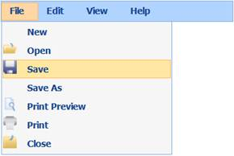

::: {style="DISPLAY: none"}
{#d2h_url_template}{#d2h_package_url style="WIDTH: 0px; DISPLAY: none; HEIGHT: 0px"}
:::

:::::: {.d2h_secondary_topic style="PADDING-BOTTOM: 10pt; MARGIN: 0pt; PADDING-LEFT: 0pt; PADDING-RIGHT: 0pt; PADDING-TOP: 0pt"}
#### Data Binding {#data-binding style="tab-stops: 0pt"}

The Menu provides extensive data binding support to populate Menu items so that the columns of a table can be mapped to the Menu properties, namely Id, ParentId, Text, ImageUrl, SpriteCss, ImageAttributes, and HtmlAttributes.

**[]{style="COLOR: black"}** 

Use Case Scenarios

The Data Binding feature helps users to plug-in data from a DataTable or DataSet to the Menu.

**[]{style="COLOR: black"}** 

Adding Data Binding to an Application

Data Binding in the Menu can be customized by using two ways, namely:

[·      ]{style="FONT-FAMILY: Symbol"}MenuBuilder

[·      ]{style="FONT-FAMILY: Symbol"}MenuModel

**[]{style="COLOR: black"}** 

Using MenuBuilder

To customize Data Binding in the Menu by using MenuBuilder:

1.   In the **Controller**, pass the data to the **View** page.

 

 

+------------------------------------------------------------------------------------------------------------------------------------------------+
| [                ]{style="FONT-FAMILY: 'Calibri','sans-serif'"}**[\[Controller\]]{style="FONT-FAMILY: 'Courier New'"}**                        |
|                                                                                                                                                |
| [public]{style="FONT-FAMILY: 'Courier New'; COLOR: blue"}[ [ActionResult]{style="COLOR: #2b91af"} Index()]{style="FONT-FAMILY: 'Courier New'"} |
|                                                                                                                                                |
| [        {]{style="FONT-FAMILY: 'Courier New'"}                                                                                                |
|                                                                                                                                                |
| [            [Northwind]{style="COLOR: #2b91af"} data = SqlCE;]{style="FONT-FAMILY: 'Courier New'"}                                            |
|                                                                                                                                                |
| [            [// Passing the data to the View.]{style="COLOR: green"}]{style="FONT-FAMILY: 'Courier New'"}                                     |
|                                                                                                                                                |
| [            [return]{style="COLOR: blue"} View(data.MenuData);]{style="FONT-FAMILY: 'Courier New'"}                                           |
|                                                                                                                                                |
| [  }   ]{style="FONT-FAMILY: 'Courier New'"}                                                                                                   |
+------------------------------------------------------------------------------------------------------------------------------------------------+

**[]{style="FONT-FAMILY: 'Calibri','sans-serif'"}** 

[2.   Create a ]{style="COLOR: black"}[Strongly Typed View]{.UGHyperlink}[. ]{style="COLOR: black"}

[3.   In the **View**, invoke the **Menu** helper with the control ID.]{style="COLOR: black"}

[4.   Set the **DataSource** and **BindTo** methods.]{style="COLOR: black"}

 

+---------------------------------------------------------------------------------------------------------------------------------------------------------------------------------------------------------------------+
| **[View \[ASPX\]]{style="FONT-FAMILY: 'Courier New'"}**                                                                                                                                                             |
|                                                                                                                                                                                                                     |
| **[]{style="FONT-FAMILY: 'Courier New'"}**                                                                                                                                                                          |
|                                                                                                                                                                                                                     |
| [\<%]{style="FONT-FAMILY: 'Courier New'; BACKGROUND: yellow"}[=]{style="FONT-FAMILY: 'Courier New'; COLOR: blue"}[Html.Syncfusion().Menu([\"myMenu\"]{style="COLOR: #a31515"})]{style="FONT-FAMILY: 'Courier New'"} |
|                                                                                                                                                                                                                     |
| [.**DataSource(Model)**]{style="FONT-FAMILY: 'Courier New'"}                                                                                                                                                        |
|                                                                                                                                                                                                                     |
| **[.BindTo(bind=\>]{style="FONT-FAMILY: 'Courier New'"}**                                                                                                                                                           |
|                                                                                                                                                                                                                     |
| **[bind.Text([\"Title\"]{style="COLOR: #a31515"})]{style="FONT-FAMILY: 'Courier New'"}**                                                                                                                            |
|                                                                                                                                                                                                                     |
| **[    .Id([\"MenuId\"]{style="COLOR: #a31515"})]{style="FONT-FAMILY: 'Courier New'"}**                                                                                                                             |
|                                                                                                                                                                                                                     |
| **[    .ParentId([\"ParentId\"]{style="COLOR: #a31515"})]{style="FONT-FAMILY: 'Courier New'"}**                                                                                                                     |
|                                                                                                                                                                                                                     |
| **[    .SpriteCss([\"SpriteClass\"]{style="COLOR: #a31515"})]{style="FONT-FAMILY: 'Courier New'"}**                                                                                                                 |
|                                                                                                                                                                                                                     |
| **[    .ImageUrl([\"ImagePath\"]{style="COLOR: #a31515"})]{style="FONT-FAMILY: 'Courier New'"}**                                                                                                                    |
|                                                                                                                                                                                                                     |
| **[    .ImageAttributes([\"Imageattributes\"]{style="COLOR: #a31515"})]{style="FONT-FAMILY: 'Courier New'"}**[)[%\>]{style="BACKGROUND: yellow"}]{style="FONT-FAMILY: 'Courier New'"}                               |
+---------------------------------------------------------------------------------------------------------------------------------------------------------------------------------------------------------------------+

[]{style="FONT-FAMILY: Consolas; BACKGROUND: yellow; FONT-SIZE: 9.5pt"} 

+---------------------------------------------------------------------------------------------------------------------------------------------------------------------------------------------------------------------+
| **[View\[cshtml\]]{style="FONT-FAMILY: 'Cambria','serif'; FONT-SIZE: 11pt"}**                                                                                                                                       |
|                                                                                                                                                                                                                     |
| **[]{style="FONT-FAMILY: 'Courier New'"}**                                                                                                                                                                          |
|                                                                                                                                                                                                                     |
| [\@{]{style="FONT-FAMILY: 'Courier New'; BACKGROUND: yellow"}[ ]{style="FONT-FAMILY: 'Courier New'; COLOR: blue"}[Html.Syncfusion().Menu([\"myMenu\"]{style="COLOR: #a31515"})]{style="FONT-FAMILY: 'Courier New'"} |
|                                                                                                                                                                                                                     |
| [.**DataSource(Model)**]{style="FONT-FAMILY: 'Courier New'"}                                                                                                                                                        |
|                                                                                                                                                                                                                     |
| **[.BindTo(bind=\>]{style="FONT-FAMILY: 'Courier New'"}**                                                                                                                                                           |
|                                                                                                                                                                                                                     |
| **[bind.Text([\"Title\"]{style="COLOR: #a31515"})]{style="FONT-FAMILY: 'Courier New'"}**                                                                                                                            |
|                                                                                                                                                                                                                     |
| **[    .Id([\"MenuId\"]{style="COLOR: #a31515"})]{style="FONT-FAMILY: 'Courier New'"}**                                                                                                                             |
|                                                                                                                                                                                                                     |
| **[    .ParentId([\"ParentId\"]{style="COLOR: #a31515"})]{style="FONT-FAMILY: 'Courier New'"}**                                                                                                                     |
|                                                                                                                                                                                                                     |
| **[    .SpriteCss([\"SpriteClass\"]{style="COLOR: #a31515"})]{style="FONT-FAMILY: 'Courier New'"}**                                                                                                                 |
|                                                                                                                                                                                                                     |
| **[    .ImageUrl([\"ImagePath\"]{style="COLOR: #a31515"})]{style="FONT-FAMILY: 'Courier New'"}**                                                                                                                    |
|                                                                                                                                                                                                                     |
| **[    .ImageAttributes([\"Imageattributes\"]{style="COLOR: #a31515"})]{style="FONT-FAMILY: 'Courier New'"}**[)]{style="FONT-FAMILY: 'Courier New'"}                                                                |
|                                                                                                                                                                                                                     |
| [    .Render();]{style="FONT-FAMILY: 'Courier New'"}[]{style="FONT-FAMILY: 'Courier New'"}                                                                                                                          |
|                                                                                                                                                                                                                     |
| [}]{style="FONT-FAMILY: 'Courier New'; BACKGROUND: yellow"}[]{style="FONT-FAMILY: 'Courier New'"}                                                                                                                   |
+---------------------------------------------------------------------------------------------------------------------------------------------------------------------------------------------------------------------+

[]{style="BACKGROUND: yellow"} 

5.   Build and run the application.

 

{border="0"}

Figure 151: Menu - Data Binding Using MenuBuilder

 

 

Using MenuModel

To customize Data Binding in the Menu by using MenuModel:

[·      ]{style="FONT-FAMILY: Symbol"}In the **Controller**, create an object for the **MenuModel** class.

[·      ]{style="FONT-FAMILY: Symbol"}Set the **DataSource** and **BindTo** properties.

[·      ]{style="FONT-FAMILY: Symbol"}Pass the **MenuModel** class to the **ViewData**.

 

::: {align="center"}
+-----------------------------------------------------------------------------------------------------------------------------------------------------------------------+
| [      **\[Controller\]**]{style="FONT-FAMILY: 'Courier New'"}                                                                                                        |
|                                                                                                                                                                       |
| [public]{style="FONT-FAMILY: 'Courier New'; COLOR: blue"}[ [ActionResult]{style="COLOR: #2b91af"} Index()]{style="FONT-FAMILY: 'Courier New'"}                        |
|                                                                                                                                                                       |
| [        {]{style="FONT-FAMILY: 'Courier New'"}                                                                                                                       |
|                                                                                                                                                                       |
| [            [Northwind]{style="COLOR: #2b91af"} context = SqlCE;]{style="FONT-FAMILY: 'Courier New'"}                                                                |
|                                                                                                                                                                       |
| [            [MenuFields]{style="COLOR: #2b91af"} menuFields = [new]{style="COLOR: blue"} [MenuFields]{style="COLOR: #2b91af"}()]{style="FONT-FAMILY: 'Courier New'"} |
|                                                                                                                                                                       |
| [            {]{style="FONT-FAMILY: 'Courier New'"}                                                                                                                   |
|                                                                                                                                                                       |
| [                Id = [\"Id\"]{style="COLOR: #a31515"},]{style="FONT-FAMILY: 'Courier New'"}                                                                          |
|                                                                                                                                                                       |
| [                ParentId = [\"ParentId\"]{style="COLOR: #a31515"},]{style="FONT-FAMILY: 'Courier New'"}                                                              |
|                                                                                                                                                                       |
| [                Text = [\"Text\"]{style="COLOR: #a31515"},]{style="FONT-FAMILY: 'Courier New'"}                                                                      |
|                                                                                                                                                                       |
| [                ImageUrl = [\"ImageUrl\"]{style="COLOR: #a31515"},]{style="FONT-FAMILY: 'Courier New'"}                                                              |
|                                                                                                                                                                       |
| [                SpriteCSS = [\"SpriteCSS\"]{style="COLOR: #a31515"}]{style="FONT-FAMILY: 'Courier New'"}                                                             |
|                                                                                                                                                                       |
| [            };]{style="FONT-FAMILY: 'Courier New'"}                                                                                                                  |
|                                                                                                                                                                       |
| [            [MenuModel]{style="COLOR: #2b91af"} menuModel = [new]{style="COLOR: blue"} [MenuModel]{style="COLOR: #2b91af"}()]{style="FONT-FAMILY: 'Courier New'"}    |
|                                                                                                                                                                       |
| [            {]{style="FONT-FAMILY: 'Courier New'"}                                                                                                                   |
|                                                                                                                                                                       |
| [                DataSource = context.MenuData.ToList(),]{style="FONT-FAMILY: 'Courier New'"}                                                                         |
|                                                                                                                                                                       |
| [                BindTo = menuFields,]{style="FONT-FAMILY: 'Courier New'"}                                                                                            |
|                                                                                                                                                                       |
| [            };]{style="FONT-FAMILY: 'Courier New'"}                                                                                                                  |
|                                                                                                                                                                       |
| [            ViewData\[[\"myMenuModel\"]{style="COLOR: #a31515"}\] = menuModel;]{style="FONT-FAMILY: 'Courier New'"}                                                  |
|                                                                                                                                                                       |
| [            [return]{style="COLOR: blue"} View();]{style="FONT-FAMILY: 'Courier New'"}                                                                               |
|                                                                                                                                                                       |
| [  }   ]{style="FONT-FAMILY: 'Courier New'"}                                                                                                                          |
+-----------------------------------------------------------------------------------------------------------------------------------------------------------------------+
:::

**[]{style="FONT-FAMILY: 'Calibri','sans-serif'"}** 

[1.    ]{style="FONT-FAMILY: 'Calibri','sans-serif'; FONT-SIZE: 11pt"}In the **View**, invoke the **Menu** helper with the control ID.

[2.    ]{style="FONT-FAMILY: 'Calibri','sans-serif'; FONT-SIZE: 11pt"}From the **ViewData**, assign the **MenuModel** class to the **Menu** helper.

 

::: {align="center"}
+------------------------------------------------------------------------------------------------------------------------------------------------------------------------------------------------------------------------------------------------------------------------------------------------------------------------------------------------------------------------------------------------------------------+
| **[View]{style="FONT-FAMILY: 'Cambria','serif'; FONT-SIZE: 11pt"}[\[ASPX\]]{style="FONT-FAMILY: 'Cambria','serif'; FONT-SIZE: 11pt"}**                                                                                                                                                                                                                                                                           |
|                                                                                                                                                                                                                                                                                                                                                                                                                  |
| **[]{style="FONT-FAMILY: 'Courier New'"}**                                                                                                                                                                                                                                                                                                                                                                       |
|                                                                                                                                                                                                                                                                                                                                                                                                                  |
| [        [\<%]{style="BACKGROUND: yellow"}[=]{style="COLOR: blue"}Html]{style="FONT-FAMILY: 'Courier New'; FONT-SIZE: 9.5pt"}[.Syncfusion()]{style="FONT-FAMILY: 'Courier New'"}[.Menu([\"myMenu\"]{style="COLOR: #a31515"}, ([MenuModel]{style="COLOR: #2b91af"})ViewData\[[\"myMenuModel\"]{style="COLOR: #a31515"}\])[%\>]{style="BACKGROUND: yellow"}]{style="FONT-FAMILY: 'Courier New'; FONT-SIZE: 9.5pt"} |
+------------------------------------------------------------------------------------------------------------------------------------------------------------------------------------------------------------------------------------------------------------------------------------------------------------------------------------------------------------------------------------------------------------------+
:::

 

::: {align="center"}
+--------------------------------------------------------------------------------------------------------------------------------------------------------------------------------------------------------------------------------------------------------------------------------------------------------------------------------------------------------------------------------------------------------------------------+
| **[View\[cshtml\]]{style="FONT-FAMILY: 'Cambria','serif'; FONT-SIZE: 11pt"}**                                                                                                                                                                                                                                                                                                                                            |
|                                                                                                                                                                                                                                                                                                                                                                                                                          |
| **[]{style="FONT-FAMILY: 'Cambria','serif'; FONT-SIZE: 11pt"}**                                                                                                                                                                                                                                                                                                                                                          |
|                                                                                                                                                                                                                                                                                                                                                                                                                          |
| [        [\@{]{style="BACKGROUND: yellow"}[ ]{style="COLOR: blue"}Html]{style="FONT-FAMILY: 'Courier New'; FONT-SIZE: 9.5pt"}[.Syncfusion()]{style="FONT-FAMILY: 'Courier New'"}[.Menu([\"myMenu\"]{style="COLOR: #a31515"}, ([MenuModel]{style="COLOR: #2b91af"})ViewData\[[\"myMenuModel\"]{style="COLOR: #a31515"}\]).Render();[}]{style="BACKGROUND: yellow"}]{style="FONT-FAMILY: 'Courier New'; FONT-SIZE: 9.5pt"} |
+--------------------------------------------------------------------------------------------------------------------------------------------------------------------------------------------------------------------------------------------------------------------------------------------------------------------------------------------------------------------------------------------------------------------------+
:::

[]{style="FONT-FAMILY: Consolas; BACKGROUND: yellow; FONT-SIZE: 9.5pt"} 

[3.    ]{style="FONT-FAMILY: 'Calibri','sans-serif'; FONT-SIZE: 11pt"}Build and run the application.

 

{border="0"}

Figure 152: Menu - Data Binding Using MenuModel

 

Properties

The properties of the Data Binding feature in the Menu are described in the following tabulation:

 

  ----------------- --------------------------------------------------------------------------------------- ------------- ------------- -----------------
  Name              Description                                                                             Type          Data Type     Reference links
  DataSource        Gets or sets the data source, which is used to populate the Menu with the Menu items.   Server-side   IEnumerable   Not applicable
  BindTo            Maps the Menu fields to their respective columns from the data source.                  Server-side   MenuFields    Not applicable
  Id                Gets or sets the ID column name.                                                        Server-side   string        Not applicable
  ParentId          Gets or sets the parent ID column name.                                                 Server-side   string        Not applicable
  Text              Gets or sets the text column name.                                                      Server-side   string        Not applicable
  SpriteCss         Gets or sets the sprite column name.                                                    Server-side   string        Not applicable
  ImageUrl          Gets or sets the image path column name.                                                Server-side   string        Not applicable
  HtmlAttributes    Gets or sets the HTML attributes column name.                                           Server-side   string        Not applicable
  ImageAttributes   Gets or sets the image attributes column name.                                          Server-side   string        Not applicable
  ----------------- --------------------------------------------------------------------------------------- ------------- ------------- -----------------

[]{style="FONT-FAMILY: 'Calibri','sans-serif'; COLOR: black"} 

Sample Link

To view a sample:

1.   Open the **Tools** Sample Browser from the dashboard. (Refer to the Samples and Location chapter.)

2.   Navigate to **Tools.Mvc** -\> **Menu** -\> **Data Binding Demo**.

[]{style="FONT-FAMILY: 'Calibri','sans-serif'"} 

[]{#related-topics}
::::::
