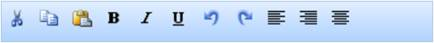

::: {style="DISPLAY: none"}
{#d2h_url_template}{#d2h_package_url style="WIDTH: 0px; DISPLAY: none; HEIGHT: 0px"}
:::

::: {.d2h_secondary_topic style="PADDING-BOTTOM: 10pt; MARGIN: 0pt; PADDING-LEFT: 0pt; PADDING-RIGHT: 0pt; PADDING-TOP: 0pt"}
#### Data Binding {#data-binding style="tab-stops: 0pt"}

 

Toolbar provides extensive data binding support to populate Toolbar items so that the columns of a table can be mapped to the Toolbar properties, namely Id, Text, ImageUrl, SpriteCss, ImageAttributes, and HtmlAttributes.

 

Use Case Scenarios

The Data Binding feature helps users to plug-in data from a DataTable or DataSet to Toolbar.

 

Adding Data Binding[ ]{style="COLOR: red"}to an Application

Data Binding in Toolbar can be customized by using two ways, namely:

[·      ]{style="FONT-FAMILY: Symbol"}ToolbarBuilder

[·      ]{style="FONT-FAMILY: Symbol"}ToolbarModel

 

Using ToolbarBuilder

To customize Data Binding in Toolbar by using ToolbarBuilder:

1.   In the **Controller**, pass the data to the **View** page.

**[]{style="FONT-FAMILY: 'Calibri','sans-serif'"}** 

+------------------------------------------------------------------------------------------------------------------------------------------------+
| **[\[Controller\]]{style="FONT-FAMILY: 'Courier New'"}**                                                                                       |
|                                                                                                                                                |
| [public]{style="FONT-FAMILY: 'Courier New'; COLOR: blue"}[ [ActionResult]{style="COLOR: #2b91af"} Index()]{style="FONT-FAMILY: 'Courier New'"} |
|                                                                                                                                                |
| [        {]{style="FONT-FAMILY: 'Courier New'"}                                                                                                |
|                                                                                                                                                |
| [            [Northwind]{style="COLOR: #2b91af"} data = SqlCE;]{style="FONT-FAMILY: 'Courier New'"}                                            |
|                                                                                                                                                |
| [            [// Passing the data to the View.]{style="COLOR: green"}]{style="FONT-FAMILY: 'Courier New'"}                                     |
|                                                                                                                                                |
| [            [return]{style="COLOR: blue"} View(data.ToolbarData);]{style="FONT-FAMILY: 'Courier New'"}                                        |
|                                                                                                                                                |
| [  }   ]{style="FONT-FAMILY: 'Courier New'"}                                                                                                   |
+------------------------------------------------------------------------------------------------------------------------------------------------+

**[]{style="FONT-FAMILY: 'Calibri','sans-serif'"}** 

2.   Create a [Strongly Typed View]{.UGHyperlink}.

3.   In the **View**, invoke the **Toolbar** helper with the control ID.

4.   Set the **DataSource** and **BindTo** methods.

 

+---------------------------------------------------------------------------------------------------------------------------------------------------------------------------------------------------------------------------+
| **[View\[ASPX\]]{style="FONT-FAMILY: 'Courier New'"}**                                                                                                                                                                    |
|                                                                                                                                                                                                                           |
| [\<%]{style="FONT-FAMILY: 'Courier New'; BACKGROUND: yellow"}[=]{style="FONT-FAMILY: 'Courier New'; COLOR: blue"}[Html.Syncfusion().Toolbar([\"myToolbar\"]{style="COLOR: #a31515"})]{style="FONT-FAMILY: 'Courier New'"} |
|                                                                                                                                                                                                                           |
| [.**DataSource(Model)**]{style="FONT-FAMILY: 'Courier New'"}                                                                                                                                                              |
|                                                                                                                                                                                                                           |
| **[.BindTo(bind=\>]{style="FONT-FAMILY: 'Courier New'"}**                                                                                                                                                                 |
|                                                                                                                                                                                                                           |
| **[bind.Text([\"Title\"]{style="COLOR: #a31515"})]{style="FONT-FAMILY: 'Courier New'"}**                                                                                                                                  |
|                                                                                                                                                                                                                           |
| **[    .Id([\"ToolbarId\"]{style="COLOR: #a31515"})]{style="FONT-FAMILY: 'Courier New'"}**                                                                                                                                |
|                                                                                                                                                                                                                           |
| **[    .SpriteCss([\"SpriteClass\"]{style="COLOR: #a31515"})]{style="FONT-FAMILY: 'Courier New'"}**                                                                                                                       |
|                                                                                                                                                                                                                           |
| **[    .ImageUrl([\"ImagePath\"]{style="COLOR: #a31515"})]{style="FONT-FAMILY: 'Courier New'"}**                                                                                                                          |
|                                                                                                                                                                                                                           |
| **[    .ImageAttributes([\"Imageattributes\"]{style="COLOR: #a31515"})]{style="FONT-FAMILY: 'Courier New'"}**[)[%\>]{style="BACKGROUND: yellow"}]{style="FONT-FAMILY: 'Courier New'"}                                     |
|                                                                                                                                                                                                                           |
| []{style="FONT-FAMILY: Consolas; COLOR: #a31515; FONT-SIZE: 9.5pt"}                                                                                                                                                       |
+---------------------------------------------------------------------------------------------------------------------------------------------------------------------------------------------------------------------------+

 

+------------------------------------------------------------------------------------------------------------------------------------------------------------------------------------------------------------------------------------------------------------------+
| **[View\[cshtml\]]{style="FONT-FAMILY: 'Courier New'"}**                                                                                                                                                                                                         |
|                                                                                                                                                                                                                                                                  |
| **[]{style="FONT-FAMILY: 'Courier New'"}**                                                                                                                                                                                                                       |
|                                                                                                                                                                                                                                                                  |
| [\@{]{style="FONT-FAMILY: 'Courier New'; BACKGROUND: yellow"}[ Html.Syncfusion().Toolbar([\"myToolbar\"]{style="COLOR: #a31515"})]{style="FONT-FAMILY: 'Courier New'"}                                                                                           |
|                                                                                                                                                                                                                                                                  |
| [.**DataSource(Model)**]{style="FONT-FAMILY: 'Courier New'"}                                                                                                                                                                                                     |
|                                                                                                                                                                                                                                                                  |
| **[.BindTo(bind=\>]{style="FONT-FAMILY: 'Courier New'"}**                                                                                                                                                                                                        |
|                                                                                                                                                                                                                                                                  |
| **[bind.Text([\"Title\"]{style="COLOR: #a31515"})]{style="FONT-FAMILY: 'Courier New'"}**                                                                                                                                                                         |
|                                                                                                                                                                                                                                                                  |
| **[    .Id([\"ToolbarId\"]{style="COLOR: #a31515"})]{style="FONT-FAMILY: 'Courier New'"}**                                                                                                                                                                       |
|                                                                                                                                                                                                                                                                  |
| **[    .SpriteCss([\"SpriteClass\"]{style="COLOR: #a31515"})]{style="FONT-FAMILY: 'Courier New'"}**                                                                                                                                                              |
|                                                                                                                                                                                                                                                                  |
| **[    .ImageUrl([\"ImagePath\"]{style="COLOR: #a31515"})]{style="FONT-FAMILY: 'Courier New'"}**                                                                                                                                                                 |
|                                                                                                                                                                                                                                                                  |
| **[    .ImageAttributes([\"Imageattributes\"]{style="COLOR: #a31515"})]{style="FONT-FAMILY: 'Courier New'"}**[).Render();[}]{style="BACKGROUND: yellow"}]{style="FONT-FAMILY: 'Courier New'"}[]{style="FONT-FAMILY: Consolas; COLOR: #a31515; FONT-SIZE: 9.5pt"} |
+------------------------------------------------------------------------------------------------------------------------------------------------------------------------------------------------------------------------------------------------------------------+

[]{style="FONT-FAMILY: Consolas; BACKGROUND: yellow; FONT-SIZE: 9.5pt"} 

5.   Build and run the application.

 

{border="0"}

Figure 308: Toolbar - Data Binding Using ToolbarBuilder

 

 

Using ToolbarModel

 

To customize Data Binding in Toolbar by using ToolbarModel:

1.   In the **Controller**, create an object for the **ToolbarModel** class.

2.   Set the **DataSource** and **BindTo** properties.

3.   Pass the **ToolbarModel** class to the **ViewData**.

 

+--------------------------------------------------------------------------------------------------------------------------------------------------------------------------------+
| [      **\[Controller\]**]{style="FONT-FAMILY: 'Courier New'"}                                                                                                                 |
|                                                                                                                                                                                |
| [        [public]{style="COLOR: blue"} [ActionResult]{style="COLOR: #2b91af"} Index()]{style="FONT-FAMILY: 'Courier New'"}                                                     |
|                                                                                                                                                                                |
| [        {]{style="FONT-FAMILY: 'Courier New'"}                                                                                                                                |
|                                                                                                                                                                                |
| [            [Northwind]{style="COLOR: #2b91af"} context = SqlCE;]{style="FONT-FAMILY: 'Courier New'"}                                                                         |
|                                                                                                                                                                                |
| [            [ToolbarFields]{style="COLOR: #2b91af"} toolbarFields = [new]{style="COLOR: blue"} [ToolbarFields]{style="COLOR: #2b91af"}()]{style="FONT-FAMILY: 'Courier New'"} |
|                                                                                                                                                                                |
| [            {]{style="FONT-FAMILY: 'Courier New'"}                                                                                                                            |
|                                                                                                                                                                                |
| [                Id = [\"Id\"]{style="COLOR: #a31515"},]{style="FONT-FAMILY: 'Courier New'"}                                                                                   |
|                                                                                                                                                                                |
| [                ParentId = [\"ParentId\"]{style="COLOR: #a31515"},]{style="FONT-FAMILY: 'Courier New'"}                                                                       |
|                                                                                                                                                                                |
| [                Text = [\"Text\"]{style="COLOR: #a31515"},]{style="FONT-FAMILY: 'Courier New'"}                                                                               |
|                                                                                                                                                                                |
| [                ImageUrl = [\"ImageUrl\"]{style="COLOR: #a31515"},]{style="FONT-FAMILY: 'Courier New'"}                                                                       |
|                                                                                                                                                                                |
| [                SpriteCSS = [\"SpriteCSS\"]{style="COLOR: #a31515"}]{style="FONT-FAMILY: 'Courier New'"}                                                                      |
|                                                                                                                                                                                |
| [            };]{style="FONT-FAMILY: 'Courier New'"}                                                                                                                           |
|                                                                                                                                                                                |
| [            [ToolbarModel]{style="COLOR: #2b91af"} toolbarModel = [new]{style="COLOR: blue"} [ToolbarModel]{style="COLOR: #2b91af"}()]{style="FONT-FAMILY: 'Courier New'"}    |
|                                                                                                                                                                                |
| [            {]{style="FONT-FAMILY: 'Courier New'"}                                                                                                                            |
|                                                                                                                                                                                |
| [                DataSource = context.ToolbarData.ToList(),]{style="FONT-FAMILY: 'Courier New'"}                                                                               |
|                                                                                                                                                                                |
| [                BindTo = toolbarFields,]{style="FONT-FAMILY: 'Courier New'"}                                                                                                  |
|                                                                                                                                                                                |
| [            };]{style="FONT-FAMILY: 'Courier New'"}                                                                                                                           |
|                                                                                                                                                                                |
| [            ViewData\[[\"myToolbarModel\"]{style="COLOR: #a31515"}\] = toolbarModel;]{style="FONT-FAMILY: 'Courier New'"}                                                     |
|                                                                                                                                                                                |
| [            [return]{style="COLOR: blue"} View();]{style="FONT-FAMILY: 'Courier New'"}                                                                                        |
|                                                                                                                                                                                |
| [        }]{style="FONT-FAMILY: 'Courier New'"}                                                                                                                                |
|                                                                                                                                                                                |
| []{style="FONT-FAMILY: 'Courier New'"}                                                                                                                                         |
+--------------------------------------------------------------------------------------------------------------------------------------------------------------------------------+

**[]{style="FONT-FAMILY: 'Calibri','sans-serif'"}** 

4.   Create a **View**.

5.   In the **View**, invoke the **Toolbar** helper with the control ID.

6.   From the **ViewData**, assign the **ToolbarModel** class to the **Toolbar** helper.

 

+---------------------------------------------------------------------------------------------------------------------------------------------------------------------------------------------------------------------------------------------------------------------------------------------------------------+
| **[View\[ASPX\]]{style="FONT-FAMILY: 'Courier New'"}**                                                                                                                                                                                                                                                        |
|                                                                                                                                                                                                                                                                                                               |
| **[]{style="FONT-FAMILY: 'Courier New'"}**                                                                                                                                                                                                                                                                    |
|                                                                                                                                                                                                                                                                                                               |
| [        [\<%]{style="BACKGROUND: yellow"}[=]{style="COLOR: blue"}Html.Syncfusion().Toolbar([\"MyToolbar\"]{style="COLOR: #a31515"}, ([ToolbarModel]{style="COLOR: #2b91af"})ViewData\[[\"myToolbarModel\"]{style="COLOR: #a31515"}\]) [%\>]{style="BACKGROUND: yellow"}]{style="FONT-FAMILY: 'Courier New'"} |
|                                                                                                                                                                                                                                                                                                               |
| []{style="FONT-FAMILY: 'Courier New'; BACKGROUND: yellow"}                                                                                                                                                                                                                                                    |
+---------------------------------------------------------------------------------------------------------------------------------------------------------------------------------------------------------------------------------------------------------------------------------------------------------------+

[]{style="FONT-FAMILY: Consolas; BACKGROUND: yellow; FONT-SIZE: 9.5pt"} 

+------------------------------------------------------------------------------------------------------------------------------------------------------------------------------------------------------------------------------------------------------------------------------------------------+
| **[View\[cshtml\]]{style="FONT-FAMILY: 'Courier New'"}**                                                                                                                                                                                                                                       |
|                                                                                                                                                                                                                                                                                                |
| **[]{style="FONT-FAMILY: 'Courier New'"}**                                                                                                                                                                                                                                                     |
|                                                                                                                                                                                                                                                                                                |
| [        [\@{]{style="BACKGROUND: yellow"} Html.Syncfusion().Toolbar([\"MyToolbar\"]{style="COLOR: #a31515"}, ([ToolbarModel]{style="COLOR: #2b91af"})ViewData\[[\"myToolbarModel\"]{style="COLOR: #a31515"}\]).Render(); [}]{style="BACKGROUND: yellow"}]{style="FONT-FAMILY: 'Courier New'"} |
|                                                                                                                                                                                                                                                                                                |
| []{style="FONT-FAMILY: 'Courier New'; BACKGROUND: yellow"}                                                                                                                                                                                                                                     |
+------------------------------------------------------------------------------------------------------------------------------------------------------------------------------------------------------------------------------------------------------------------------------------------------+

[]{style="FONT-FAMILY: Consolas; BACKGROUND: yellow; FONT-SIZE: 9.5pt"} 

7.   Build and run the application.

 

{border="0"}

Figure 309: Toolbar - Data Binding Using ToolbarModel

 

**Properties**

The properties of the Data Binding feature in Toolbar are described in the following tabulation:

 

  ---------------------------------------------------------- ----------------------------------------------------------------------------------------------------------------- ---------------------------------------------------------- --------------------------------------------------------------- ---------------------------------------------------------------------
  **[Name]{style="COLOR: black"}**[]{style="COLOR: black"}   **[Description]{style="COLOR: black"}**[]{style="COLOR: black"}                                                   **[Type]{style="COLOR: black"}**[]{style="COLOR: black"}   **[Data Type]{style="COLOR: black"}**[]{style="COLOR: black"}   **[Reference links]{style="COLOR: black"}**[]{style="COLOR: black"}
  [DataSource]{style="COLOR: black"}                         [Gets or sets the data source, which is used to populate Toolbar with the Toolbar items.]{style="COLOR: black"}   [Server-side]{style="COLOR: black"}                        [IEnumerable]{style="COLOR: black"}                             [Not applicable]{style="COLOR: black"}
  [BindTo]{style="COLOR: black"}                             [Maps the Toolbar fields to their respective columns from the data source.]{style="COLOR: black"}                 [Server-side]{style="COLOR: black"}                        [ToolbarFields]{style="COLOR: black"}                           [ Not applicable]{style="COLOR: black"}
  [Id]{style="COLOR: black"}                                 [Gets or sets the ID column name.]{style="COLOR: black"}                                                          [Server-side]{style="COLOR: black"}                        [string]{style="COLOR: black"}                                  [ Not applicable]{style="COLOR: black"}
  [Text]{style="COLOR: black"}                               [Gets or sets the text column name.]{style="COLOR: black"}                                                        [Server-side]{style="COLOR: black"}                        [string]{style="COLOR: black"}                                  [ Not applicable]{style="COLOR: black"}
  [SpriteCss]{style="COLOR: black"}                          [Gets or sets the sprite column name.]{style="COLOR: black"}                                                      [Server-side]{style="COLOR: black"}                        [string]{style="COLOR: black"}                                  [ Not applicable]{style="COLOR: black"}
  [ImageUrl]{style="COLOR: black"}                           [Gets or sets the image path column name.]{style="COLOR: black"}                                                  [Server-side]{style="COLOR: black"}                        [string]{style="COLOR: black"}                                  [ Not applicable]{style="COLOR: black"}
  [HtmlAttributes]{style="COLOR: black"}                     [Gets or sets the HTML attributes column name.]{style="COLOR: black"}                                             [Server-side]{style="COLOR: black"}                        [string]{style="COLOR: black"}                                  [ Not applicable]{style="COLOR: black"}
  [ImageAttributes]{style="COLOR: black"}                    [Gets or sets the image attributes column name.]{style="COLOR: black"}                                            [Server-side]{style="COLOR: black"}                        [string]{style="COLOR: black"}                                  [ Not applicable]{style="COLOR: black"}
  ---------------------------------------------------------- ----------------------------------------------------------------------------------------------------------------- ---------------------------------------------------------- --------------------------------------------------------------- ---------------------------------------------------------------------

[]{style="FONT-FAMILY: 'Calibri','sans-serif'; COLOR: black"} 

Sample Link

To view a sample:

1.   Open the Tools Sample Browser from the dashboard. (Refer to the Samples and Location chapter.)

2.   Navigate to **Tools.Mvc** -\> **Toolbar** -\> **Data Binding Demo**.

 

[]{#related-topics}
:::
