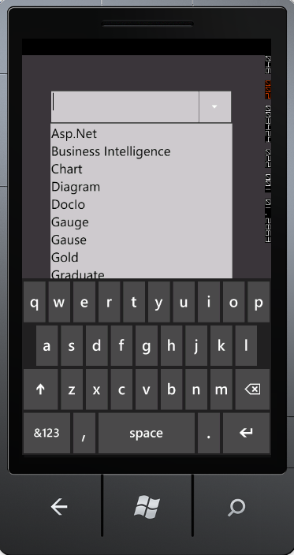
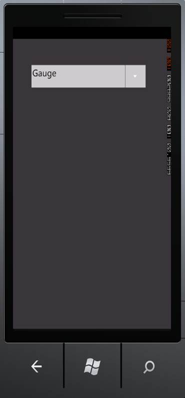

::: {style="DISPLAY: none"}
{#d2h_url_template}{#d2h_package_url style="WIDTH: 0px; DISPLAY: none; HEIGHT: 0px"}
:::

::: {.d2h_secondary_topic style="PADDING-BOTTOM: 10pt; MARGIN: 0pt; PADDING-LEFT: 0pt; PADDING-RIGHT: 0pt; PADDING-TOP: 0pt"}
#### Data Binding {#data-binding style="tab-stops: 0pt"}

Data binding is the process of establishing a connection between the application UI and business logic. Data Binding can be unidirectional (Source -\> target or target -\> Source) or bidirectional (Source \<-\> target). You can bind data to the AutoComplete through the *CustomSource* property.

 

 

 

{border="0"}

Figure 14.1: AutoComplete Bound with Data

{border="0"}

Figure 14.2: AutoComplete Selected Item

 

 

 

 

Tables for Property, and Event

Properties

Table 3: Property Table for Data Binding

  -------------- ---------------------------------------------------- --------------------- ------------------------------- -----------------
  Property       Description                                          Type                  Data Type                       Reference links
  CustomSource   Gets or sets the CustomSource of the AutoComplete.   Dependency Property   Sytem.Collections.IEnumerable   NA
  -------------- ---------------------------------------------------- --------------------- ------------------------------- -----------------

 

Events

Table 4: Event Table for Data Binding

+---------------------+---------------------------------------------------------------------------------+------------------------------------+-----------------------------------+-----------------+
| Event               | Description                                                                     | Arguments                          | Type                              | Reference links |
+---------------------+---------------------------------------------------------------------------------+------------------------------------+-----------------------------------+-----------------+
| CustomSourceChanged |  When the CustomSource property value is changed, this event will be triggered. | DependencyObject,                  | DependencyPropertyChangedCallBack | NA              |
|                     |                                                                                 |                                    |                                   |                 |
|                     | This cannot be cancelled.                                                       | DependencyPropertyChangedEventArgs |                                   |                 |
+=====================+=================================================================================+====================================+===================================+=================+

 

Sample Link

To access a Basic Core Features demo:

1.  Open the Syncfusion Dashboard.

2.  Click the **Windows Phones** drop-down list and select **Explore Samples**.

**3.  ** Navigate to **WindowsPhoneSampleBrowser-\> Tools -\> AutoComplete Demo**

More:

[ ]{#related-topics}

[{border="0" align="absMiddle"}WCF Data Binding](ms-xhelp:///?Id=69dab762-697a-44d1-a0d4-dd2d05e71422){style="TEXT-DECORATION: none"}
:::
