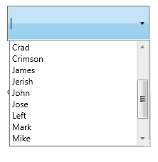

::: {style="DISPLAY: none"}
{#d2h_url_template}{#d2h_package_url style="WIDTH: 0px; DISPLAY: none; HEIGHT: 0px"}
:::

::::: {.d2h_secondary_topic style="PADDING-BOTTOM: 10pt; MARGIN: 0pt; PADDING-LEFT: 0pt; PADDING-RIGHT: 0pt; PADDING-TOP: 0pt"}
#### Data Binding {#data-binding style="tab-stops: 0pt"}

Data Binding is the process of establishing a connection between the application UI and business logic. Data Binding can be unidirectional (Source -\> target or target -\> Source) or bidirectional (Source \<-\> target). You can bind the data to the AutoComplete through the **CustomSource** property. While binding the CustomSource to the AutoComplete, you must set the value of the **DisplayMemberPath** and the **SelectedValuePath** properties.

Adding Data Binding to an Application

You can use the **DisplayMemberPath** property to set the value for items that needs to be displayed in the drop-down list. Also you can use the **SelectedValuePath** property which can be used to set the value of the **SelectedValue** property. The below code snippet will be used to bind the Data Source to the AutoComplete.

 

+-------------------------------------------------------------------------------------------------------------------------------------------------------------------------------------------------------------------------------------------------------------------------------------------------------------------------------------------------------------------------------------------------------------------------------------------------------------------------------------------------------------------------------------------------------------------------------------------------------+
| **[\[XAML\]]{style="FONT-FAMILY: 'Courier New'"}**                                                                                                                                                                                                                                                                                                                                                                                                                                                                                                                                                    |
|                                                                                                                                                                                                                                                                                                                                                                                                                                                                                                                                                                                                       |
| [\<]{style="FONT-FAMILY: 'Courier New'; COLOR: blue"}[syncfusion]{style="FONT-FAMILY: 'Courier New'; COLOR: #a31515"}[:]{style="FONT-FAMILY: 'Courier New'; COLOR: blue"}[AutoComplete]{style="FONT-FAMILY: 'Courier New'; COLOR: #a31515"}[ x]{style="FONT-FAMILY: 'Courier New'; COLOR: red"}[:]{style="FONT-FAMILY: 'Courier New'; COLOR: blue"}[Name]{style="FONT-FAMILY: 'Courier New'; COLOR: red"}[=\"AutoComplete2\" ]{style="FONT-FAMILY: 'Courier New'; COLOR: blue"}[Source]{style="FONT-FAMILY: 'Courier New'; COLOR: red"}[=\"Custom" ]{style="FONT-FAMILY: 'Courier New'; COLOR: blue"} |
|                                                                                                                                                                                                                                                                                                                                                                                                                                                                                                                                                                                                       |
| [DisplayMemberPath]{style="FONT-FAMILY: 'Courier New'; COLOR: red"}[=\"FirstName\"]{style="FONT-FAMILY: 'Courier New'; COLOR: blue"}[ SelectedValuePath]{style="FONT-FAMILY: 'Courier New'; COLOR: red"}[=\"LastName\"\>]{style="FONT-FAMILY: 'Courier New'; COLOR: blue"}[]{style="FONT-FAMILY: 'Courier New'"}                                                                                                                                                                                                                                                                                      |
|                                                                                                                                                                                                                                                                                                                                                                                                                                                                                                                                                                                                       |
| [     ]{style="FONT-FAMILY: 'Courier New'; COLOR: #a31515"}[\<]{style="FONT-FAMILY: 'Courier New'; COLOR: blue"}[syncfusion]{style="FONT-FAMILY: 'Courier New'; COLOR: #a31515"}[:]{style="FONT-FAMILY: 'Courier New'; COLOR: blue"}[AutoComplete.CustomSource]{style="FONT-FAMILY: 'Courier New'; COLOR: #a31515"}[\>]{style="FONT-FAMILY: 'Courier New'; COLOR: blue"}[]{style="FONT-FAMILY: 'Courier New'"}                                                                                                                                                                                        |
|                                                                                                                                                                                                                                                                                                                                                                                                                                                                                                                                                                                                       |
| [            ]{style="FONT-FAMILY: 'Courier New'; COLOR: #a31515"}[\<]{style="FONT-FAMILY: 'Courier New'; COLOR: blue"}[local]{style="FONT-FAMILY: 'Courier New'; COLOR: #a31515"}[:]{style="FONT-FAMILY: 'Courier New'; COLOR: blue"}[EmployeeList]{style="FONT-FAMILY: 'Courier New'; COLOR: #a31515"}[/\>]{style="FONT-FAMILY: 'Courier New'; COLOR: blue"}[]{style="FONT-FAMILY: 'Courier New'"}                                                                                                                                                                                                  |
|                                                                                                                                                                                                                                                                                                                                                                                                                                                                                                                                                                                                       |
| [     ]{style="FONT-FAMILY: 'Courier New'; COLOR: #a31515"}[\</]{style="FONT-FAMILY: 'Courier New'; COLOR: blue"}[syncfusion]{style="FONT-FAMILY: 'Courier New'; COLOR: #a31515"}[:]{style="FONT-FAMILY: 'Courier New'; COLOR: blue"}[AutoComplete.CustomSource]{style="FONT-FAMILY: 'Courier New'; COLOR: #a31515"}[\>]{style="FONT-FAMILY: 'Courier New'; COLOR: blue"}[]{style="FONT-FAMILY: 'Courier New'"}                                                                                                                                                                                       |
|                                                                                                                                                                                                                                                                                                                                                                                                                                                                                                                                                                                                       |
| [\</]{style="FONT-FAMILY: 'Courier New'; COLOR: blue"}[syncfusion]{style="FONT-FAMILY: 'Courier New'; COLOR: #a31515"}[:]{style="FONT-FAMILY: 'Courier New'; COLOR: blue"}[AutoComplete]{style="FONT-FAMILY: 'Courier New'; COLOR: #a31515"}[\>]{style="FONT-FAMILY: 'Courier New'; COLOR: blue"}[]{style="FONT-FAMILY: 'Courier New'"}                                                                                                                                                                                                                                                               |
+-------------------------------------------------------------------------------------------------------------------------------------------------------------------------------------------------------------------------------------------------------------------------------------------------------------------------------------------------------------------------------------------------------------------------------------------------------------------------------------------------------------------------------------------------------------------------------------------------------+

 

+--------------------------------------------------------------------------------------------------------------------------------------------------------------------------------------------------------------------------------------------------------------------------------------------+
| **[\[C#\]]{style="FONT-FAMILY: 'Courier New'"}**[ ]{style="FONT-FAMILY: 'Courier New'"}                                                                                                                                                                                                    |
|                                                                                                                                                                                                                                                                                            |
| []{style="FONT-FAMILY: 'Courier New'"}                                                                                                                                                                                                                                                     |
|                                                                                                                                                                                                                                                                                            |
| [public]{style="FONT-FAMILY: 'Courier New'; COLOR: blue"}[ [class]{style="COLOR: blue"} [EmployeeList]{style="COLOR: #2b91af"}]{style="FONT-FAMILY: 'Courier New'"}                                                                                                                        |
|                                                                                                                                                                                                                                                                                            |
| [{]{style="FONT-FAMILY: 'Courier New'"}                                                                                                                                                                                                                                                    |
|                                                                                                                                                                                                                                                                                            |
| [    [public]{style="COLOR: blue"} [int]{style="COLOR: blue"} EmployeeID { [get]{style="COLOR: blue"}; [set]{style="COLOR: blue"}; }]{style="FONT-FAMILY: 'Courier New'"}                                                                                                                  |
|                                                                                                                                                                                                                                                                                            |
| []{style="FONT-FAMILY: 'Courier New'"}                                                                                                                                                                                                                                                     |
|                                                                                                                                                                                                                                                                                            |
| [    [public]{style="COLOR: blue"} [string]{style="COLOR: blue"} Name { [get]{style="COLOR: blue"}; [set]{style="COLOR: blue"}; }]{style="FONT-FAMILY: 'Courier New'"}                                                                                                                     |
|                                                                                                                                                                                                                                                                                            |
| []{style="FONT-FAMILY: 'Courier New'"}                                                                                                                                                                                                                                                     |
|                                                                                                                                                                                                                                                                                            |
| [    [public]{style="COLOR: blue"} [string]{style="COLOR: blue"} Mailid { [get]{style="COLOR: blue"}; [set]{style="COLOR: blue"}; }]{style="FONT-FAMILY: 'Courier New'"}                                                                                                                   |
|                                                                                                                                                                                                                                                                                            |
| []{style="FONT-FAMILY: 'Courier New'"}                                                                                                                                                                                                                                                     |
|                                                                                                                                                                                                                                                                                            |
| [    public]{style="FONT-FAMILY: 'Courier New'; COLOR: blue"}[ EmployeeList() { }]{style="FONT-FAMILY: 'Courier New'"}                                                                                                                                                                     |
|                                                                                                                                                                                                                                                                                            |
| []{style="FONT-FAMILY: 'Courier New'"}                                                                                                                                                                                                                                                     |
|                                                                                                                                                                                                                                                                                            |
| [    public]{style="FONT-FAMILY: 'Courier New'; COLOR: blue"}[ EmployeeList([string]{style="COLOR: blue"} name, [string]{style="COLOR: blue"} mail, [int]{style="COLOR: blue"} id)]{style="FONT-FAMILY: 'Courier New'"}                                                                    |
|                                                                                                                                                                                                                                                                                            |
| [    {]{style="FONT-FAMILY: 'Courier New'"}                                                                                                                                                                                                                                                |
|                                                                                                                                                                                                                                                                                            |
| [            Name = name;]{style="FONT-FAMILY: 'Courier New'"}                                                                                                                                                                                                                             |
|                                                                                                                                                                                                                                                                                            |
| []{style="FONT-FAMILY: 'Courier New'"}                                                                                                                                                                                                                                                     |
|                                                                                                                                                                                                                                                                                            |
| [            Mailid = mail;]{style="FONT-FAMILY: 'Courier New'"}                                                                                                                                                                                                                           |
|                                                                                                                                                                                                                                                                                            |
| []{style="FONT-FAMILY: 'Courier New'"}                                                                                                                                                                                                                                                     |
|                                                                                                                                                                                                                                                                                            |
| [            EmployeeID = id;]{style="FONT-FAMILY: 'Courier New'"}                                                                                                                                                                                                                         |
|                                                                                                                                                                                                                                                                                            |
| [    }]{style="FONT-FAMILY: 'Courier New'"}                                                                                                                                                                                                                                                |
|                                                                                                                                                                                                                                                                                            |
| [}]{style="FONT-FAMILY: 'Courier New'"}                                                                                                                                                                                                                                                    |
|                                                                                                                                                                                                                                                                                            |
| []{style="FONT-FAMILY: 'Courier New'"}                                                                                                                                                                                                                                                     |
|                                                                                                                                                                                                                                                                                            |
| [public]{style="FONT-FAMILY: 'Courier New'; COLOR: blue"}[ [class]{style="COLOR: blue"} [EmployeeListCollection]{style="COLOR: #2b91af"} : [ObservableCollection]{style="COLOR: #2b91af"}\<[EmployeeList]{style="COLOR: #2b91af"}\>]{style="FONT-FAMILY: 'Courier New'"}                   |
|                                                                                                                                                                                                                                                                                            |
| [{]{style="FONT-FAMILY: 'Courier New'"}                                                                                                                                                                                                                                                    |
|                                                                                                                                                                                                                                                                                            |
| [   [public]{style="COLOR: blue"} EmployeeListCollection()]{style="FONT-FAMILY: 'Courier New'"}                                                                                                                                                                                            |
|                                                                                                                                                                                                                                                                                            |
| [   {]{style="FONT-FAMILY: 'Courier New'"}                                                                                                                                                                                                                                                 |
|                                                                                                                                                                                                                                                                                            |
| [            [this]{style="COLOR: blue"}.Add([new]{style="COLOR: blue"} [EmployeeList]{style="COLOR: #2b91af"}() { EmployeeID = 1001, Name = [\"John\"]{style="COLOR: #a31515"}, Mailid = [\"john@syncfusion.com\"]{style="COLOR: #a31515"} });]{style="FONT-FAMILY: 'Courier New'"}       |
|                                                                                                                                                                                                                                                                                            |
| [            [this]{style="COLOR: blue"}.Add([new]{style="COLOR: blue"} [EmployeeList]{style="COLOR: #2b91af"}() { EmployeeID = 1002, Name = [\"Jerry\"]{style="COLOR: #a31515"}, Mailid = [\"Jerry@syncfusion.com\"]{style="COLOR: #a31515"} });]{style="FONT-FAMILY: 'Courier New'"}     |
|                                                                                                                                                                                                                                                                                            |
| [            [this]{style="COLOR: blue"}.Add([new]{style="COLOR: blue"} [EmployeeList]{style="COLOR: #2b91af"}() { EmployeeID = 1003, Name = [\"Brad\"]{style="COLOR: #a31515"}, Mailid = [\"Brad@syncfusion.com\"]{style="COLOR: #a31515"} });]{style="FONT-FAMILY: 'Courier New'"}       |
|                                                                                                                                                                                                                                                                                            |
| [            [this]{style="COLOR: blue"}.Add([new]{style="COLOR: blue"} [EmployeeList]{style="COLOR: #2b91af"}() { EmployeeID = 1004, Name = [\"lanze\"]{style="COLOR: #a31515"}, Mailid = [\"lanze@syncfusion.com\"]{style="COLOR: #a31515"} });]{style="FONT-FAMILY: 'Courier New'"}     |
|                                                                                                                                                                                                                                                                                            |
| [            [this]{style="COLOR: blue"}.Add([new]{style="COLOR: blue"} [EmployeeList]{style="COLOR: #2b91af"}() { EmployeeID = 1005, Name = [\"Chambel\"]{style="COLOR: #a31515"}, Mailid = [\"Chambel@syncfusion.com\"]{style="COLOR: #a31515"} });]{style="FONT-FAMILY: 'Courier New'"} |
|                                                                                                                                                                                                                                                                                            |
| [            [this]{style="COLOR: blue"}.Add([new]{style="COLOR: blue"} [EmployeeList]{style="COLOR: #2b91af"}() { EmployeeID = 1006, Name = [\"Crimson\"]{style="COLOR: #a31515"}, Mailid = [\"Crimson@syncfusion.com\"]{style="COLOR: #a31515"} });]{style="FONT-FAMILY: 'Courier New'"} |
|                                                                                                                                                                                                                                                                                            |
| [    }]{style="FONT-FAMILY: 'Courier New'"}                                                                                                                                                                                                                                                |
|                                                                                                                                                                                                                                                                                            |
| [}]{style="FONT-FAMILY: 'Courier New'"}[]{style="FONT-FAMILY: Consolas; FONT-SIZE: 9.5pt"}                                                                                                                                                                                                 |
+--------------------------------------------------------------------------------------------------------------------------------------------------------------------------------------------------------------------------------------------------------------------------------------------+

{border="0"}

Figure 25: AutoComplete Bound with Data Source

 

Tables for properties, and events

Properties

Table 5: Property Table for Data Binding

::: {align="center"}
  -------------- ---------------------------------------------------- -------------------- ------------------------------- -----------------
  Property       Description                                          Type                 Data Type                       Reference links
  CustomSource   Gets or sets the CustomSource of the AutoComplete.   DependencyProperty   Sytem.Collections.IEnumerable   
  -------------- ---------------------------------------------------- -------------------- ------------------------------- -----------------
:::

 

Events

Table 6: Events Table for Data Binding

::: {align="center"}
+--------------------------+--------------------------------------------------------------------------------------+------------------------------------+-----------------------------------+-----------------+
| Event                    | Description                                                                          | Arguments                          | Type                              | Reference links |
+--------------------------+--------------------------------------------------------------------------------------+------------------------------------+-----------------------------------+-----------------+
| SelectedValuePathChanged |  When the SelectedValuePath property value is changed, this event will be triggered. | DependencyObject,                  | DependencyPropertyChangedCallBack |                 |
|                          |                                                                                      |                                    |                                   |                 |
|                          | It cannot be cancelled.                                                              | DependencyPropertyChangedEventArgs |                                   |                 |
+--------------------------+--------------------------------------------------------------------------------------+------------------------------------+-----------------------------------+-----------------+
| CustomSourceChanged      |  When the CustomSource property value is changed, this event will be triggered.      | DependencyObject,                  | DependencyPropertyChangedCallBack |                 |
|                          |                                                                                      |                                    |                                   |                 |
|                          | It cannot be cancelled.                                                              | DependencyPropertyChangedEventArgs |                                   |                 |
+==========================+======================================================================================+====================================+===================================+=================+
:::

**[]{style="FONT-FAMILY: 'Trebuchet MS','sans-serif'; COLOR: #15428b; FONT-SIZE: 9pt"}** 

Sample Link

WPF Sample Browser-\> Tools -\> Editors -\> AutoComplete Demo

 

[]{#related-topics}
:::::
