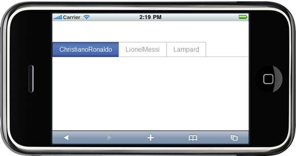

::: {style="DISPLAY: none"}
{#d2h_url_template} {#d2h_package_url style="WIDTH: 0px; DISPLAY: none; HEIGHT: 0px"}
:::

::: {.d2h_secondary_topic style="PADDING-BOTTOM: 10pt; MARGIN: 0pt; PADDING-LEFT: 0pt; PADDING-RIGHT: 0pt; PADDING-TOP: 0pt"}
#### Data-binding {#data-binding style="tab-stops: 0pt"}

The Mobile Tab control for Tools MVC supports data-binding, to populate Tab items so that the columns of a table can be mapped to the Tab properties, such as Text, image URL, Value, Navigate URL, etc.

Properties

+----------------+-----------------------------------------------------+------------------+------------------+-------------+
| Name           | Description                                         | Type of property | Value it accepts | Dependency  |
+================+=====================================================+==================+==================+=============+
| BindDataSource | Allows you to bind the datasource to the Tab items. | IEnumerable      |                  | NA          |
|                |                                                     |                  |                  |             |
|                |                                                     |                  |                  |             |
|                |                                                     |                  |                  |             |
|                |                                                     |                  |                  |             |
+----------------+-----------------------------------------------------+------------------+------------------+-------------+

**[]{style="FONT-FAMILY: 'Calibri','sans-serif'; FONT-SIZE: 12pt"}**  

 

The following steps explain how you can bind the data to the TabItems:

1.   In the controller, pass the datasource through ViewData.

[]{style="FONT-FAMILY: 'Calibri','sans-serif'"} 

+-----------------------------------------------------------------------------------------------------------------------------------------------+
| []{style="FONT-FAMILY: 'Courier New'; BACKGROUND: yellow"}                                                                                    |
|                                                                                                                                               |
| [public]{style="FONT-FAMILY: 'Courier New'; COLOR: blue"} [ [ActionResult]{style="COLOR: #2b91af"} Tab()]{style="FONT-FAMILY: 'Courier New'"} |
|                                                                                                                                               |
| [        {]{style="FONT-FAMILY: 'Courier New'"}                                                                                               |
|                                                                                                                                               |
| [            ViewData.Model = [NavigationDataBuilder]{style="COLOR: #2b91af"}.GetCollection();]{style="FONT-FAMILY: 'Courier New'"}           |
|                                                                                                                                               |
| [            [return]{style="COLOR: blue"} View();]{style="FONT-FAMILY: 'Courier New'"}                                                       |
|                                                                                                                                               |
| [        }]{style="FONT-FAMILY: 'Courier New'"}                                                                                               |
|                                                                                                                                               |
| []{style="FONT-FAMILY: 'Courier New'; BACKGROUND: yellow"}                                                                                    |
+-----------------------------------------------------------------------------------------------------------------------------------------------+

 

 

2.   In **View**, invoke the TabHelper with the Control ID as the first argument and set DataSource for the TabItems using the BindDataSource().

[]{style="FONT-FAMILY: 'Calibri','sans-serif'"} 

+----------------------------------------------------------------------------------------------------------------------------------------------------------------------+
| []{style="FONT-FAMILY: 'Courier New'; BACKGROUND: yellow"}                                                                                                           |
|                                                                                                                                                                      |
| **[\[ASPX\]]{style="FONT-FAMILY: 'Courier New'"}**                                                                                                                   |
|                                                                                                                                                                      |
| []{style="FONT-FAMILY: 'Courier New'; BACKGROUND: yellow"}                                                                                                           |
|                                                                                                                                                                      |
| [\<%]{style="FONT-FAMILY: 'Courier New'; BACKGROUND: yellow"} [Html.MobSyncfusion().Tab([\"tabModel\"]{style="COLOR: #a31515"})]{style="FONT-FAMILY: 'Courier New'"} |
|                                                                                                                                                                      |
| [          .AutoFormat([MobSkins]{style="COLOR: #2b91af"}.BlueLight)]{style="FONT-FAMILY: 'Courier New'"}                                                            |
|                                                                                                                                                                      |
| [              .BindDataSource(Model, (item, data) =\>]{style="FONT-FAMILY: 'Courier New'"}                                                                          |
|                                                                                                                                                                      |
| [              {]{style="FONT-FAMILY: 'Courier New'"}                                                                                                                |
|                                                                                                                                                                      |
| [                  item.Text = data.Text;]{style="FONT-FAMILY: 'Courier New'"}                                                                                       |
|                                                                                                                                                                      |
| [                  item.NavigateUrl = data.NavigateUrl;]{style="FONT-FAMILY: 'Courier New'"}                                                                         |
|                                                                                                                                                                      |
| [              })]{style="FONT-FAMILY: 'Courier New'"}                                                                                                               |
|                                                                                                                                                                      |
| [      .Render();]{style="FONT-FAMILY: 'Courier New'"}                                                                                                               |
|                                                                                                                                                                      |
| [    [%\>]{style="BACKGROUND: yellow"}]{style="FONT-FAMILY: 'Courier New'"}                                                                                          |
|                                                                                                                                                                      |
| []{style="FONT-FAMILY: 'Courier New'; BACKGROUND: yellow"}                                                                                                           |
+----------------------------------------------------------------------------------------------------------------------------------------------------------------------+

 

[]{style="FONT-FAMILY: 'Calibri','sans-serif'"} 

+-----------------------------------------------------------------------------------------------------------------------------------------------------------------------+
| []{style="FONT-FAMILY: 'Courier New'; BACKGROUND: yellow"}                                                                                                            |
|                                                                                                                                                                       |
| **[\[Razor\]]{style="FONT-FAMILY: 'Courier New'"}**                                                                                                                   |
|                                                                                                                                                                       |
| []{style="FONT-FAMILY: 'Courier New'; BACKGROUND: yellow"}                                                                                                            |
|                                                                                                                                                                       |
| [\@{]{style="FONT-FAMILY: 'Courier New'; BACKGROUND: yellow"} [ Html.MobSyncfusion().Tab([\"tabModel\"]{style="COLOR: #a31515"})]{style="FONT-FAMILY: 'Courier New'"} |
|                                                                                                                                                                       |
| [          .TabStyle([TabStyle]{style="COLOR: #2b91af"}.Closed)]{style="FONT-FAMILY: 'Courier New'"}                                                                  |
|                                                                                                                                                                       |
| [              **.BindDataSource(Model, (item, data) =\>**]{style="FONT-FAMILY: 'Courier New'"}                                                                       |
|                                                                                                                                                                       |
| **[              {]{style="FONT-FAMILY: 'Courier New'"}**                                                                                                             |
|                                                                                                                                                                       |
| **[                  item.Text = data.Text;]{style="FONT-FAMILY: 'Courier New'"}**                                                                                    |
|                                                                                                                                                                       |
| **[                  item.NavigateUrl = data.ImageUrl;]{style="FONT-FAMILY: 'Courier New'"}**                                                                         |
|                                                                                                                                                                       |
| **[              })]{style="FONT-FAMILY: 'Courier New'"}**                                                                                                            |
|                                                                                                                                                                       |
| [      .Render();]{style="FONT-FAMILY: 'Courier New'"}                                                                                                                |
|                                                                                                                                                                       |
| [    [}]{style="BACKGROUND: yellow"}]{style="FONT-FAMILY: 'Courier New'"}                                                                                             |
+-----------------------------------------------------------------------------------------------------------------------------------------------------------------------+

 

3.   Build and run the application in emulator.

 

[]{style="FONT-FAMILY: 'Calibri','sans-serif'"} 

[ {border="0"} ]{style="LINE-HEIGHT: 115%; FONT-FAMILY: 'Calibri','sans-serif'; FONT-SIZE: 11pt"}

Figure 158: Tab -- Dtabinding

[]{style="FONT-FAMILY: 'Calibri','sans-serif'; FONT-SIZE: 11pt"} 

[]{style="FONT-FAMILY: 'Calibri','sans-serif'"} 

[]{#related-topics}
:::
