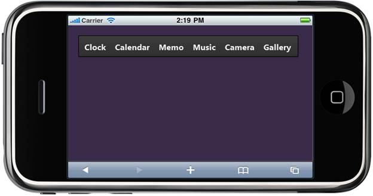

::: {style="DISPLAY: none"}
{#d2h_url_template} {#d2h_package_url style="WIDTH: 0px; DISPLAY: none; HEIGHT: 0px"}
:::

::: {.d2h_secondary_topic style="PADDING-BOTTOM: 10pt; MARGIN: 0pt; PADDING-LEFT: 0pt; PADDING-RIGHT: 0pt; PADDING-TOP: 0pt"}
#### Data Binding {#data-binding style="tab-stops: 0pt"}

The Toolbar provides extensive data binding support to populate Toolbar items so that the columns of a table can be mapped to the Toolbar properties, namely Text, ImageUrl, ImageAttributes, and HtmlAttributes.

The Data Binding feature helps users to plug-in data from a Database to the Toolbar.

 

Properties

The properties of the Data Binding feature in the Toolbar are described in the following tabulation:

 

  ---------------- --------------------------------------------------------------------------------------------- ------------- ---------------- -----------------
  Name             Description                                                                                   Type          Data Type        Reference links
  BindDataSource   Gets or sets the data source, which is used to populate the Toolbar with the Toolbar items.   Server-side   Action Builder   Not applicable
  ---------------- --------------------------------------------------------------------------------------------- ------------- ---------------- -----------------

 

Adding Data Binding to an Application

To customize Data Binding in the Toolbar:

1.   In the **Controller**, pass the data to the **View** page.

 

+-----------------------------------------------------------------------------------------------------------------------------------------------------------------------------+
| [      **\[Controller\]**]{style="FONT-FAMILY: 'Courier New'"}                                                                                                              |
|                                                                                                                                                                             |
| [        [public]{style="COLOR: blue"}[ActionResult]{style="COLOR: #2b91af"} Databinding()]{style="FONT-FAMILY: 'Courier New'"}                                             |
|                                                                                                                                                                             |
| [        {]{style="FONT-FAMILY: 'Courier New'"}                                                                                                                             |
|                                                                                                                                                                             |
| [            [DBModel]{style="COLOR: #2b91af"} model = [new]{style="COLOR: blue"}[DBModel]{style="COLOR: #2b91af"}();]{style="FONT-FAMILY: 'Courier New'"}                  |
|                                                                                                                                                                             |
| [            model.BindDataList = [new]{style="COLOR: blue"}[List]{style="COLOR: #2b91af"}\<[BindItemData]{style="COLOR: #2b91af"}\>()]{style="FONT-FAMILY: 'Courier New'"} |
|                                                                                                                                                                             |
| [            {]{style="FONT-FAMILY: 'Courier New'"}                                                                                                                         |
|                                                                                                                                                                             |
| [                [new]{style="COLOR: blue"}[BindItemData]{style="COLOR: #2b91af"}(){ Text=[\"Clock\"]{style="COLOR: #a31515"} },]{style="FONT-FAMILY: 'Courier New'"}       |
|                                                                                                                                                                             |
| [                [new]{style="COLOR: blue"}[BindItemData]{style="COLOR: #2b91af"}(){ Text=[\"Calendar\"]{style="COLOR: #a31515"} },]{style="FONT-FAMILY: 'Courier New'"}    |
|                                                                                                                                                                             |
| [                [new]{style="COLOR: blue"}[BindItemData]{style="COLOR: #2b91af"}(){ Text=[\"Memo\"]{style="COLOR: #a31515"} },]{style="FONT-FAMILY: 'Courier New'"}        |
|                                                                                                                                                                             |
| [                [new]{style="COLOR: blue"}[BindItemData]{style="COLOR: #2b91af"}(){ Text=[\"Music\"]{style="COLOR: #a31515"} },]{style="FONT-FAMILY: 'Courier New'"}       |
|                                                                                                                                                                             |
| [                [new]{style="COLOR: blue"}[BindItemData]{style="COLOR: #2b91af"}(){ Text=[\"Camera\"]{style="COLOR: #a31515"} },]{style="FONT-FAMILY: 'Courier New'"}      |
|                                                                                                                                                                             |
| [                [new]{style="COLOR: blue"}[BindItemData]{style="COLOR: #2b91af"}(){ Text=[\"Gallery\"]{style="COLOR: #a31515"} },]{style="FONT-FAMILY: 'Courier New'"}     |
|                                                                                                                                                                             |
| [                [new]{style="COLOR: blue"}[BindItemData]{style="COLOR: #2b91af"}(){ Text=[\"FM radio\"]{style="COLOR: #a31515"} }]{style="FONT-FAMILY: 'Courier New'"}     |
|                                                                                                                                                                             |
| [            };]{style="FONT-FAMILY: 'Courier New'"}                                                                                                                        |
|                                                                                                                                                                             |
| [            ViewData\[[\"DataModel\"]{style="COLOR: #a31515"}\] = model.BindDataList;]{style="FONT-FAMILY: 'Courier New'"}                                                 |
|                                                                                                                                                                             |
| [            [return]{style="COLOR: blue"} View();]{style="FONT-FAMILY: 'Courier New'"}                                                                                     |
|                                                                                                                                                                             |
| [        }]{style="FONT-FAMILY: 'Courier New'"}                                                                                                                             |
+-----------------------------------------------------------------------------------------------------------------------------------------------------------------------------+

[2.   Create a ]{style="COLOR: black"} [Strongly Typed View]{.UGHyperlink} [. ]{style="COLOR: black"}

[3.   In the **View**, invoke the **Toolbar** helper with the control ID.]{style="COLOR: black"}

[4.   Set the data source and mapping fields in **BindDataSource** method.]{style="COLOR: black"}

 

+---------------------------------------------------------------------------------------------------------------------------------------------------------------------------------------------------------------------------------------------------------+
| **[\[ASPX\]]{style="FONT-FAMILY: 'Courier New'"}**                                                                                                                                                                                                      |
|                                                                                                                                                                                                                                                         |
| [\<%]{style="FONT-FAMILY: 'Courier New'; BACKGROUND: yellow"} [=]{style="FONT-FAMILY: 'Courier New'; COLOR: blue"} [Html.MobSyncfusion().Toolbar([\"DataBindToolbar\"]{style="COLOR: #a31515"})]{style="FONT-FAMILY: 'Courier New'"}                    |
|                                                                                                                                                                                                                                                         |
| [   .Width(430)]{style="FONT-FAMILY: 'Courier New'"}                                                                                                                                                                                                    |
|                                                                                                                                                                                                                                                         |
| [   .AutoFormat([MobSkins]{style="COLOR: #2b91af"}.DarkNight)]{style="FONT-FAMILY: 'Courier New'"}                                                                                                                                                      |
|                                                                                                                                                                                                                                                         |
| [   .ShowAnimation([MobAnimations]{style="COLOR: #2b91af"}.Slide)]{style="FONT-FAMILY: 'Courier New'"}                                                                                                                                                  |
|                                                                                                                                                                                                                                                         |
| [.BindDataSource\<[BindItemData]{style="COLOR: #2b91af"}\>(([IEnumerable]{style="COLOR: #2b91af"}\<[BindItemData]{style="COLOR: #2b91af"}\>) ViewData\[[\"DataModel\"]{style="COLOR: #a31515"}\], (item, data) =\>]{style="FONT-FAMILY: 'Courier New'"} |
|                                                                                                                                                                                                                                                         |
| [      {]{style="FONT-FAMILY: 'Courier New'"}                                                                                                                                                                                                           |
|                                                                                                                                                                                                                                                         |
| [        item.Text = data.Text;]{style="FONT-FAMILY: 'Courier New'"}                                                                                                                                                                                    |
|                                                                                                                                                                                                                                                         |
| [      })[%\>]{style="BACKGROUND: yellow"}]{style="FONT-FAMILY: 'Courier New'"}                                                                                                                                                                         |
+---------------------------------------------------------------------------------------------------------------------------------------------------------------------------------------------------------------------------------------------------------+

[]{style="BACKGROUND: yellow"} 

+------------------------------------------------------------------------------------------------------------------------------------------------------------------------------------------------------------------------------------------------------------+
| **[\[Razor\]]{style="FONT-FAMILY: 'Courier New'"}**                                                                                                                                                                                                        |
|                                                                                                                                                                                                                                                            |
| [ [\@{]{style="BACKGROUND: yellow"}]{style="FONT-FAMILY: 'Courier New'"}                                                                                                                                                                                   |
|                                                                                                                                                                                                                                                            |
| [   Html.MobSyncfusion().Toolbar([\"DataBindToolbar\"]{style="COLOR: #a31515"})]{style="FONT-FAMILY: 'Courier New'"}                                                                                                                                       |
|                                                                                                                                                                                                                                                            |
| [   .AutoFormat([MobSkins]{style="COLOR: #2b91af"}.DarkNight)]{style="FONT-FAMILY: 'Courier New'"}                                                                                                                                                         |
|                                                                                                                                                                                                                                                            |
| [   .ShowAnimation([MobAnimations]{style="COLOR: #2b91af"}.Slide)]{style="FONT-FAMILY: 'Courier New'"}                                                                                                                                                     |
|                                                                                                                                                                                                                                                            |
| [   .BindDataSource\<[BindItemData]{style="COLOR: #2b91af"}\>(([IEnumerable]{style="COLOR: #2b91af"}\<[BindItemData]{style="COLOR: #2b91af"}\>) ViewData\[[\"DataModel\"]{style="COLOR: #a31515"}\], (item, data) =\>]{style="FONT-FAMILY: 'Courier New'"} |
|                                                                                                                                                                                                                                                            |
| [    {]{style="FONT-FAMILY: 'Courier New'"}                                                                                                                                                                                                                |
|                                                                                                                                                                                                                                                            |
| [      item.Text = data.Text;]{style="FONT-FAMILY: 'Courier New'"}                                                                                                                                                                                         |
|                                                                                                                                                                                                                                                            |
| [    })]{style="FONT-FAMILY: 'Courier New'"}                                                                                                                                                                                                               |
|                                                                                                                                                                                                                                                            |
| [   .Render();[}]{style="BACKGROUND: yellow"}]{style="FONT-FAMILY: 'Courier New'"} []{style="FONT-FAMILY: 'Courier New'; BACKGROUND: yellow"}                                                                                                              |
+------------------------------------------------------------------------------------------------------------------------------------------------------------------------------------------------------------------------------------------------------------+

[]{style="BACKGROUND: yellow"} 

[]{style="BACKGROUND: yellow"} 

5.   Build and run the application.

 

{border="0"}

 

Figure 174: Toolbar - Data Binding

 

[]{#related-topics}
:::
