::: {style="DISPLAY: none"}
{#d2h_url_template}{#d2h_package_url style="WIDTH: 0px; DISPLAY: none; HEIGHT: 0px"}
:::

::::: {#nsbanner .d2h_main_nsbanner style="BORDER-BOTTOM: #999999 1px solid; POSITION: relative; PADDING-BOTTOM: 0px; BACKGROUND-COLOR: transparent; PADDING-LEFT: 0px; PADDING-RIGHT: 0px; DISPLAY: none; BORDER-TOP: #999999 1px solid; PADDING-TOP: 0px; LEFT: 0px"}
:::: {#TitleRow .d2h_main_titlerow style="PADDING-BOTTOM: 4px; BACKGROUND-COLOR: transparent; PADDING-LEFT: 22px; WIDTH: 100%; PADDING-RIGHT: 10px; DISPLAY: none; PADDING-TOP: 4px"}
::: {#ienav .d2h_main_ienav style="DISPLAY: none"}
{#D2HPrevious .D2HPreviousEnabled}  {#D2HNext .D2HNextEnabled}
:::
::::
:::::

:::: {#nstext .d2h_main_nstext style="PADDING-BOTTOM: 10px; BACKGROUND-COLOR: transparent; PADDING-LEFT: 22px; PADDING-RIGHT: 10px; HEIGHT: 100%; OVERFLOW: auto; PADDING-TOP: 5px" hasuserbackground="true" valign="bottom"}
::: {#d2h_breadcrumbs .d2h_breadcrumbs}
[Essential Studio User Guide Documentation](ms-xhelp:///?Id=12457748-09e3-4d74-a240-8e049cedf030){.d2h_breadcrumbsNormal}[ \> ]{.d2h_breadcrumbsLinkSeparator}[User Interface Edition](ms-xhelp:///?Id=c29296b7-531c-413b-a0ec-488ca1f7f669){.d2h_breadcrumbsNormal}[ \> ]{.d2h_breadcrumbsLinkSeparator}[Essential Windows](ms-xhelp:///?Id=e60759d8-47a4-4570-9d7a-16a68d63f2ea){.d2h_breadcrumbsNormal}[ \> ]{.d2h_breadcrumbsLinkSeparator}[Essential Chart]{.d2h_breadcrumbsContentsOnly}[ \> ]{.d2h_breadcrumbsLinkSeparator}[Concepts and Features](ms-xhelp:///?Id=71321e9c-336c-4c1c-a127-be9f135ad4bb){.d2h_breadcrumbsNormal}[ \> ]{.d2h_breadcrumbsLinkSeparator}[Chart Data](ms-xhelp:///?Id=419e4d4d-9b27-4bd7-b74d-dbc80d98fca5){.d2h_breadcrumbsNormal}
:::

### Data Binding in Chart Through Chart Wizard {#data-binding-in-chart-through-chart-wizard style="tab-stops: 0pt"}

 

You can easily implement data binding technique at design-time, using Chart Wizard.

 

The below steps lets you bind a database table with the ChartControl.

 

1.   Open the **Chart Wizard** tool, Click **Series** button and go to the **Data Source** tab as shown in the image below.

 

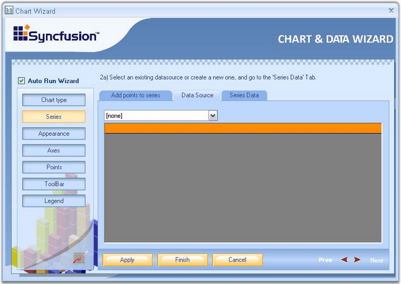{border="0"}

 

Figure 28: Data Source Tab

 

2.   First step is to select the chart data source from the drop-down list. All data sources available with the form will be shown in the list. If there is no data source in the list, click the **new BindingSource** option from the drop-down list.

 

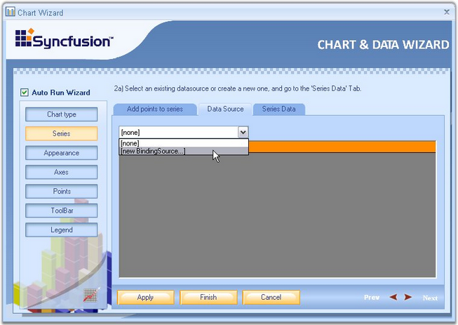{border="0"}

**** 

Figure 29: Selecting \"new BindingSource\....\" from the drop-down list in the Data Source Tab

**** 

3.   This opens a **Data Source Configuration Wizard**. Choose the Data source Type as **Database**, and click **Next**.

 

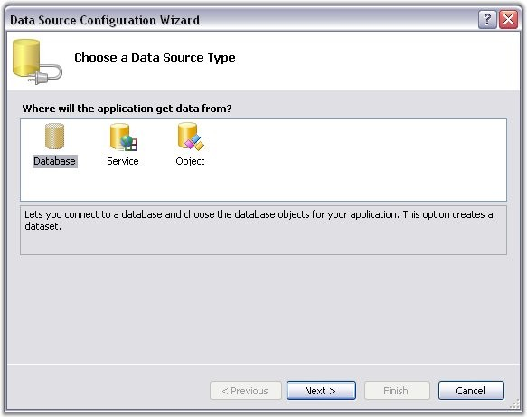{border="0"}

**** 

Figure 30: Selecting the Data Source Type

 

4.   Then click **New Connection**.

 

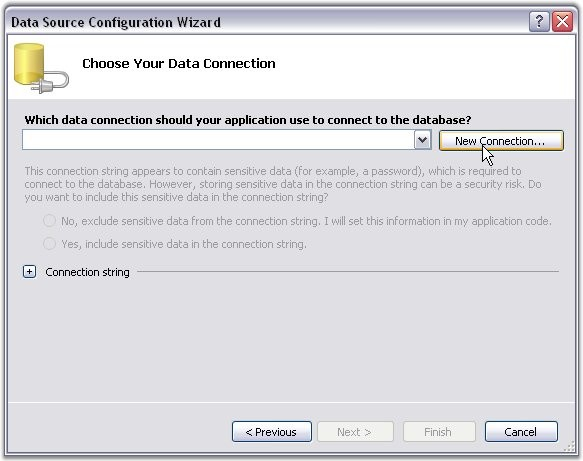{border="0"}

**** 

Figure 31: Creating a New Connection

 

5.   In the Choose Data Source dialog box, select the data source as MS SQL server database or MS Access database, and then click Continue button.

 

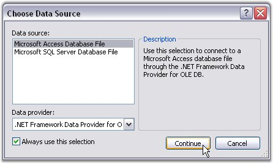{border="0"}

**** 

Figure 32: Choose Data Source Dialog Box

 

6.   This opens the **Add Connection** dialog box. Click the **Browse** button and select the database file from any location. Click **OK** to make this connection available to the Data source Configuration Wizard.

 

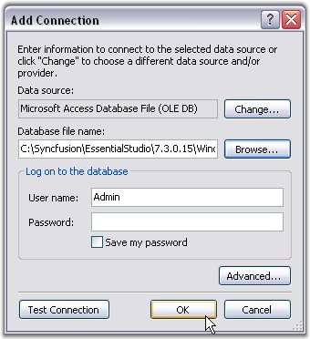{border="0"}

**** 

Figure 33: Selecting the Database file by clicking on the Browse Button in the Add Connection Dialog Box

 

7.   You will be directed to the Data Source Configuration Wizard after completing the above steps. Click **Next**.

 

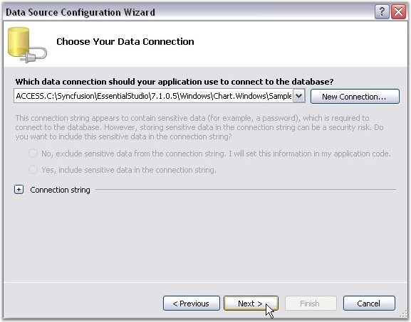{border="0"}

**** 

Figure 34: Next button in the Data Source Configuration Wizard is Clicked

 

8.   Tables and Views that are available in the selected database will be listed in the Wizard. Select the appropriate table, required columns and then click **Finish**.

 

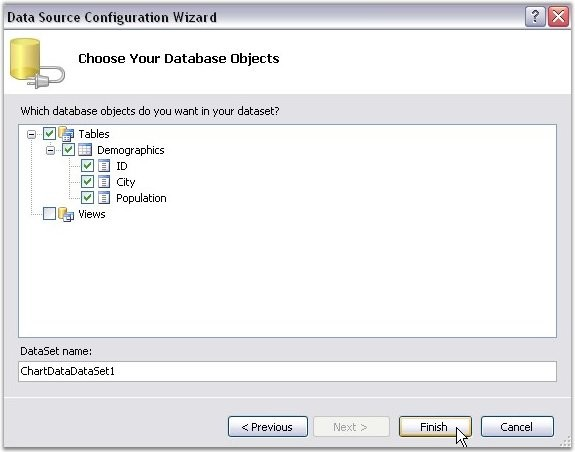{border="0"}

**** 

Figure 35: Finish button in the Data Source Configuration Wizard is clicked after selecting the required Table and Columns

 

9.   You will be directed back to the Chart Wizard now. Select the database from the **Data Source** list as shown in the image below.

 

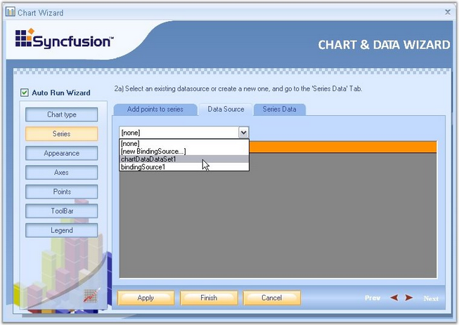{border="0"}

**** 

Figure 36: Selecting the Database from the drop-down List in the Data Source Tab

 

10.  Once the source is selected, the selected table will be visible as in the below image.

 

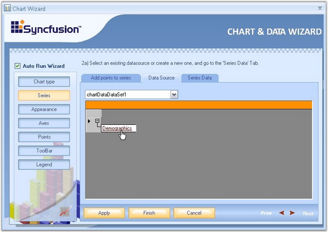{border="0"}

**** 

Figure 37: Selected Table

 

Binding the Table Data with Chart Series

 

1.   Click the \'Series Data\' option in the wizard to select the series to which the data is to be bound. In \'Series Data\' page, select the series using the **Series Data** box.

 

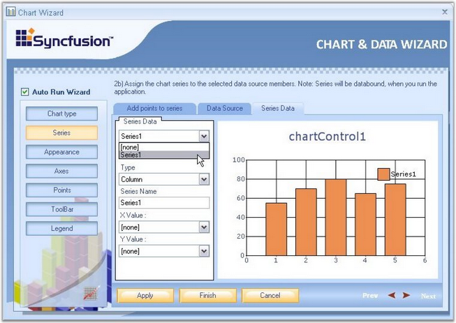{border="0"}

**** 

Figure 38: Selecting the Series to which the data is to be Bound

 

2.   To assign the retrieved database column to X and Y values of the series, use **X Value** box and **Y Value** box as shown in the below screen shots.

 

{border="0"}

**** 

Figure 39: Assigning the retrieved database column to X value of the Series

**** 

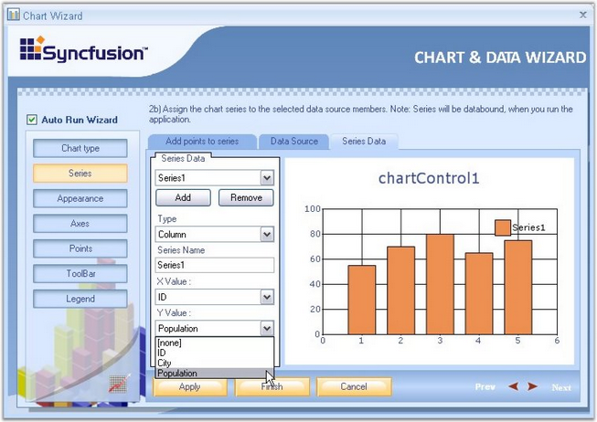{border="0"}

 

Figure 40: Assigning the retrieved database column to Y value of the Series

 

3.   Click **Finish** to apply these data binding settings to the Chart. The below image illustrates the Chart bound with custom data.

 

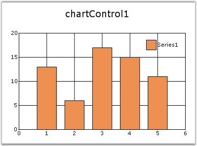{border="0"}

 

Figure 41: Data Source bound to the Chart by using the Chart Wizard

 

[]{#p25} 

 

[]{#related-topics}
::::
