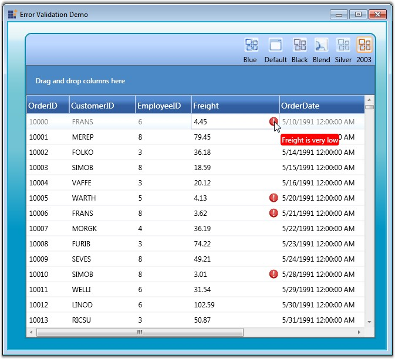

::: {style="DISPLAY: none"}
{#d2h_url_template}{#d2h_package_url style="WIDTH: 0px; DISPLAY: none; HEIGHT: 0px"}
:::

::: {.d2h_secondary_topic style="PADDING-BOTTOM: 10pt; MARGIN: 0pt; PADDING-LEFT: 0pt; PADDING-RIGHT: 0pt; PADDING-TOP: 0pt"}
#### Data Error Validation {#data-error-validation style="tab-stops: 0pt"}

Essential Grid now provides support to validate the grid data and display error information. This is achieved by subscribing to the IDataErrorInfo, an interface that provides the functionality to display custom error information in any control.

 

To validate data errors, follow the steps below:

 

1.   Ensure that your data source implements the IDataErrorInfo interface, in which two of the properties, Error (which we can be left empty optionally) and Indexer (where the validation code is placed) must be defined.

 

2.   Then display the error information by setting the ShowErrorToolTips property of the GridData control to *true*.

[]{style="COLOR: #15428b"} 

+-------------------------------------------------------------------------------------------------+
| [\[C#\]]{style="FONT-FAMILY: 'Courier New'; COLOR: black"}                                      |
|                                                                                                 |
| []{style="FONT-FAMILY: 'Courier New'; COLOR: black"}                                            |
|                                                                                                 |
| [dataGrid.ShowErrorTooltips = [true]{style="COLOR: blue"};]{style="FONT-FAMILY: 'Courier New'"} |
+-------------------------------------------------------------------------------------------------+

 

The following code example illustrates how the GridData control throws an error message when the Freight value becomes lesser than 10.

 

+-------------------------------------------------------------------------------------------------------------------------------------------------------------------------------------------------------+
| [\[C#\]]{style="FONT-FAMILY: 'Courier New'; COLOR: black"}                                                                                                                                            |
|                                                                                                                                                                                                       |
| []{style="FONT-FAMILY: 'Courier New'; COLOR: black"}                                                                                                                                                  |
|                                                                                                                                                                                                       |
| [partial]{style="FONT-FAMILY: 'Courier New'; COLOR: blue"}[ [class]{style="COLOR: blue"} [Orders]{style="COLOR: #2b91af"} : IDataErrorInfo]{style="FONT-FAMILY: 'Courier New'"}                       |
|                                                                                                                                                                                                       |
| [{]{style="FONT-FAMILY: 'Courier New'"}                                                                                                                                                               |
|                                                                                                                                                                                                       |
| [public]{style="FONT-FAMILY: 'Courier New'; COLOR: blue"}[ [string]{style="COLOR: blue"} Error]{style="FONT-FAMILY: 'Courier New'"}                                                                   |
|                                                                                                                                                                                                       |
| [{]{style="FONT-FAMILY: 'Courier New'"}                                                                                                                                                               |
|                                                                                                                                                                                                       |
| [get]{style="FONT-FAMILY: 'Courier New'; COLOR: blue"}                                                                                                                                                |
|                                                                                                                                                                                                       |
| [{ ]{style="FONT-FAMILY: 'Courier New'"}                                                                                                                                                              |
|                                                                                                                                                                                                       |
| [throw]{style="FONT-FAMILY: 'Courier New'; COLOR: blue"}[ [new]{style="COLOR: blue"} [NotImplementedException]{style="COLOR: #2b91af"}();]{style="FONT-FAMILY: 'Courier New'"}                        |
|                                                                                                                                                                                                       |
| [}]{style="FONT-FAMILY: 'Courier New'"}                                                                                                                                                               |
|                                                                                                                                                                                                       |
| [}]{style="FONT-FAMILY: 'Courier New'"}                                                                                                                                                               |
|                                                                                                                                                                                                       |
| []{style="FONT-FAMILY: 'Courier New'"}                                                                                                                                                                |
|                                                                                                                                                                                                       |
| [public]{style="FONT-FAMILY: 'Courier New'; COLOR: blue"}[ [string]{style="COLOR: blue"} [this]{style="COLOR: blue"}\[[string]{style="COLOR: blue"} columnName\]]{style="FONT-FAMILY: 'Courier New'"} |
|                                                                                                                                                                                                       |
| [{]{style="FONT-FAMILY: 'Courier New'"}                                                                                                                                                               |
|                                                                                                                                                                                                       |
| [get]{style="FONT-FAMILY: 'Courier New'; COLOR: blue"}                                                                                                                                                |
|                                                                                                                                                                                                       |
| [{]{style="FONT-FAMILY: 'Courier New'"}                                                                                                                                                               |
|                                                                                                                                                                                                       |
| [var]{style="FONT-FAMILY: 'Courier New'; COLOR: blue"}[ result = [string]{style="COLOR: blue"}.Empty;]{style="FONT-FAMILY: 'Courier New'"}                                                            |
|                                                                                                                                                                                                       |
| [if]{style="FONT-FAMILY: 'Courier New'; COLOR: blue"}[ (columnName == [\"Freight\"]{style="COLOR: #a31515"})]{style="FONT-FAMILY: 'Courier New'"}                                                     |
|                                                                                                                                                                                                       |
| [{]{style="FONT-FAMILY: 'Courier New'"}                                                                                                                                                               |
|                                                                                                                                                                                                       |
| [if]{style="FONT-FAMILY: 'Courier New'; COLOR: blue"}[ ([this]{style="COLOR: blue"}.Freight.Value \< 10)]{style="FONT-FAMILY: 'Courier New'"}                                                         |
|                                                                                                                                                                                                       |
| [{]{style="FONT-FAMILY: 'Courier New'"}                                                                                                                                                               |
|                                                                                                                                                                                                       |
| [result = [\"Freight is very low\"]{style="COLOR: #a31515"};]{style="FONT-FAMILY: 'Courier New'"}                                                                                                     |
|                                                                                                                                                                                                       |
| [}]{style="FONT-FAMILY: 'Courier New'"}                                                                                                                                                               |
|                                                                                                                                                                                                       |
| [}]{style="FONT-FAMILY: 'Courier New'"}                                                                                                                                                               |
|                                                                                                                                                                                                       |
| [return]{style="FONT-FAMILY: 'Courier New'; COLOR: blue"}[ result;]{style="FONT-FAMILY: 'Courier New'"}                                                                                               |
|                                                                                                                                                                                                       |
| [}]{style="FONT-FAMILY: 'Courier New'"}                                                                                                                                                               |
|                                                                                                                                                                                                       |
| [}]{style="FONT-FAMILY: 'Courier New'"}                                                                                                                                                               |
|                                                                                                                                                                                                       |
| [}]{style="FONT-FAMILY: 'Courier New'"}                                                                                                                                                               |
+-------------------------------------------------------------------------------------------------------------------------------------------------------------------------------------------------------+

 

The following screen shot illustrates Data Error Validation in the GridData control.

 

{border="0"}

Figure 151: Data Errors generated in the GridData control

 

[]{#p265} 

 

[]{#related-topics}
:::
