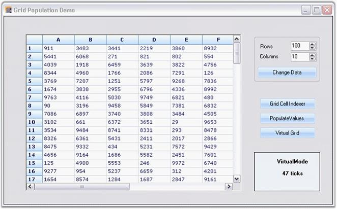

::: {style="DISPLAY: none"}
{#d2h_url_template}{#d2h_package_url style="WIDTH: 0px; DISPLAY: none; HEIGHT: 0px"}
:::

::: {.d2h_secondary_topic style="PADDING-BOTTOM: 10pt; MARGIN: 0pt; PADDING-LEFT: 0pt; PADDING-RIGHT: 0pt; PADDING-TOP: 0pt"}
##### Data Handling {#data-handling style="tab-stops: 0pt"}

[]{style="FONT-FAMILY: 'Trebuchet MS','sans-serif'; COLOR: #15428b; FONT-SIZE: 9pt"} 

Essential Grid control supports large amount of data without a performance hit.

[]{style="FONT-FAMILY: 'Trebuchet MS','sans-serif'; COLOR: #15428b; FONT-SIZE: 9pt"} 

Example:

[]{style="FONT-FAMILY: 'Trebuchet MS','sans-serif'; COLOR: #15428b; FONT-SIZE: 9pt"} 

This example will step you through following three ways of populating an Essential Grid:

[]{style="FONT-FAMILY: 'Trebuchet MS','sans-serif'; COLOR: #15428b; FONT-SIZE: 9pt"} 

[·      ]{style="FONT-FAMILY: Symbol"}The first technique just loops through the cells and uses an indexer on the Grid control to set the values.

[·      ]{style="FONT-FAMILY: Symbol"}The second uses the PopulateValues method that optimally places data from a data source into a grid range.

[·      ]{style="FONT-FAMILY: Symbol"}The third technique uses an Essential Grid in a virtual manner.

[]{style="FONT-FAMILY: 'Trebuchet MS','sans-serif'; COLOR: #15428b; FONT-SIZE: 9pt"} 

You can specify the size of the grid that is to be populated while running the sample and then you can try all the three methods to compare the performance. However, the .NET Framework JIT slows the first population owing to one-time jitting of the code.

[]{style="FONT-FAMILY: 'Trebuchet MS','sans-serif'; COLOR: #15428b; FONT-SIZE: 9pt"} 

1.   **Using Indexer**

 

This technique loops through the cells and uses an indexer on the Grid control to set the values.

[]{style="FONT-FAMILY: 'Trebuchet MS','sans-serif'; COLOR: #15428b; FONT-SIZE: 9pt"} 

a.   Using C#

[]{style="FONT-FAMILY: 'Trebuchet MS','sans-serif'; COLOR: #15428b; FONT-SIZE: 9pt"} 

+-------------------------------------------------------------------------------------------------------------------------------------------------------------------------------------+
| **[\[C#\]]{style="FONT-FAMILY: 'Courier New'; COLOR: black"}**                                                                                                                      |
|                                                                                                                                                                                     |
| []{style="FONT-FAMILY: 'Courier New'; COLOR: black"}                                                                                                                                |
|                                                                                                                                                                                     |
| [for]{style="FONT-FAMILY: 'Courier New'; COLOR: blue"}[ ([int]{style="COLOR: blue"} i = 0; i \< [this]{style="COLOR: blue"}.numArrayRows; ++i)]{style="FONT-FAMILY: 'Courier New'"} |
|                                                                                                                                                                                     |
| [    [for]{style="COLOR: blue"} ([int]{style="COLOR: blue"} j = 0; j \< [this]{style="COLOR: blue"}.numArrayCols; ++j)]{style="FONT-FAMILY: 'Courier New'"}                         |
|                                                                                                                                                                                     |
| [        [this]{style="COLOR: blue"}.gridControl1\[i + 1, j + 1\].CellValue = [this]{style="COLOR: blue"}.intArray\[i, j\]; ]{style="FONT-FAMILY: 'Courier New'"}                   |
+-------------------------------------------------------------------------------------------------------------------------------------------------------------------------------------+

[]{style="FONT-FAMILY: 'Trebuchet MS','sans-serif'; COLOR: #15428b; FONT-SIZE: 9pt"} 

b.   Using VB.NET

[]{style="FONT-FAMILY: 'Trebuchet MS','sans-serif'; COLOR: #15428b; FONT-SIZE: 9pt"} 

+----------------------------------------------------------------------------------------------------------------------------------------------------------------------------------------------------------------------------------+
| **[\[VB.NET\]]{style="FONT-FAMILY: 'Courier New'; COLOR: black"}**                                                                                                                                                               |
|                                                                                                                                                                                                                                  |
| []{style="FONT-FAMILY: 'Courier New'; COLOR: black"}                                                                                                                                                                             |
|                                                                                                                                                                                                                                  |
| [For]{style="FONT-FAMILY: 'Courier New'; COLOR: blue"}[ i [As]{style="COLOR: blue"} [Integer]{style="COLOR: blue"} = 0 [To]{style="COLOR: blue"} [Me]{style="COLOR: blue"}.numArrayRows - 1]{style="FONT-FAMILY: 'Courier New'"} |
|                                                                                                                                                                                                                                  |
| [For]{style="FONT-FAMILY: 'Courier New'; COLOR: blue"}[ j [As]{style="COLOR: blue"} [Integer]{style="COLOR: blue"} = 0 [To]{style="COLOR: blue"} [Me]{style="COLOR: blue"}.numArrayCols - 1]{style="FONT-FAMILY: 'Courier New'"} |
|                                                                                                                                                                                                                                  |
| [Me]{style="FONT-FAMILY: 'Courier New'; COLOR: blue"}[.gridControl1(i + 1, j + 1).CellValue = [Me]{style="COLOR: blue"}.intArray(i, j)]{style="FONT-FAMILY: 'Courier New'"}                                                      |
|                                                                                                                                                                                                                                  |
| [Next]{style="FONT-FAMILY: 'Courier New'; COLOR: blue"}[ j]{style="FONT-FAMILY: 'Courier New'"}                                                                                                                                  |
|                                                                                                                                                                                                                                  |
| [Next]{style="FONT-FAMILY: 'Courier New'; COLOR: blue"}[ i]{style="FONT-FAMILY: 'Courier New'"}                                                                                                                                  |
+----------------------------------------------------------------------------------------------------------------------------------------------------------------------------------------------------------------------------------+

[]{style="FONT-FAMILY: 'Trebuchet MS','sans-serif'; COLOR: #15428b; FONT-SIZE: 9pt"} 

2.   **Populating Values**

 

PopulateValues method is used to move values from a given data source into the specified grid range. The first parameter specifies range of destination cells where the data is to be copied and the second parameter specifies the data source to the destination cells.

[]{style="FONT-FAMILY: 'Trebuchet MS','sans-serif'; COLOR: #15428b; FONT-SIZE: 9pt"} 

a.   Using C#

[]{style="FONT-FAMILY: 'Trebuchet MS','sans-serif'; COLOR: #15428b; FONT-SIZE: 9pt"} 

+-----------------------------------------------------------------------------------------------------------------------------------------------------------------------------------------+
| **[\[C#\]]{style="FONT-FAMILY: 'Courier New'; COLOR: black"}**                                                                                                                          |
|                                                                                                                                                                                         |
| []{style="FONT-FAMILY: 'Courier New'; COLOR: black"}                                                                                                                                    |
|                                                                                                                                                                                         |
| [gridControl1.Model.PopulateValues([GridRangeInfo]{style="COLOR: #2b91af"}.Cells(top, left, bottom, right), [this]{style="COLOR: blue"}.intArray);]{style="FONT-FAMILY: 'Courier New'"} |
+-----------------------------------------------------------------------------------------------------------------------------------------------------------------------------------------+

[]{style="FONT-FAMILY: 'Trebuchet MS','sans-serif'; COLOR: #15428b; FONT-SIZE: 9pt"} 

b.   Using VB.NET

[]{style="FONT-FAMILY: 'Trebuchet MS','sans-serif'; COLOR: #15428b; FONT-SIZE: 9pt"} 

+-------------------------------------------------------------------------------------------------------------------------------------------------------------+
| **[\[VB.NET\]]{style="FONT-FAMILY: 'Courier New'; COLOR: black"}**                                                                                          |
|                                                                                                                                                             |
| []{style="FONT-FAMILY: 'Courier New'; COLOR: black"}                                                                                                        |
|                                                                                                                                                             |
| [gridControl1.Model.PopulateValues(GridRangeInfo .Cells(top, left, bottom, right), [Me]{style="COLOR: blue"}.intArray)]{style="FONT-FAMILY: 'Courier New'"} |
+-------------------------------------------------------------------------------------------------------------------------------------------------------------+

[]{style="FONT-FAMILY: 'Trebuchet MS','sans-serif'; COLOR: #15428b; FONT-SIZE: 9pt"} 

3.   **Implementing Virtual Mode**

[]{style="FONT-FAMILY: 'Trebuchet MS','sans-serif'; COLOR: #15428b; FONT-SIZE: 9pt"} 

Three events need to be handled in order to implement a virtual mode. They perform the following actions:

[]{style="FONT-FAMILY: 'Trebuchet MS','sans-serif'; COLOR: #15428b; FONT-SIZE: 9pt"} 

[·      ]{style="FONT-FAMILY: Symbol"}Determine number of rows

[·      ]{style="FONT-FAMILY: Symbol"}Determine number of columns

[·      ]{style="FONT-FAMILY: Symbol"}Pass value to a cell from a data source.

[]{style="FONT-FAMILY: 'Trebuchet MS','sans-serif'; COLOR: #15428b; FONT-SIZE: 9pt"} 

a.   Using C#

[]{style="FONT-FAMILY: 'Trebuchet MS','sans-serif'; COLOR: #15428b; FONT-SIZE: 9pt"} 

+----------------------------------------------------------------------------------------------------------------------------------------------------------------------------------------------------------------------------------------------+
| **[\[C#\]]{style="FONT-FAMILY: 'Courier New'; COLOR: black"}**                                                                                                                                                                               |
|                                                                                                                                                                                                                                              |
| []{style="FONT-FAMILY: 'Courier New'; COLOR: black"}                                                                                                                                                                                         |
|                                                                                                                                                                                                                                              |
| [// Determine number of rows.      ]{style="FONT-FAMILY: 'Courier New'; COLOR: green"}                                                                                                                                                       |
|                                                                                                                                                                                                                                              |
| [this]{style="FONT-FAMILY: 'Courier New'; COLOR: blue"}[.gridControl1.QueryRowCount += [new]{style="COLOR: blue"} [GridRowColCountEventHandler]{style="COLOR: #2b91af"}(GridQueryRowCount); ]{style="FONT-FAMILY: 'Courier New'"}            |
|                                                                                                                                                                                                                                              |
| [private]{style="FONT-FAMILY: 'Courier New'; COLOR: blue"}[ [void]{style="COLOR: blue"} GridQueryRowCount([object]{style="COLOR: blue"} sender, [GridRowColCountEventArgs]{style="COLOR: #2b91af"} e)]{style="FONT-FAMILY: 'Courier New'"}   |
|                                                                                                                                                                                                                                              |
| [{ ]{style="FONT-FAMILY: 'Courier New'"}                                                                                                                                                                                                     |
|                                                                                                                                                                                                                                              |
| [    e.Count = [this]{style="COLOR: blue"}.numArrayRows;]{style="FONT-FAMILY: 'Courier New'"}                                                                                                                                                |
|                                                                                                                                                                                                                                              |
| [    e.Handled = [true]{style="COLOR: blue"};]{style="FONT-FAMILY: 'Courier New'"}                                                                                                                                                           |
|                                                                                                                                                                                                                                              |
| [}  ]{style="FONT-FAMILY: 'Courier New'"}                                                                                                                                                                                                    |
|                                                                                                                                                                                                                                              |
| []{style="FONT-FAMILY: 'Courier New'"}                                                                                                                                                                                                       |
|                                                                                                                                                                                                                                              |
| [// Determine the number of columns.]{style="FONT-FAMILY: 'Courier New'; COLOR: green"}                                                                                                                                                      |
|                                                                                                                                                                                                                                              |
| [this]{style="FONT-FAMILY: 'Courier New'; COLOR: blue"}[.gridControl1.QueryColCount += [new]{style="COLOR: blue"} GridRowColCountEventHandler(GridQueryColCount);       ]{style="FONT-FAMILY: 'Courier New'"}                                |
|                                                                                                                                                                                                                                              |
| [private]{style="FONT-FAMILY: 'Courier New'; COLOR: blue"}[ [void]{style="COLOR: blue"} GridQueryColCount([object]{style="COLOR: blue"} sender, [GridRowColCountEventArgs]{style="COLOR: #2b91af"} e)]{style="FONT-FAMILY: 'Courier New'"}   |
|                                                                                                                                                                                                                                              |
| [{]{style="FONT-FAMILY: 'Courier New'"}                                                                                                                                                                                                      |
|                                                                                                                                                                                                                                              |
| [    e.Count = [this]{style="COLOR: blue"}.numArrayCols;]{style="FONT-FAMILY: 'Courier New'"}                                                                                                                                                |
|                                                                                                                                                                                                                                              |
| [    e.Handled = [true]{style="COLOR: blue"};]{style="FONT-FAMILY: 'Courier New'"}                                                                                                                                                           |
|                                                                                                                                                                                                                                              |
| [}]{style="FONT-FAMILY: 'Courier New'"}                                                                                                                                                                                                      |
|                                                                                                                                                                                                                                              |
| []{style="FONT-FAMILY: 'Courier New'"}                                                                                                                                                                                                       |
|                                                                                                                                                                                                                                              |
| [// Pass value to a cell from a given data source.]{style="FONT-FAMILY: 'Courier New'; COLOR: green"}                                                                                                                                        |
|                                                                                                                                                                                                                                              |
| [this]{style="FONT-FAMILY: 'Courier New'; COLOR: blue"}[.gridControl1.QueryCellInfo += [new]{style="COLOR: blue"} GridQueryCellInfoEventHandler(QueryCellInfoHandler);]{style="FONT-FAMILY: 'Courier New'"}                                  |
|                                                                                                                                                                                                                                              |
| [private]{style="FONT-FAMILY: 'Courier New'; COLOR: blue"}[ [void]{style="COLOR: blue"} GridQueryCellInfo([object]{style="COLOR: blue"} sender, [GridQueryCellInfoEventArgs]{style="COLOR: #2b91af"} e)]{style="FONT-FAMILY: 'Courier New'"} |
|                                                                                                                                                                                                                                              |
| [{]{style="FONT-FAMILY: 'Courier New'"}                                                                                                                                                                                                      |
|                                                                                                                                                                                                                                              |
| [    [if]{style="COLOR: blue"}(e.ColIndex \> 0 && e.RowIndex \> 0)]{style="FONT-FAMILY: 'Courier New'"}                                                                                                                                      |
|                                                                                                                                                                                                                                              |
| [    {]{style="FONT-FAMILY: 'Courier New'"}                                                                                                                                                                                                  |
|                                                                                                                                                                                                                                              |
| [        [// By using indexers, pass value to a cell from a given data source.]{style="COLOR: green"}]{style="FONT-FAMILY: 'Courier New'"}                                                                                                   |
|                                                                                                                                                                                                                                              |
| [        e.Style.CellValue = [this]{style="COLOR: blue"}.intArray\[e.RowIndex - 1, e.ColIndex - 1\];]{style="FONT-FAMILY: 'Courier New'"}                                                                                                    |
|                                                                                                                                                                                                                                              |
| [        e.Handled = [true]{style="COLOR: blue"};]{style="FONT-FAMILY: 'Courier New'"}                                                                                                                                                       |
|                                                                                                                                                                                                                                              |
| [    }]{style="FONT-FAMILY: 'Courier New'"}                                                                                                                                                                                                  |
|                                                                                                                                                                                                                                              |
| [}]{style="FONT-FAMILY: 'Courier New'"}                                                                                                                                                                                                      |
+----------------------------------------------------------------------------------------------------------------------------------------------------------------------------------------------------------------------------------------------+

[]{style="FONT-FAMILY: 'Trebuchet MS','sans-serif'; COLOR: #15428b; FONT-SIZE: 9pt"} 

b.   Using VB.NET

[]{style="FONT-FAMILY: 'Trebuchet MS','sans-serif'; COLOR: #15428b; FONT-SIZE: 9pt"} 

+---------------------------------------------------------------------------------------------------------------------------------------------------------------------------------------------------------------------------------------------------------------------------------------------------------------------------------+
| **[\[VB.NET\]]{style="FONT-FAMILY: 'Courier New'; COLOR: black"}**                                                                                                                                                                                                                                                              |
|                                                                                                                                                                                                                                                                                                                                 |
| []{style="FONT-FAMILY: 'Courier New'; COLOR: black"}                                                                                                                                                                                                                                                                            |
|                                                                                                                                                                                                                                                                                                                                 |
| [\' Determine number of rows.]{style="FONT-FAMILY: 'Courier New'; COLOR: green"}                                                                                                                                                                                                                                                |
|                                                                                                                                                                                                                                                                                                                                 |
| [Private]{style="FONT-FAMILY: 'Courier New'; COLOR: blue"}[ [Me]{style="COLOR: blue"}.gridControl1.QueryRowCount += [New]{style="COLOR: blue"} GridRowColCountEventHandler([AddressOf]{style="COLOR: blue"} GridQueryRowCount)]{style="FONT-FAMILY: 'Courier New'"}                                                             |
|                                                                                                                                                                                                                                                                                                                                 |
| [Private]{style="FONT-FAMILY: 'Courier New'; COLOR: blue"}[ [Sub]{style="COLOR: blue"} GridQueryRowCount([ByVal]{style="COLOR: blue"} sender [As]{style="COLOR: blue"} [Object]{style="COLOR: blue"}, [ByVal]{style="COLOR: blue"} e [As]{style="COLOR: blue"} GridRowColCountEventArgs)]{style="FONT-FAMILY: 'Courier New'"}   |
|                                                                                                                                                                                                                                                                                                                                 |
| [e.Count = [Me]{style="COLOR: blue"}.numArrayRows]{style="FONT-FAMILY: 'Courier New'"}                                                                                                                                                                                                                                          |
|                                                                                                                                                                                                                                                                                                                                 |
| [e.Handled = [True]{style="COLOR: blue"}]{style="FONT-FAMILY: 'Courier New'"}                                                                                                                                                                                                                                                   |
|                                                                                                                                                                                                                                                                                                                                 |
| [End]{style="FONT-FAMILY: 'Courier New'; COLOR: blue"}[ [Sub]{style="COLOR: blue"}]{style="FONT-FAMILY: 'Courier New'"}                                                                                                                                                                                                         |
|                                                                                                                                                                                                                                                                                                                                 |
| []{style="FONT-FAMILY: 'Courier New'; COLOR: blue"}                                                                                                                                                                                                                                                                             |
|                                                                                                                                                                                                                                                                                                                                 |
| []{style="FONT-FAMILY: 'Courier New'; COLOR: blue"}                                                                                                                                                                                                                                                                             |
|                                                                                                                                                                                                                                                                                                                                 |
| [// Determine the number of columns.]{style="FONT-FAMILY: 'Courier New'; COLOR: green"}                                                                                                                                                                                                                                         |
|                                                                                                                                                                                                                                                                                                                                 |
| [Private]{style="FONT-FAMILY: 'Courier New'; COLOR: blue"}[ [Me]{style="COLOR: blue"}.gridControl1.QueryColCount += [New]{style="COLOR: blue"} GridRowColCountEventHandler([AddressOf]{style="COLOR: blue"} GridQueryColCount)]{style="FONT-FAMILY: 'Courier New'"}                                                             |
|                                                                                                                                                                                                                                                                                                                                 |
| [Private]{style="FONT-FAMILY: 'Courier New'; COLOR: blue"}[ [Sub]{style="COLOR: blue"} GridQueryColCount([ByVal]{style="COLOR: blue"} sender [As]{style="COLOR: blue"} [Object]{style="COLOR: blue"}, [ByVal]{style="COLOR: blue"} e [As]{style="COLOR: blue"} GridRowColCountEventArgs)]{style="FONT-FAMILY: 'Courier New'"}   |
|                                                                                                                                                                                                                                                                                                                                 |
| [e.Count = [Me]{style="COLOR: blue"}.numArrayCols]{style="FONT-FAMILY: 'Courier New'"}                                                                                                                                                                                                                                          |
|                                                                                                                                                                                                                                                                                                                                 |
| [e.Handled = [True]{style="COLOR: blue"}]{style="FONT-FAMILY: 'Courier New'"}                                                                                                                                                                                                                                                   |
|                                                                                                                                                                                                                                                                                                                                 |
| [End]{style="FONT-FAMILY: 'Courier New'; COLOR: blue"}[ [Sub]{style="COLOR: blue"}]{style="FONT-FAMILY: 'Courier New'"}                                                                                                                                                                                                         |
|                                                                                                                                                                                                                                                                                                                                 |
| []{style="FONT-FAMILY: 'Courier New'; COLOR: blue"}                                                                                                                                                                                                                                                                             |
|                                                                                                                                                                                                                                                                                                                                 |
| []{style="FONT-FAMILY: 'Courier New'; COLOR: blue"}                                                                                                                                                                                                                                                                             |
|                                                                                                                                                                                                                                                                                                                                 |
| [// Pass value to a cell from a given data source.]{style="FONT-FAMILY: 'Courier New'; COLOR: green"}                                                                                                                                                                                                                           |
|                                                                                                                                                                                                                                                                                                                                 |
| [Private]{style="FONT-FAMILY: 'Courier New'; COLOR: blue"}[ [Me]{style="COLOR: blue"}.gridControl1.QueryCellInfo += [New]{style="COLOR: blue"} GridQueryCellInfoEventHandler([AddressOf]{style="COLOR: blue"} QueryCellInfoHandler)]{style="FONT-FAMILY: 'Courier New'"}                                                        |
|                                                                                                                                                                                                                                                                                                                                 |
| [Private]{style="FONT-FAMILY: 'Courier New'; COLOR: blue"}[ [Sub]{style="COLOR: blue"} GridQueryCellInfo([ByVal]{style="COLOR: blue"} sender [As]{style="COLOR: blue"} [Object]{style="COLOR: blue"}, [ByVal]{style="COLOR: blue"} e [As]{style="COLOR: blue"} GridQueryCellInfoEventArgs)]{style="FONT-FAMILY: 'Courier New'"} |
|                                                                                                                                                                                                                                                                                                                                 |
| [If]{style="FONT-FAMILY: 'Courier New'; COLOR: blue"}[ e.ColIndex \> 0 [AndAlso]{style="COLOR: blue"} e.RowIndex \> 0 [Then]{style="COLOR: blue"}]{style="FONT-FAMILY: 'Courier New'"}                                                                                                                                          |
|                                                                                                                                                                                                                                                                                                                                 |
| []{style="FONT-FAMILY: 'Courier New'; COLOR: green"}                                                                                                                                                                                                                                                                            |
|                                                                                                                                                                                                                                                                                                                                 |
| [// By using indexers, pass value to a cell from a given data source.]{style="FONT-FAMILY: 'Courier New'; COLOR: green"}                                                                                                                                                                                                        |
|                                                                                                                                                                                                                                                                                                                                 |
| [e.Style.CellValue = [Me]{style="COLOR: blue"}.intArray(e.RowIndex - 1, e.ColIndex - 1)]{style="FONT-FAMILY: 'Courier New'"}                                                                                                                                                                                                    |
|                                                                                                                                                                                                                                                                                                                                 |
| [e.Handled = [True]{style="COLOR: blue"}]{style="FONT-FAMILY: 'Courier New'"}                                                                                                                                                                                                                                                   |
|                                                                                                                                                                                                                                                                                                                                 |
| [End]{style="FONT-FAMILY: 'Courier New'; COLOR: blue"}[ [If]{style="COLOR: blue"}]{style="FONT-FAMILY: 'Courier New'"}                                                                                                                                                                                                          |
|                                                                                                                                                                                                                                                                                                                                 |
| [End]{style="FONT-FAMILY: 'Courier New'; COLOR: blue"}[ [Sub]{style="COLOR: blue"}]{style="FONT-FAMILY: 'Courier New'"}                                                                                                                                                                                                         |
+---------------------------------------------------------------------------------------------------------------------------------------------------------------------------------------------------------------------------------------------------------------------------------------------------------------------------------+

[]{style="FONT-FAMILY: 'Trebuchet MS','sans-serif'; COLOR: #15428b; FONT-SIZE: 9pt"} 

[]{style="FONT-FAMILY: 'Trebuchet MS','sans-serif'; COLOR: #15428b; FONT-SIZE: 9pt"} 

[]{style="FONT-FAMILY: 'Trebuchet MS','sans-serif'; COLOR: #15428b; FONT-SIZE: 9pt"} 

{border="0"}

[]{style="FONT-FAMILY: 'Trebuchet MS','sans-serif'; COLOR: #15428b; FONT-SIZE: 9pt"} 

*[Figure ]{style="FONT-SIZE: 9pt"}[195]{style="FONT-SIZE: 9pt"}[: Grid Population]{style="FONT-SIZE: 9pt"}*

[]{style="FONT-FAMILY: 'Trebuchet MS','sans-serif'; COLOR: #15428b; FONT-SIZE: 9pt"} 

A sample demonstrating this feature is available under the following sample installation path.

[]{style="FONT-FAMILY: 'Trebuchet MS','sans-serif'; COLOR: #15428b; FONT-SIZE: 9pt"} 

***\<Install Location\>\\Syncfusion\\EssentialStudio\\\[Version Number\]\\Windows\\Grid.Windows\\Samples\\2.0\\Performance\\Trader Grid Test Demo***

 

[]{#p356} 

 

[]{#related-topics}
:::
