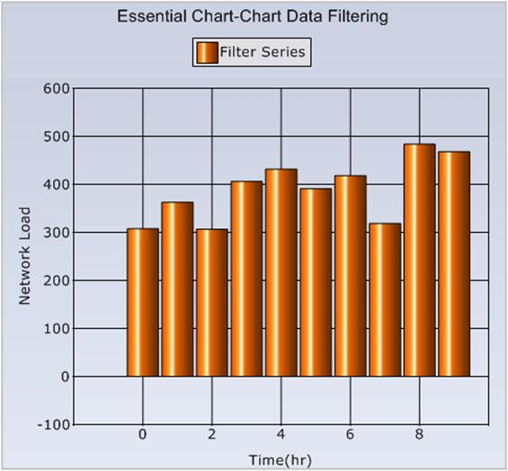
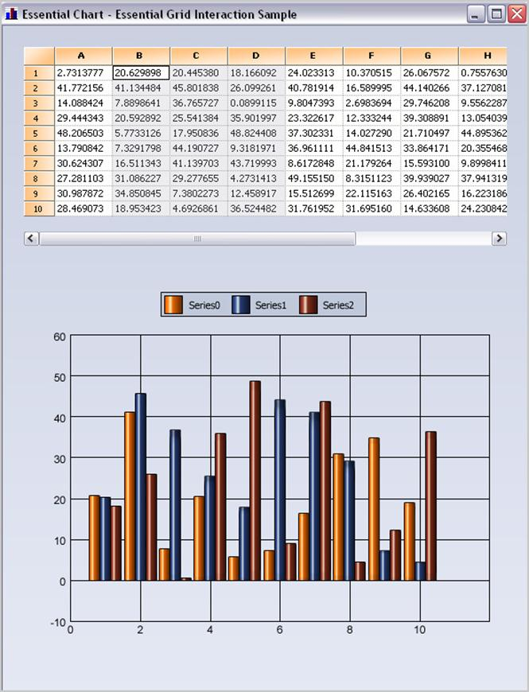

::: {style="DISPLAY: none"}
{#d2h_url_template}{#d2h_package_url style="WIDTH: 0px; DISPLAY: none; HEIGHT: 0px"}
:::

::::: {#nsbanner .d2h_main_nsbanner style="BORDER-BOTTOM: #999999 1px solid; POSITION: relative; PADDING-BOTTOM: 0px; BACKGROUND-COLOR: transparent; PADDING-LEFT: 0px; PADDING-RIGHT: 0px; DISPLAY: none; BORDER-TOP: #999999 1px solid; PADDING-TOP: 0px; LEFT: 0px"}
:::: {#TitleRow .d2h_main_titlerow style="PADDING-BOTTOM: 4px; BACKGROUND-COLOR: transparent; PADDING-LEFT: 22px; WIDTH: 100%; PADDING-RIGHT: 10px; DISPLAY: none; PADDING-TOP: 4px"}
::: {#ienav .d2h_main_ienav style="DISPLAY: none"}
{#D2HPrevious .D2HPreviousEnabled}  {#D2HNext .D2HNextEnabled}
:::
::::
:::::

:::: {#nstext .d2h_main_nstext style="PADDING-BOTTOM: 10px; BACKGROUND-COLOR: transparent; PADDING-LEFT: 22px; PADDING-RIGHT: 10px; HEIGHT: 100%; OVERFLOW: auto; PADDING-TOP: 5px" hasuserbackground="true" valign="bottom"}
::: {#d2h_breadcrumbs .d2h_breadcrumbs}
[Essential Studio User Guide Documentation](ms-xhelp:///?Id=12457748-09e3-4d74-a240-8e049cedf030){.d2h_breadcrumbsNormal}[ \> ]{.d2h_breadcrumbsLinkSeparator}[User Interface Edition](ms-xhelp:///?Id=c29296b7-531c-413b-a0ec-488ca1f7f669){.d2h_breadcrumbsNormal}[ \> ]{.d2h_breadcrumbsLinkSeparator}[Essential Windows](ms-xhelp:///?Id=e60759d8-47a4-4570-9d7a-16a68d63f2ea){.d2h_breadcrumbsNormal}[ \> ]{.d2h_breadcrumbsLinkSeparator}[Essential Chart]{.d2h_breadcrumbsContentsOnly}[ \> ]{.d2h_breadcrumbsLinkSeparator}[Concepts and Features](ms-xhelp:///?Id=71321e9c-336c-4c1c-a127-be9f135ad4bb){.d2h_breadcrumbsNormal}
:::

## Data Manipulation {#data-manipulation style="tab-stops: 0pt"}

 

Essential Chart provides a series model implementation that works directly on top of grouped data. Filters, summaries and computed expressions are all supported in Essential Chart and users can easily add custom summaries and filters and have such data displayed in the chart.

 

Grouping Support

 

The enterprise version of Essential Chart includes Essential Grouping that allows Essential Chart to implement a series model that works directly on top of grouped data. All the key advantages of Essential Grouping carry over into the grouping support in Essential Chart. Filters, summaries and computed expressions are all supported in Essential Chart. With Essential Chart, you are not restricted to predefined summaries or filters. You can easily add custom summaries and filters and have such data displayed in the chart.

 

The following image displays stock data that is grouped by symbol to calculate the total volume. The data contains discrete transaction details with symbol information, volume, and price.

 

The following image displays the same data with data from transactions that occurred in the morning filtered out. Filtering is done entirely in the grouping engine and the data changes are reflected in the chart. You will never be looking at data that is a filtered and grouped copy. Instead, you are always working with live data with the grouping layer provided by the grouping engine. Any changes made in the underlying data will be immediately reflected in the chart.

 

 

{border="0"}

 

Figure 359: Grouped Data with Filtering

 

Essential Grid Interaction

 

Essential Chart offers great interaction capabilities with Essential Grid. You can use a common data model for the grid and chart. The grid can also serve as a data model for the chart, as shown in the following image. Selected columns are automatically mapped into the chart. All it takes, is a few lines of code to implement a model that adapts the data in question (in this case grid cells) for display in the chart.

 

 

{border="0"}

 

Figure 360: Essential Chart with Essential Grid

 

 

[]{#related-topics}
::::
