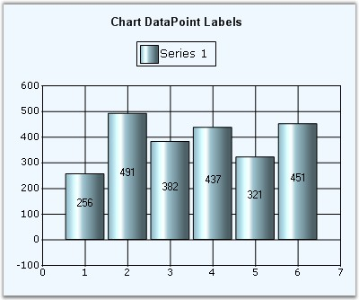

::: {style="DISPLAY: none"}
{#d2h_url_template}{#d2h_package_url style="WIDTH: 0px; DISPLAY: none; HEIGHT: 0px"}
:::

::::: {#nsbanner .d2h_main_nsbanner style="BORDER-BOTTOM: #999999 1px solid; POSITION: relative; PADDING-BOTTOM: 0px; BACKGROUND-COLOR: transparent; PADDING-LEFT: 0px; PADDING-RIGHT: 0px; DISPLAY: none; BORDER-TOP: #999999 1px solid; PADDING-TOP: 0px; LEFT: 0px"}
:::: {#TitleRow .d2h_main_titlerow style="PADDING-BOTTOM: 4px; BACKGROUND-COLOR: transparent; PADDING-LEFT: 22px; WIDTH: 100%; PADDING-RIGHT: 10px; DISPLAY: none; PADDING-TOP: 4px"}
::: {#ienav .d2h_main_ienav style="DISPLAY: none"}
{#D2HPrevious .D2HPreviousEnabled}  {#D2HNext .D2HNextEnabled}
:::
::::
:::::

:::: {#nstext .d2h_main_nstext style="PADDING-BOTTOM: 10px; BACKGROUND-COLOR: transparent; PADDING-LEFT: 22px; PADDING-RIGHT: 10px; HEIGHT: 100%; OVERFLOW: auto; PADDING-TOP: 5px" hasuserbackground="true" valign="bottom"}
::: {#d2h_breadcrumbs .d2h_breadcrumbs}
[Essential Studio User Guide Documentation](ms-xhelp:///?Id=12457748-09e3-4d74-a240-8e049cedf030){.d2h_breadcrumbsNormal}[ \> ]{.d2h_breadcrumbsLinkSeparator}[User Interface Edition](ms-xhelp:///?Id=c29296b7-531c-413b-a0ec-488ca1f7f669){.d2h_breadcrumbsNormal}[ \> ]{.d2h_breadcrumbsLinkSeparator}[Essential Windows](ms-xhelp:///?Id=e60759d8-47a4-4570-9d7a-16a68d63f2ea){.d2h_breadcrumbsNormal}[ \> ]{.d2h_breadcrumbsLinkSeparator}[Essential Chart]{.d2h_breadcrumbsContentsOnly}[ \> ]{.d2h_breadcrumbsLinkSeparator}[Concepts and Features](ms-xhelp:///?Id=71321e9c-336c-4c1c-a127-be9f135ad4bb){.d2h_breadcrumbsNormal}[ \> ]{.d2h_breadcrumbsLinkSeparator}[Chart Series](ms-xhelp:///?Id=68f205e3-aef5-4514-8a16-640be1079703){.d2h_breadcrumbsNormal}
:::

### Data Point Labels, Tooltips and Symbols {#data-point-labels-tooltips-and-symbols style="tab-stops: 0pt"}

 

Labels

 

Data Points in a series can be adorned with text labels as well as custom symbols to provide additional information regarding the specific data points.

 

Text labels can be rendered at the data points using the DisplayText, Text and TextFormat settings. They can further be customized using the [TextColor]{.UGHyperlink}, [TextOffset]{.UGHyperlink} and [TextOrientation]{.UGHyperlink} settings.

 

{border="0"}

 

Figure 236: Black Color DataPoint Labels with TextOrientation= \"RegionCenter\", TextFormat=\"{0}\"

 

Tooltips

 

Refer the [Tooltips]{.UGHyperlink} topic for more information on this.

 

Symbols

 

Built-in or custom symbols can be rendered at the data points to emphasize importance of certain data points. See [Symbol]{.UGHyperlink}[ ]{.UGHyperlink}setting for more information.

 

{border="0"}

 

Figure 237: \"OrangeRed InvertedTriangle\" Symbols in the Series Points

 

[]{#p170} 

 

[]{#related-topics}
::::
