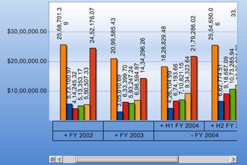

::: {style="DISPLAY: none"}
{#d2h_url_template}{#d2h_package_url style="WIDTH: 0px; DISPLAY: none; HEIGHT: 0px"}
:::

::: {.d2h_secondary_topic style="PADDING-BOTTOM: 10pt; MARGIN: 0pt; PADDING-LEFT: 0pt; PADDING-RIGHT: 0pt; PADDING-TOP: 0pt"}
#### Data-point Value Over Each Series {#data-point-value-over-each-series style="tab-stops: 0pt"}

 

The data-point values are displayed over each chart series, mentioning its value from database in numerical format. The orientation and format can be set in order to avoid clustering of data.

+-------------------------------------------------------------------------------------------------------------------------------------------------------------------------------------------------------------------------+
| **[\[C#\]]{style="FONT-FAMILY: 'Courier New'"}**                                                                                                                                                                        |
|                                                                                                                                                                                                                         |
| [foreach]{style="FONT-FAMILY: 'Courier New'; COLOR: blue"}[ ([ChartSeries]{style="COLOR: #2b91af"} series [in]{style="COLOR: blue"} [this]{style="COLOR: blue"}.olapChart1.Series)]{style="FONT-FAMILY: 'Courier New'"} |
|                                                                                                                                                                                                                         |
| [{]{style="FONT-FAMILY: 'Courier New'"}                                                                                                                                                                                 |
|                                                                                                                                                                                                                         |
| [series.Style.TextFormat = [\"{0:n}\"]{style="COLOR: #a31515"};]{style="FONT-FAMILY: 'Courier New'"}                                                                                                                    |
|                                                                                                                                                                                                                         |
| [series.Style.DisplayText = ]{style="FONT-FAMILY: 'Courier New'"}[true]{style="FONT-FAMILY: 'Courier New'; COLOR: blue"}[;]{style="FONT-FAMILY: 'Courier New'"}                                                         |
|                                                                                                                                                                                                                         |
| [series.Style.TextOrientation = [ChartTextOrientation]{style="COLOR: #2b91af"}.Up;]{style="FONT-FAMILY: 'Courier New'"}                                                                                                 |
|                                                                                                                                                                                                                         |
| [}]{style="FONT-FAMILY: 'Courier New'"}[]{style="FONT-FAMILY: 'Calibri','sans-serif'"}                                                                                                                                  |
+-------------------------------------------------------------------------------------------------------------------------------------------------------------------------------------------------------------------------+

[]{style="FONT-FAMILY: 'Calibri','sans-serif'"} 

+---------------------------------------------------------------------------------------------------------------------------------------------------------------------------------------------------------------------------------------------+
| **[\[VB\]]{style="FONT-FAMILY: 'Courier New'"}**                                                                                                                                                                                            |
|                                                                                                                                                                                                                                             |
| [For]{style="FONT-FAMILY: 'Courier New'; COLOR: blue"}[ [Each]{style="COLOR: blue"} series [As]{style="COLOR: blue"} ChartSeries [In]{style="COLOR: blue"} [Me]{style="COLOR: blue"}.olapChart1.Series]{style="FONT-FAMILY: 'Courier New'"} |
|                                                                                                                                                                                                                                             |
| [series.Style.TextFormat = [\"{0:n}\"]{style="COLOR: #a31515"}]{style="FONT-FAMILY: 'Courier New'"}                                                                                                                                         |
|                                                                                                                                                                                                                                             |
| [series.Style.DisplayText = ]{style="FONT-FAMILY: 'Courier New'"}[true]{style="FONT-FAMILY: 'Courier New'; COLOR: blue"}[]{style="FONT-FAMILY: 'Courier New'"}                                                                              |
|                                                                                                                                                                                                                                             |
| [series.Style.TextOrientation = [ChartTextOrientation]{style="COLOR: #2b91af"}.Up]{style="FONT-FAMILY: 'Courier New'"}                                                                                                                      |
|                                                                                                                                                                                                                                             |
| [Next]{style="FONT-FAMILY: 'Courier New'; COLOR: blue"}[ series]{style="FONT-FAMILY: 'Courier New'"}[]{style="FONT-FAMILY: 'Calibri','sans-serif'"}                                                                                         |
+---------------------------------------------------------------------------------------------------------------------------------------------------------------------------------------------------------------------------------------------+

 

{border="0"}

 

Figure 12: Data-Point Values

[]{#related-topics}
:::
