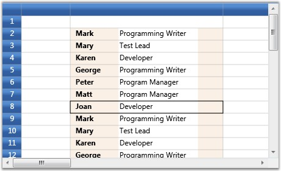

::: {style="DISPLAY: none"}
{#d2h_url_template}{#d2h_package_url style="WIDTH: 0px; DISPLAY: none; HEIGHT: 0px"}
:::

::::: {.d2h_secondary_topic style="PADDING-BOTTOM: 10pt; MARGIN: 0pt; PADDING-LEFT: 0pt; PADDING-RIGHT: 0pt; PADDING-TOP: 0pt"}
##### Data Template Cells {#data-template-cells style="tab-stops: 0pt"}

This cell builds a custom data template that can be used to set enriched styles for associated cells. The DataTemplateCellModel creates the cell type with a Content Control (a WPF control) by calling the renderer.

 

::: {style="BORDER-BOTTOM: windowtext 1pt solid; BORDER-LEFT: medium none; PADDING-BOTTOM: 1pt; MARGIN-TOP: 9pt; PADDING-LEFT: 0pt; PADDING-RIGHT: 0pt; MARGIN-BOTTOM: 9pt; BORDER-TOP: windowtext 1pt solid; BORDER-RIGHT: medium none; PADDING-TOP: 1pt"}
{border="0"}Note: To create a cell type that hosts a WPF control, you should derive it from GridVirtualizingCellRenderer. The most important method to override is the OnInitializeContent method. It will be called for every UI element created for cells displaying this renderer. You can get access to the cell style from this method.
:::

 

The DataTemplateCellRenderer is derived from GridVirtualizingCellRenderer and overrides OnInitializeContent and sets the Content Control template to Style.CellTemplate value.

 

Example

 

CellModel Class

**[]{style="COLOR: #15428b"}** 

+--------------------------------------------------------------------------------------------------------------------------------------------------------------------------------------------------------------------------+
| [\[C#\]]{style="FONT-FAMILY: 'Courier New'; COLOR: black"}                                                                                                                                                               |
|                                                                                                                                                                                                                          |
| []{style="FONT-FAMILY: 'Courier New'; COLOR: blue"}                                                                                                                                                                      |
|                                                                                                                                                                                                                          |
| [public]{style="FONT-FAMILY: 'Courier New'; COLOR: blue"}[ [class]{style="COLOR: blue"} [DataTemplateCellModel]{style="COLOR: #2b91af"} : GridCellModel\<DataTemplateCellRenderer\>]{style="FONT-FAMILY: 'Courier New'"} |
|                                                                                                                                                                                                                          |
| [{]{style="FONT-FAMILY: 'Courier New'"}                                                                                                                                                                                  |
|                                                                                                                                                                                                                          |
| [}]{style="FONT-FAMILY: 'Courier New'"}                                                                                                                                                                                  |
+--------------------------------------------------------------------------------------------------------------------------------------------------------------------------------------------------------------------------+

[]{style="COLOR: #15428b"} 

CellRenderer Class

**[]{style="COLOR: #15428b"}** 

+------------------------------------------------------------------------------------------------------------------------------------------------------------------------------------------------------------------------------------------------------------+
| [\[C#\]]{style="FONT-FAMILY: 'Courier New'; COLOR: black"}                                                                                                                                                                                                 |
|                                                                                                                                                                                                                                                            |
| **[]{style="FONT-FAMILY: 'Courier New'; COLOR: black"}**                                                                                                                                                                                                   |
|                                                                                                                                                                                                                                                            |
| [public]{style="FONT-FAMILY: 'Courier New'; COLOR: blue"}[ [class]{style="COLOR: blue"} [DataTemplateCellRenderer]{style="COLOR: #2b91af"} : GridVirtualizingCellRenderer\<[ContentControl]{style="COLOR: #2b91af"}\>]{style="FONT-FAMILY: 'Courier New'"} |
|                                                                                                                                                                                                                                                            |
| [{]{style="FONT-FAMILY: 'Courier New'"}                                                                                                                                                                                                                    |
|                                                                                                                                                                                                                                                            |
| [    [public]{style="COLOR: blue"} DataTemplateCellRenderer()]{style="FONT-FAMILY: 'Courier New'"}                                                                                                                                                         |
|                                                                                                                                                                                                                                                            |
| [    {]{style="FONT-FAMILY: 'Courier New'"}                                                                                                                                                                                                                |
|                                                                                                                                                                                                                                                            |
| [        IsFocusable = [true]{style="COLOR: blue"};]{style="FONT-FAMILY: 'Courier New'"}                                                                                                                                                                   |
|                                                                                                                                                                                                                                                            |
| [        AllowRecycle = [true]{style="COLOR: blue"};]{style="FONT-FAMILY: 'Courier New'"}                                                                                                                                                                  |
|                                                                                                                                                                                                                                                            |
| [    }]{style="FONT-FAMILY: 'Courier New'"}                                                                                                                                                                                                                |
|                                                                                                                                                                                                                                                            |
| []{style="FONT-FAMILY: 'Courier New'"}                                                                                                                                                                                                                     |
|                                                                                                                                                                                                                                                            |
| [    [public]{style="COLOR: blue"} [override]{style="COLOR: blue"} [void]{style="COLOR: blue"} OnInitializeContent([ContentControl]{style="COLOR: #2b91af"} uiElement, GridRenderStyleInfo style)]{style="FONT-FAMILY: 'Courier New'"}                     |
|                                                                                                                                                                                                                                                            |
| [    {]{style="FONT-FAMILY: 'Courier New'"}                                                                                                                                                                                                                |
|                                                                                                                                                                                                                                                            |
| [        [base]{style="COLOR: blue"}.OnInitializeContent(uiElement, style);]{style="FONT-FAMILY: 'Courier New'"}                                                                                                                                           |
|                                                                                                                                                                                                                                                            |
| [        [bool]{style="COLOR: blue"} found = [false]{style="COLOR: blue"};]{style="FONT-FAMILY: 'Courier New'"}                                                                                                                                            |
|                                                                                                                                                                                                                                                            |
| []{style="FONT-FAMILY: 'Courier New'"}                                                                                                                                                                                                                     |
|                                                                                                                                                                                                                                                            |
| [        [if]{style="COLOR: blue"} (style.CellTemplateKey != [null]{style="COLOR: blue"})]{style="FONT-FAMILY: 'Courier New'"}                                                                                                                             |
|                                                                                                                                                                                                                                                            |
| [        {]{style="FONT-FAMILY: 'Courier New'"}                                                                                                                                                                                                            |
|                                                                                                                                                                                                                                                            |
| [            [DataTemplate]{style="COLOR: #2b91af"} dt = ([DataTemplate]{style="COLOR: #2b91af"})style.GridControl.TryFindResource(style.CellTemplateKey);]{style="FONT-FAMILY: 'Courier New'"}                                                            |
|                                                                                                                                                                                                                                                            |
| [            found = dt != [null]{style="COLOR: blue"};]{style="FONT-FAMILY: 'Courier New'"}                                                                                                                                                               |
|                                                                                                                                                                                                                                                            |
| [            [if]{style="COLOR: blue"} (found)]{style="FONT-FAMILY: 'Courier New'"}                                                                                                                                                                        |
|                                                                                                                                                                                                                                                            |
| [                uiElement.ContentTemplate = dt;]{style="FONT-FAMILY: 'Courier New'"}                                                                                                                                                                      |
|                                                                                                                                                                                                                                                            |
| [        }]{style="FONT-FAMILY: 'Courier New'"}                                                                                                                                                                                                            |
|                                                                                                                                                                                                                                                            |
| []{style="FONT-FAMILY: 'Courier New'"}                                                                                                                                                                                                                     |
|                                                                                                                                                                                                                                                            |
| [        [if]{style="COLOR: blue"} (!found)]{style="FONT-FAMILY: 'Courier New'"}                                                                                                                                                                           |
|                                                                                                                                                                                                                                                            |
| [            uiElement.ContentTemplate = style.CellTemplate;]{style="FONT-FAMILY: 'Courier New'"}                                                                                                                                                          |
|                                                                                                                                                                                                                                                            |
| []{style="FONT-FAMILY: 'Courier New'"}                                                                                                                                                                                                                     |
|                                                                                                                                                                                                                                                            |
| [        uiElement.Content = style.CellValue;]{style="FONT-FAMILY: 'Courier New'"}                                                                                                                                                                         |
|                                                                                                                                                                                                                                                            |
| [    }]{style="FONT-FAMILY: 'Courier New'"}                                                                                                                                                                                                                |
|                                                                                                                                                                                                                                                            |
| []{style="FONT-FAMILY: 'Courier New'"}                                                                                                                                                                                                                     |
|                                                                                                                                                                                                                                                            |
| [    [protected]{style="COLOR: blue"} [override]{style="COLOR: blue"} [string]{style="COLOR: blue"} GetControlTextFromEditorCore([ContentControl]{style="COLOR: #2b91af"} uiElement)]{style="FONT-FAMILY: 'Courier New'"}                                  |
|                                                                                                                                                                                                                                                            |
| [    {]{style="FONT-FAMILY: 'Courier New'"}                                                                                                                                                                                                                |
|                                                                                                                                                                                                                                                            |
| [        [return]{style="COLOR: blue"} uiElement.Content.ToString();]{style="FONT-FAMILY: 'Courier New'"}                                                                                                                                                  |
|                                                                                                                                                                                                                                                            |
| [    }]{style="FONT-FAMILY: 'Courier New'"}                                                                                                                                                                                                                |
|                                                                                                                                                                                                                                                            |
| [}]{style="FONT-FAMILY: 'Courier New'"}                                                                                                                                                                                                                    |
+------------------------------------------------------------------------------------------------------------------------------------------------------------------------------------------------------------------------------------------------------------+

[]{style="COLOR: #15428b"} 

Data Template Definition

**[]{style="COLOR: #15428b"}** 

+-------------------------------------------------------------------------------------------------------------------------------------------------------------------------------------------------------------------------------------------------------------------------------------------------------------------------------------------------------------------------------------------------------------------------------------------------------------------------------------------------------------------------------------------------------------------------------------------------------------------------------------------------------------------------------------------------------------------------------------------------------------------------------------------------------------------------------------------------------------------------------------------------------------------------------------------------------------------------------------------------------+
| [\[XAML\]]{style="FONT-FAMILY: 'Courier New'; COLOR: black"}                                                                                                                                                                                                                                                                                                                                                                                                                                                                                                                                                                                                                                                                                                                                                                                                                                                                                                                                          |
|                                                                                                                                                                                                                                                                                                                                                                                                                                                                                                                                                                                                                                                                                                                                                                                                                                                                                                                                                                                                       |
| []{style="FONT-FAMILY: 'Courier New'"}                                                                                                                                                                                                                                                                                                                                                                                                                                                                                                                                                                                                                                                                                                                                                                                                                                                                                                                                                                |
|                                                                                                                                                                                                                                                                                                                                                                                                                                                                                                                                                                                                                                                                                                                                                                                                                                                                                                                                                                                                       |
| [\<]{style="FONT-FAMILY: 'Courier New'; COLOR: blue"}[DataTemplate]{style="FONT-FAMILY: 'Courier New'; COLOR: #a31515"}[ x]{style="FONT-FAMILY: 'Courier New'; COLOR: red"}[:]{style="FONT-FAMILY: 'Courier New'; COLOR: blue"}[Key]{style="FONT-FAMILY: 'Courier New'; COLOR: red"}[=\"editableEmployee\"\>]{style="FONT-FAMILY: 'Courier New'; COLOR: blue"}                                                                                                                                                                                                                                                                                                                                                                                                                                                                                                                                                                                                                                        |
|                                                                                                                                                                                                                                                                                                                                                                                                                                                                                                                                                                                                                                                                                                                                                                                                                                                                                                                                                                                                       |
| [            ]{style="FONT-FAMILY: 'Courier New'; COLOR: #a31515"}[\<]{style="FONT-FAMILY: 'Courier New'; COLOR: blue"}[StackPanel]{style="FONT-FAMILY: 'Courier New'; COLOR: #a31515"}[ Margin]{style="FONT-FAMILY: 'Courier New'; COLOR: red"}[=\"8,0\"]{style="FONT-FAMILY: 'Courier New'; COLOR: blue"}[ [ Orientation]{style="COLOR: red"}[=\"Horizontal\"\>]{style="COLOR: blue"}]{style="FONT-FAMILY: 'Courier New'"}                                                                                                                                                                                                                                                                                                                                                                                                                                                                                                                                                                          |
|                                                                                                                                                                                                                                                                                                                                                                                                                                                                                                                                                                                                                                                                                                                                                                                                                                                                                                                                                                                                       |
| [                ]{style="FONT-FAMILY: 'Courier New'; COLOR: #a31515"}[\<]{style="FONT-FAMILY: 'Courier New'; COLOR: blue"}[TextBlock]{style="FONT-FAMILY: 'Courier New'; COLOR: #a31515"}[ FontWeight]{style="FONT-FAMILY: 'Courier New'; COLOR: red"}[=\"Bold\"]{style="FONT-FAMILY: 'Courier New'; COLOR: blue"}[ syncfusion]{style="FONT-FAMILY: 'Courier New'; COLOR: red"}[:]{style="FONT-FAMILY: 'Courier New'; COLOR: blue"}[VisualContainer.WantsMouseInput]{style="FONT-FAMILY: 'Courier New'; COLOR: red"}[=\"False\"]{style="FONT-FAMILY: 'Courier New'; COLOR: blue"}[ Text]{style="FONT-FAMILY: 'Courier New'; COLOR: red"}[=\"{]{style="FONT-FAMILY: 'Courier New'; COLOR: blue"}[Binding]{style="FONT-FAMILY: 'Courier New'; COLOR: #a31515"}[ Path]{style="FONT-FAMILY: 'Courier New'; COLOR: red"}[=Name}\"]{style="FONT-FAMILY: 'Courier New'; COLOR: blue"}[ Width]{style="FONT-FAMILY: 'Courier New'; COLOR: red"}[=\"70\" /\>]{style="FONT-FAMILY: 'Courier New'; COLOR: blue"} |
|                                                                                                                                                                                                                                                                                                                                                                                                                                                                                                                                                                                                                                                                                                                                                                                                                                                                                                                                                                                                       |
| [                ]{style="FONT-FAMILY: 'Courier New'; COLOR: #a31515"}[\<]{style="FONT-FAMILY: 'Courier New'; COLOR: blue"}[TextBox]{style="FONT-FAMILY: 'Courier New'; COLOR: #a31515"}[ Text]{style="FONT-FAMILY: 'Courier New'; COLOR: red"}[=\"{]{style="FONT-FAMILY: 'Courier New'; COLOR: blue"}[Binding]{style="FONT-FAMILY: 'Courier New'; COLOR: #a31515"}[ Path]{style="FONT-FAMILY: 'Courier New'; COLOR: red"}[=Title}\"]{style="FONT-FAMILY: 'Courier New'; COLOR: blue"}[ BorderThickness]{style="FONT-FAMILY: 'Courier New'; COLOR: red"}[=\"0\"]{style="FONT-FAMILY: 'Courier New'; COLOR: blue"}[ [ Padding]{style="COLOR: red"}[=\"0\"]{style="COLOR: blue"}[ Margin]{style="COLOR: red"}[=\"0\"]{style="COLOR: blue"}[ Width]{style="COLOR: red"}[=\"130\"]{style="COLOR: blue"}[ x]{style="COLOR: red"}[:]{style="COLOR: blue"}[Name]{style="COLOR: red"}[=\"tb\"/\>]{style="COLOR: blue"}]{style="FONT-FAMILY: 'Courier New'"}                                                   |
|                                                                                                                                                                                                                                                                                                                                                                                                                                                                                                                                                                                                                                                                                                                                                                                                                                                                                                                                                                                                       |
| [            ]{style="FONT-FAMILY: 'Courier New'; COLOR: #a31515"}[\</]{style="FONT-FAMILY: 'Courier New'; COLOR: blue"}[StackPanel]{style="FONT-FAMILY: 'Courier New'; COLOR: #a31515"}[\>]{style="FONT-FAMILY: 'Courier New'; COLOR: blue"}                                                                                                                                                                                                                                                                                                                                                                                                                                                                                                                                                                                                                                                                                                                                                         |
|                                                                                                                                                                                                                                                                                                                                                                                                                                                                                                                                                                                                                                                                                                                                                                                                                                                                                                                                                                                                       |
| [        ]{style="FONT-FAMILY: 'Courier New'; COLOR: #a31515"}[\</]{style="FONT-FAMILY: 'Courier New'; COLOR: blue"}[DataTemplate]{style="FONT-FAMILY: 'Courier New'; COLOR: #a31515"}[\>]{style="FONT-FAMILY: 'Courier New'; COLOR: blue"}                                                                                                                                                                                                                                                                                                                                                                                                                                                                                                                                                                                                                                                                                                                                                           |
+-------------------------------------------------------------------------------------------------------------------------------------------------------------------------------------------------------------------------------------------------------------------------------------------------------------------------------------------------------------------------------------------------------------------------------------------------------------------------------------------------------------------------------------------------------------------------------------------------------------------------------------------------------------------------------------------------------------------------------------------------------------------------------------------------------------------------------------------------------------------------------------------------------------------------------------------------------------------------------------------------------+

**[]{style="COLOR: #15428b"}** 

Setting up the Data Template Cell and assigning the Cell Template

**[]{style="COLOR: #15428b"}** 

+------------------------------------------------------------------------------------------------------------------------------------------------------------------------------------------------------------------------+
| [\[C#\]]{style="FONT-FAMILY: 'Courier New'; COLOR: black"}                                                                                                                                                             |
|                                                                                                                                                                                                                        |
| []{style="FONT-FAMILY: 'Courier New'"}                                                                                                                                                                                 |
|                                                                                                                                                                                                                        |
| [grid.Model.CellModels.Add([\"DataTemplate\"]{style="COLOR: #a31515"}, [new]{style="COLOR: blue"} DataTemplateCellModel());]{style="FONT-FAMILY: 'Courier New'"}                                                       |
|                                                                                                                                                                                                                        |
| [grid.Model.QueryCellInfo += [new]{style="COLOR: blue"} Syncfusion.Windows.Controls.Grid.GridQueryCellInfoEventHandler(Model_QueryCellInfo);]{style="FONT-FAMILY: 'Courier New'"}                                      |
|                                                                                                                                                                                                                        |
| []{style="FONT-FAMILY: 'Courier New'"}                                                                                                                                                                                 |
|                                                                                                                                                                                                                        |
| [void]{style="FONT-FAMILY: 'Courier New'; COLOR: blue"}[ Model_QueryCellInfo([object]{style="COLOR: blue"} sender, Syncfusion.Windows.Controls.Grid.GridQueryCellInfoEventArgs e)]{style="FONT-FAMILY: 'Courier New'"} |
|                                                                                                                                                                                                                        |
| [{]{style="FONT-FAMILY: 'Courier New'"}                                                                                                                                                                                |
|                                                                                                                                                                                                                        |
| [    [if]{style="COLOR: blue"} (e.Cell.RowIndex \> 1 && e.Cell.ColumnIndex == 2)]{style="FONT-FAMILY: 'Courier New'"}                                                                                                  |
|                                                                                                                                                                                                                        |
| [    {]{style="FONT-FAMILY: 'Courier New'"}                                                                                                                                                                            |
|                                                                                                                                                                                                                        |
| [        e.Style.CellType = [\"DataTemplate\"]{style="COLOR: #a31515"};]{style="FONT-FAMILY: 'Courier New'"}                                                                                                           |
|                                                                                                                                                                                                                        |
| [        e.Style.CellTemplateKey = [\"editableEmployee\"]{style="COLOR: #a31515"};]{style="FONT-FAMILY: 'Courier New'"}                                                                                                |
|                                                                                                                                                                                                                        |
| [        e.Style.CellValue = employeesSource.Employees\[e.Cell.RowIndex % employeesSource.Employees.Count\];]{style="FONT-FAMILY: 'Courier New'"}                                                                      |
|                                                                                                                                                                                                                        |
| [        e.Style.Background = Brushes.Linen;]{style="FONT-FAMILY: 'Courier New'"}                                                                                                                                      |
|                                                                                                                                                                                                                        |
| []{style="FONT-FAMILY: 'Courier New'"}                                                                                                                                                                                 |
|                                                                                                                                                                                                                        |
| [    }]{style="FONT-FAMILY: 'Courier New'"}                                                                                                                                                                            |
|                                                                                                                                                                                                                        |
| [}]{style="FONT-FAMILY: 'Courier New'"}                                                                                                                                                                                |
+------------------------------------------------------------------------------------------------------------------------------------------------------------------------------------------------------------------------+

[]{style="COLOR: #15428b"} 

Output

[]{style="COLOR: #15428b"} 

The following output is generated using the code above.

[]{style="COLOR: #15428b"} 

{border="0"}

Figure 41: Data Template with Cell Template Assigned

***[]{style="COLOR: #15428b"}*** 

::: {style="BORDER-BOTTOM: windowtext 1pt solid; BORDER-LEFT: medium none; PADDING-BOTTOM: 1pt; MARGIN-TOP: 9pt; PADDING-LEFT: 0pt; PADDING-RIGHT: 0pt; MARGIN-BOTTOM: 9pt; BORDER-TOP: windowtext 1pt solid; BORDER-RIGHT: medium none; PADDING-TOP: 1pt"}
{border="0"}Note: For complete code, please refer to the following browser sample.
:::

 

***\...\\My Documents\\Syncfusion\\EssentialStudio\\\<Version Number\>\\WPF\\Grid.WPF\\Samples\\3.5\\WindowsSamples\\Cell Types\\Data Template Cell Demo***

**** 

**** 

[]{#related-topics}
:::::
