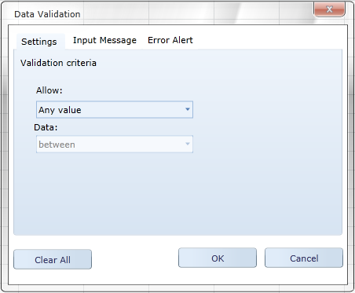

::: {style="DISPLAY: none"}
{#d2h_url_template}{#d2h_package_url style="WIDTH: 0px; DISPLAY: none; HEIGHT: 0px"}
:::

::::: {#nsbanner .d2h_main_nsbanner style="BORDER-BOTTOM: #999999 1px solid; POSITION: relative; PADDING-BOTTOM: 0px; BACKGROUND-COLOR: transparent; PADDING-LEFT: 0px; PADDING-RIGHT: 0px; DISPLAY: none; BORDER-TOP: #999999 1px solid; PADDING-TOP: 0px; LEFT: 0px"}
:::: {#TitleRow .d2h_main_titlerow style="PADDING-BOTTOM: 4px; BACKGROUND-COLOR: transparent; PADDING-LEFT: 22px; WIDTH: 100%; PADDING-RIGHT: 10px; DISPLAY: none; PADDING-TOP: 4px"}
::: {#ienav .d2h_main_ienav style="DISPLAY: none"}
{#D2HPrevious .D2HPreviousEnabled}  {#D2HNext .D2HNextEnabled}
:::
::::
:::::

::::: {#nstext .d2h_main_nstext style="PADDING-BOTTOM: 10px; BACKGROUND-COLOR: transparent; PADDING-LEFT: 22px; PADDING-RIGHT: 10px; HEIGHT: 100%; OVERFLOW: auto; PADDING-TOP: 5px" hasuserbackground="true" valign="bottom"}
::: {#d2h_breadcrumbs .d2h_breadcrumbs}
[Essential Studio User Guide Documentation](ms-xhelp:///?Id=12457748-09e3-4d74-a240-8e049cedf030){.d2h_breadcrumbsNormal}[ \> ]{.d2h_breadcrumbsLinkSeparator}[User Interface Edition](ms-xhelp:///?Id=c29296b7-531c-413b-a0ec-488ca1f7f669){.d2h_breadcrumbsNormal}[ \> ]{.d2h_breadcrumbsLinkSeparator}[Essential Silverlight](ms-xhelp:///?Id=66221bd1-ba2e-43c2-94a7-618f50e01d24){.d2h_breadcrumbsNormal}[ \> ]{.d2h_breadcrumbsLinkSeparator}[Essential Spreadsheet]{.d2h_breadcrumbsContentsOnly}[ \> ]{.d2h_breadcrumbsLinkSeparator}[Concepts and Features](ms-xhelp:///?Id=56efc3c9-36bc-4be8-94d9-f1938dfb1d73){.d2h_breadcrumbsNormal}[ \> ]{.d2h_breadcrumbsLinkSeparator}[Data Management](ms-xhelp:///?Id=32ae857b-9ea0-400f-8f93-16cb03bfd784){.d2h_breadcrumbsNormal}
:::

### Data Validation {#data-validation style="tab-stops: 0pt"}

The Data Validation enables you to dynamically validate the data entered in a cell. You can specify the validation rules in the Data Validation dialog box. Spreadsheet control supports the various validation types for each data type. This also enables you to show the error message for invalid.

 

{border="0"}

Figure 24: Data Validation Dialog

 

Data Validation in Spreadsheet control

 

Essential Spreadsheet control enables you to edit the existing data validation. You can also create new data validation. Spreadsheet control supports the following validation types:

[]{style="FONT-FAMILY: Consolas; COLOR: #2b91af; FONT-SIZE: 9.5pt"} 

Text Length Validation

Time Validation

List Validation

Number Validation

Date Validation

 

Events

 

Table 1: EventTable

::: {align="center"}
+------------------------+-----------------------------------------------------+-----------------------------------------------------------------------------+-------------+-----------------+
| Event                  | Description                                         | Arguments                                                                   | Type        | Reference links |
+------------------------+-----------------------------------------------------+-----------------------------------------------------------------------------+-------------+-----------------+
| CurrentCellValidating  | Will be triggered when the cell value is committed. | void CurrentCellValidating(object sender, CurrentCellValidatingEventArgs e) | Routed      | NA              |
|                        |                                                     |                                                                             |             |                 |
|                        | This can be cancelled.                              |                                                                             |             |                 |
|                        |                                                     |                                                                             |             |                 |
|                        | Error alert can be customized.                      |                                                                             |             |                 |
+========================+=====================================================+=============================================================================+=============+=================+
:::

 

 

More:

[ ]{#related-topics}

[{border="0" align="absMiddle"}Defining Condition for Validating Cells](ms-xhelp:///?Id=4b402ace-28cb-48cf-98c6-c1570a0475e6){style="TEXT-DECORATION: none"}
:::::
