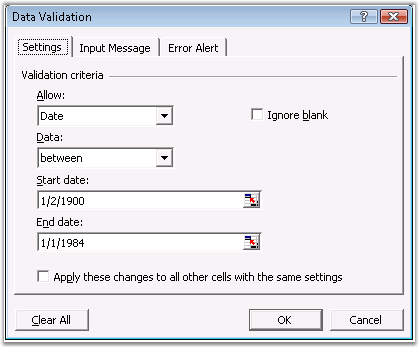
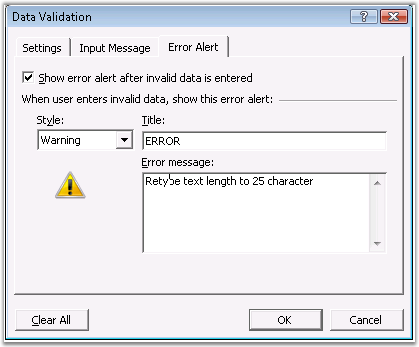
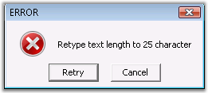

::: {style="DISPLAY: none"}
{#d2h_url_template}{#d2h_package_url style="WIDTH: 0px; DISPLAY: none; HEIGHT: 0px"}
:::

::::: {#nsbanner .d2h_main_nsbanner style="BORDER-BOTTOM: #999999 1px solid; POSITION: relative; PADDING-BOTTOM: 0px; BACKGROUND-COLOR: transparent; PADDING-LEFT: 0px; PADDING-RIGHT: 0px; DISPLAY: none; BORDER-TOP: #999999 1px solid; PADDING-TOP: 0px; LEFT: 0px"}
:::: {#TitleRow .d2h_main_titlerow style="PADDING-BOTTOM: 4px; BACKGROUND-COLOR: transparent; PADDING-LEFT: 22px; WIDTH: 100%; PADDING-RIGHT: 10px; DISPLAY: none; PADDING-TOP: 4px"}
::: {#ienav .d2h_main_ienav style="DISPLAY: none"}
{#D2HPrevious .D2HPreviousEnabled}  {#D2HNext .D2HNextEnabled}
:::
::::
:::::

:::: {#nstext .d2h_main_nstext style="PADDING-BOTTOM: 10px; BACKGROUND-COLOR: transparent; PADDING-LEFT: 22px; PADDING-RIGHT: 10px; HEIGHT: 100%; OVERFLOW: auto; PADDING-TOP: 5px" hasuserbackground="true" valign="bottom"}
::: {#d2h_breadcrumbs .d2h_breadcrumbs}
[Essential Studio User Guide Documentation](ms-xhelp:///?Id=12457748-09e3-4d74-a240-8e049cedf030){.d2h_breadcrumbsNormal}[ \> ]{.d2h_breadcrumbsLinkSeparator}[Reporting Edition](ms-xhelp:///?Id=027aa5b6-6676-4f93-ad23-c20e8c45792e){.d2h_breadcrumbsNormal}[ \> ]{.d2h_breadcrumbsLinkSeparator}[Essential XlsIO](ms-xhelp:///?Id=b01a1b50-1d7d-40c0-bc83-af67e57c9005){.d2h_breadcrumbsNormal}[ \> ]{.d2h_breadcrumbsLinkSeparator}[Concepts and Features](ms-xhelp:///?Id=21b26556-5905-4ad9-90b4-40320db25faf){.d2h_breadcrumbsNormal}[ \> ]{.d2h_breadcrumbsLinkSeparator}[Data](ms-xhelp:///?Id=09eb021a-c01a-47a5-bf60-fb7c3ed89c78){.d2h_breadcrumbsNormal}
:::

### Data Validation {#data-validation style="tab-stops: 0pt"}

 

The Data Validation feature available in MS Excel dynamically validates the data that is entered into a cell. The validation rules are specified in the Data Validation **Settings** tab. Data Validation in MS Excel is achieved by selecting the \"Validation\" item in the **Data** menu. Excel has various validation types for each **data type**, and options to show the error box for invalid data through the **Data Validation** dialog box, which is shown in the following screen shot.

 

[]{style="FONT-FAMILY: 'Trebuchet MS','sans-serif'; COLOR: #15428b; FONT-SIZE: 9pt"} 

{border="0"}

Figure 130: Data Validation Settings[]{style="FONT-FAMILY: 'Trebuchet MS','sans-serif'; COLOR: #15428b"}

[]{style="FONT-FAMILY: 'Trebuchet MS','sans-serif'; COLOR: #15428b; FONT-SIZE: 9pt"} 

Data Validation in Essential XlsIO

[]{style="FONT-FAMILY: 'Trebuchet MS','sans-serif'; COLOR: #15428b; FONT-SIZE: 9pt"} 

Essential XlsIO, equivalent to the MS Excel, is built with APIs to read and write data validation in a worksheet by using the **IDataValidation** class. Following are some validation types that XlsIO supports.

[]{style="FONT-FAMILY: 'Trebuchet MS','sans-serif'; COLOR: #15428b; FONT-SIZE: 9pt"} 

[·      ]{style="FONT-FAMILY: Symbol"}Text Length Validation

[·      ]{style="FONT-FAMILY: Symbol"}Time Validation

[·      ]{style="FONT-FAMILY: Symbol"}List Validation

[·      ]{style="FONT-FAMILY: Symbol"}Number Validation

[·      ]{style="FONT-FAMILY: Symbol"}Date Validation

[·      ]{style="FONT-FAMILY: Symbol"}Custom Validation

[]{style="FONT-FAMILY: 'Trebuchet MS','sans-serif'; COLOR: #15428b; FONT-SIZE: 9pt"} 

[ An article which describes data validation is available in the following path: ]{style="COLOR: #15428b"}[[http://www.syncfusion.com:91/products/xlsio/backoffice/Articles/data_validation.aspx]{.UGHyperlink}](http://www.syncfusion.com:91/products/xlsio/backoffice/Articles/data_validation.aspx)[.]{style="COLOR: #15428b"}

[]{style="FONT-FAMILY: 'Trebuchet MS','sans-serif'; COLOR: #15428b; FONT-SIZE: 9pt"} 

+-------------------------------------------------------------------------------------------------------------------------------------------------------------------------------------------------------------------------------------------------------------+
| **[\[C#\]]{style="FONT-FAMILY: 'Courier New'"}**                                                                                                                                                                                                            |
|                                                                                                                                                                                                                                                             |
| **[]{style="FONT-FAMILY: 'Courier New'"}**                                                                                                                                                                                                                  |
|                                                                                                                                                                                                                                                             |
| [// Data validation to list the values in the first cell.]{style="FONT-FAMILY: 'Courier New'; COLOR: green"}                                                                                                                                                |
|                                                                                                                                                                                                                                                             |
| [IDataValidation]{style="FONT-FAMILY: 'Courier New'; COLOR: #2b91af"}[ validation = sheet.Range\[[\"A1\"]{style="COLOR: #a31515"}\].DataValidation;]{style="FONT-FAMILY: 'Courier New'"}                                                                    |
|                                                                                                                                                                                                                                                             |
| [sheet.Range\[[\"A1\"]{style="COLOR: #a31515"}\].Text = [\"Data validation list\"]{style="COLOR: #a31515"};]{style="FONT-FAMILY: 'Courier New'"}                                                                                                            |
|                                                                                                                                                                                                                                                             |
| [validation.ListOfValues = [new]{style="COLOR: blue"} [string]{style="COLOR: blue"}\[\] { [\"ListItem1\"]{style="COLOR: #a31515"}, [\"ListItem2\"]{style="COLOR: #a31515"}, [\"ListItem3\"]{style="COLOR: #a31515"} };]{style="FONT-FAMILY: 'Courier New'"} |
|                                                                                                                                                                                                                                                             |
| [validation.PromptBoxText = [\"Data Validation list\"]{style="COLOR: #a31515"};]{style="FONT-FAMILY: 'Courier New'"}                                                                                                                                        |
|                                                                                                                                                                                                                                                             |
| [validation.IsPromptBoxVisible = [true]{style="COLOR: blue"};]{style="FONT-FAMILY: 'Courier New'"}                                                                                                                                                          |
|                                                                                                                                                                                                                                                             |
| [validation.ShowPromptBox = [true]{style="COLOR: blue"};]{style="FONT-FAMILY: 'Courier New'"}                                                                                                                                                               |
+-------------------------------------------------------------------------------------------------------------------------------------------------------------------------------------------------------------------------------------------------------------+

[]{style="FONT-FAMILY: 'Trebuchet MS','sans-serif'; COLOR: #15428b; FONT-SIZE: 9pt"} 

+---------------------------------------------------------------------------------------------------------------------------------------------------------------------------------------------------------------------------------------------------+
| **[\[VB.NET\]]{style="FONT-FAMILY: 'Courier New'"}**                                                                                                                                                                                              |
|                                                                                                                                                                                                                                                   |
| **[]{style="FONT-FAMILY: 'Courier New'"}**                                                                                                                                                                                                        |
|                                                                                                                                                                                                                                                   |
| [\' Data validation to list the values in the first cell.]{style="FONT-FAMILY: 'Courier New'; COLOR: green"}                                                                                                                                      |
|                                                                                                                                                                                                                                                   |
| [Dim]{style="FONT-FAMILY: 'Courier New'; COLOR: blue"}[ validation [As]{style="COLOR: blue"} IDataValidation = sheet.Range([\"A1\"]{style="COLOR: maroon"}).DataValidation]{style="FONT-FAMILY: 'Courier New'"}                                   |
|                                                                                                                                                                                                                                                   |
| [sheet.Range([\"A1\"]{style="COLOR: maroon"}).Text = [\"Data validation list\"]{style="COLOR: maroon"}]{style="FONT-FAMILY: 'Courier New'"}                                                                                                       |
|                                                                                                                                                                                                                                                   |
| [validation.ListOfValues = [New]{style="COLOR: blue"} [String]{style="COLOR: blue"}() {[\"ListItem1\"]{style="COLOR: maroon"},[\"ListItem2\"]{style="COLOR: maroon"},[\"ListItem3\"]{style="COLOR: maroon"}}]{style="FONT-FAMILY: 'Courier New'"} |
|                                                                                                                                                                                                                                                   |
| [validation.PromptBoxText = [\"Data Validation list\"]{style="COLOR: maroon"}]{style="FONT-FAMILY: 'Courier New'"}                                                                                                                                |
|                                                                                                                                                                                                                                                   |
| [validation.IsPromptBoxVisible = [True]{style="COLOR: blue"}]{style="FONT-FAMILY: 'Courier New'"}                                                                                                                                                 |
|                                                                                                                                                                                                                                                   |
| [validation.ShowPromptBox = [True]{style="COLOR: blue"}]{style="FONT-FAMILY: 'Courier New'"}                                                                                                                                                      |
+---------------------------------------------------------------------------------------------------------------------------------------------------------------------------------------------------------------------------------------------------+

 

The following screen shots illustrates the error alert settings through the **Data Validation** dialog box in MS Excel.

 

[]{style="FONT-FAMILY: 'Trebuchet MS','sans-serif'; COLOR: #15428b; FONT-SIZE: 9pt"} 

{border="0"}

Figure 131: Error Alert Options in MS Excel[]{style="FONT-FAMILY: 'Trebuchet MS','sans-serif'; COLOR: #15428b"}

***[]{style="FONT-FAMILY: 'Trebuchet MS','sans-serif'; COLOR: #15428b; FONT-SIZE: 9pt"}*** 

***[]{style="FONT-FAMILY: 'Trebuchet MS','sans-serif'; COLOR: #15428b; FONT-SIZE: 9pt"}*** 

{border="0"}

Figure 132: Error box**[]{style="FONT-FAMILY: 'Trebuchet MS','sans-serif'; COLOR: #15428b"}**

XlsIO has numerous validation rules and features which are demonstrated in the following code example. **AllowType** property sets the type of validation, **CompareOperator** sets the validation criteria, and **ShowErrorBox** shows the error box with an error message.

[]{style="FONT-FAMILY: 'Trebuchet MS','sans-serif'; COLOR: #15428b; FONT-SIZE: 9pt"} 

+-------------------------------------------------------------------------------------------------------------------------------------------------------------------------------------------+
| **[\[C#\]]{style="FONT-FAMILY: 'Courier New'"}**                                                                                                                                          |
|                                                                                                                                                                                           |
| []{style="FONT-FAMILY: 'Courier New'"}                                                                                                                                                    |
|                                                                                                                                                                                           |
| [// Data Validation for Numbers.]{style="FONT-FAMILY: 'Courier New'; COLOR: green"}                                                                                                       |
|                                                                                                                                                                                           |
| [IDataValidation]{style="FONT-FAMILY: 'Courier New'; COLOR: #2b91af"}[ validation1 = sheet.Range\[[\"A3\"]{style="COLOR: #a31515"}\].DataValidation;]{style="FONT-FAMILY: 'Courier New'"} |
|                                                                                                                                                                                           |
| [sheet.Range\[[\"A3\"]{style="COLOR: #a31515"}\].Text = [\"Enter a Number\"]{style="COLOR: #a31515"};]{style="FONT-FAMILY: 'Courier New'"}                                                |
|                                                                                                                                                                                           |
| [validation1.AllowType = [ExcelDataType]{style="COLOR: #2b91af"}.Integer;]{style="FONT-FAMILY: 'Courier New'"}                                                                            |
|                                                                                                                                                                                           |
| [validation1.CompareOperator = [ExcelDataValidationComparisonOperator]{style="COLOR: #2b91af"}.Between;]{style="FONT-FAMILY: 'Courier New'"}                                              |
|                                                                                                                                                                                           |
| [validation1.FirstFormula = [\"0\"]{style="COLOR: #a31515"};]{style="FONT-FAMILY: 'Courier New'"}                                                                                         |
|                                                                                                                                                                                           |
| [validation1.SecondFormula = [\"10\"]{style="COLOR: #a31515"};]{style="FONT-FAMILY: 'Courier New'"}                                                                                       |
|                                                                                                                                                                                           |
| [validation1.ShowErrorBox = [true]{style="COLOR: blue"};]{style="FONT-FAMILY: 'Courier New'"}                                                                                             |
|                                                                                                                                                                                           |
| [validation1.ErrorBoxText = [\"Enter Value between 0 to 10\"]{style="COLOR: #a31515"};]{style="FONT-FAMILY: 'Courier New'"}                                                               |
|                                                                                                                                                                                           |
| [validation1.ErrorBoxTitle = [\"ERROR\"]{style="COLOR: #a31515"};]{style="FONT-FAMILY: 'Courier New'"}                                                                                    |
|                                                                                                                                                                                           |
| [validation1.PromptBoxText = [\"Data Validation using Condition for Numbers\"]{style="COLOR: #a31515"};]{style="FONT-FAMILY: 'Courier New'"}                                              |
|                                                                                                                                                                                           |
| [validation1.ShowPromptBox = [true]{style="COLOR: blue"};]{style="FONT-FAMILY: 'Courier New'"}                                                                                            |
|                                                                                                                                                                                           |
| []{style="FONT-FAMILY: 'Courier New'"}                                                                                                                                                    |
|                                                                                                                                                                                           |
| [// Data Validation for Date.]{style="FONT-FAMILY: 'Courier New'; COLOR: green"}                                                                                                          |
|                                                                                                                                                                                           |
| [IDataValidation]{style="FONT-FAMILY: 'Courier New'; COLOR: #2b91af"}[ validation2 = sheet.Range\[[\"A5\"]{style="COLOR: #a31515"}\].DataValidation;]{style="FONT-FAMILY: 'Courier New'"} |
|                                                                                                                                                                                           |
| [sheet.Range\[[\"A5\"]{style="COLOR: #a31515"}\].Text = [\"Enter the Date\"]{style="COLOR: #a31515"};]{style="FONT-FAMILY: 'Courier New'"}                                                |
|                                                                                                                                                                                           |
| [validation2.AllowType = [ExcelDataType]{style="COLOR: #2b91af"}.Date;]{style="FONT-FAMILY: 'Courier New'"}                                                                               |
|                                                                                                                                                                                           |
| [validation2.CompareOperator = [ExcelDataValidationComparisonOperator]{style="COLOR: #2b91af"}.Between;]{style="FONT-FAMILY: 'Courier New'"}                                              |
|                                                                                                                                                                                           |
| [validation2.FirstDateTime = [new]{style="COLOR: blue"} [DateTime]{style="COLOR: #2b91af"}(2003, 5, 10);]{style="FONT-FAMILY: 'Courier New'"}                                             |
|                                                                                                                                                                                           |
| [validation2.SecondDateTime = [new]{style="COLOR: blue"} [DateTime]{style="COLOR: #2b91af"}(2004, 5, 10);]{style="FONT-FAMILY: 'Courier New'"}                                            |
|                                                                                                                                                                                           |
| [validation2.ShowErrorBox = [true]{style="COLOR: blue"};]{style="FONT-FAMILY: 'Courier New'"}                                                                                             |
|                                                                                                                                                                                           |
| [validation2.ErrorBoxText = [\"Enter Value between 10/5/2003 to 10/5/2004\"]{style="COLOR: #a31515"};]{style="FONT-FAMILY: 'Courier New'"}                                                |
|                                                                                                                                                                                           |
| [validation2.ErrorBoxTitle = [\"ERROR\"]{style="COLOR: #a31515"};]{style="FONT-FAMILY: 'Courier New'"}                                                                                    |
|                                                                                                                                                                                           |
| [validation2.PromptBoxText = [\"Data Validation using Condition for Date\"]{style="COLOR: #a31515"};]{style="FONT-FAMILY: 'Courier New'"}                                                 |
|                                                                                                                                                                                           |
| [validation2.ShowPromptBox = [true]{style="COLOR: blue"}; ]{style="FONT-FAMILY: 'Courier New'"}                                                                                           |
+-------------------------------------------------------------------------------------------------------------------------------------------------------------------------------------------+

[]{style="FONT-FAMILY: 'Trebuchet MS','sans-serif'; COLOR: #15428b; FONT-SIZE: 9pt"} 

+------------------------------------------------------------------------------------------------------------------------------------------------------------------------------------------------------------------+
| **[\[VB.NET\]]{style="FONT-FAMILY: 'Courier New'"}**                                                                                                                                                             |
|                                                                                                                                                                                                                  |
| []{style="FONT-FAMILY: 'Courier New'; COLOR: blue"}                                                                                                                                                              |
|                                                                                                                                                                                                                  |
| [\' Data Validation for Numbers.]{style="FONT-FAMILY: 'Courier New'; COLOR: green"}                                                                                                                              |
|                                                                                                                                                                                                                  |
| [Dim]{style="FONT-FAMILY: 'Courier New'; COLOR: blue"}[ validation1 [As]{style="COLOR: blue"} IDataValidation = sheet.Range([\"A3\"]{style="COLOR: maroon"}).DataValidation]{style="FONT-FAMILY: 'Courier New'"} |
|                                                                                                                                                                                                                  |
| [sheet.Range([\"A3\"]{style="COLOR: maroon"}).Text = [\"Enter a Number\"]{style="COLOR: maroon"}]{style="FONT-FAMILY: 'Courier New'"}                                                                            |
|                                                                                                                                                                                                                  |
| [validation1.AllowType = ExcelDataType.Integer]{style="FONT-FAMILY: 'Courier New'"}                                                                                                                              |
|                                                                                                                                                                                                                  |
| [validation1.CompareOperator = ExcelDataValidationComparisonOperator.Between]{style="FONT-FAMILY: 'Courier New'"}                                                                                                |
|                                                                                                                                                                                                                  |
| [validation1.FirstFormula = [\"0\"]{style="COLOR: maroon"}]{style="FONT-FAMILY: 'Courier New'"}                                                                                                                  |
|                                                                                                                                                                                                                  |
| [validation1.SecondFormula = [\"10\"]{style="COLOR: maroon"}]{style="FONT-FAMILY: 'Courier New'"}                                                                                                                |
|                                                                                                                                                                                                                  |
| [validation1.ShowErrorBox = [True]{style="COLOR: blue"}]{style="FONT-FAMILY: 'Courier New'"}                                                                                                                     |
|                                                                                                                                                                                                                  |
| [validation1.ErrorBoxText = [\"Enter Value between 0 to 10\"]{style="COLOR: maroon"}]{style="FONT-FAMILY: 'Courier New'"}                                                                                        |
|                                                                                                                                                                                                                  |
| [validation1.ErrorBoxTitle = [\"ERROR\"]{style="COLOR: maroon"}]{style="FONT-FAMILY: 'Courier New'"}                                                                                                             |
|                                                                                                                                                                                                                  |
| [validation1.PromptBoxText = [\"Data Validation using Condition for Numbers\"]{style="COLOR: maroon"}]{style="FONT-FAMILY: 'Courier New'"}                                                                       |
|                                                                                                                                                                                                                  |
| [validation1.ShowPromptBox = [True]{style="COLOR: blue"}]{style="FONT-FAMILY: 'Courier New'"}                                                                                                                    |
|                                                                                                                                                                                                                  |
| []{style="FONT-FAMILY: 'Courier New'; COLOR: blue"}                                                                                                                                                              |
|                                                                                                                                                                                                                  |
| [\' Data Validation for Date.]{style="FONT-FAMILY: 'Courier New'; COLOR: green"}                                                                                                                                 |
|                                                                                                                                                                                                                  |
| [Dim]{style="FONT-FAMILY: 'Courier New'; COLOR: blue"}[ validation2 [As]{style="COLOR: blue"} IDataValidation = sheet.Range([\"A5\"]{style="COLOR: maroon"}).DataValidation]{style="FONT-FAMILY: 'Courier New'"} |
|                                                                                                                                                                                                                  |
| [sheet.Range([\"A5\"]{style="COLOR: maroon"}).Text = [\"Enter the Date\"]{style="COLOR: maroon"}]{style="FONT-FAMILY: 'Courier New'"}                                                                            |
|                                                                                                                                                                                                                  |
| [validation2.AllowType = ExcelDataType.Date]{style="FONT-FAMILY: 'Courier New'"}                                                                                                                                 |
|                                                                                                                                                                                                                  |
| [validation2.CompareOperator = ExcelDataValidationComparisonOperator.Between]{style="FONT-FAMILY: 'Courier New'"}                                                                                                |
|                                                                                                                                                                                                                  |
| [validation2.FirstDateTime = [New]{style="COLOR: blue"} DateTime(2003,5,10)]{style="FONT-FAMILY: 'Courier New'"}                                                                                                 |
|                                                                                                                                                                                                                  |
| [validation2.SecondDateTime = [New]{style="COLOR: blue"} DateTime(2004,5,10)]{style="FONT-FAMILY: 'Courier New'"}                                                                                                |
|                                                                                                                                                                                                                  |
| [validation2.ShowErrorBox = [True]{style="COLOR: blue"}]{style="FONT-FAMILY: 'Courier New'"}                                                                                                                     |
|                                                                                                                                                                                                                  |
| [validation2.ErrorBoxText = [\"Enter Value between 10/5/2003 to 10/5/2004\"]{style="COLOR: maroon"}]{style="FONT-FAMILY: 'Courier New'"}                                                                         |
|                                                                                                                                                                                                                  |
| [validation2.ErrorBoxTitle = [\"ERROR\"]{style="COLOR: maroon"}]{style="FONT-FAMILY: 'Courier New'"}                                                                                                             |
|                                                                                                                                                                                                                  |
| [validation2.PromptBoxText = [\"Data Validation using Condition for Date\"]{style="COLOR: maroon"}]{style="FONT-FAMILY: 'Courier New'"}                                                                          |
|                                                                                                                                                                                                                  |
| [validation2.ShowPromptBox = [True]{style="COLOR: blue"}]{style="FONT-FAMILY: 'Courier New'"}                                                                                                                    |
+------------------------------------------------------------------------------------------------------------------------------------------------------------------------------------------------------------------+

 

Reading the Existing Data Validation Settings

 

You can also read the Data Validation settings in an existing workbook. The following code example illustrates this.

[]{style="FONT-FAMILY: 'Trebuchet MS','sans-serif'; COLOR: #15428b; FONT-SIZE: 9pt"} 

+---------------------------------------------------------------------------------------------------------------------------------------------------------------------------------------------+
| **[\[C#\]]{style="FONT-FAMILY: 'Courier New'"}**                                                                                                                                            |
|                                                                                                                                                                                             |
| **[]{style="FONT-FAMILY: 'Courier New'"}**                                                                                                                                                  |
|                                                                                                                                                                                             |
| [// Reading the Data Validation list.]{style="FONT-FAMILY: 'Courier New'; COLOR: green"}                                                                                                    |
|                                                                                                                                                                                             |
| [this]{style="FONT-FAMILY: 'Courier New'; COLOR: blue"}[.comboBox1.Items.AddRange(sheet.Range\[ \"A1\" \].DataValidation.ListOfValues); ]{style="FONT-FAMILY: 'Courier New'; COLOR: black"} |
+---------------------------------------------------------------------------------------------------------------------------------------------------------------------------------------------+

[]{style="FONT-FAMILY: 'Trebuchet MS','sans-serif'; COLOR: #15428b; FONT-SIZE: 9pt"} 

+-------------------------------------------------------------------------------------------------------------------------------------------------------------------------------------+
| **[\[VB.NET\]]{style="FONT-FAMILY: 'Courier New'"}**                                                                                                                                |
|                                                                                                                                                                                     |
| **[]{style="FONT-FAMILY: 'Courier New'"}**                                                                                                                                          |
|                                                                                                                                                                                     |
| [\' Reading the Data Validation list.]{style="FONT-FAMILY: 'Courier New'; COLOR: green"}                                                                                            |
|                                                                                                                                                                                     |
| [Me]{style="FONT-FAMILY: 'Courier New'; COLOR: blue"}[.comboBox1.Items.AddRange(sheet.Range(\"A1\").DataValidation.ListOfValues)]{style="FONT-FAMILY: 'Courier New'; COLOR: black"} |
+-------------------------------------------------------------------------------------------------------------------------------------------------------------------------------------+

 

See Also

 

[[AutoFilters]{.UGHyperlink}](ms-xhelp:///?Id=6831e662-45f8-4d4f-9fd6-fca02f6cfe2a)[, ]{style="FONT-FAMILY: 'Trebuchet MS','sans-serif'; COLOR: #15428b; FONT-SIZE: 9pt"}[[Importing and Exporting]{.UGHyperlink}](ms-xhelp:///?Id=ecd2a59e-b9fb-4418-b3d0-91c801cb0807)[, ]{style="FONT-FAMILY: 'Trebuchet MS','sans-serif'; COLOR: #15428b; FONT-SIZE: 9pt"}[[Template Markers]{.UGHyperlink}](ms-xhelp:///?Id=b3c1fed0-82cd-40a6-934e-99766bcef5b9)[, ]{style="FONT-FAMILY: 'Trebuchet MS','sans-serif'; COLOR: #15428b; FONT-SIZE: 9pt"}[[Grouping and Ungrouping]{.UGHyperlink}](ms-xhelp:///?Id=48ff5e92-b207-4c14-8803-7eccc41aad22)[]{style="FONT-FAMILY: 'Trebuchet MS','sans-serif'; COLOR: #15428b; FONT-SIZE: 9pt"}

 

[]{#related-topics}
::::
