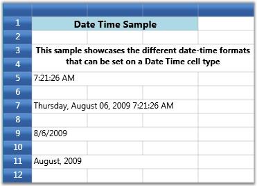

::: {style="DISPLAY: none"}
{#d2h_url_template}{#d2h_package_url style="WIDTH: 0px; DISPLAY: none; HEIGHT: 0px"}
:::

:::::: {.d2h_secondary_topic style="PADDING-BOTTOM: 10pt; MARGIN: 0pt; PADDING-LEFT: 0pt; PADDING-RIGHT: 0pt; PADDING-TOP: 0pt"}
##### Date Time Cells {#date-time-cells style="tab-stops: 0pt"}

The Date Time cells incorporate DateTimeEdit controls in grid cells that will help you to interactively set a date and time value. The style properties below are applicable to this cell type.

 

Table 7: GridStyleInfo Property**[]{style="COLOR: #15428b"}**

::: {align="center"}
  -------------------------- -----------------------------------------------------------------------------------------
  GridStyleInfo Property     Description
  CellType                   Set to "DateTimeEdit"
  DateTimePattern            Sets the date-time pattern. The table below lists the available patterns with examples.
  MaxDateTime, MinDateTime   Sets the maximum and minimum values for a DateTime cell.
  IsCalendarEnabled          When true, enables the calendar popup
  IsWatchEnabled             When true, enables the watch popup
  NoneDateText               Specifies the text to be displayed when no date is set
  -------------------------- -----------------------------------------------------------------------------------------
:::

 

Table 8: Date and Time Pattern**[]{style="COLOR: #15428b"}**

::: {align="center"}
  ------------------------------ ---------------------------------------
  Date and Time Pattern          Example
  Short Date                     8/6/2009
  Long Date                      Thursday, August 06, 2009
  Long Time                      7:01:33 AM
  Short Time                     7:01 AM
  Full Date Time                 Thursday, August 06, 2009 7:01:33 AM
  MonthDay                       August 06
  RFC1123                        Thu, 06 Aug 2009 07:01:33 GMT
  Sortable Date Time             2009-08-06T07:01:33
  Universal Sortable Date Time   2009-08-06 07:01:33Z
  Year Month                     (August, 2009 is correct)August, 2009
  ------------------------------ ---------------------------------------
:::

**[]{style="COLOR: #15428b"}** 

Setting Date and Time Cells with Different Date Time Patterns.

+-----------------------------------------------------------------------------------------------------------------------+
| [\[C#\]]{style="FONT-FAMILY: 'Courier New'; COLOR: black"}                                                            |
|                                                                                                                       |
| []{style="FONT-FAMILY: 'Courier New'"}                                                                                |
|                                                                                                                       |
| [grid.Model\[5, 1\].CellType = [\"DateTimeEdit\"]{style="COLOR: #a31515"};]{style="FONT-FAMILY: 'Courier New'"}       |
|                                                                                                                       |
| [grid.Model\[5, 1\].DateTimeEdit.DateTimePattern = DateTimePattern.LongTime;]{style="FONT-FAMILY: 'Courier New'"}     |
|                                                                                                                       |
| [grid.Model\[5, 1\].CellValue = DateTime.Now;]{style="FONT-FAMILY: 'Courier New'"}                                    |
|                                                                                                                       |
| []{style="FONT-FAMILY: 'Courier New'"}                                                                                |
|                                                                                                                       |
| [grid.Model\[7, 1\].CellType = [\"DateTimeEdit\"]{style="COLOR: #a31515"};]{style="FONT-FAMILY: 'Courier New'"}       |
|                                                                                                                       |
| [grid.Model\[7, 1\].DateTimeEdit.DateTimePattern = DateTimePattern.FullDateTime;]{style="FONT-FAMILY: 'Courier New'"} |
|                                                                                                                       |
| [grid.Model\[7, 1\].CellValue = DateTime.Now;]{style="FONT-FAMILY: 'Courier New'"}                                    |
|                                                                                                                       |
| []{style="FONT-FAMILY: 'Courier New'"}                                                                                |
|                                                                                                                       |
| [grid.Model\[9, 1\].CellType = [\"DateTimeEdit\"]{style="COLOR: #a31515"};]{style="FONT-FAMILY: 'Courier New'"}       |
|                                                                                                                       |
| [grid.Model\[9, 1\].DateTimeEdit.DateTimePattern = DateTimePattern.ShortDate;]{style="FONT-FAMILY: 'Courier New'"}    |
|                                                                                                                       |
| [grid.Model\[9, 1\].CellValue = DateTime.Now;]{style="FONT-FAMILY: 'Courier New'"}                                    |
|                                                                                                                       |
| []{style="FONT-FAMILY: 'Courier New'"}                                                                                |
|                                                                                                                       |
| [grid.Model\[11, 1\].CellType = [\"DateTimeEdit\"]{style="COLOR: #a31515"};]{style="FONT-FAMILY: 'Courier New'"}      |
|                                                                                                                       |
| [grid.Model\[11, 1\].DateTimeEdit.DateTimePattern = DateTimePattern.YearMonth;]{style="FONT-FAMILY: 'Courier New'"}   |
|                                                                                                                       |
| [grid.Model\[11, 1\].CellValue = DateTime.Now;]{style="FONT-FAMILY: 'Courier New'"}                                   |
+-----------------------------------------------------------------------------------------------------------------------+

[]{style="COLOR: #15428b"} 

Output

The following output is generated using the code above.

[]{style="COLOR: #15428b"} 

{border="0"}

Figure 28: DateTime Cell

::: {style="BORDER-BOTTOM: windowtext 1pt solid; BORDER-LEFT: medium none; PADDING-BOTTOM: 1pt; MARGIN-TOP: 9pt; PADDING-LEFT: 0pt; PADDING-RIGHT: 0pt; MARGIN-BOTTOM: 9pt; BORDER-TOP: windowtext 1pt solid; BORDER-RIGHT: medium none; PADDING-TOP: 1pt"}
{border="0"}Note: For complete code, please refer to the following browser sample.
:::

 

***\...\\My Documents\\Syncfusion\\EssentialStudio\\\<Version Number\>\\WPF\\Grid.WPF\\Samples\\3.5\\WindowsSamples\\Cell Types\\Date Time Cell Demo***

**** 

**** 

[]{#related-topics}
::::::
